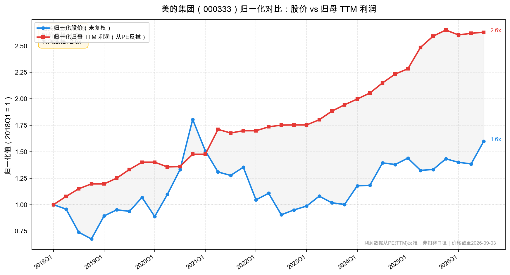

# 美的集团（000333）2026 中报财报速览——汇率搅乱利润表，主业稳中有进

> 报告期：2026 年 1—6 月｜披露日：2026 年 8 月 28 日｜未经审计。数据取自公司《2026 年半年度报告》。单季数字由半年报减一季报推算。市值、PE 按 9 月 3 日收盘实测。

**一句话结论：** 营收微增、归母利润微增，但扣非净利大跌 25%——表面波动剧烈，实则是汇率和会计分类制造的假象。外币负债的汇兑损失计入经常性损益，而用于套保的衍生工具收益计入非经常性损益，把扣非利润"截走"了 68 亿。真实经营情况：智能家居稳住基本盘（+4.3%），楼宇和机器人双位数增长，工业技术承压（-12.7%），整体毛利率微降 0.36 个百分点。当前 PE(TTM) 15 倍，处于 2018 年以来约 55% 分位，估值中性。

**主要指标速览**

| 指标 | 2026H1 | 2025H1 | 同比 |
|------|--------|--------|------|
| 营业收入 | 2,600.42 亿 | 2,511.24 亿 | +3.55% |
| 归母净利润 | 264.46 亿 | 260.14 亿 | +1.66% |
| 扣非归母① | 195.95 亿 | 262.35 亿 | -25.31% |
| 整体毛利率 | 25.26% | 25.62% | -0.36pct |
| 经营现金流 | 375.52 亿 | 372.81 亿 | +0.73% |
| 净现金（6月末）② | 约 279 亿 | — | 现金 906 亿 vs 有息负债 627 亿 |
| 应收账款（6月末） | 619.55 亿 | — | 较年初 +53.1% |
| 商誉（6月末） | 315.77 亿 | — | 占归母净资产 14.8%，当期减值约 16.5 亿 |
| 中期分红率 | 14.1% | — | 每股 0.5 元 |
| PE(TTM) | 15.0 倍 | — | 2018 年以来约 55% 分位 |

> ①扣非跌幅主要是汇率会计分类所致（外币货币性项目汇兑损失计经常性损益、套保衍生工具收益计非经常性损益），主业并未恶化，解读见利润表节。②净现金 = 货币资金 − 短借 − 长借，未含一年内到期负债及应收款项融资。利润表/现金流行对比 2025H1；期末科目行对比基准为 2025 年末。市值、PE 按 9 月 3 日收盘实测。

---

## 一、它赚不赚钱？——利润表

上半年营收 2600.42 亿元，同比 +3.55%，在国内家电零售整体下滑 9.9% 的背景下，跑出了显著的超额收益——份额集中的逻辑继续兑现。

**分业务看，冷热不均：**

- **智能家居** 1743.4 亿（+4.27%），毛利率 27.95%（-0.57pct）。基本盘稳住了，在行业下滑大环境下跑赢大盘。
- **楼宇科技** 216.3 亿（+10.84%），毛利率 29.61%（+0.28pct）。增速最快、毛利还在升，是当前最健康的增长极。
- **机器人与自动化** 166.2 亿（+10.27%），毛利率 20.90%（-1.86pct）。收入增速不错，但毛利率承压。库卡国内份额升至第二，重载机器人优势明显。
- **工业技术** 131.4 亿（-12.72%），毛利率 14.75%（-2.13pct）。收入和毛利率双降，是最大短板——新能源汽车热管理需求疲软可能是主因。

海外收入 1131.3 亿，占比 43.5%，同比 +5.54%，快于国内（+2.07%），全球化继续深化。但海外毛利率 26.28%（-0.53pct），低于国内 24.46% 的毛利率吗？不对——海外毛利率 26.28% 其实高于国内，差距约 1.8 个百分点，只是海外毛利降幅略大。

整体毛利率 25.26%，同比下降 0.36 个百分点。原材料成本上涨（公司提到原材料成本持续走高）和产品结构变化是主要原因，下降幅度不大，在可控范围。

**扣非净利润暴跌 25%，是这篇财报最"吓人"的数字，但也是最需要拆穿的假象。**

归母净利润 264.46 亿元，同比 +1.66%，基本持平；但扣非归母只有 195.95 亿元，同比 -25.31%。差额高达 68.5 亿，全部来自非经常性损益，其中约 67.5 亿是衍生金融工具的公允价值变动和处置收益。

**为什么会这样？** 公司的解释是：人民币汇率持续走高，外币货币性项目产生的汇兑损失计入**经常性**损益，而管理外汇风险的衍生金融工具产生的收益计入**非经常性**损益。一边是损失扣了经常性利润，另一边是套保收益算进了非经常性——两下夹击，扣非利润就被"截胡"了。

打个比方：公司有一批美元负债，人民币升值导致负债折算后多还了钱，这部分损失记在经营费用里；同时公司买了外汇远期来对冲，对冲赚的钱却被归类为"非经常"。实际上损失和收益是一体两面，都是汇率波动的结果，把它们拆开看扣非利润，就只看到了损失的那半面。

财务费用的数据印证了这一点：去年上半年财务净收入 59.88 亿元（汇兑收益贡献大），今年上半年变成了财务净支出 32.73 亿元，一正一反差了 92.6 亿元——这 90 多亿的变动，绝大多数都是汇率摆动造成的。

**如果把汇率因素加回去，真实的经常性利润增速大概在中个位数水平**，与营收增速基本匹配，不是真的恶化了。

**Q2 单季（=H1−Q1）收入加速，利润分化加剧。** Q2 营收 1289.4 亿，同比 +4.59%，比 Q1（+2.55%）明显加速；Q2 归母净利 137.7 亿，同比 +1.32%，与 Q1（+2.03%）差不多；但 Q2 扣非净利仅 86.3 亿，同比 -35.98%，比 Q1（-14.0%）跌得更深——说明 Q2 汇率波动的影响更大。

费用方面，销售费用 215.46 亿（-6.54%），降费幅度大于收入降幅，效率优化在持续；管理费用 76.15 亿（+4.94%），与收入增速匹配；研发费用 84.67 亿（-3.41%），罕见地下滑——公司一直在强调科技领先，研发投入反而降了，需要后续观察是短期节奏还是趋势性变化。

归母净利率 10.17%，同比微降 0.19 个百分点。看起来没怎么变，但里面藏着 90 多亿的汇率摆动——把这个扰动拿掉，真实的净利率变化要单独看。

---

## 二、赚到的钱到手了吗？——现金流量表

经营活动现金流净额 375.52 亿元，同比 +0.73%，与净利润增速（+1.66%）基本同步。经营现金流/归母净利润 = 1.42，比值很高，盈利质量扎实——白电龙头的现金流成色向来不需要怀疑。

收现比 88.2%（销售商品收现 2292.62 亿 / 营收 2600.42 亿）。家电行业收现比普遍低于 100%，因为有大量票据结算和渠道账期，88% 属于正常水平。

**自由现金流约 325 亿（粗估）。** 美的资本开支没有直接披露在现金流量表主表的"购建固定资产"一行（需要翻附注），但从历史规律看，美的年资本开支约 100 亿左右，上半年约 50 亿。经营现金流 375 亿 − 约 50 亿资本开支 = 自由现金流约 325 亿。这个规模在 A 股制造业里属于第一梯队。

期末现金及等价物 906.43 亿元，比年初增加 54 亿。账面现金充裕。

需要注意的是：投资活动现金流从去年净流入 75.5 亿变成了今年净流出 158.7 亿（-310%），公司说是"收回投资收到的现金减少"——也就是理财到期再投的节奏变化，不是主业投资大额加码，不影响基本面判断。

---

## 三、家底厚不厚？——资产负债表

期末总资产 6431.02 亿元，同比增长 5.64%。资产负债率约 66.9%——对家电制造业来说不算低，但美的的负债里大量是经营性负债（应付账款、合同负债），不是有息负债，要分开看。

有息负债合计约 627 亿元（短期借款 473 亿 + 长期借款 154 亿），而货币资金 906 亿，**净现金约 279 亿**，加上 149 亿应收款项融资（银行承兑汇票），可动用资金超过千亿，家底厚实。

**排雷检查：**

- **商誉：315.77 亿元，占归母净资产 14.8%。** 美的历史上收购了库卡、东芝白电、万东医疗、合康新能、科陆电子等，商誉体量不小。14.8% 还没到 30% 的警戒线，但今年上半年已经计提了约 16.5 亿商誉减值（资产减值损失同比增 351%，公司说是商誉减值增加）。需要跟踪哪些子公司在减值、减值是否充分。经验上商誉超过净资产三成就该警惕，这里还有距离，但连续减值是信号。
- **应收账款大增：619.55 亿，比年初增加 215 亿（+53%），升幅显著。** 从 404.5 亿跳到 619.5 亿，半年增了 200 多亿，远超营收增速（+3.55%）。公司没在中报里解释原因。可能的原因：ToB 业务（楼宇、机器人、工业技术）占比提升，这类业务账期更长；也可能是渠道回款放缓。需要三季报继续观察，如果 Q3 还在快速增长就要警惕。
- **存货减少：554.41 亿，比年初降 92 亿（-14.2%）。** 存货大幅下降是好事——说明公司在主动去库存，没有压货。在行业需求疲软的背景下，主动降库存是健康的信号。
- **合同负债：454.58 亿，比年初降 15 亿（-3.3%）。** 小幅下降，基本稳定。
- **货币资金：906 亿，比年初增 54 亿。** 现金储备充裕。
- **大股东质押：** 未发现控股股东质押情况（美的控股为第一大股东，无质押记录披露）。
- **关联交易：** 金额较小，属正常范围。
- **非标意见：** 无，中报未经审计但无保留意见表述。
- **回购股份：** 上半年回购金额不小（现金分红含回购方式的合计 106.9 亿），说明公司认为当前价位有吸引力。

---

## 四、明年还能赚吗？——看未来

增长引擎在切换：智能家居基本盘靠份额和结构升级稳住，第二增长曲线靠 ToB 业务（楼宇 + 机器人），工业技术短期承压。

**智能家居是压舱石。** 国内家电大盘 -9.9% 的情况下，美的智能家居收入还能 +4.3%，靠的是份额提升和产品结构升级。高端品牌 COLMO、东芝持续推进，线上线下渠道继续保持行业第一。这个板块的增速不可能再回到高增长，但胜在稳、现金流好。

**楼宇科技是当前最亮眼的增长极。** 收入 +10.84%、毛利率还升了 0.28 个百分点，量利齐升。中央空调国产品牌份额已经超过 45%，美的中央空调国内份额超 22% 稳居第一，多联机超 29%，离心机组也拿了第一。数据中心空调、建筑节能改造、国产替代是长期逻辑。

**机器人与自动化收入增长不错，但毛利率承压。** 库卡国内市场份额升到第二（9.7%），300kg 以上重载机器人份额突破 50%。人形机器人（"美罗"工业版、"美拉"家庭版）在推进产品化，但目前还在投入期，短期内贡献不了利润。这块要观察毛利率能不能稳住。

**工业技术是拖后腿的。** 收入 -12.7%、毛利率降 2.13pct，新能源汽车热管理行业需求疲软可能是主因。要看下半年新能源汽车和储能行业能不能企稳。

**股东回报：** 中期每 10 股派 5 元（每股 0.5 元），合计 37.24 亿，分红率 14.1%——这个比例不算高。但加上回购的现金分红总额达到 106.9 亿，占归母 40.4%。美的近年一边分红一边持续回购，回报方式多样化。按现价 87.25 元、中期分红 ×2 粗算，股息率约 1.1%，不高。

**需要跟踪的变量：**
- 人民币汇率走势（决定了财务费用和扣非利润的"失真"程度）；
- 应收账款大增的原因和后续走势；
- 工业技术板块（新能源汽车热管理）能否企稳；
- 机器人业务毛利率能否改善；
- 商誉减值的持续情况。

---

## 红绿灯速判

🔴 **红灯：均未触发**——无大存大贷、无控股股东质押、无非标意见、无重大关联交易、无违规担保、无占用资金。

🟡 **黄灯：四项**——扣非利润失真（汇兑与套保分列经常/非经常，扣非跌25%是假象）；应收账款半年增 53%（远超营收增速，需跟踪）；商誉 316 亿 + 当期减值 16.5 亿（占净资产 14.8%，尚未到警戒线但需跟踪）；工业技术板块收入利润双降（-12.7%/-2.1pct）。

🟢 **绿灯：九项**——收入跑赢行业（+3.5% vs 行业-9.9%）、经营现金流/净利达 1.42 倍、净现金 279 亿（现金 906 亿 vs 有息负债 627 亿）、存货大幅去化（-14.2%）、楼宇科技量利齐升（+10.8%/+0.3pct）、海外收入加速（+5.5% 快于国内 +2.1%）、销售费用率下降（-0.9pct）、持续回购（上半年回购约 70 亿）、ROE 稳（11.33% 基本持平）。

---

## 估值与观察点

把股价和利润线放在同一张图上（归一化起点 2018 年初），能看得很清楚：归母 TTM 利润从 170 亿级爬升到 440 亿级，涨了 2.6 倍；股价只涨了 1.6 倍。利润线在股价线上方，中间的距离就是估值收缩的幅度——2018 年以来，美的用利润增长消化了估值，股价没涨但更扎实了。

截至 2026 年 9 月 3 日，2018 年以来股价涨 1.60 倍、归母 TTM 利润涨 2.63 倍，相关系数 0.59——相关性不如纯消费股高，因为美的有周期属性（家电+工业），利润和估值波动都更大。利润线从 2021 年高点回落过一轮，目前又回到高位附近。

按彼得·林奇的两线图法读：利润线在上、股价线在下，说明估值被压缩了。如果利润能稳住，股价迟早追上来补估值；如果利润往下掉，那股价还得跟着利润走。美的现在的核心，是利润能不能稳住高位、第二曲线能不能继续放量。

**PE-TTM 口径推导：** 15.0 倍 = 总市值 6656.3 亿 ÷ TTM 归母约 443.8 亿（439.5 − 260.14 + 264.46）。

**2026E 外推：** 按 2025 年 H1 归母占全年比例 59.2% 外推，2026 年全年归母约 447 亿，对应 PE 约 14.9 倍。缺少 2023—2024 年同期拆分数据做三年平均，暂且用最近一年比例估算；白电空调旺季在 Q2、H1 占比偏高，外推时需注意季节因素。当前 PE(TTM) 与 2026E 基本持平，说明市场预期全年利润零增长。

**历史分位：** PE(TTM) 15.0 倍处于 2018 年以来约 55% 分位（2105 个交易日，东财数据自 2018 年 1 月起），中性略偏高。区间内最低 9.5 倍、最高 30.3 倍（2021 年白马股行情高点），中位数 14.5 倍。近 5 年约 85% 分位——近 5 年估值中枢下移，所以近 5 年分位更高。

估值中性偏中位，不便宜也不贵。买它赚的不是估值修复的钱，是业绩稳定增长 + 分红回购的钱。15 倍 PE 买一个全球家电龙头 + 楼宇/机器人第二曲线，赔率不算特别高，但确定性强。

**估值锚：15 倍值不值，核心看两件事：ToB 业务能不能持续放量、汇率这个干扰项什么时候回归中性。** 楼宇和机器人如果能维持双位数增长，逐渐把估值从"家电股"往"科技制造"拉，15 倍就不贵；如果 ToB 增长也下来、又回到纯家电逻辑，12—13 倍也不是没见过。汇率是短期噪音，不影响长期价值，但会影响近几期报表的"观感"。

**观察点：**
- **三季报（10 月底）：** 看应收账款能否回落、工业技术板块能否企稳，这是判断资产质量和增长质量的核心；
- **人民币汇率：** 如果人民币贬值回去，财务费用会反向修复，扣非和归母的差距会大幅收窄；
- **库卡与机器人业务：** 全年收入目标和毛利率走势，关系到第二增长曲线的成色；
- **研发投入：** 上半年研发费 -3.4%，是短期节奏还是趋势性降投入，需要验证。

---

如果您觉得这篇文章有启发，欢迎点赞、转发、关注！

风险提示：本文仅供参考，不构成投资建议。市场有风险，入市需谨慎。
