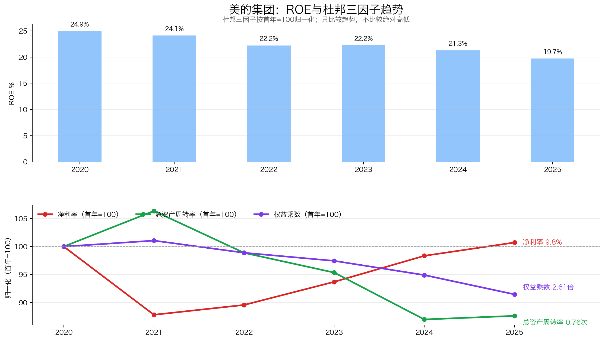
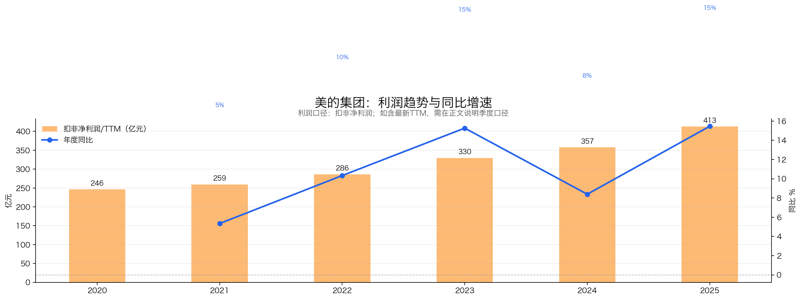
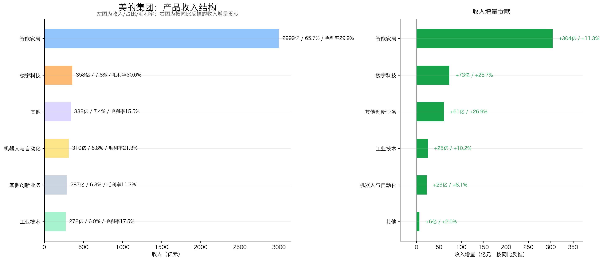
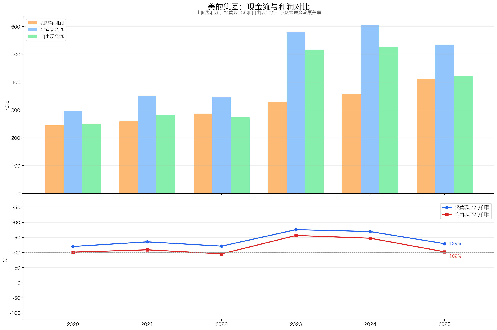
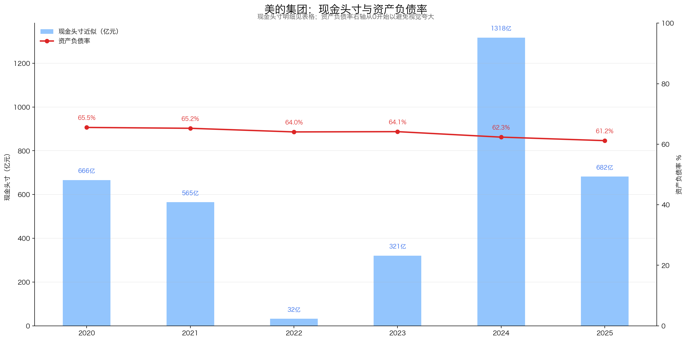
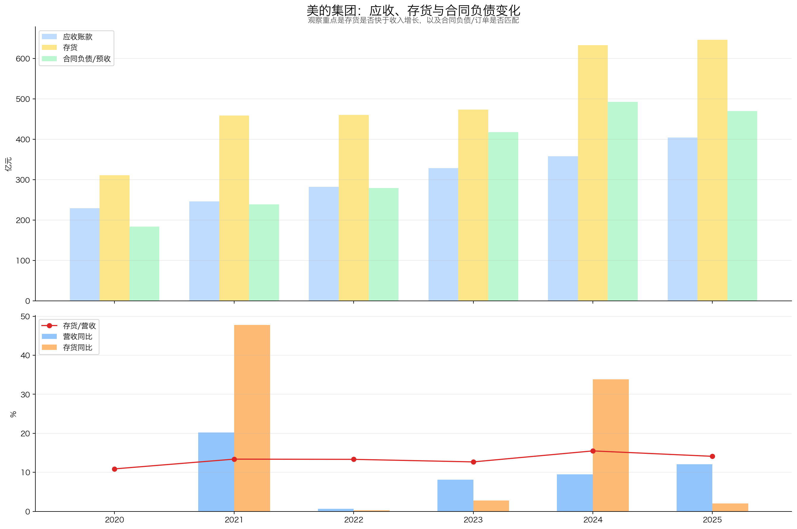
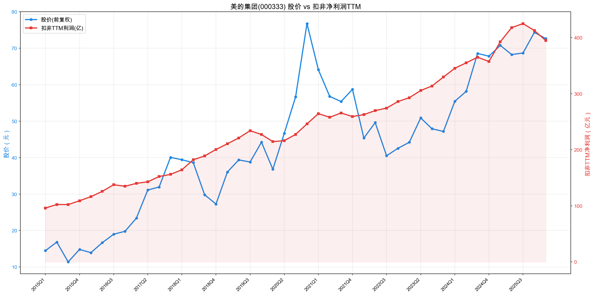

# 美的集团（000333）投资分析报告

> 数据截止：行情截至 2026-07-10 收盘；财务截至 2026Q1；年度数据截至 2025 年报。  
> 结论：**强烈关注（81/100）**。美的是高质量、全球化、现金流强的白电龙头，当前估值不贵；但 2026Q1 扣非利润下降、国内补贴高基数、ToB 盈利质量分化，决定了现在更适合“分批关注”，而不是仅凭低估值一次性重仓。

## 一、公司画像、能力圈与红线

**初筛结论：通过。**

- 公司画像：以智能家居为基本盘，向楼宇科技、工业技术、机器人与自动化等商业及工业解决方案扩张的全球化制造集团。
- 能力圈：核心家电业务容易理解；库卡、汽车零部件、楼宇解决方案等 ToB 业务需分部跟踪，不能简单按集团整体增速外推。
- 实际控制人与管理层：实际控制人为创始人何享健；经营管理由职业经理人体系主导，方洪波任董事长兼总裁。
- 红线：2025 年财报为标准无保留审计意见，未见一票否决项。资产负债率约 61%，但经营现金流强、现金头寸充足；负债率不能脱离供应链占款和金融业务结构单独判断。
- 核心问题：① 2026Q1 扣非利润下降是否只是阶段性；② 海外自主品牌与 ToB 能否持续快于家电基本盘；③ 楼宇科技之外的创新业务能否改善利润率和资本回报。

## 二、好行业：白电仍是好生意，但不是高增长行业

### 2.1 需求质量

白电已进入存量更新时代，需求来自更新换代、能效升级、以旧换新、海外渗透和全球份额提升。需求弱周期但并非无周期：房地产竣工、天气、补贴节奏、原材料与汇率都会造成年度波动。

2025 年国内以旧换新支撑行业需求，但也可能提前透支部分 2026 年需求。美的 2026Q1 营业收入同比仅增 2.55%，已显示高基数压力。

### 2.2 竞争格局与壁垒

白电集中度高，核心对手包括格力电器、海尔智家、海信家电；中央空调还面对大金、日立、开利等，工业机器人面对 ABB、发那科、安川等。

美的的壁垒不是单一品牌，而是：

1. 全品类、多品牌和全球渠道；
2. 压缩机、电机等核心零部件垂直整合；
3. 大规模采购、制造、研发和数字化运营；
4. 国内渠道深度与海外本地化供应链；
5. 智能家居现金流支持 ToB 业务长期投入。

### 2.3 议价权与替代风险

龙头对上游具备采购规模优势，对消费者具备一定品牌溢价，但家电并非强奢侈品牌，价格竞争仍会限制提价。产品不会被整体替代，风险主要是品类份额、渠道和技术路线被竞争对手替代。

**好行业评分：16/20**

| 子项 | 得分 | 满分 |
|---|---:|---:|
| 需求质量/非周期性 | 5 | 6 |
| 竞争格局 | 3 | 4 |
| 进入壁垒 | 4 | 4 |
| 上下游议价权 | 2 | 3 |
| 替代品威胁 | 2 | 3 |
| 小计 | 16 | 20 |

## 三、好公司·定性：护城河宽，第二曲线仍需验证利润质量

### 3.1 护城河

美的最强的优势是“规模效率 + 全品类 + 核心零部件 + 全球供应链”的系统能力。竞争者可以复制单一产品，却难在短期内复制覆盖研发、零部件、制造、渠道、售后和全球运营的完整体系。

### 3.2 复购与粘性

家电复购频率不高，消费者转换品牌成本也不高，因此不能套用消费品高频复购逻辑。美的的粘性主要来自全屋品类协同、渠道售后、品牌认知及 ToB 客户的工程交付和系统集成能力。

### 3.3 定价权

公司有结构升级和成本转嫁能力，但定价权属于“相对定价权”，不是可以长期无损提价的强定价权。2025 年综合毛利率 26.39%，与 2024 年的 26.42%基本持平，说明收入增长未明显牺牲整体毛利率。

### 3.4 管理层与资本配置

职业经理人机制、长期股权激励、稳定分红和持续回购是治理优势。2025 年公司现金分红与股份回购总额超过当年归母净利润；但回购应区分注销与员工激励用途，不能全部等同于向股东返现。董事长兼任总裁也意味着权力集中，需持续关注董事会制衡和接班安排。

**好公司·定性评分：17/20**

| 子项 | 得分 | 满分 |
|---|---:|---:|
| 护城河 | 7 | 7 |
| 复购/粘性/低替代性 | 4 | 5 |
| 定价权 | 3 | 5 |
| 管理层 | 3 | 3 |
| 小计 | 17 | 20 |

## 四、好公司·定量：利润真、现金流强，但 ROE 下行和 Q1 扣非下降需跟踪

### 4.1 ROE 质量与盈利模式

| 年份 | 加权 ROE | 销售净利率 | 总资产周转率 | 权益乘数 |
|---:|---:|---:|---:|---:|
| 2020 | 24.95% | 9.68% | 0.80 | 3.10 |
| 2021 | 24.09% | 8.50% | 0.88 | 3.07 |
| 2022 | 22.21% | 8.67% | 0.80 | 3.17 |
| 2023 | 22.23% | 9.07% | 0.75 | 3.19 |
| 2024 | 21.29% | 9.52% | 0.68 | 3.27 |
| 2025 | 19.70% | 9.75% | 0.76 | 2.76 |

注：ROE 为公司披露加权口径；杜邦三因子按平均资产、平均权益和营业总收入近似拆解，绝对值口径略有差异，主要用于看趋势。

结论：净利率已修复，但 ROE 从 2020 年的 24.95%降至 19.70%。2025 年下降主要来自去杠杆及权益基数扩大，而非利润率恶化；这比靠加杠杆维持 ROE 更健康，但长期回报中枢可能低于历史高位。

### 4.2 利润增长与持续性

| 年份 | 营业总收入（亿元） | 归母净利润（亿元） | 扣非归母净利润（亿元） | 扣非同比 |
|---:|---:|---:|---:|---:|
| 2020 | 2,857.10 | 272.23 | 246.15 | 8.32% |
| 2021 | 3,433.61 | 285.74 | 259.29 | 5.34% |
| 2022 | 3,457.09 | 295.54 | 286.08 | 10.33% |
| 2023 | 3,737.10 | 337.20 | 329.75 | 15.26% |
| 2024 | 4,090.84 | 385.37 | 357.41 | 8.39% |
| 2025 | 4,585.02 | 439.45 | 412.67 | 15.46% |
| 2026Q1 | 1,315.81 | 126.75 | 109.62 | -14.02% |

2022→2025 扣非净利润 3 年 CAGR 为 12.99%。2025 年利润增长快于收入，质量较好；但 2026Q1 归母净利润增长 2.03%、扣非下降 14.02%，说明非经常性损益和经营性利润出现明显分化，不能只看归母利润稳定。

### 4.3 产品结构与增长来源

| 2025 年业务 | 收入（亿元） | 占营业收入 | 同比 | 毛利率 |
|---|---:|---:|---:|---:|
| 智能家居 | 2,999.27 | 65.71% | 11.28% | 29.90% |
| 楼宇科技 | 357.91 | 7.84% | 25.72% | 30.58% |
| 机器人与自动化 | 310.11 | 6.79% | 8.05% | 21.31% |
| 工业技术 | 272.32 | 5.97% | 10.24% | 17.50% |
| 其他创新业务 | 287.19 | 6.29% | 26.94% | 11.26% |
| 其他 | 337.72 | 7.40% | 1.96% | 15.53% |

商业及工业解决方案合计收入 1,227.53 亿元，同比增长 17.47%，快于集团；其中楼宇科技兼具 25.72%的增速和 30.58%的毛利率，是质量最好的第二曲线。其他创新业务虽增长快，但毛利率仅 11.26%，不能把收入增长直接当作价值创造。

海外收入 1,959.48 亿元，占营业收入 42.93%，同比增长 15.92%，快于国内的 9.40%，全球化是更确定的增量来源。

### 4.4 现金流质量

| 年份 | 归母净利润 | 经营现金流 | 资本开支 | 自由现金流 | CFO/归母净利润 |
|---:|---:|---:|---:|---:|---:|
| 2023 | 337.20 | 578.98 | 83.29 | 495.69 | 1.72 |
| 2024 | 385.37 | 605.14 | 98.83 | 506.31 | 1.57 |
| 2025 | 439.45 | 533.46 | 111.42 | 422.04 | 1.21 |
| 2026Q1 | 126.75 | 145.29 | 21.43 | 123.86 | 1.15 |

注：自由现金流为经营现金流减购建长期资产现金支出的简化口径。

利润能转化为现金，2025 年自由现金流约 422 亿元，足以支撑高分红。但 CFO(经营现金流) 同比下降 11.84%，CFO/利润从 2024 年 1.57 降至 1.21，需要观察是否继续回落。

### 4.5 现金头寸与资产负债表安全性

2020—2025 年现金头寸趋势已经按各年年报逐项补齐：

| 年份 | 现金头寸（亿元） | 资产负债率 |
|---:|---:|---:|
| 2020 | 666.23 | 65.53% |
| 2021 | 564.87 | 65.25% |
| 2022 | 31.98 | 64.05% |
| 2023 | 320.60 | 64.14% |
| 2024 | 1,317.63 | 62.33% |
| 2025 | 682.03 | 61.17% |

2025 年末彼得林奇现金头寸：

| 项目 | 亿元 |
|---|---:|
| 货币资金 | 852.47 |
| 交易性金融资产 | 7.11 |
| 减：长期借款 | 126.59 |
| 减：应付债券 | 31.95 |
| 减：租赁负债 | 19.01 |
| 现金头寸 | **682.03** |
| 每股现金头寸 | **8.96 元** |

定期存款 119.43 亿元已包含在货币资金中，不能重复加计；其他流动资产不能整体视作现金；应收款项融资和短期借款不纳入林奇公式。

2026Q1 按可核实同口径计算，现金头寸约 777.49 亿元。资产负债率从 2024 年末 62.33%降至 2025 年末 61.17%、2026Q1 进一步降至 60.02%。短期借款虽不在林奇公式中扣除，但仍需由存货、应收和经营现金流覆盖。

### 4.6 营运质量

| 年份 | 应收账款（亿元） | 存货（亿元） | 合同负债（亿元） | 资产负债率 |
|---:|---:|---:|---:|---:|
| 2020 | 229.78 | 310.77 | 184.01 | 65.53% |
| 2021 | 246.36 | 459.24 | 239.17 | 65.25% |
| 2022 | 282.38 | 460.45 | 279.60 | 64.05% |
| 2023 | 328.85 | 473.39 | 417.65 | 64.14% |
| 2024 | 357.99 | 633.39 | 492.55 | 62.33% |
| 2025 | 404.50 | 646.29 | 469.93 | 61.17% |
| 2026Q1 | 525.37 | 578.24 | 未完整披露 | 60.02% |

2025 年应收增速约 13.0%，略快于营业收入 12.1%；存货仅增约 2.0%，未见库存积压。2026Q1 应收较年初上升约 29.9%，是最需要观察的前瞻信号；同时存货下降约 10.5%，暂未形成“应收与库存同时恶化”。季度周转指标存在季节性，不可与全年周转率直接比较。

**好公司·定量评分：33/40**

| 子项 | 得分 | 满分 |
|---|---:|---:|
| ROE 质量与盈利模式 | 7 | 9 |
| 利润增长来源与持续性 | 5 | 7 |
| 现金流质量 | 6 | 7 |
| 现金头寸与资产负债表安全性 | 6 | 6 |
| 营运质量 | 4 | 5 |
| 产品结构与增长来源 | 5 | 6 |
| 小计 | 33 | 40 |

## 五、好时机：估值合理偏低，尚非极端低估

### 5.1 股价与扣非利润趋势

2015 年以来前复权股价约上涨 5.0 倍、扣非 TTM 利润约增长 4.1 倍，两者长期方向高度一致，相关系数约 0.89。图的双轴位置不能用于判断谁高谁低，只看趋势与增幅：股价长期表现略快于利润，说明估值扩张贡献了一部分收益；2021 年高估值回落后，当前定价重新靠近基本面。

### 5.2 当前估值

| 指标 | 2026-07-10 |
|---|---:|
| 收盘价 | 78.99 元 |
| 总市值 | 6,013.86 亿元 |
| PE-TTM（行情口径） | 13.61 倍 |
| 近十年可用序列 PE 分位 | 37.7%(同花顺：39.67%) |
| 扣非利润 TTM | 394.79 亿元 |
| 扣非 PE-TTM | 15.23 倍 |
| 扣现金后扣非 PE | 13.51 倍 |
| 2022→2025 扣非 3 年 CAGR | 12.99% |
| PEG（行情 PE / 3 年扣非 CAGR） | 1.05 |
| 2025 财年每股现金分红 | 4.30 元 |
| 静态股息率 | 5.44% |

说明：近十年估值接口可用数据共 2,066 个交易日，实际起点不足完整十年，因此 37.7%是“近十年可用最长序列”分位。现金分红由 2025 年中期每股 0.50 元与年末预案每股 3.80 元组成；年末方案尚以最终实施为准。

13.6 倍行情 PE、约 15.2 倍扣非 PE、PEG 约 1.05，属于合理偏低，而非极端低估。扣除 2025 年末现金头寸后，扣非 PE 约 13.5 倍，资产负债表安全垫改善了赔率。

### 5.3 毛估估

不采用券商预测，仅用历史经营能力做情景分析：

| 情景 | 经营假设 | 合理估值 | 判断 |
|---|---|---:|---|
| 保守 | 扣非利润中期低个位数增长，PE 11–13 倍 | 约 4,343–5,132 亿元市值 | 较当前仍有约 15%–28%估值回撤风险 |
| 中性 | 扣非利润中期约 8%–10%增长，PE 14–16 倍 | 约 5,527–6,317 亿元市值 | 当前大致处于合理区间 |
| 乐观 | 海外与 ToB 延续双位数增长，PE 17–19 倍 | 约 6,711–7,501 亿元市值 | 约有 12%–25%上行空间 |

上述只是估值敏感性，不是盈利预测。当前赔率尚可但不悬殊，真正的安全边际来自现金、分红和长期竞争力，而不是短期高增长。

**好时机评分：15/20**

| 子项 | 得分 | 满分 |
|---|---:|---:|
| 股价 vs 利润线 | 4 | 5 |
| PE 及历史分位 | 4 | 5 |
| PEG | 1 | 2 |
| 股息率 | 3 | 3 |
| 市场信号与预期差 | 1 | 2 |
| 毛估估 | 2 | 3 |
| 小计 | 15 | 20 |

## 六、投资结论：值不值得下注，拿不拿得住？

### 6.1 商业模式好不好（Right Business）

#### 6.1.1 业务简单可持续、不易被替代

家电和工业设备需求长期存在，业务容易理解，成熟品类不会轻易消失；但单个家电品牌可以被替换，国内需求也受地产和更新周期影响。美的通过多品类、全球化和ToB业务降低单一市场波动。

#### 6.1.2 竞争格局清晰、护城河深厚、有定价权

美的基本符合。家电龙头格局清晰，规模、供应链、渠道、研发、成本效率和全球制造构成复合护城河；定价权不是奢侈消费式提价，而是依靠产品升级、成本控制和全球份额维持利润率。

#### 6.1.3 轻资本投入、高资产回报率、自由现金流好

美的并非纯轻资产，但周转效率和资本回报较高。2025年经营现金流约533亿元、资本开支约111亿元、简化自由现金流约422亿元，现金头寸约682亿元，主业能够覆盖分红和第二曲线投入，财务质量优秀。

#### 6.1.4 有长期增长空间

国内家电已成熟，增长主要来自海外、自有品牌、产品升级和ToB业务。长期空间仍在，但2026Q1扣非利润下降14.02%说明第二曲线尚未完全抵消短期波动，不能把成熟龙头误写成无周期高成长。

### 6.2 管理层怎么样（Right People）：经营效率与全球化能力强，需验证逆风期资本配置

管理层长期在效率、品类扩张和全球化上执行较好，分红与现金积累也支持股东回报；后续重点是ToB投入、海外资产和回购分红能否持续提高每股价值，而非追求规模本身。

### 6.3 是不是好价格（Right Price）：合理偏低，短期利润仍需验证

当前约13.6倍行情PE、约5.4%静态股息率和厚现金提供较好下限，价格有吸引力；但2026Q1利润下滑是反面证据。更准确的定位是“质量高、价格合理偏低、短期增长待验证”，不是增长无忧的明显低估。

### 6.4 胜率与赔率

**胜率**

**中高。** 白电龙头格局、全球供应链、全品类能力、现金流和现金头寸共同提高了经营下限。美的不是依赖单一爆品的公司，抗风险能力优于大多数制造企业。

**赔率**

**中等偏上。** 当前估值合理偏低、股息率较高，扣现金后估值更具吸引力；但估值分位并不极端，且 2026Q1 扣非利润下降，短期利润增速存在下修风险。

### 6.5 长期持有检查项

适合，但前提是接受：

- 国内白电进入成熟期，长期回报更多依赖份额、海外、效率、分红与回购；
- ToB 业务并非天然高质量，需要逐项验证毛利率、现金流和资本回报；
- ROE 可能从历史 20%以上逐步回落至更正常水平。

### 6.6 评级与行动

**最终判断：美的是业务成熟、护城河较深、资本回报和自由现金流优秀的全球制造龙头；当前价格具备吸引力，值得强烈关注，但加仓仍应验证扣非利润恢复。**

**评级：强烈关注。** 适合作为核心候选分批建仓或纳入重点观察，不建议仅因 13–15 倍 PE 就忽略 Q1 扣非下降。更好的加仓信号是：扣非利润恢复增长、应收增速回落、海外和楼宇科技继续兑现，同时估值仍处于合理偏低区间。

## 七、投资逻辑与证伪条件

### 7.1 投资逻辑

1. 国内家电成熟但格局集中，美的凭系统性效率持续获得份额和现金流。
2. 海外收入占比已接近 43%，本地化、自主品牌和全球供应链带来第二增长空间。
3. 商业及工业解决方案增长快于集团，楼宇科技已表现出较好的增速和毛利率。
4. 强经营现金流、稳定分红、回购与厚现金头寸共同支撑股东回报。
5. 当前估值未对高增长定价，若中低双位数增长恢复，回报可由利润增长、股息和温和估值修复共同构成。

### 7.2 证伪条件

出现以下情况应降级或退出：

- 连续两个以上季度扣非利润同比下降，且收入增长也持续弱于行业；
- 智能家居份额下滑，或价格战使毛利率连续下降超过 2 个百分点；
- 海外业务增速显著低于集团，贸易壁垒、汇率或本地运营使海外利润率持续恶化；
- 楼宇科技增速降至个位数，机器人与创新业务长期不能改善毛利率和现金回报；
- 经营现金流连续两年低于归母净利润，自由现金流不能覆盖分红；
- 应收增速持续显著快于收入、存货同步上升，出现渠道压货或回款恶化；
- 现金头寸持续下降，同时有息债务、商誉减值或大额低回报并购上升；
- 管理层激励、回购或关联交易明显损害中小股东利益；
- 在经营增速未改善时，PE 回到历史高位，估值透支未来。

---

## 八、维度打分汇总

| 模块 | 得分 | 满分 |
|---|---:|---:|
| 好行业 | 16 | 20 |
| 好公司·定性 | 17 | 20 |
| 好公司·定量 | 33 | 40 |
| 好时机 | 15 | 20 |
| **总分** | **81** | **100** |

评分加总校验：16 + 17 + 33 + 15 = 81。按框架映射，>80 为“强烈关注”。未触发需要降档的一票否决项。

---

## 九、数据校验结果

### 正确

1. 2025 年营业收入 4,564.52 亿元、营业总收入 4,585.02 亿元，已明确区分口径。
2. 2025 年归母净利润 439.45 亿元、扣非归母净利润 412.67 亿元，与年报及同花顺年度表一致。
3. 2026Q1 归母净利润 126.75 亿元、扣非归母净利润 109.62 亿元，与季报及同花顺单季表一致。
4. 2022→2025 扣非 CAGR 按 3 个年度间隔计算，为 12.99%。
5. 2025 年经营现金流 533.46 亿元、资本开支 111.42 亿元、简化自由现金流 422.04 亿元。
6. 现金头寸按货币资金 + 交易性金融资产 − 长期借款 − 应付债券 − 租赁负债计算；未扣短期借款，未重复加定期存款。
7. 2025 产品结构、地区结构与毛利率来自年报营业收入分部口径。
8. 行情、总市值、PE 和历史估值序列为东方财富 2026-07-10 收盘数据。
9. 第四章六张图及股价—利润主图均已生成，链接存在。
10. 各模块子项之和等于小计，四个模块之和等于总分 81。

### 需持续验证

1. 2026Q1 扣非利润下降的具体非经常性损益与经营驱动，需要结合 2026 半年报验证。
2. 2026Q1 合同负债未按年报同等完整口径披露，未强行补值。
3. 2025 年末每股 3.80 元分红为年度方案，最终以实施公告为准。

### 口径提示

1. 同花顺 `main_simple.xls` 是单季度数据，Q4 不能误当全年累计值。
2. 年报债券章节扣非净利润 417.62 亿元为非归母口径；正文采用主要会计数据中的扣非归母净利润 412.67 亿元。
3. 同花顺销售净利率使用合并净利润口径，不能与归母净利率直接混同。
4. 近十年 PE 分位使用接口可得最长序列，实际约 2,066 个交易日，不足完整十年。

---

## 主要资料

- 美的集团《2025 年年度报告》
- 美的集团《2026 年第一季度报告》
- 美的集团《2024 年年度报告》
- 同花顺年度及单季度导出数据
- 东方财富估值历史、财务与行情接口
- yfinance 前复权股价（仅用于股价—利润趋势图）

> 本报告仅用于研究，不构成投资建议。
