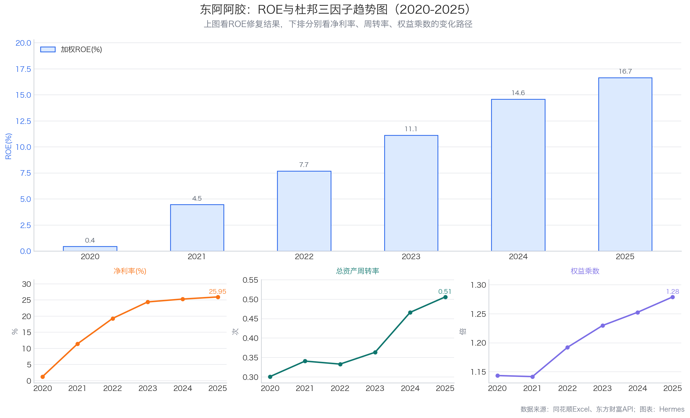
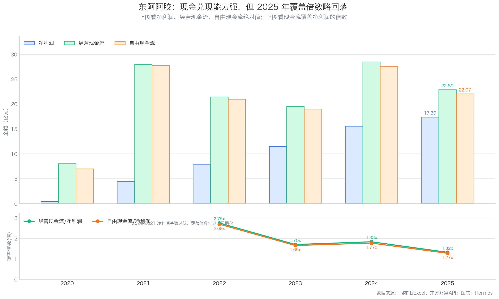
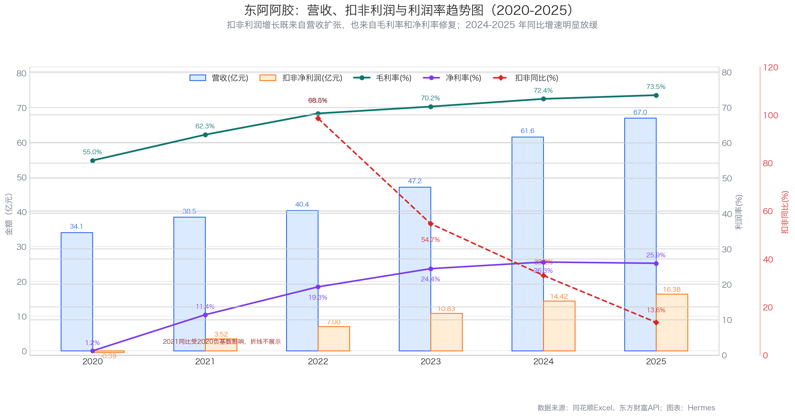
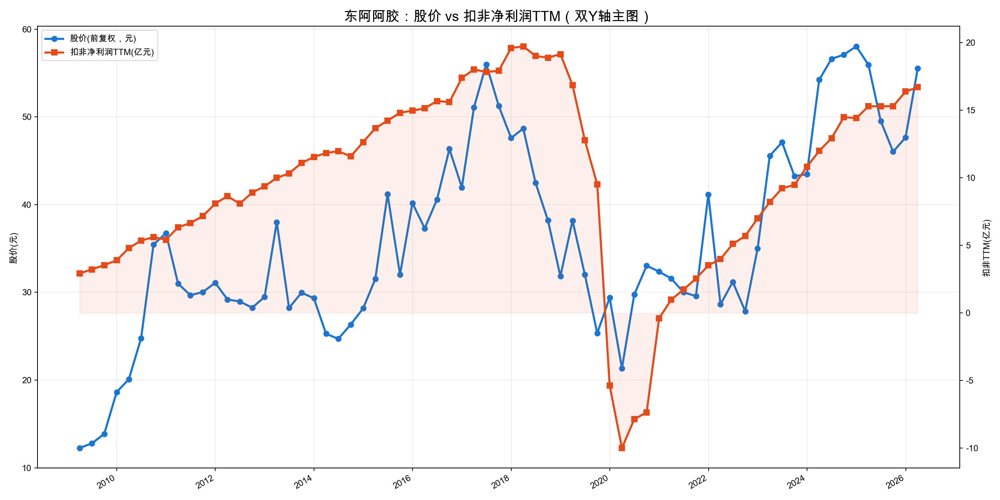
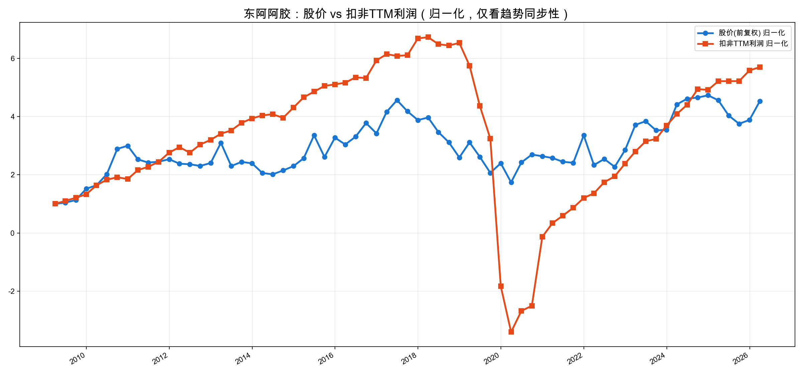

# 东阿阿胶 3R投资分析简报

日期：2026-08-11
公司：东阿阿胶（000423.SZ）
基准行情：2026-06-09 收盘价 49.08 元，总市值 316.06 亿元，PE(TTM) 17.87，PB 2.93
数据来源：2025年年报、2026年一季报、同花顺导出Excel、东方财富财务与估值API、yfinance前复权股价

---

## 一、公司概况

| 项目 | 内容 |
|---|---|
| 主营业务 | 阿胶块、复方阿胶浆、桃花姬阿胶糕、阿胶速溶粉及其他中成药/健康消费品 |
| 核心产品 | 阿胶及系列产品，2025年收入61.98亿元，占总营收92.5% |
| 赚钱方式 | 品牌中药 + 滋补消费品，靠品牌心智、价格带、产品结构升级和渠道效率赚钱 |
| 客户场景 | 滋补养生、气血调理、礼赠消费，偏中高端价格带 |
| 行业位置 | 阿胶行业品牌龙头与标准制定者，华润系央企背景 |
| 实际控制人 | 中国华润有限公司（通过华润东阿阿胶+华润医药投资合计持股33.70%） |
| 基准日市值 | 316.06亿元 |

一句话解释：东阿阿胶是靠"东阿"品牌和阿胶品类心智赚钱的品牌中药滋补品公司，高毛利、轻资本、厚现金，经历2019-2020年渠道出清后修复至稳健增长阶段。

---

## 二、3R决策摘要

| 模块 | 得分 | 满分 | 一句话判断 |
|---|---:|---:|---|
| Right Business（好生意） | 46.5 | 60 | 强品牌高毛利轻资本的好生意，但品类集中、增长空间有限 |
| Right People（好管理层） | 15.5 | 20 | 华润体系下修复兑现，治理稳健，但激励与效率中规中矩 |
| Right Price（好价格） | 13.5 | 20 | 估值合理偏低，扣现金后有吸引力，但非极端便宜 |
| **总分** | **75.5** | **100** | **关注** |

**评级：关注（75-84分档）**

门槛检查：
- Right Business 46.5/60 > 36 ✓（不因低估值买入红线）
- Right People 15.5/20 > 12 ✓（不作为核心持仓红线）
- Right Price 13.5/20 > 10 ✓（等待价格红线）

**一句话结论：** 东阿阿胶是品牌壁垒强、现金流好、资产负债表干净的稳增长型中药滋补品公司，当前估值合理偏低，但阿胶主品集中度高、增长弹性有限，更适合关注和逢低跟踪。

**最大矛盾：** 极好的现金流和现金头寸（扣现金后PE仅13.5倍）vs 核心品类增长天花板与历史渠道风险——便宜有便宜的道理，不是市场傻。

**关键验证条件：**
1. 2026半年报：合同负债、经营现金流、阿胶及系列产品收入增速是否健康。
2. 应收账款和存货是否持续抬头（压货信号）。
3. 高分红率是否建立在自由现金流可持续基础上，而非消耗历史现金。

---

## 三、Right Business：好生意吗？

**一句话判断：** 品牌强、毛利高、现金好，但品类集中度高、增长空间中等偏下。

### 3.1 业务简单可持续、不易被替代（10.5/14）

| 具体指标 | 得分 | 满分 | 判断依据 |
|---|---:|---:|---|
| 商业模式是否简单、容易理解 | 4.5 | 5 | 阿胶及系列滋补品，品牌消费属性，商业模式直观清晰 |
| 需求是否长期存在 | 3.5 | 5 | 传统滋补需求有文化基础和长期生命力，但不是高频刚需，消费频次低于大众食品饮料 |
| 周期性是否可控 | 1.5 | 2 | 非强周期，但受消费信心和礼赠经济影响，有一定可选消费属性 |
| 产品或品类替代风险 | 1.0 | 2 | 广义滋补品替代多（燕窝、花胶、保健品、药食同源等），消费者不必选阿胶 |

阿胶这个品类，需求确实长期存在，但它不是每天都吃的东西，价格又不便宜，可替代的滋补选择也多。不能按高频刚需消费品的标准给满分。

### 3.2 竞争格局清晰、护城河深厚、有定价权（14.5/18）

| 具体指标 | 得分 | 满分 | 判断依据 |
|---|---:|---:|---|
| 行业竞争格局 | 3.5 | 4 | 阿胶行业东阿一家独大，品牌分层清晰，低端产品难以撼动其心智地位 |
| 公司行业位置和市场份额 | 2.5 | 3 | 行业龙头和标准制定者，品牌第一；但精确行业分母和份额数据有限 |
| 护城河深度与持续性（含具体公司替代风险） | 4.5 | 6 | 品牌、原料、工艺、渠道、华润体系形成较深壁垒；但2019-2020年渠道出清说明护城河并非无条件稳固，提价和发货节奏出错会伤害品牌 |
| 定价权和成本传导能力 | 4.0 | 5 | 毛利率从2020年55%修复到2025年73.47%，阿胶及系列产品毛利率74.84%，具备较强定价权；但提价不能脱离真实动销，否则会重蹈渠道库存覆辙 |

东阿阿胶的品牌护城河是真的深——普通阿胶卖几十块，东阿阿胶卖几千块还有人买。但护城河不是铜墙铁壁，历史上渠道出清就是教训：品牌强不等于可以无限提价+压货。

### 3.3 轻资本投入、高资产回报率、自由现金流好（13.0/14）

| 具体指标 | 得分 | 满分 | 判断依据 |
|---|---:|---:|---|
| 资本投入强度与产能利用率 | 4.0 | 4 | 年资本开支不足1亿元（2025年0.83亿），相对67亿营收极度轻资本 |
| ROE/ROIC水平及历史趋势 | 3.0 | 4 | ROE从2020年0.44%修复到2025年16.66%，趋势好但绝对值中等（不算顶级的25%+），且修复空间在收窄 |
| 杠杆依赖与杜邦质量 | 2.0 | 2 | 权益乘数仅1.28，ROE主要靠净利率（25.95%）和周转率（0.51），不是靠加杠杆 |
| 经营现金流和自由现金流 | 4.0 | 4 | 2020-2025年FCF持续高于净利润，2025年FCF 22.07亿 > 净利润17.39亿，现金含量极好 |

这是东阿阿胶最亮眼的地方：生意模式非常轻，赚的钱基本都是真金白银，不需要持续大额资本投入。ROE修复的质量也很高——不是加杠杆加出来的，是净利率和周转改善出来的。扣分项是ROE绝对值只有16-17%，和顶级消费龙头比还有差距。

### 3.4 盈利成长真实、稳定、可持续（5.5/8）

| 具体指标 | 得分 | 满分 | 判断依据 |
|---|---:|---:|---|
| 3年、5年利润增长 | 1.0 | 2 | 2022-2025扣非CAGR约32.8%，但含显著低基数修复（2020年扣非亏损），不能按高成长股理解 |
| 增长稳定性 | 0.5 | 1 | 2019-2020年利润大幅下滑，历史稳定性差；修复期波动大，尚需更长时间验证稳态增长 |
| 增长来源质量 | 1.5 | 2 | 收入扩张+利润率提升双驱动，但利润率修复已接近瓶颈（净利率已达26%），后续增长更多要靠收入 |
| 最新利润趋势 | 1.5 | 2 | 2026Q1扣非净利润同比仅+7.69%，增速已从修复期高增长切向稳健增长阶段 |
| 利润与现金流匹配 | 1.0 | 1 | FCF长期高于净利润，利润现金含量充足 |

利润增长这块要打折看。前几年30%+的增长，很大一部分是从坑里爬出来的修复，不是可持续的增速。现在利润率已经修复到26%左右，再往上空间不大了，以后更多得靠收入真实增长，速度大概率就是个位数到双位数。

### 3.5 有长期增长空间（3.0/6）

| 具体指标 | 得分 | 满分 | 判断依据 |
|---|---:|---:|---|
| 核心业务和行业空间 | 1.0 | 2 | 阿胶品类有天花板，消费频次不高、价格带偏高端，行业整体不是大蓝海 |
| 市场份额提升空间 | 1.0 | 2 | 已是行业龙头，份额继续大幅提升的空间有限；更多是行业整体增长和价格带升级 |
| 地域扩张与第二曲线 | 0.5 | 1 | 桃花姬、速溶粉等健康消费品增速快（2025年其他药品及保健品+63.65%），但体量仍小（3.86亿，占比5.8%），尚不足以支撑第二曲线 |
| 再投资回报及增长质量 | 0.5 | 1 | 业务轻资本，再投资需求小，增长更多靠内生效率而非大额投入；高分红说明好的再投资机会有限 |

长期增长空间是东阿阿胶的短板。阿胶这个池子就这么大，公司已经是龙头了，新品类还在早期。不能按成长股给估值，更像"稳增长 + 高分红"的现金牛。

### Right Business 小计

| 大维度 | 得分 | 满分 |
|---|---:|---:|
| 业务简单可持续、不易被替代 | 10.5 | 14 |
| 竞争格局清晰、护城河深厚、有定价权 | 14.5 | 18 |
| 轻资本投入、高资产回报率、自由现金流好 | 13.0 | 14 |
| 盈利成长真实、稳定、可持续 | 5.5 | 8 |
| 有长期增长空间 | 3.0 | 6 |
| **合计** | **46.5** | **60** |

---

## 四、Right People：好管理层吗？

| 维度 | 得分 | 满分 | 判断依据 |
|---|---:|---:|---|
| 诚信与治理 | 5.0 | 6 | 华润央企背景，治理规范，审计无保留意见；无大股东高质押、大额违规等治理红线 |
| 专注与经营能力 | 5.0 | 7 | 2020年后完成渠道出清、品牌修复和利润回升，经营能力得到验证；但央企体系下激励和效率中规中矩，职业经理人而非企业家驱动 |
| 资本配置与股东利益 | 5.5 | 7 | 轻资本、不盲目并购、高分红（2025财年分红率约100%），资本配置总体克制且重视股东回报；但接近全额分红也说明内部再投资机会有限，且高分红可持续性需观察 |

**一句话判断：** 华润入主后的管理层完成了渠道修复和经营重建的硬仗，治理稳健、资本配置克制；但央企体系下创新和激励是短板，更像"守成型"而非"进取型"管理层。

加分项：
- 2019-2020年主动去库存、控发货，短期业绩承压但长期修复了渠道健康。
- 修复后持续提高分红，2025财年中期+期末合计分红约17.42亿元，基本等于全年净利润。

扣分项：
- 历史上渠道出清本身就是管理层经营失误（连续提价+压货），虽已修复但说明并非零失误。
- 央企背景下决策效率、市场化激励相对民营企业有差距。
- 第二曲线进展偏慢，新品类尚未形成气候。

---

## 五、Right Price：好价格吗？

| 维度 | 得分 | 满分 | 判断依据 |
|---|---:|---:|---|
| 利润位置与股价利润匹配度 | 3.5 | 5 | 利润线仍在上行但增速放缓，股价从高点回落后与利润线基本匹配，不泡沫也不深度低估 |
| 当前估值与历史位置 | 4.0 | 6 | PE(TTM) 17.87倍，近十年PE分位约29%；扣现金后PE约13.46倍，更有吸引力；但不是历史极值便宜 |
| 股息及持有回报 | 2.0 | 3 | 2025完整财年股息率约5.51%，看似很高；但分红率接近100%，能否持续取决于利润和FCF稳定性，不能给满分 |
| 保守/中性情景与赔率 | 4.0 | 6 | 中性档未来2-3年上行空间约18%-34%，保守档下行约18%-23%；赔率中等偏好，下行有现金安全垫缓冲 |

### 5.1 股价 vs 利润线

判断：利润线从2020年底部持续修复上行，股价也同步回升。2025年以来股价从60元附近回落到49元左右，而利润线还在缓慢上行，说明估值在消化。当前不是"股价远远落后利润"的深度低估状态，而是"利润还在涨、估值已回落"的合理偏低区间。

### 5.2 估值一览

| 指标 | 数值 |
|---|---:|
| 最新收盘价（2026-06-09） | 49.08 元 |
| 总市值 | 316.06 亿元 |
| PE(TTM) | 17.87 倍 |
| 近十年 PE 分位 | 约 29% |
| 扣非净利润 TTM | 16.70 亿元 |
| 现金头寸（彼得林奇口径） | 约 91.32 亿元 |
| 扣现金后市值 | 约 224.74 亿元 |
| 扣现金后 PE | 约 13.46 倍 |

现金头寸构成（2025年报）：货币资金52.67亿 + 交易性金融资产38.15亿 + 一年内到期定期存款1.09亿 - 租赁负债相关0.60亿 ≈ 91.32亿元。

### 5.3 股息率

| 口径 | 每股分红 | 股息率（按49.08元） | 说明 |
|---|---:|---:|---|
| 2025年度期末分红 | 1.4355 元 | 2.92% | 年报预案实施，单次口径 |
| 2025完整财年（中期+期末） | 2.7056 元 | 5.51% | 中期分红+期末分红合计，更反映全年股东回报 |

注意：2025财年分红率约100%（分红额≈净利润），这种高分红不是常态。看股息率要打个折——能持续3-4%就不错了。

### 5.4 情景毛估估

| 情景 | 假设 | 估算市值 | 相对当前 |
|---|---|---:|---:|
| 中性档 | 2028年扣非利润22-23.5亿（年增约10%），给17-18倍PE | 374-423亿 | +18% ~ +34% |
| 保守档 | 增长放缓，利润17.5-18.5亿，市场给14倍PE | 245-259亿 | -23% ~ -18% |

补充：保守档若考虑91亿现金头寸和持续分红，实际亏损幅度会收窄；但现金不能代替主业——如果利润真下滑了，估值会一起压缩。

---

## 六、现在怎么办？

### 现在怎么做（最多3条）

1. **已持有：** 可继续持有，当作"稳增长+高分红"的配置型仓位；重点跟踪2026半年报的合同负债、经营现金流和阿胶主品收入增速。
2. **未持有：** 纳入观察池，当前价格可以小仓位试水，但不要按"深度低估"逻辑重仓；等扣现金后PE更低或半年报数据验证健康后再加仓。
3. **不适合：** 追求高成长、高弹性的投资者不用看了，东阿阿胶更像现金流型债券替代品。

### 什么情况下提高关注（最多3条）

1. 股价回调到扣现金后PE 10-11倍左右（对应股价约40元附近，具体看利润变化），同时利润线仍在上行。
2. 半年报验证：经营现金流恢复、合同负债不下降、应收和存货没有持续恶化——确认不是压货式增长。
3. 健康消费品第二曲线（桃花姬、速溶粉等）收入占比突破10%且持续高增长，增长逻辑多元化。

### 什么情况说明判断错了（最多3条）

1. 阿胶及系列产品收入连续两个报告期下滑，且无法用渠道节奏解释——主品类增长逻辑破了。
2. 应收账款+存货持续上升、合同负债持续下降、经营现金流持续低于净利润——又回到压货模式。
3. 管理层搞大额非主业并购或激进资本开支，资本配置纪律恶化。

---

## 七、数据边界

| 项目 | 说明 |
|---|---|
| 数据截止日 | 财务数据截至2026年一季报；行情数据截至2026-06-09收盘价 |
| 引用报告 | 基于《东阿阿胶投资分析报告_2026-06-10.md》中的已校验数据重做3R评分 |
| 本地数据 | 同花顺Excel（main_year/main_simple）、东方财富API、2025年报PDF |
| 盲评方式 | 单评估器独立评分，按3R框架28项指标逐项给分；评估器已事先接触原报告评分，严格来说不满足完全隔离盲评，结果可能受锚定影响 |
| 系统性偏差复核 | 已复核：①高毛利/轻资本/现金流/品牌优势未在多个指标重复奖励（现金流只在3.3节计分，品牌主要在护城河计分）；②低基数修复的增长已在3.4节明确扣分；③品类替代风险只在"品类替代"项扣分，未在长期空间重复叠加 |
| 与原报告差异 | 原完整报告总分74.5（四维度框架），本3R简报75.5（3R框架）。框架不同不直接可比。3R框架下Business权重更高（60% vs 原框架好行业+好公司定性=40%），东阿阿胶的现金流和资产负债表优势在3R中体现更充分 |
| 未验证事项 | ①精确市场份额（缺行业分母数据）；②2026Q1应收上升的季节性属性（需半年报验证）；③高分红率可持续性（需观察未来分红政策） |

免责声明：本简报仅为研究分析，不构成投资建议。市场有风险，投资需独立判断。
