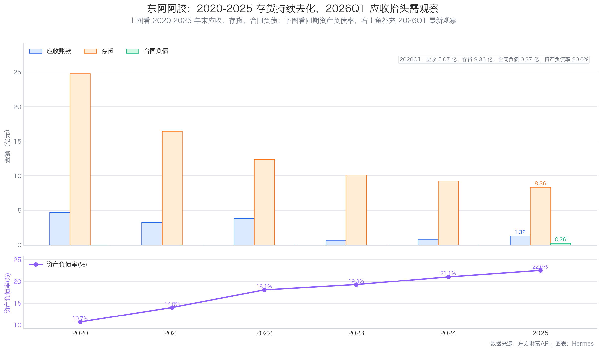
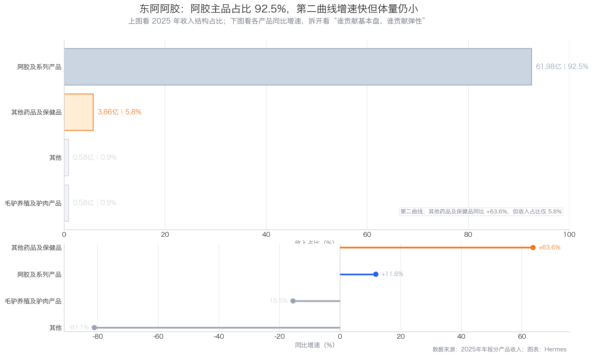
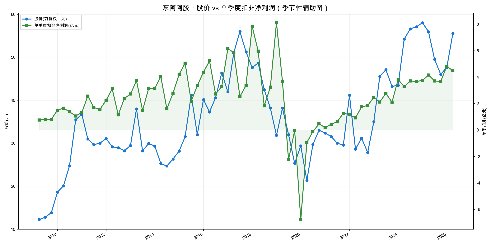

# 东阿阿胶投资分析报告

日期：2026-06-10
公司：东阿阿胶（000423.SZ）
最新行情口径：2026-06-09 收盘价 49.08 元，总市值 316.06 亿元，PE(TTM) 17.87，PB 2.93。
数据来源：同花顺导出 Excel（main_year/main_simple）、东方财富估值与财务 API、2025 年年报、2026 年一季报、yfinance 前复权股价。

结论先行：东阿阿胶属于“强品牌 + 高毛利 + 高现金 + 修复后稳增长”的中药滋补消费品公司。当前估值不贵，扣现金后 PE 约 13.46 倍，近十年 PE 分位约 29%，属于合理偏低区间；但公司 2020 年前后曾经历渠道库存与增长失速，且核心产品仍高度集中，当前更适合“关注/逢低跟踪”，不是无脑高确定性买点。

---

## 一、先判断能不能研究：公司画像 + 能力圈 + 红线

初筛结论：通过，但需要重点跟踪核心产品动销和渠道库存。

| 项目 | 判断 |
|---|---|
| 主营业务 | 阿胶、复方阿胶浆、桃花姬阿胶糕、阿胶速溶粉及其他中成药/健康消费品。2025 年阿胶及系列产品收入 61.98 亿元，占收入 92.50%。 |
| 商业模式 | 典型品牌中药/滋补消费品，靠品牌心智、渠道、价格带和产品结构升级赚钱。 |
| 控制人 | 华润东阿阿胶持股 23.50%，华润医药投资持股 10.19%，一致行动合计 33.70%；实际控制人为中国华润有限公司。 |
| 能力圈 | 商业模式可理解，关键变量是品牌势能、阿胶主品类需求、渠道库存、提价能力和健康消费品第二曲线。 |
| 红线 | 未见审计非标、控股股东高比例质押等重大红线；但历史上出现过收入/利润大幅下滑，需视为经营降级项。 |

后续重点：
- 阿胶及系列产品是否继续保持真实动销，而不是依赖渠道压货。
- 桃花姬、速溶粉等健康消费品能否成为第二增长曲线。
- 高现金头寸能否持续转化为分红与长期股东回报。

---

## 二、好行业：是不是好生意？

东阿阿胶所在的阿胶/中药滋补品行业，不是强周期行业，更接近“品牌中药 + 健康消费品”。需求有长期基础，但品类天花板、消费频次和替代品约束明显，不能简单类比高频消费品。

| 维度 | 分析 | 得分 |
|---|---|---:|
| 需求质量/非周期性 | 滋补养生、气血管理和传统中药消费需求长期存在；但阿胶消费频次低于大众食品饮料，且价格较高，受消费信心影响，行业需求质量不能按高频消费品打分。 | 3.5/6 |
| 竞争格局 | 东阿阿胶是阿胶行业标准制定和品牌龙头，心智强；但广义滋补品竞争包括燕窝、花胶、保健品、药食同源产品等。 | 3.5/4 |
| 进入壁垒 | 品牌、原料、工艺、渠道、央企华润体系形成壁垒，新进入者难以复制“东阿阿胶”心智。 | 3.5/4 |
| 上下游议价权 | 公司毛利率 2025 年达 73.47%，说明较强定价权；但上游驴皮资源、下游渠道和消费者接受度仍需平衡。 | 2.0/3 |
| 替代品威胁 | 阿胶满足的是滋补需求，底层需求稳定；但消费者可转向其他中式滋补、保健食品或医药产品，广义替代品较多。 | 1.5/3 |

好行业评分：14.0/20

---

## 三、好公司·定性：有没有长期复利能力？

| 维度 | 分析 | 得分 |
|---|---|---:|
| 护城河 | “东阿阿胶”品牌、行业标准、渠道和华润体系是核心壁垒；2020 后修复证明品牌未被永久破坏，但历史渠道出清也说明护城河并非无条件稳固。 | 5.5/7 |
| 复购/粘性/低替代性 | 阿胶类产品有滋补复购属性，但不是高频刚需；价格较高、消费场景偏礼赠/滋补，粘性弱于日常食品饮料，替代消费选择较多。 | 3.0/5 |
| 定价权 | 毛利率从 2020 年 55.00% 修复到 2025 年 73.47%，阿胶及系列产品毛利率 74.84%，具备较强价格与结构能力。 | 4.0/5 |
| 管理层 | 华润入主后经营修复明显，渠道和产品结构改善；但央企体系下激励和效率仍需持续观察。 | 2.5/3 |

好公司·定性评分：15.0/20

---

## 四、好公司·定量：利润是不是真，增长是否健康？

### 4.1 ROE 质量与盈利模式

| 年份 | 净利率 | 总资产周转率 | 权益乘数 | ROE估算 | 加权ROE |
|---|---:|---:|---:|---:|---:|
| 2020 | 1.27% | 0.30 | 1.14 | 0.44% | 0.44% |
| 2021 | 11.44% | 0.34 | 1.14 | 4.46% | 4.46% |
| 2022 | 19.30% | 0.33 | 1.19 | 7.67% | 7.68% |
| 2023 | 24.41% | 0.36 | 1.23 | 10.91% | 11.12% |
| 2024 | 25.29% | 0.47 | 1.25 | 14.77% | 14.60% |
| 2025 | 25.95% | 0.51 | 1.28 | 16.80% | 16.66% |

一句话判断：近年 ROE 修复主要来自净利率提升与周转改善，不是靠大幅加杠杆。

- 净利率从 2020 年 1.27% 修复到 2025 年 25.95%，是 ROE 修复的主因。
- 总资产周转率从 0.30 提升到 0.51，说明存货和渠道周转比低谷期明显改善。
- 权益乘数仅从 1.14 升到 1.28，杠杆贡献有限，ROE 不是靠高负债堆出来的。

### 4.2 利润增长来源与持续性

| 年份 | 营收(亿元) | 净利润(亿元) | 扣非净利润(亿元) | 毛利率 | 净利率 | ROE |
|---|---:|---:|---:|---:|---:|---:|
| 2020 | 34.09 | 0.43 | -0.39 | 55.00% | 1.20% | 0.44% |
| 2021 | 38.49 | 4.40 | 3.52 | 62.30% | 11.40% | 4.46% |
| 2022 | 40.42 | 7.80 | 7.00 | 68.30% | 19.28% | 7.68% |
| 2023 | 47.15 | 11.51 | 10.83 | 70.24% | 24.43% | 11.12% |
| 2024 | 61.57 | 15.57 | 14.42 | 72.42% | 26.30% | 14.60% |
| 2025 | 67.00 | 17.39 | 16.38 | 73.47% | 25.95% | 16.66% |

一句话判断：扣非利润增长既来自营收扩张，也来自毛利率、净利率持续修复；2025 年利润率改善已明显放缓。

- 2020-2025 年营收从 34.09 亿增至 67.00 亿，5 年 CAGR 约 14.5%；收入恢复是利润修复的第一层来源。
- 同期毛利率从 55.0% 升至 73.5%，净利率从 1.2% 升至 25.9%；阿胶块提价、产品结构优化与费用摊薄共同推动利润率抬升。
- 2022-2025 年扣非净利润从 7.00 亿增至 16.38 亿，3 年 CAGR 约 32.8%，明显快于营收增速，说明这一阶段利润修复更多依赖利润率改善。
- 但 2025 年净利率已从 2024 年的 26.3% 小幅回落至 25.9%，2026Q1 扣非净利润同比仅 +7.69%，说明公司已从修复期高增长切向稳健增长阶段；后续更合理的假设不是 30%+ 高增长，而是看 8%-12% 左右的稳健增长能否延续。

### 4.3 现金流质量

| 年份 | 经营现金流(亿元) | 资本开支(亿元) | 自由现金流(亿元) | 净利润(亿元) | 经营现金流/净利润 | 自由现金流/净利润 |
|---|---:|---:|---:|---:|---:|---:|
| 2020 | 8.01 | 1.03 | 6.98 | 0.43 | 18.50 | 16.12 |
| 2021 | 28.01 | 0.25 | 27.76 | 4.40 | 6.36 | 6.30 |
| 2022 | 21.45 | 0.46 | 20.99 | 7.80 | 2.75 | 2.69 |
| 2023 | 19.53 | 0.54 | 18.99 | 11.51 | 1.70 | 1.65 |
| 2024 | 28.51 | 0.97 | 27.53 | 15.57 | 1.83 | 1.77 |
| 2025 | 22.89 | 0.83 | 22.07 | 17.39 | 1.32 | 1.27 |

一句话判断：利润现金含量很好，资本开支低，自由现金流长期覆盖净利润。

- 2020-2025 年经营现金流/净利润、自由现金流/净利润均持续高于 1，长期现金兑现能力强。
- 2025 年自由现金流 22.07 亿元，高于净利润 17.39 亿元，分红覆盖能力较强。
- 2026Q1 经营现金流只有 0.29 亿，明显低于当季净利润，主要可能受春节后回款/备货节奏影响，不能单季年化，但需要跟踪半年报是否恢复。

### 4.4 现金头寸与资产负债表安全性

按 2025 年年报附注口径：
- 货币资金：52.67 亿元。
- 交易性金融资产：38.15 亿元，主要为银行理财产品与结构性存款。
- 一年内到期的定期存款：1.09 亿元。
- 长期负债口径扣除：一年内到期租赁负债 0.21 亿元 + 租赁负债 0.39 亿元。
- 其他流动资产仅 0.11 亿元，主要为增值税留抵/预缴所得税，不计为现金头寸。
- 应收款项融资为银行承兑汇票，不计为现金头寸。

现金头寸约 91.32 亿元，每股约 14.18 元。以 2026-06-09 市值 316.06 亿元计算，扣现金后市值约 224.74 亿元；以 2026Q1 扣非 TTM 16.70 亿元计算，扣现金后 PE 约 13.46 倍。

### 4.5 营运质量：应收/存货/合同负债

一句话判断：2020-2025 年末看，东阿阿胶存货持续去化、应收整体改善；但 2026Q1 应收阶段性抬头，先作为观察信号。

| 年份 | 应收账款(亿元) | 存货(亿元) | 合同负债(亿元) | 资产负债率 |
|---|---:|---:|---:|---:|
| 2020 | 4.69 | 24.78 | - | 10.71% |
| 2021 | 3.26 | 16.46 | 0.00 | 14.04% |
| 2022 | 3.84 | 12.39 | 0.00 | 18.05% |
| 2023 | 0.63 | 10.12 | 0.01 | 19.28% |
| 2024 | 0.79 | 9.26 | 0.01 | 21.06% |
| 2025 | 1.32 | 8.36 | 0.26 | 22.55% |

- 2020-2025 年存货从 24.78 亿元降到 8.36 亿元，去库存和渠道修复是明确趋势。
- 同期应收账款从 4.69 亿元降到 1.32 亿元，整体回款纪律改善；但 2026Q1 又升至 5.07 亿元，需要跟踪是否只是季节性发货结算。
- 年末合同负债整体体量较小，2025 年末为 0.26 亿元；2026Q1 为 0.27 亿元，暂未看到明显的预收款恶化信号。
- 资产负债率从 2020 年 10.71% 升到 2025 年 22.55%，但 2026Q1 回落到 20.02%，整体仍处低杠杆区间。

### 4.6 产品结构与增长来源

一句话判断：增长仍高度依赖阿胶主品，第二曲线有进展，但短期还不足以改写产品结构。

- 阿胶及系列产品收入 61.98 亿元，占比 92.50%，同比增长 11.80%，仍是绝对核心。
- 其他药品及保健品收入 3.86 亿元，同比增长 63.65%，说明第二曲线在增长，但体量仍小。
- 毛驴养殖及驴肉产品、其他业务占比都不到 1%，对整体增长贡献有限。

好公司·定量评分：31.5/40

| 子项 | 得分 |
|---|---:|
| ROE质量与盈利模式 | 8.0/9 |
| 利润增长来源与持续性 | 5.0/7 |
| 现金流质量 | 6.0/7 |
| 现金头寸与资产负债表安全性 | 6.0/6 |
| 营运质量 | 3.5/5 |
| 产品结构与增长来源 | 3.0/6 |

---

## 五、好时机：现在买贵不贵？

### 5.1 股价 vs 利润线

阶段复盘：
- 2018-2020：公司经历渠道库存消化和经营模式调整。2019 年公司主动降库存、控制发货、拉动终端纯销，导致报表收入和利润短期大幅下滑；这不是简单的需求周期波动，而是历史风险样本，说明品牌强但并非永远免疫渠道和定价策略失误。
- 2021-2023：利润从低谷快速修复，股价也从底部回升，但利润修复斜率强于股价，估值没有明显泡沫化。
- 2024：扣非利润 TTM 继续上台阶，股价震荡上行，市场开始给修复逻辑重新定价。
- 2025-2026Q1：扣非 TTM 从 14.42 亿升至 16.70 亿，股价从 60 元附近回落到 49 元后再反弹，说明估值有所消化；但 Q1 增速已放缓，后续要看利润线能否继续缓慢上行。

图表结论：当前不是“股价远远落后利润线”的深度低估状态，但也不是明显透支。更准确的表述是：利润线仍在上行，股价经历估值回落后处于合理偏低区间。

### 5.2 PE 及 PE 百分位

| 指标 | 数值 |
|---|---:|
| 最新收盘价 | 49.08 元 |
| 总市值 | 316.06 亿元 |
| PE(TTM) | 17.87 倍 |
| 近十年 PE 分位 | 约 29.0%，同花顺23.13% |
| 扣非净利润 TTM | 16.70 亿元 |
| 现金头寸 | 91.32 亿元 |
| 扣现金后市值 | 224.74 亿元 |
| 扣现金后 PE | 13.46 倍 |

判断：表观 PE 位于合理偏低区域，扣现金后估值更有吸引力。但 PE 分位约 29%，不是历史极低区间，估值判断应克制。

### 5.3 PEG

2022-2025 年扣非净利润 CAGR 约 32.8%，按当前 PE 17.87 倍计算，静态 PEG 约 0.55。但这个增长率含低基数修复，参考价值下降。若按未来 8%-12% 稳态增长估算，PEG 约 1.5-2.2，估值大致合理，不算特别便宜。

### 5.4 股息率

重新校验后，东阿阿胶股息率必须区分“年度期末分红”和“完整财年分红”两个口径：

| 口径 | 每10股派息 | 每股分红 | 按49.08元股价的股息率 | 现金分红额 | 说明 |
|---|---:|---:|---:|---:|---|
| 2025中期分红 | 12.700919元 | 1.2701元 | 2.59% | 8.18亿元 | 已于2025年9月实施。 |
| 2025年度期末分红 | 14.354904元 | 1.4355元 | 2.92% | 9.24亿元 | 2025年报预案为10派14.31元，实施时调整为10派14.354904元。 |
| 2025完整财年合计 | 27.055823元 | 2.7056元 | 5.51% | 17.42亿元 | 中期+年度期末合计，更能反映2025财年股东回报。 |

判断：如果只看年报期末分红，股息率约 2.92%；如果按 2025 财年中期+期末完整分红口径，股息率约 5.51%。完整财年现金分红约 17.42 亿元，约等于 2025 年归母净利润 17.39 亿元的 100.2%，但仍被 2025 年自由现金流 22.07 亿元覆盖。分红吸引力强，但接近全额分红，未来能否维持取决于利润和自由现金流是否继续稳定。

### 5.5 市场信号与预期差

可能的预期差：市场仍记得 2019-2020 年渠道出清，对阿胶主品类的长期增长弹性保持谨慎；但公司高现金、高毛利和健康消费品拓展提供一定安全垫。负面信号是 Q1 合同负债下降、经营现金流偏低，需要用半年报验证。

### 5.6 毛估估

| 情景 | 假设 | 估算市值 | 相对当前市值 |
|---|---|---:|---:|
| 中性档 | 2028 年扣非利润 22-23.5 亿元，给 17-18 倍 PE | 374-423 亿元 | +18% 到 +34% |
| 保守档 | 未来增长放缓，利润 17.5-18.5 亿元，给 14 倍 PE | 245-259 亿元 | -23% 到 -18% |

补充：若考虑 91 亿现金头寸和未来分红，下行安全垫会更好一些；但现金不能替代主业增长，若利润线下行，估值仍会压缩。

好时机评分：14.0/20

| 子项 | 得分 |
|---|---:|
| 股价vs利润线 | 3.5/5 |
| PE及PE百分位 | 3.5/5 |
| PEG | 1.0/2 |
| 股息率 | 2.5/3 |
| 市场信号与预期差 | 1.5/2 |
| 毛估估 | 2.0/3 |

---

## 六、投资结论：值不值得下注，拿不拿得住？

### 6.1 胜率

胜率中上。公司品牌强、现金流好、负债低、现金头寸厚，2020 后经营修复已经兑现。但核心品类集中、消费频次不高、历史上渠道库存曾出过问题，因此胜率不能给到顶级白酒/高频消费龙头那种水平。

### 6.2 赔率

赔率中等偏好。表观 PE 17.87 倍不贵，扣现金后 PE 13.46 倍较有吸引力；但近十年 PE 分位约 29%(同花顺23.13%)，不是极低估。当前价格更多是“合理偏低 + 有现金安全垫”，不是“明显低估到可忽略经营波动”。

### 6.3 长期持有检查项

| 检查项 | 判断 |
|---|---|
| 长期需求 | 仍存在，但阿胶品类天花板和替代品要持续观察。 |
| 护城河 | 品牌、标准、渠道壁垒较强。 |
| 自由现金流 | 很好，资本开支低，分红覆盖充足。 |
| 管理层 | 华润体系下修复效果明显。 |
| 不扩 PE 的长期回报 | 若未来利润 8%-12% 增长，叠加完整财年口径约 5.5% 股息率（能否维持需观察），长期回报可接受。 |

### 6.4 评级与行动

综合评级：关注。

行动建议：
- 已持有：可继续持有观察，重点看 2026 半年报合同负债、经营现金流、阿胶及系列产品收入增速。
- 未持有：当前价格可纳入观察池；若回落到扣现金后 PE 更低，且完整财年分红仍能被自由现金流覆盖，吸引力会明显提高。
- 不适合的情况：如果只想买高速成长股，东阿阿胶当前更像稳健修复后的现金流型公司，不宜按高成长逻辑给过高估值。

---

## 七、投资逻辑与证伪条件

### 7.1 投资逻辑

1. 品牌中药滋补龙头，阿胶品类心智强，毛利率高。
2. 2020 后渠道和经营修复已经兑现，ROE 从 0.44% 修复到 16.66%。
3. 现金流质量好，2025 年自由现金流 22.07 亿元，高于净利润 17.39 亿元。
4. 资产负债表安全垫厚，现金头寸约 91.32 亿元，扣现金后 PE 约 13.46 倍。
5. 当前估值合理偏低，等待利润线继续上行和第二增长曲线验证。

### 7.2 证伪条件

- 阿胶及系列产品收入连续两个报告期明显放缓或下滑，且无法用渠道节奏解释。
- 合同负债持续下降，应收账款/存货持续上升，出现压货或动销恶化迹象。
- 毛利率或净利率连续下行，说明提价权/产品结构开始失效。
- 复方阿胶浆、桃花姬、速溶粉等第二曲线迟迟无法放量，增长重新依赖单一阿胶主品。
- 自由现金流持续低于净利润，分红开始依赖消耗历史现金垫。
- 管理层进行偏离主业的大额并购或资本开支。

---

## 八、维度打分汇总表

| 模块 | 得分 | 权重 |
|---|---:|---:|
| 好行业 | 14.0 | 20 |
| 好公司·定性 | 15.0 | 20 |
| 好公司·定量 | 31.5 | 40 |
| 好时机 | 14.0 | 20 |
| 总分 | 74.5 | 100 |

评分结论：74.5 分，对应“关注”。公司质量较好，现金流和资产负债表优秀，当前估值合理偏低；但阿胶主品占比过高，历史渠道出清风险不能忽视，2026Q1 应收抬头和经营现金流偏低仍需半年报验证。因此更适合纳入观察池/逢低跟踪，而不是提升到强烈关注。

---

## 九、总结

东阿阿胶已经从 2019-2020 年的低谷修复成一家盈利质量较高、现金流很好、资产负债表很稳的品牌中药公司。它的核心看点不是爆发式成长，而是“品牌修复后稳增长 + 高现金 + 可持续分红”。

当前 49.08 元、17.87 倍 PE、扣现金后 13.46 倍 PE，估值有吸引力但不算极端便宜。更稳妥的策略是纳入观察池，跟踪 2026 半年报：如果利润线继续上行、合同负债和现金流恢复，投资吸引力会增强；如果出现收入放缓、合同负债下降、应收和存货上升，则要降低判断。

---

## 十、数据校验结果

| 校验项 | 结果 | 说明 |
|---|---|---|
| 营收/利润/扣非 | 正确 | 同花顺 Excel 与年报关键数一致：2025 营收 67.00 亿、净利润 17.39 亿、扣非 16.38 亿。 |
| CAGR 年数 | 正确 | 2022→2025 为 3 年，扣非 CAGR 约 32.8%；已注明低基数修复效应。 |
| 毛利率/净利率 | 正确 | 2025 毛利率 73.47%，净利率 25.95%，来自同花顺/年报。 |
| 经营现金流/自由现金流 | 正确 | 使用东方财富现金流 API，并与年报现金流口径一致；2025 FCF 约 22.07 亿。 |
| 现金头寸 | 正确 | 用年报附注校验：货币资金 + 交易性金融资产 + 一年内到期定期存款 - 租赁负债相关长期负债；其他流动资产未计入。 |
| 股价/市值/PE | 正确 | 东方财富估值 API：2026-06-09 收盘价 49.08 元、市值 316.06 亿、PE 17.87。 |
| 图表链接 | 正确 | 8 张图均已生成并嵌入本报告，链接已校验存在。 |
| 分红/股息率 | 已修正 | 2025完整财年分红=中期10派12.700919元+期末10派14.354904元，合计每股2.7056元，按49.08元股价股息率约5.51%；期末单次分红口径约2.92%。 |
| 打分加总 | 正确 | 14.0 + 15.0 + 31.5 + 14.0 = 74.5。 |

免责声明：本报告仅为研究分析，不构成投资建议。市场有风险，投资需独立判断。
