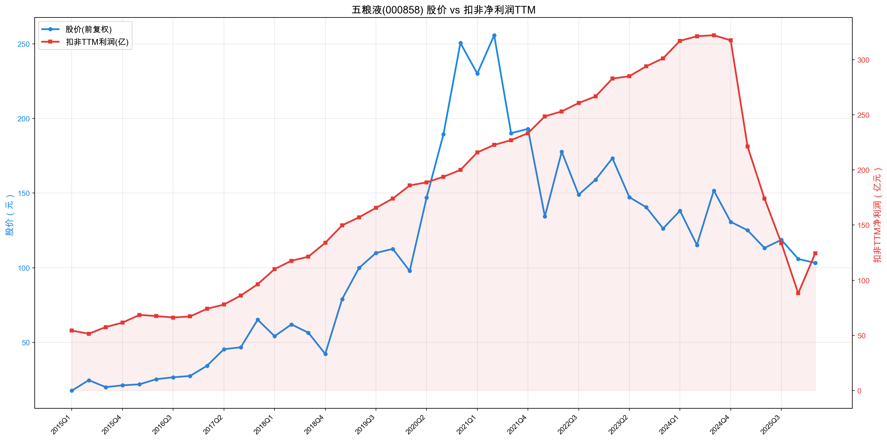
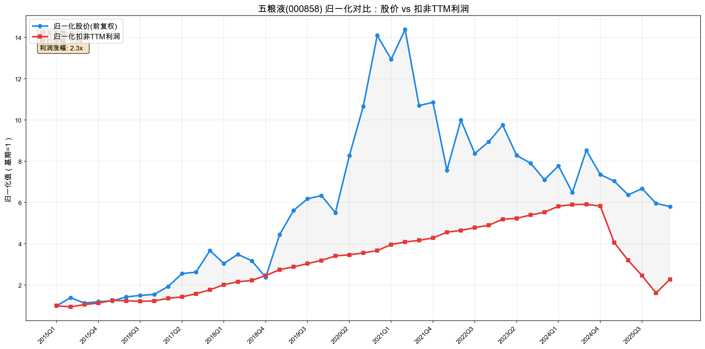
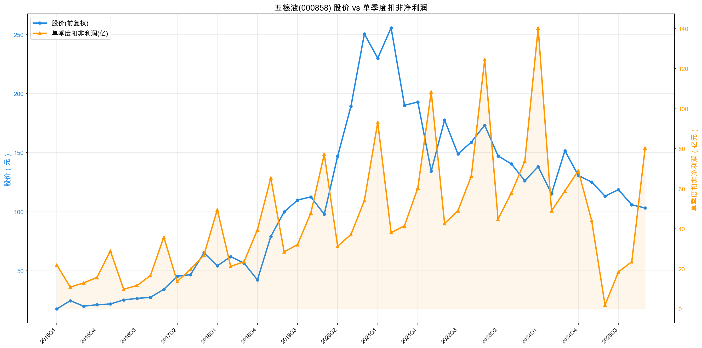

# 五粮液（000858）投资分析报告（2026-06-05）

结论先行：五粮液仍是中国白酒最强品牌梯队之一，现金头寸极厚、毛利率和渠道基础仍强；但 2025 年财报必须先区分“经营压力”和“收入确认口径重述”。这次不是普通波动，也不能简单理解为全部真实动销腰斩，而是“行业深度调整 + 业务模式梳理后按谨慎原则调整收入确认 + 渠道去库存压力”共同导致的财报大幅下修。

我的判断：谨慎关注，暂不重仓。核心问题不是“五粮液是不是好公司”，而是“剔除会计重述扰动后，真实动销和利润中枢能不能修复，以及核心产品库存/批价能不能稳定”。如果利润修复到 180-200 亿以上，当前价格有安全垫；如果按更谨慎收入确认后扣非 TTM 长期停在 120-130 亿附近，当前估值并不便宜。

数据口径：
- 最新行情：东方财富估值接口，2026-06-04 收盘价 81.10 元，总市值 3148.0 亿元。
- 财务数据：用户提供同花顺 Excel（main_year / main_simple）+ 2025 年报 PDF + 东方财富 API 交叉验证。
- 最新利润口径：截至 2026Q1，扣非净利润 TTM 约 124.34 亿元。
- 图表口径：股价使用 yfinance 前复权数据；估值使用东方财富未复权收盘价和总市值。

---

## 一、先判断能不能研究

| 项目 | 判断 |
|---|---|
| 公司画像 | 高端浓香型白酒龙头，核心产品为第八代五粮液、五粮液 1618、经典五粮液及五粮浓香系列。商业模式是品牌白酒 + 经销/直销渠道，先款后货为主。 |
| 能力圈 | 能看懂。关键变量是高端白酒需求、批价、渠道库存、动销、合同负债、核心产品销量。 |
| 初筛结论 | 谨慎通过。公司质地仍强，但 2025 年经营断崖式下滑，必须按“修复型”而不是“稳定成长型”研究。 |
| 红线 | 未触发财务造假/治理一票否决；但触发经营降级项：核心产品销量大幅下降、库存大幅上升、利润 TTM 大幅下修。 |
| 后续重点 | 1）2025 是否是一次性出清，还是利润中枢永久下移；2）核心五粮液产品库存和批价能否企稳；3）高分红能否被自由现金流持续覆盖。 |

关键事实：
- 2025 年营业总收入 405.29 亿元，同比 -54.55%；扣非净利润 88.16 亿元，同比 -72.23%。这是更正后的官方口径，不应直接和前期未更正季度数据混用。
- 公司 2026-04-30 披露《前期会计差错更正公告》：因“对 2025 年业务模式进行梳理，基于谨慎性原则，调整 2025 年部分业务收入确认相关核算”，对 2025 年一季报、半年报、三季报进行重述，且“不影响现金流量表列示”。
- 更正影响很大：2025Q1 营收从 369.40 亿调至 170.86 亿，归母净利润从 148.60 亿调至 44.16 亿；2025Q1-Q3 累计营收从 609.45 亿调至 306.38 亿，调减 303.08 亿，归母净利润从 215.11 亿调至 64.75 亿，调减 150.37 亿。
- 2026Q1 扣非净利润 80.36 亿元，同比 +81.92%，但这是在 2025Q1 重述后低基数上的增长；若与 2025Q1 原披露口径相比，仍明显低于原来的高基数。因此 2026Q1 不能简单解读为经营已全面恢复。
- 2025 年五粮液产品销量 -53.00%、期末库存 +306.90%，说明即使考虑会计口径，渠道和动销压力也是真实风险信号。

---

## 二、好行业：白酒还是好生意吗？

### 2.1 需求质量 / 非周期性

白酒不是强周期行业，但高端白酒不是完全非周期。它同时受商务宴请、礼赠、居民收入预期、渠道库存和价格预期影响。2025 年行业已进入深度调整：公司年报披露，全国白酒产量 354.9 万千升，同比 -12.1%；销售收入 5724 亿元，同比 -7.5%；利润总额 1884 亿元，同比 -13.3%。

这说明行业底层需求仍在，但增长逻辑已经从“总量扩张 + 消费升级”切换到“存量竞争 + 结构分化”。高端白酒长期需求不会消失，但短中期不宜按高增长行业估值。

### 2.2 竞争格局

高端白酒仍是少数品牌主导，贵州茅台、五粮液、泸州老窖构成核心梯队。五粮液的优势在浓香型高端白酒品牌和渠道覆盖，但相对茅台的稀缺性和价格锚定能力弱一些；在行业调整期，渠道利润和批价稳定性更容易承压。

同行估值与市值（2026-06-04，东方财富）：

| 公司 | 股价 | 市值 | PE TTM | PB |
|---|---:|---:|---:|---:|
| 贵州茅台 | 1268.00 | 15851 亿 | 19.16 | 5.85 |
| 五粮液 | 81.10 | 3148 亿 | 24.98 | 2.46 |
| 泸州老窖 | 86.60 | 1275 亿 | 12.82 | 2.47 |
| 山西汾酒 | 122.10 | 1490 亿 | 13.56 | 3.31 |
| 古井贡酒 | 88.57 | 468 亿 | 16.57 | 1.79 |
| 今世缘 | 26.76 | 334 亿 | 14.23 | 1.86 |

注意：五粮液 PE 高于多数同行，不是因为市场给它更高成长性，而是利润 TTM 被 2025 年断崖下滑压低。估值必须结合“利润能否修复”判断。

### 2.3 进入壁垒

白酒龙头壁垒仍然很强：品牌心智、历史文化、老窖池/工艺、品质稳定性、经销网络、宴请礼赠场景共同构成护城河。五粮液的古窖池、五粮酿造工艺、浓香型品类基础，都是新进入者难以复制的壁垒。

### 2.4 上下游议价权

正常周期里，高端白酒对上游成本敏感度低，对下游经销商议价能力强，且采用先款后货。但 2025 年的核心问题不是成本，而是终端需求和渠道库存。先款后货能带来现金流，但不能替代真实动销；渠道如果利润受损、库存高企，未来仍会反噬收入和批价。

### 2.5 替代品威胁

白酒的社交、宴请、礼赠需求短期难被完全替代，但年轻消费者饮酒习惯变化、低度酒/啤酒/威士忌/不饮酒趋势，会压制行业总量。高端白酒的核心风险不是“被某个产品替代”，而是高端消费场景收缩、渠道价格预期转弱。

好行业评分：17 / 20

| 维度 | 分数 | 理由 |
|---|---:|---|
| 需求质量 / 非周期性 | 4.5 / 6 | 白酒长期社交/宴请/礼赠需求仍在，高端白酒仍是最好的消费子行业之一；但行业进入存量竞争，短期景气下降。 |
| 竞争格局 | 3.5 / 4 | 高端白酒格局清晰，茅台第一、五粮液第二梯队核心龙头，行业地位强；扣分只因价格锚定能力弱于茅台。 |
| 进入壁垒 | 4 / 4 | 品牌、历史、工艺、渠道壁垒极强。 |
| 上下游议价权 | 2.5 / 3 | 高毛利、先款后货、渠道覆盖强；调整期库存和批价压力使其不能满分。 |
| 替代品威胁 | 2.5 / 3 | 高端白酒的社交/礼赠属性短期替代风险低；长期年轻化、健康化趋势仍需扣分。 |

---

## 三、好公司·定性：护城河还在，但定价权受考验

### 3.1 护城河

五粮液的护城河仍在。它不是普通消费品，而是高端白酒品牌心智 + 浓香型代表 + 渠道网络 + 文化资产的组合。年报披露，公司持续投入高端政商、文化、体育场景传播，传统渠道新增合作终端 1.2 万家，全年进货终端达 5.5 万家。

但护城河不是静态标签。真正要验证的是：在需求收缩和库存高企时，品牌能否守住价格体系、渠道利润和核心产品动销。2025 年核心产品销量 -53%、库存 +306.9%，说明护城河仍强，但已经不能完全抵消行业调整压力。

### 3.2 复购 / 粘性 / 低替代性

白酒具备复购属性，但高端白酒的复购不是刚需高频，而是商务、礼赠、宴请、收藏与社交场景驱动。消费场景收缩时，复购频率会下降。五粮液仍有广泛消费基础，但短期粘性弱于日常必需消费，也弱于茅台的投资/稀缺属性。

### 3.3 定价权

五粮液历史上具备较强定价权，毛利率长期维持 74%-77% 左右，2025 年酒类毛利率仍有 83.75%，五粮液产品毛利率 89.55%。但定价权的关键不只是报表毛利率，而是终端批价、经销商利润和库存周转。2025 年销量大幅下滑、库存大幅增加，说明公司短期提价和稳价能力都需要重新验证。

### 3.4 管理层

公司实控人为宜宾市国资体系。2025 年年报显示，宜宾发展控股集团持股 34.43%，四川省宜宾五粮液集团持股 20.49%，后者为宜宾发展控股集团全资子公司，合计控制力强。国资背景有稳定性和资源优势，但也要关注在行业调整期是否会为了收入目标压货、牺牲渠道健康或提高分红压力。

好公司·定性评分：15 / 20

| 维度 | 分数 | 理由 |
|---|---:|---|
| 护城河 | 5.5 / 7 | 品牌、工艺、渠道仍强，但 2025 年经营数据证明护城河受到压力测试。 |
| 复购 / 粘性 / 低替代性 | 3.5 / 5 | 白酒有复购和社交粘性，但高端场景受经济与消费信心影响。 |
| 定价权 | 3.5 / 5 | 报表毛利率高，但批价、渠道利润和库存需要重新验证。 |
| 管理层 | 2.5 / 3 | 国资稳定、主业专注，但需跟踪渠道策略和分红节奏。 |

---

## 四、好公司·定量：从高质量复利切到修复观察期

### 4.1 ROE质量与盈利模式

近年杜邦拆解：

| 年份 | 销售净利率 | 总资产周转率（估算） | 权益乘数（估算） | 加权 ROE |
|---|---:|---:|---:|---:|
| 2020 | 36.48% | 0.31 | 1.30 | 24.94% |
| 2021 | 37.02% | 0.33 | 1.35 | 25.30% |
| 2022 | 37.81% | 0.34 | 1.32 | 25.28% |
| 2023 | 37.85% | 0.35 | 1.26 | 25.06% |
| 2024 | 37.22% | 0.47 | 1.39 | 23.35% |
| 2025 | 22.99% | 0.21 | 1.57 | 6.89% |

说明：总资产周转率和权益乘数为用公开年报数据估算的经营趋势口径；ROE 使用同花顺加权 ROE。

结论：2020-2024 年五粮液是典型高 ROE、低杠杆、高净利率的优质消费品公司，ROE 主要由高净利率驱动，不靠高杠杆。但 2025 年 ROE 从 23.35% 降至 6.89%，核心拖累来自净利率下降和资产周转率断崖式下降。权益乘数上升不是主动加杠杆扩张，而是利润和权益收缩后的结果，不能简单理解为健康杠杆提升。

### 4.2 利润增长来源与持续性

| 年份 | 营业总收入 | 扣非净利润 | 扣非同比 |
|---|---:|---:|---:|
| 2020 | 573.21 亿 | 199.95 亿 | +14.87% |
| 2021 | 662.09 亿 | 233.28 亿 | +16.67% |
| 2022 | 739.69 亿 | 266.63 亿 | +14.30% |
| 2023 | 832.72 亿 | 301.16 亿 | +12.95% |
| 2024 | 891.75 亿 | 317.42 亿 | +5.40% |
| 2025 | 405.29 亿 | 88.16 亿 | -72.23% |
| 2026Q1 | 228.38 亿 | 80.36 亿 | +81.92% |

关键判断：
- 2020-2024 年，五粮液仍有稳定增长，但增速已从双位数逐步降到 2024 年的 5.4%。
- 2025 年是断崖式下滑，不能用“短期波动”轻描淡写。
- 2026Q1 看起来大幅反弹，但仍要看 TTM：截至 2026Q1，扣非 TTM 约 124.34 亿元，只有 2024 年高点的约 39%。
- 3 年 CAGR 已失真或为负，PEG 不适用；后续应看利润修复到 150 亿、180 亿、200 亿的概率。

### 4.3 现金流质量

| 年份 | 经营现金流 | 资本开支 | 自由现金流 | 自由现金流/扣非净利润 |
|---|---:|---:|---:|---:|
| 2020 | 146.98 亿 | 9.94 亿 | 137.05 亿 | 68.5% |
| 2021 | 267.75 亿 | 15.39 亿 | 252.36 亿 | 108.2% |
| 2022 | 244.31 亿 | 17.81 亿 | 226.51 亿 | 85.0% |
| 2023 | 417.42 亿 | 29.57 亿 | 387.85 亿 | 128.8% |
| 2024 | 339.40 亿 | 26.66 亿 | 312.73 亿 | 98.5% |
| 2025 | 297.06 亿 | 19.67 亿 | 277.39 亿 | 314.7% |
| 2026Q1 | -25.35 亿 | 3.46 亿 | -28.00 亿 | 不适用 |

现金流看起来比利润强很多，这是白酒先款后货和渠道打款节奏的优势。2025 年自由现金流 277.39 亿元，明显高于扣非净利润 88.16 亿元。

但这里不能简单打满分：
- 经营现金流强，可能来自前期渠道回款、合同负债和结算节奏；
- 如果终端动销和库存没有改善，现金流优势未来可能回落；
- 2026Q1 经营现金流为 -25.35 亿元，说明现金流也会受打款节奏和渠道变化影响。

### 4.4 现金头寸与资产负债表安全性

2025 年现金头寸校验：

| 项目 | 金额 | 是否计入现金头寸 | 说明 |
|---|---:|---|---|
| 现金及现金等价物 | 1241.15 亿 | 是 | 现金流量表期末现金及现金等价物余额。 |
| 交易性金融资产 | 0 | 是但金额为 0 | 年报未列示交易性金融资产。 |
| 其他流动资产 | 79.68 亿 | 否 | 年报附注显示主要为预缴税费 29.26 亿、监管商品 49.07 亿，不是定期存款。 |
| 应收款项融资 | 94.02 亿 | 否 | 年报附注显示为银行承兑汇票，不是现金。 |
| 一年内到期的非流动负债 | 3.64 亿 | 扣除 | 长期负债口径。 |
| 租赁负债 | 0.44 亿 | 扣除 | 长期负债口径。 |
| 长期借款 / 应付债券 | 0 | 扣除 | 年报未列示。 |
| 现金头寸 | 约 1237.06 亿 | - | 每股净现金约 31.87 元。 |

按 2026-06-04 总市值 3148.0 亿元计算：
- 扣现金后市值约 1910.9 亿元；
- 每股净现金约 31.87 元，约占当前股价 39.3%；
- 按 2026Q1 扣非 TTM 124.34 亿元，扣现金后 PE 约 15.37 倍；
- 若只看 2025 年扣非净利润 88.16 亿元，扣现金后 PE 约 21.68 倍。

这说明现金安全垫很厚，但现金不能解决利润中枢下移问题。现金能提高下行保护，不能直接证明主业便宜。

### 4.5 营运质量：应收 / 存货 / 合同负债

| 指标 | 2024 | 2025 | 变化 |
|---|---:|---:|---:|
| 应收账款 | 0.37 亿 | 0.38 亿 | 基本稳定，赊销风险低。 |
| 存货 | 182.34 亿 | 200.65 亿 | +10.05%，但商品酒库存量 +45.18%。 |
| 合同负债 | 116.90 亿 | 134.60 亿 | +15.14%，账面蓄水池仍在。 |
| 五粮液产品销售量 | 4.14 万吨左右 | 1.95 万吨 | -53.00%。 |
| 五粮液产品期末库存量 | 0.62 万吨 | 2.51 万吨 | +306.90%。 |

应收账款很低，先款后货优势仍在；合同负债增加也是积极信号。但核心高端产品“销量大跌 + 库存暴增”是重大风险，不能被合同负债掩盖。后续必须跟踪：库存是否去化、批价是否企稳、合同负债是否继续增长，以及经销商是否仍愿意打款。

### 4.6 产品结构与增长来源

2025 年产品结构：

| 产品 | 收入 | 毛利率 | 收入同比 | 判断 |
|---|---:|---:|---:|---|
| 五粮液产品 | 279.36 亿 | 89.55% | -58.84% | 核心利润池，但下滑最重。 |
| 其他酒产品 | 91.68 亿 | 66.10% | -39.89% | 下滑也明显，不能完全承担第二曲线。 |
| 酒类合计 | 371.04 亿 | 83.75% | -55.36% | 酒类主业整体承压。 |
| 非酒类产品 | 34.25 亿 | 未单列 | -43.38% | 占比低，不是核心。 |

核心问题：五粮液不是没有产品结构，而是核心产品过于重要。五粮液产品收入占酒类收入约 75.3%，且毛利率最高；当核心产品销量和库存同时恶化，利润弹性会非常大。

好公司·定量评分：25 / 40

| 维度 | 分数 | 理由 |
|---|---:|---|
| ROE质量与盈利模式 | 5 / 9 | 历史盈利模式极优，但 2025 ROE 断崖下滑，周转率和净利率同时承压。 |
| 利润增长来源与持续性 | 2 / 7 | 2025 扣非 -72.23%，TTM 未修复，3年 CAGR/PEG 失效。 |
| 现金流质量 | 5 / 7 | 2025 FCF 强，但需警惕渠道打款节奏与 2026Q1 OCF 转负。 |
| 现金头寸与资产负债表 | 6 / 6 | 净现金极厚，每股净现金约 31.87 元。 |
| 营运质量 | 3 / 5 | 应收低、合同负债增长，但核心产品库存暴增。 |
| 产品结构与增长来源 | 4 / 6 | 核心产品仍高毛利，但过度依赖且 2025 下滑严重。 |

---

## 五、好时机：必须单独看股价、利润线和修复假设

一句话：五粮液现在的“便宜”不是传统意义上的低 PE 便宜，而是“股价已经跌到较低位置 + 现金头寸很厚 + 市场按低利润中枢定价”。但这笔投资能不能成立，关键取决于新口径下利润能否修复，而不是只看品牌地位。

### 5.1 股价 vs 扣非 TTM 利润线

主图如下：

这张图看的是“股价走势”和“扣非 TTM 利润走势”的方向与斜率，不看两条线谁在上谁在下。

阶段判断：
- 2015-2020 是“利润增长 + PE 扩张”的戴维斯双击；
- 2021-2024 是“利润仍涨、股价下跌”的估值出清；
- 2025 年之后不是普通估值问题，而是利润口径和利润中枢同时被市场重新定价；
- 现在如果只看股价，确实已经便宜很多；但如果只看最新 TTM 利润，估值并不低。

因此当前好时机的核心判断是：当前价格已经补偿了一部分悲观预期，但还没有到“无脑低估”。它更像一个需要验证利润修复的观察点。

### 5.2 归一化辅助图：不能用来判断高低估，只看走势同步性

归一化图容易被基期 PE 扭曲，所以不能说“股价线在利润线上方就是高估”或“股价线在利润线下方就是低估”。它只说明三件事：
1. 2020-2021 年股价明显跑在利润前面，是高估值阶段；
2. 2021-2024 年利润继续上行但股价下行，说明估值被持续压缩；
3. 2025 年利润线突然下坠，说明当前已不能继续沿用过去的稳定复利假设。

### 5.3 单季度利润图：2026Q1 修复明显，但仍要看全年持续性

单季度数据看，五粮液有明显季节性：Q1 通常是春节旺季利润高点，Q2/Q3/Q4 受费用、渠道和发货节奏影响较大。

结论：2026Q1 是积极信号，但不能单独证明利润中枢已回到 180-200 亿。白酒 Q1 季节性太强，必须看后续 2-4 个季度。

### 5.4 当前 PE 与 PE 百分位

| 指标 | 数值 | 判断 |
|---|---:|---|
| 最新收盘价 | 81.10 元 | 2026-06-04 东方财富口径。 |
| 总市值 | 3148.0 亿元 | 已明显低于高峰期。 |
| PE TTM（东方财富） | 24.98 倍 | 不算高，但也不是白酒龙头里最低。 |
| 近十年 PE TTM 百分位 | 约 38.6%，同花顺48.8% | 中低分位，不是极端低估。 |
| 近十年 PE TTM 中位数 | 约 27.76 倍 | 当前略低于中位数。 |
| 现金头寸 | 约 1237.06 亿元 | 安全垫很厚。 |
| 扣现金后市值 | 约 1910.9 亿元 | 主业估值明显下降。 |
| 扣现金后 PE（按 2026Q1 扣非 TTM） | 约 15.37 倍 | 如果利润能修复，这个价格有吸引力。 |

估值判断：
- 如果按当前扣非 TTM 124.34 亿看，五粮液不是特别便宜；
- 如果扣除现金，主业估值约 15 倍，开始有安全边际；
- 如果未来扣非利润修复到 180-200 亿，当前价格偏便宜；
- 如果未来长期只能维持 120-130 亿，当前价格只是合理，不算大便宜。

### 5.5 PEG：暂时失效

PEG 暂不适用。原因是 2025 年财报发生重大重述，扣非利润断崖式下修，3 年 CAGR 会变成负数或严重失真。此时用 PE / 过去 3 年增速没有意义。

更合理的方法是：
1. 修复后利润 × 合理 PE；
2. 当前市值反推市场隐含利润。

### 5.6 股息率与分红安全性

这里要区分“单次年度分配预案”和“2025 年完整分红口径”：

| 口径 | 每10股分红 | 每股分红 | 按 81.10 元股价的股息率 | 说明 |
|---|---:|---:|---:|---|
| 2025 年度分配预案 | 25.78 元 | 2.578 元 | 约 3.18% | 年报披露的期末/年度分配预案，尚需股东会批准。 |
| 2025 年中期分红 + 2025 年度分配预案 | 51.56 元 | 5.156 元 | 约 6.36% | 更接近 2025 财年完整分红口径。 |
| 2025 自然年实际到账分红 | 57.47 元 | 5.747 元 | 约 7.09% | 包括 2024 年度分红 31.69 元/10股 + 2025 中期分红 25.78 元/10股，不等同于 2025 财年利润分配。 |

2025 年度分配预案对应单次股息率约 3.18%；若按 2025 财年中期+年度预案合计，股息率约 6.36%。

优点：现金头寸厚，短期分红能力强；若按完整财年分红口径，股息率具有吸引力。

需要扣分的地方：2025 年 EPS 约 2.3068 元，单次年度预案每股 2.578 元已高于当年 EPS；若加上 2025 中期分红，全年每股分红 5.156 元，约为 EPS 的 2.24 倍。如果利润长期停留在 2025 年低位，高分红就不是靠当期利润自然覆盖，而是在消耗历史现金垫。

### 5.7 市场信号与预期差

可能低估的地方：
- 五粮液现金头寸非常厚，扣现金后主业估值并不高；
- 2025 年低利润可能包含会计重述和渠道出清影响，不一定代表永久利润中枢；
- 如果 2026 后续季度确认修复，估值有重新抬升空间。

可能仍然高估的地方：
- 2026Q1 的同比高增长来自 2025Q1 重述后低基数，不能简单年化；
- 核心产品库存和批价若没有恢复，利润修复可能低于预期；
- 白酒行业整体估值中枢已经下降，未来未必回到 2020-2021 的高 PE。

### 5.8 毛估估：当前价格隐含什么利润中枢？

假设当前市值 3148 亿元，现金头寸 1237 亿元，扣现金后主业市值约 1911 亿元。

| 情景 | 利润假设 | 合理 PE | 合理市值 | 相对当前市值 | 判断 |
|---|---:|---:|---:|---:|---|
| 保守档 | 扣非利润长期 120-130 亿 | 15 倍 | 主业 1800-1950 亿；加现金约 3037-3187 亿 | 接近当前 | 下行不大，但上涨空间也有限。 |
| 中性档 | 扣非利润修复到 180 亿 | 18 倍 | 主业 3240 亿；加现金约 4477 亿 | 约 +42% | 有吸引力，但前提是修复兑现。 |
| 偏乐观参考 | 扣非利润修复到 220 亿 | 20 倍 | 主业 4400 亿；加现金约 5637 亿 | 约 +79% | 需要行业需求、批价、库存明显改善，不作为基础假设。 |

反推隐含利润：
- 若市场给主业 15 倍 PE，当前扣现金后主业市值 1911 亿，隐含扣非利润约 127 亿；
- 若市场给主业 18 倍 PE，隐含扣非利润约 106 亿；
- 也就是说，当前价格大致已经按“100-130 亿利润中枢”定价，而不是按 300 亿利润时代定价。

这也是五粮液值得观察的地方：如果未来利润真的回到 180 亿以上，赔率是存在的；如果新口径下利润长期停在 120-130 亿，当前价格就只是合理。

### 5.9 好时机结论

| 问题 | 结论 |
|---|---|
| 股价是否已经明显回落？ | 是，2021 年以来估值泡沫已大幅出清。 |
| 利润线是否仍健康？ | 不健康，2025 年扣非 TTM 大幅下修，2026Q1 只是初步修复。 |
| PE 是否极低？ | 不是。PE TTM 约 25 倍，近十年约 38.6% 分位。 |
| 扣现金后是否有安全边际？ | 有，扣现金后 PE 约 15.37 倍。 |
| 当前是否适合重仓？ | 暂不适合，需要等修复验证。 |
| 当前是否值得观察？ | 是，尤其看 2026Q2-Q4 的利润、库存、批价和合同负债。 |

好时机评分：11.5 / 20

| 维度 | 分数 | 理由 |
|---|---:|---|
| 股价 vs 利润线 | 2.5 / 5 | 股价已低，但利润线也大幅下移；2026Q1修复尚需验证。 |
| PE及PE百分位 | 3 / 5 | 近十年分位约 38.6%，不贵但非极低；扣现金后估值有吸引力。 |
| PEG | 0.5 / 2 | 3年增速因财报重述和利润下修失真，PEG 暂不适用。 |
| 股息率 | 2.5 / 3 | 单次年度预案股息率约 3.18%；若按 2025 财年中期+年度预案合计约 6.36%，股息吸引力强。但分红明显高于 EPS，可持续性依赖利润修复，因此不满分。 |
| 市场信号与预期差 | 1 / 2 | 市场已反映部分悲观，现金价值可能被低估，但库存和收入确认风险仍在。 |
| 毛估估 | 2 / 3 | 中性修复有赔率，保守档空间一般。 |

---

## 六、投资结论

### 6.1 胜率

胜率中等偏高，但较过去下降。

提高胜率的因素：
- 五粮液仍是高端白酒核心品牌，护城河深；
- 资产负债表极强，现金头寸约 1237 亿元；
- 酒类毛利率和现金流能力仍强；
- 2026Q1 单季利润已有明显修复。

降低胜率的因素：
- 2025 年利润不是小幅波动，而是扣非净利润 -72.23%；
- 核心五粮液产品销量 -53%，库存 +306.9%，说明渠道/动销压力真实存在；
- 高端白酒行业进入深度调整，未来增长逻辑从高成长切到修复和分化。

### 6.2 赔率

赔率中等。当前现金安全垫很厚，保守档下行不算大；但如果利润不能修复，股价上涨空间有限。真正的赔率来自“市场按 100-130 亿利润中枢定价，但公司未来能回到 180-200 亿以上”。

### 6.3 长期持有检查项

| 检查项 | 判断 |
|---|---|
| 长期需求是否存在 | 是，但增长放缓。 |
| 护城河是否仍在 | 是，但需要批价/库存验证。 |
| 是否高现金流生意 | 是，2025 FCF 仍强。 |
| 是否具备定价权 | 有，但 2025 后需重新验证。 |
| 是否能靠利润增长和分红提供回报 | 取决于利润修复；当前不能按 2020-2024 高增长外推。 |

### 6.4 评级与行动

总分：68.5 / 100
评级：一般偏关注
行动建议：纳入观察池，不建议仅因低估值和高现金头寸直接重仓。更合适的策略是等 2-4 个季度验证利润、库存、批价、合同负债是否同步改善。

| 模块 | 分数 |
|---|---:|
| 好行业 | 17 / 20 |
| 好公司·定性 | 15 / 20 |
| 好公司·定量 | 25 / 40 |
| 好时机 | 11.5 / 20 |
| 总分 | 68.5 / 100 |

---

## 七、投资逻辑与证伪条件

### 7.1 投资逻辑

如果要买五粮液，投资逻辑不是“白酒永远增长”，而是：
1. 品牌和渠道护城河仍在，2025 年是深度调整期的利润低点，而不是永久衰退开始；
2. 公司现金头寸极厚，约 1237 亿元现金头寸提供安全垫；
3. 当前市值反推的主业利润中枢约 100-130 亿元，已经部分反映悲观预期；
4. 若扣非利润修复到 180 亿以上，当前扣现金后估值会显得便宜；
5. 单次年度预案股息率约 3.18%；若按 2025 财年中期+年度预案合计约 6.36%。但分红高于 EPS，只有利润修复后，高股息和估值修复才可共同贡献回报。

### 7.2 证伪条件

出现以下情况，需要降低评级或退出观察：
- 核心五粮液产品销量继续下降，库存继续高企，批价无法稳定；
- 扣非 TTM 连续 4 个季度低于 130 亿元且无修复趋势；
- 合同负债连续下降，经销商打款意愿转弱；
- 经营现金流持续低于净利润，说明先款后货和渠道信用弱化；
- 净利率长期无法恢复到 30%以上；
- 公司为了维持收入大幅压货、牺牲渠道利润，或进行偏离主业的资本运作；
- 高分红持续超过利润和自由现金流承受能力，侵蚀长期安全垫。

---

## 八、数据校验结果

| 校验项 | 结果 | 说明 |
|---|---|---|
| 营收 / 净利润 / 扣非净利润 | 正确 | 与同花顺 Excel、年报 PDF 主要数据一致。2025 营收 405.29 亿，扣非 88.16 亿。 |
| 2026Q1 最新利润 | 正确 | 同花顺 simple 表显示 2026Q1 扣非 80.36 亿；季度 CSV TTM 为 124.34 亿。 |
| 产品结构 | 正确 | 年报 PDF 披露五粮液产品 279.36 亿、其他酒 91.68 亿。 |
| 产销量 / 库存 | 正确 | 年报 PDF 披露五粮液产品销量 -53.00%、期末库存 +306.90%。 |
| 现金流 | 正确 | 东方财富现金流 API 与年报 PDF一致：2025 OCF 297.06 亿、资本开支 19.67 亿。 |
| 现金头寸 | 正确 | 其他流动资产为预缴税费和监管商品，不计入；应收款项融资为银行承兑汇票，不计入。 |
| 当前股价 / 市值 / PE | 正确 | 东方财富估值接口：2026-06-04 收盘 81.10 元、市值 3148.0 亿、PE TTM 24.98。 |
| PE百分位 | 正确 | 东方财富近十年 PE TTM 数据，当前约 38.6% 分位。 |
| 打分汇总 | 正确 | 17 + 15 + 25 + 11.5 = 68.5。 |

---

## 九、总结

五粮液的最大优点：品牌强、现金多、毛利率高、现金流底子好。

五粮液的最大问题：2025 年核心产品销量和库存数据太差，利润中枢是否永久下移尚未证明。

一句话结论：五粮液现在不是“差公司”，而是“好公司遇到深度调整”。当前价格有安全垫，但买点成立需要利润修复和渠道去库存共同验证。保守看，先放观察池；如果未来 2-4 个季度扣非 TTM 回升、合同负债不塌、核心产品库存下降、批价稳定，再提高评级。