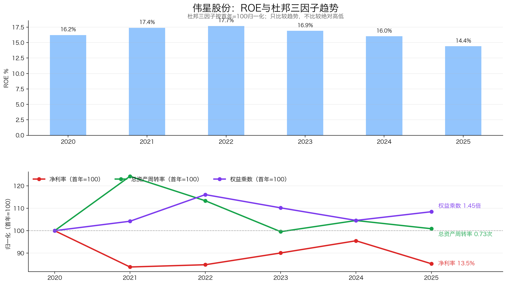
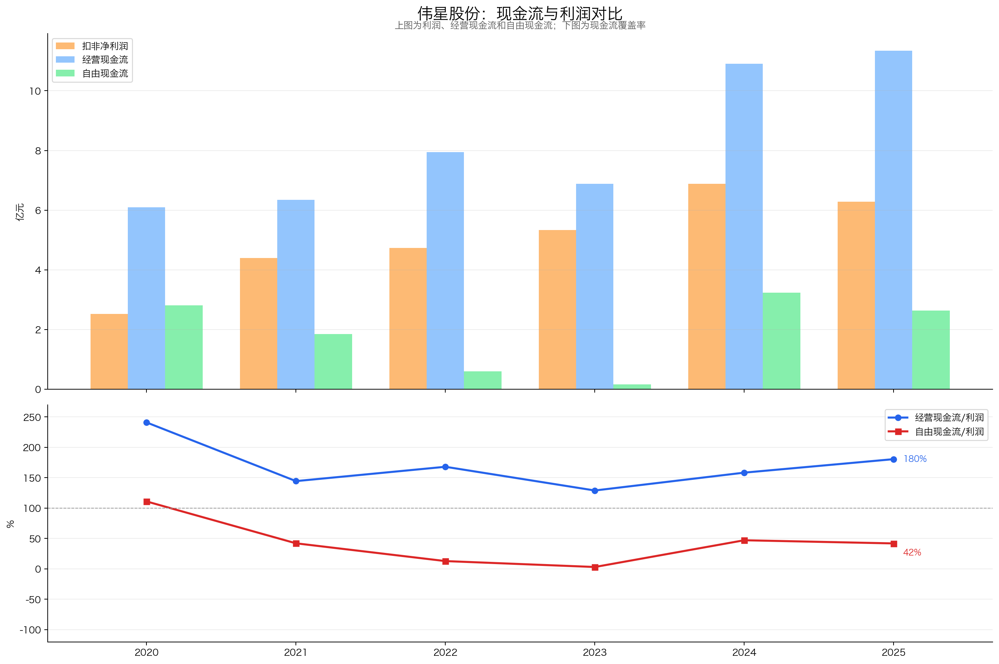
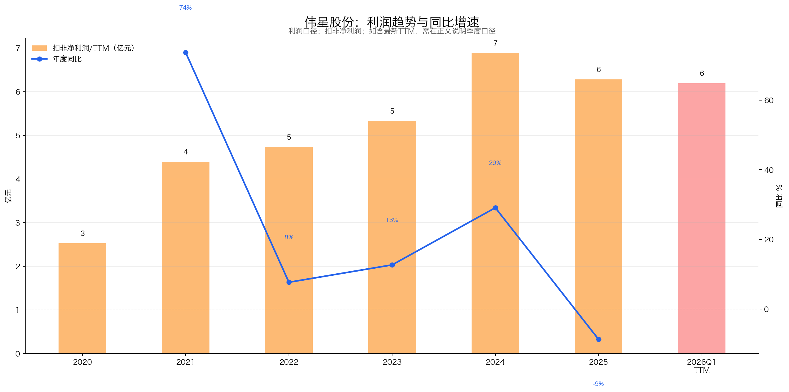
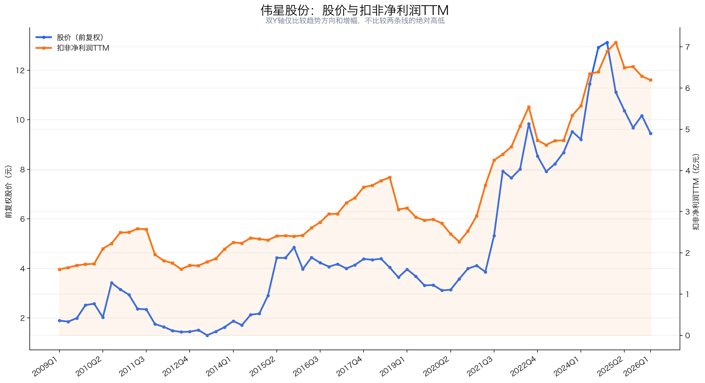

# 伟星股份（002003）3R投资分析简报

> 数据截止：行情截至2026-07-20收盘；财务截至2026Q1；年度数据截至2025年报；重大公告截至2026-07-21。  
> 3R总分：**66.0/100**  
> 当前评级：**观察；等待更好的价格或利润确认**  
> 一句话结论：**伟星股份是一门有组合护城河、经营质量尚可的细分制造生意，管理层经营能力较好，但资本投入偏重、最新利润下滑，报告基准日价格没有提供足够赔率。**

## 一、公司概况：这家公司靠什么赚钱？

| 项目 | 内容 |
|---|---|
| 主营业务 | 为服装品牌及其指定代工厂提供钮扣、拉链等服饰辅料 |
| 核心产品 | 2025年拉链收入25.60亿元、钮扣收入19.89亿元，合计占营收94.78% |
| 赚钱方式 | 依靠非标开发、柔性制造、稳定品质、快速交付和全球服务获取订单与复购 |
| 客户与场景 | 服务服装品牌及其供应链；单个辅料成本低，但质量、设计和交期会影响成衣生产 |
| 行业位置 | 国内综合服饰辅料龙头；与全球拉链龙头YKK相比规模仍小 |
| 实际控制人 | 章卡鹏、张三云；伟星集团为控股股东 |
| 核心管理层 | 蔡礼永任董事长，郑阳任副董事长兼总经理 |
| 报告基准日价格 | 10.00元，总市值118.89亿元 |

伟星股份做的是“小产品、大服务”的生意。客户购买的不只是一颗钮扣或一条拉链，还包括颜色与材料开发、模具和工艺、品质稳定、快速交付以及跟随服装订单全球迁移的能力。公司护城河来自多项能力叠加，而不是绝对垄断或持续提价；最关键的经营变量是海外订单能否转化为利润，以及扩产后的产能利用率和自由现金流能否改善。

## 二、3R决策摘要

| 维度 | 得分 | 核心判断 |
|---|---:|---|
| Right Business | 42.0/60 | 生意质量中上，但不是轻资本、高定价权模式 |
| Right People | 14.5/20 | 经营稳定，资本配置仍需观察 |
| Right Price | 9.5/20 | 报告基准日估值合理，赔率不足 |
| **总分** | **66.0/100** | **观察；暂不急于买入** |

- **当前最大矛盾**：公司质量不错，但扣非利润连续下滑，估值仍在可用历史中位数附近。
- **最关键验证条件**：海外业务、产能利用率和自由现金流能否同步改善，并推动扣非TTM利润止跌。
- **门槛判断**：Right Business和Right People超过最低门槛；Right Price低于10/20，当前行动应服从价格门槛，以等待为主。

## 三、Right Business：有组合护城河，但资本投入偏重

伟星股份的生意质量中上：业务容易理解，组合护城河真实存在，ROE和利润回款质量尚可；但公司不具备强定价权，资本投入偏重，最新利润已经转弱，海外扩张的回报仍需验证。

### 3.1 Right Business评分概览

| 维度 | 得分 | 满分 | 核心判断 |
|---|---:|---:|---|
| 业务简单可持续、不易被替代 | 12.5 | 14 | 商业模式清晰、需求长期存在，但仍受服装景气影响 |
| 竞争格局清晰、护城河深厚、有定价权 | 12.0 | 18 | 组合护城河真实，具体份额未验证，定价权偏弱 |
| 轻资本投入、高资产回报率、自由现金流好 | 9.0 | 14 | ROE质量尚可，但资本投入偏重、自由现金流受压 |
| 盈利成长真实、稳定、可持续 | 4.5 | 8 | 历史增长不错，最新扣非利润连续下降 |
| 有长期增长空间 | 4.0 | 6 | 海外和多品类有跑道，投入回报尚未兑现 |
| **Right Business** | **42.0** | **60** | **生意质量中上，但不是轻资本、高定价权模式** |

### 3.2 商业模式清晰、需求可持续，但仍受服装周期影响

伟星的商业模式容易理解：品牌客户提出颜色、材料、外观、功能和交期要求，公司完成研发、打样、模具、配色、生产和检测，再向品牌或其指定代工厂交付。单颗钮扣、单米拉链价值不高，利润来自大量SKU、规模制造和持续复购。

服装长期需要钮扣和拉链，品类被整体替代的风险较低；但辅料订单仍受服装消费、库存和出口周期影响，2025年国内服装产量及出口均下降，伟星国内收入也下降0.51%。

**判断：基本符合。** 需求长期存在、商业模式清楚，但行业并非完全非周期，公司只具备中等转换成本。

| 具体指标 | 判断依据 | 得分 |
|---|---|---:|
| 商业模式是否简单、容易理解 | 向服装品牌及代工厂提供非标辅料，赚钱方式清晰 | 5.0/5 |
| 需求是否长期存在 | 服装长期需要钮扣和拉链，底层需求稳定 | 4.5/5 |
| 周期性是否可控 | 订单仍受服装消费、库存和出口周期影响 | 1.0/2 |
| 产品或品类替代风险 | 钮扣、拉链作为品类被整体替代的风险较低 | 2.0/2 |
| **小计** |  | **12.5/14** |

### 3.3 竞争格局分层，护城河来自组合能力，定价权偏弱

**竞争格局。** 中低端辅料市场参与者多、集中度低，产品同质化和价格竞争明显；中高端市场更重视研发、品牌认证、品质、环保、快反和全球交付，份额有向规模企业集中的条件。伟星在国内综合辅料领域领先，但全球拉链市场仍有规模显著更大的YKK。公开资料缺少可复算的行业市场规模，因此不能把“国内龙头”直接等同于明确的全球市场份额。

| 公司 | 竞争位置 | 核心特点 | 与伟星的关系 |
|---|---|---|---|
| YKK | 全球拉链龙头 | FY2024紧固件收入4,331亿日元，覆盖70个国家和地区 | 全球业务对标，规模明显领先 |
| 伟星股份 | 国内综合辅料龙头 | 钮扣、拉链、多品类开发及全球服务 | 分析主体 |
| 浔兴股份 | 国内拉链企业 | 2025年拉链收入21.64亿元，另有跨境电商业务 | A股拉链业务可比公司 |

**护城河。** 公司参与15项国家和行业标准、拥有1,600余项国内外专利，并形成“研发与材料工艺＋柔性制造＋品牌客户协同＋全球生产服务”的组合能力。前五大客户收入占比仅8.68%，说明公司不是依赖单一客户，而是把服务能力复制给大量品牌和代工厂。具体供应商仍可更换，但品牌认证、重新打样、品质稳定、快反交付和全球配套提高了转换成本。这些单项能力都能被模仿，组合形成则需要长期组织积累。

**定价权。** 2025年钮扣销量增长2.71%、收入增长1.79%，拉链销量增长4.14%、收入增长3.07%，隐含单位收入分别下降约0.90%和1.03%。公司具备一定议价空间，但增长主要来自销量和份额，不具备消费品牌式的持续主动提价权。

**判断：部分符合。** 中高端市场格局对龙头有利，伟星的组合护城河真实存在，但具体市场份额缺少验证，定价权也偏弱。

| 具体指标 | 判断依据 | 得分 |
|---|---|---:|
| 行业竞争格局 | 中低端市场分散且竞争激烈，中高端份额具备集中条件 | 3.0/4 |
| 公司行业位置和份额 | 国内综合辅料龙头，但缺少可复算市场份额，全球规模低于YKK | 2.0/3 |
| 护城河深度与持续性（含公司替代风险） | 组合壁垒提高转换成本，但不构成绝对不可替代 | 5.0/6 |
| 定价权和成本传导 | 2025年销量增速高于收入增速，隐含单位收入下降 | 2.0/5 |
| **小计** |  | **12.0/18** |

### 3.4 资本投入偏重，ROE质量尚可，自由现金流被扩产消耗

**资本投入。** 伟星不是轻资本公司。2020—2025年资本开支分别为3.29、4.50、7.34、6.71、7.66和8.71亿元，长期处于扩产投入状态。2025年综合产能利用率为65.92%，境外产能利用率仅48.15%；越南工业园仍未盈利，拉链织带搬迁技改效益未达预期，高档拉链扩建项目又延期。当前需要验证的不是“有没有产能”，而是新增资产能否提高利用率和利润。

**ROE历史趋势。** 2020—2022年加权ROE由16.23%升至17.69%，随后连续回落，2025年降至14.41%。当前回报率仍属中等偏好，但趋势已经转弱。

杜邦拆解显示，2025年ROE下降主要来自销售净利率回落至13.50%，总资产周转率仅0.73、没有随扩产改善；权益乘数为1.45，公司没有依靠高杠杆维持ROE。因此盈利质量尚可，但新增资产的周转和回报尚未兑现。

**现金转化。** 2020—2025累计经营现金流是累计归母利润的1.53倍，说明利润能够回款；但累计自由现金流只有累计利润的34.91%，大量经营现金被资本开支消耗。2025年经营现金流11.35亿元、资本开支8.71亿元，自由现金流仅2.63亿元；2026Q1自由现金流进一步降至约-1.11亿元。

**判断：部分符合。** 伟星的ROE不依赖高杠杆，利润真实性较好；但资本投入偏重、资产周转没有改善、自由现金流长期受到扩产挤压，不属于轻资本复利模式。

| 具体指标 | 判断依据 | 得分 |
|---|---|---:|
| 资本投入强度与产能利用率 | 资本开支持续上升，综合产能利用率65.92%，境外仅48.15% | 1.5/4 |
| ROE/ROIC水平及历史趋势 | ROE长期约14%—18%，但2022年以来连续回落 | 3.0/4 |
| 杠杆依赖与杜邦质量 | 权益乘数1.45，ROE没有依赖高杠杆维持 | 2.0/2 |
| 经营现金流和自由现金流 | 累计CFO/利润1.53倍，但累计FCF/利润仅34.91% | 2.5/4 |
| **小计** |  | **9.0/14** |

### 3.5 历史盈利成长中等偏好，但最新利润已经转弱

2020—2025年扣非利润5年CAGR为19.96%，但2020年存在特殊时期低基数，不能直接外推；2022—2025年扣非利润3年CAGR为9.92%，更能代表成熟阶段。增长在2021—2024年总体延续，但2025年扣非利润下降8.70%，2026Q1继续下降9.37%，2026Q1扣非TTM较上年同期下降约12.9%，利润线已经形成连续下行。

增长来源也发生变化。2025年国内收入下降0.51%，国际收入增长8.95%，销量增长快于产品收入增长，说明增量主要来自海外订单和销量，而不是提价。汇兑损失是2025年和2026Q1的重要扰动，但扣除股份支付后的2025年净利润仍下降7.99%，不能把盈利转弱全部解释为一次性费用。

**判断：部分符合。** 公司过去证明了盈利增长能力，但当前增长已经失速；在扣非TTM止跌以前，不能继续沿用2021—2024年的增长斜率。

| 具体指标 | 判断依据 | 得分 |
|---|---|---:|
| 3年、5年利润增长 | 3年扣非CAGR约9.92%，5年CAGR受2020年低基数影响 | 1.5/2 |
| 增长稳定性 | 2021—2024年总体增长，2025年转为下降 | 0.5/1 |
| 增长来源质量 | 主要依靠海外和销量，提价贡献有限 | 1.5/2 |
| 最新利润趋势 | 2025年和2026Q1扣非利润连续下降 | 0.5/2 |
| 利润与现金流匹配 | 经营现金流好，但自由现金流受到扩产挤压 | 0.5/1 |
| **小计** |  | **4.5/8** |

### 3.6 海外和“大辅料”提供跑道，但增长回报尚未兑现

海外是最明确的增长来源：国际收入由2020年的6.06亿元增至2025年的17.22亿元，5年CAGR约23.2%，占营收比重由24.29%升至35.88%。全球营销和生产网络能够承接服装产业链向东南亚迁移，这是伟星区别于普通辅料厂的重要能力。

“大辅料”战略可以通过金属制品、织带、绳带和标牌提高单客户钱包份额，但2025年其他服饰辅料收入仅1.74亿元、占营收3.63%，尚未形成足以改变公司结构的第二曲线。与此同时，海外毛利率下降、境外产能利用率偏低、越南项目未盈利，说明收入跑道尚未完全转化为利润和自由现金流。

**判断：部分符合。** 公司具有海外份额提升和品类扩张空间，但长期增长必须同时表现为利润、资产周转和自由现金流改善，而不能只看收入和产能扩张。

| 具体指标 | 判断依据 | 得分 |
|---|---|---:|
| 核心业务和行业增长空间 | 需求长期存在，但国内业务已经趋于成熟 | 1.5/2 |
| 市场份额提升空间 | 中高端集中和综合服务能力有利于龙头提份额 | 1.5/2 |
| 地域扩张与第二曲线 | 海外收入增长较快，“大辅料”仍处早期 | 0.5/1 |
| 再投资回报及增长质量 | 境外利用率偏低、越南项目未盈利、自由现金流受压 | 0.5/1 |
| **小计** |  | **4.0/6** |

## 四、Right People：经营能力较好，资本配置仍需验证

| 维度 | 判断 | 决定性证据 | 得分 |
|---|---|---|---:|
| 诚信与治理 | 基本符合 | 实控人与经营层清晰、审计意见标准；控股股东质押及关联资产交易需要持续跟踪 | 4.5/6 |
| 专注与经营能力 | 基本符合 | 长期专注服饰辅料，没有高商誉多元化并购；已建立国内外生产和服务网络 | 5.5/7 |
| 资本配置与股东利益 | 部分符合 | 股权激励覆盖核心团队；高分红、重资本扩张和短期借款增长同时存在资金张力 | 4.5/7 |
| **Right People** |  |  | **14.5/20** |

管理层长期专注主业，组织和全球化执行能力是公司护城河的一部分。需要观察的不是“愿不愿意分红”，而是在2025年资本开支8.71亿元、自由现金流2.63亿元的情况下，仍派息5.92亿元并增加短期借款是否可持续；向控股股东购买3.17亿元工业园资产的投入回报，也需要后续经营数据验证。

## 五、Right Price：估值合理，但赔率不足

| 维度 | 判断 | 决定性证据 | 得分 |
|---|---|---|---:|
| 利润位置与股价利润匹配度 | 一般 | 股价从高点回落幅度大于利润下滑，但扣非TTM利润仍处下降阶段 | 2.5/5 |
| 当前估值与历史位置 | 一般 | 扣非PE约19.19倍，处于2018年以来约51.8%分位；扣现金后PE约17.15倍 | 3.0/6 |
| 股息及持有回报 | 部分符合 | 静态股息率约5%，但2025财年派息率高达91.91%，且自由现金流低于派息 | 2.0/3 |
| 保守/中性情景与赔率 | 较差 | 中性情景上行约7.1%，压力情景下行约34.4%，风险收益不对称 | 2.0/6 |
| **Right Price** |  |  | **9.5/20** |

| 情景 | 利润口径 | PE | 对应每股价值 | 相对10.00元 |
|---|---:|---:|---:|---:|
| 压力 | 扣非TTM再下降10%，5.57亿元 | 14倍 | 6.56元 | -34.4% |
| 保守 | 当前扣非TTM 6.19亿元 | 16倍 | 8.34元 | -16.6% |
| 中性 | 恢复至2024年扣非利润6.88亿元 | 18.5倍 | 10.71元 | +7.1% |

报告基准日10.00元并不昂贵，但也不是明显的好价格。当前估值接近可用历史中位数，利润却仍在下降；5%股息只能缓冲部分回撤，无法覆盖利润和估值同时下行。只有利润趋势改善，或估值回落到可用历史25%分位附近，赔率才会明显改善。

## 六、最终行动

### 现在怎么办？

- 纳入观察池，等待利润确认或更好的买入价格；不因5%静态股息率直接重仓。

### 什么情况下提高关注？

- 扣非TTM利润止跌，海外收入增长开始兑现为海外毛利率和净利润改善；
- 境外产能利用率、资产周转率和自由现金流同步改善；
- 基本面未恶化时，PE回到可用历史25%分位附近（约15.6倍）。

### 什么情况下说明判断错了？

- 钮扣、拉链及国际收入连续两个报告期弱于下游，组合护城河未能转化为份额；
- 资本开支持续高位，但海外项目、产能利用率、资产周转率和自由现金流不改善；
- 短期借款、应收或存货持续上升，同时维持高派息或发生新的高额关联资产交易。

## 七、数据边界

- **引用的完整报告**：`伟星股份_投资分析报告_2026-07-21.md`；本简报沿用其数据、表格、情景分析和图表，不重新统计财务数据。
- **行情口径**：使用原报告2026-07-20收盘数据，因此本文称“报告基准日价格”，不冒充更新后的实时价格。
- **本地资料补充**：无；原报告已有证据足以完成本次3R评分。
- **外部官方资料补充**：无；未重新检索官网或下载年报。
- **仍未验证事项**：具体市场份额、客户留存率、快反订单占比、单客户钱包份额、2026Q1分产品和分地区表现。
- **评分差异说明**：原完整报告为72.0/100；本简报按独立的3R 60/20/20权重重新评分为66.0/100，差异来自评分体系变化，不是数据更新。

---

*本简报仅供学习研究，不构成投资建议。*
