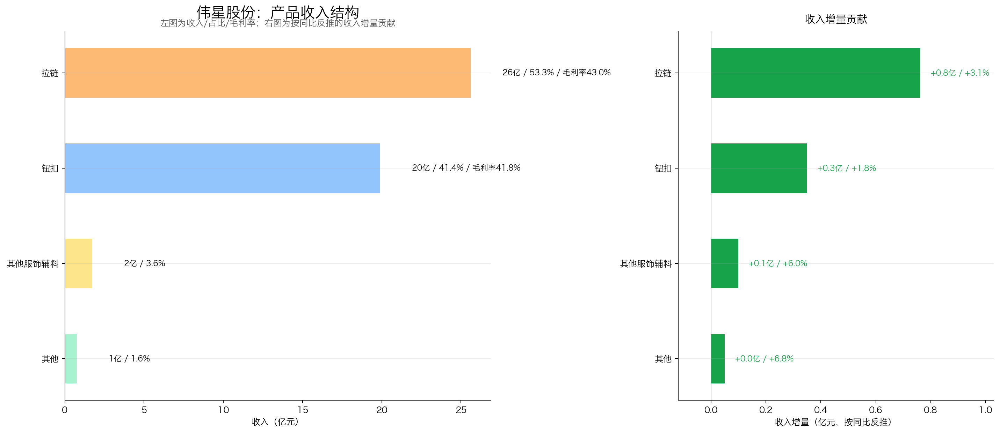
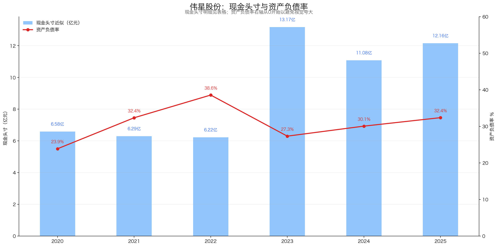
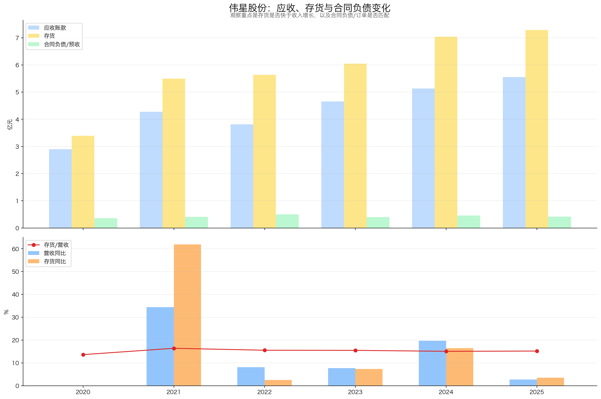
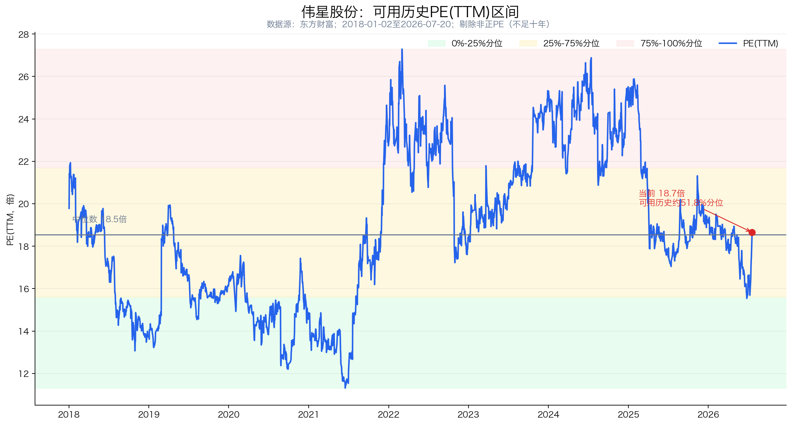

# 伟星股份（002003）投资分析报告

> 数据截止：行情截至 2026-07-20 收盘；财务截至 2026Q1；年度数据截至 2025 年报；重大公告截至 2026-07-21。  
> 结论：**关注（72.0/100）**。伟星股份是国内钮扣、拉链等服饰辅料龙头，真正的优势不是“一个钮扣能卖多贵”，而是为全球品牌提供多品类、非标定制、快交付和跨区域生产服务。公司护城河清晰、客户分散、经营现金流好、资产负债表不差；但行业仍受服装景气影响，2025年以来收入低增长、利润转为下滑，海外增长也伴随汇率和贸易风险。当前10.00元对应约19.2倍扣非PE，可用历史分位约52%，并不便宜；5%静态股息率有吸引力，但2025财年派息率高达91.91%，不能简单当成稳定债券替代。

## 先说人话：伟星股份到底靠什么赚钱？

消费者买衣服时通常不会因为一颗钮扣决定品牌，但服装品牌不能没有钮扣和拉链，而且越是强调设计、快反、环保和全球交付的品牌，越不愿意频繁更换辅料供应商。

伟星股份做的就是这门“小产品、大服务”的生意：

1. 品牌客户提出颜色、材料、外观、功能和交期要求；
2. 公司用研发、模具、配色、生产和检测能力做出非标准化辅料；
3. 通过全球五十多个国家和地区的营销服务网络，向品牌或其指定代工厂交货；
4. 订单跟随服装生产向东南亚等地区迁移，公司再用海外工厂就近承接；
5. 单颗钮扣、单米拉链价值不高，但依靠大量SKU、客户认证、稳定品质和交付效率积累复购。

因此，它更像“服装品牌供应链里的精密配套平台”，而不是普通低端拉链厂。护城河来自综合服务和长期协同，不来自绝对垄断；下游景气差、品牌压价或订单外迁时，公司仍会承压。

| 核心指标 | 当前值 | 怎么理解 |
|---|---:|---|
| 股价 | 10.00元 | 2026-07-20收盘 |
| 总市值 | 118.89亿元 | 东方财富总市值口径 |
| PE(TTM) | 18.65倍 | 东方财富归母口径 |
| 扣非PE(TTM) | 19.19倍 | 2026Q1扣非TTM 6.19亿元 |
| 可用历史PE分位 | 约51.8% | 东方财富仅提供2018-01-02以来数据，不足完整十年 |
| 2025财年每股分红 | 0.50元 | 中期0.10元+年度0.40元，均已实施 |
| 静态股息率 | 约5.00% | 按10.00元计算，不代表未来承诺收益率 |
| 2025加权ROE | 14.41% | 连续两年回落，未靠高杠杆维持 |
| 2026Q1林奇现金头寸 | 12.68亿元 | 货币资金减长期有息负债；长期借款、应付债券均为0 |
| 扣现金后PE | 约17.15倍 | 现金利息已在利润中，不能在情景估值中再重复加现金 |

## 一、公司画像、能力圈与红线

**初筛结论：通过，但价格和短期利润趋势需要谨慎。**

- 公司画像：2025年营收48.00亿元，拉链收入25.60亿元、钮扣收入19.89亿元，两者合计占营收94.78%；海外收入17.22亿元，占比35.88%。
- 能力圈：商业模式可理解。研究难点主要是品牌客户份额、快反订单占比、产能利用率、海外工厂回报和真实定价权，公司没有完整公开这些连续数据。
- 控制与管理：伟星集团为控股股东；章卡鹏、张三云为共同实际控制人。蔡礼永任董事长，郑阳任副董事长兼总经理，所有权与日常经营管理层并非同一人。
- 审计：2025年财务报告和内部控制均为标准无保留意见；关键审计事项是收入确认、应收账款减值。
- 经营红线：2025年营收增长2.69%，扣非利润下降8.70%；2026Q1营收增长6.22%，扣非利润继续下降9.37%，利润下滑已连续出现。
- 财务红线：2025年资本开支8.71亿元，自由现金流仅2.63亿元；2026Q1经营现金流0.44亿元、资本开支1.56亿元，短期仍处扩产投入期。
- 治理观察：2025年以3.17亿元向控股股东购买邵家渡工业园土地厂房；截至2026-01-08，伟星集团质押1.04亿股，占其持股34.45%、占总股本8.76%，不构成一票否决，但需要持续跟踪。

后续必须验证：

1. 海外订单增长能否继续快于国内，并真正转化为利润，而不是被汇率、关税和海外制造成本抵消；
2. 2025—2026Q1利润下降究竟是短期汇率/费用扰动，还是成熟主业进入低增长；
3. 高资本开支、接近全额分红和短期借款增长能否长期同时维持。

## 二、好行业：辅料不可缺，但需求仍跟着服装景气走

### 2.1 需求质量

钮扣和拉链属于服装、箱包的刚需零部件，单价低、占整件产品成本很小，却影响外观、功能和交付，因此品牌客户通常不会只为一点价差冒质量风险。这个特征让优质供应商具有一定稳定性。

但行业并非真正非周期。公司年报明确指出，辅料需求与服装终端消费和宏观景气高度相关。2025年我国规模以上企业服装产量同比下降3.44%，服装及衣着附件出口额下降5.0%；行业整体承压，伟星国内收入也下降0.51%。

### 2.2 竞争格局

行业中低端参与者多、集中度低，价格竞争激烈；中高端市场则更看重多品类开发、品牌认证、柔性交付、环保能力和全球服务，规模企业有份额提升机会。

| 公司 | 最新日期 | 市值 | PE(TTM) | 定位 |
|---|---|---:|---:|---|
| 伟星股份 | 2026-07-20 | 118.89亿元 | 18.65倍 | 综合辅料，钮扣+拉链+大辅料 |
| 浔兴股份 | 2026-07-20 | 23.23亿元 | 12.62倍 | SBS品牌，核心为拉链 |
| YKK | 未上市 | 不适用 | 不适用 | 全球拉链龙头，业务对标而非估值可比 |

YKK官方综合报告披露，FY2024紧固件业务收入4,331亿日元、营业利润475亿日元，拉链销量超过100亿条，业务覆盖70个国家和地区，规模显著领先；但YKK并非上市公司，不能比较PE。浔兴股份2025年拉链收入21.64亿元、毛利率32.46%，另有6.11亿元跨境电商收入，并非纯拉链公司。伟星的A股市值约为浔兴股份5.1倍，市场已经给予其综合辅料能力和盈利质量明显溢价。

公开年报没有提供全球或中国拉链、钮扣市场的可复算分母，因此本报告不引用未经核验的“全球份额”数字，也不把企业产能或销量直接当作市场份额。

### 2.3 壁垒在哪里

- 研发与标准：公司参与15项国家和行业标准，拥有国内外专利1,600余项，具备材料、颜色、外观和功能一体化开发能力；
- 规模与柔性：国内外十大工业园区，年产钮扣126亿粒、拉链10亿米；2025年综合产能利用率65.92%，规模壁垒已形成，但闲置产能也意味着扩张回报尚未完全兑现；
- 服务网络：国内50多家销售分/子公司和办事处，国际网络覆盖五十多个国家和地区；
- 客户协同：非标、以单定产，直接服务品牌或指定代工厂，稳定品质与快交付比单纯低价重要；
- 全球产能：服装生产向东南亚迁移时，海外园区可以就近承接，而不是被动丢失订单。

### 2.4 议价权和替代风险

2025年钮扣销量增长2.71%、收入增长1.79%，估算单粒收入下降约0.90%；拉链销量增长4.14%、收入增长3.07%，估算单米收入下降约1.03%。这说明增长主要靠量，不是提价，公司的定价权存在但不强。

钮扣、拉链本身难以被整体替代，但供应商可以被替换。真正降低替换概率的是认证、开发速度、品质稳定和全球交付，而不是产品物理形态本身。

**好行业评分：14.5/20**

| 子项 | 得分 | 满分 |
|---|---:|---:|
| 需求质量/非周期性 | 4.0 | 6 |
| 竞争格局 | 2.5 | 4 |
| 进入壁垒 | 3.5 | 4 |
| 上下游议价权 | 2.0 | 3 |
| 替代品威胁 | 2.5 | 3 |
| 小计 | **14.5** | **20** |

## 三、好公司·定性：综合服务是护城河，提价不是核心能力

### 3.1 护城河

伟星的护城河不是某一项专利，而是“产品开发+柔性制造+全球服务+品牌客户协同”的组合。单项能力容易模仿，组合能力需要多年组织积累。前五大客户销售额只占8.68%，第一大客户占3.07%，说明公司不是依赖单一大客户，而是把服务能力复制给大量品牌和代工厂。

“大辅料”战略也有合理性：钮扣、拉链之外增加金属制品、织带、绳带、标牌等品类，可以提高单个客户钱包份额。但2025年其他服饰辅料收入仅1.74亿元，占比3.63%，第二曲线仍小，当前价值主要还是钮扣和拉链。

### 3.2 复购与粘性

服饰辅料具备持续复购，但复购主体是品牌和代工厂，不是消费者。品牌一旦完成供应商认证、颜色和工艺开发，频繁切换会增加质量和交付风险；伟星全球布点后还能跟随订单迁移，粘性高于普通标准件供应商。

不过，公司没有披露复购率、品牌客户留存率、快反订单占比和单客户钱包份额，因此只能判断“业务结构有粘性”，不能把它等同于高转换成本的软件订阅。

### 3.3 定价权

非标定制、低成本占比和质量重要性带来一定定价权；但2025年量增快于收入、单价估算小幅下降，说明竞争环境下公司更依赖份额和效率。它更像“有议价空间的优质制造商”，而不是可以持续主动提价的消费品牌。

### 3.4 管理层与资本配置

正面因素：

- 实控人和核心团队长期稳定，董事长、总经理均有多年行业经营经验；
- 第六期股权激励以5.12元/股向196名核心骨干授予2,000万股，占实施后总股本约1.68%，有利于稳定全球化扩张团队；
- 2025财年中期和年度现金分红均已实施，累计每股0.50元；
- 长期专注主业，没有商誉和多元化并购包袱。

需要扣分：

- 2025财年累计现金分红5.92亿元，占归母利润91.91%，同期资本开支8.71亿元、短期借款增加，回报股东与扩张投入存在资金张力；
- 向控股股东购买3.17亿元工业园资产虽已履行程序并完成，但关联定价和后续投入产出仍需跟踪；
- 控股股东质押比例上升至其持股的34.45%，质押期限较长；
- 第六期激励另有300万股预留，第五期仍有845.91万股未解禁；考核净利润剔除股份支付费用，评价实际盈利时仍应坚持财报口径；
- 2025年扣除股份支付后的净利润仍下降7.99%，不能把利润下滑主要归因于激励费用。

年报披露后至2026-07-21，公司未新增重大收购、重组、股份回购或董高减持公告；4月发生的职工代表董事调整不涉及董事长、总经理或财务总监离任。

**好公司·定性评分：16.0/20**

| 子项 | 得分 | 满分 |
|---|---:|---:|
| 护城河 | 6.0 | 7 |
| 复购/粘性/低替代性 | 4.0 | 5 |
| 定价权 | 3.5 | 5 |
| 管理层 | 2.5 | 3 |
| 小计 | **16.0** | **20** |

## 四、好公司·定量：利润能变成现金，但扩产吃掉大部分自由现金流

### 4.1 ROE质量与盈利模式

| 年份 | 加权ROE | 销售净利率 | 总资产周转率 | 权益乘数 |
|---:|---:|---:|---:|---:|
| 2020 | 16.23% | 15.83% | 0.73 | 1.34 |
| 2021 | 17.40% | 13.27% | 0.90 | 1.40 |
| 2022 | 17.69% | 13.43% | 0.82 | 1.56 |
| 2023 | 16.90% | 14.26% | 0.72 | 1.48 |
| 2024 | 16.02% | 15.12% | 0.76 | 1.40 |
| 2025 | 14.41% | 13.50% | 0.73 | 1.45 |

注：ROE为同花顺加权口径；杜邦三因子按平均资产、平均权益近似拆解，只看趋势。

伟星ROE长期稳定在14%—18%，质量尚可，但并非极高回报模式。2025年ROE降至14.41%，主要是净利率回落，资产周转率也没有改善；权益乘数仅1.45，说明没有依靠高杠杆粉饰回报。

### 4.2 利润增长与持续性

| 年份/期间 | 营收 | 归母净利润 | 扣非净利润 | 扣非同比 |
|---|---:|---:|---:|---:|
| 2020 | 24.96亿元 | 3.96亿元 | 2.53亿元 | -10.00% |
| 2021 | 33.56亿元 | 4.49亿元 | 4.39亿元 | 73.69% |
| 2022 | 36.28亿元 | 4.89亿元 | 4.73亿元 | 7.70% |
| 2023 | 39.07亿元 | 5.58亿元 | 5.33亿元 | 12.69% |
| 2024 | 46.74亿元 | 7.00亿元 | 6.88亿元 | 29.09% |
| 2025 | 48.00亿元 | 6.45亿元 | 6.29亿元 | -8.70% |
| 2026Q1 | 10.40亿元 | 0.93亿元 | 0.88亿元 | -9.37% |

- 2020→2025营收5年CAGR为13.97%，扣非利润5年CAGR为19.96%，但2020利润受特殊时期低基数影响，不应直接外推。
- 2022→2025扣非利润3年CAGR为9.92%，更能代表成熟阶段；当前扣非PE 19.19倍，对应历史PEG约1.93。
- 2026Q1扣非TTM降至6.19亿元，较2025Q1时的7.11亿元下降约12.9%。
- 2025年财务费用从0.02亿元升至0.66亿元，主要因汇兑由净收益转为3,536.92万元净损失、利息收入下降；但扣除股份支付后的净利润仍下降7.99%，利润压力不只是会计激励费用。
- 2026Q1汇兑净损失2,126.08万元，上年同期为净收益189.84万元，是当季增收降利的重要扰动；同时信用减值损失同比增加123.97%，回款质量需要继续观察。

结论：过去五年成长不错，但最新利润线已经向下。未来要靠海外份额、综合辅料和产能效率重新驱动，而不能继续沿用2021—2024年的高增长斜率。

### 4.3 产品结构与增长来源

| 2025年产品 | 收入 | 总营收占比 | 同比 | 毛利率 | 增长判断 |
|---|---:|---:|---:|---:|---|
| 拉链 | 25.60亿元 | 53.34% | 3.07% | 42.99% | 最大业务，量增价弱 |
| 钮扣 | 19.89亿元 | 41.44% | 1.79% | 41.76% | 基本盘稳定，增长偏慢 |
| 其他服饰辅料 | 1.74亿元 | 3.63% | 6.03% | 未披露 | 第二曲线仍小 |
| 其他 | 0.77亿元 | 1.59% | 6.84% | 未披露 | 体量有限 |

四类产品收入合计48.00亿元，与总营收完全勾稽。拉链和钮扣贡献绝大部分收入，产品结构稳但成熟；其他辅料增速较快却不足以改写结构。按销量反推，2025年钮扣和拉链平均收入分别下降约0.90%和1.03%，增长来自销量而非提价。

地区结构更值得关注：国际收入由2020年的6.06亿元增至2025年的17.22亿元，5年CAGR约23.2%，收入占比从24.29%升至35.88%；2025年国内收入30.78亿元、下降0.51%，国际收入增长8.95%，海外是当年主要增量来源。但国际业务毛利率41.10%，同比下降1.06个百分点，且汇率损失侵蚀利润，海外增长质量仍需继续验证。

产能回报是产品增长的另一面。2025年综合产能利用率从2024年的68.82%降至65.92%，境外产能利用率仅48.15%。越南工业园2024年投产后仍处爬坡期，2025年因产出不足及1,595.07万元汇兑损失继续未盈利；拉链织带搬迁技改项目效益未达预期，2.2亿米高档拉链扩建项目又延期两年。公司并不缺产能，真正需要验证的是订单和利润能否消化新增资产。

### 4.4 现金流质量

| 年份 | 归母净利润 | 经营现金流 | 资本开支 | 自由现金流 | CFO/净利润 | FCF/净利润 |
|---:|---:|---:|---:|---:|---:|---:|
| 2020 | 3.96 | 6.10 | 3.29 | 2.81 | 1.54 | 0.71 |
| 2021 | 4.49 | 6.34 | 4.50 | 1.85 | 1.41 | 0.41 |
| 2022 | 4.89 | 7.95 | 7.34 | 0.61 | 1.63 | 0.12 |
| 2023 | 5.58 | 6.88 | 6.71 | 0.16 | 1.23 | 0.03 |
| 2024 | 7.00 | 10.90 | 7.66 | 3.24 | 1.56 | 0.46 |
| 2025 | 6.45 | 11.35 | 8.71 | 2.63 | 1.76 | 0.41 |

单位：亿元；自由现金流=经营现金流－购建长期资产支付的现金。

2020—2025累计经营现金流49.51亿元，是累计归母利润32.37亿元的1.53倍，利润回款真实；但累计自由现金流只有11.30亿元，仅为累计利润的34.91%。公司不是“利润造假式低现金流”，而是扩产持续消耗现金。

2026Q1经营现金流0.44亿元、资本开支1.56亿元，自由现金流约-1.11亿元。结合综合产能利用率65.92%、越南项目仍未盈利及拉链扩建延期看，资本开支回报尚未充分兑现；若利用率不能提高，折旧和资金占用会继续压低回报。

### 4.5 现金头寸与资产负债表安全性

| 年份/期间 | 货币资金 | 长期借款 | 应付债券 | 林奇现金头寸 | 资产负债率 |
|---|---:|---:|---:|---:|---:|
| 2020 | 6.73 | 0.15 | 0 | 6.58 | 23.87% |
| 2021 | 6.34 | 0.05 | 0 | 6.29 | 32.35% |
| 2022 | 8.21 | 1.99 | 0 | 6.22 | 38.57% |
| 2023 | 14.15 | 0.98 | 0 | 13.17 | 27.32% |
| 2024 | 11.08 | 0 | 0 | 11.08 | 30.06% |
| 2025 | 12.16 | 0 | 0 | 12.16 | 32.38% |
| 2026Q1 | 12.68 | 0 | 0 | 12.68 | 31.56% |

单位：亿元。主口径遵循彼得林奇公式，不扣短期借款；公司无交易性金融资产和应付债券。

表面看安全垫较厚：2026Q1现金头寸占市值10.66%，每股约1.07元。但需要两层修正：

1. 2025年末货币资金中，2.91亿元募集资金只能用于募投项目，另有0.19亿元保证金受限；扣除后可自由支配货币资金约9.06亿元；
2. 2026Q1短期借款10.62亿元，货币资金仅为其1.19倍。短债不进入林奇公式，但经营安全分析不能忽略。

因此，公司“没有长期偿债压力”是对的，“拥有大量完全闲置净现金”则不准确。现金更多是扩产和营运安全垫，扣现金后PE约17.15倍，只是略有改善。

### 4.6 营运质量与风险信号

| 年份 | 营收 | 应收账款 | 存货 | 合同负债 | 存货/营收 |
|---:|---:|---:|---:|---:|---:|
| 2020 | 24.96 | 2.89 | 3.40 | 0.36 | 13.60% |
| 2021 | 33.56 | 4.27 | 5.50 | 0.41 | 16.39% |
| 2022 | 36.28 | 3.81 | 5.63 | 0.50 | 15.53% |
| 2023 | 39.07 | 4.65 | 6.05 | 0.40 | 15.47% |
| 2024 | 46.74 | 5.13 | 7.04 | 0.46 | 15.06% |
| 2025 | 48.00 | 5.56 | 7.28 | 0.42 | 15.17% |
| 2026Q1 | 10.40 | 5.49 | 8.21 | 0.80 | 季度不可直接年化比较 |

2025年应收增长8.33%，快于收入2.69%，需要观察；但前五大客户占比仅8.68%，集中度很低，应收风险不集中于单一客户。存货增长3.44%，与收入大体匹配，存货/营收稳定在15%左右，没有明显压货信号。

2026Q1存货升至8.21亿元、合同负债升至0.80亿元。Q1存在备货季节性，且预收款同步增加，单季不能直接判定库存恶化；但信用减值损失同比增加123.97%，公司解释为补提坏账准备，已经构成需要跟踪的回款信号。若后续两个报告期存货持续快于收入、应收继续抬升或坏账准备继续增加，才构成明确恶化。

**好公司·定量评分：31.0/40**

| 子项 | 得分 | 满分 |
|---|---:|---:|
| ROE质量与盈利模式 | 7.0 | 9 |
| 利润增长来源与持续性 | 4.5 | 7 |
| 现金流质量 | 5.0 | 7 |
| 现金头寸与资产负债表安全性 | 5.5 | 6 |
| 营运质量（应收/存货/合同负债） | 4.5 | 5 |
| 产品结构与增长来源 | 4.5 | 6 |
| 小计 | **31.0** | **40** |

## 五、好时机：股息率不错，但估值只在中位数附近

### 5.1 股价与利润线

2020—2024年扣非TTM从约2.53亿元升至6.88亿元，股价总体跟随利润上行；2024年末前复权股价达到13.12元。此后到2026Q1，扣非TTM降至6.19亿元、下降约10%，前复权股价降至9.45元、下降约28%，估值压缩幅度大于利润下滑。

这说明市场已经消化了一部分增长降速，但利润线仍在下降，不能仅因股价从高点回落就认定便宜。主图只比较趋势和增幅，不比较两条线在图上的绝对高低。

### 5.2 PE与历史分位

| 指标 | 数值 |
|---|---:|
| 当前归母PE(TTM) | 18.65倍 |
| 当前扣非PE(TTM) | 19.19倍 |
| 可用历史区间 | 2018-01-02至2026-07-20 |
| 可用历史PE分位 | 51.8% |
| 25%分位 | 15.61倍 |
| 中位数 | 18.55倍 |
| 75%分位 | 21.70倍 |

东方财富历史估值仅从2018年开始，无法完整覆盖近十年，因此本报告不把51.8%冒充严格十年分位。就可核验区间而言，当前估值约在中位数，属于合理而非低估。

### 5.3 PEG与股息率

- PEG：19.19倍扣非PE ÷ 2022→2025扣非利润3年CAGR 9.92% = 约1.93。该数值不便宜，而且最新TTM利润已经下降，PEG只能作辅助。
- 股息率：2025财年中期0.10元+年度0.40元，按10元股价对应5.00%。
- 可持续性：2025财年派息5.92亿元，占归母利润91.91%；高股息的基础是高派息率，不是利润高增长。若继续高资本开支，未来分红、借款和扩张之间需要重新平衡。

### 5.4 市场信号与预期差

可能的正向预期差是：海外收入继续快于国内、服装产业链外迁反而强化伟星全球产能价值；汇率恢复正常后，2025年的汇兑损失不再重复。

但这些尚未得到2026Q1利润验证。Q1收入增长6.22%，扣非利润下降9.37%，说明海外、汇率、费用和产能回报仍需后续报表确认。

### 5.5 毛估估

以下不是盈利预测，而是用已实现利润做压力测试；净利润已含现金利息，不再机械加回现金，避免重复计算。

| 情景 | 利润口径 | PE | 对应每股价值 | 相对10.00元 |
|---|---:|---:|---:|---:|
| 压力 | 扣非TTM再下降10%，5.57亿元 | 14倍 | 6.56元 | -34.4% |
| 保守 | 当前扣非TTM 6.19亿元 | 16倍 | 8.34元 | -16.6% |
| 中性 | 恢复至2024扣非6.88亿元 | 18.5倍 | 10.71元 | +7.1% |

当前赔率一般：恢复到2024年利润并回到历史中位估值，上行空间也只有约7%；若利润继续下降并进入低估值区间，下行空间明显更大。5%股息可缓冲部分回撤，但不能抵消盈利和估值同时下行。

**好时机评分：10.5/20**

| 子项 | 得分 | 满分 |
|---|---:|---:|
| 股价 vs 利润线 | 2.0 | 5 |
| PE及PE百分位 | 2.5 | 5 |
| PEG | 0.5 | 2 |
| 股息率 | 2.5 | 3 |
| 市场信号与预期差 | 1.0 | 2 |
| 毛估估 | 2.0 | 3 |
| 小计 | **10.5** | **20** |

## 六、投资结论：值不值得下注，拿不拿得住？

### 6.1 商业模式好不好（Right Business）

#### 6.1.1 业务简单可持续、不易被替代

伟星基本符合。业务简单易懂，本质是向服装品牌及代工厂提供钮扣、拉链等非标辅料。底层需求长期存在，产品被整体替代的风险较低；但订单仍受服装消费、库存和出口周期影响，供应商也可以更换，品牌认证、重新打样和质量验证只形成中等转换成本。

#### 6.1.2 竞争格局清晰、护城河深厚、有定价权

伟星部分符合。中低端市场分散且价格竞争激烈，中高端份额有向规模企业集中的趋势；研发、柔性制造、全球服务和客户协同构成组合护城河。但公开数据不足以确认具体市场份额，2025年销量增幅又高于收入、隐含单位收入下降，说明护城河主要体现为份额和交付能力，定价权偏弱。

#### 6.1.3 轻资本投入、高资产回报率、自由现金流好

伟星部分符合。公司需要持续投入资本扩产，2020—2025累计自由现金流仅为累计利润的34.91%；ROE长期约14%—18%且不依赖高杠杆，资本回报质量尚可，但并非高回报的轻资本模式。经营现金流能覆盖利润，自由现金流却被扩产明显消耗。

#### 6.1.4 有长期增长空间

伟星部分符合。海外业务是主要增长跑道，“大辅料”提供潜在第二曲线；但综合产能利用率仅65.92%、越南项目尚未盈利。只有海外订单、产能利用率和自由现金流同步改善，增长才真正创造价值，否则可能出现“收入增长、现金更紧”的重资本扩张。

### 6.2 管理层怎么样（Right People）：经营稳定，但资本配置需要继续观察

实控人与经营层长期稳定，持续专注主业，股权激励覆盖核心团队，也没有高商誉并购包袱；但控股股东质押比例升至其持股的34.45%，公司一边进行重资本扩张、增加短期借款，一边维持91.91%的高派息率，并发生向控股股东购买工业园的关联交易。管理层经营能力较好，资本配置的克制性和关联交易公允性仍需时间验证。

### 6.3 是不是好价格（Right Price）：合理，但不是明显的好价格

10.00元对应约19.19倍扣非PE，处于2018年以来约52%分位；虽然静态股息率约5%，但高股息主要来自接近全额派息，最新扣非TTM仍在下降。中性情景价值约10.71元，压力情景约6.56元，当前上行空间有限而下行风险更大，赔率一般。

### 6.4 胜率与赔率

伟星股份是值得长期跟踪的制造业细分龙头：护城河比普通辅料厂深，经营现金流和资产负债表也可靠；但它不是不受周期影响的高定价权消费品。当前最大矛盾是“公司质量不错，但利润趋势向下、估值只在中位数”。总分72.0，对应**关注**，胜率中上，当前赔率一般，核心不确定性是海外增长能否覆盖国内低迷、汇率损失和扩产成本。

### 6.5 长期持有检查项

长期持有需要重点验证：

- 优先等待扣非TTM止跌、海外利润兑现，或PE回到可用历史25%分位附近（约15.6倍）再提高关注级别；
- 每个报告期跟踪海外收入/毛利率、财务费用、存货与应收、资本开支和短期借款。

### 6.6 评级与行动

**最终判断：伟星股份是商业模式清晰、有一定护城河、ROE质量尚可的细分龙头，管理层整体稳定，但定价权偏弱、资本投入较重且扩产回报尚未兑现；当前价格适合关注和等待，不是值得急于买入的明显好价格。**

当前行动：

- 纳入观察池，不因5%股息率直接重仓；

## 七、投资逻辑与证伪条件

### 投资逻辑

1. **核心资产增值**：品牌认证、非标开发、全球服务和柔性生产形成组合壁垒，推动中高端辅料份额向龙头集中；
2. **增长支撑**：海外生产和服务网络承接服装产业链外迁，“大辅料”提高客户钱包份额；
3. **安全边际**：客户高度分散、经营现金流长期高于利润、无长期有息债务，5%股息率提供一定持有回报。

### 证伪条件

1. **核心业务失速**：钮扣和拉链收入连续两个报告期低于行业/下游表现，国际收入也转为持续下降；
2. **利润池恶化**：扣非TTM持续下降，综合毛利率和海外毛利率同步下滑，且并非单次汇率因素；
3. **投入无法兑现**：资本开支持续高位，但资产周转率、自由现金流和海外产能利用率连续两个报告期不改善；
4. **安全垫被消耗**：应收/存货持续快于收入，短期借款继续增长，同时维持接近全额分红或出现新的高额关联资产交易。

---

## 八、维度打分汇总

| 模块 | 得分 | 满分 |
|---|---:|---:|
| 好行业 | 14.5 | 20 |
| 好公司·定性 | 16.0 | 20 |
| 好公司·定量 | 31.0 | 40 |
| 好时机 | 10.5 | 20 |
| **总分** | **72.0** | **100** |

好公司（定性+定量）合计 **47.0/60**；总分72.0，对应评级“关注”。

---

## 九、数据校验结果

### 正确 ✅

1. 2020—2025营收、归母净利润、扣非净利润：同花顺年度Excel与东方财富API一致，2025年再与年报PDF核对；
2. 2025季度拆分：四季度营收、归母、扣非和经营现金流加总均等于全年；
3. CAGR年数：2020→2025按5年、2022→2025按3年计算；
4. 2025产品收入：钮扣、拉链、其他服饰辅料、其他四项合计48.0031亿元，与总营收一致；
5. 现金头寸：2020—2025货币资金、长期借款逐年用年报资产负债表复核；交易性金融资产和应付债券为0；
6. 现金流：2020—2025经营现金流、资本开支和自由现金流已与东方财富API及连续年报交叉验证；
7. 2025分红：中期0.10元/股已于2025-10-30实施，年度0.40元/股已于2026-05-20到账，财年合计0.50元/股；
8. 最新行情：2026-07-20收盘10.00元，总市值118.89亿元，归母PE 18.65倍；
9. 图表链接：第四章6张图、股价利润主图和估值图均已生成并完成视觉检查；
10. 评分加总：14.5+16.0+31.0+10.5=72.0，分项小计与总分一致。

### 需修正/口径限制 ⚠️

1. 东方财富只提供2018-01-02以来估值历史，无法计算严格完整十年PE分位；报告已改称“可用历史分位”，不冒充十年分位；
2. 公司披露了年度综合及境外产能利用率，但未披露客户留存率、快反订单占比、单客户钱包份额和各海外园区分别的利用率，护城河判断仍有数据边界；
3. 2025产品单价为“产品收入÷销售量”的大类均价估算，不代表同规格挂牌价；产品实际定价变化仍待验证；
4. 2026Q1未披露分产品、分地区收入和毛利率，不能推造季度海外增速或产品增速。
5. 2025年报一处披露国内外专利1,677项，另一处披露1,667项，报告仅写“1,600余项”，准确总数待公司澄清。

---

## 主要来源

- [伟星股份2025年年度报告](https://static.cninfo.com.cn/finalpage/2026-04-17/1225112913.PDF)
- [伟星股份2026年一季度报告](https://static.cninfo.com.cn/finalpage/2026-04-28/1225207349.PDF)
- [2025年度权益分派实施公告](https://static.cninfo.com.cn/finalpage/2026-05-12/1225292268.PDF)
- [控股股东股份解除质押及再质押公告](https://static.cninfo.com.cn/finalpage/2026-01-08/1224922498.PDF)
- [浔兴股份2025年年度报告](https://static.cninfo.com.cn/finalpage/2026-04-28/1225208877.PDF)
- [YKK《This is YKK 2025》](https://www.ykk.com/english/csr/eco/report/pdf/2025/this_is_YKK_2025_all_en.pdf)
- [伟星股份第六期股权激励计划](https://static.cninfo.com.cn/finalpage/2025-09-27/1224684668.PDF)
- 连续年报、东方财富API、同花顺Excel与Yahoo Finance详细台账见 `../data/sources.csv`。

---

*本报告仅供学习研究，不构成投资建议。*
