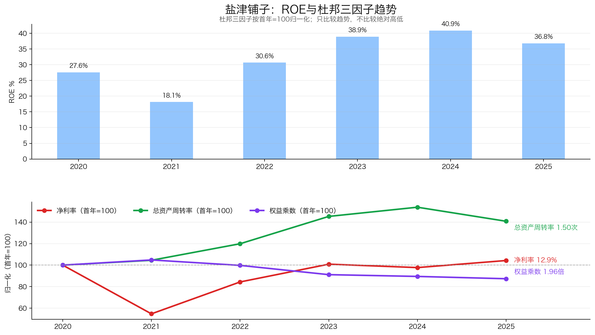
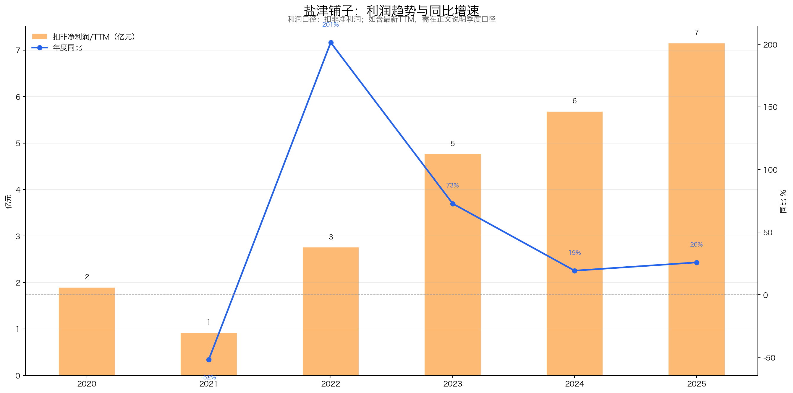
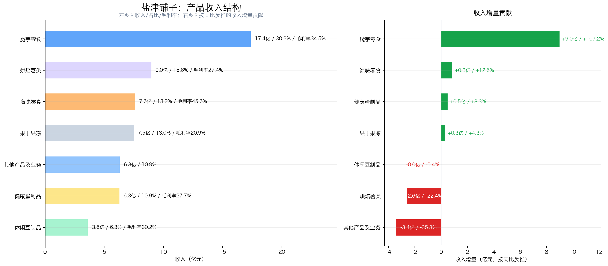
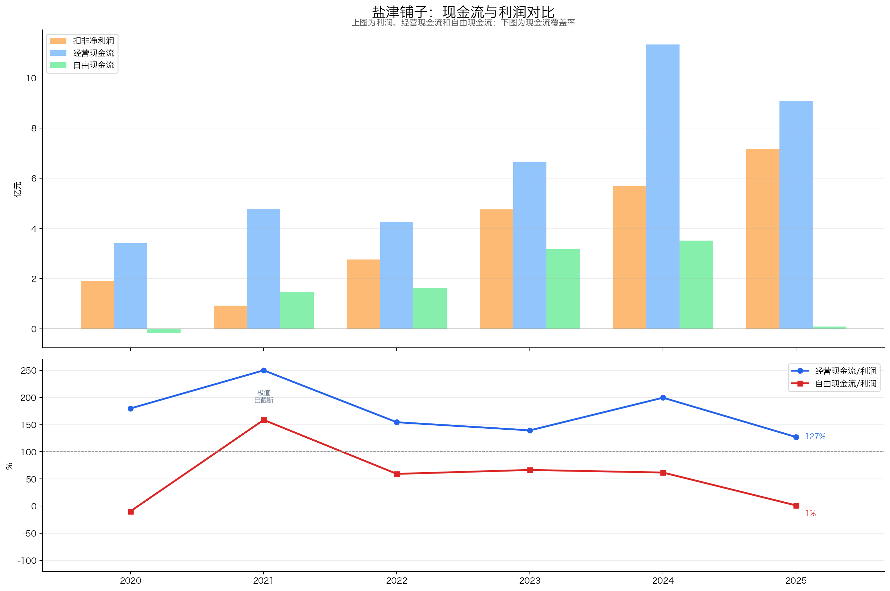
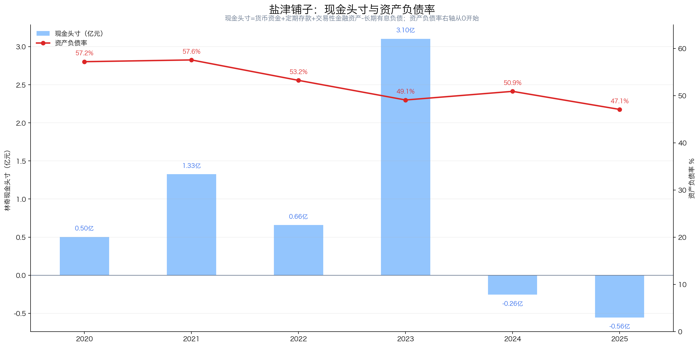
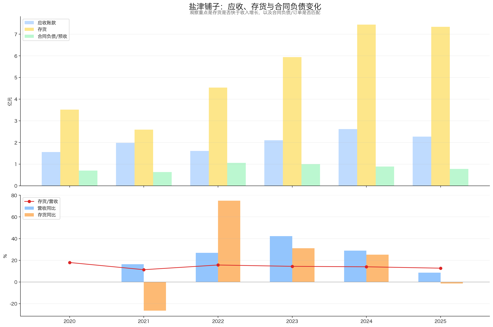
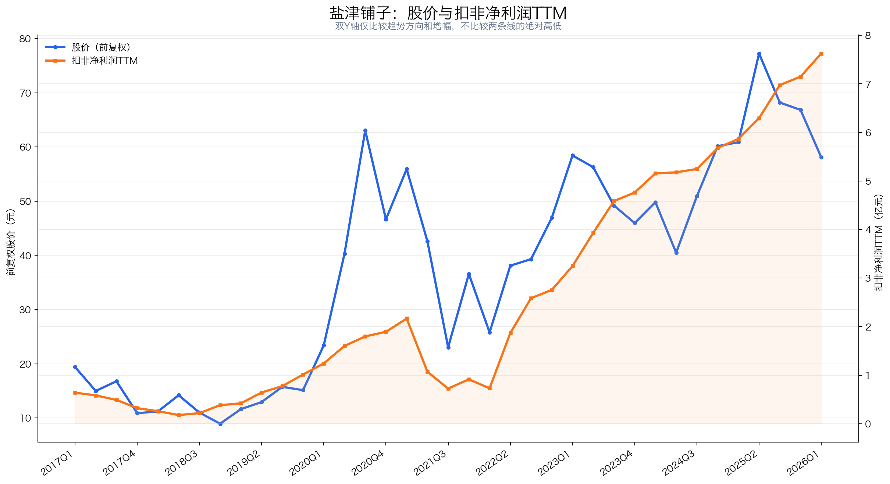
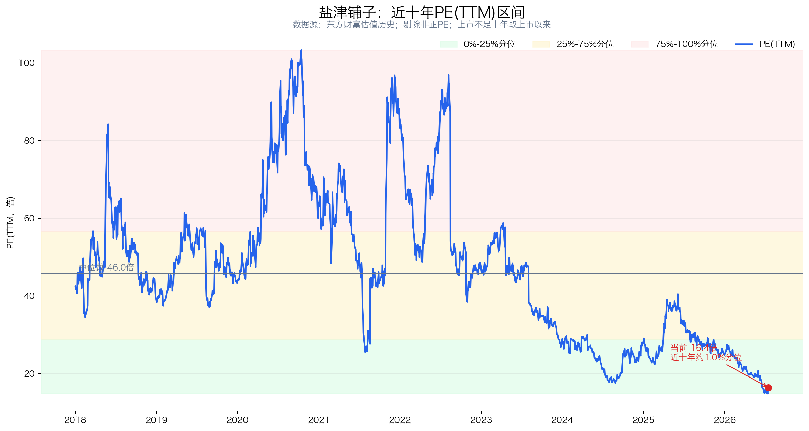

# 盐津铺子（002847）投资分析报告

> 数据截止：行情截至 2026-07-17 收盘；财务截至 2026Q1；年度数据截至 2025 年报；重大公告截至 2026-07-20。  
> 结论：**关注（74.0/100）**。盐津铺子已从地方蜜饯企业变成以魔芋零食为核心、覆盖六大品类和多渠道的全国化零食制造商。利润增长、高ROE和供应链效率是优点；收入增速放缓、魔芋单品依赖、重资本扩张、自由现金流偏弱和负现金头寸是主要约束。当前约17.2倍扣非PE处于上市以来低位，价格不贵，但还不足以掩盖资本开支和渠道依赖风险，更适合观察或分批研究，而不是仅凭低PE重仓。

## 先说人话：盐津铺子到底靠什么赚钱？

盐津铺子不是三只松鼠那类以流量和代工为主的零食渠道商，也不是只靠一家工厂生产单一产品的企业。它更像一家“自己研发、自己制造，再借助多渠道卖出去”的零食平台：

1. 从消费者口味中筛选魔芋、鹌鹑蛋、鱼豆腐、海味、果冻、烘焙等品类；
2. 通过自有工厂和上游原料布局，把产品做得足够稳定、成本足够低；
3. 用“大魔王”“蛋皇”“31°鲜”等品类品牌打造大单品；
4. 同时进入经销、商超、零食量贩、会员店和电商渠道；
5. 用规模效应和产品结构升级提高净利率。

它的核心竞争力不是“消费者非它不可”，而是**把新品快速量产、用较低成本铺到全国渠道**。优点是制造和供应链可积累；缺点是消费者换品牌容易，零食量贩等大客户议价能力较强，而且扩产需要持续投入真金白银。

| 核心指标 | 当前值 | 怎么理解 |
|---|---:|---|
| 股价 | 48.60元 | 2026-07-17收盘 |
| 总市值 | 131.31亿元 | 东方财富总市值口径 |
| PE(TTM) | 16.39倍 | 东方财富归母口径 |
| 扣非PE(TTM) | 17.22倍 | 2026Q1扣非TTM 7.63亿元 |
| 近十年PE分位 | 约1.0% | 上市不足十年，取上市以来可用区间 |
| 2025财年每股分红 | 1.40元 | 中期0.40元+年度1.00元，均已实施 |
| 静态股息率 | 约2.88% | 按48.60元计算，不代表未来承诺收益率 |
| 2025加权ROE | 36.82% | 高位回落，但不是靠加杠杆维持 |
| 2026Q1林奇现金头寸 | -1.10亿元 | 货币资金3.17亿元减长期借款4.27亿元 |

## 一、公司画像、能力圈与红线

**初筛结论：谨慎通过。**

- 公司画像：聚焦休闲食品自主制造，2025年营收57.62亿元；六大核心品类中，魔芋零食收入17.37亿元、占总营收30.15%，已经成为第一大增长引擎。
- 能力圈：商业模式容易理解；难点在于新品生命周期、零食量贩渠道议价、关联采购公允性、产能利用率和资本开支回报。
- 控制与管理：盐津控股为控股股东；张学武、张学文兄弟为实际控制人。张学武兼任董事长和总经理，控制稳定但权力较集中。
- 审计：2025年财报和财务报告内部控制均获标准无保留意见；关键审计事项为收入确认、固定资产及在建工程确认与计量。
- 经营红线：2025年营收只增长8.64%，2026Q1进一步降至2.94%，但扣非利润分别增长25.86%和30.45%。利润跑赢收入主要靠结构和效率，若收入继续低增长，利润率提升空间不会无限持续。
- 财务红线：2025年资本开支9.01亿元，几乎吃掉全部经营现金流；2024、2025和2026Q1林奇现金头寸均为负，扩产、分红、回购与借款同时发生。
- 治理观察：2023年两期旧激励的2025年业绩考核未达标；2026年重新授予新激励。张学文累计质押858万股，占其持股23.50%，但实控人及一致行动人整体质押仅占合计持股5.15%。

后续必须验证：

1. 魔芋高速增长后，是否仍能保持份额、毛利率和复购，而不是依赖单一爆品；
2. 收入低个位数增长时，利润能否继续快于收入，而不靠费用递延、补助或短期结构变化；
3. 河南二期等产能转固后，利用率和现金回报能否覆盖折旧、利息和新增借款。

## 二、好行业：需求稳定，但竞争激烈、渠道权力正在上升

### 2.1 需求质量

休闲食品具有高频、低客单、场景多和一定复购的特点，长期需求相对稳定；魔芋、蛋类和海味零食又受益于低脂、高蛋白和中式咸辣口味趋势。与白酒、汽车等行业相比，它的需求周期性较弱。

但“零食需求稳定”不等于“单个品牌稳定”。消费者尝鲜频繁、品牌切换成本低，大单品可能快速走红，也可能被新品替代。行业缺少统一、可连续核验的官方“休闲食品市场规模”统计，本报告不采用第三方预测值替代实际数据。

### 2.2 竞争格局

行业竞争者很多，既有盐津铺子、劲仔、甘源等制造型公司，也有洽洽这样的成熟品类龙头，以及三只松鼠、良品铺子等渠道和品牌型公司。最新估值如下：

| 公司 | 2026-07-17市值 | PE(TTM) | 主要定位 |
|---|---:|---:|---|
| 盐津铺子 | 131.31亿元 | 16.39 | 多品类自主制造、魔芋 |
| 洽洽食品 | 97.63亿元 | 23.84 | 瓜子坚果 |
| 三只松鼠 | 67.97亿元 | 35.83 | 线上综合零食 |
| 劲仔食品 | 46.44亿元 | 18.85 | 鱼制零食 |
| 甘源食品 | 38.95亿元 | 17.55 | 籽类和坚果 |
| 良品铺子 | 35.94亿元 | 亏损 | 综合零食 |

注：均为东方财富同日行情口径；良品铺子因TTM亏损，负PE没有可比意义。盐津铺子已经是这组A股零食公司中的市值第一，但估值只处于较低区间，反映市场对高增长持续性和重资产投入的谨慎。

### 2.3 渠道变化：量贩渠道带来增长，也拿走部分议价权

传统商超、电商之外，零食量贩、会员店成为重要增量渠道。盐津铺子已与鸣鸣很忙、零食有鸣及山姆等合作。2025年线下渠道收入48.41亿元、同比增长16.79%；线上收入9.22亿元、同比下降20.50%。

这说明增长重心已经明显转向线下新渠道。好处是新品可以快速放量，坏处是头部渠道集中采购、追求高周转和低售价，品牌方必须持续提供性价比。盐津铺子的自主制造和成本控制能帮助它适应这一模式，但渠道并不完全受公司控制。

### 2.4 壁垒与替代风险

公司披露销售的休闲零食中95%以上自产，并在湖南、江西、河南、广西布局生产基地。壁垒主要来自：

- 多品类规模制造经验和自动化产线；
- 原料初加工、配方、量产和质量追溯的一体化能力；
- 从实验工厂到全国渠道的快速上新能力；
- 经销、量贩、商超、会员店和电商的全渠道覆盖。

这些能力比纯代工和纯流量模式更耐久，但不能形成强网络效应。配方容易被模仿、消费者切换成本低，单品品牌必须不断投入研发、营销和渠道维护。

**好行业评分：14.5/20**

| 子项 | 得分 | 满分 |
|---|---:|---:|
| 需求质量/非周期性 | 5.0 | 6 |
| 竞争格局 | 2.5 | 4 |
| 进入壁垒 | 3.0 | 4 |
| 上下游议价权 | 1.5 | 3 |
| 替代品威胁 | 2.5 | 3 |
| 小计 | **14.5** | **20** |

## 三、好公司·定性：供应链能力强，消费者粘性没有报表看起来那么强

### 3.1 护城河

盐津铺子的护城河主要是制造和组织效率，而不是某个不可复制的秘方。2021年转型期利润下滑后，公司聚焦核心品类、优化渠道，2022—2025年连续释放规模效应，说明管理层确实完成过一次成功的经营再造。

“大魔王”魔芋零食的爆发证明公司能抓住品类机会，但也把风险集中到单一增长引擎。2025年魔芋贡献约9.0亿元收入增量，超过公司当年4.58亿元总收入增量；这意味着其他产品合计在收缩，增长并非全面开花。

### 3.2 复购与粘性

魔芋、鹌鹑蛋、鱼豆腐等小包装零食具备复购属性，价格不高、口味明确，适合多场景消费。但消费者通常不会因为转换品牌付出明显成本，零食量贩货架也会快速替换低周转SKU。

公司没有统一披露复购率、会员留存率或消费者终身价值，因此只能确认“品类有复购”，不能直接推导“盐津铺子的用户粘性很高”。

### 3.3 定价权

公司的定位是“好吃不贵，国民零食”，核心不是持续提价，而是通过规模制造和供应链降本，在亲民价格下保持利润。2020—2025年毛利率从43.83%降至30.80%，净利率却从12.36%升至12.89%；这更像渠道结构变化和费用效率改善，而不是传统品牌提价带来的毛利率扩张。

因此，盐津铺子有一定成本转嫁和产品结构能力，但净定价权一般。若原料上涨、渠道压价或促销加剧，低价定位会限制直接提价空间。

### 3.4 管理层与资本配置

正面因素：

- 实控人长期经营，控制权稳定，战略从多品类扩张转向核心品类聚焦；
- 2025财年两次现金分红合计3.79亿元，约占归母净利润50.68%；
- 新激励覆盖156人，2026—2028年设置累计扣非利润考核，核心人员利益与业绩挂钩；
- 2026年完成旧激励股注销，实际减少股本252.22万股。

需要扣分：

- 张学武兼任董事长和总经理，决策权高度集中；
- 旧激励2025年考核未达标，新激励授予价35.18元，明显低于公司回购均价，后续股份支付费用合计预计1.16亿元；
- 2026年回购299.90万股用于激励而非注销，耗资2.18亿元，并通过回购专项贷款推高长期借款；
- 2026年度日常关联交易预计额度8.50亿元，需持续验证实际交易额和定价公允性；
- 重资产扩张、现金分红和股份回购同时进行，资本配置不够保守。

**好公司·定性评分：14.5/20**

| 子项 | 得分 | 满分 |
|---|---:|---:|
| 护城河 | 5.5 | 7 |
| 复购/粘性/低替代性 | 3.5 | 5 |
| 定价权 | 3.0 | 5 |
| 管理层 | 2.5 | 3 |
| 小计 | **14.5** | **20** |

## 四、好公司·定量：利润增长很强，但现金被扩产吃掉

### 4.1 ROE质量与盈利模式



| 年份 | 加权ROE | 销售净利率 | 总资产周转率 | 权益乘数 |
|---:|---:|---:|---:|---:|
| 2020 | 27.59% | 12.36% | 1.06 | 2.24 |
| 2021 | 18.14% | 6.77% | 1.11 | 2.35 |
| 2022 | 30.65% | 10.43% | 1.28 | 2.23 |
| 2023 | 38.92% | 12.47% | 1.55 | 2.04 |
| 2024 | 40.86% | 12.08% | 1.64 | 2.00 |
| 2025 | 36.82% | 12.89% | 1.50 | 1.96 |

注：ROE为同花顺加权口径；杜邦三因子按平均资产、平均权益近似拆解，主要看趋势。

2021—2024年ROE从18.14%升至40.86%，核心驱动是净利率修复和资产周转加快，同时权益乘数下降。也就是说，ROE改善不是靠加杠杆，质量较高。2025年ROE回落主要因为资产周转率下降，反映扩产在先、收入兑现偏慢。

### 4.2 利润增长与持续性



| 年份/期间 | 营收 | 归母净利润 | 扣非净利润 | 扣非同比 |
|---|---:|---:|---:|---:|
| 2020 | 19.59亿元 | 2.42亿元 | 1.89亿元 | 86.96% |
| 2021 | 22.82亿元 | 1.51亿元 | 0.91亿元 | -51.73% |
| 2022 | 28.94亿元 | 3.01亿元 | 2.76亿元 | 201.47% |
| 2023 | 41.15亿元 | 5.06亿元 | 4.76亿元 | 72.83% |
| 2024 | 53.04亿元 | 6.40亿元 | 5.68亿元 | 19.27% |
| 2025 | 57.62亿元 | 7.48亿元 | 7.15亿元 | 25.86% |
| 2026Q1 | 15.83亿元 | 2.31亿元 | 2.04亿元 | 30.45% |

- 2020→2025营收5年CAGR为24.08%，扣非利润5年CAGR为30.44%。
- 2022→2025扣非利润3年CAGR为37.41%，但2022仍处于转型修复早期，存在低基数效应。
- 2026Q1扣非TTM为7.63亿元，同比增长约30%，利润趋势仍向上。
- 最大隐忧是收入增速从2024年的28.89%降至2025年的8.64%，2026Q1仅2.94%；利润增长开始更多依赖利润率和结构改善。

结论：利润线仍强，但增长叙事已经从“量价齐升”转为“魔芋放量+结构优化”。如果收入不能重新加速，当前利润增速不宜线性外推。

### 4.3 产品结构与增长来源



| 2025年产品 | 收入 | 总营收占比 | 同比 | 毛利率 | 增长判断 |
|---|---:|---:|---:|---:|---|
| 魔芋零食 | 17.37亿元 | 30.15% | 107.23% | 34.48% | 绝对核心增长引擎 |
| 烘焙薯类 | 8.98亿元 | 15.59% | -22.43% | 27.42% | 最大业务拖累 |
| 海味零食 | 7.60亿元 | 13.19% | 12.53% | 45.64% | 毛利率最高、稳健增长 |
| 果干果冻 | 7.49亿元 | 13.00% | 4.32% | 20.93% | 增长偏弱、毛利较低 |
| 健康蛋制品 | 6.28亿元 | 10.90% | 8.35% | 27.73% | 稳定但增速放缓 |
| 休闲豆制品 | 3.60亿元 | 6.25% | -0.39% | 30.25% | 基本停滞 |
| 其他产品及业务 | 6.29亿元 | 10.92% | 约-35.32% | 未披露 | 按总营收残差反推 |

魔芋收入增量约9.0亿元，而公司总营收只增加4.58亿元，说明烘焙薯类和其他产品的下降抵消了大量增长。魔芋不是可有可无的第二曲线，而是已经决定公司增长方向的第一大品类。

这既是优势也是集中风险：如果“大魔王”继续建立品类品牌，公司仍有增长空间；如果魔芋增速回落，现有其他品类暂时不足以接棒。产品售价和具体渠道终端价格未统一披露，定价变化仍待验证。

### 4.4 现金流质量



| 年份 | 归母净利润 | 经营现金流 | 资本开支 | 自由现金流 | CFO/净利润 | FCF/净利润 |
|---:|---:|---:|---:|---:|---:|---:|
| 2020 | 2.42 | 3.41 | 3.58 | -0.18 | 1.41 | -0.07 |
| 2021 | 1.51 | 4.78 | 3.33 | 1.45 | 3.17 | 0.96 |
| 2022 | 3.01 | 4.26 | 2.62 | 1.63 | 1.41 | 0.54 |
| 2023 | 5.06 | 6.64 | 3.47 | 3.17 | 1.31 | 0.63 |
| 2024 | 6.40 | 11.34 | 7.83 | 3.51 | 1.77 | 0.55 |
| 2025 | 7.48 | 9.09 | 9.01 | 0.08 | 1.21 | 0.01 |

单位：亿元。自由现金流采用“经营现金流－购建长期资产现金支出”的简化口径。

2020—2025累计经营现金流39.51亿元，是累计归母利润25.88亿元的1.53倍，利润回款本身很好；但累计自由现金流只有9.67亿元，仅为累计利润的37.36%。2025年资本开支几乎吃掉全部经营现金流，自由现金流仅约843万元。

2026Q1经营现金流3.36亿元、同比增长400.10%，单季明显改善；但扩产项目尚未完全结束，不能用一个季度覆盖长期资本开支问题。判断公司现金质量必须同时看经营现金流和扩产后的自由现金流，不能只看前者。

### 4.5 现金头寸与资产负债表安全性



| 年份 | 货币资金 | 长期借款 | 林奇现金头寸 | 资产负债率 | 受限货币资金 |
|---:|---:|---:|---:|---:|---:|
| 2020 | 1.80 | 1.30 | 0.50 | 57.19% | 0.17 |
| 2021 | 1.35 | 0.02 | 1.33 | 57.56% | 0.21 |
| 2022 | 2.03 | 1.37 | 0.66 | 53.23% | 0.12 |
| 2023 | 3.10 | 0.00 | 3.10 | 49.07% | 0.06 |
| 2024 | 2.35 | 2.61 | -0.26 | 50.90% | 0.04 |
| 2025 | 1.67 | 2.23 | -0.56 | 47.07% | 0.05 |
| 2026Q1 | 3.17 | 4.27 | -1.10 | 48.87% | 未披露 |

单位：亿元。年报显示各期交易性金融资产和应付债券均为空；未发现可计入现金头寸的定期存款，因此未加计其他流动资产。

2025年林奇现金头寸：

```text
货币资金1.67亿元
+ 已核实定期存款0
+ 交易性金融资产0
- 长期借款2.23亿元
= -0.56亿元
```

2026Q1长期借款升至4.27亿元，主要因股份回购专项贷款，现金头寸进一步降至-1.10亿元。负现金头寸意味着“扣现金后估值”不会变便宜：按Q1口径调整后扣非PE约17.4倍，略高于未调整的17.2倍。

虽然短期借款不计入林奇公式，但仍要单独检查短期偿债。2026Q1货币资金3.17亿元、应收2.80亿元、存货6.58亿元，可覆盖3.10亿元短期借款，但流动负债合计16.21亿元，流动比率仍不到1。公司不是高杠杆危险状态，却也没有厚现金安全垫。

### 4.6 营运质量



| 年份 | 应收账款 | 存货 | 合同负债 | 存货/营收 | 存货周转天数 |
|---:|---:|---:|---:|---:|---:|
| 2020 | 1.56 | 3.52 | 0.71 | 17.96% | 105.25 |
| 2021 | 1.98 | 2.59 | 0.63 | 11.36% | 74.97 |
| 2022 | 1.61 | 4.53 | 1.06 | 15.67% | 67.90 |
| 2023 | 2.11 | 5.94 | 1.00 | 14.45% | 68.97 |
| 2024 | 2.62 | 7.44 | 0.89 | 14.03% | 65.54 |
| 2025 | 2.27 | 7.34 | 0.78 | 12.74% | 66.73 |
| 2026Q1 | 2.80 | 6.58 | 0.68 | 季度口径不适用 | 58.06 |

单位：亿元。

存货从2024年末7.44亿元降至2026Q1的6.58亿元，存货周转天数也降至58.06天，没有明显压货迹象。应收账款从2025年末2.27亿元升至Q1的2.80亿元，但周转天数仍在14天左右，暂不能定性为回款恶化。

合同负债连续下降，说明预收款没有跟随收入规模扩大。由于公司并非白酒式预收模式，该指标不能单独判断订单，但与收入增速放缓放在一起看，仍是需要持续观察的信号。

**好公司·定量评分：30.0/40**

| 子项 | 得分 | 满分 | 核心扣分原因 |
|---|---:|---:|---|
| ROE质量与盈利模式 | 8.0 | 9 | 高ROE靠利润率和周转，2025周转率回落 |
| 利润增长来源与持续性 | 6.0 | 7 | 利润强，但收入增速已降至低个位数 |
| 现金流质量 | 4.5 | 7 | 经营现金流好，重资本投入令长期FCF覆盖偏低 |
| 现金头寸与资产负债表安全性 | 2.0 | 6 | 连续负现金头寸、流动比率低于1、回购贷款增加 |
| 营运质量 | 4.5 | 5 | 库存改善，应收和合同负债需观察 |
| 产品结构与增长来源 | 5.0 | 6 | 魔芋强劲，但单品依赖明显、其他品类分化 |
| 小计 | **30.0** | **40** |  |

## 五、好时机：低估值已经出现，赔率仍受现金流约束

### 5.1 股价与利润线



这张图只比较趋势方向和增幅，不比较两条线的绝对位置。

2022Q2以来，扣非TTM从不足1亿元升至2026Q1的7.63亿元，利润增长非常明显；股价同期也上升，但在2025Q2见高点后持续回落。到2026Q1，利润线仍在创新高，股价已经从前期高位回落，形成一定估值压缩。

正面解释是市场对利润增长定价不足；谨慎解释是市场提前担心收入放缓、魔芋高基数和资本开支。当前更接近“价格已不贵、基本面仍需验证”，而不是单凭两条线背离就能确认低估。

### 5.2 PE及近十年分位



| 指标 | 当前/历史值 |
|---|---:|
| 当前PE(TTM) | 16.39倍 |
| 扣非PE(TTM) | 17.22倍 |
| 上市以来分位 | 约1.0% |
| 10%分位 | 23.87倍 |
| 25%分位 | 28.88倍 |
| 中位数 | 45.95倍 |

当前PE处于上市以来低位，估值泡沫已经大幅压缩。但历史中位数包含公司高速增长和市场高估阶段，不能机械把46倍作为合理价值。未来若收入只维持低个位数增长，合理PE中枢本来就应低于历史。

### 5.3 PEG

用当前扣非PE 17.22倍除以2022→2025扣非利润3年CAGR 37.41%，历史PEG约0.46。数字看起来便宜，但2022是转型修复低基数，且当前收入增速已经显著放缓，因此PEG只能证明“相对历史利润增长不贵”，不能独立证明未来低估。

### 5.4 股息、回购和预期差

2025财年中期和年度分红均已实施，每股合计1.40元，对应当前静态股息率约2.88%，分红率约50.68%。股息有一定吸引力，但公司同时处于重资本扩张阶段，自由现金流对分红的覆盖并不宽裕。

回购信号需要区分：2026年二级市场回购均价约72.56元，明显高于当前股价；但股份全部用于股权激励而非注销，并通过专项贷款融资，不能等同于公司认为当前价低估后直接注销股份。

主要预期差：

- 正向：魔芋由爆品升级为品类品牌，线下渠道继续扩张，产能转固后收入和现金流加速；
- 负向：收入持续低增长，魔芋高基数后减速，新产能利用率不足，折旧和利息侵蚀利润。

### 5.5 毛估估：不预测利润，只看当前利润对应什么价格

为避免把激励目标当盈利预测，以下直接假设扣非TTM利润维持7.63亿元不变，不另加现金：

| 情景 | PE假设 | 对应股价 | 相对48.60元 |
|---|---:|---:|---:|
| 压力档 | 14倍 | 39.51元 | -18.7% |
| 中性档 | 18倍 | 50.80元 | +4.5% |
| 乐观档 | 22倍 | 62.09元 | +27.8% |

当前价格约等于17.2倍扣非PE，已经接近中性档。如果利润继续增长，当前价有吸引力；如果利润停止增长，短期赔率只是一般。真正的安全边际不来自厚现金，而来自公司能否把新增产能转化为持续利润和自由现金流。

**好时机评分：15.0/20**

| 子项 | 得分 | 满分 |
|---|---:|---:|
| 股价 vs 利润线 | 4.0 | 5 |
| PE及近十年分位 | 4.5 | 5 |
| PEG | 1.5 | 2 |
| 股息率 | 2.0 | 3 |
| 市场信号与预期差 | 1.0 | 2 |
| 毛估估 | 2.0 | 3 |
| 小计 | **15.0** | **20** |

## 六、投资结论：值不值得下注，拿不拿得住？

### 6.1 商业模式好不好（Right Business）

#### 6.1.1 业务简单可持续、不易被替代

休闲零食需求高频、业务容易理解，但单个产品和品牌替代性较高，消费者转换成本低。盐津铺子依靠魔芋品类和多渠道提高复购，商业模式可持续性已得到初步验证，但仍需摆脱对爆品的依赖。

#### 6.1.2 竞争格局清晰、护城河深厚、有定价权

盐津铺子部分符合。零食行业竞争分散、爆品更迭快，公司95%以上自产、多基地供应链和渠道渗透构成效率壁垒，但品牌护城河尚未达到绝对稳固，定价权也受量贩渠道和同类产品竞争约束。

#### 6.1.3 轻资本投入、高资产回报率、自由现金流好

盐津铺子不符合轻资本特征。ROE较高、利润增长真实，但2025年资本开支约9亿元，自由现金流仅约0.08亿元，现金头寸为负；扩产能否提高周转率并转化为自由现金流，是公司质量能否继续提升的关键。

#### 6.1.4 有长期增长空间

魔芋品类、量贩零食、会员店和全国化仍有增长空间，其他品类也可能接棒；但收入已经降速，增长能否持续取决于魔芋从爆品变成长期品类品牌，以及新增产能能否被真实需求消化。

### 6.2 管理层怎么样（Right People）：执行力较强，资本配置仍需约束

管理层在自主制造、产品迭代和渠道扩张上执行力较强，但重资本扩产、借款、回购与分红并行，控股股东质押和治理事项也需跟踪。当前更应考察扩产回报，而不是只看收入和利润目标。

### 6.3 是不是好价格（Right Price）：合理偏低，但低估值不足以覆盖全部风险

当前约17.2倍扣非PE处于上市以来低位，价格不贵；但安全边际不来自净现金，保守判断仍受收入放缓、魔芋集中度和自由现金流偏弱制约。更好的加仓信号是收入与自由现金流连续改善，而不是PE继续下降。

### 6.4 胜率与赔率

盐津铺子的胜率来自自主制造、魔芋品类爆发、高ROE和仍在上升的利润线；赔率来自上市以来约1%分位的低PE。最大不确定性不是利润真假，而是收入放缓后利润高增长能否持续，以及9亿元级资本开支能否转成自由现金流。综合评分 **74.0/100，评级“关注”**。

### 6.5 长期持有检查项

长期持有需要重点验证：

- 若收入恢复双位数增长、资本开支回落且连续两个报告期自由现金流改善，可提高关注级别；
- 若魔芋降速同时收入低增长、产能利用率不足或负现金头寸继续扩大，不机械补仓。

### 6.6 评级与行动

**最终判断：盐津铺子是产品和供应链能力较强的成长型零食制造商，但护城河尚在形成、资本投入较重；当前值得关注，尚不适合仅凭低PE重仓。**

当前行动：

- 当前适合纳入观察池或小仓分批研究，不宜仅凭17倍PE和历史PEG重仓；

## 七、投资逻辑与证伪条件

### 投资逻辑

1. **制造与品类品牌共同增值**：95%以上自产、全产业链和多基地能力，使爆品可以快速、低成本量产；“大魔王”正在从单品走向魔芋品类品牌。
2. **增长由魔芋和渠道渗透支撑**：魔芋贡献主要增量，量贩、会员店和经销渠道推动全国化，其他品类仍提供潜在接力空间。
3. **估值已经压缩**：当前约17.2倍扣非PE处于上市以来低位，利润继续增长时具备估值修复可能，但安全边际不来自现金。

### 证伪条件

以下任一情况持续两个报告期，应重新评估：

1. **核心产品失速**：魔芋收入增速明显转负或毛利率持续下滑，同时没有第二品类接棒；
2. **收入与经营质量同步恶化**：总收入持续低个位数或负增长，利润增速也转负，应收和存货周转同时变差；
3. **扩产无法兑现**：固定资产和在建工程继续上升，但资产周转率、产能利用率和自由现金流持续下降，净债务扩大；
4. **资本配置失去约束**：借款支持回购、分红或扩产的力度继续增加，关联交易公允性或治理出现重大问题。

---

## 八、维度打分汇总

| 模块 | 得分 | 满分 |
|---|---:|---:|
| 好行业 | 14.5 | 20 |
| 好公司·定性 | 14.5 | 20 |
| 好公司·定量 | 30.0 | 40 |
| 好时机 | 15.0 | 20 |
| **总分** | **74.0** | **100** |

好公司（定性+定量）合计 **44.5/60**。公司质量不差，但现金头寸和自由现金流明显拉低得分；这也是为什么低PE没有直接对应“强烈关注”。

---

## 九、数据校验结果

### 正确 ✅

1. 2020—2025营收、归母净利润、扣非净利润：同花顺年度表与年报/东方财富交叉核验；2025年分别为57.62、7.48、7.15亿元。
2. 2026Q1营收、归母、扣非和经营现金流：年报后季报PDF核验，分别为15.83、2.31、2.04、3.36亿元。
3. CAGR年数：2020→2025按5年计算；2022→2025按3年计算。
4. 2025四季度拆分：四季度营收、归母、扣非和经营现金流之和均与全年数一致。
5. ROE和杜邦：ROE采用同花顺加权口径；净利率、周转率和权益乘数采用平均资产/权益近似，口径已注明。
6. 产品结构：2025年六大产品收入、同比和毛利率来自年报分产品表；其他产品及业务按总营收残差计算并明确标注。
7. 现金流：经营现金流和购建长期资产支出与各年现金流量表/东方财富交叉核验；2025简化FCF约0.08亿元。
8. 现金头寸：2020—2025逐年核对货币资金、长期借款、交易性金融资产、应付债券和受限资金；未把其他流动资产整体计入。
9. 分红：2025财年中期0.40元和年度1.00元均按实施结果计算，不再使用年报预案股本。
10. 行情估值：股价、市值和PE为2026-07-17最新交易日数据；近十年分位使用上市以来可用日频PE并剔除非正PE。
11. 图表链接与评分：10张图均已实际生成；各子项之和等于模块小计，四个模块合计74.0分。

### 需持续更新 ⚠️

1. 2026年中期分红只有授权，截止日尚无具体方案，不能当作已实施股息。
2. 2026年新激励的8.5亿元扣非目标是考核条件，不是公司盈利预测；本报告未将其纳入主估值。
3. 本届董事和多数高管任期至2026-08-18，截止日尚未见换届公告。

### 不可验证 ⚠️

1. 公司未统一披露消费者复购率、会员留存率、各渠道净利润率和魔芋终端市场份额。
2. 2026Q1未披露分产品数据，不能把一季度集团利润增速直接等同于魔芋增速。
3. 海外业务仍处早期，公司未披露可与国内业务一致核对的海外收入和利润表，本报告不单独估值。

---

## 主要资料

完整来源台账见 [sources.csv](../data/sources.csv)，治理与重大公告底稿见 [governance_capital_allocation_2026-07-20.md](../data/governance_capital_allocation_2026-07-20.md)。

- [2025年年度报告](https://static.cninfo.com.cn/finalpage/2026-04-08/1225082462.PDF)
- [2026年一季度报告](https://static.cninfo.com.cn/finalpage/2026-04-29/1225232838.PDF)
- [2025年度权益分派实施公告](https://static.cninfo.com.cn/finalpage/2026-06-22/1225378412.PDF)
- [股份回购实施完成公告](https://static.cninfo.com.cn/finalpage/2026-01-16/1224935202.PDF)
- [限制性股票回购注销完成公告](https://static.cninfo.com.cn/finalpage/2026-06-22/1225377923.PDF)
- [最新股东股份质押公告](https://static.cninfo.com.cn/finalpage/2026-07-11/1225418642.PDF)

---

*本报告仅供学习研究，不构成投资建议。*
