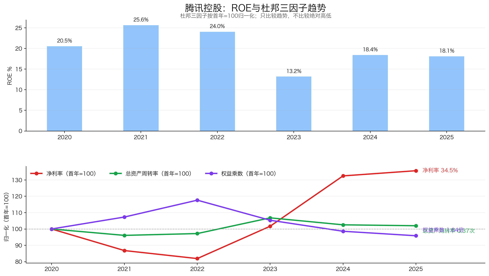
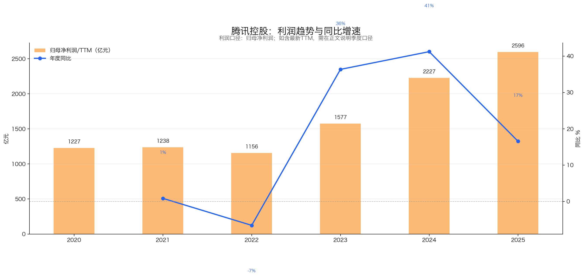
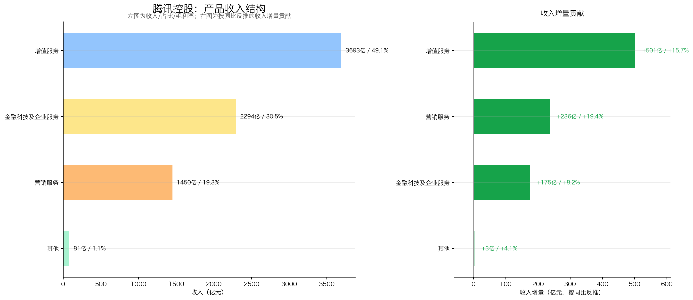
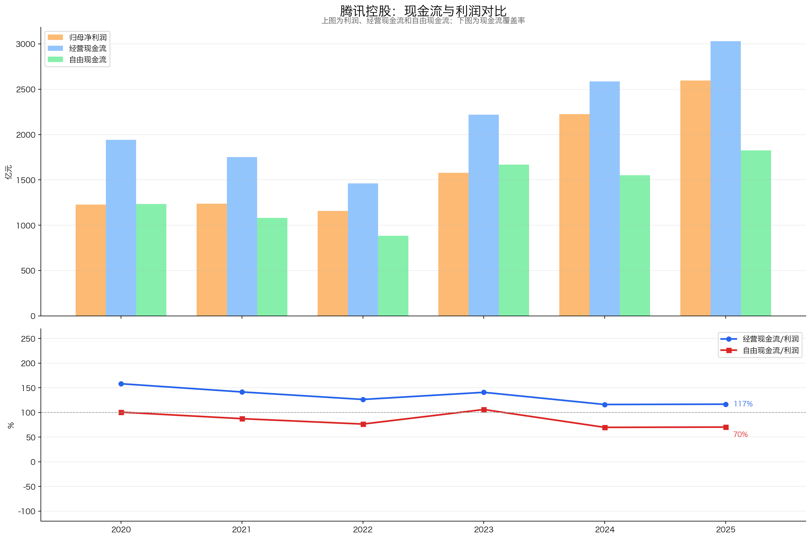
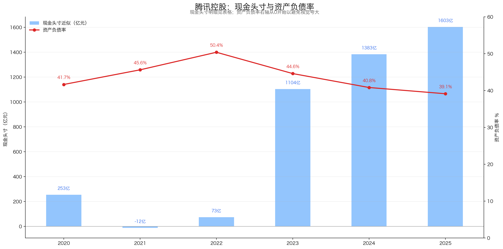
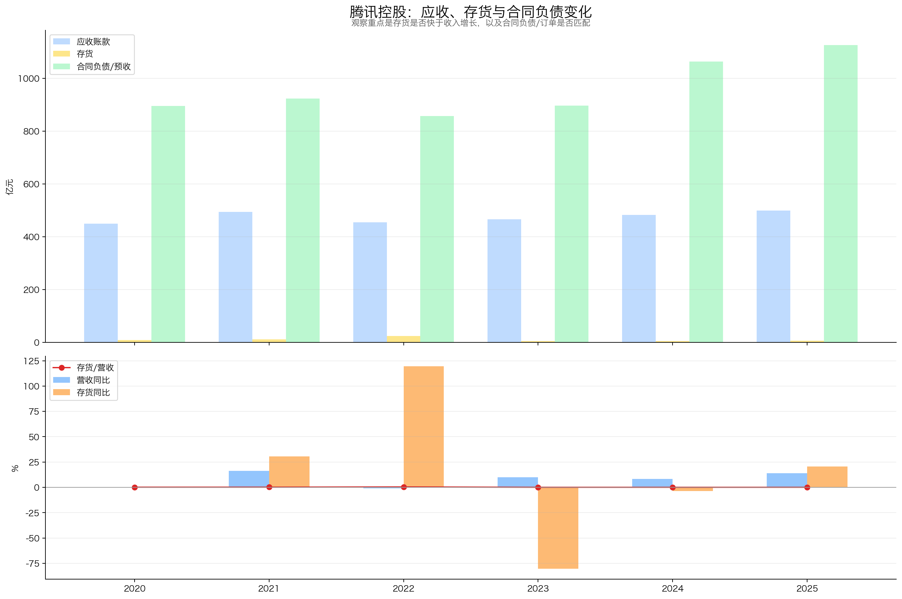
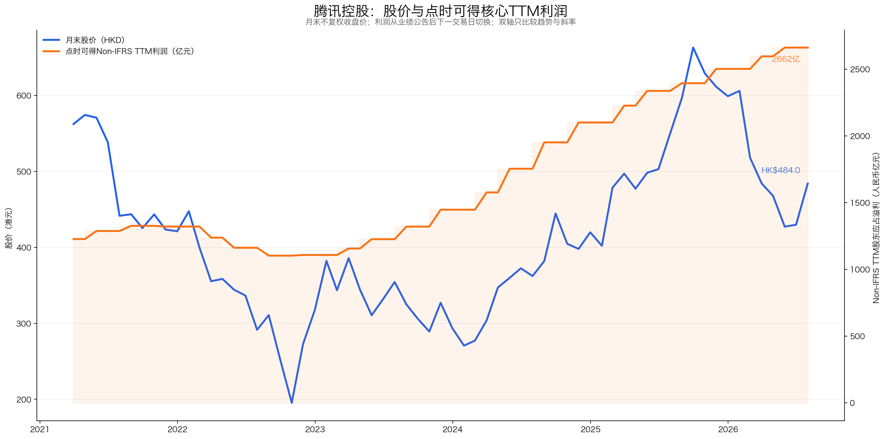
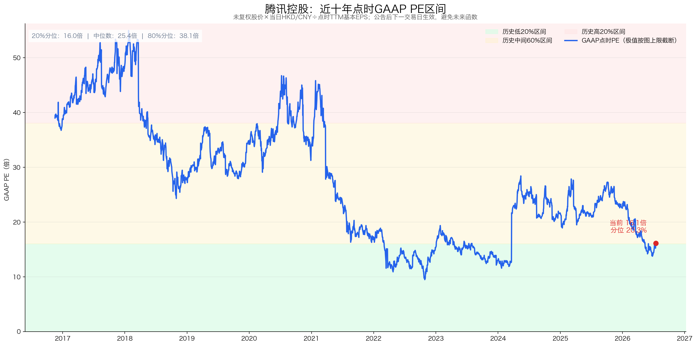

# 腾讯控股投资分析报告

> 股票代码：00700.HK｜分析日期：2026-07-16｜最新完整交易日：2026-07-16  
> 股价：HK$484.0｜严格市值：4.40万亿港元 / 约3.80万亿元人民币｜评级：强烈关注  
> 核心结论：腾讯仍是中国互联网里少见的“高壁垒流量入口 + 多元利润池 + 强现金流”复利资产。当前约14.3倍Non-IFRS TTM PE并不贵，但低估值并非白送：AI投入正在吞噬一部分利润，游戏与金融科技持续受监管约束，微信商业化还要在增长与用户体验之间长期走钢丝。

## 决策摘要

| 问题 | 判断 |
|---|---|
| 腾讯靠什么赚钱？ | 微信生态提供低成本流量和交易场景，游戏、广告、支付/理财、云与数字内容分别变现 |
| 最强护城河是什么？ | 不是某一款游戏，而是微信关系链、账号体系、支付、内容、开发者和商家共同形成的生态网络 |
| 利润质量好吗？ | 好。2025年经营现金流约3031亿元，自由现金流1826亿元；Non-IFRS核心利润2596亿元 |
| 增长来自哪里？ | 近期主要来自长青游戏、国际游戏、AI广告提效、视频号/小店闭环、云与企业服务恢复增长 |
| AI是机会还是风险？ | 两者都是。AI已经提升广告和游戏效率，但2026Q1新AI产品对Non-IFRS经营利润形成约88亿元净拖累 |
| 当前贵不贵？ | 偏低至合理偏低：GAAP PE约16.1倍、Non-IFRS PE约14.3倍，近十年GAAP点时PE约20.3%分位 |
| 最大误判风险 | 把2022—2025利润修复的30.9% CAGR长期外推，或把全部投资资产按账面值无折价加入估值 |
| 当前行动 | 81分，处于“强烈关注”下沿；可作为核心候选分批布局，不宜因低PEG一次性重仓 |

---

## 一、公司画像、能力圈与红线

**初筛结论：通过。**

- **公司画像**：腾讯不是单纯的游戏公司，而是以微信/WeChat和QQ为入口，以增值服务、营销服务、金融科技与企业服务为主要利润池的综合互联网平台。
- **能力圈**：商业模式能看懂，但底层游戏成功率、AI模型竞争力、金融业务风险和监管政策只能“部分看懂”，需要持续跟踪，不能假装精确预测。
- **股权与管理层**：公司没有单一多数股东。2025年末，Prosus/Naspers旗下MIH持股22.80%，马化腾全资控制的Advance Data Services持股8.82%；马化腾担任主席兼CEO，经营上仍是创始人主导。来源：[腾讯2025年报](https://www1.hkexnews.hk/listedco/listconews/sehk/2026/0409/2026040901231.pdf)。
- **红线**：审计为标准无保留意见，现金流和资产负债表没有明显硬伤；未触发财务一票否决。需要降级关注的红线是监管、VIE结构、AI资本开支上升以及战略投资估值波动。
- **后续必须验证**：①AI投入何时从费用项变成新增利润池；②长青游戏和国际游戏能否抵消新品波动；③微信商业化能否继续提升而不损伤用户体验。

### 为什么腾讯容易被看错

1. **只看GAAP利润会被投资收益误导。** 2021—2022年GAAP利润受处置/分派投资资产影响很大，2023年又显著回落；判断主营经营趋势，应以Non-IFRS股东应占溢利为主、GAAP为底线口径。
2. **只把它当游戏公司会低估微信生态。** 游戏是大利润池，但广告、支付、理财、云、电商技术服务都建立在账号、社交关系和流量分发上。
3. **把投资组合全部当现金会高估安全边际。** 上市股权有价格波动和战略约束，非上市投资流动性更差；它们有价值，但不能1:1抵扣市值。

---

## 二、好行业：平台型互联网仍是不是好生意？

### 2.1 需求质量：线上娱乐、沟通和支付具有高频刚需

腾讯面对的不是单一行业，而是五类需求：通信社交、游戏娱乐、数字内容、广告营销、支付与企业数字化。它们共同特点是高频、可复购、边际复制成本低；弱点是政策敏感、技术迭代快。

2025年腾讯自身的实际经营数据给出了需求强度：国内游戏收入同比增长18%，国际游戏增长33%，营销服务增长19%，金融科技与企业服务增长8%。2026Q1增速放缓但仍为正：国内游戏+6%、国际游戏+13%、营销服务+20%、金融科技与企业服务+9%。这不是券商预测，而是公司已披露结果。来源：[2025全年业绩](https://static.www.tencent.com/uploads/2026/03/18/e6a646796d0d869acc76271c9ee1a6a5.pdf)、[2026Q1业绩](https://static.www.tencent.com/uploads/2026/05/13/47382ae415a209fd161bc19a1f9b3704.pdf)。

### 2.2 竞争格局：每条业务都竞争激烈，但腾讯占据生态中枢

| 领域 | 主要竞争 | 腾讯的位置 | 核心判断 |
|---|---|---|---|
| 社交/内容 | 抖音、快手、小红书、B站 | 微信关系链不可替代，内容时长仍受短视频平台竞争 | 流量入口最稳，但用户时长不是垄断 |
| 国内游戏 | 网易、米哈游等 | 发行、研发、渠道、IP和长青游戏组合领先 | 强者恒强，但新品仍有失败风险 |
| 国际游戏 | 微软、索尼、任天堂、Sea等 | Supercell、Riot等工作室和投资网络形成全球组合 | 分散国内监管风险，是第二增长极 |
| 广告 | 字节、阿里、百度 | 微信广告负载仍较低，闭环交易和AI提效提升价格 | 最大潜力来自“少加广告、提高效果” |
| 支付/金融科技 | 支付宝、银行体系 | 微信支付嵌入社交和线下交易，场景极强 | 高频但受费率和审慎监管约束 |
| 云与AI | 阿里云、华为云、百度、字节 | 有企业客户、微信生态和自有业务场景，基础模型仍需追赶 | 有分发和场景优势，不等于模型必胜 |

同批次行情只用于数量级比较：腾讯严格市值约4.40万亿港元；yfinance供应商口径下，网易约0.65万亿港元、阿里约2.24万亿港元、百度约0.30万亿港元；美股Meta约1.73万亿美元。不同币种、会计口径和业务结构差异很大，不能只按PE机械排名。

### 2.3 壁垒：网络效应、数据、内容和支付形成复合护城河

- **关系链壁垒**：微信用户迁移成本不在安装App，而在联系人、群、公众号、小程序、支付和工作协作全部重建。
- **双边网络效应**：用户吸引开发者、商家和广告主；丰富服务反过来提高用户粘性。
- **内容与发行能力**：游戏研发、全球工作室、运营和渠道形成“长青游戏组合”，降低单款爆款依赖。
- **数据与AI闭环**：广告推荐、视频号内容分发、游戏运营和云服务提供大量真实场景，使AI可以直接改善收入或成本。
- **资本与现金流**：强现金流允许腾讯在游戏、内容、云和AI上持续投入，也能在低估时大额回购。

### 2.4 替代与监管风险

腾讯最难被整体替代，但局部业务一直会被替代：QQ用户下滑、长视频受短视频冲击、传统云IaaS价格竞争、游戏生命周期变化。监管风险不是尾部小概率，而是商业模式的长期约束，包括游戏版号和未成年人保护、金融审慎监管、数据与算法治理、反垄断及VIE结构。

**好行业评分：17/20。** 高频需求和复合网络效应得分高；AI/云竞争、监管和内容替代风险扣分。

---

## 三、好公司·定性：腾讯为什么能长期复利？

### 3.1 护城河不是“微信有很多用户”，而是生态闭环

2026Q1微信及WeChat合并月活14.32亿，同比增长2%；绝对用户增速已很低，但这并不等于生态失去成长。成熟平台的增长更依赖每个用户可使用的服务、交易和广告价值，而不是单纯拉新。

视频号时长在2025年及2026Q1均同比增长20%以上；小店GMV继续快速增长；AIM+在2026Q1已驱动约30%的营销服务广告消耗。简单说：微信从“聊天入口”逐步变成内容、交易和服务基础设施。

### 3.2 复购与粘性：不同利润池互相供给

- 社交关系链带来低成本流量；
- 小程序和支付让流量形成交易；
- 交易数据和内容消费提升广告效果；
- 云服务为企业和腾讯自身提供基础设施；
- 游戏和内容贡献现金流，再反哺研发与AI。

这是腾讯比单一游戏厂商或单一广告平台更稳的原因。2025年前五大客户仅占收入6.5%，最大客户占3.4%，客户集中度低。

### 3.3 定价权：更像“效果改善权”，不是简单提价

腾讯广告业务的定价权主要来自转化效果，而不是强行提高广告单价。2025年广告收入增长19%，驱动因素包括AI定向、AI素材生成、闭环广告占比提高和视频号/搜索使用增加。广告负载仍低于同类平台，意味着腾讯可以优先改善转化率，而非牺牲体验暴力加广告。

游戏和数字内容有一定定价权，但受用户付费意愿、竞品和监管限制；支付费率则受商户议价和政策约束。因此腾讯有定价权，但并非所有业务都强。

### 3.4 管理层与资本配置

优点：

- 创始人长期掌舵，核心战略较稳定；
- 在2022年前后主动收缩低质量云合同、控本增效，随后利润率明显修复；
- 2024年回购约1120亿港元，2025年回购800亿港元，2026Q1继续回购76亿港元；2026年7月9日再回购106.5万股、耗资约5.01亿港元；
- 2025年度股息提高至每股5.30港元，但仍以回购为主要股东回报手段。

需要警惕：

- 战略投资规模大，历史上既创造价值，也带来会计利润和资产估值波动；
- AI投入进入加速期，管理层资本配置从“回购+提效”切换到“回购+重投入”，回报周期尚未验证；
- MIH/Prosus持股22.8%，持续减持虽有回购对冲，仍可能形成供给压力。

**好公司·定性评分：17.5/20。** 护城河和粘性接近满分；支付、云和内容业务的定价权有限，AI资本配置尚待验证。

---

## 四、好公司·定量：利润是不是真，增长是否健康？

### 4.1 ROE与盈利模式：核心改善靠利润率，不靠加杠杆



| 年份 | 加权ROE | GAAP净利率 | 核心净利率 | 总资产周转率 | 权益乘数 |
|---|---:|---:|---:|---:|---:|
| 2020 | 22.7% | 33.2% | 25.5% | 0.36 | 1.71 |
| 2021 | 27.9% | 40.1% | 22.1% | 0.35 | 1.84 |
| 2022 | 26.1% | 33.9% | 20.9% | 0.35 | 2.02 |
| 2023 | 14.3% | 18.9% | 25.9% | 0.39 | 1.81 |
| 2024 | 19.9% | 29.4% | 33.7% | 0.37 | 1.69 |
| 2025 | 19.5% | 29.9% | 34.5% | 0.37 | 1.64 |

GAAP ROE受投资收益和资产分派影响，不能孤立使用。更重要的趋势是：2022—2025核心净利率由20.9%升至34.5%，权益乘数由2.02降至1.64，说明盈利改善主要来自业务结构优化和经营杠杆，而不是加杠杆。

### 4.2 利润增长：2022后是“修复+高质量收入增长”，但高增速已开始降档



| 年份 | 营收（亿元） | GAAP归母（亿元） | Non-IFRS归母（亿元） | 核心利润同比 |
|---|---:|---:|---:|---:|
| 2020 | 4,821 | 1,598 | 1,227 | — |
| 2021 | 5,601 | 2,248 | 1,238 | +0.9% |
| 2022 | 5,546 | 1,882 | 1,156 | -6.6% |
| 2023 | 6,090 | 1,152 | 1,577 | +36.4% |
| 2024 | 6,603 | 1,941 | 2,227 | +41.2% |
| 2025 | 7,518 | 2,248 | 2,596 | +16.6% |
| 2026Q1 | 1,965 | 581 | 679 | +10.7% |

2020—2025营收5年CAGR为9.3%，核心利润CAGR为16.2%，利润快于收入，证明经营杠杆真实存在。但2022—2025的30.9%三年CAGR带有低基数修复，不能作为长期假设；2026Q1核心利润增速已回落到约11%。

### 4.3 产品结构：游戏是发动机，广告是效率弹性，金融科技与企业服务是稳定器



| 2025业务 | 收入（亿元） | 占比 | 同比 |
|---|---:|---:|---:|
| 增值服务 | 3,693 | 49.1% | +15.7% |
| 金融科技及企业服务 | 2,294 | 30.5% | +8.2% |
| 营销服务 | 1,450 | 19.3% | +19.4% |
| 其他 | 81 | 1.1% | +4.1% |

增值服务内部，2025年国内游戏1642亿元、国际游戏774亿元、社交网络1277亿元。收入结构不是单一游戏押注：金融科技与企业服务贡献约三成，广告增速最快，国际游戏提供地域分散。

真正要观察的是利润结构，而不只是收入占比。广告和游戏的毛利率通常优于支付和云；当高毛利业务增长更快时，集团毛利率从2022年的43.1%升至2025年的56.2%。

### 4.4 现金流：利润能变成现金，但AI资本开支压低自由现金流转换率



| 年份 | 核心利润（亿元） | 经营现金流（亿元） | 自由现金流（亿元） | FCF/核心利润 | 资本开支（亿元） |
|---|---:|---:|---:|---:|---:|
| 2020 | 1,227 | 1,941 | 1,235 | 101% | 340 |
| 2021 | 1,238 | 1,752 | 1,082 | 87% | 334 |
| 2022 | 1,156 | 1,461 | 884 | 76% | 181 |
| 2023 | 1,577 | 2,220 | 1,670 | 106% | 244 |
| 2024 | 2,227 | 2,585 | 1,553 | 70% | 768 |
| 2025 | 2,596 | 3,031 | 1,826 | 70% | 792 |

2025经营现金流/核心利润约117%，现金兑现很好；自由现金流/核心利润约70%，下降主要因为AI基础设施资本开支上升，而非应收或库存恶化。2026Q1资本开支319亿元，同比增长16%，自由现金流567亿元，同比增长20%。

这里的自由现金流采用腾讯定义：经营现金流扣除资本开支、媒体内容付款及租赁负债付款，和简单“经营现金流-资本开支”口径不同。

### 4.5 资产负债表：现金安全垫厚，投资组合是额外期权而非现金



| 年份 | 总现金（亿元） | 长期借款及票据（亿元） | 林奇现金头寸近似（亿元） | 资产负债率 |
|---|---:|---:|---:|---:|
| 2020 | 2,595 | 2,342 | 253 | 41.7% |
| 2021 | 2,813 | 2,825 | -12 | 45.6% |
| 2022 | 3,196 | 3,123 | 73 | 50.4% |
| 2023 | 4,033 | 2,929 | 1,104 | 44.6% |
| 2024 | 4,154 | 2,771 | 1,383 | 40.8% |
| 2025 | 4,949 | 3,346 | 1,603 | 39.1% |

主口径遵循彼得林奇思路：总现金（现金等价物、定存及高流动性理财）减长期借款和票据，不扣短期借款。公司更保守的“净现金”会扣除全部借款和票据：2026Q1为1469亿元。

2025年末另有上市投资公允价值6727亿元、非上市投资账面价值3631亿元。若全部相加，相当于当前人民币市值的27%左右，但不能直接视同现金：上市股权会波动，非上市资产缺乏流动性，部分持股有战略约束。年报还披露，约1647亿元现金、定存及受限现金存放于中国内地，受外汇和资金管理规则约束。

### 4.6 营运质量：应收稳定、几乎无库存，递延收入提供可见性



| 年份 | 应收账款（亿元） | 存货（亿元） | 递延收入（亿元） | 应收/营收 |
|---|---:|---:|---:|---:|
| 2020 | 450 | 8.1 | 895 | 9.3% |
| 2021 | 493 | 10.6 | 924 | 8.8% |
| 2022 | 455 | 23.3 | 857 | 8.2% |
| 2023 | 466 | 4.6 | 896 | 7.7% |
| 2024 | 482 | 4.4 | 1,063 | 7.3% |
| 2025 | 499 | 5.3 | 1,125 | 6.6% |

应收绝对额小幅增加，但占营收比例持续下降；存货极小，其同比大幅波动没有经营意义；递延收入升至1125亿元，主要体现尚未确认的游戏及增值服务收入，为未来收入提供一定缓冲。

**好公司·定量评分：33/40。**

| 细项 | 权重 | 得分 | 判断 |
|---|---:|---:|---|
| ROE质量与盈利模式 | 9 | 7.0 | 核心利润率提升且去杠杆；GAAP ROE受投资波动，核心ROE为近似口径 |
| 利润增长来源与持续性 | 7 | 5.5 | 多引擎增长，但高CAGR含修复效应，Q1已降档 |
| 现金流质量 | 7 | 6.0 | OCF强，AI资本开支使FCF转换率降至70% |
| 现金头寸与资产负债安全性 | 6 | 5.5 | 净现金厚、投资资产多；部分资金和投资不可直接分配 |
| 营运质量 | 5 | 4.0 | 应收与库存健康，但传统营运指标未覆盖金融科技信用及合规风险 |
| 产品结构与增长来源 | 6 | 5.0 | 收入多元，但各业务仍共享微信生态及监管风险 |
| **小计** | **40** | **33.0** | — |

---

## 五、好时机：现在买贵不贵？

### 5.1 股价与利润线：利润创新高，股价仍低于上一轮估值泡沫峰值



图中双轴只比较趋势和斜率，不比较两条线的绝对高低。2022年后，核心TTM利润持续上升；股价虽从低点修复，但2026年回落至484港元。当前估值压缩更多来自市场对AI投入、监管和中国资产风险溢价的担忧，而不是核心利润倒退。

### 5.2 PE与历史分位：便宜，但GAAP与Non-IFRS必须分开



| 指标 | 当前值 | 解读 |
|---|---:|---|
| GAAP TTM归母利润 | 2,351亿元 | 2025全年+2026Q1-2025Q1 |
| Non-IFRS TTM核心利润 | 2,662亿元 | 更适合观察主营经营趋势 |
| GAAP PE | 16.1倍 | 近十年点时约20.3%分位，合理偏低 |
| Non-IFRS PE | 14.3倍 | 当前主估值口径 |
| 扣公司净现金后Non-IFRS PE | 13.7倍 | 只扣1469亿元净现金，不扣战略投资 |
| 静态股息率 | 约1.1% | 现金股息不高，主要回报来自回购和盈利增长 |

历史PE用“当时已披露TTM基本EPS”阶梯计算，避免未来函数。当前近十年GAAP点时PE约20.3%分位；早年高估值抬高十年中位数，当前低分位不能直接等同于“必然回归历史均值”。

### 5.3 PEG：0.46很低，但参考价值有限

PEG = 14.3倍Non-IFRS PE ÷ 2022—2025核心利润3年CAGR 30.9% ≈ 0.46。表面上很便宜，但30.9%包含2022低基数和利润率修复，不应外推。若未来核心利润只增长5%—10%，真实前瞻PEG会明显高于0.46。

### 5.4 回购比股息更重要

2025年腾讯回购800亿港元，约占2025年末股本市值的2%左右；2026Q1继续回购76亿港元。港交所翌日披露报表显示，7月9日公司又回购106.5万股、支付约5.01亿港元；截至当日尚有979.46万股已回购待注销，因此法定已发行股数暂未扣除这些股份。2025年度每股股息5.30港元，对当前股价的静态收益率约1.1%。因此腾讯不是高股息标的，投资回报主要来自：

```text
核心利润增长 + 回购减少股本 + 估值变化 + 少量现金股息
```

### 5.5 三年情景估值：用压力测试，不用券商预测

基准：当前Non-IFRS TTM核心利润2662亿元、人民币市值约3.80万亿元。核心利润已包含现金产生的利息收入，因此PE法不再额外加回净现金，避免重复计算；战略投资也不单独加入价值。

| 情景 | 核心利润年增速 | 2029核心利润 | 目标PE | 2029股权价值 | 三年总回报 | 隐含年化 |
|---|---:|---:|---:|---:|---:|---:|
| 压力 | -5% | 2,282亿元 | 12倍 | 2.74万亿元 | -27.9% | -10.3% |
| 保守 | +5% | 3,082亿元 | 15倍 | 4.62万亿元 | +21.6% | +6.8% |
| 中性 | +9% | 3,447亿元 | 18倍 | 6.21万亿元 | +63.3% | +17.8% |
| 乐观 | +13% | 3,841亿元 | 22倍 | 8.45万亿元 | +122.4% | +30.5% |

这不是目标价预测，而是看赔率。压力档有约28%下行，保守档年化仅约7%；只有核心利润保持接近两位数增长、且估值回到18倍左右，赔率才明显有吸引力。

**好时机评分：13.5/20。** 当前估值有吸引力，但Non-IFRS历史分位尚未完整重建，PEG受低基数修复影响，保守情景回报也不高。

| 细项 | 权重 | 得分 |
|---|---:|---:|
| 股价 vs 利润线 | 5 | 4.0 |
| PE及近十年分位 | 5 | 4.0 |
| PEG | 2 | 0.5 |
| 股息率 | 3 | 1.0 |
| 市场信号与预期差 | 2 | 1.5 |
| 毛估估/情景赔率 | 3 | 2.5 |
| **小计** | **20** | **13.5** |

---

### 5.7 AI：腾讯下一轮增长的核心变量

#### 5.7.1 已经兑现的价值

AI并非只有大模型故事。腾讯已披露的直接收益包括：

- 广告推荐和定向更准确，支持2025年营销服务增长19%、2026Q1增长20%；
- AI辅助游戏内容生产、运营和营销，延长长青游戏生命周期；
- 云业务获得AI工作负载需求，2025年实现“规模化盈利”；
- AIM+在2026Q1驱动约30%的广告消耗，属于可量化商业化指标。

#### 5.7.2 正在付出的成本

2025年资本开支792亿元，较2023年244亿元大幅增加；2026Q1资本开支319亿元。更关键的是，2026Q1 Non-IFRS经营利润为756亿元；若剔除元宝、Hy、CodeBuddy、WorkBuddy、QClaw等新AI产品，经营利润为844亿元。这意味着新AI产品当季净拖累约88亿元。

这个披露很重要：腾讯核心业务真实增速可能比报表显示更强，但AI产品尚未证明自身盈利模式。投资者既不能只看总利润增速下滑，也不能把AI亏损自动视为未来高回报。

#### 5.7.3 三个验证指标

1. 剔除新AI产品后的经营利润增速是否持续高于集团增速；
2. AI资本开支增长是否带来云收入、广告单价/转化和游戏流水的可量化提升；
3. 新AI产品净投入占核心经营利润的比例是否在用户增长后趋稳，而非持续扩大。

---

## 六、投资结论：值不值得下注，拿不拿得住？

### 6.1 商业模式好不好（Right Business）

#### 6.1.1 业务简单可持续、不易被替代

腾讯业务线较多，但核心逻辑清晰：以微信和QQ连接用户，再通过游戏、广告、金融科技和云服务变现。社交、娱乐和数字服务需求长期存在，微信关系链和生态迁移成本高，核心入口不易被替代；监管和用户体验约束会影响变现节奏。

#### 6.1.2 竞争格局清晰、护城河深厚、有定价权

腾讯基本符合。微信网络效应、长青游戏、内容生态、支付和云构成多元利润池，护城河深且相互协同；游戏、广告和支付具备一定定价与流量分配能力，但监管、平台竞争和用户体验决定公司不能无限提价或提高商业化强度。

#### 6.1.3 轻资本投入、高资产回报率、自由现金流好

传统互联网主业轻资产、利润率和自由现金流较好，现金与投资组合提供安全垫，回购也持续减少股本；但AI正在改变资本强度，2025年资本开支792亿元、2026Q1为319亿元，新AI产品当季净拖累约88亿元，新增投入回报尚未验证。

#### 6.1.4 有长期增长空间

视频号、广告、小店、国际游戏、云和AI仍有较长增长跑道，核心业务利润增长已被验证。下一阶段空间取决于AI能否提高广告、游戏和云效率，并从成本投入转化为可量化收入和自由现金流。

### 6.2 管理层怎么样（Right People）：长期产品能力强，AI资本配置是新考题

管理层在微信生态、游戏全球化和资本回报上执行力较强，2025年回购800亿港元、2026年继续回购；但AI投入规模快速扩大，必须用云收入、广告转化、新产品用户与现金流验证，而不能把所有投入自动视为高回报。

### 6.3 是不是好价格（Right Price）：估值合理偏低，保守情景回报一般

当前约14.3倍Non-IFRS TTM PE具有吸引力，但历史核心PE分位尚未完整重建；压力情景约有28%下行，保守情景隐含年化仅约7%。价格提供一定安全边际，但真正较好的赔率仍要求核心利润接近两位数增长、AI回报开始兑现。

### 6.4 胜率与赔率

腾讯的胜率较高，核心依据是微信生态的网络效应、多元利润池和强现金流；当前约14倍核心PE提供一定安全边际。主要不确定性是AI投入回报、监管约束及核心利润增速降档。综合得分81分，评级为“强烈关注”，但处于该评级下沿。

### 6.5 长期持有检查项

长期持有需要重点验证：

- 核心利润保持两位数增长、AI投入开始兑现且PE仍在15倍附近时，可提高仓位；
- 核心业务与AI投入回报同时恶化时，即使估值下降也不机械补仓。

### 6.6 评级与行动

**最终判断：腾讯是业务需求长期、网络效应深、资本回报和自由现金流较好的平台型复利资产；当前估值不贵，值得强烈关注，但AI投入回报与监管风险决定它仍需分批验证。**

当前行动：

- 作为核心候选分批布局，不因低PEG一次性重仓；

## 七、投资逻辑与证伪条件

### 7.1 投资逻辑

1. **微信生态持续提高单用户价值**：视频号、广告、小程序、小店和支付推动流量向交易与利润转化。
2. **多元利润池支持长期增长**：长青游戏、国际游戏、广告、金融科技和云降低单一业务依赖，AI提供效率改善和新产品期权。
3. **现金流与估值提供安全边际**：核心业务可覆盖AI投入、回购和分红，当前估值未计入长期高增长预期。

### 7.2 证伪条件

以下任一情况持续两个报告期，应重新评估：

1. **核心生态失去增长**：微信活跃度、视频号/小店使用及广告商业化同步走弱。
2. **主要利润池同时恶化**：游戏、营销服务或金融科技中的多个核心业务持续负增长，利润率明显下降。
3. **AI投入长期无法兑现**：资本开支和费用增加，却未带来云、广告、用户或新产品收入改善，并拖累自由现金流。
4. **资本配置或估值失去安全边际**：转为持续净负债、出现重大合规或低回报并购，或低增长阶段估值仍明显偏高。

---

## 八、维度打分汇总

| 模块 | 权重 | 得分 | 关键判断 |
|---|---:|---:|---|
| 好行业 | 20 | 17.0 | 高频需求、平台经济和网络效应强；监管与AI竞争扣分 |
| 好公司·定性 | 20 | 17.5 | 微信生态护城河深；部分业务定价权和AI资本配置仍待验证 |
| 好公司·定量 | 40 | 33.0 | 核心利润率、现金流、资产负债表优秀；部分指标覆盖不完整 |
| 好时机 | 20 | 13.5 | 估值合理偏低，但PEG失真、保守情景回报一般 |
| **总分** | **100** | **81.0** | **强烈关注（下沿）** |

评分按固定权重加总：17 + 17.5 + 33 + 13.5 = 81；评级与“>80分强烈关注”规则一致，但接近评级下限。

---

## 九、数据校验结果

### 正确 ✅

1. 2020—2025营收、毛利、GAAP归母利润：与腾讯各年度官方业绩公告及同花顺关键指标表一致。
2. 2020—2025 Non-IFRS归母利润：与官方年度/季度业绩公告一致；2025为2596.26亿元。
3. 2026Q1营收、GAAP归母、Non-IFRS归母：分别为1964.58、580.93、679.05亿元，与官方公告一致。
4. CAGR年数：2020→2025为5年，营收CAGR 9.3%、核心利润CAGR 16.2%；2022→2025为3年，核心利润CAGR 30.9%。
5. 最新股本：港交所2026年7月9日翌日披露报表显示已发行股份9,092,516,289股、库存股0股；已回购待注销股份在注销前仍包含在法定已发行股数内。
6. 当前市值：HK$484.0 × 9,092,516,289股 = 4.40万亿港元；按同期约0.863的HKD/CNY折算约3.80万亿元人民币。
7. TTM利润：GAAP = 2025全年2248.42 + 2026Q1 580.93 - 2025Q1 478.21 = 2351.14亿元；Non-IFRS同法为2662.02亿元。
8. 现金头寸：2025总现金4949亿元减长期借款及票据3346亿元，约1603亿元；2026Q1公司口径净现金1469亿元。
9. 图表链接：第四章6张图、第五章2张图均已生成并完成视觉检查，无乱码、缺柱或明显标签遮挡。
10. 评分：定量细项之和33分，好时机细项之和13.5分，四模块合计81分。

### 需注意 ⚠️

1. 历史GAAP PE受投资收益、实物分派和减值影响，分位只用于判断市场估值区间；当前主营估值以Non-IFRS为主。
2. 2020—2025经营现金流趋势使用同花顺每股现金流/每股营收比例与官方营收反推；2024—2025自由现金流以腾讯公司定义为准。
3. “现金头寸”与腾讯“净现金”口径不同：前者只扣长期借款及票据，后者扣除全部借款及票据。
4. 同业PE来自yfinance同批次行情，各公司会计与币种口径不同，仅作数量级参考，不作为评分依据。
5. 情景估值是压力测试，不是盈利预测；未采用券商一致预期。

### 不可精确验证 ⚠️

1. 非上市投资3631亿元是账面价值，真实可变现价值无法从公开信息精确判断。
2. AI新增收入、模型独立利润和各业务AI资本开支尚未完整拆分，当前只能用“剔除新AI产品经营利润”观察净投入。
3. 微信生态内部广告、支付、小店、视频号之间的利润分配未单独披露，无法做精确分部估值。

---

## 主要资料

- [腾讯2025年度及第四季度业绩公告](https://static.www.tencent.com/uploads/2026/03/18/e6a646796d0d869acc76271c9ee1a6a5.pdf)
- [腾讯2026年第一季度业绩公告](https://static.www.tencent.com/uploads/2026/05/13/47382ae415a209fd161bc19a1f9b3704.pdf)
- [腾讯2025年报（港交所）](https://www1.hkexnews.hk/listedco/listconews/sehk/2026/0409/2026040901231.pdf)
- [腾讯2024年度及第四季度业绩公告](https://static.www.tencent.com/uploads/2025/03/19/81cb1f36bec218d27d6e0b24eec012b6.pdf)
- [腾讯2023年度及第四季度业绩公告](https://static.www.tencent.com/uploads/2024/03/20/fe50310bf15caaab4b05dd9e8e49d316.pdf)
- [腾讯投资者关系：财务资料](https://www.tencent.com/en-us/investors/financial-news.html)
- [港交所2026年6月证券变动月报](https://www1.hkexnews.hk/listedco/listconews/sehk/2026/0707/2026070700630.pdf)
- [港交所2026年7月9日翌日披露报表](https://www1.hkexnews.hk/listedco/listconews/sehk/2026/0709/2026070900827.pdf)
- 本地完整来源台账：[official_filings.csv](../data/official_filings.csv)

> 本报告仅用于研究和学习，不构成投资建议。投资者应独立判断并承担市场、政策、汇率和流动性风险。
