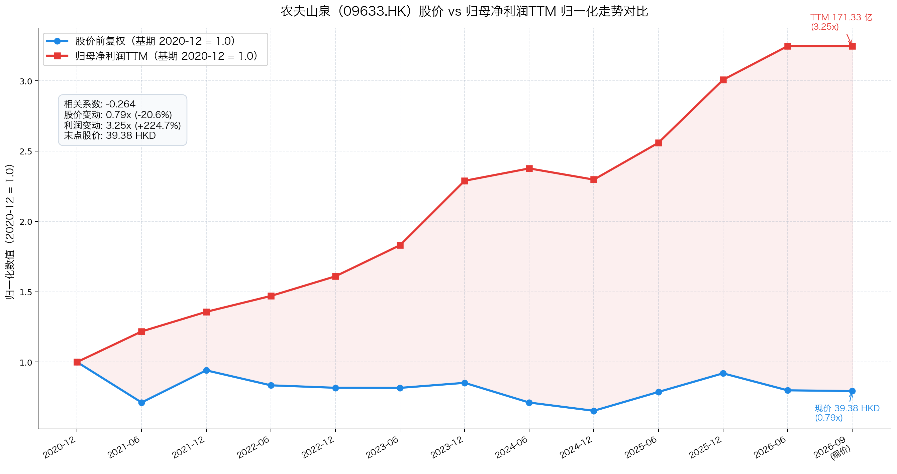

# 农夫山泉（09633.HK）2026年中报财报速览——茶饮接棒第一大品类，包装水低速承压

> 报告期：2026 年 1—6 月｜披露日：2026 年 8 月 25 日｜未经审计。数据源：公司《2026年中期业绩公告》（港交所披露易初步公告，32页）。市值、PE、PB 按 2026 年 9 月 16 日收盘实测。

## 一句话结论

**茶饮爆发式增长（+30.1%）首超包装水成为第一大品类，驱动整体收入增 16.0%、归母净利增 16.6%，但包装水增速骤降至 +2.1%、下半年 PET 成本压力或集中释放。**

当前 PE-TTM 22.45 倍处上市以来 1.09% 极低分位（同花顺近5年 0.81% 分位）。利润 TTM 自 2020 年的 52.77 亿增至 171.33 亿（+225%）而股价反跌 21%，属于典型的业绩增长与估值压缩背离。

## 主要指标速览

| 指标 | 2026H1 | 2025H1 | 同比变动 |
|------|--------|--------|----------|
| 营业收入 | 297.18 亿 | 256.22 亿 | +16.0% |
| 归母净利润 | 88.87 亿 | 76.22 亿 | +16.6% |
| 整体毛利率 | 60.86% | 60.30% | +0.56pct |
| 经营现金流① | 待9月全文披露 | 104.06 亿 | 见表注说明 |
| 狭义净现金（6月末）② | 213.20 亿 | 178.76 亿 | +19.3% |
| 茶饮料收入（特色指标） | 131.22 亿（占比 44.2%） | 100.89 亿（占比 39.4%） | +30.1% |
| 包装饮用水收入（特色指标） | 96.41 亿（占比 32.4%） | 94.43 亿（占比 36.9%） | +2.1% |
| 存货周转天数③ | 94.7 天 | 95.5 天（2025年末） | 微降 0.8 天 |
| 年度分红率（2025A） | 71.8% | 69.5% | 每股 0.76 元人民币 |
| PE(TTM)④ | 22.45 倍 | — | 上市以来 1.09% 分位 |
| PB(MRQ)④ | 10.35 倍 | — | 上市以来 13.8% 分位 |

> ①港股《中期业绩公告》（初步披露）不强制包含现金流量表，本期公告未披露现金流主表，数据待 9 月下旬《中期报告全文》发布后补充；2025H1 经营活动现金流为 104.06 亿元作为参考基准。  
> ②狭义净现金 = 现金及银行存款 210.80 亿 + 长期定存 54.26 亿 − 计息借款 51.86 亿 = 213.20 亿；若计入理财（FVTPL 金融资产 111.10 亿），广义净现金达 324.30 亿。  
> ③取自官方管理层讨论与分析（MD&A 原文 P22）披露的标准周转天数，应收周转天数为 4.5 天（2025年末 4.1 天）。  
> ④市值、PE、PB 按 2026 年 9 月 16 日收盘实测（收盘价 39.38 港元，总市值 4428.86 亿港元，实时汇率 1 HKD = 0.855 CNY 折算为 3786.67 亿人民币）。滚动 TTM 净利润为 171.33 亿元。

---

## 一、它赚不赚钱？——利润表

上半年整体营收 297.18 亿元，同比 +16.0%。归母净利润 88.87 亿元，同比 +16.60%，利润增速略超收入。

### 收入结构：茶饮跨过里程碑

| 业务品类 | 2026H1收入 | 收入占比 | 同比增速 | 2025H1占比 |
|----------|-----------|----------|----------|-----------|
| **茶饮料** | **131.22 亿** | **44.2%** | **+30.1%** | 39.4% |
| 包装饮用水 | 96.41 亿 | 32.4% | +2.1% | 36.9% |
| 功能饮料 | 33.48 亿 | 11.3% | +15.5% | 11.3% |
| 果汁饮料 | 29.22 亿 | 9.8% | +14.0% | 10.0% |
| 其他产品 | 6.84 亿 | 2.3% | +8.7% | 2.5% |
| **合计** | **297.18 亿** | **100%** | **+16.0%** | **100%** |

茶饮收入占比提升 4.8 个百分点至 44.2%，首次超越包装水成为第一大收入来源。

东方树叶无糖茶势能强劲。新品"冷萃龙井"在山姆等高势能渠道动销极佳，连续数周居即饮茶销量榜首。

包装水增速放缓至 +2.1%。主因二季度南方多雨偏冷影响出行，加之绿瓶纯净水降价促销拉低出厂均价。

### 盈利能力：产品结构优化拉升毛利

| 盈利指标 | 2026H1 | 2025H1 | 同比变动 |
|----------|--------|--------|----------|
| 整体毛利率 | 60.86% | 60.30% | +0.56pct |
| 销售净利率 | 29.90% | 29.75% | +0.16pct |
| 茶饮料分部利润率 | 48.8% | 48.3% | +0.5pct |
| 功能饮料分部利润率 | 44.7% | 47.1% | -2.4pct |
| 果汁饮料分部利润率 | 36.1% | 31.3% | +4.8pct |
| 包装饮用水分部利润率 | 33.8% | 35.4% | -1.6pct |

整体毛利率逆势提升 0.56 个百分点至 60.86%，高附加值品类占比提升抵御了成本波动。

茶饮与果汁成为毛利核心拉动力。茶饮收入占比大增且利润率微升，叠加果汁原料采购价回落带动果汁利润率大涨 4.8pct。

包装水利润率下滑 1.6pct。受 PET 瓶片采购成本上涨与绿瓶低价促销双重挤压，包装水分部利润率降至 33.8%。

费用端表现克制。销售及分销开支、行政开支增幅与营收扩张节奏匹配，净利率微升至 29.90%。

---

## 二、赚到的钱到手了吗？——现金流量表

农夫山泉 8 月 25 日发布的《2026年中期业绩公告》（初步公告，32页）未披露简明综合现金流量表。

港股规则允许业绩初步公告豁免现金流主表，四表完整数据通常在 9 月下旬披露的《中期报告全文》中呈现。

按照严守数据完整性红线原则，本速览不编造当期现金流数据，真实数据待全文发布后补充核验。

历史基准参考（取自 2025 中期报告全文）：
- 2025H1 经营活动现金流量净额：104.06 亿元
- 2025H1 投资活动现金流量净额：-61.94 亿元（含定存净投入）
- 2025H1 融资活动现金流量净额：+7.92 亿元

从上半年归母净利 88.87 亿（+16.6%）看，若收现节奏平稳，经营现金流有望维持在百亿上方，待全文印证。

---

## 三、家底厚不厚？——资产负债表（含排雷检查）

| 资产负债重点项目 | 2026.6.30 | 2025.12.31 | 变动幅度 | 简析 |
|------------------|-----------|------------|----------|------|
| 总资产 | 765.73 亿 | 651.69 亿 | +17.5% | 规模稳步扩张 |
| 权益总额（净资产） | 371.66 亿 | 394.70 亿 | -5.8% | 5月股东大会通过年度分红计提冲减 |
| 现金及银行存款 | 210.80 亿 | 111.78 亿 | +88.6% | 账面活期现金大幅充实，流动性极佳 |
| 长期定期存款 | 54.26 亿 | 110.88 亿 | -51.1% | 部分大额定存到期回流至现金 |
| 计息借款（有息负债） | 51.86 亿 | 43.90 亿 | +18.1% | 全为流动周转借款，无长期借贷 |
| **狭义净现金** | **213.20 亿** | **178.76 亿** | **+19.3%** | **现金是有息负债的 4.1 倍，安全垫深厚** |

另有流动资产中以公允价值计量且变动计入损益（FVTPL）的金融资产 111.10 亿元（结构性存款与理财）。

若计入该项，广义净现金达 324.30 亿元（2025 年底为 254.31 亿元），抗风险资金池极度充裕。

净资产下降 5.8% 并非经营亏损。主因 5 月股东大会批准派发 2025 年度股息 85.47 亿，账面计提冲减未分配利润。

### 排雷检查

| 排雷项目 | 结果 | 财报核验结论 |
|----------|------|--------------|
| 商誉减值 | ✅ 零商誉 | 账面无任何商誉，不存在资产减值风险 |
| 存货积压 | ✅ 良性受控 | 存货 62.14 亿（较年初 +6.3%），官方周转天数 94.7 天（微降 0.8 天，P22） |
| 应收坏账 | ✅ 极度稳健 | 应收 9.01 亿，官方周转天数仅 4.5 天（P22），先款后货模式未受动摇 |
| 偿债压力 | ✅ 极低 | 资本负债比率 14.2%（公司口径 P22），现金资产完全兜底短期借款 |
| 股东质押 | ✅ 零风险 | 控股股东无股权质押，无非标审计意见与大额异常关联交易 |

官方披露存货周转天数为 94.7 天（P22），较 2025 年末的 95.5 天微降 0.8 天，备货良性受控。

---

## 四、明年还能赚吗？——看未来（增长引擎/排雷/股东回报）

### 增长引擎

| 驱动方向 | 动能强度 | 持续性 | 业务支撑 |
|----------|----------|--------|----------|
| 茶饮品类红利 | ⭐⭐⭐⭐⭐ | 中高 | 东方树叶无糖茶龙头地位巩固，但基数过百亿后增速或回归常态 |
| 水源地产能扩建 | ⭐⭐⭐⭐ | 高 | 新增云南轿子雪山、海南雷琼海口火山群，全国优质水源地增至 17 处 |
| 功能饮料放量 | ⭐⭐⭐ | 中 | 力量帝、尖叫等品类扩充场景，维持双位数稳健增长 |
| 包装水份额修复 | ⭐⭐ | 中低 | 绿瓶纯净水铺市反击，但面临怡宝与娃哈哈激烈的价格战压制 |

### 核心约束与排雷重点

一是 PET 采购成本上行。上半年 PET 采购价同比涨约 15%，下半年旺季动销或集中传导至毛利端。

二是包装水价格战升级。行业存量博弈下绿瓶降价促销拉低吨均价，包装水分部利润率短期承压。

三是茶饮高基数效应。半年度收入跨过 130 亿门槛后，维持超 25% 复合增长的边际难度显著上升。

### 股东回报

公司重视股东现金回报。2025 年度分红 85.47 亿元（每股派 0.76 元），年度分红率达 71.8%。

半年度惯例不派息。按现价 39.38 港元计股息率约 2.4%，港股通需代扣 20% 红利税（直接持股 10%）。

---

## 红绿灯速判

🔴 **红灯：均未触发**——无大存大贷、商誉为零、无控股股东质押、无重大关联交易、无流动性危机。

🟡 **黄灯：四项**——包装水增速骤降至+2.1%（绿瓶价格战拉低均价）｜PET原材料成本上涨（压制包装水毛利率）｜茶饮高基数后增速或向15%~25%回归｜初步业绩公告未披露现金流表（待9月全文补充）。

🟢 **绿灯：八项**——茶饮爆发式增长（+30.1%成第一大品类）｜整体毛利率逆势升至60.9%｜归母净利润双位数增长（+16.6%达88.87亿）｜狭义净现金达213.20亿（现金储备极厚）｜存货周转天数微降至94.7天（官方披露P22）｜应收周转天数仅4.5天（先款后货回款无忧）｜零商誉无资产减值包袱｜高分红政策稳定（分红率超70%）。

---

## 估值与观察点

上市以来（2020-12 至 2026-09），股价与净利润 TTM 呈现出显著的走势背离。

### 图读法与走势特征

两线走势长期负相关（相关系数 -0.274）。股价从上市初期的 49.59 港元回落至 39.38 港元（跌幅 20.6%）。

滚动归母净利润 TTM（过去12个月累计净利润）则从 52.77 亿元强劲增长至 171.33 亿元（增幅 224.7%）。

**利润翻两倍多而股价下跌两成，当前的农夫山泉是典型的“业绩增长消化估值溢价”，而非基本面双杀。**

### PE 历史分位与估值演变

按 2026 年 9 月 16 日收盘实测：
- 现价：39.38 港元
- 总市值：4428.86 亿港元（折合 3786.67 亿元人民币，当日实时外汇中间价 1 HKD = 0.855 CNY）
- PE-TTM：22.45 倍（东财/腾讯官方接口实测；按当前 TTM 净利 171.33 亿人民币复算为 22.10 倍）
- PB(MRQ)：10.35 倍（市净率，市值除以净资产）

**PE 历史分位：上市以来 1.09% 分位（同花顺近5年 0.81% 分位）。** 上市以来 1100 个交易日中，仅 12 天估值低于当前。

| 年份区间 | PE(TTM)波动区间 | 年末PE | 估值演变特征 |
|----------|-----------------|--------|--------------|
| 2021 年 | 57.8 ～ 127.8x | 72.7x | 新股溢价泡沫期，估值严重脱离基本面 |
| 2022 年 | 47.8 ～ 74.4x | 57.6x | 估值中枢被动回落消化 |
| 2023 年 | 46.1 ～ 55.1x | 50.0x | 疫后高增消化高估值 |
| 2024 年 | 18.9 ～ 40.2x | 28.4x | 舆情风波冲击，估值大幅压缩 |
| 2025 年 | 27.1 ～ 42.0x | 29.9x | 估值低位震荡企稳 |
| 当前（2026-09-16） | 19.9 ～ 32.6x | 22.45x | 处于上市以来 1.09% 历史极低位 |

### 市场定价逻辑与担忧

市场当前压制估值的主要担忧集中在三点：
1. 包装水作为基本盘增速降至 +2.1%，价格战导致吨均价与利润率双降；
2. PET 成本上涨对下半年利润率的潜在侵蚀；
3. 茶饮体量突破 130 亿后，后续增长斜率可能放缓。

### 利润方向判断

预计未来 2-3 年归母利润由超高增长转向 10%～15% 的常态中速增长。

茶饮依靠无糖茶赛道红利仍可贡献增量，包装水低基数下有望企稳，但难以重现高爆发增长。

### 客观估值情景推演

- **估值修复情景**：若包装水价格战缓和、PET 成本压力出清、市场悲观情绪扭转，估值有望修复至历史偏低估值中枢（26～28x PE-TTM）。基于当前 171.33 亿 TTM 利润，对应理论股价区间约为 **46.3～49.9 港元**。
- **持续磨底情景**：若价格战持续激化、PET 成本进一步走高、茶饮增速下移，估值或维持在历史极低区（20～22x PE-TTM）。对应理论股价区间约为 **35.6～39.2 港元**，当前现价正处防御边界附近。

### 关键观察点表格

| 跟踪时间节点 | 核心验证变量 | 观察意义 |
|--------------|--------------|----------|
| 2026年9月下旬 | 《2026中期报告全文》发布 | 校验经营现金流主表与真实收现质量 |
| 2026年三季度 | 茶饮旺季动销与 PET 成本传导 | 验证无糖茶增速能否维持在 20%+，检验毛利抗压性 |
| 2026全年年报 | 包装水板块复苏弹性与渠道价格 | 检验绿瓶价格战是否收尾，新水源地产能释放效率 |
| 2027年 | 功能饮料新品及海外开拓 | 检验第二、第三增长曲线的接力能力 |

---

如果您觉得这篇文章有启发，欢迎点赞、转发、关注！

风险提示：本文仅供参考，不构成投资建议。市场有风险，入市需谨慎。
