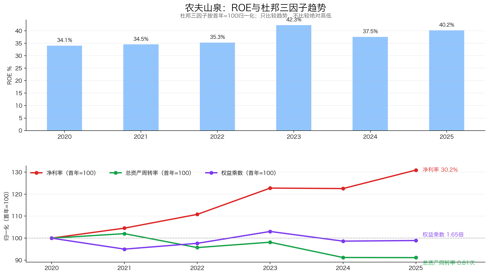
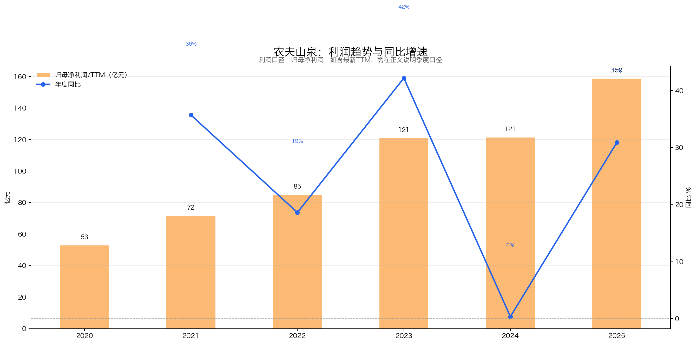
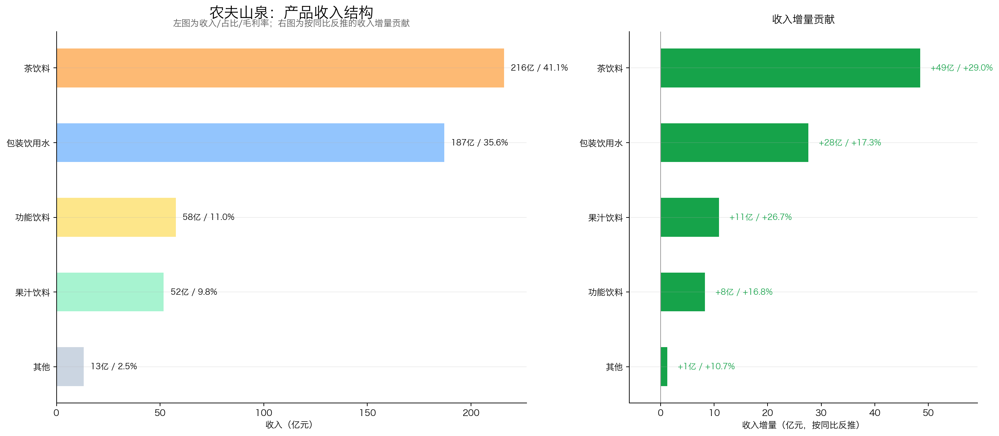
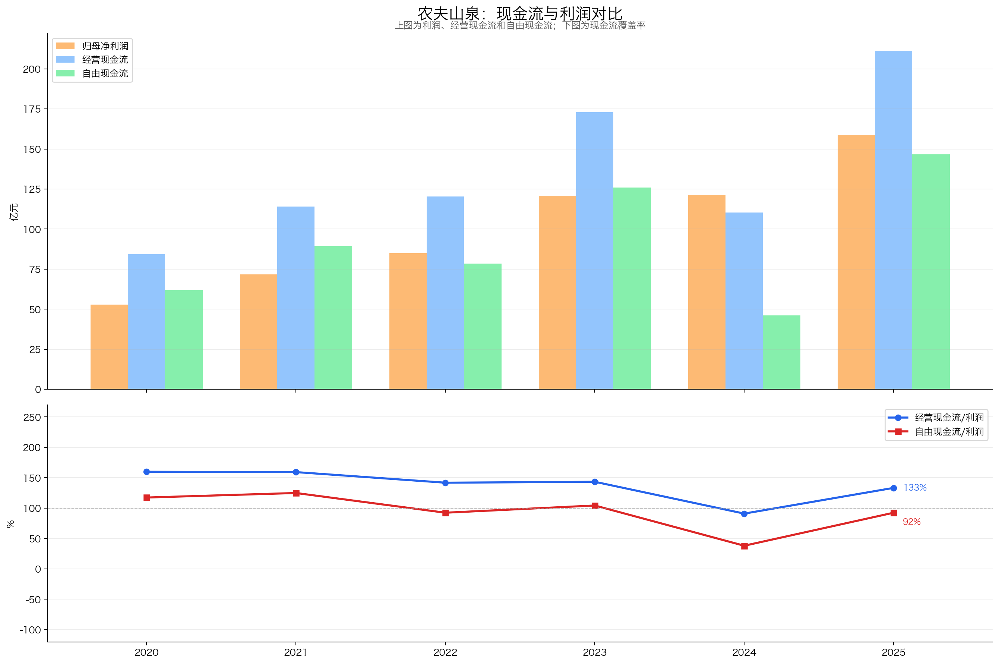
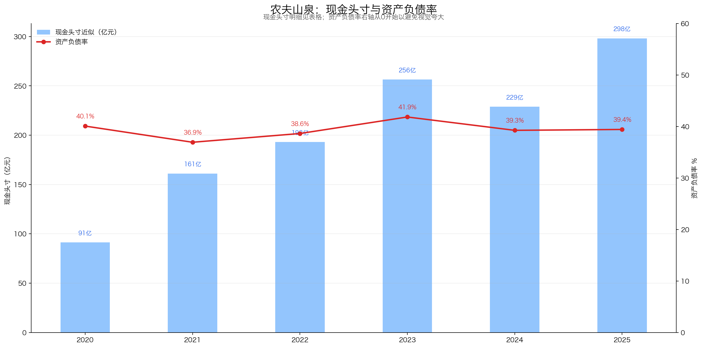
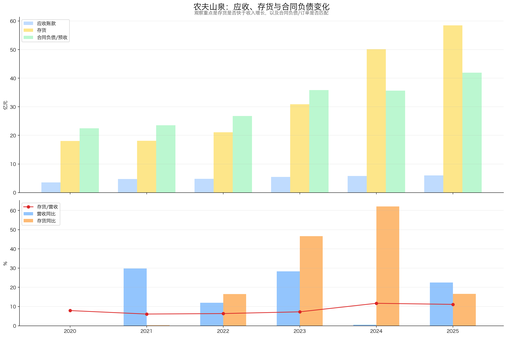
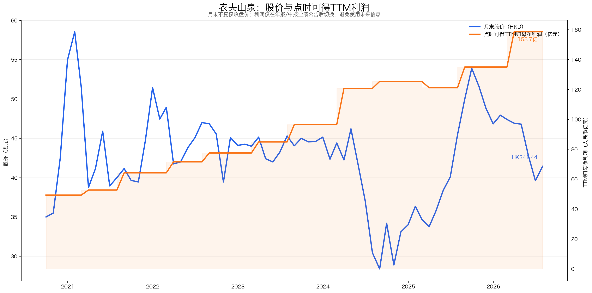
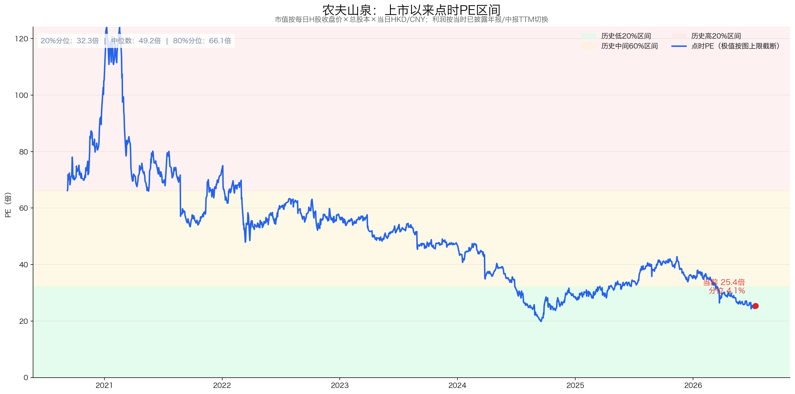

# 农夫山泉（09633.HK）投资分析报告

> 结论先行：农夫山泉已经不只是“卖水的公司”，而是由包装饮用水与无糖茶共同驱动的综合饮料龙头。2024年舆情冲击使包装水收入下滑21.3%，但2025年包装水收入恢复增长17.3%，茶饮料增长29.0%，带动总收入增长22.5%、归母净利润增长30.9%，证明品牌和渠道没有被永久破坏。公司ROE长期在34%—42%，主要由高净利率而不是高杠杆驱动；2025年经营现金流211.4亿元，彼得林奇现金头寸约298.2亿元，资产负债表稳健。问题在价格：2026年7月14日收盘价41.44港元，对应约25.4倍PE，虽然处于上市以来约4.1%低分位，但仍显著高于华润饮料、康师傅和统一企业中国。它是“高胜率、赔率一般”的好公司，当前评级为“关注”，更适合等待安全边际或分批观察，不适合因为历史低分位就忽视绝对估值。

数据日期：2026-07-15  
行情基准日：2026-07-14（最近完整交易日；2026-07-15 14:09港股仍在交易）  
股价：41.44港元  
总股本：112.464664亿股（H股50.346664亿股+内资股62.118亿股）  
市值：约4,660.5亿港元，约4,031.4亿元人民币  
2025年归母净利润：158.68亿元  
PE（TTM）：约25.4倍  
上市以来点时PE分位：约4.1%  
彼得林奇现金头寸：约298.21亿元人民币  
扣现金后PE：约23.5倍  
2025年末期股息：每股人民币0.99元  
静态股息率：约2.76%  
评级：关注  
总分：79.5 / 100

重要口径说明：
- 公司为港股，股价和市值以港元计价，财报以人民币计价；估值按2026-07-14的HKD/CNY 0.865001折算。
- 农夫山泉只披露半年报和年报。报告以IFRS“母公司拥有人应占溢利”为利润主线，半年TTM按“上年全年+本年H1-上年H1”计算，没有伪造季度利润。
- 总市值按“H股价格×全部已发行股份”估算。H股与内资股经济权益相同，但内资股不能在港交所自由交易，因此该口径是整体股权价值估算，不代表内资股可按同价立即变现。
- 现金头寸采用“现金及银行结余+长期银行存款+按公允价值计入损益的金融资产-长期有息债务”。2025年末无长期银行借款；流动计息借款43.90亿元不按彼得林奇主公式扣除，但单独检查偿债覆盖。
- 本报告不使用券商盈利预测。情景估值只采用历史财务和保守假设，不是盈利承诺。

---

## 一、先判断能不能研究：公司画像、能力圈与红线

### 1.1 公司画像

农夫山泉的商业模式可以拆成四层：

| 层级 | 做什么 | 赚钱逻辑 | 关键变量 |
|---|---|---|---|
| 水源与生产 | 在优质水源地附近建设工厂并灌装 | 天然水源差异化、减少长距离运水成本 | 水源质量、产能布局、物流半径 |
| 品牌与产品 | 农夫山泉、东方树叶、茶π、尖叫、水溶C100等 | 品牌溢价、大单品复购、跨品类扩张 | 品牌信任、产品创新、价格带 |
| 渠道与终端 | 经销商、零售终端、自动售卖及新零售 | 高密度铺货提高购买便利性 | 终端覆盖、经销商动销、费用效率 |
| 供应链与现金流 | 原料采购、生产、物流、先款后货/合同负债 | 规模效应、较低应收、稳定现金回款 | PET和茶叶成本、库存、合同负债 |

2025年，茶饮料收入215.96亿元，首次明显高于包装饮用水的187.09亿元。农夫山泉已经形成“包装水提供基本盘、无糖茶提供增长”的双引擎，而不是单一瓶装水公司。

### 1.2 能力圈判断

能力圈：能看懂，谨慎通过。

能看懂的部分：
- 水、茶、功能饮料和果汁都是高频复购消费品；
- 收入、利润率、现金流、产品结构、存货和合同负债均可从财报持续跟踪；
- 护城河可以落实到水源、品牌、渠道、净利率和现金流，而不是只能讲故事。

不容易看懂的部分：
- 线下真实动销、终端库存和各品牌份额披露有限；
- 舆情冲击具有非线性，财务模型很难提前量化；
- 茶饮料高增长中，东方树叶、茶π及新品的具体收入没有逐品牌披露；
- 控股股东持股高度集中，外部股东难以影响重大决策。

### 1.3 红线检查

| 项目 | 判断 |
|---|---|
| 审计意见 | 2025年安永出具“真实而中肯反映”的无保留意见，未触发红线 |
| 行业属性 | 必选/弱周期消费，不属于强周期 |
| 现金流 | 2020—2025经营现金流全部为正；2024短暂转弱，2025明显恢复 |
| 有息负债 | 2025年末流动计息借款43.90亿元，无长期银行借款；现金类资产足以覆盖 |
| 商誉与并购 | 未见依靠大额商誉或频繁并购制造增长 |
| 存货 | 2024增长62.1%，2025再增长16.6%，周转天数升至95.5天，触发观察项 |
| 品牌风险 | 2024舆情导致包装水收入下滑21.3%，证明品牌资产既是护城河也是风险集中点 |
| 控制权 | 钟睒睒直接及间接持股约84.038%，利益绑定强，但关键人和少数股东治理风险较高 |
| 价值陷阱 | 不是低PE主业衰退型公司；主要风险是以“历史低分位”掩盖25倍绝对PE仍不便宜 |

初筛结论：通过，但必须带着三个问题继续研究：
1. 2025年的包装水恢复是一次性反弹，还是份额真正修复；
2. 茶饮料能否在高基数下继续增长，并降低对包装水的单一依赖；
3. 25倍PE能否提供足够安全边际，而不只是比公司历史便宜。

---

## 二、好行业：是不是好生意？

### 2.1 需求质量与非周期性

包装饮用水满足补水和饮水安全需求，具备高频、低客单、弱周期、全年消费的特征。华润饮料2024年招股书引用灼识咨询（CIC）数据：
- 2023年中国包装饮用水零售额约2,150亿元；
- 2018—2023年CAGR为7.1%；
- 包装饮用水占即饮软饮料市场23.6%，为最大单一品类；
- 中国饮用水包装化率仅14.4%，低于中国香港22.7%和美国59.7%。

这组数据说明行业不是爆发式赛道，但具备长期量价和渗透率空间。茶饮料受益于低糖、无糖和健康化趋势，增长弹性高于传统含糖饮料，但口味迭代和新品竞争更激烈。

### 2.2 竞争格局

2023年中国包装饮用水市场按零售额计算：

| 排名 | 企业 | 零售额 | 市占率 | 识别依据 |
|---|---|---:|---:|---|
| 1 | 农夫山泉 | 507亿元 | 23.6% | 华润饮料招股书Company C：1996年杭州成立、港股上市 |
| 2 | 华润饮料/怡宝 | 396亿元 | 18.4% | 华润饮料自身 |
| 3—5 | 其他三家 | 合计357亿元 | 合计16.6% | 招股书匿名披露 |
| 前五合计 | — | 1,260亿元 | 58.6% | 较2021年的56.2%继续提高 |

竞争格局是“两强领先、长尾分散”。农夫山泉和怡宝合计份额42.0%，但行业并非垄断：纯净水生产扩张快、区域品牌众多，促销和价格竞争长期存在。

2026年7月14日主要港股可比公司行情：

| 公司 | 市值 | PE（TTM） | 股息率 | 主要业务 |
|---|---:|---:|---:|---|
| 农夫山泉 | 约4,660.5亿港元 | 25.4倍 | 2.75% | 天然水、茶、功能饮料、果汁 |
| 华润饮料 | 约178.4亿港元 | 15.8倍 | 3.16% | 怡宝纯净水为核心 |
| 康师傅控股 | 约634.7亿港元 | 12.2倍 | 4.09% | 方便面、茶饮料、包装水 |
| 统一企业中国 | 约324.0亿港元 | 13.6倍 | 7.32% | 饮料、方便面 |

农夫山泉的市值和PE远高于可比公司，市场支付的是更高增长、更高利润率和更强品牌组合的溢价。溢价有基本面支持，但也意味着一旦增长回落，估值压缩空间更大。

### 2.3 进入壁垒

农夫山泉的壁垒不是“瓶装水生产技术”，而是多重系统叠加：

1. 水源：截至2025年报最后可行日期，公司已布局17个主要水源地；天然水需要长期寻找、评估、取水许可和就近建厂。
2. 全国生产网络：水的单位货值低、运输成本高，水源附近生产与区域工厂布局直接影响成本。
3. 品牌：农夫山泉、东方树叶等品牌形成消费者心智，广告和长期信任很难短期复制。
4. 渠道：饮料属于“随手买”的生意，终端可得性比单纯产品配方更重要。
5. 多品类研发：同一渠道可以重复承载水、茶、功能饮料和果汁，新品成功后边际渠道成本较低。

### 2.4 上下游议价权

上游风险主要来自PET、纸箱、瓶盖、糖、果汁和茶叶。PET价格具有周期波动，但农夫山泉采购规模大、毛利率高，有较强吸收和转嫁能力。公司2025年毛利率升至60.5%，说明成本与产品结构整体受控。

下游以经销和零售终端为主。公司的应收账款及票据仅5.98亿元，占收入约1.1%，合同负债41.95亿元，说明回款纪律和渠道议价权较强。但销售折扣、返利和陈列资源仍是竞争成本，不能把低应收等同于渠道没有压力。

### 2.5 替代品威胁

包装水的底层补水需求稳定，但存在三类替代：
- 饮水方式：净水器、桶装水、直饮水；
- 水种竞争：天然水、纯净水、矿泉水之间切换；
- 饮料预算：无糖茶、功能饮料、咖啡等替代部分即饮场景。

替代风险中等偏低。家庭场景可能被净水器分流，但户外、通勤、餐饮和即时消费仍依赖包装饮用水。对农夫山泉而言，更重要的不是“水会不会消失”，而是消费者会选天然水、纯净水，还是直接选无糖茶。

### 好行业评分

| 子项 | 得分 | 理由 |
|---|---:|---|
| 需求质量/非周期性 | 5.5 / 6 | 补水刚需、高频复购、弱周期，行业仍有渗透空间 |
| 竞争格局 | 3.0 / 4 | 两强领先、集中度提升，但促销和区域竞争长期存在 |
| 进入壁垒 | 3.5 / 4 | 水源、品牌、全国工厂和渠道网络难以同时复制 |
| 上下游议价权 | 2.5 / 3 | 低应收、高毛利、规模采购体现议价权，原料与渠道费用仍波动 |
| 替代品威胁 | 2.0 / 3 | 底层需求稳定，但水种和饮料品类替代较容易 |
| 小计 | 16.5 / 20 | 好行业，但不是没有价格战和品牌波动的垄断生意 |

---

## 三、好公司·定性：有没有长期复利能力？

### 3.1 护城河

农夫山泉的护城河可以概括为“水源×品牌×渠道×产品组合”：
- 水源决定天然水差异化和生产布局；
- 品牌降低消费者选择成本；
- 渠道保证随处可以买到；
- 产品组合让一套渠道反复承载东方树叶、茶π、尖叫和果汁等新品。

2024年是一次压力测试：舆情让包装水收入下滑21.3%，但公司总收入仍增长0.5%，因为茶饮料增长32.3%；2025年包装水恢复17.3%，茶饮料继续增长29.0%。这表明护城河并非“不会受伤”，而是“受伤后仍能依靠多品类和渠道修复”。

### 3.2 复购、粘性与低替代性

水和茶都是高频复购，但消费者切换品牌的成本并不高。公司的粘性来自习惯、可得性、品牌信任和口味偏好，而不是合同锁定。

- 农夫山泉天然水：复购高，但怡宝、景田、娃哈哈等替代品很多；
- 东方树叶：口味和无糖茶心智更强，品牌差异化高于普通水；
- 茶π、尖叫和果汁：需要持续创新，单品生命周期风险高于包装水。

因此，农夫山泉的“组合复购”强于“单品不可替代”。

### 3.3 定价权

公司具备定价权，但不是无限定价权：
- 正面证据：2020—2025毛利率始终在57%—61%，2025净利率升至30.2%；
- 正面证据：东方树叶等高附加值饮料占比提升，茶饮料成为第一大收入品类；
- 反面证据：2024年推出和推广纯净水新品、包装水销量下降导致固定成本分摊上升，毛利率下降1.4个百分点；
- 反面证据：包装水品牌切换成本低，价格促销会影响动销。

结论：品牌和产品结构带来较强定价权，但水业务仍受到价格带和促销竞争约束。茶饮料的定价权强于普通包装水。

### 3.4 管理层与治理

- 实际控制人：钟睒睒，截至2025年末直接及间接持股约84.038%；
- 经营管理层：钟睒睒任董事长兼总经理，吴莉敏、向咸松、饶明红、韩林攸为执行董事；
- 优点：创始人利益绑定强，1996年以来长期专注饮料和健康消费，没有依赖高杠杆并购扩张；
- 优点：在包装水之外成功培育东方树叶，证明管理层具备跨品类打造大单品的能力；
- 风险：董事长、总经理和控制权高度集中，关键人风险高，少数股东制衡能力有限；
- 风险：2024舆情应对暴露出创始人个人形象与公司品牌高度绑定。

2025年公司回购股份约2.22亿元，同时确认股份支付费用0.77亿元；回购规模相对市值很小，更接近员工激励安排，不能视为大规模低估回购信号。

### 好公司·定性评分

| 子项 | 得分 | 理由 |
|---|---:|---|
| 护城河 | 6.0 / 7 | 水源、品牌、渠道、多品类叠加，2024—2025压力测试后恢复 |
| 复购/粘性/低替代性 | 4.5 / 5 | 高频复购强，但消费者品牌切换成本不高 |
| 定价权 | 3.5 / 5 | 高毛利和产品结构证明定价权，水业务仍受价格竞争约束 |
| 管理层 | 2.5 / 3 | 长期专注、资本配置克制，控制权和关键人集中扣分 |
| 小计 | 16.5 / 20 | 优秀创始人型消费公司，但品牌与关键人风险高度相关 |

---

## 四、好公司·定量：利润是不是真，增长是否健康？

### 4.1 ROE质量与盈利模式



| 年份 | 营收 | 归母净利润 | 净利率 | 总资产周转率 | 权益乘数 | 简单ROE |
|---|---:|---:|---:|---:|---:|---:|
| 2020 | 228.77 | 52.77 | 23.1% | 0.88 | 1.67 | 34.1% |
| 2021 | 296.96 | 71.62 | 24.1% | 0.90 | 1.59 | 34.5% |
| 2022 | 332.39 | 84.95 | 25.6% | 0.85 | 1.63 | 35.3% |
| 2023 | 426.67 | 120.79 | 28.3% | 0.87 | 1.72 | 42.3% |
| 2024 | 428.96 | 121.23 | 28.3% | 0.81 | 1.65 | 37.5% |
| 2025 | 525.53 | 158.68 | 30.2% | 0.81 | 1.65 | 40.2% |

口径：简单ROE=归母净利润/期末权益；杜邦三因子也统一使用期末资产和权益。它不是年报加权平均ROE，重点用于看驱动趋势。

结论：ROE高且质量好。2020—2025净利率从23.1%升至30.2%，权益乘数从1.67降至1.65，说明ROE不是靠加杠杆维持。短板是总资产周转率从0.90降至0.81，反映产能和现金资产增长快于收入，未来要看新增资本开支能否转化为收入。

### 4.2 利润增长来源与持续性



| 年份 | 营收 | 同比 | 归母净利润 | 同比 | 毛利率 | 净利率 |
|---|---:|---:|---:|---:|---:|---:|
| 2020 | 228.77 | — | 52.77 | — | 59.1% | 23.1% |
| 2021 | 296.96 | +29.8% | 71.62 | +35.7% | 59.5% | 24.1% |
| 2022 | 332.39 | +11.9% | 84.95 | +18.6% | 57.4% | 25.6% |
| 2023 | 426.67 | +28.4% | 120.79 | +42.2% | 59.5% | 28.3% |
| 2024 | 428.96 | +0.5% | 121.23 | +0.4% | 58.1% | 28.3% |
| 2025 | 525.53 | +22.5% | 158.68 | +30.9% | 60.5% | 30.2% |

2020→2025是5年：
- 营收CAGR：18.1%；
- 归母净利润CAGR：24.6%；
- 经营现金流CAGR：20.2%。

2022→2025是3年：归母净利润CAGR为23.15%，不是由单一低基数年份制造。利润增长来自：
1. 收入扩张：包装水恢复、茶饮料持续增长；
2. 产品结构：高附加值茶饮料占比提升；
3. 利润率提升：净利率从2020年的23.1%升至2025年的30.2%。

持续性判断：未来利润增速大概率低于过去5年的24.6%，因为净利率已处高位、茶饮料基数变大。若收入仍能保持低双位数增长，利润增长仍有质量；如果未来继续依赖净利率单边提升，则持续性会下降。

### 4.3 产品结构与增长来源



| 产品 | 2020收入 | 2023收入 | 2024收入 | 2025收入 | 2025占比 | 2025同比 |
|---|---:|---:|---:|---:|---:|---:|
| 包装饮用水 | 139.66 | 202.62 | 159.52 | 187.09 | 35.6% | +17.3% |
| 茶饮料 | 30.88 | 126.59 | 167.45 | 215.96 | 41.1% | +29.0% |
| 功能饮料 | 27.92 | 49.02 | 49.32 | 57.62 | 11.0% | +16.8% |
| 果汁饮料 | 19.77 | 35.33 | 40.85 | 51.76 | 9.8% | +26.7% |
| 其他 | 10.54 | 13.11 | 11.82 | 13.09 | 2.5% | +10.7% |

核心变化：
- 茶饮料从2020年的13.5%升至2025年的41.1%，已经成为第一大品类；
- 包装水占比从61.0%降至35.6%，单一水业务依赖明显下降；
- 2024年茶饮料新增收入48.9亿元，完全抵消包装水减少43.1亿元；
- 2025年所有品类恢复增长，茶饮料贡献约一半收入增量；
- 包装水虽然恢复增长，但187.09亿元仍比2023年的202.62亿元低7.7%，尚未完全回到舆情冲击前水平。

结论：第二曲线已经成立，不是概念。风险也从“只靠水”转为“水+茶合计占76.7%”；东方树叶的品牌生命周期、无糖茶竞争和茶叶原料库存成为新的核心变量。

### 4.4 现金流质量



| 年份 | 归母净利润 | 经营现金流 | 资本开支 | 自由现金流 | OCF/净利润 | FCF/净利润 |
|---|---:|---:|---:|---:|---:|---:|
| 2020 | 52.77 | 84.29 | 22.36 | 61.93 | 160% | 117% |
| 2021 | 71.62 | 114.00 | 24.62 | 89.38 | 159% | 125% |
| 2022 | 84.95 | 120.42 | 41.93 | 78.48 | 142% | 92% |
| 2023 | 120.79 | 173.05 | 47.14 | 125.91 | 143% | 104% |
| 2024 | 121.23 | 110.22 | 64.06 | 46.16 | 91% | 38% |
| 2025 | 158.68 | 211.42 | 64.81 | 146.60 | 133% | 92% |

2024年是明显异常：包装水动销受冲击、存货增加19.21亿元、资本开支64.06亿元，使自由现金流降至46.16亿元。2025年经营现金流升至211.42亿元，自由现金流恢复至146.60亿元，说明2024并未演变为持续性现金流恶化。

结论：长期现金流优秀，2025利润含金量高；但资本开支已由2020年的22.36亿元升至2025年的64.81亿元，需要跟踪新水源、工厂和茶产业链投入的回报率。

### 4.5 现金头寸与资产负债表安全性



2025年末彼得林奇现金头寸：

| 科目 | 金额 | 是否计入 | 说明 |
|---|---:|---|---|
| 现金及银行结余 | 111.78亿元 | 是 | 含银行现金28.68亿元、短期银行存款83.09亿元 |
| 长期银行存款 | 110.88亿元 | 是 | 年报附注明确为银行存款 |
| FVTPL金融资产 | 75.55亿元 | 是 | 主要为结构性存款63.28亿元、券商收益凭证12.27亿元 |
| 长期有息债务 | 0 | 减项 | 非流动负债主要为递延收益、递延税项和租赁负债，无长期银行借款 |
| 现金头寸 | 298.21亿元 | — | 占当前人民币市值约7.4% |

补充风险口径：
- 流动计息借款43.90亿元不按彼得林奇主公式扣除；
- 即使额外扣除流动借款，保守净金融现金仍约254.31亿元；
- 2025年流动资产265.64亿元、流动负债248.23亿元，流动比率约1.07；
- 短期流动性不宽裕，但现金、存款和金融资产足以覆盖计息借款。

当前每股现金头寸约人民币2.65元，折合约3.07港元；扣现金后PE从25.4倍降至23.5倍。现金提供安全垫，但只占市值7.4%，不能把公司包装成“现金壳”。

### 4.6 营运质量与风险信号



| 年份 | 应收账款及票据 | 存货 | 合同负债 | 存货/营收 |
|---|---:|---:|---:|---:|
| 2020 | 3.58 | 18.05 | 22.47 | 7.9% |
| 2021 | 4.76 | 18.09 | 23.51 | 6.1% |
| 2022 | 4.79 | 21.08 | 26.77 | 6.3% |
| 2023 | 5.47 | 30.92 | 35.85 | 7.2% |
| 2024 | 5.81 | 50.13 | 35.66 | 11.7% |
| 2025 | 5.98 | 58.46 | 41.95 | 11.1% |

正面信号：
- 应收只占收入约1.1%，没有通过赊销制造增长；
- 2025合同负债增长17.6%，渠道预收和订单蓄水池恢复；
- 2025存货增速16.6%，低于收入增速22.5%，比2024明显改善。

风险信号：
- 存货从2023年的30.92亿元升至2025年的58.46亿元，两年接近翻倍；
- 2025存货周转天数由82.3天升至95.5天；
- 公司解释为生产备货和茶叶原料全产业链建设带来的原料库存增加，但这意味着茶饮料增长放缓时可能出现库存和减值压力；
- 2025已确认存货减值0.83亿元，金额不大，但应持续跟踪。

结论：营运质量总体健康，没有应收恶化，但存货已经成为最需要观察的财务指标。

### 好公司·定量评分

| 子项 | 得分 | 理由 |
|---|---:|---|
| ROE质量与盈利模式 | 8.5 / 9 | 34%—42%高ROE，净利率驱动而非杠杆驱动 |
| 利润增长来源与持续性 | 6.0 / 7 | 3年利润CAGR 23.2%，2025恢复强；高利润率和高基数限制未来增速 |
| 现金流质量 | 5.5 / 7 | 长期优秀，2025恢复；2024自由现金流明显下滑说明并非无波动 |
| 现金头寸与资产负债安全性 | 5.5 / 6 | 现金头寸298亿元，无长期银行借款，短期借款可覆盖 |
| 营运质量 | 4.0 / 5 | 应收低、合同负债恢复；存货和周转天数上升扣分 |
| 产品结构与增长来源 | 5.5 / 6 | 茶饮料第二曲线成立，产品结构显著改善 |
| 小计 | 35.0 / 40 | 高质量复利公司，主要观察资本效率和茶原料库存 |

---

## 五、好时机：现在买贵不贵？

### 5.1 股价与利润线



读图规则：双Y轴只比较趋势方向和增幅，不比较两条线绝对位置高低。

- 2021年上市初期股价快速上涨，利润增长远未跟上，主要是PE扩张；
- 2021—2023利润持续增长，股价整体回落，估值不断消化；
- 2024年利润停滞、舆情冲击，股价跌至上市低位，基本面和估值同时承压；
- 2025年利润从121.23亿元升至158.68亿元，股价一度修复，但截至2026年7月14日又回落至41.44港元。

当前股价相对上市初期不高，但利润已经是2020年的3.0倍。股价与利润的长期背离大部分来自上市初期过高估值被消化，不等于当前必然低估。

### 5.2 PE、历史分位与同行溢价



| 指标 | 当前值 | 判断 |
|---|---:|---|
| PE（TTM） | 25.4倍 | 绝对值合理偏高，不是低PE |
| 上市以来20%分位 | 约32.2倍 | 当前低于该阈值 |
| 上市以来中位数 | 约49.2倍 | 历史中位数被2021年泡沫显著抬高 |
| 当前历史分位 | 约4.1% | 历史偏低，但参考价值受上市初期极端估值影响 |
| 扣现金后PE | 约23.5倍 | 现金改善有限但真实存在 |
| 同行PE | 约12—16倍 | 农夫山泉仍享有明显质量和增长溢价 |

估值结论：当前是“相对自己便宜、相对同行仍贵”。历史低分位说明市场预期已经压缩，但不能直接把49倍历史中位数当合理价值。

### 5.3 PEG

2022→2025是3年，归母净利润CAGR为23.15%。

```text
PEG = 25.4 / 23.15 ≈ 1.10
```

PEG约1.1，处于合理区间。但23.15%是历史增长，未来在高基数下可能降速；若未来稳态增长只有10%—15%，实际前瞻PEG会明显高于1。

### 5.4 股息率与分红质量

2025年末期股息每股人民币0.99元，合计约111.34亿元，约占2025年归母净利润70.2%。按2026年7月14日汇率和股价计算，静态股息率约2.76%。

分红优点：
- 2025自由现金流146.60亿元，足以覆盖111.34亿元拟派股息；
- 资产负债表仍有298.21亿元现金头寸；
- 高派息没有依赖长期举债。

限制：2.76%只能提供一定持有回报，不足以单独构成深度价值安全垫。

### 5.5 市场信号与预期差

市场可能低估的部分：
- 2024舆情冲击并未永久破坏包装水，2025收入恢复17.3%；
- 茶饮料已经超过包装水，不应继续只按瓶装水公司估值；
- 高净利率、低应收和现金头寸使盈利质量优于多数饮料同行。

市场可能已经计入、甚至高估的部分：
- 25.4倍PE仍明显高于同行；
- 茶饮料29%的增速很难长期不降速；
- 2025净利率30.2%已处历史高位，利润率继续扩张空间有限；
- 创始人和品牌舆情风险无法通过财务模型完全消除。

### 5.6 毛估估

以2025年归母净利润158.68亿元、当前人民币市值4,031.4亿元为基准，观察未来3年：

| 情景 | 未来3年利润增速 | 2028利润 | 目标PE | 2028市值 | 相对当前总回报 | 隐含年化回报 |
|---|---:|---:|---:|---:|---:|---:|
| 保守 | 8% | 199.89亿元 | 20倍 | 3,997.9亿元 | -0.8% | -0.3% |
| 中性 | 13% | 228.96亿元 | 24倍 | 5,495.1亿元 | +36.3% | +10.9% |

未计入期间股息；若分红稳定，实际股东回报会略高。但这组毛估估说明：
- 当前价格对“中性增长”可以获得尚可回报；
- 一旦增速降至个位数并回归20倍PE，三年资本利得接近零；
- 当前并非赔率特别高的价格，安全边际主要来自公司质量和分红，而不是极低估值。

按2025年利润和2026年7月14日汇率反推，不代表目标价：

| 对应PE | 参考股价 | 含义 |
|---:|---:|---|
| 20倍 | 约32.62港元 | 保守估值区，安全边际较好 |
| 22倍 | 约35.89港元 | 关注度可提高 |
| 24倍 | 约39.15港元 | 合理区间下沿 |
| 25.4倍 | 约41.44港元 | 当前价格 |
| 28倍 | 约45.67港元 | 需要持续15%左右增长支持 |
| 30倍 | 约48.93港元 | 对增长兑现要求较高 |

### 好时机评分

| 子项 | 得分 | 理由 |
|---|---:|---|
| 股价与利润线 | 4.0 / 5 | 利润已远高于上市初期，估值泡沫大幅消化 |
| PE及PE百分位 | 3.5 / 5 | 历史4.1%低分位，但25.4倍仍高于同行且历史区间被泡沫抬高 |
| PEG | 1.5 / 2 | 历史PEG约1.1，未来降速后吸引力会下降 |
| 股息率 | 1.5 / 3 | 分红可持续，2.76%回报中等 |
| 市场信号与预期差 | 0.5 / 2 | 2025恢复已验证，但品牌舆情和高基数仍有分歧 |
| 毛估估 | 0.5 / 3 | 中性回报尚可，保守情景三年资本利得接近零 |
| 小计 | 11.5 / 20 | 好公司但赔率一般，等待更好价格更从容 |

---

## 六、投资结论

### 6.1 胜率

胜率：较高。

支撑胜率的因素：
- 包装水和无糖茶都处于长期需求较好的赛道；
- 2023年包装水市占率23.6%排名第一；
- 茶饮料第二曲线已经通过收入和利润验证；
- ROE高、现金流强、资产负债表安全；
- 2024—2025完成了一次真实品牌压力测试。

降低胜率的因素：
- 创始人个人形象、控制权和公司品牌高度绑定；
- 茶饮料在高基数下可能降速；
- 存货和资本开支增长，需要验证投入产出；
- 同行价格竞争和新品迭代不会停止。

### 6.2 赔率

赔率：一般。

- 25.4倍PE不是泡沫，但也不是明显低估；
- 历史低分位主要来自上市初期估值极高，不能机械均值回归；
- 保守情景下三年资本利得接近零；
- 2.76%股息和298亿元现金头寸提供一定下限，但不足以覆盖所有估值压缩风险。

### 6.3 长期持有检查

| 检查项 | 判断 |
|---|---|
| 10年后补水和健康饮料需求仍在吗 | 是 |
| 护城河会随时间增强吗 | 大概率是，前提是水源、渠道和品牌持续投入 |
| 增长需要持续高杠杆吗 | 否，主要依靠经营现金流 |
| 客户会持续复购吗 | 是，但品牌切换成本不高 |
| 有长期定价权吗 | 有条件存在，茶饮料强于普通包装水 |
| 管理层是否专注主业 | 是 |
| 即使PE不扩张，回报是否可接受 | 中性增长下可以；保守增长下偏低 |

### 6.4 评级与行动

总分79.5，对应“关注”。

当前行动：
- 已持有：可以继续持有，但重点看2026年中报的包装水恢复、茶饮料增速和库存周转；
- 未持有：当前可进入观察池，不宜因“4.1%历史PE分位”一次性重仓；
- 价格纪律：约36港元对应22倍2025年利润，安全边际明显优于当前；39—41港元属于质量与价格基本平衡区；46港元以上需要更强增长兑现。

这不是“便宜到闭眼买”的公司，而是“质量足够好，价格再低一点会更舒服”的公司。

---

## 七、投资逻辑与证伪条件

### 7.1 投资逻辑

1. 包装饮用水是长期弱周期需求，农夫山泉以水源、品牌、生产网络和渠道保持领先；
2. 东方树叶推动茶饮料成为第一大品类，公司从单一水龙头升级为综合饮料平台；
3. 高ROE来自净利率和经营效率，而不是高杠杆；
4. 长期经营现金流强、现金头寸充足，能够支持扩产、分红和应对短期冲击；
5. 当前估值已远低于上市初期，若未来维持低双位数增长，长期收益主要来自利润增长和分红，而不是依赖PE扩张。

### 7.2 证伪条件

出现以下任一组合，需要重新评估：

| 证伪维度 | 具体观察条件 |
|---|---|
| 包装水基本盘 | 连续两个半年/年度披露期收入同比下降，或收入长期无法恢复到2023年的202.62亿元附近 |
| 茶饮料第二曲线 | 茶饮料增速连续两个披露期低于10%，且没有新产品或其他品类接力 |
| 品牌与份额 | 权威第三方数据确认包装水失去第一，且份额连续下降；舆情再次造成实质性动销冲击 |
| 利润率 | 毛利率连续两个披露期低于58%，或净利率持续低于25%且无法用短期投入解释 |
| 现金流 | 连续两年OCF/净利润低于80%，或自由现金流不能覆盖分红 |
| 存货 | 存货增速持续高于收入15个百分点以上，周转天数超过110天，同时合同负债不增长 |
| 资产负债表 | 现金头寸快速下降、有息负债大幅上升，新增资本开支长期不能转化为收入 |
| 管理层 | 大规模跨界并购、明显利益输送、大比例减持或关联交易失控 |
| 估值透支 | PE升至35倍以上，但稳态利润增速已低于15% |

---

## 八、维度打分汇总

| 模块 | 得分 | 权重 | 核心判断 |
|---|---:|---:|---|
| 好行业 | 16.5 | 20 | 弱周期、高复购、格局较好，但价格和品牌竞争长期存在 |
| 好公司·定性 | 16.5 | 20 | 水源、品牌、渠道和多品类护城河强，关键人风险较高 |
| 好公司·定量 | 35.0 | 40 | 高ROE、高现金流、净现金充足，存货和资本效率需跟踪 |
| 好时机 | 11.5 | 20 | 历史分位低但绝对PE仍有溢价，保守情景赔率一般 |
| 总分 | 79.5 | 100 | 关注：高胜率、一般赔率，等待安全边际 |

加总校验：16.5+16.5+35.0+11.5=79.5。

---

## 九、总结

农夫山泉最容易被低估的地方，是市场仍把它当作单一瓶装水公司。2025年茶饮料已贡献41.1%收入并超过包装水，东方树叶证明公司有能力在同一渠道上打造第二个大品类。最容易被高估的地方，则是把强品牌等同于不会受伤：2024年包装水收入下滑21.3%，说明舆情和创始人风险会真实进入财务报表。

从公司质量看，它符合非周期复利型公司的大部分特征：需求稳定、品牌强、现金流好、ROE高、杠杆低、第二曲线成立。从价格看，25.4倍PE对应上市以来低分位，但相比同行仍是高溢价；保守情景没有明显上行空间。

最终判断：值得长期跟踪，**但当前更像“好公司合理价”，不是“好公司便宜价”。真正更舒服的机会，要么来自股价回到约22倍PE附近，要么来自未来利润增长继续兑现、让当前25倍PE被盈利自然消化**。

---

## 十、数据校验结果

### 正确

1. 2020—2025营收：同花顺Excel与港交所年报一致；2025为525.5291亿元。
2. 2020—2024归母净利润：同花顺Excel与年报一致；2025同花顺为158.6210亿元，年报为158.6827亿元，差0.0617亿元（0.04%），报告按权威年报修正。
3. CAGR年数：2020→2025按5年计算；2022→2025按3年计算。
4. 2025现金头寸：111.7757+110.8764+75.5535-0=298.2057亿元；FVTPL已核实为结构性存款、券商收益凭证和少量外汇衍生工具。
5. 2025经营现金流211.4165亿元、资本开支64.8130亿元、自由现金流146.6035亿元，均与年报现金流量表一致。
6. 2025产品收入合计525.52亿元，与总收入525.5291亿元的差异来自百万元取整。
7. 总股本：2026年6月证券变动月报显示H股5,034,666,400股、内资股6,211,800,000股，合计11,246,466,400股，无库存股。
8. 行情：采用2026年7月14日最近完整交易日收盘价41.44港元；未使用2026年7月15日盘中价格。
9. 评分：六个定量子项合计35.0；四个模块合计79.5，评级与70—80分“关注”档一致。
10. 图片：第四章6张图和第五章2张图均已生成，链接存在。

### 需要注意

1. 历史PE为“点时近似”：年报/中报业绩公告日切换利润，股本按当前总股本近似；用于判断区间，不等同交易所逐日官方PE。
2. 2023年行业份额来自华润饮料2024年招股书引用的CIC报告；2025年公司年报只确认市场领导地位，未披露可交叉验证的最新外部份额百分比。
3. 2025年报披露“扣除一次性与经营无关损益后利润159.99亿元”，但没有提供完整Non-IFRS调节表；报告估值统一使用IFRS归母净利润158.68亿元。

### 不可验证

1. 2026年截至报告日没有已披露半年报，不能验证2026年利润和产品收入趋势。
2. 东方树叶、茶π等单品牌收入没有完整披露，无法单独计算品牌级利润率与估值。
3. 终端真实库存、经销商层级库存和按月市场份额未在公开财报中完整披露。

---

## 主要资料来源

1. [农夫山泉2025年年报（港交所，2026-04-17）](https://www1.hkexnews.hk/listedco/listconews/sehk/2026/0417/2026041701389.pdf)
2. [农夫山泉2024年年报（港交所，2025-04-25）](https://www1.hkexnews.hk/listedco/listconews/sehk/2025/0425/2025042503151.pdf)
3. [农夫山泉2023年年报（港交所，2024-04-18）](https://www1.hkexnews.hk/listedco/listconews/sehk/2024/0418/2024041802052.pdf)
4. [农夫山泉2026年6月证券变动月报（港交所，2026-07-06）](https://www1.hkexnews.hk/listedco/listconews/sehk/2026/0706/2026070601336.pdf)
5. [华润饮料2024年招股书（港交所；行业数据见Industry Overview）](https://www1.hkexnews.hk/listedco/listconews/sehk/2024/1015/2024101500009.pdf)
6. [Yahoo Finance：农夫山泉09633.HK](https://finance.yahoo.com/quote/9633.HK/)
7. [Yahoo Finance：华润饮料、康师傅、统一企业中国](https://finance.yahoo.com/)
8. 本地同花顺Excel：`../data/HK9633_keyindex_report.xls`
9. 本地结构化底稿：`../data/annual_core.csv`、`../data/product_structure.csv`、`../data/historical_valuation.csv`、`../data/peer_snapshot.csv`

---

*本报告仅用于研究和学习，不构成投资建议。*
