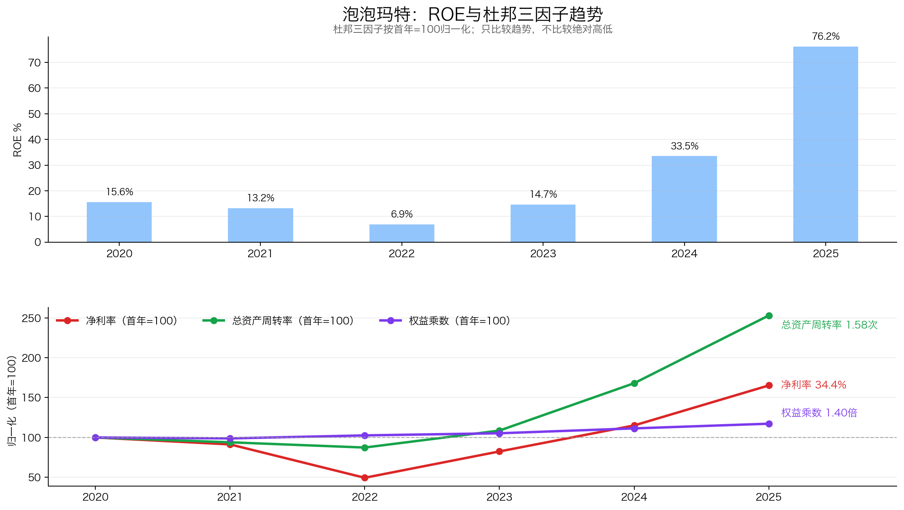
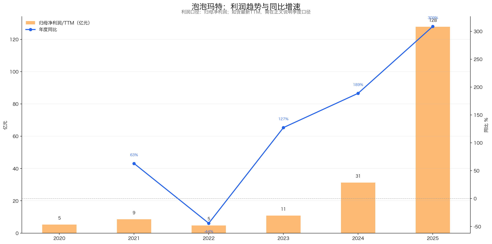
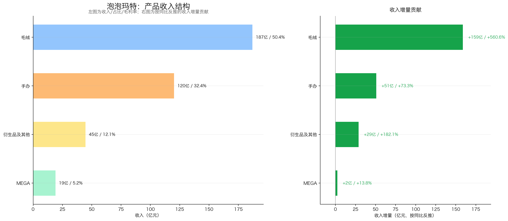
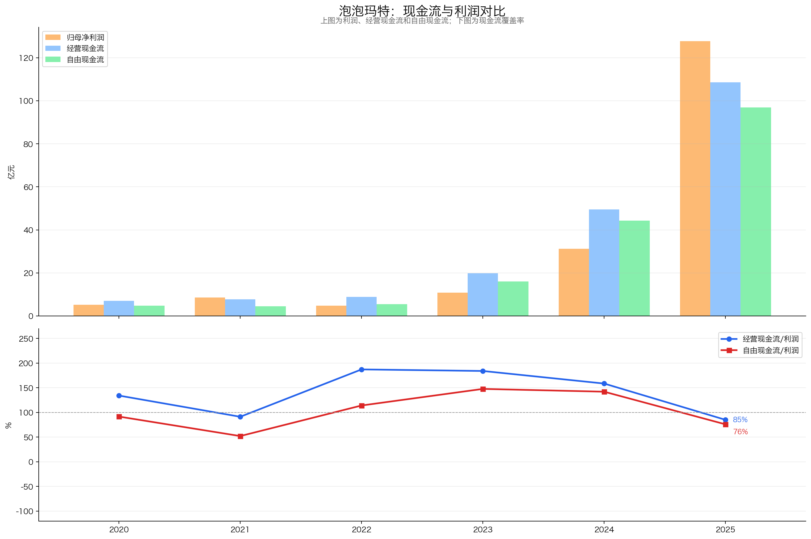
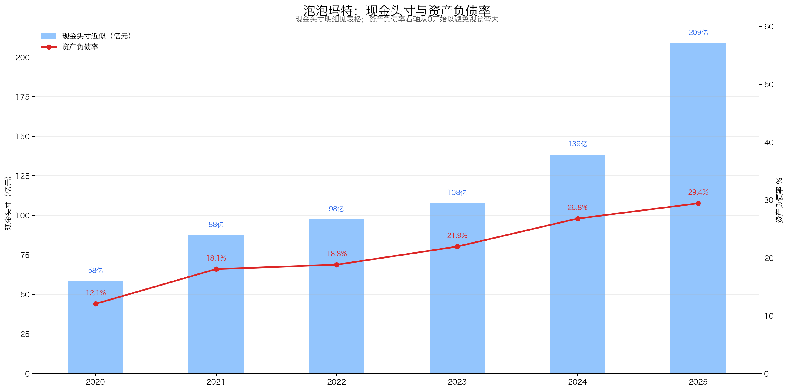
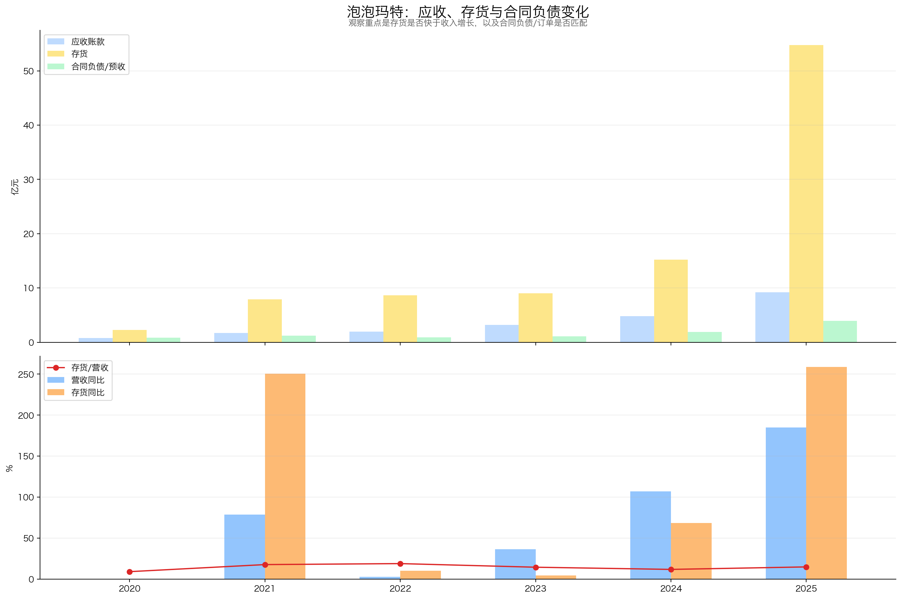
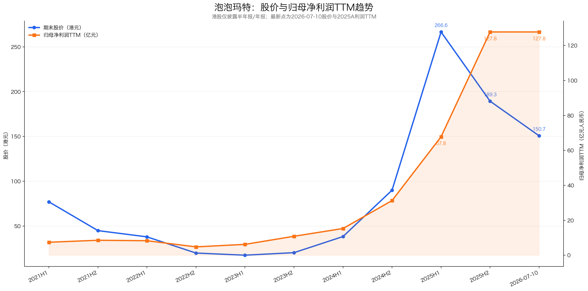
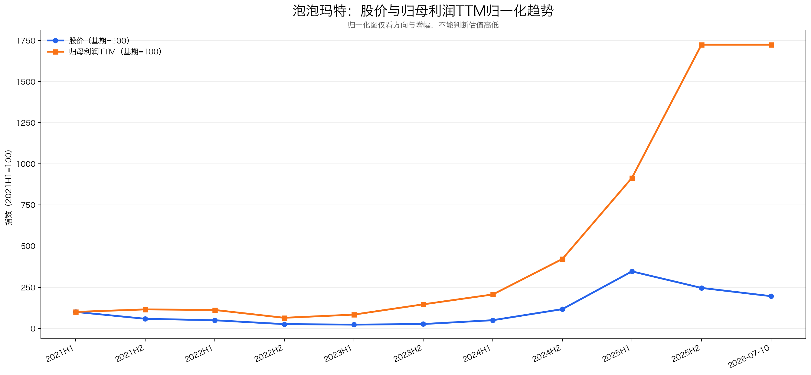
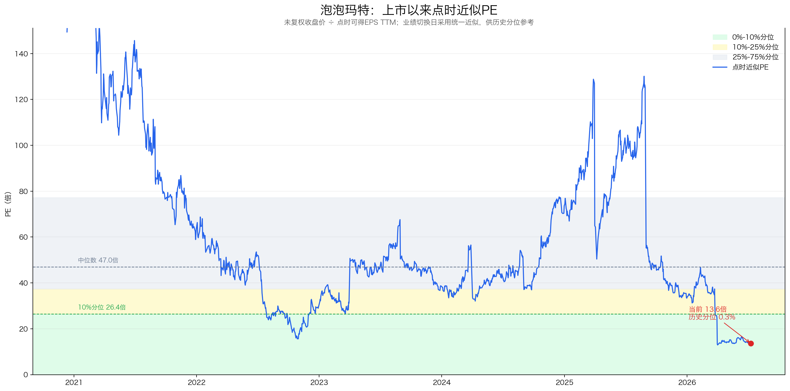

# 泡泡玛特（09992.HK）投资分析报告

> 结论先行：泡泡玛特已经从“中国盲盒零售商”升级为“全球IP运营平台”。2025年收入371.20亿元、归母净利润127.76亿元，2026Q1收入仍增长75%—80%，增长并非财务幻觉；但THE MONSTERS占收入38.1%、毛绒占50.4%，两个集中度风险高度重合于LABUBU。按2026-07-10收盘价150.70港元和港交所最新股本测算，2025A经调整PE约13.3倍、扣现金后约11.7倍，估值已经显著压缩。当前值得“关注”，但更适合分批观察并用2026年中报验证库存和多IP接力，而不是仅凭历史低PE一次性重仓。

数据日期：2026-07-13  
行情基准日：2026-07-10（最近完整交易日）  
股价：150.70港元  
已发行股份：13.3172亿股（截至2026-06-30）  
市值：约2,006.91亿港元，约1,739.77亿元人民币  
2025A归母净利润：127.76亿元  
2025A经调整净利润：130.84亿元  
2025A归母PE：约13.6倍  
2025A经调整PE：约13.3倍  
彼得林奇现金头寸：约208.91亿元人民币  
扣现金后经调整PE：约11.7倍  
评级：关注  
总分：75 / 100

重要口径说明：
- 公司为港股，财报列报币种为人民币，股价和市值为港元；估值按2026-07-10的CNY/HKD约1.15355折算，即HKD/CNY约0.86689。
- 港股没有A股“扣非净利润”的完全对应指标。报告以IFRS股东应占溢利为主线，同时参考公司披露的Non-IFRS经调整净利润。
- 泡泡玛特只披露半年报和年报，股价与利润图按半年度构造TTM，未伪造季度利润。2026年最新经营数据只有收入增速区间，没有利润金额。
- 彼得林奇现金头寸采用“现金及等价物+定期存款+按公允价值计入损益金融资产-长期有息债务”。租赁负债在保守口径单列，不混入主口径。
- 本报告不使用券商盈利预测。情景估值均为基于历史财务和压力假设的毛估估，不是盈利预测。

---

## 一、先判断能不能研究：公司画像 + 能力圈 + 红线

### 1.1 公司画像

泡泡玛特的生意可拆为四层：

| 层级 | 能力 | 商业本质 | 关键变量 |
|---|---|---|---|
| 第一层 | IP发现与运营 | 签约艺术家、孵化角色、内容和世界观运营 | 新IP成功率、老IP生命周期 |
| 第二层 | 产品开发 | 将IP变成毛绒、手办、MEGA及衍生品 | 上新速度、品类扩张、毛利率 |
| 第三层 | 全球DTC渠道 | 零售店、机器人商店、官网、APP、TikTok等 | 同店销售、会员复购、海外履约 |
| 第四层 | IP场景化 | POP LAND、popop、POP BAKERY及全球线下体验 | 变现效率、资本开支、品牌外溢 |

一句话：泡泡玛特不靠售卖盲盒盒子本身形成壁垒，而是靠“IP发现—设计—供应链—全球直营渠道—会员反馈”闭环持续商业化。

### 1.2 能力圈判断

能力圈：部分看懂，谨慎通过。

能看懂的部分：
- 收入、利润、毛利率、现金流、门店、会员和库存均可通过财报跟踪；
- 海外收入和渠道扩张已经形成实际财务结果；
- 自有产品占比、各IP收入、产品结构均有明确披露。

不容易看懂的部分：
- IP审美和流行文化具有较强非线性，无法仅靠财务模型预测下一个爆款；
- 二手市场价格、社交媒体热度与公司实际终端收入并非一一对应；
- LABUBU能否从全球时尚爆款沉淀为长期角色资产，需要时间验证。

### 1.3 红线检查

| 项目 | 判断 |
|---|---|
| 审计与财务治理 | 2020—2025均为标准无保留意见，未见重大红线 |
| 有息债务 | 无银行借款，资产负债表安全 |
| 现金流 | 2020—2024整体优秀；2025经营现金流低于利润，需观察 |
| 行业属性 | 非传统强周期，但存在爆款周期和情绪消费波动 |
| 单一产品/IP | THE MONSTERS和毛绒集中度同时升高，触发降级项 |
| 存货 | 2025存货增长259%，快于收入，触发重点观察项 |
| 治理结构 | 创始人持股高，但董事长与CEO未分设，触发观察项 |
| 价值陷阱 | 不是主业衰退型低PE，但可能是市场担忧利润高点型低PE |

初筛结论：谨慎通过。

后文必须验证的三个问题：
1. 2025年利润是否真实、有现金支持；
2. LABUBU之外是否形成多IP接力；
3. 低PE能否覆盖爆款降温和库存风险。

---

## 二、好行业：是不是好生意？

### 2.1 需求质量与非周期性

潮玩满足的是审美表达、情绪陪伴、收藏、社交传播和礼赠需求。它不是刚需，但具备低客单、强情绪价值和跨文化传播能力。

正面因素：
- 相比奢侈品，单件消费门槛低，用户覆盖更广；
- IP可以跨毛绒、手办、饰品、乐园和内容反复变现；
- 成人收藏和情绪消费弱化了传统玩具对儿童人口的单一依赖；
- 2025年泡泡玛特全球全部IP、全部品类销量超过4亿件，其中THE MONSTERS超过1亿件，需求已经达到全球大众消费规模。

限制因素：
- 消费可选属性强，宏观压力下购买频率可能下降；
- 热度具有潮流周期，爆款增长容易出现高基数；
- “稀缺感”和社交媒体传播可能放大短期需求，也可能加快退潮。

判断：长期需求存在，但稳定性低于食品、医疗和基础日用品，不能按传统必选消费复利股估值。

### 2.2 竞争格局

同行不存在完全可比口径。下表以2026-07-10收盘价和最新可得TTM财务做横向观察；日股和港股市值币种不同，不能直接按数字大小排序。

| 公司 | 市值 | TTM PE | 商业模式 | 与泡泡玛特的核心差异 |
|---|---:|---:|---|---|
| 泡泡玛特 | 约2,007亿港元 | 约13.7倍 | 设计师IP孵化、产品开发、全球直营零售 | IP和渠道一体化，爆款弹性高 |
| Sanrio | 约1.385万亿日元 | 约25.4倍 | 长生命周期角色授权、商品授权、主题乐园 | Hello Kitty等IP历史更长，授权模式更轻 |
| Bandai Namco | 约2.577万亿日元 | 约18.3倍 | 游戏、动漫、玩具、影视内容一体化 | 内容生态更深、品类和年龄层更宽 |
| 名创优品 | 约275亿港元 | 约11.7倍 | 全球零售网络、供应链、TOP TOY、授权商品 | 渠道强，但自有头部IP能力与泡泡玛特不同 |
| 布鲁可 | 约123亿港元 | 约16.9倍 | 拼搭角色玩具、动漫授权 | 以标准化拼搭体系为核心，产品形态不同 |

竞争结论：
- 潮玩制造和开店容易模仿，但持续发现IP、全球上新、形成会员复购和直营渠道反馈闭环并不容易；
- Sanrio证明优质角色可跨越数十年，但泡泡玛特尚未经历同样长的生命周期验证；
- Bandai Namco拥有更深的内容产业链；泡泡玛特胜在产品迭代速度、线下零售体验和全球社交传播效率；
- 名创优品/TOP TOY和布鲁可分别从渠道、拼搭品类切入，竞争会长期存在。

### 2.3 进入壁垒

| 壁垒 | 具体体现 | 稳固程度 |
|---|---|---|
| IP资源 | 艺术家合作、角色组合、历史运营经验 | 较强，但艺术家关系需持续维护 |
| 产品开发 | 将同一IP快速跨品类转化 | 较强 |
| 供应链 | 柔性生产、集中采购、快速补货 | 较强，但前五大供应商集中度63.5% |
| 全球渠道 | 630家零售店、官网/APP/TikTok等DTC渠道 | 较强且仍在增强 |
| 会员数据 | 中国内地会员7,258万，会员销售贡献93.7% | 较强 |
| 品牌心智 | 全球潮玩和LABUBU的高辨识度 | 当前很强，长期需验证 |

### 2.4 上下游议价权

- 上游：2025年前五大供应商占采购额63.5%，最大供应商占34.6%，集中度偏高；但公司规模扩大、核心供应商集中采购增强了议价能力。
- 下游：以直营和自营线上为主，直接触达消费者，弱化传统经销商分润；会员销售贡献率高，用户数据掌握在公司手中。
- 定价：2025毛利率升至72.1%，说明热销IP和海外直营渠道具有显著定价权；但高毛利率能否穿越热度周期仍需验证。

### 2.5 替代品威胁

用户预算可在潮玩、游戏、动漫周边、美妆、饰品、演唱会、卡牌及其他情绪消费之间切换。产品形式替代容易，但强角色资产本身不容易被一比一替代。

### 好行业评分

| 子项 | 得分 | 理由 |
|---|---:|---|
| 需求质量/非周期性 | 4 / 6 | 情绪价值需求长期存在，但可选消费和潮流周期明显 |
| 竞争格局 | 3 / 4 | 龙头优势突出，但全球角色和玩具巨头实力强 |
| 进入壁垒 | 3 / 4 | IP、产品、供应链、渠道闭环难复制，生命周期仍待验证 |
| 上下游议价权 | 2.5 / 3 | DTC和规模采购带来议价权，供应商集中度偏高 |
| 替代品威胁 | 1.5 / 3 | 强IP不易替代，但消费者娱乐预算迁移容易 |
| 小计 | 14 / 20 | 好生意，但不是低波动必选消费 |

---

## 三、好公司·定性：有没有长期复利能力？

### 3.1 护城河

泡泡玛特的护城河是系统能力，而不是盲盒专利。

1. IP发现：从MOLLY、DIMOO、SKULLPANDA到THE MONSTERS，已多次将艺术家角色商业化；
2. 产品化：能将IP从手办扩展到毛绒、MEGA、饰品及其他生活方式产品；
3. 全球DTC：海外线上和零售店直接触达消费者，不只是向经销商供货；
4. 数据闭环：会员、销售和上新反馈帮助公司判断补货与新品；
5. 规模效应：2025销售成本增速139.1%，慢于收入184.7%，费用率也显著摊薄。

护城河结论：较强，但最终强度取决于能否持续制造“多IP成功”，而不是只制造一个全球爆款。

### 3.2 复购与粘性

2025年中国内地注册会员由4,608万增至7,258万，新增2,650万；会员销售贡献率93.7%，会员复购率55.7%。

正面看：
- IP组合、隐藏款、系列化上新和跨品类提高复购；
- 全球线下门店提供体验和社交场景；
- 多IP可降低单个角色审美疲劳。

风险是：
- 收藏复购可能被黄牛、稀缺供给和热点放大；
- 热度退潮后，复购率和客单价可能同时回落；
- 会员数量不等于高质量活跃会员，需持续看复购率和单会员消费。

### 3.3 定价权

2025年毛利率从66.8%升至72.1%，经调整净利率从26.1%升至35.2%，体现了海外高毛利、爆款定价、供应链议价和费用摊薄。

定价权真实存在，但有条件：
- 对热销IP和限量产品强；
- 对普通产品和热度下降IP弱；
- 若通过频繁涨价、过度限量或黄牛溢价维持稀缺感，可能反噬用户体验。

### 3.4 管理层与治理

- 王宁为创始人、董事会主席兼CEO，负责整体战略规划及管理；
- 截至2025年末，王宁通过信托及受控法团被视为持有48.73%股份；
- COO司德被视为持有约0.77%，首席增长官文德一约0.10%；
- 董事会9人中有4名执行董事、2名非执行董事和3名独立非执行董事。

加分项：
- 创始人持股接近一半，利益绑定充分；
- 2010年以来持续深耕潮玩，战略专注；
- 无银行借款，未靠高杠杆并购制造增长；
- 全球化和毛绒品类扩张显示组织执行力强。

风险项：
- 王宁兼任董事长和CEO，不符合最佳治理实践；
- 控制权高度集中，关键人风险较高；
- 海外门店、乐园和新业态增加管理复杂度。

### 好公司·定性评分

| 子项 | 得分 | 理由 |
|---|---:|---|
| 护城河 | 6 / 7 | IP、产品、供应链和全球渠道闭环较强 |
| 复购/粘性 | 3.5 / 5 | 会员和复购数据较好，但热度驱动成分不低 |
| 定价权 | 4 / 5 | 毛利率和海外DTC证明定价权，周期稳定性待验证 |
| 管理层 | 2 / 3 | 创始人执行力和持股加分，主席CEO兼任扣分 |
| 小计 | 15.5 / 20 | 优秀创始人型公司，但关键人和IP周期风险存在 |

---

## 四、好公司·定量：利润是不是真，增长是否健康？

### 4.1 ROE质量与盈利模式

| 年份 | 营收 | 归母净利润 | 毛利率 | 净利率 | 总资产周转率 | 权益乘数 | 杜邦ROE |
|---|---:|---:|---:|---:|---:|---:|---:|
| 2020 | 25.13 | 5.24 | 63.4% | 20.8% | 0.63 | 1.20 | 15.6% |
| 2021 | 44.91 | 8.54 | 61.4% | 19.0% | 0.59 | 1.18 | 13.2% |
| 2022 | 46.17 | 4.76 | 57.5% | 10.3% | 0.55 | 1.23 | 6.9% |
| 2023 | 63.01 | 10.82 | 61.3% | 17.2% | 0.68 | 1.26 | 14.7% |
| 2024 | 130.38 | 31.25 | 66.8% | 24.0% | 1.05 | 1.33 | 33.5% |
| 2025 | 371.20 | 127.76 | 72.1% | 34.4% | 1.58 | 1.40 | 76.2% |

口径：归母ROE=归母净利率×总资产周转率×权益乘数，总资产和权益使用期初期末平均值。同花顺显示的2025年ROE 57.35%接近期末权益口径，不能与本表平均权益杜邦ROE直接比较。

结论：2024—2025年ROE跃升主要来自净利率和资产周转率，不是财务杠杆。结构健康，但76.2%包含爆款和高周转周期高点，不宜外推为长期ROE。

### 4.2 利润增长来源与持续性

| 年度 | 收入 | 同比 | 归母净利润 | 经调整净利润 | 经调整净利率 |
|---|---:|---:|---:|---:|---:|
| 2020 | 25.13 | +49.3% | 5.24 | 5.91 | 23.5% |
| 2021 | 44.91 | +78.7% | 8.54 | 10.02 | 22.3% |
| 2022 | 46.17 | +2.8% | 4.76 | 5.74 | 12.4% |
| 2023 | 63.01 | +36.5% | 10.82 | 11.91 | 18.9% |
| 2024 | 130.38 | +106.9% | 31.25 | 34.03 | 26.1% |
| 2025 | 371.20 | +184.7% | 127.76 | 130.84 | 35.2% |

2020—2025五年CAGR：收入71.3%、归母净利润89.5%、经调整净利润85.8%。2022是低基数，历史CAGR不能直接当成未来增速。

利润增长来自三层：
1. 收入扩张：THE MONSTERS、毛绒及海外渠道爆发；
2. 毛利率提升：海外高毛利、柔性供应链、集中采购和供应商议价；
3. 费用率摊薄：销售费用率由28.0%降至21.8%，管理费用率由7.3%降至4.8%。

2026Q1收入仍同比增长75%—80%，说明增长尚未断崖；但公司未披露Q1利润金额，不能据收入增速自行推算利润。

### 4.3 产品结构与增长来源

#### 按产品类别

| 品类 | 2024收入/占比 | 2025收入/占比 | 同比 | 2025增量贡献 |
|---|---:|---:|---:|---:|
| 毛绒 | 28.32 / 21.7% | 187.08 / 50.4% | +560.6% | 158.76亿元 |
| 手办 | 69.36 / 53.2% | 120.23 / 32.4% | +73.3% | 50.87亿元 |
| MEGA | 16.84 / 12.9% | 19.16 / 5.2% | +13.8% | 2.32亿元 |
| 衍生品及其他 | 15.86 / 12.2% | 44.73 / 12.0% | +182.1% | 28.87亿元 |

毛绒贡献公司2025年总收入增量约66%，成为第一大品类。手办仍增长73.3%，说明传统基本盘没有萎缩。

#### 按IP

| IP | 2025收入 | 占比 | 判断 |
|---|---:|---:|---|
| THE MONSTERS | 141.61 | 38.1% | 绝对核心，集中度风险最大 |
| SKULLPANDA | 35.40 | 9.5% | 第二梯队头部 |
| CRYBABY | 29.29 | 7.9% | 新增长IP |
| MOLLY | 28.97 | 7.8% | 收入仍增长，占比被动下降 |
| DIMOO | 27.77 | 7.5% | 同比增长约205% |
| 星星人 | 20.56 | 5.5% | 低基数快速放量 |
| HIRONO | 17.35 | 4.7% | 第二梯队扩张 |

前五大IP合计约70.8%。THE MONSTERS占比由2023年的5.8%升至2024年的23.3%、2025年的38.1%。

结论：公司不是只有一个IP，但2025年增量高度依赖“THE MONSTERS×毛绒”。真正需要验证的是LABUBU流量能否带动其他IP复购，而不是LABUBU还能保持几倍增长。

### 4.4 现金流质量

| 年份 | 归母净利润 | 经营现金流 | 资本开支 | 自由现金流 | CFO/利润 | FCF/利润 |
|---|---:|---:|---:|---:|---:|---:|
| 2020 | 5.24 | 7.03 | 2.24 | 4.80 | 134% | 92% |
| 2021 | 8.54 | 7.79 | 3.34 | 4.45 | 91% | 52% |
| 2022 | 4.76 | 8.91 | 3.48 | 5.43 | 187% | 114% |
| 2023 | 10.82 | 19.91 | 3.92 | 15.98 | 184% | 148% |
| 2024 | 31.25 | 49.54 | 5.17 | 44.38 | 159% | 142% |
| 2025 | 127.76 | 108.65 | 11.72 | 96.94 | 85% | 76% |

自由现金流=经营现金流-购买物业、厂房设备及无形资产。

结论：2020—2024现金利润质量优秀；2025现金流仍大幅增长，但覆盖率下降，主要因为存货现金占用约39.32亿元和资本开支上升。暂不是利润造假信号，却说明全球扩张开始消耗营运资本。

### 4.5 资产负债与现金头寸

| 年末 | 现金及等价物 | 定期存款 | FVPL金融资产 | 彼得林奇现金头寸 | 资产负债率 |
|---|---:|---:|---:|---:|---:|
| 2020 | 56.80 | 0 | 1.69 | 58.49 | 12.1% |
| 2021 | 52.65 | 0 | 34.92 | 87.57 | 18.1% |
| 2022 | 6.85 | 43.56 | 47.19 | 97.60 | 18.8% |
| 2023 | 20.78 | 38.85 | 48.02 | 107.65 | 22.0% |
| 2024 | 61.09 | 35.11 | 42.33 | 138.53 | 26.8% |
| 2025 | 137.75 | 34.50 | 36.66 | 208.91 | 29.4% |

2025年无银行借款。非流动负债增长主要来自全球门店扩张形成的长期租赁负债约22.75亿元，不是传统银行债务。

估值安全垫：
- 现金头寸约208.91亿元，占当前人民币市值约12.0%；
- 每股现金头寸约15.69元人民币，约18.10港元；
- 扣现金后经调整PE约11.7倍；
- 若保守扣除全部租赁负债，扣现金后经调整PE约11.9倍。

结论：资产负债表很安全，但现金占市值比例不是压倒性高；投资回报仍主要取决于利润可持续性，而不是清算价值。

### 4.6 营运质量：应收、存货与合同负债

| 年份 | 营收 | 贸易应收 | 存货 | 合同负债 | 应收周转天数 | 存货周转天数 |
|---|---:|---:|---:|---:|---:|---:|
| 2020 | 25.13 | 0.78 | 2.25 | 0.84 | 9 | 78 |
| 2021 | 44.91 | 1.71 | 7.89 | 1.20 | 10 | 128 |
| 2022 | 46.17 | 1.94 | 8.67 | 0.89 | 15 | 156 |
| 2023 | 63.01 | 3.21 | 9.05 | 1.12 | 15 | 133 |
| 2024 | 130.38 | 4.78 | 15.25 | 1.89 | 11 | 102 |
| 2025 | 371.20 | 9.21 | 54.73 | 3.93 | 7 | 123 |

判断：
- 应收增长92.8%，明显慢于收入，周转天数降至7天，回款健康；
- 合同负债增长108.5%，说明预收和未履约订单增长，但慢于收入；
- 存货增长约259%，快于收入184.7%，周转天数由102天反弹至123天；
- 公司解释为海外占比提高、运输时间延长及全球门店净增109家，逻辑合理；
- 2025年存货减值准备约0.53亿元、拨备比例不足1%，若热度下降，减值敏感性较高。

库存是当前最重要的前瞻风险指标。

### 好公司·定量评分

| 子项 | 得分 | 理由 |
|---|---:|---|
| ROE质量与盈利模式 | 8 / 9 | 净利率和周转驱动，非杠杆驱动；高点持续性扣分 |
| 利润增长与持续性 | 5 / 7 | 增长真实且2026Q1仍强，但爆款和高基数风险明显 |
| 现金流质量 | 5.5 / 7 | 长期优秀，2025营运资本占用增加 |
| 现金头寸与资产负债表 | 6 / 6 | 无银行借款、现金头寸厚 |
| 营运质量 | 3 / 5 | 应收健康，但库存增速和周转恶化需重点跟踪 |
| 产品结构与增长来源 | 4 / 6 | 多IP基础存在，但THE MONSTERS×毛绒集中度高 |
| 小计 | 31.5 / 40 | 公司质量高，主要扣分项是集中度与库存 |

---

## 五、好时机：现在买贵不贵？

### 5.1 股价与利润线

图只比较趋势方向和增幅，不比较左右轴绝对位置。

阶段复盘：
- 2021—2022：股价和利润同步下行，市场消化上市高估值及经营低谷；
- 2023：利润修复，但股价仍低位，估值继续出清；
- 2024H2—2025H1：利润爆发，股价提前大幅反映LABUBU全球化；
- 2025H2：归母利润TTM继续升至127.76亿元，但股价从2025年中266.60港元降至年末189.30港元；
- 2026-07-10：股价进一步降至150.70港元，市场开始交易“增长见顶和利润可持续性”，而不是当期利润方向。

辅助图：

归一化图显示2021H1以来利润增幅远高于股价增幅，但受基期估值影响，只能作为趋势辅助，不能据此直接判断低估。

### 5.2 PE及历史百分位

| 指标 | 数值 | 判断 |
|---|---:|---|
| 当前股价 | 150.70港元 | 2026-07-10收盘 |
| 官方最新股本 | 13.3172亿股 | 港交所2026年6月月报 |
| 市值 | 2,006.91亿港元/1,739.77亿元人民币 | 同日汇率折算 |
| 2025A归母PE | 13.6倍 | 偏低 |
| 2025A经调整PE | 13.3倍 | 偏低 |
| 扣现金后经调整PE | 11.7倍 | 有吸引力 |
| 上市以来10%分位 | 26.4倍 | 点时近似 |
| 上市以来中位数 | 47.0倍 | 含上市早期高估值 |
| 当前历史分位 | 约0.3% | 接近上市以来最低区间 |
| 52周高/低 | 339.80/140.10港元 | 当前接近低位 |

历史PE采用未复权收盘价和点时可得EPS TTM。年报与中报生效日使用统一近似，适合看区间，不代表精确到每个交易日的数据库估值。

估值结论：当前估值确实低，但历史中位数不能直接当合理价值。公司上市早期PE很高，且2025利润包含爆款高点；真正的安全边际取决于稳态利润是否能维持在100亿元以上。

### 5.3 PEG

按框架的三年口径，2022—2025经调整净利润从5.74亿元升至130.84亿元，三年CAGR约183.5%，对应历史PEG约0.07。

这个数字几乎没有可操作意义，原因是：
- 2022是经营低谷；
- 2025是超级爆款和全球渠道共振高点；
- 增速远高于30%时，PEG对增长假设极度敏感。

判断：PEG表面极低，只能说明历史利润增速远超估值，不能证明未来低风险。

### 5.4 股息率

2025年度末期股息为每股2.3817元人民币：
- 按2025基本EPS 9.61元计算，派息率约24.8%；
- 按2026-07-10股价和汇率计算，末期股息率约1.82%；
- 公司股息政策为在董事酌情决定下，年度派息原则上不少于可分派净利润的20%。

泡泡玛特不是高股息标的，股息只是补充，主要回报仍来自利润增长和估值变化。

### 5.5 市场信号与预期差

市场可能低估的：
- 2026Q1收入仍增长75%—80%，基本面并未断崖；
- 海外收入占43.8%，公司已不是单一中国潮玩零售商；
- 除THE MONSTERS外，多个IP已达到17亿—35亿元收入；
- 现金头寸209亿元、无银行借款，能够穿越短期波动；
- 当前PE已低于Sanrio、Bandai Namco和布鲁可。

市场担心也合理：
- 2025年利润可能处于爆款周期高点；
- LABUBU同时主导第一IP和第一品类；
- 存货增长快于收入，现金转化率下降；
- 海外开店推高租赁负债、物流和组织复杂度；
- 72.1%毛利率和35.2%经调整净利率可能均值回归。

### 5.6 毛估估

方法：稳态经调整利润×合理PE+折价现金头寸。全部为自主情景假设，不使用券商预测。

| 情景 | 核心假设 | 稳态利润 | PE | 计入现金 | 对应价值 | 对应每股 | 相对当前 |
|---|---|---:|---:|---:|---:|---:|---:|
| 压力档 | 爆款退潮、库存减值、利润降至2025年的约63% | 80亿元 | 10倍 | 100亿元 | 900亿元人民币 | 约78港元 | -48% |
| 保守档 | 利润回撤约30%，毛利率和费用率回归 | 90亿元 | 12倍 | 150亿元 | 1,230亿元人民币 | 约107港元 | -29% |
| 中性档 | 多IP接力，利润高于2025但增速正常化 | 150亿元 | 18倍 | 180亿元 | 2,880亿元人民币 | 约249港元 | +66% |
| 乐观档 | 全球IP平台持续兑现，第二梯队显著放量 | 180亿元 | 25倍 | 208.91亿元 | 4,708.91亿元人民币 | 约408港元 | +171% |

毛估估结论：赔率不差，但尾部风险不小。当前价格低于中性价值较多，却没有低到能够完全覆盖利润回撤至80亿—90亿元的压力。仓位纪律比“精确目标价”更重要。

### 好时机评分

| 子项 | 得分 | 理由 |
|---|---:|---|
| 股价vs利润线 | 3.5 / 5 | 股价大幅回撤、利润仍高，但市场担忧高点有依据 |
| PE及PE百分位 | 5 / 5 | 当前PE和扣现金后PE处于上市以来极低区间 |
| PEG | 1 / 2 | 表面极低，但低基数和爆款使参考价值下降 |
| 股息率 | 1 / 3 | 派息率尚可，股息率不高 |
| 市场信号与预期差 | 1.5 / 2 | 2026Q1增长、海外和多IP可能被低估 |
| 毛估估 | 2 / 3 | 中性上行明显，压力档仍有较大下行 |
| 小计 | 14 / 20 | 价格有吸引力，但不是无风险捡漏 |

---

## 六、投资结论：值不值得下注，拿不拿得住？

### 6.1 商业模式好不好（Right Business）

#### 6.1.1 业务简单可持续、不易被替代

IP开发、商品销售和全球直营渠道的商业模式容易理解，情绪消费和收藏需求长期存在；但潮流变化快，单个IP和产品容易被替代，当前THE MONSTERS与毛绒的集中度使持续性仍需验证。

#### 6.1.2 竞争格局清晰、护城河深厚、有定价权

泡泡玛特部分符合。自有IP矩阵、供应链、会员、全球DTC和品牌心智已形成平台雏形，热门IP具有较强溢价能力；但潮玩竞争格局仍在变化，LABUBU的成功不能自动证明所有IP都具备同等护城河和定价权。

#### 6.1.3 轻资本投入、高资产回报率、自由现金流好

IP主业相对轻资产，公司高毛利、净现金充足且无银行借款，资本回报较好；但海外门店、乐园、供应链和存货占用正在增加。存货增速高于收入时，账面利润能否持续转化为现金必须继续验证。

#### 6.1.4 有长期增长空间

海外收入、毛绒品类和多IP运营提供较大空间，2026Q1收入仍高速增长；真正的长期增长不只取决于LABUBU热度，而在于能否把全球流量沉淀为多IP复购，并让非THE MONSTERS业务接棒。

### 6.2 管理层怎么样（Right People）：执行力强，但治理和扩张纪律需跟踪

创始团队在IP商业化、渠道和全球扩张上执行力突出，持股也与股东利益较一致；但权力集中、海外门店加速和乐园投入提高了治理与资本配置风险，需要用库存、现金流和新IP成功率持续验证。

### 6.3 是不是好价格（Right Price）：估值有吸引力，但利润分母可能在高点

当前2025年经调整PE约13.3倍、扣现金后约11.7倍，估值明显压缩；但2025利润高度受益于LABUBU、毛绒和全球渠道共振。若稳态利润回落，低PE可能失真，适合分批、验证和动态调整。

### 6.4 胜率与赔率

**胜率**

胜率：中等偏高。

胜率来源：
- 已形成IP、产品、供应链、全球DTC和会员闭环；
- 海外收入和多个第二梯队IP均已形成实际规模；
- 净利率和周转率驱动ROE，不靠高杠杆；
- 现金头寸厚，无银行借款；
- 2026Q1收入仍保持75%—80%增长；
- 当前估值已反映较多增长下修。

胜率折扣：
- THE MONSTERS和毛绒风险高度重合；
- 潮流IP生命周期比食品品牌更难预测；
- 存货增长快于收入，拨备比例低；
- 创始人权力集中，海外扩张增加复杂度。

**赔率**

赔率：较好，但并非极端安全。

当前2025A经调整PE约13.3倍，扣现金后约11.7倍。如果利润能够维持130亿元附近，即使未来只保持低双位数增长，估值也有修复空间。但若2025是利润高点、稳态利润回落至80亿—90亿元，当前价格仍可能下跌约30%—50%。

### 6.5 长期持有检查项

| 检查项 | 判断 |
|---|---|
| 长期需求是否存在 | 是，情绪消费、收藏和IP衍生需求长期存在 |
| 护城河是否增强 | 是，全球渠道、会员和多品类闭环正在增强 |
| 是否依赖单一爆款 | 当前是，THE MONSTERS占38.1% |
| 是否不需要持续高资本投入 | 主业较轻，但海外门店和乐园投入增加 |
| 不靠PE扩张能否赚钱 | 可以，前提是利润不明显回撤 |
| 能否“买完不用看” | 不能，必须跟踪IP和库存 |

### 6.6 评级与行动

**最终判断：泡泡玛特已具备全球IP平台雏形、资本回报和成长空间较好，但单IP替代风险与利润可持续性仍是核心变量；当前价格值得关注，不宜把爆款高点利润当作永续利润。**

总分：75 / 100  
评级：关注

行动建议：
- 未持有：适合分批建立观察仓，避免以单一价格重仓；
- 已持有：重点用2026年中报的利润、存货、经营现金流和非THE MONSTERS增速决定加减仓；
- 加仓条件：股价低位、利润维持、存货增速降至收入增速以下、第二梯队IP继续放量；
- 降仓条件：股价反弹至25—30倍PE但利润没有上修，或库存和现金流明显恶化。

---

## 七、投资逻辑与证伪条件

### 7.1 投资逻辑

1. 泡泡玛特已经从盲盒零售商升级为全球IP运营平台，海外收入占43.8%；
2. 2025利润增长有收入、毛利率、费用率和现金流共同支持，不是低质量财务利润；
3. 2026Q1收入仍增长75%—80%，市场对增长骤停的担忧可能过度；
4. THE MONSTERS之外已有多个17亿—35亿元级IP，多IP接力存在基础；
5. 现金头寸约209亿元、无银行借款，资产负债表提供下限；
6. 当前约13倍PE、扣现金约12倍PE，已经显著降低对未来增速的要求。

### 7.2 证伪条件

出现以下情况，应重新评估甚至退出：

1. THE MONSTERS连续两个披露期同比下滑，同时其他IP不能补位；
2. 非THE MONSTERS艺术家IP合计增速显著低于总收入，流量外溢失败；
3. 毛绒占比继续超过55%，产品集中度进一步升高；
4. 存货持续快于收入增长，存货周转天数超过150天；
5. 出现持续折扣清货或存货减值明显增加；
6. 经营现金流/归母净利润连续两年低于0.8倍；
7. 毛利率跌破65%或经调整净利率跌破25%，且不是短期区域结构变化；
8. 海外新增门店无法覆盖租金、物流和人员成本；
9. 核心IP依赖黄牛溢价、过度限量或渠道缺货维持需求；
10. 王宁或核心管理层大比例减持，或发生重大关联交易、非主业并购；
11. 股价重新达到25—30倍以上PE，但多IP、利润和库存没有同步改善。

### 7.3 下一份财报重点看什么

| 指标 | 2025基准 | 健康信号 | 风险信号 |
|---|---:|---|---|
| THE MONSTERS占比 | 38.1% | 占比稳定/下降但总收入增长 | 超过40%且其他IP放缓 |
| 非THE MONSTERS IP | 多个17亿—35亿元 | 合计保持较快增长 | 明显低于总收入增速 |
| 存货 | 54.73亿元 | 增速低于收入、周转下降 | 增速继续快于收入 |
| 存货周转 | 123天 | 回落至110天附近 | 升至150天以上 |
| CFO/归母利润 | 0.85倍 | 恢复至1倍以上 | 继续低于0.8倍 |
| 毛利率 | 72.1% | 维持68%以上 | 跌破65% |
| 经调整净利率 | 35.2% | 维持30%左右 | 跌破25% |
| 海外收入占比 | 43.8% | 增长且费用率受控 | 开店增长但现金流恶化 |

---

## 八、维度打分汇总

| 模块 | 得分 | 满分 |
|---|---:|---:|
| 好行业 | 14.0 | 20 |
| 好公司·定性 | 15.5 | 20 |
| 好公司·定量 | 31.5 | 40 |
| 好时机 | 14.0 | 20 |
| 总分 | 75.0 | 100 |

评级：关注。

分数解释：公司质量、财务安全和当前估值均明显加分；THE MONSTERS×毛绒集中度、存货增长、爆款周期和治理集中度使其难以进入80分以上的“强烈关注”。

---

## 九、数据校验结果

### 正确

1. 2020—2025收入、归母净利润、经调整净利润、毛利率：已与各年度年报及同花顺Excel交叉验证。
2. CAGR年数：2020→2025为5年；2022→2025为3年，标注正确。
3. 经营现金流、资本开支、自由现金流：已逐年回查对应年报现金流量表。
4. ROE：正文明确采用期初期末平均资产和权益的杜邦口径；未与同花顺期末权益ROE混用。
5. 现金头寸：现金、定期存款和FVPL金融资产已逐年查年报；未把应收或其他流动资产整体计入。
6. 应收、存货、合同负债及周转天数：已与年报核对。
7. 产品结构、IP结构、区域结构、门店数据：以2025年报管理层讨论与分析为准。
8. 2026Q1收入增速：以2026-05-12港交所经营更新为准，未自行推算利润。
9. 当前股本：以港交所2026年6月证券变动月报表13.3172315亿股为准，不使用Yahoo过时股本。
10. 当前股价：2026-07-10完整交易日收盘150.70港元。
11. PE、扣现金PE、股息率和情景估值：已统一使用同日汇率和官方股本重新计算。
12. 评分：14+15.5+31.5+14=75，评级与70—80分“关注”档一致。
13. 图表：9张PNG均已生成并完成视觉检查，正文引用路径存在。

### 需持续验证

1. 2026年中期利润、经调整利润和经营现金流尚未披露。
2. 2026年存货去化和存货拨备是否充分尚待中报验证。
3. 各IP在2026年的收入结构尚未披露，无法判断THE MONSTERS占比是否进一步提高。
4. 行业市场规模公开资料多为咨询机构预测，本报告未将预测值当作实际市场规模。
5. 同业PE来自最新可得TTM口径，各公司财年、会计口径和业务结构不同，只作估值参照，不作机械排名。

---

## 十、主要数据来源

1. 泡泡玛特2025年年度业绩公告，2026-03-25：  
   https://www1.hkexnews.hk/listedco/listconews/sehk/2026/0325/2026032500285.pdf
2. 泡泡玛特2025年年报，2026-04-21：  
   https://www1.hkexnews.hk/listedco/listconews/sehk/2026/0421/2026042100394.pdf
3. 泡泡玛特2026年第一季度经营更新，2026-05-12：  
   https://www1.hkexnews.hk/listedco/listconews/sehk/2026/0512/2026051200579.pdf
4. 泡泡玛特2025年销量业务更新，2026-02-09：  
   https://www1.hkexnews.hk/listedco/listconews/sehk/2026/0209/2026020901220.pdf
5. 泡泡玛特截至2026年6月证券变动月报表，2026-07-02：  
   https://www1.hkexnews.hk/listedco/listconews/sehk/2026/0702/2026070201766.pdf
6. 2020—2024年报：公司研究包 `年报/` 目录中的PDF和文本提取文件。
7. 同花顺主要指标：`data/HK9992_keyindex_report.xls`。
8. 历史股价、汇率及同业行情：Yahoo Finance/yfinance，查询基准日2026-07-10。

---

免责声明：本报告仅供研究与学习，不构成投资建议。潮流IP、海外扩张和市场估值均具有较大不确定性，实际投资需结合个人风险承受能力和仓位管理。
