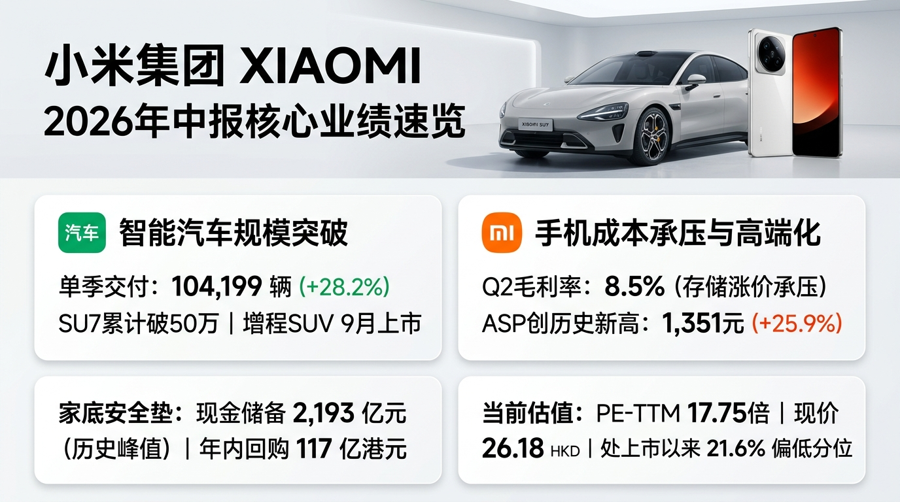
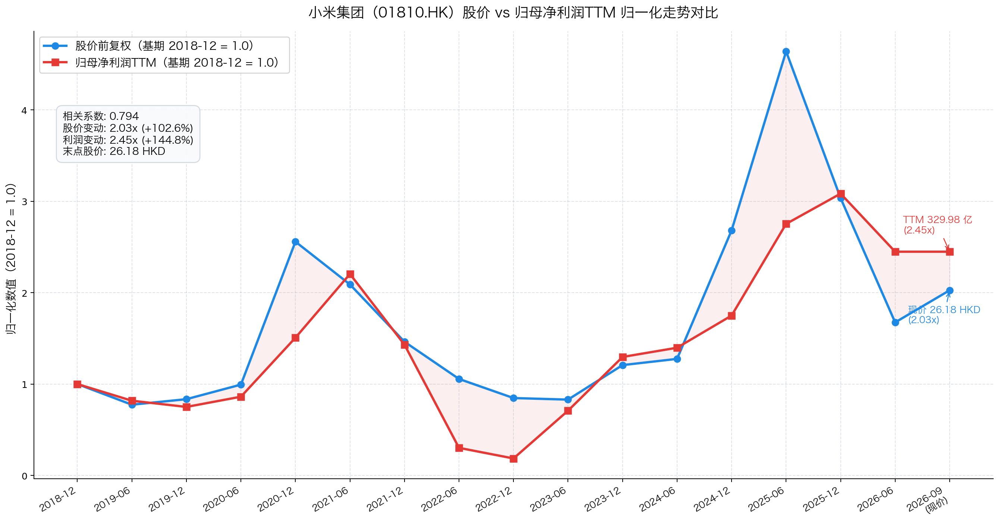

# 小米集团（01810.HK）2026年中报财报速览——车机双轮承压与分化：汽车破10万交付，存储成本挤压手机毛利

> 报告期：2026 年 1—6 月（含第二季度）｜披露日：2026 年 8 月 18 日｜未经审计。数据源：公司《截至2026年6月30日止三個月及六個月之業績公告》（港交所披露易初步公告，46页）。市值、PE、PB 按 2026 年 9 月 17 日收盘实测。

## 一句话结论

**汽车单季交付首破 10 万辆（+28.2%）且增程 SUV 蓄势待发，但存储等核心器件成本暴涨重创手机毛利（跌至 8.5%），叠加研发高投入致整体归母净利下滑 37.9%。**

当前现价 26.18 港元，PE-TTM 17.75 倍处上市以来 21.61% 历史偏低分位。股价较高点腰斩已较大程度释放利空，2193 亿现金储备构筑深厚防守底气。

## 主要指标速览

| 指标 | 2026H1 | 2025H1 | 同比变动 | 2026Q2单季 |
|------|--------|--------|----------|-----------|
| 营业收入 | 2080.63 亿 | 2272.49 亿 | -8.4% | 1089.22 亿（-6.1%） |
| 归母净利润 | 141.86 亿 | 228.29 亿 | -37.9% | 94.62 亿（-20.5%） |
| 经调整净利润（Non-IFRS）① | 122.91 亿 | 215.06 亿 | -42.8% | 62.19 亿（-42.6%） |
| 整体毛利率 | 20.87% | 22.67% | -1.80pct | 19.84%（-2.67pct） |
| 经营活动现金流净额② | 20.50 亿 | 280.55 亿 | -92.7% | 38.42 亿（环比转正，调后112亿） |
| 广义净现金（现金储备）③ | 1800.23 亿 | 1342.30 亿 | +34.1% | 现金储备 2193 亿 vs 借款 393 亿 |
| 智能汽车创新业务收入（特色）④ | 447.60 亿 | 398.43 亿 | +12.3% | 248.96 亿（交付 104,199 辆） |
| 智能手机平均售价（ASP）（特色）⑤ | 未单独披露 | 未单独披露 | — | 1351.0 元（同比 +25.9% 创新高） |
| 股东回报（年内回购）⑥ | 年内约 117 亿港元 | 约 38 亿港元 | +207.9% | 截至8月中旬回购3.775亿股超去年全年 |
| PE(TTM)⑦ | 17.75 倍 | — | — | 上市以来 21.61% 分位 |
| PB(MRQ)⑦ | 2.18 倍 | — | — | 上市以来 27.3% 分位 |

> ①经调整净利润（通俗说：剔除股权激励和投资公允价值等非经营波动的实际业务利润），口径见公告 P25。  
> ②取自简明合并现金流量表主表（P34）及季度现金流量表（P27）。Q2单季由一季度的 -17.92 亿显著转正至 38.42 亿元；扣除金融保理影响后 Q2 经营现金流为 112 亿元（P27）。  
> ③广义净现金 = 官方口径现金储备 2,193 亿元（含现金等价物 373 亿、定存 1282 亿、受限现金 41 亿、短投 215 亿等，P26）− 借款总额 392.77 亿元（P28）= 1800.23 亿元。  
> ④包含智能电动汽车交付、售后配件及 Xiaomi MiMo 大模型等 AI 创新业务收入（P6、P36）。  
> ⑤ASP 取自管理层讨论原文（P10、P18）。公司未单独披露半年度综合 ASP（出货量加权后上半年估算约 1329.7 元）；Q2 单季 ASP 达 1351.0 元创历史新高，3000元以上高端机销量占比提升至 32.1%。  
> ⑥半年度惯例不派中期股息；2026 年 5 月采纳新一期上限 200 亿港元回购计划，截至8月13日最后可行日已执行约 117 亿港元（上半年内执行 109.62 亿港元，P4、P44）。  
> ⑦市值与估值按 2026 年 9 月 17 日收盘实测（收盘价 26.18 港元，总市值 6743.84 亿港元，实时汇率 1 HKD = 0.855 CNY 折算为 5765.98 亿人民币，滚动 TTM 净利润为 330.00 亿元）。

---

## 一、它赚不赚钱？——利润表

上半年实现营业收入 2080.63 亿元，同比下降 8.4%。归母净利润 141.86 亿元，同比下降 37.9%。

经调整净利润 122.91 亿元，同比下降 42.8%。二季度单季降幅收窄至 -20.5%，业绩呈现企稳迹象。

### 业务拆解：汽车放量，手机与 IoT 承压

| 业务分部 | 2026H1收入 | 收入占比 | 同比增速 | 毛利率 | 毛利率同比 |
|----------|-----------|----------|----------|--------|-----------|
| **智能手机** | 863.92 亿 | 41.5% | -10.1% | 9.35% | -2.62pct |
| **IoT与生活消费产品** | 559.59 亿 | 26.9% | -21.2% | 22.32% | -1.44pct |
| **互联网服务** | 185.12 亿 | 8.9% | +1.9% | 76.43% | +0.29pct |
| 其他相关业务（手机×AIoT） | 24.40 亿 | 1.2% | +19.1% | -3.23% | +27.82pct |
| **手机×AIoT 小计** | **1633.03 亿** | **78.5%** | **-12.9%** | **21.21%** | **-0.98pct** |
| **智能电动汽车及AI创新业务** | **447.60 亿** | **21.5%** | **+12.3%** | **19.63%** | **-5.28pct** |
| **合计** | **2080.63 亿** | **100%** | **-8.4%** | **20.87%** | **-1.80pct** |

智能手机受全球大盘走弱与零部件涨价挤压。上半年出货量同比回落，二季度毛利率骤降至 8.55%（P13）。

但高端化成效扎实。二季度手机 ASP 跃升 25.9% 达 1351 元（P10），3000 元以上机型占比提升至 32.1%。

汽车业务交付破纪录。二季度交付 104,199 辆（+28.2%），上半年汽车及创新收入达 447.60 亿元。

汽车毛利率阶段性承压。二季度汽车毛利率降至 19.2%（P14），主因 SU7 Ultra 占比减少与物料成本扰动。

汽车创新分部二季度经营亏损 26 亿元（P6），仍处前期研发与基础设施重投入期。

IoT 业务受国补退坡影响明显。国内家电消费动销放缓，但海外平板与穿戴出货量对冲了部分下滑。

互联网服务稳坐盈利压舱石。毛利率高达 76.43%，贡献毛利 141.48 亿元，超集团总毛利的三成。

### 利润拆解：三道减法吃掉经营利润

第一道减法：毛利缩水 80.88 亿元。手机与汽车零部件成本上涨，拉低整体毛利率 1.8 个百分点。

第二道减法：研发投入逆势大增 37.11 亿元。上半年研发达 181.86 亿元（+25.6%），集中于 AI 与汽车架构。

第三道减法：渠道拓展与新零售费用增加 19.47 亿元。销售费用达 169.25 亿元，推高整体经营开支。

三项叠加，经营利润由去年同期的 265.62 亿元降至 161.83 亿元（-39.1%，P30）。

境外业务贡献扩张。海外收入占比提升 4.9 个百分点至 37.9%（788.24 亿元，P37），有效抵御单一市场波动。

---

## 二、赚到的钱到手了吗？——现金流量表

上半年经营活动所得现金净额为 20.50 亿元（P34），较去年同期的 280.55 亿元显著收窄。

现金流大幅下滑并非业务停摆。主因有三项结构性资金占用：

第一是战略性主动备料。二季度单季存货增加占用营运资金约 95 亿元（P27，上半年存货账面净增加额为 38.93 亿元），主要是提前锁定核心原材料。

第二是非现金收益调减。上半年公允价值变动产生 73.06 亿元账面收益，在现金流量表中全额剔除。

第三是金融科技业务波动。扣除保理与金融贷款变动后，二季度单季经营现金流回升至 112 亿元（P27 附注）。

资本开支保持进取。二季度资本开支 36.21 亿元，汽车与 AI 基础设施开支达 23.83 亿元（占 65.8%，P28）。

筹资端大手笔回购。二季度回购支出达 50 亿元，真金白银兑现股东承诺。

期末现金及等价物达 372.52 亿元（P34），较年初净增 103.38 亿元，流动性池子依旧宽裕。

---

## 三、家底厚不厚？——资产负债表（含排雷检查）

| 资产负债重点项目 | 2026.6.30 | 2025.12.31 | 变动幅度 | 简析 |
|------------------|-----------|------------|----------|------|
| 总资产 | 5160.41 亿 | 5080.96 亿 | +1.6% | 资产体量超五千亿大关 |
| 权益总额（净资产） | 2698.19 亿 | 2663.23 亿 | +1.3% | 归母权益 2697.00 亿，家底厚实 |
| 现金及现金等价物 | 372.52 亿 | 269.14 亿 | +38.4% | 账面高流动性资金充足 |
| 定期银行存款（含长短） | 1281.76 亿 | 1433.54 亿 | -10.6% | 定存规模超千亿，生息资产丰厚 |
| **官方现金储备合计** | **2193 亿** | **约 1768 亿** | **+24.0%** | **现金资产达到历史峰值（P26）** |
| 借款总额（有息负债） | 392.77 亿 | 361.24 亿 | +8.7% | 流动借款仅 97.06 亿，无短期压力 |
| **广义净现金** | **1800.23 亿** | **约 1406.8 亿** | **+28.0%** | **现金储备是有息借款的 5.58 倍** |

资产负债率仅 47.71%，处于制造业与科技巨头中极健康水位。

资本负债比率（借款除以净资产）仅为 14.56%，抗风险安全垫极度深厚。

### 排雷检查

| 排雷项目 | 结果 | 财报核验结论 |
|----------|------|--------------|
| 商誉减值 | ✅ 零商誉 | 账面无单独商誉资产，无任何商誉减值雷区 |
| 存货积压 | ⚠️ 主动备料但有减值 | 存货 848.82 亿。制成品大降 33.8%，原材料大增 88.8%（P41），属主动备料；但上半年计提存货减值达 44.62 亿元（同比+40.8%，P37），显示高成本备料已产生跌价压力 |
| 应收坏账 | ✅ 极度安全 | 贸易应收 197.73 亿，6个月内账龄占 92.1%（P41），换算周转天数仅 15.1 天 |
| 偿债与法务 | ⚠️ 偿债极低/关注法务 | 现金储备 2193 亿完全覆盖 393 亿借款，短期借款仅 97 亿；但需注意附注 12 披露印度税务调查冻结资金 35.36 亿元（491.7 亿卢比）尚在听证未结案 |
| 股东质押 | ✅ 零风险 | 控股股东无股权质押，年内斥资 117 亿港元实施强力回购（P4） |

存货附注拆解提供了关键安全证据（P41）：制成品从 500.95 亿压降至 331.66 亿。

原材料由 239.74 亿跃升至 452.60 亿，印证公司为应对芯片涨价和汽车爬坡做战略囤料。但开支附注（P37）揭示上半年存货减值拨备达 44.62 亿元（同比+40.8%），叠加附注 12 披露印度受限资金 35.36 亿元仍处于听证未决状态，是投资者需保持跟踪的潜在敞口。

加权 ROE（TTM口径）约为 12.32%，受硬件净利率收缩拖累较去年有所下滑。

---

## 四、明年还能赚吗？——看未来（增长引擎/排雷/股东回报）

### 增长引擎

| 驱动方向 | 动能强度 | 持续性 | 业务支撑 |
|----------|----------|--------|----------|
| 澎程增程 SUV 周期 | ⭐⭐⭐⭐⭐ | 高 | 昆仑超级增程技术落地，N90/N70 Max 切入 25-30 万大空间家庭蓝海，9月上市 |
| 汽车规模效应与扭亏 | ⭐⭐⭐⭐ | 中高 | 累计交付已破 50 万辆，随二期工厂与增程交付，单车折旧与经营费率将快速摊薄 |
| 具身智能与大模型 | ⭐⭐⭐⭐ | 高 | MiMo-V2.5 周调用 10.5 万亿 token，自研机器人进厂实测成功率达 98%（P3） |
| 手机高端化与海外拓展 | ⭐⭐⭐ | 中 | 境外营收占比近四成，高端手机占比破 32%，ASP 持续拉升增强抗周期韧性 |

### 核心约束与排雷重点

一是存储核心器件涨价周期持续。内存与闪存成本高企直接压制手机与 IoT 毛利空间。

二是国内汽车市场价格战白热化。若竞品跟进增程车型，可能挤压澎程系列上市初期的溢价。

三是创新业务研发投入高位。AI 算力与汽车新品双线重投入，短期将继续压制净利率表现。

### 股东回报

公司重视长期每股内含价值提升。2026 年内累计回购约 117 亿港元（3.775 亿股），力度创历史新高。

上限 200 亿港元的回购计划尚有超 80 亿港元额度，为二级市场股价构筑强力托底屏障。

---

## 红绿灯速判

🔴 **红灯：均未触发**——无流动性违约风险、零商誉、控股股东无质押。

🟡 **黄灯：四项**——存储器件涨价致手机毛利率降至8.5%（P13）｜汽车创新分部单季亏损26亿且毛利率降至19.2%（P6）｜IoT受国内补贴退坡冲击收入降21.2%（P36）｜战略备料致现金流承压（H1经营现金流降至20.5亿，存货减值拨备达44.6亿，且印度35.4亿资金受限听证中）。

🟢 **绿灯：七项**——汽车交付高增长（Q2交付破10.4万辆且SU7累计破50万台，P6）｜手机单季ASP升至1351元创历史新高（P10）｜现金储备攀升至2193亿创历史纪录（P26）｜年内斥资约117亿港元强力回购超去年全年（P4）｜境外收入占比提升至37.9%（P37）｜昆仑增程SUV矩阵9月上市开辟新曲线｜渠道库存去化扎实（制成品大降33.8%）。

---

## 估值与观察点

上市以来（2018-2026），小米股价与利润 TTM 经历了完整的产业起伏与重估周期。

### 图读法与走势特征

股价与利润 TTM 长期走势高度正相关（相关系数 +0.794）。

股价自 2018 年底的 12.92 港元涨至现价 26.18 港元（涨幅 102.6%）。

滚动归母净利润 TTM 则由 134.78 亿元增至 330.00 亿元（涨幅 144.8%）。

两线走势曾于 2025 年年中因汽车 SU7 爆款预期冲顶（股价触及 60 港元）。

当前股价较高点腰斩 56%，是典型的“高估值溢价出清与元器件周期利空双杀定价”，悲观预期已被深度计入。

### PE 历史分位与估值演变

按 2026 年 9 月 17 日收盘实测：
- 现价：26.18 港元
- 总市值：6743.84 亿港元（折合 5765.98 亿元人民币，汇率 1 HKD = 0.855 CNY）
- PE-TTM：17.75 倍（腾讯财经接口实测；东财为 18.03 倍；按当前 330.00 亿 TTM 利润复算为 17.47 倍）
- PB(MRQ)：2.18 倍（净资产 2698 亿，估值处于制造业与互联网交界中低位）

**PE 历史分位：上市以来 21.61% 分位（百度股市通官方序列，全部 685 个交易日中仅 148 天更低）。**

| 年份区间 | PE(TTM)波动区间 | 年末PE | 估值演变与产业特征 |
|----------|-----------------|--------|-------------------|
| 2021 年 | 14.3 ～ 55.9x | 15.3x | 智能手机出货冲顶后遭遇周期拐点，估值回落 |
| 2022 年 | 10.8 ～ 143.2x | 136.5x | 行业寒冬利润见底，分母骤降导致市盈率被动爆表 |
| 2023 年 | 21.1 ～ 168.2x | 22.6x | 降本增效推进，利润筑底回升消化高估值 |
| 2024 年 | 17.7 ～ 40.3x | 40.3x | 小米汽车 SU7 横空出世，开启第二增长曲线重估 |
| 2025 年 | 20.3 ～ 65.3x | 21.2x | 股价冲高回落，全年利润突破 400 亿强力消化泡沫 |
| 当前（2026-09-17） | 13.8 ～ 21.7x | 17.75x | 处历史 21.61% 偏低分位，反映硬件成本与汽车亏损担忧 |

### 市场定价逻辑与担忧

市场当前压制估值的主要担忧集中在三点：
1. 存储等核心元器件涨价周期未见拐点，手机与 IoT 毛利率持续受压；
2. 汽车业务二季度毛利率降至 19.2% 且单季经营亏损 26 亿元，市场担忧价格战拖累盈利节奏；
3. IoT 业务受国内补贴退坡影响显著，整体营收增长动能阶段性放缓。

### 利润方向判断

预计未来 1-2 年净利润呈现“短期触底、中期随增程放量与周期反转重拾弹性”特征。

短期受零部件高成本与研发重投入压制，净利润将在 300～330 亿元区间磨底。

随着 9 月澎程增程 SUV 交付并摊薄折旧，叠加存储芯片周期见顶，2027 年利润弹性有望显著释放。

### 客观估值情景推演

- **估值修复情景**：若存储元器件成本见顶回落、澎程增程 SUV 热销带动汽车板块毛利率重回 22% 以上并实现单季盈亏平衡，市场情绪将转向量价齐升。估值有望修复至历史中枢水平（22～24x PE-TTM）。基于当前 330.00 亿 TTM 利润，对应理论股价区间约为 **33.0～36.0 港元**。
- **持续磨底情景**：若存储成本长期维持高位、国内车市价格战再度恶化导致汽车业务亏损放大，估值或继续被压制在历史极低区（15～17x PE-TTM）。对应理论股价区间约为 **22.5～25.5 港元**，当前 26.18 港元已贴近防守边界。

### 关键观察点表格

| 跟踪时间节点 | 核心验证变量 | 观察意义 |
|--------------|--------------|----------|
| 2026年9月 | 小米澎程 N90/N70 Max 正式发布与大定 | 验证增程战略首战成色，检验能否复刻 SU7 爆款效应 |
| 2026年三季度 | 存储芯片采购价格走势与手机毛利率 | 观察元器件成本压力是否见顶，检验手机盈利底线 |
| 2026年四季度 | 智能汽车单季度交付量与经营盈亏 | 验证交付规模跨越后，汽车及创新分部何时实现盈亏平衡拐点 |
| 2026全年年报 | 200亿回购执行进展与现金储备变化 | 检验管理层护盘兑现度，跟踪现金安全垫的保值增值 |

---

风险提示：本文仅供参考，不构成投资建议。市场有风险，入市需谨慎。
