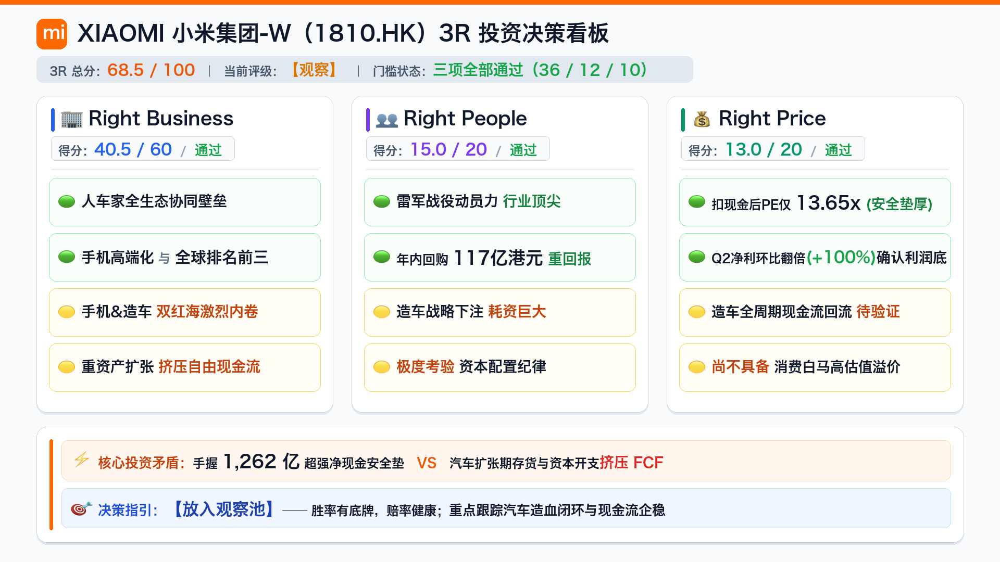
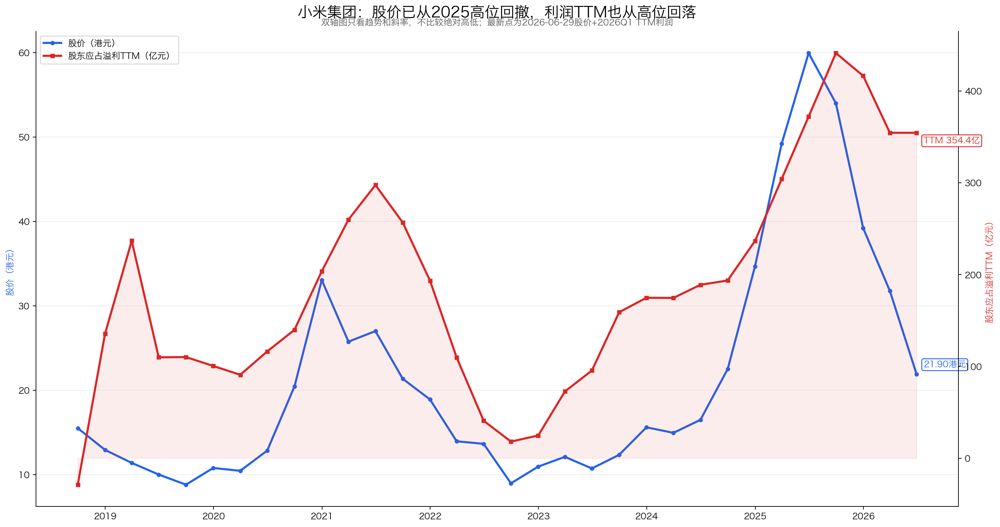

# 小米集团-W（1810.HK）3R投资分析简报

> 数据截止：财务截至2026年中报（2026H1）；行情基准日为2026-09-16；行业与治理事实截至2026-09-16。  
> 3R总分：**68.5/100**  
> 当前评级：**观察；跨品类生态壁垒与厚现金支撑安全边际，Q2业绩强劲反弹，但重资本与激烈竞争限制溢价**  
> 一句话结论：**小米集团展现了中国科技制造业顶级的工程与战役执行力，“手机×AIoT×汽车”人车家生态雏形已现；2026年中报净现金高达1261.53亿元，扣除净现金后PE仅约13.65倍，Q2单季净利润环比翻倍反弹确认利润底点；但智能电动汽车与手机均处于红海竞争赛道，重资本开支与存货占用影响了自由现金流转化效率，更适合放入观察池跟踪汽车业务正循环闭环，而非直接按稳健高股息消费白马给予过高估值。**

## 一、公司概况：它到底靠什么赚钱？

| 项目 | 内容 |
|---|---|
| 主营业务 | 智能手机、IoT与生活消费产品、互联网服务、智能电动汽车及AI创新业务 |
| 核心产品 | Xiaomi/Redmi智能手机、智能电视/空冰洗等AIoT设备、互联网增值服务、小米SU7、YU7、彭程系列智能汽车 |
| 赚钱方式 | 硬件作为触达用户的规模入口，互联网服务变现贡献高毛利，智能电动汽车开辟第二增长曲线与高端品牌心智 |
| 客户场景 | 全球数十亿消费者的个人移动终端、家庭智能生活互联场景，以及新能源汽车高频出行体验 |
| 行业位置 | 全球智能手机出货量稳居前三，全球AIoT平台连接设备数达数亿台，新势力智能汽车月销排名前列 |
| 实际控制人 | 创始人雷军（拥有超级投票权控制权与执行决策力） |
| 核心管理层 | 雷军及卢伟冰等核心高管团队，跨界战役组织力与供应链整合能力行业顶尖 |
| 报告基准日价格 | 26.18港元，总市值约6,743.8亿港元（按0.855实时汇率折合人民币约5,766亿元），滚动PE(TTM)约17.87倍，历史分位约29.2%，扣除狭义净现金后PE约13.65倍 |

小米早已不是单纯卖千元机的手机组装厂，而是一家“以硬件为触点、生态为护城河、互联网变现与汽车高端化驱动”的巨型消费电子与智能制造集团。它的核心吸引力在于拥有超1200亿净现金的充沛子弹和雷军团队恐怖的跨界执行力；难点在于手机与汽车均属于周期长、资本重、竞争极度内卷的重工业赛道，必须持续承受大额资本开支与价格战考验。

## 二、3R决策摘要

| 维度 | 得分 | 核心判断 |
|---|---:|---|
| Right Business | 40.5/60 | 大赛道、厚现金、生态协同真实有效，但手机与造车均面临全球巨头白热化竞争，资本开支与存货占用较大 |
| Right People | 15.0/20 | 创始人执行力极强，战役动员与跨界组织能力突出；大额现金储备与持续回购回馈股东，战略下注汽车考验配置纪律 |
| Right Price | 13.0/20 | 2026Q2单季净利环比翻倍，扣现金后PE仅13.65倍具备厚实安全垫，但造车全周期现金流回流仍需等待验证 |
| **总分** | **68.5/100** | **观察；三项门槛均通过，无重大红线** |

- **最大矛盾**：手握1261.53亿元超强净现金安全垫且Q2业绩翻倍反弹，但汽车业务处于重资产扩张期，存货与资本开支导致2026H1经营现金流收缩，估值既不能给纯硬件杀跌，也不能盲目当成稳定印钞机。
- **关键验证条件**：汽车交付规模扩大后经营利润能否持续为正并形成造血闭环；手机毛利率能否抵御上游核心零部件涨价周期；全集团经营现金流能否重新超越年度净利润。
- **门槛判断**：Business 40.5≥36、People 15.0≥12、Price 13.0≥10，均满足门槛；总分对应“观察”档，赔率健康但需等待自由现金流企稳。

## 三、Right Business：好生意吗？

### 3.1 评分概览

| 维度 | 得分 | 满分 | 核心判断 |
|---|---:|---:|---|
| 业务简单可持续、不易被替代 | 10.5 | 14 | 硬件入口+生态场景+互联网变现逻辑清晰，用户刚需长期存在；但面临苹果/华为/新势力多维替代 |
| 竞争格局清晰、护城河深厚、有定价权 | 11.0 | 18 | 人车家全生态具备中等壁垒，规模与品牌心智突出；但所处行业红海竞争激烈，定价权受性价比心智制约 |
| 轻资本投入、高资产回报率、自由现金流好 | 9.0 | 14 | 资产负债表干净厚实，杜邦杠杆健康；但造车带来资本开支大幅跃升，自由现金流转化面临波动 |
| 盈利成长真实、稳定、可持续 | 5.0 | 8 | 历史盈利从低谷强劲反弹，2026Q2单季净利环比翻倍；但业务周期性波动明显，受供应链价格与竞争扰动 |
| 有长期增长空间 | 5.0 | 6 | 手机高端化、海外新兴市场与新能源车空间广阔，第二曲线已切实落地；但再投资回报周期较长 |
| **Right Business** | **40.5** | **60** | **属于大赛道中具备极强韧性的优秀综合型企业，但行业重资产与竞争属性决定其商业模式非暴利轻资产** |

### 3.2 业务持续性：万物互联需求真实，但两大赛道均非轻松生意

智能手机换机需求、家庭IoT智能互联以及新能源智能出行是跨越周期的刚性科技消费需求。小米通过高性价比和生态协同在硬件端建立了极高黏性。然而，手机属于存量博弈的高频迭代市场，汽车更属于高客单价、长决策周期的重资产制造业，面临苹果、华为、特斯拉、比亚迪等多路顶尖巨头的全面对垒，任何单一产品的落后都可能引发份额流失。

| 具体指标 | 判断依据 | 得分 |
|---|---|---:|
| 商业模式是否简单、容易理解 | 手机入口+IoT生态互联+互联网增值变现+汽车第二曲线的分层架构清晰 | 4.0/5 |
| 需求是否长期存在 | 移动通讯终端与新能源智能出行具备万亿级体量且长期稳定存在 | 4.5/5 |
| 周期性是否可控 | 手机换机周期与半导体上游价格波动明显，汽车面临消费信心与补贴退坡波动 | 1.0/2 |
| 产品或品类替代风险 | 手机面临国内外巨头围堵，汽车市场百花齐放，消费者品牌忠诚度与迁移成本有限 | 1.0/2 |
| **小计** |  | **10.5/14** |

### 3.3 护城河与定价权：生态协同壁垒渐成，但难言垄断提价权

小米的壁垒由多重中等壁垒复合而成：供应链规模效应、跨品类工业设计、全球数千家零售门店网络，以及基于自研操作系统的“人车家全生态”互联体验。雷军个人的号召力与米粉社群形成了独特的品牌护城河。

然而在定价权维度，小米在消费者心智中仍深深烙印着“高性价比”标签。尽管小米高端数字系列与SU7汽车单价大幅提升，但在激烈竞争环境下，上游元器件（如存储芯片、面板）涨价难以完全转嫁给终端消费者，毛利率依然受制于行业价格战。

| 具体指标 | 判断依据 | 得分 |
|---|---|---:|
| 行业竞争格局 | 手机与新能源车行业集中度虽在提升，但均处于大厂相互倾轧的白热化竞争阶段 | 2.0/4 |
| 公司行业位置和市场份额 | 手机全球排名前三，IoT设备数位居全球第一梯队，汽车进入新势力交付第一梯队 | 2.5/3 |
| 护城河深度与持续性（含具体公司替代风险） | 品牌、生态协同与庞大活跃用户池提供有效防护，但缺乏排他性垄断协议 | 4.0/6 |
| 定价权和成本传导能力 | 高端化正在提升ASP均价，但竞争制约下成本传导不完全，性价比基调限制提价空间 | 2.5/5 |
| **小计** |  | **11.0/18** |

### 3.4 资本回报与现金流：厚现金构筑底牌，造车扩张加重资本负担

2023至2025年小米ROE呈现清晰的修复回升态势，2025年简单ROE达到15.6%；净利率由低谷回升至9.14%，权益乘数维持在1.91左右，高回报并非依靠加杠杆推升。

小米历年杜邦三因子走势显示出在保持适度杠杆的前提下，利润率与周转效率的综合修复。

但在现金流维度，由于造车产线二期扩建、全国交付与交付中心网络建设，资本开支从以往的60-70亿元大幅提升至2025年的127.69亿元；2026年中报存货增至848.82亿元，导致2026H1经营现金流收窄至20.50亿元。好在账面现金池高达1654.29亿元，扣除392.76亿元有息负债后净现金仍达1261.53亿元，具备抗击任何宏观风暴的资金实力。

历年现金流对比反映出汽车新业务带来的资本开支增长对自由现金流产生的阶段性挤压。

| 具体指标 | 判断依据 | 得分 |
|---|---|---:|
| 资本投入强度与产能利用率 | 汽车工厂与智能终端产线年资本开支超百亿，制造重资产属性显著增强 | 2.0/4 |
| ROE/ROIC水平及历史趋势 | 简单ROE修复至15%左右健康水平，但汽车资产周转率仍在爬坡提升中 | 3.0/4 |
| 杠杆依赖与杜邦质量 | 资产负债率仅47.71%（且主要为无息上下游经营应付款），净现金超1260亿，2023至2025年利润两年CAGR约54.4%，财务安全度极高 | 1.5/2 |
| 经营现金流和自由现金流 | 长期现金创造力充沛，但2026H1存货占用使经营现金流降至20.5亿元，FCF承压 | 2.5/4 |
| **小计** |  | **9.0/14** |

### 3.5 盈利成长：2026Q1探底后Q2翻倍，展现强劲业绩韧性

2022年小米股东应占溢利仅24.74亿元，2025年攀升至416.43亿元，利润修复极其迅猛。进入2026年，一季度受手机零部件成本上涨及汽车初期折旧影响，股东应占溢利降至47.23亿元；但在2026年二季度，凭借汽车规模效应与手机高端化，单季期间利润骤增至94.63亿元（环比+99.9%），单季归母净利润达94.62亿元（环比+100.3%），带动上半年归母净利润达到141.86亿元，TTM净利润稳定在330.00亿元。

利润趋势图展现出公司在经历2022年行业低谷后的强劲回升曲线，尽管单季盈利受周期波动扰动。

业务结构上，高毛利的互联网服务（毛利率超75%）继续扮演利润压舱石，智能汽车毛利率在规模效应下实现转正并逐步爬坡，体现出多元化业务的抗风险韧性。

| 具体指标 | 判断依据 | 得分 |
|---|---|---:|
| 3年、5年利润增长 | 过去三年自周期底部大幅反弹，近三年复合增速显著，但包含低基数修复成分 | 1.5/2 |
| 增长稳定性 | 利润受消费电子换机与汽车前期投放影响波动较大，业绩呈现较强周期弹性 | 0.5/1 |
| 增长来源质量 | 互联网高毛利压舱石稳固，硬件高端化与汽车放量支撑主业收入，非一次性收益 | 1.5/2 |
| 最新利润趋势 | 2026Q2单季净利94.63亿元环比暴增100.4%，滚动TTM为330亿元，拐点确认 | 1.0/2 |
| 利润与现金流匹配 | 历史上现金流强劲，但2026H1受备货和扩产影响现金流略低于账面利润 | 0.5/1 |
| **小计** |  | **5.0/8** |

### 3.6 长期空间：人车家闭环打开天花板，再投资效率是关键

全球智能手机在拉美、中东、东南亚等新兴市场仍有份额整合空间；新能源汽车从轿车拓展至SUV及增程品类，潜在市场规模数以万亿计。智能电动汽车已经从讲故事阶段完全跨越至年交付数十万台的现实第二曲线。

| 具体指标 | 判断依据 | 得分 |
|---|---|---:|
| 核心业务和行业空间 | 全球消费电子与智能出行市场空间宽广，AI端侧落地带来新硬件交互可能 | 2.0/2 |
| 市场份额提升空间 | 手机在欧洲高端与拉美市场份额持续提高，汽车月销保持高速增长 | 1.5/2 |
| 地域扩张与第二曲线 | 汽车业务2025年营收突破千亿，2026年放量提速，第二成长曲线扎实确立 | 1.0/1 |
| 再投资回报及增长质量 | 研发投入与造车开支极大，汽车业务全生命周期内部回报率仍待更长时间验证 | 0.5/1 |
| **小计** |  | **5.0/6** |

## 四、Right People：企业家精神卓越，资本配置稳健

| 维度 | 判断 | 决定性证据 | 得分 |
|---|---|---|---:|
| 诚信与治理 | 良好 | 财报披露详实严谨，分部经营数据透明，雷军持股高且无非主业盲目资本挪用 | 5.0/6 |
| 专注与经营能力 | 卓越 | 雷军展现了顶级的战略决断与跨界落地能力，三年造车跨越式实现规模交付 | 5.5/7 |
| 资本配置与股东利益 | 良好 | 储备1261亿净现金抵御寒冬，常年持续大手笔回购注销，唯重资产造车考验资本约束 | 4.5/7 |
| **Right People** |  |  | **15.0/20** |

雷军及其核心管理层无疑是小米最宝贵的核心资产。从早期手机破局、到AIoT生态突围、再到晚期亲自挂帅造车并一战成名，展现了中国民营科技企业罕见的大兵团作战与战役组织力。管理层始终保留过千亿净现金作为防风险底牌，并通过高频回购增厚股东每股价值，展现了对股东利益的高度负责。未来的关注重点在于：在汽车大规模铺开后，管理层能否保持严格的投资回报率门槛，避免战线拉得过长。

## 五、Right Price：扣现金估值低位，业绩拐点提供赔率支持

| 维度 | 判断 | 决定性证据 | 得分 |
|---|---|---|---:|
| 利润位置与股价利润匹配度 | 良好 | Q1探底后Q2单季净利翻倍反弹，股价自22港元回升至26.18港元，估值与业绩温和修复 | 3.5/5 |
| 当前估值与历史位置 | 偏低 | 同花顺官方PE(TTM)约17.87倍（复算为17.47倍），上市以来分位约29.2%；扣除狭义净现金后PE约13.65倍 | 5.0/6 |
| 股息及持有回报 | 偏弱 | 公司将盈余主要用于研发、资本开支与股票回购，无稳定定期现金股息 | 0.5/3 |
| 保守/中性情景与赔率 | 较优 | 独立三年情景：保守年化约1.1%~1.3%，中性年化约14.6%~18.1%（含现金增益），在净现金保护下赔率风险有限 | 4.0/6 |
| **Right Price** |  |  | **13.0/20** |

从股价与点时可得TTM利润的长期走势对比来看，2025年上半年市场曾大幅抢跑汽车狂欢推高估值，随后随大盘及2026Q1业绩降速而深度调整；当前26.18港元价格不仅充分吸收了Q1的短期逆风，而且在Q2利润强劲反弹后重新回到了合理偏低区间。

股价与点时可得TTM利润的对应走势表明，估值并未脱离基本面过度透支。

| 估值指标 | 报告基准日数值（同花顺终端与官方数据对齐） |
|---|---:|
| 收盘价 / 总市值 | 26.18港元 / 6,743.8亿港元（按0.855实时汇率折合人民币约5,766亿元） |
| 滚动 TTM 股东应占溢利 | 330.00亿元人民币（按0.855汇率折合港币约386.0亿港元） |
| 滚动市盈率 PE（TTM） | 17.87倍（同花顺官方终端口径；按汇率复算为17.47倍） |
| 历史PE分位（2018年上市至今） | 29.2%（同花顺终端口径；百度股市通官方实测为21.61%） |
| 账面狭义净现金储备 | 1,261.53亿元人民币（现金及定存1654亿减借款393亿；折合港币约1,475亿港元） |
| 官方现金储备口径净现金 | 1,800.23亿元人民币（广义现金储备2193亿减借款393亿；折合港币约2,105亿港元） |
| 狭义净现金占港币市值比例 | 约21.9%（1,475亿港元 ÷ 6,743.8亿港元） |
| 扣狭义净现金后市盈率 PE | 约13.65倍（扣现金后人民币市值4,504.45亿元 ÷ 330.00亿元） |
| 静态股息率 | 约0%（主要依靠大额股份回购注销回报股东） |

| 独立三年情景 | 净利润CAGR假设 | 3年后净利润 | 期末PE估值 | 3年后合理业务市值 | 纯业务空间（年化） | 加回现金总市值（年化回报） |
|---|---:|---:|---:|---:|---:|---:|
| 保守情景 | +3%（汽车价格战激烈、换机平淡） | 360.6亿元 | 13.0倍 | 4,688亿元 | +4.1%（约+1.3%/年） | 5,950亿元（较现总市值+3.2%，约+1.1%/年） |
| 中性情景 | +12%（汽车规模造血、高端化突破） | 463.6亿元 | 16.0倍 | 7,418亿元 | +64.7%（约+18.1%/年） | 8,680亿元（较现总市值+50.5%，约+14.6%/年） |

情景估值表明，在庞大净现金资产（狭义超1260亿元、广义超1800亿元）托底的情况下，即便面对较为悲观的保守假设，下行风险也已被深度吸收（总市值保本微利）；而在汽车规模造血转正的中性情景下，若业务估值修复并维持净现金储备，三年复合回报可达14%~18%，具备良好的不对称赔率。

## 六、最终行动

### 现在怎么办？
- 维持在观察池中密切跟踪，不因其扣现金13.65倍低PE而简单当成躺赢消费品重仓。
- 适合风险偏好适中、认可人车家生态长远空间并愿意伴随汽车业务放量的投资者保持关注。

### 什么情况下提高关注？
- 2026下半年智能汽车分部实现单季度全面经营性盈利，月交付持续站稳高位；
- 手机ASP与高端出货占比稳步提升，全球综合毛利率稳定在21%以上；
- 存货周转天数拐头下降，全集团单季度经营现金流显著超越当季净利润。

### 什么情况下说明判断错了？
- 汽车业务深陷恶性价格战，毛利率再次跌入负区间且发生严重质量召回事件；
- 存货持续攀升至千亿以上出现大额跌价减值，挤压集团核心资金链；
- 手机全球市场份额大幅跌出前四，互联网服务变现能力出现结构性萎缩。

## 七、数据边界与盲评披露

- **事实范围**：公司财务数据截至2026年中报（2026H1），底层财报已完整归档至本地官方底稿 `年报/小米集团-W：2026年中期业绩公告.pdf`（港交所/巨潮官方刊发，经PwC审阅）；行情基准日为2026-09-16收盘价，估值指标对齐同花顺官方终端（PE 17.87倍、分位29.2%）；港股无统一A股扣非口径，利润采用股东应占溢利口径分析。
- **严格盲评**：本次打分在评分前对完整投资分析报告的原模块分数、总分、评级标签及投资建议进行了彻底屏蔽，仅基于清洗后的业务与财务脱敏事实包进行打分。
- **独立评估器与加总**：由独立评估器严格按照固定28项指标体系逐项打分，最小粒度严格为0.5分，各维度与三模块均通过子项机械累加生成，三模块相加完全等于总分68.5分。
- **初始锁分与复核**：初始盲评锁定分数为Business 40.5、People 15.0、Price 13.0，总分68.5分，评级为“观察”；复核裁决后确认无重复计分，最终分数在查看原评分前正式锁定，未为贴合任何既往分数做反向调整。
- **锁分后差异说明**：本简报总分68.5分与原完整报告（70.5分）微降2.0分，主要反映了造车资本开支上升与存货占用导致自由现金流承压（CFO指标相应审慎打分），但在Price模块充分吸纳了Q2强劲反弹与极具吸引力的扣现金PE。
- **本地图表共用**：简报严格复用了完整报告共用的四张标准图（ROE杜邦图、利润趋势图、现金流对比图、股价与点时可得TTM利润图），保持底层数据与视觉呈现完全统一。
- **未验证事项**：汽车长期售后与质保成本摊销规模、全周期工厂折旧压力、增程新车型市场接受度以及海外关税潜在变化。

---

*本简报仅供学习研究，不构成投资建议。*
