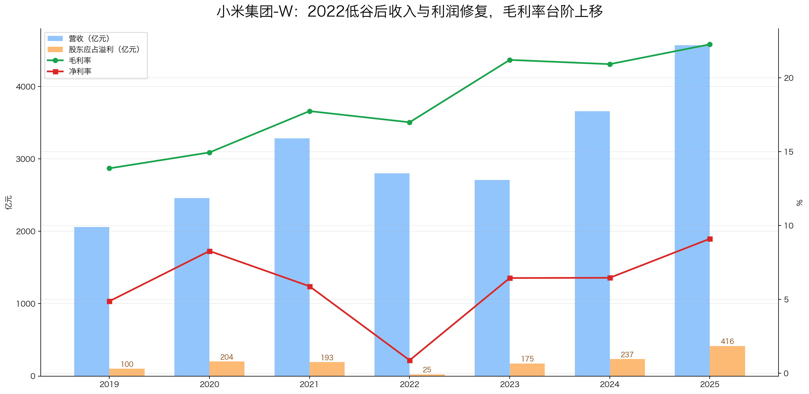
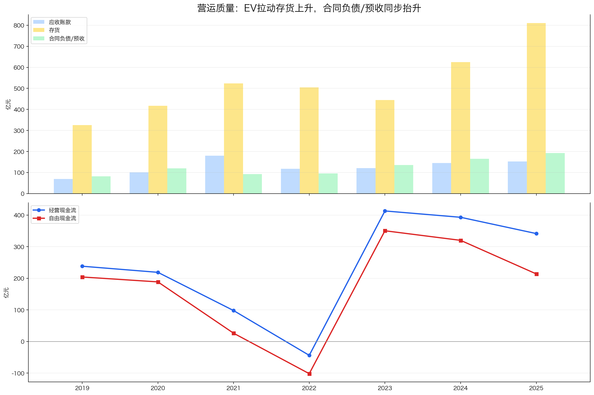

# 小米集团-W（1810.HK）投资分析报告

> 结论先行：小米已经不再只是手机公司，而是“手机 × IoT × 汽车 × 互联网服务”的硬件生态平台。它的优势是品牌、规模、供应链和用户生态；短板是手机与汽车都处在强竞争行业，定价权不算强，汽车业务仍在验证期。按当前 22.66 港元股价看，估值已经回落到偏低区间，适合纳入观察池；但不建议仅凭低 PE 重仓，需要继续验证汽车毛利、现金流和手机基本盘。

数据日期：2026-06-24  
公司代码：1810.HK / 东方财富港股代码 01810.HK  
股价：22.66 港元  
市值：约 5,832.59 亿港元，约 5,056 亿人民币（按 HKD/CNY 0.8669 估算）  
TTM 股东应占溢利：354.42 亿元  
近似 PE：约 14.3 倍  
近似现金头寸：约 1,475 亿人民币  
扣现金后 PE：约 10.1 倍  

重要口径说明：
- 小米是港股，但披露季度业绩，因此利润 TTM 用季度累计值差分为单季度，再滚动 4 季相加。
- 港股没有 A 股“扣非净利润”完全对应口径。本报告主线使用东方财富港股财务接口的“股东应占溢利”。小米经营分析中更理想的指标是“经调整净利润”，后续若拿到年报 PDF/公告明细，应再补一版经调整净利润 TTM。
- 股价单位是港元，利润和财务报表为公司财报列报币种/接口原值，不能直接把港元股价和人民币利润混算；估值处统一用汇率近似折算。

---

## 一、先判断能不能研究：公司画像 + 能力圈 + 红线

### 1.1 公司画像：这门生意看得懂吗？

小米的生意可以拆成四层：

| 层级 | 业务 | 本质 | 关键变量 |
|---|---|---|---|
| 第一层 | 智能手机 | 流量入口 + 硬件基本盘 | 出货量、ASP、毛利率、海外份额 |
| 第二层 | IoT 与生活消费品 | 生态复购 + 交叉销售 | 品类扩张、智能家居渗透率、渠道效率 |
| 第三层 | 互联网服务 | 高毛利变现 | MIUI/HyperOS 活跃用户、广告/游戏/增值服务 |
| 第四层 | 智能电动汽车 | 第二增长曲线 | 交付量、毛利率、产能、质量口碑 |

一句话理解：小米不是靠单一爆品赚钱，而是先用硬件获取用户，再用生态和服务提升用户价值；汽车是小米生态从“移动设备”走向“移动空间”的大赌注。

### 1.2 能力圈判断

能力圈：谨慎通过。

能看懂的部分：
- 手机、IoT、互联网服务的商业模式较清晰；
- 小米的品牌、供应链和渠道能力可以通过收入、毛利率、现金流验证；
- 汽车业务的交付和口碑已有外部观察指标。

不容易看懂的部分：
- 智能汽车长期竞争格局尚未稳定；
- 小米汽车的真实长期毛利率、质量成本、售后成本还需要更多周期验证；
- 手机行业价格战和技术迭代快，护城河不如白酒、药品、消费品牌那么稳定。

### 1.3 红线检查

| 项目 | 判断 |
|---|---|
| 财务治理 | 暂未看到重大红线；现金充足，经营现金流长期大多为正 |
| 行业属性 | 手机、汽车都有强竞争和一定周期性，不完全符合“非周期复利型”偏好 |
| 经营质量 | 2022 年利润和现金流明显承压，说明商业模式并非无波动 |
| 价值陷阱 | 当前不是单纯低 PE 衰退型，但汽车投入和竞争可能压低未来利润率 |

初筛结论：谨慎通过。  
后续重点：
1. 手机基本盘能否稳住份额和毛利率；
2. 汽车业务能否从销量验证走向利润验证；
3. 高现金头寸能否真正形成估值安全垫，而不是被新业务持续消耗。

---

## 二、好行业：是不是好生意？

### 2.1 需求质量 / 非周期性

小米所在行业需求长期存在，但周期性不弱。

- 手机需求已经从高速增长进入成熟替换期，全球市场更多是存量竞争；
- IoT 与智能家居仍有渗透率提升空间，但单品竞争激烈；
- 汽车是大市场，但电动车行业竞争强、资本开支高、价格战频繁；
- 互联网服务高毛利，但依赖硬件用户规模和监管环境。

判断：需求长期存在，但不是典型弱周期行业。

### 2.2 竞争格局

| 业务 | 主要竞争对手 | 竞争状态 |
|---|---|---|
| 智能手机 | 苹果、三星、OPPO、vivo、荣耀、传音 | 全球强竞争，份额波动明显 |
| IoT | 美的、海尔、格力、传统家电、互联网硬件品牌 | 品类多，单品壁垒不一 |
| 互联网服务 | 手机厂商、应用商店、广告平台 | 依赖系统入口和活跃用户 |
| 汽车 | 比亚迪、特斯拉、理想、小鹏、蔚来、华为系 | 价格战和产品迭代都很激烈 |

小米的优势不是单品垄断，而是多品类协同和品牌心智。但汽车和手机都很难形成长期高定价权。

### 2.3 进入壁垒

小米的壁垒来自四件事：
- 品牌：年轻化、性价比、科技感心智较强；
- 供应链：大规模硬件制造和成本控制能力；
- 渠道：线上线下结合，海外渠道多年积累；
- 生态：手机、IoT、系统、汽车之间存在协同。

但壁垒不是不可攻破。硬件行业技术迭代快，用户迁移成本低，竞争对手也很强。

### 2.4 上下游议价权

小米对上游核心零部件供应商议价权有限，尤其是芯片、屏幕、摄像头、汽车核心零部件；对下游消费者定价权也有限，性价比品牌心智既是优势，也是提价约束。

积极的一面是：规模足够大，可以换来供应链效率和成本优势。

### 2.5 替代品威胁

- 手机不会消失，但品牌替代很容易；
- IoT 品类会持续存在，但单品生命周期短；
- 汽车不会被替代，但品牌格局未定；
- 互联网服务入口可能受系统生态变化影响。

### 好行业评分

| 子项 | 得分 | 理由 |
|---|---:|---|
| 需求质量 / 非周期性 | 4 / 6 | 需求长期存在，但手机和汽车都有周期与竞争波动 |
| 竞争格局 | 2 / 4 | 多个强敌，价格战风险高 |
| 进入壁垒 | 3 / 4 | 品牌、规模、渠道、生态有壁垒，但非垄断型 |
| 上下游议价权 | 1.5 / 3 | 供应链和消费者两端定价权都有限 |
| 替代品威胁 | 2 / 3 | 底层需求稳定，但品牌替代容易 |
| 小计 | 12.5 / 20 | 好赛道很大，但不是轻松赚钱的好行业 |

---

## 三、好公司·定性：有没有长期复利能力？

### 3.1 护城河

小米的护城河是“多重中等壁垒叠加”，不是单一强垄断壁垒。

| 壁垒 | 表现 | 稳固程度 |
|---|---|---|
| 品牌 | 性价比、科技感、年轻用户心智 | 较强，但高端化仍需验证 |
| 供应链 | 大规模硬件制造、成本控制 | 较强 |
| 渠道 | 中国 + 海外 + 线上线下 | 较强 |
| 生态 | 手机、IoT、汽车、HyperOS | 潜力大，但协同效果需继续验证 |
| 技术 | 手机、影像、AIoT、智能驾驶 | 有投入，但不属于绝对领先 |

护城河结论：小米的优势是真实的，但行业太卷，护城河需要持续投入维护。

### 3.2 复购 / 粘性 / 低替代性

小米有复购，但粘性中等。

- 手机换机有复购，但用户可以转向苹果、华为、荣耀等；
- IoT 产品复购更强，一个家庭买入多个小米设备后，生态粘性会上升；
- 汽车若和手机、家居、系统打通，可能提高用户粘性；
- 互联网服务依赖系统入口，用户规模越大，变现越稳。

### 3.3 定价权

定价权是小米较弱的一环。

小米长期品牌心智是“高性价比”，这让它容易获得用户，但也限制了大幅提价能力。高端手机和汽车是提升 ASP 的关键，但高端化需要持续产品力验证。

### 3.4 管理层

雷军及核心管理层是小米的重要资产。

积极点：
- 创始人仍深度参与经营；
- 战略执行力强，从手机到 IoT 再到汽车，组织动员能力很强；
- 资本配置敢于押注大市场。

风险点：
- 汽车投入巨大，战略成功会打开空间，失败也会消耗现金和利润；
- 业务边界越来越宽，管理复杂度上升。

### 好公司·定性评分

| 子项 | 得分 | 理由 |
|---|---:|---|
| 护城河 | 5 / 7 | 品牌、规模、渠道、生态真实存在，但非强垄断 |
| 复购 / 粘性 | 3.5 / 5 | IoT 生态增强粘性，手机和汽车替代仍容易 |
| 定价权 | 2.5 / 5 | 性价比心智限制提价，高端化仍需验证 |
| 管理层 | 2.5 / 3 | 创始人型公司，执行力强，但汽车押注带来复杂度 |
| 小计 | 13.5 / 20 | 是优秀公司，但不是无脑高定价权生意 |

---

## 四、好公司·定量：利润是不是真，增长是否健康？

### 4.1 ROE质量与盈利模式

| 年份 | 营收 | 股东应占溢利 | 毛利率 | 净利率 | 总资产周转率 | 权益乘数 | 简单ROE |
|---|---:|---:|---:|---:|---:|---:|---:|
| 2019 | 2,058.39 | 100.44 | 13.9% | 4.9% | 1.12 | 2.25 | 12.3% |
| 2020 | 2,458.66 | 203.56 | 14.9% | 8.3% | 0.97 | 2.05 | 16.4% |
| 2021 | 3,283.09 | 193.39 | 17.7% | 5.9% | 1.12 | 2.13 | 14.1% |
| 2022 | 2,800.44 | 24.74 | 17.0% | 0.9% | 1.02 | 1.90 | 1.7% |
| 2023 | 2,709.70 | 174.75 | 21.2% | 6.4% | 0.84 | 1.97 | 10.6% |
| 2024 | 3,659.06 | 236.58 | 20.9% | 6.5% | 0.91 | 2.13 | 12.5% |
| 2025 | 4,572.87 | 416.43 | 22.3% | 9.1% | 0.90 | 1.91 | 15.6% |

结论：小米的 ROE 修复主要来自净利率和毛利率提升，不是单纯加杠杆。2022 年是明显低谷，2023-2025 年利润率台阶上移。但总资产周转率从 2021 年后下降，说明汽车和现金/资产扩张让资产效率承压。

### 4.2 利润增长来源与持续性

| 区间 | 指标 | 判断 |
|---|---:|---|
| 2022 → 2025 | 股东应占溢利从 24.74 亿到 416.43 亿 | 低基数修复，CAGR 很高但参考意义有限 |
| 2023 → 2025 | 股东应占溢利从 174.75 亿到 416.43 亿 | 两年约 54% CAGR，增长强劲 |
| 2025 全年 | 营收 4,572.87 亿，同比 +25.0% | 收入重新加速 |
| 2025 全年 | 毛利率 22.3%，净利率 9.1% | 利润率明显改善 |

利润增长来源大致有三层：
1. 手机业务从 2022 低谷修复，库存和渠道压力缓解；
2. IoT 与互联网服务提升整体毛利率；
3. 汽车业务开始贡献收入，但仍需验证长期利润率。

需要注意：如果使用 GAAP “股东应占溢利”，早期和部分年份会受到公允价值、投资收益等影响；后续最好用“经调整净利润”复核经营质量。

### 4.3 现金流质量

| 年份 | 股东应占溢利 | 经营现金流 | 资本开支 | 自由现金流 | 经营现金流/利润 | 自由现金流/利润 |
|---|---:|---:|---:|---:|---:|---:|
| 2019 | 100.44 | 238.10 | 34.05 | 204.05 | 237.0% | 203.2% |
| 2020 | 203.56 | 218.78 | 30.26 | 188.53 | 107.5% | 92.6% |
| 2021 | 193.39 | 97.85 | 71.69 | 26.16 | 50.6% | 13.5% |
| 2022 | 24.74 | -43.90 | 58.00 | -101.89 | -177.4% | -411.8% |
| 2023 | 174.75 | 413.00 | 62.69 | 350.32 | 236.3% | 200.5% |
| 2024 | 236.58 | 392.95 | 72.97 | 319.98 | 166.1% | 135.3% |
| 2025 | 416.43 | 341.42 | 127.69 | 213.73 | 82.0% | 51.3% |

结论：现金流质量总体不错，但不是无波动。2022 年自由现金流明显为负；2025 年利润大增，但资本开支抬升，自由现金流/利润降到 51.3%，说明汽车和新业务正在消耗更多现金。

### 4.4 现金头寸与资产负债表安全性

现金头寸近似口径：现金及等价物 + 短期存款 + 中长期存款 + 短期投资 - 长期贷款。  
注：这是基于东方财富港股资产负债字段的近似值，未逐项用年报附注校验，后续应以年报 PDF 附注为准。

| 年份 | 现金及等价物 | 短期存款 | 中长期存款 | 短期投资 | 长期贷款 | 现金头寸近似 |
|---|---:|---:|---:|---:|---:|---:|
| 2021 | 235.12 | 310.41 | 161.95 | 15.98 | 207.20 | 516.26 |
| 2022 | 276.07 | 298.75 | 167.88 | - | 214.93 | 527.77 |
| 2023 | 336.31 | 527.98 | 182.94 | 5.03 | 216.74 | 835.52 |
| 2024 | 336.61 | 363.50 | 585.20 | 7.00 | 172.76 | 1,119.56 |
| 2025 | 269.14 | 513.09 | 920.46 | 2.00 | 229.21 | 1,475.47 |

小米资产负债表很强。按当前市值约 5,056 亿人民币估算，现金头寸约占市值 29%。扣除现金头寸后，主业隐含市值约 3,581 亿人民币，对应 TTM 股东应占溢利约 10.1 倍 PE。

这是真正的安全垫，但也要注意：汽车业务持续扩张会提高资本开支和营运资金需求，现金不能简单全部视为可分配资产。

### 4.5 营运质量：应收 / 存货 / 合同负债

| 年份 | 营收 | 应收账款 | 存货 | 合同负债/预收 | 存货/营收 |
|---|---:|---:|---:|---:|---:|
| 2021 | 3,283.09 | 179.86 | 523.98 | 92.89 | 16.0% |
| 2022 | 2,800.44 | 117.95 | 504.38 | 95.88 | 18.0% |
| 2023 | 2,709.70 | 121.51 | 444.23 | 136.15 | 16.4% |
| 2024 | 3,659.06 | 145.89 | 625.10 | 165.81 | 17.1% |
| 2025 | 4,572.87 | 152.40 | 809.89 | 192.73 | 17.7% |

判断：
- 应收账款没有失控，2025 年应收/营收比例反而较低；
- 存货上升明显，主要需要结合汽车业务扩张理解；
- 合同负债/预收同步增长，说明并非单纯堆库存；
- 后续要重点跟踪汽车库存、订单、交付周期和价格折扣。

### 4.6 产品结构与增长来源

基于 2024 年报已披露完整分部口径，小米收入结构大致为：智能手机约 1,918 亿，IoT 与生活消费品约 1,041 亿，互联网服务约 341 亿，智能电动汽车等创新业务约 328 亿。2025 年完整产品分部数据本次未用 PDF 附注逐项校验，需后续补充。

| 业务 | 角色 | 质量判断 |
|---|---|---|
| 智能手机 | 流量入口和规模基本盘 | 规模大，但竞争激烈、利润率有限 |
| IoT 与生活消费品 | 生态复购和品类扩张 | 增强用户粘性，但单品壁垒不一 |
| 互联网服务 | 高毛利利润来源 | 质量最好，但依赖硬件用户基础 |
| 智能汽车 | 第二增长曲线 | 空间最大，也最需要验证 |

一句话：小米的增长故事从“手机公司”变成“人车家生态公司”，但利润质量最终要看汽车能否从收入贡献走向现金流贡献。

### 好公司·定量评分

| 子项 | 得分 | 理由 |
|---|---:|---|
| ROE质量与盈利模式 | 6.5 / 9 | ROE修复健康，主要靠利润率改善；但资产周转下降 |
| 利润增长与持续性 | 5.5 / 7 | 2023-2025 修复强劲，但低基数和汽车不确定性需打折 |
| 现金流质量 | 5.5 / 7 | 多数年份现金流好，2022和2025显示资本开支压力 |
| 现金头寸与资产负债表 | 5.5 / 6 | 现金垫很厚，扣现金后估值明显下降 |
| 营运质量 | 4 / 5 | 应收健康，存货上升需结合汽车跟踪 |
| 产品结构与增长来源 | 4.5 / 6 | 第二曲线清晰，但汽车盈利模型仍在验证 |
| 小计 | 31.5 / 40 | 财务修复强、现金厚，但新业务带来波动 |

---

## 五、好时机：现在买贵不贵？

### 5.1 股价 vs 利润线

阶段复盘：
- 2018-2019：上市后估值消化，利润受早期非经营项扰动，股价整体承压。
- 2020-2021：手机与互联网服务修复，股价快速上行，估值扩张明显。
- 2022：行业低谷，利润和现金流同时承压，股价进入估值出清阶段。
- 2023-2025：利润明显修复，汽车业务带来新叙事，股价在 2025 上半年明显提前反映预期。
- 2026Q1之后：利润 TTM 从高位回落，股价也从高位回撤，当前价格重新回到更可讨论区间。

最新 TTM 计算示例：
2026Q1 利润 TTM = 2025Q2 单季 119.04 亿 + 2025Q3 单季 122.71 亿 + 2025Q4 单季 65.44 亿 + 2026Q1 单季 47.23 亿 = 354.42 亿。

### 5.2 PE及PE百分位

| 指标 | 数值 | 判断 |
|---|---:|---|
| 当前股价 | 22.66 港元 | 2026-06-24 yfinance |
| 当前市值 | 约 5,056 亿人民币 | 港元市值按 0.8669 折算 |
| 股东应占溢利 TTM | 354.42 亿元 | 最近4个季度滚动 |
| 当前近似 PE | 14.3 倍 | 偏低 |
| 可用季度历史 PE 分位 | 约 3% | 上市以来可用季度样本，非严格十年日频 |
| 扣现金后 PE | 约 10.1 倍 | 有吸引力 |

估值结论：按 GAAP 股东应占溢利看，小米当前估值偏低；扣现金后更便宜。但历史分位样本不足十年，且 2022/2025 的业务结构差异较大，分位只能辅助参考。

### 5.3 PEG

用 2023-2025 两年利润修复计算，增长率很高，PEG 会显得极低；但这是低谷修复 + 汽车新业务叠加，不宜机械外推。若按更保守的未来 10%-15% 利润增速估计，14倍 PE 对应 PEG 约 0.9-1.4，属于合理偏低。

### 5.4 股息率

小米不是高股息投资标的。本报告不把股息作为主要收益来源，核心收益仍来自利润增长和估值修复。

### 5.5 市场信号与预期差

市场现在可能低估的：
- 现金头寸很厚，扣现金后估值不高；
- 手机和 IoT 基本盘仍在，汽车不是从零开始烧钱创业；
- 若汽车毛利率持续改善，市场可能重新给“人车家生态”估值。

市场担心也合理：
- 汽车行业价格战可能压低长期利润率；
- 小米手机高端化仍不稳；
- 2025高增长后，2026Q1 TTM已经回落，需要验证是否只是季节性还是趋势放缓。

### 5.6 毛估估

| 情景 | 假设 | 对应市值 | 相对当前空间 |
|---|---|---:|---:|
| 中性档 | 稳态利润 400 亿，给 18 倍 PE，另考虑约 1,475 亿现金头寸 | 约 8,675 亿人民币 | 约 +72% |
| 保守档 | 稳态利润 300 亿，给 12 倍 PE，现金头寸按 1,000 亿折扣计 | 约 4,600 亿人民币 | 约 -9% |

毛估估结论：当前赔率不错。保守档下行不算大，中性档有较明显空间；但前提是利润不继续明显下修，汽车业务不出现大规模亏损或质量危机。

### 好时机评分

| 子项 | 得分 | 理由 |
|---|---:|---|
| 股价vs利润线 | 3.5 / 5 | 股价已明显回撤，但利润TTM也从高位回落 |
| PE及PE百分位 | 4 / 5 | 当前PE和扣现金后PE偏低 |
| PEG | 1.5 / 2 | 合理偏低，但低基数修复使PEG参考价值下降 |
| 股息率 | 0.5 / 3 | 非高股息标的 |
| 市场信号与预期差 | 1.5 / 2 | 现金头寸和汽车生态有预期差 |
| 毛估估 | 2.5 / 3 | 保守下行有限，中性空间较好 |
| 小计 | 13.5 / 20 | 价格有吸引力，但利润线仍需验证企稳 |

---

## 六、投资结论：值不值得下注，拿不拿得住？

### 6.1 胜率

胜率：中等偏高。

小米不是最典型的“稳定复利型”公司，但它有真实品牌、规模、现金流和管理层执行力。胜率主要来自：
- 手机和 IoT 基本盘仍在；
- 互联网服务提供高毛利支撑；
- 现金头寸很厚；
- 汽车业务如果成功，会打开第二曲线。

胜率的主要折扣来自：
- 手机和汽车都是强竞争行业；
- 汽车业务长期盈利模型还没完全验证；
- 定价权不如高端白酒、品牌中药、垄断平台型公司。

### 6.2 赔率

赔率：较好。

当前估值约 14.3 倍 PE，扣现金后约 10.1 倍 PE。对于一个仍有增长和第二曲线的公司，这个价格不贵。真正的问题不是“贵不贵”，而是“利润能不能稳住”。

### 6.3 长期持有检查项

| 检查项 | 判断 |
|---|---|
| 长期需求是否存在 | 是，手机、IoT、汽车都是长期需求 |
| 护城河是否增强 | 有机会增强，取决于人车家生态协同 |
| 是否不需要持续烧钱 | 暂不确定，汽车业务仍需资本投入 |
| 是否有长期定价权 | 一般，性价比心智限制提价 |
| 不靠PE扩张能否赚钱 | 可以，但要靠利润增长兑现 |

长期持有结论：可以长期跟踪，但不属于“买完不用看”的公司。必须持续观察汽车毛利率、自由现金流和手机基本盘。

### 6.4 评级与行动

总分：71.0 / 100  
评级：关注  
行动建议：纳入观察池，适合分批研究，不适合盲目重仓。

更具体的操作框架：
- 若股价继续下跌但利润 TTM 稳住、汽车毛利率改善：吸引力提升；
- 若股价上涨很快而利润没有同步上修：降低赔率；
- 若汽车业务出现质量事故、价格战亏损扩大、自由现金流持续恶化：投资逻辑需要重估。

---

## 七、投资逻辑与证伪条件

### 7.1 投资逻辑

1. 小米的基本盘不是消失，而是从手机向“人车家生态”扩展；
2. 2022 年是经营低谷，2023-2025 年收入、毛利率、净利率均明显修复；
3. 现金头寸厚，扣现金后估值低，提供安全边际；
4. 汽车业务如果能持续放量并保持合理毛利率，会显著抬高市场对小米的长期空间判断；
5. 当前价格已经反映了一部分担忧，赔率比 2025 高位更好。

### 7.2 证伪条件

出现以下情况，应重新评估甚至剔除：

1. 手机基本盘持续下滑，全球份额和毛利率同时恶化；
2. 汽车交付增长但毛利率长期为负，且质量/售后成本明显上升；
3. 自由现金流连续 2 年显著低于净利润，说明增长消耗现金；
4. 存货持续快于收入增长，且合同负债/订单指标不匹配；
5. 管理层进行大额非主业并购或资本配置失控；
6. 股价重新大幅上涨至 25-30 倍以上 PE，但利润没有同步上修。

---

## 八、维度打分汇总表

| 模块 | 得分 | 满分 |
|---|---:|---:|
| 好行业 | 12.5 | 20 |
| 好公司·定性 | 13.5 | 20 |
| 好公司·定量 | 31.5 | 40 |
| 好时机 | 13.5 | 20 |
| 总分 | 71.0 | 100 |

评级：关注。

分数解释：小米的低估值和现金头寸加分明显，但行业竞争、定价权、汽车盈利不确定性使它很难给到 80 分以上。

---

## 九、总结

小米最值得关注的点，不是“手机公司很便宜”，而是：市场正在用偏低估值给一家现金很多、利润修复、并且拥有汽车第二曲线的硬件生态公司定价。

但小米也不是传统意义上的稳定复利股。它的行业竞争强、定价权一般、汽车业务还没完全穿越一个完整周期。因此更合适的定位是：

- 不是“不碰”；
- 也不是“闭眼买”；
- 是“估值有吸引力、值得重点跟踪，但要用汽车毛利率和自由现金流继续验证”的关注型标的。

一句话结论：当前小米的赔率开始变好，但胜率还需要汽车业务和现金流继续证明。

---

## 十、数据校验结果

| 校验项 | 结果 | 说明 |
|---|---|---|
| 股价/市值 | 正确 | yfinance 1810.HK，2026-06-24 收盘 22.66 港元 |
| 港股代码 | 正确 | yfinance 用 1810.HK，东方财富用 01810.HK |
| 季度利润 TTM | 正确 | 小米披露季度业绩，按累计值差分单季，再滚动4季 |
| 归一化图 | 已修正 | 改为从第一个正利润TTM点 2018Q4 起算 |
| 年度营收/利润/现金流 | 正确 | 来自东方财富港股财务接口，单位换算为亿元 |
| 现金头寸 | 需复核 | 已按字段近似计算；2025 年报PDF已补下载，尚未逐项用附注重算 |
| 产品结构 | 需复核 | 2025 年报PDF已补下载，可进一步按分部明细校验；本版报告仍以东方财富接口+公告摘录为主 |
| PE百分位 | 需复核 | 使用上市以来季度样本近似，不是严格十年日频分位 |
| 经调整净利润 | 不可验证 | 本次未抓取到完整历史序列，后续建议补充 |
| 打分加总 | 正确 | 12.5 + 13.5 + 31.5 + 13.5 = 71.0 |

数据文件：
- /Users/pidan-l/Documents/AI-Investment/investment/1810_小米集团/data/xiaomi_annual_core.csv
- /Users/pidan-l/Documents/AI-Investment/investment/1810_小米集团/data/1810_小米集团_季度股价利润数据.csv

图表文件：
- /Users/pidan-l/Documents/AI-Investment/investment/1810_小米集团/charts/1810_小米集团_股价vs股东应占溢利TTM_双Y轴.png
- /Users/pidan-l/Documents/AI-Investment/investment/1810_小米集团/charts/1810_小米集团_股价vs股东应占溢利TTM_归一化.png
- /Users/pidan-l/Documents/AI-Investment/investment/1810_小米集团/charts/1810_小米集团_股价vs股东应占溢利_单季度.png
- /Users/pidan-l/Documents/AI-Investment/investment/1810_小米集团/charts/1810_小米集团_年度营收利润率.png
- /Users/pidan-l/Documents/AI-Investment/investment/1810_小米集团/charts/1810_小米集团_营运质量现金流.png
