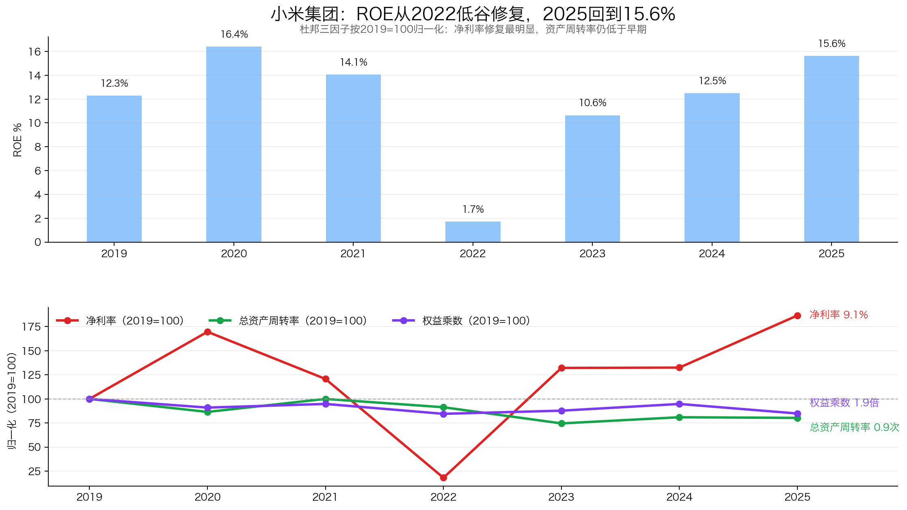
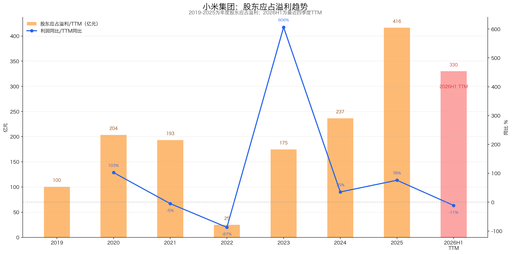
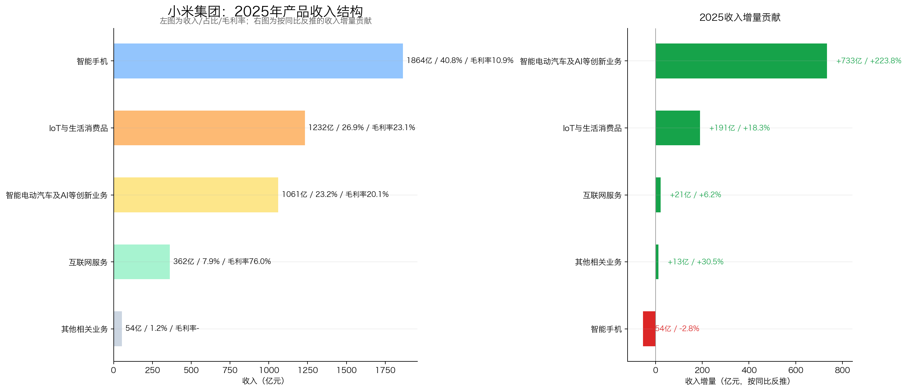
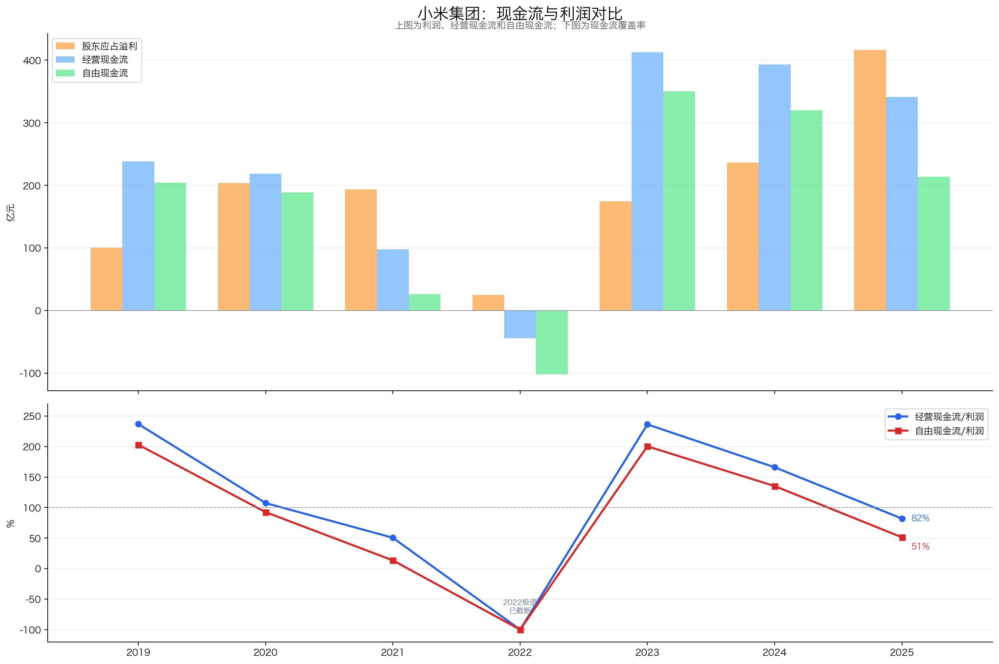
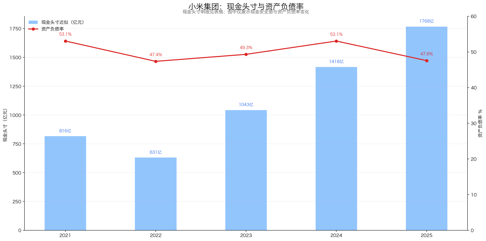
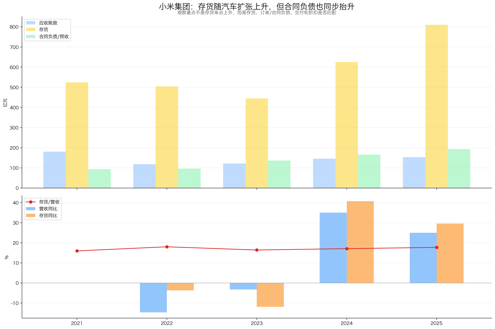
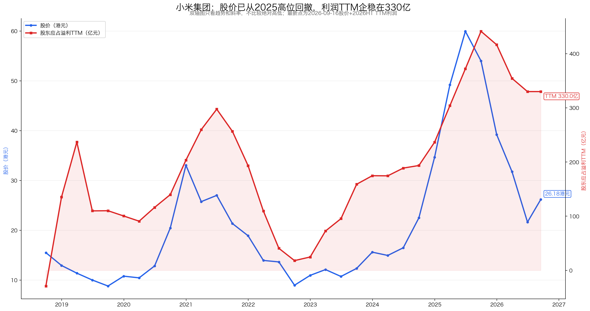
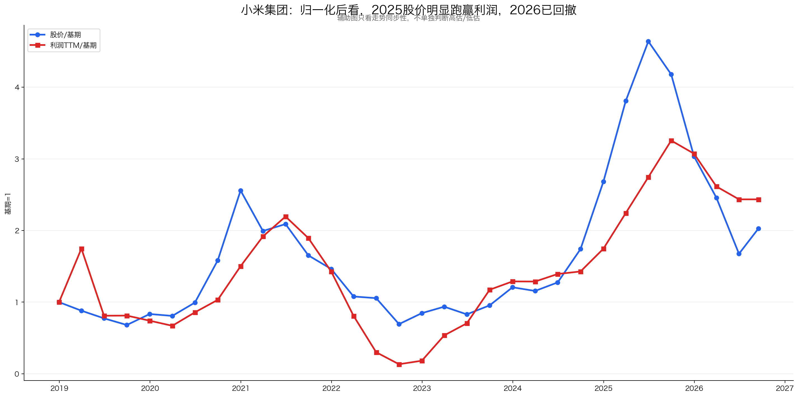
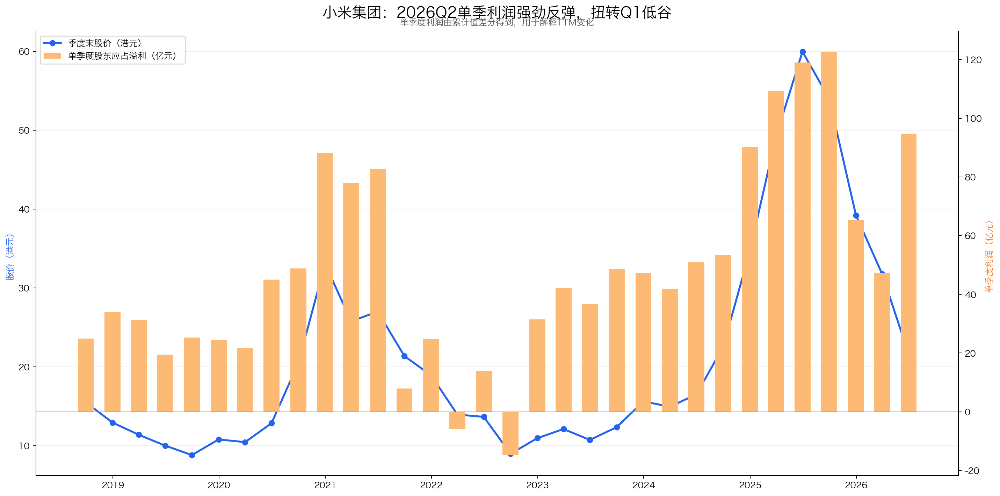

# 小米集团-W（1810.HK）投资分析报告

> 结论先行：小米当前不是“稳定复利股”，更像“现金很厚 + 手机基本盘 + IoT生态 + 汽车第二曲线”的成长型硬件生态公司。按 2026-06-29 股价 22.18 港元测算，近似 PE 约 14.0 倍，扣现金后 PE 约 9.0 倍，赔率已经明显好于 2025 高位；但 2026Q1 收入、利润同比回落，汽车业务仍有经营亏损，因此核心不是“便宜就买”，而是继续验证利润 TTM 是否企稳、汽车毛利率和自由现金流能否穿越扩张期。

数据日期：2026-06-29  
公司代码：1810.HK / 东方财富港股代码 01810.HK  
股价：22.18 港元  
市值：约 5,709 亿港元，约 4,946 亿人民币（HKD/CNY 0.8664）  
TTM 股东应占溢利：354.42 亿元  
近似 PE：约 14.0 倍  
近似现金头寸：约 1,768 亿人民币  
扣现金后 PE：约 9.0 倍  
评级：关注  
总分：70.5 / 100

重要口径说明：
- 小米为港股，但披露季度业绩。本报告利润 TTM 用“股东应占溢利”累计值差分为单季度，再滚动 4 季相加。
- 港股没有 A 股“扣非净利润”完全对应口径。本报告主线用 GAAP 股东应占溢利，同时参考 2026Q1 公告披露的经调整净利润。
- 股价单位为港元，利润与财务报表为人民币口径；估值处统一用 HKD/CNY 汇率折算。
- 现金头寸口径：现金及现金等价物 + 定期银行存款 + 短期有价证券 - 非流动借款；短期有价证券已纳入“按公允价值计入损益之短期投资”。受限制现金不计入，短期借款不扣。

---

## 一、先判断能不能研究：公司画像 + 能力圈 + 红线

### 1.1 公司画像

小米现在应理解为“人车家全生态”公司，而不是单纯手机公司。

| 层级 | 业务 | 本质 | 关键变量 |
|---|---|---|---|
| 第一层 | 智能手机 | 流量入口 + 规模基本盘 | 出货量、ASP、毛利率、海外份额 |
| 第二层 | IoT与生活消费品 | 生态复购 + 品类扩张 | 品类渗透、智能家居连接数、渠道效率 |
| 第三层 | 互联网服务 | 高毛利变现 | MAU、广告、游戏、增值服务 |
| 第四层 | 智能电动汽车及AI创新业务 | 第二增长曲线 | 交付量、ASP、毛利率、产能、质量口碑 |

一句话：手机提供用户入口，IoT提高家庭场景粘性，互联网服务贡献高毛利，汽车决定未来估值弹性。

### 1.2 能力圈判断

能力圈：谨慎通过。

能看懂的部分：
- 手机、IoT、互联网服务的商业模式清晰，财务数据可跟踪；
- 小米品牌、供应链、渠道、现金流可以用财报验证；
- 汽车交付、ASP、毛利率、门店、订单等指标正在变得可观察。

不容易看懂的部分：
- 智能汽车长期竞争格局未稳定，价格战和技术迭代很快；
- 汽车质量成本、售后成本、长期折旧摊销压力还没有完整周期；
- 小米高端化与性价比心智之间存在张力。

### 1.3 红线检查

| 项目 | 判断 |
|---|---|
| 财务治理 | 暂未看到重大红线；现金储备厚，回购积极 |
| 行业属性 | 手机和汽车都有强竞争，不完全符合“非周期复利型”偏好 |
| 经营质量 | 2022 年和 2026Q1 显示业务有明显波动，不是稳定型消费股 |
| 价值陷阱 | 不是单纯低 PE 衰退股，但汽车投入可能消耗现金流 |

初筛结论：谨慎通过，适合重点跟踪，不适合按“买完不用看”的稳定复利股处理。

---

## 二、好行业：是不是好生意？

### 2.1 需求质量 / 非周期性

小米所在行业需求长期存在，但周期性不弱。

| 业务 | 需求属性 | 评价 |
|---|---|---|
| 手机 | 成熟替换需求 | 长期存在，但增长弱、竞争强 |
| IoT与生活消费品 | 智能家居渗透率提升 | 空间仍在，但单品壁垒不一 |
| 互联网服务 | 高毛利数字变现 | 质量最好，但依赖硬件用户规模 |
| 汽车 | 大市场 + 新能源渗透 | 空间大，但资本开支高、价格战强 |

判断：赛道足够大，但不是轻松赚钱的好行业。

### 2.2 竞争格局

| 业务 | 主要竞争对手 | 竞争状态 |
|---|---|---|
| 智能手机 | 苹果、三星、华为、荣耀、OPPO、vivo、传音 | 全球强竞争，份额和利润率都波动 |
| IoT | 美的、海尔、格力、传统家电、互联网硬件品牌 | 品类分散，壁垒差异大 |
| 互联网服务 | 手机厂商、广告平台、内容平台 | 依赖系统入口与用户规模 |
| 汽车 | 比亚迪、特斯拉、理想、小鹏、蔚来、华为系 | 价格战、产品迭代、智能化竞争都强 |

小米优势在“多品类协同 + 品牌 + 供应链”，不是单一垄断。

### 2.3 进入壁垒

壁垒真实存在，但不是不可攻破：
- 品牌：性价比、科技感、年轻用户心智强；
- 供应链：大规模硬件制造与成本控制能力强；
- 渠道：中国 + 海外 + 线上线下多年积累；
- 生态：手机、IoT、汽车、HyperOS、AI助手有协同潜力；
- 资金：现金头寸厚，能支撑研发和汽车投入。

### 好行业评分

| 子项 | 得分 | 理由 |
|---|---:|---|
| 需求质量 / 非周期性 | 4 / 6 | 需求长期存在，但手机和汽车都有周期波动 |
| 竞争格局 | 2 / 4 | 多个强敌，价格战风险高 |
| 进入壁垒 | 3 / 4 | 品牌、规模、渠道、生态有壁垒，但非垄断 |
| 上下游议价权 | 1.5 / 3 | 核心零部件和消费者两端定价权都有限 |
| 替代品威胁 | 2 / 3 | 底层需求稳定，但品牌替代容易 |
| 小计 | 12.5 / 20 | 大赛道，但不是高定价权好生意 |

---

## 三、好公司·定性：有没有长期复利能力？

### 3.1 护城河

| 壁垒 | 表现 | 稳固程度 |
|---|---|---|
| 品牌 | 性价比、科技感、年轻化、高关注度 | 较强，但高端化需验证 |
| 供应链 | 手机、IoT、汽车的硬件组织能力 | 较强 |
| 渠道 | 小米之家、海外渠道、汽车门店 | 较强 |
| 生态 | 手机 × AIoT × 汽车 × HyperOS | 潜力大，但协同变现需验证 |
| 技术 | 影像、AIoT、智能驾驶、AI模型 | 有投入，但未形成绝对垄断 |

护城河结论：小米是“多重中等壁垒叠加”，不是茅台式强定价权，也不是普通硬件白牌。

### 3.2 复购 / 粘性 / 低替代性

小米有复购，但粘性中等偏强：
- 手机换机复购存在，但用户可迁移；
- IoT 设备越多，家庭场景粘性越强；
- 汽车若和手机、家庭设备、系统深度打通，有机会提高生态粘性；
- 互联网服务依赖 MAU，2026Q1 全球 MAU 7.462 亿，同比增长 3.8%。

### 3.3 定价权

定价权仍是短板。小米的性价比心智帮助获客，但限制提价。2026Q1 手机 ASP 创新高至 1,310 元，是积极信号；但手机毛利率同比从 12.4% 降至 10.1%，说明零部件涨价和竞争压力仍会侵蚀利润率。

### 3.4 管理层

雷军与核心团队仍是重要资产。

加分项：
- 创始人深度参与，战略执行力强；
- 从手机、IoT 到汽车，组织动员能力经过验证；
- 现金充足且持续回购，2026 年初至 5 月 22 日回购约 84 亿港元。

风险项：
- 汽车投入巨大，成功则打开空间，失败则消耗现金；
- 业务边界越来越宽，管理复杂度上升。

### 好公司·定性评分

| 子项 | 得分 | 理由 |
|---|---:|---|
| 护城河 | 5 / 7 | 品牌、规模、渠道、生态真实存在，但非强垄断 |
| 复购 / 粘性 | 3.5 / 5 | IoT和汽车有望增强粘性，手机替代仍容易 |
| 定价权 | 2.5 / 5 | 高端化有进展，但性价比心智限制提价 |
| 管理层 | 2.5 / 3 | 创始人型公司，执行力强，但汽车押注复杂度高 |
| 小计 | 13.5 / 20 | 优秀公司，但不是无脑高定价权生意 |

---

## 四、好公司·定量：利润是不是真，增长是否健康？

### 4.1 ROE质量与盈利模式

| 年份 | 营收 | 股东应占溢利 | 毛利率 | 净利率 | 总资产周转率 | 权益乘数 | 简单ROE |
|---|---:|---:|---:|---:|---:|---:|---:|
| 2019 | 2,058.39 | 100.44 | 13.9% | 4.9% | 1.12 | 2.25 | 12.3% |
| 2020 | 2,458.66 | 203.56 | 14.9% | 8.3% | 0.97 | 2.05 | 16.4% |
| 2021 | 3,283.09 | 193.39 | 17.7% | 5.9% | 1.12 | 2.13 | 14.1% |
| 2022 | 2,800.44 | 24.74 | 17.0% | 0.9% | 1.02 | 1.90 | 1.7% |
| 2023 | 2,709.70 | 174.75 | 21.2% | 6.4% | 0.84 | 1.97 | 10.6% |
| 2024 | 3,659.06 | 236.58 | 20.9% | 6.5% | 0.91 | 2.13 | 12.5% |
| 2025 | 4,572.87 | 416.43 | 22.3% | 9.1% | 0.90 | 1.91 | 15.6% |

结论：2022 年是低谷，2023-2025 年 ROE 修复主要靠净利率和毛利率提升，不是靠加杠杆。风险是总资产周转率较 2021 年下降，汽车和现金/资产扩张拉低资产效率。

### 4.2 利润增长来源与持续性

| 区间 | 指标 | 判断 |
|---|---:|---|
| 2022 → 2025 | 股东应占溢利 24.74 亿 → 416.43 亿 | 低基数修复，CAGR 很高但不可机械外推 |
| 2023 → 2025 | 股东应占溢利 174.75 亿 → 416.43 亿 | 两年约 54.4% CAGR，修复强劲 |
| 2025 全年 | 营收 4,572.87 亿，同比 +25.0% | 收入重新加速 |
| 2026Q1 | 收入 991.42 亿，同比 -10.9% | 手机×AIoT下滑，汽车环比回落 |
| 2026Q1 | 经调整净利润 60.72 亿，同比 -43.1% | 高增长后明显降速，需要观察是否企稳 |

2026Q1 关键拆解：
- 总收入 991 亿元，同比 -10.9%；
- 手机×AIoT 分部收入 793 亿元，同比 -14.5%；
- 智能电动汽车及AI等创新业务收入 199 亿元，同比 +6.9%，但环比 2025Q4 下降 46.6%；
- 经调整净利润 61 亿元，同比 -43.1%，环比 -4.4%。

结论：2023-2025 的利润修复很强，但 2026Q1 已经提示增长斜率下降。后续不能只看全年高增长叙事，必须跟踪季度利润 TTM 是否稳定。

### 4.3 产品结构与增长来源

| 业务 | 2025收入 | 占比 | 同比 | 毛利率 | 角色 |
|---|---:|---:|---:|---:|---|
| 智能手机 | 1,864 亿 | 40.8% | -2.8% | 10.9% | 入口与规模基本盘 |
| IoT与生活消费品 | 1,232 亿 | 26.9% | +18.3% | 23.1% | 生态复购与品类扩张 |
| 互联网服务 | 362 亿 | 7.9% | +6.2% | 约76.0% | 高毛利利润池 |
| 智能电动汽车及AI等创新业务 | 1,061 亿 | 23.2% | +223.8% | 约20.1% | 第二增长曲线 |
| 其他相关业务 | 54 亿 | 1.2% | +30.5% | - | 补充业务 |

2025 年汽车已成为第二大收入来源，这是小米投资故事变化的核心。但汽车业务仍需从“收入贡献”进一步验证到“利润贡献”和“现金流贡献”。

### 4.4 现金流质量

| 年份 | 股东应占溢利 | 经营现金流 | 资本开支 | 自由现金流 | 经营现金流/利润 | 自由现金流/利润 |
|---|---:|---:|---:|---:|---:|---:|
| 2019 | 100.44 | 238.10 | 34.05 | 204.05 | 237.0% | 203.2% |
| 2020 | 203.56 | 218.78 | 30.26 | 188.53 | 107.5% | 92.6% |
| 2021 | 193.39 | 97.85 | 71.69 | 26.16 | 50.6% | 13.5% |
| 2022 | 24.74 | -43.90 | 58.00 | -101.89 | -177.4% | -411.8% |
| 2023 | 174.75 | 413.00 | 62.69 | 350.32 | 236.3% | 200.5% |
| 2024 | 236.58 | 392.95 | 72.97 | 319.98 | 166.1% | 135.3% |
| 2025 | 416.43 | 341.42 | 127.69 | 213.73 | 82.0% | 51.3% |

结论：小米长期现金流不是差公司，但波动明显。2025 年利润大幅增长，但自由现金流覆盖率降至 51.3%，说明汽车扩张、研发和资本开支正在消耗现金。后续最重要的观察指标之一就是自由现金流能否重新接近净利润。

### 4.5 资产负债与现金头寸

| 年份 | 现金及等价物 | 短期存款 | 中长期存款 | 短期有价证券 | 长期贷款 | 现金头寸近似 |
|---|---:|---:|---:|---:|---:|---:|
| 2021 | 235.12 | 310.41 | 161.95 | 316.21 | 207.20 | 816.49 |
| 2022 | 276.07 | 298.75 | 167.88 | 102.95 | 214.93 | 630.72 |
| 2023 | 336.31 | 527.98 | 182.94 | 212.79 | 216.74 | 1,043.27 |
| 2024 | 336.61 | 363.50 | 585.20 | 305.05 | 172.76 | 1,417.61 |
| 2025 | 269.14 | 513.09 | 920.46 | 294.74 | 229.21 | 1,768.21 |

现金头寸是小米当前最大的安全垫。按 2026-06-29 市值约 4,946 亿人民币计算，近似现金头寸约占市值 35.7%。扣现金后主业隐含市值约 3,178 亿人民币，对应 TTM 股东应占溢利约 9.0 倍 PE。这里的短期有价证券包含年报附注 19 的“按公允价值计入损益之短期投资”约 292.74 亿元和按摊余成本计量之短期投资约 2.00 亿元。

但不能把全部现金简单视为可分配资产：汽车业务扩产、研发、门店、售后网络都需要持续投入。短期偿付角度看，2025 年末流动资产约 2,548 亿、流动负债约 1,924 亿，净流动资产约 624 亿；其中存货 809.89 亿、贸易应收款项及应收票据 152.40 亿、预付款项及其他应收款项 337.26 亿，合计约 1,299.55 亿，不能单独覆盖全部流动负债，但加上现金、定期存款和短期投资后整体覆盖充足。贸易应付款项 1,106.99 亿属于供应链经营性负债，不是有息债务，但需要持续跟踪存货周转和动销。

### 4.6 营运质量：应收 / 存货 / 合同负债

| 年份 | 营收 | 应收账款 | 存货 | 合同负债/预收 | 存货/营收 |
|---|---:|---:|---:|---:|---:|
| 2021 | 3,283.09 | 179.86 | 523.98 | 92.89 | 16.0% |
| 2022 | 2,800.44 | 117.95 | 504.38 | 95.88 | 18.0% |
| 2023 | 2,709.70 | 121.51 | 444.23 | 136.15 | 16.4% |
| 2024 | 3,659.06 | 145.89 | 625.10 | 165.81 | 17.1% |
| 2025 | 4,572.87 | 152.40 | 809.89 | 192.73 | 17.7% |

判断：
- 应收账款没有失控，2025 应收/营收比例较低；
- 存货上升明显，需要结合汽车业务扩张理解；
- 合同负债/预收同步增长，说明不能简单定性为压货；
- 后续要重点看汽车订单、交付周期、价格折扣与库存是否匹配。

### 好公司·定量评分

| 子项 | 得分 | 理由 |
|---|---:|---|
| ROE质量与盈利模式 | 6.5 / 9 | ROE修复健康，主要靠利润率改善；但资产周转率下降 |
| 利润增长与持续性 | 5.0 / 7 | 2023-2025强修复，但2026Q1明显降速 |
| 现金流质量 | 5.0 / 7 | 多数年份现金流好，但2025自由现金流覆盖率回落 |
| 现金头寸与资产负债表 | 5.5 / 6 | 现金垫很厚，扣现金后估值明显下降 |
| 营运质量 | 4.0 / 5 | 应收健康，存货上升需跟踪汽车交付与订单 |
| 产品结构与增长来源 | 4.5 / 6 | 第二曲线清晰，但汽车盈利模型仍在验证 |
| 小计 | 30.5 / 40 | 财务修复强、现金厚，但季度利润和汽车现金流仍需验证 |

---

## 五、好时机：现在买贵不贵？

### 5.1 股价 vs 利润线

阶段复盘：
- 2018-2019：上市后估值消化，利润受早期非经营项扰动，股价承压；
- 2020-2021：手机与互联网服务修复，股价快速上行；
- 2022：行业低谷，利润和现金流承压，估值出清；
- 2023-2025：利润明显修复，汽车业务带来新叙事，2025 上半年股价大幅提前反映预期；
- 2026Q1之后：利润 TTM 从 441 亿高点回落至 354 亿，股价也从高位明显回撤。

最新 TTM 计算：
2026Q1 利润 TTM = 2025Q2 单季 119.04 亿 + 2025Q3 单季 122.71 亿 + 2025Q4 单季 65.44 亿 + 2026Q1 单季 47.23 亿 = 354.42 亿。

### 5.2 PE及PE百分位

| 指标 | 数值 | 判断 |
|---|---:|---|
| 当前股价 | 22.18 港元 | 2026-06-29 yfinance |
| 当前市值 | 约 4,946 亿人民币 | 港元市值按 0.8664 折算 |
| 股东应占溢利 TTM | 354.42 亿元 | 最近4个季度滚动 |
| 当前近似 PE | 14.0 倍 | 偏低 |
| 可用季度历史 PE 分位 | 约 3% | 上市以来可用季度样本，非严格十年日频 |
| 现金头寸近似 | 1,768 亿人民币 | 占当前人民币市值约 35.7% |
| 扣现金后 PE | 约 9.0 倍 | 有吸引力 |

估值结论：按 GAAP 股东应占溢利看，小米当前估值偏低；扣现金后更便宜。但 PE 分位不能机械使用，因为 2022、2025、2026 的业务结构差异很大。

### 5.3 PEG

用 2023-2025 两年利润修复计算，PEG 会显得极低，但这是低谷修复 + 汽车新业务叠加，不宜外推。若更保守地按未来 10%-15% 利润增速估算，14 倍 PE 对应 PEG 约 0.9-1.4，属于合理偏低。

### 5.4 股息率

小米不是高股息投资标的。本报告不把股息作为主要收益来源，核心收益来自利润增长、现金头寸安全垫和估值修复。

### 5.5 市场信号与预期差

市场可能低估的：
- 现金头寸厚，扣现金后估值低；
- 手机、IoT、互联网服务基本盘仍在；
- 汽车毛利率若稳定在较好水平，市场可能重新给“人车家生态”估值；
- 回购显示管理层对股东回报更积极。

市场担心也合理：
- 2026Q1 收入和利润同比下滑；
- 手机毛利率受存储等核心器件涨价和竞争影响；
- 汽车分部 2026Q1 仍经营亏损 31 亿元；
- 自由现金流覆盖率已经回落，扩张期现金消耗需要跟踪。

### 5.6 毛估估

| 情景 | 假设 | 对应市值 | 相对当前空间 |
|---|---|---:|---:|
| 中性档 | 稳态利润 380 亿，给 18 倍 PE，另考虑 1,768 亿现金头寸 | 约 8,608 亿人民币 | 约 +74% |
| 保守档 | 稳态利润 300 亿，给 12 倍 PE，现金头寸按 1,000 亿折扣计 | 约 4,600 亿人民币 | 约 -7% |
| 压力档 | 利润降至 250 亿，给 10 倍 PE，现金头寸按 800 亿折扣计 | 约 3,300 亿人民币 | 约 -33% |

毛估估结论：当前赔率不错，但不是无风险。保守档下行不大，中性档空间明显；压力档来自汽车亏损扩大、利润继续下修、市场估值压缩。

### 好时机评分

| 子项 | 得分 | 理由 |
|---|---:|---|
| 股价vs利润线 | 3.5 / 5 | 股价已回撤，但利润TTM也在回落 |
| PE及PE百分位 | 4.5 / 5 | 当前PE和扣现金后PE偏低 |
| PEG | 1.5 / 2 | 合理偏低，但低基数修复使PEG参考价值下降 |
| 股息率 | 0.5 / 3 | 非高股息标的 |
| 市场信号与预期差 | 1.5 / 2 | 现金头寸、回购、汽车生态有预期差 |
| 毛估估 | 2.5 / 3 | 中性空间较好，但压力档风险不可忽略 |
| 小计 | 14.0 / 20 | 价格有吸引力，但需要利润企稳确认 |

---

## 六、投资结论：值不值得下注，拿不拿得住？

### 6.1 商业模式好不好（Right Business）

#### 6.1.1 业务简单可持续、不易被替代

手机、IoT和汽车需求长期存在，业务方向容易理解，但产品竞争激烈、消费者转换成本有限。人车家生态能够提高粘性，却尚未达到微信或操作系统式不可替代，小米也不是传统稳定复利公司。

#### 6.1.2 竞争格局清晰、护城河深厚、有定价权

小米部分符合。品牌、渠道、用户规模、IoT连接和生态协同构成差异化壁垒，汽车又扩大生态边界；但手机和汽车均处强竞争行业，性价比定位限制提价能力，价格战会直接影响毛利率和现金流。

#### 6.1.3 轻资本投入、高资产回报率、自由现金流好

手机与互联网服务部分相对轻资产，现金头寸约1,768亿元提供厚安全垫；但汽车制造进入重资本扩张期，经营亏损和自由现金流压力尚未消失。当前扣现金估值低，不代表汽车新增资本已经证明高回报。

#### 6.1.4 有长期增长空间

汽车是已经形成收入规模的第二曲线，人车家生态和高毛利互联网服务提供长期想象空间；增长能否创造价值，取决于汽车毛利率能否转化为经营利润、手机基本盘能否稳定，以及自由现金流能否穿越扩张期。

### 6.2 管理层怎么样（Right People）：执行力强，汽车投资回报决定下一阶段评价

管理层在手机、IoT和汽车跨品类执行上能力突出，现金储备也提供试错空间；但创始人影响力高、汽车投入规模大，资本配置评价必须落到经营亏损收窄和每股现金流，而不是只看交付量。

### 6.3 是不是好价格（Right Price）：赔率较好，胜率仍需汽车和利润验证

当前近似PE约14倍、扣现金后约9倍，估值明显低于此前高位；但2026Q1收入和利润回落，汽车尚未实现完整盈利。价格不贵，却不构成闭眼买入，适合用利润企稳、汽车亏损收窄和自由现金流恢复决定仓位。

### 6.4 胜率与赔率

**胜率**

胜率：中等偏高，但低于传统稳定复利股。

胜率来源：
- 手机与IoT基本盘仍在；
- 互联网服务毛利率高，用户规模大；
- 现金头寸厚，资产负债表安全；
- 管理层执行力强，汽车业务已有收入规模；
- 当前估值已经给了不少折扣。

胜率折扣：
- 手机和汽车都是强竞争行业；
- 汽车长期盈利模型还没完全验证；
- 2026Q1 利润明显回落；
- 自由现金流开始受到扩张期影响。

**赔率**

赔率：较好。

当前近似 PE 约 14.0 倍，扣现金后约 9.0 倍。对于仍有增长、现金厚、汽车第二曲线存在的公司，这个价格不贵。真正问题不是估值，而是利润能否稳住、汽车能否从毛利率好看走向经营利润和自由现金流好看。

### 6.5 长期持有检查项

| 检查项 | 判断 |
|---|---|
| 长期需求是否存在 | 是，手机、IoT、汽车都是长期需求 |
| 护城河是否增强 | 有机会增强，取决于人车家生态协同 |
| 是否不需要持续烧钱 | 暂不确定，汽车仍在扩张期 |
| 是否有长期定价权 | 一般，性价比心智限制提价 |
| 不靠PE扩张能否赚钱 | 可以，但要靠利润增长和现金流兑现 |

长期持有结论：可以重点跟踪，但不是“买完不用看”。必须持续观察汽车毛利率、汽车经营亏损、自由现金流、手机毛利率和存货周转。

### 6.6 评级与行动

**最终判断：小米拥有现金厚、生态协同和汽车第二曲线的成长潜力，但行业竞争强、定价权一般且资本投入上升；当前赔率不错，胜率仍需后续季度验证，评级维持“关注”。**

总分：70.5 / 100  
评级：关注  
行动建议：纳入重点观察池；若已有仓位，适合用“利润企稳 + 汽车现金流验证”决定加减仓，不适合仅凭低 PE 重仓。

更具体的操作框架：
- 若股价继续下跌但利润 TTM 稳住、汽车毛利率维持、经营亏损收窄：吸引力提升；
- 若股价快速反弹但利润没有同步上修：赔率下降；
- 若汽车价格战导致毛利率和现金流恶化：重估投资逻辑；
- 若自由现金流连续两年显著低于净利润：降低评分。

---

## 七、投资逻辑与证伪条件

### 7.1 投资逻辑

1. 小米已经从手机公司变成人车家生态公司，第二曲线真实存在；
2. 2023-2025 年收入、毛利率、净利率明显修复，说明基本盘并未衰退；
3. 现金头寸厚，扣现金后估值低，提供安全边际；
4. 汽车业务如果能持续放量、维持合理毛利率并缩小经营亏损，会显著提高估值中枢；
5. 当前股价已从 2025 高位明显回撤，赔率比高位好很多。

### 7.2 证伪条件

出现以下情况，应重新评估甚至剔除：
1. 手机基本盘持续下滑，全球份额、ASP、毛利率同时恶化；
2. 汽车交付增长但毛利率持续下行，经营亏损扩大；
3. 自由现金流连续 2 年显著低于净利润；
4. 存货持续快于收入增长，且合同负债/订单指标不匹配；
5. 汽车出现重大质量事故或售后成本超预期；
6. 管理层进行大额非主业并购或资本配置失控；
7. 股价重新上涨到 25-30 倍以上 PE，但利润没有同步上修。

---

## 八、维度打分汇总表

| 模块 | 得分 | 满分 |
|---|---:|---:|
| 好行业 | 12.5 | 20 |
| 好公司·定性 | 13.5 | 20 |
| 好公司·定量 | 30.5 | 40 |
| 好时机 | 14.0 | 20 |
| 总分 | 70.5 | 100 |

评级：关注。

分数解释：小米的现金头寸和估值加分明显，但行业竞争、定价权、2026Q1利润回落、汽车经营亏损使其很难给到 80 分以上。

---

## 九、数据校验结果

| 校验项 | 结果 | 说明 |
|---|---|---|
| 股价/市值 | 已更新 | yfinance 1810.HK，2026-06-29 收盘 22.18 港元 |
| 汇率 | 已更新 | yfinance HKDCNY=X，HKD/CNY 0.8664 |
| 季度利润TTM | 已复算 | 用季度累计值差分单季，再滚动4季；2026Q1 TTM=354.42亿 |
| 2026Q1经营数据 | 已用公告校验 | 收入991亿、经调整净利润61亿、汽车收入190亿、汽车分部经营亏损31亿 |
| 2025产品结构 | 已用年报口径更新 | 智能手机1864亿、IoT 1232亿、互联网362亿、汽车及AI创新1061亿 |
| 年度营收/利润/现金流 | 已复核 | 来自东方财富港股财务接口，单位换算为亿元 |
| 现金头寸 | 已按年报附注修正 | 纳入年报附注19的按公允价值计入损益之短期投资；受限制现金不计入，短期借款不扣 |
| PE百分位 | 近似 | 使用上市以来季度样本，不是严格十年日频分位 |
| 打分加总 | 正确 | 12.5 + 13.5 + 30.5 + 14.0 = 70.5 |

数据文件：
- ../data/xiaomi_annual_core.csv
- ../data/1810_小米集团_季度股价利润数据.csv
- ../data/xiaomi_2025_product_structure.csv
- ../data/quote_yfinance.json

图表文件：
- ../charts/1810_4.1_ROE与杜邦三因子趋势图.png
- ../charts/1810_4.2_扣非利润趋势与同比增速图.png
- ../charts/1810_4.3_收入结构与产品增速图.png
- ../charts/1810_4.4_净利润经营现金流自由现金流对比图.png
- ../charts/1810_4.5_现金头寸拆解与资产负债安全垫图.png
- ../charts/1810_4.6_应收存货合同负债变化图.png
- ../charts/1810_小米集团_股价vs股东应占溢利TTM_双Y轴.png
- ../charts/1810_小米集团_股价vs股东应占溢利TTM_归一化.png
- ../charts/1810_小米集团_股价vs股东应占溢利_单季度.png
