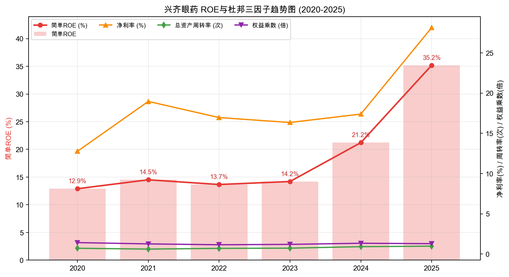
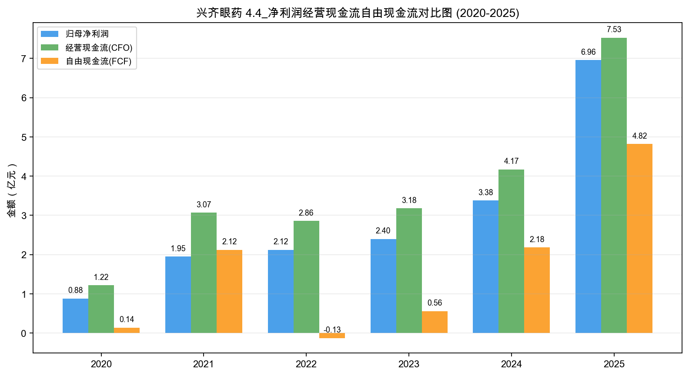
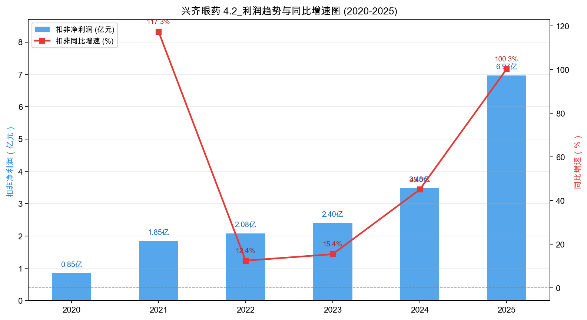

# 兴齐眼药（300573.SZ）3R投资分析简报

> 数据截止：财务截至2026年中报（2026H1）；行情基准日为2026-09-16；行业与治理事实截至2026-09-16。  
> 3R总分：**69.5/100**  
> 当前评级：**观察；业绩高弹性兑现、估值处于极低分位，但护城河窗口期考验仍在**  
> 一句话结论：**兴齐眼药凭借硫酸阿托品与环孢素滴眼液放量，2026H1扣非利润突破4.32亿元，滚动扣非TTM达到7.98亿元，当前16.25倍扣非PE处于上市以来1.7%历史极低分位；但高毛利大单品依赖较重、竞品获批预期将在2027年收窄先发窗口，当前适合作为高弹性观察标的并严密跟踪季度放量，不因超低PE直接作为稳健复利型核心持仓。**

## 一、公司概况：它到底靠什么赚钱？

| 项目 | 内容 |
|---|---|
| 主营业务 | 眼科处方药物研发、生产与销售，辅以沈阳兴齐眼科医院临床协同 |
| 核心产品 | 硫酸阿托品滴眼液（近视防控延缓）、环孢素滴眼液（干眼抗炎）、微清等眼用凝胶/眼膏 |
| 赚钱方式 | 依托全国首家低浓度阿托品注册批文与学术推广渠道，通过高毛利处方滴眼剂大单品放量实现规模利润与现金流 |
| 客户场景 | 儿童青少年近视延缓、成年及老年人干眼症、术后抗感染抗炎等高粘性慢病用药场景 |
| 行业位置 | 国内低浓度阿托品近视防控与眼用环孢素细分市场的先发龙头 |
| 实际控制人 | 刘继东（截至2026年中报直接及间接持股约28.66%） |
| 核心管理层 | 核心团队长期专注眼科用药领域，技术与临床注册转化经验丰富 |
| 报告基准日价格 | 36.55元，总股本3.549亿股，总市值129.72亿元，扣非PE(TTM)约16.25倍 |

用人话说，兴齐眼药赚的是“眼科大单品临床注册壁垒 + 医生处方粘性”的钱：公司在儿童近视防控阿托品上抢先获得国药准字批文并建立学术壁垒，家长为了孩子延缓近视具备极强支付意愿与长期复购习惯，加上环孢素干眼用药形成双翼。它的弹性在于滴眼剂超80%的毛利率和单品爆发力，难点在于未来2年内恒瑞等竞品获批后对价格体系和市场份额的冲击。

## 二、3R决策摘要

| 维度 | 得分 | 核心判断 |
|---|---:|---|
| Right Business | 41.5/60 | 近视与干眼用药需求长期存在且弱周期；高毛利与高回报已兑现，但竞争格局偏先发窗口期，单品集中度高 |
| Right People | 14.0/20 | 长期深耕眼科处方药，临床转化与注册执行力突出；资本负债结构稳健，后续产品接力与竞争应对是核心考验 |
| Right Price | 14.0/20 | 扣非TTM升至7.98亿元创新高，扣非PE仅16.25倍（扣现金后15.74倍），处历史1.7%分位，赔率偏多但需防范预期差 |
| **总分** | **69.5/100** | **观察；三项门槛均通过，无重大红线** |

- **最大矛盾**：2026H1单季放量与扣非TTM持续创出历史新高、PE处于极低区域，但市场高度担忧2026-2027年竞品获批引发价格体系重构与医生处方分流，形成“业绩强劲 vs 估值受压”的典型错配。
- **关键验证条件**：阿托品多浓度放量能否推动扣非TTM站稳8亿元以上；滴眼剂毛利率能否稳定在80%以上且不出现超预期降价；竞品进入临床或获批进展；应收账款与存货周转是否保持良性。
- **门槛判断**：Business 41.5≥36、People 14.0≥12、Price 14.0≥10，均满足门槛要求；总分对应“观察”档，更适合高弹性跟踪而非盲目加仓。

## 三、Right Business：好生意吗？

### 3.1 评分概览

| 维度 | 得分 | 满分 | 核心判断 |
|---|---:|---:|---|
| 业务简单可持续、不易被替代 | 11.0 | 14 | 处方药逻辑清晰，近视干眼需求刚性长期存在；存在OK镜等器械及替代品分流 |
| 竞争格局清晰、护城河深厚、有定价权 | 9.5 | 18 | 先发临床与准入壁垒较厚，但缺乏长久独占壁垒；处方药定价受政策约束限制定价权 |
| 轻资本投入、高资产回报率、自由现金流好 | 11.0 | 14 | 简单ROE超30%且不靠加杠杆；2026H1资本开支收窄、现金流创造力提升 |
| 盈利成长真实、稳定、可持续 | 6.5 | 8 | 历史三年扣非CAGR达49.6%，2026H1扣非增30.4%；但业绩弹性高度集中在滴眼剂 |
| 有长期增长空间 | 3.5 | 6 | 近视人群基数庞大；但竞品临近压制市场份额上限，医院等第二曲线规模有限 |
| **Right Business** | **41.5** | **60** | **生意具备阶段性极高回报，但长期护城河深度尚不足以支撑高确定性消费白马定价** |

### 3.2 业务持续性：眼科用药需求刚性，但并非毫无替代

眼科处方药直接面向儿童青少年近视进展控制与成人干眼治疗，需求具备高频、持续、弱周期的特点。中国儿童青少年近视率高企，家长对控制近视度数加深的支付意愿极高，用药周期往往长达数年。但品类端面临角膜塑形镜（OK镜）、离焦框架眼镜、低强度红光等物理光学手段分流，干眼症也有人工泪液及其他润滑制剂竞争。

| 具体指标 | 判断依据 | 得分 |
|---|---|---:|
| 商业模式是否简单、容易理解 | 专注眼科处方药研发生产销售，阿托品与环孢素双主线商业闭环清晰 | 4.0/5 |
| 需求是否长期存在 | 青少年近视延缓与干眼治疗患者基数巨大且长期稳定存在 | 4.5/5 |
| 周期性是否可控 | 医药医疗需求受宏观周期影响极小，但存在医保准入与行业合规政策波动 | 1.5/2 |
| 产品或品类替代风险 | 阿托品受OK镜及光学离焦手段分流，干眼领域竞品丰富，非单一终极方案 | 1.0/2 |
| **小计** |  | **11.0/14** |

### 3.3 护城河与定价权：先发临床优势突出，长期壁垒有待考验

兴齐眼药最大的竞争壁垒在于阿托品首发上市带来的临床先发优势、专家共识与全国眼科医院处方网络积累。多浓度梯度（0.01%、0.02%、0.04%）形成防御矩阵。但这种壁垒本质上是“时间窗口壁垒”而非茅台式的品牌壁垒或不可逾越的专利绝对垄断。恒瑞医药等国内制药龙头的同类产品正在加速临床与审批，预计2026-2027年将出现实质性竞品。

2025年毛利率81.16%，2026H1毛利率仍保持在82.30%的极高水准，体现了处方药大单品在窗口期内的丰厚利润率。但处方药定价受到医保招采、挂网限价以及潜在竞品降价价格战的客观制约，公司无法单方面自主连续提价。

| 具体指标 | 判断依据 | 得分 |
|---|---|---:|
| 行业竞争格局 | 细分领域首发红利明显，但大药企竞品已进入审批通道，中长期竞争加剧 | 2.0/4 |
| 公司行业位置和市场份额 | 国内首款低浓度阿托品国药准字产品，院端覆盖广泛，但缺少公开分母证据 | 2.0/3 |
| 护城河深度与持续性（含具体公司替代风险） | 临床数据积累与医生处方认知深厚，但竞品上市后医生处方存在迁移风险 | 3.0/6 |
| 定价权和成本传导能力 | 毛利率超82%展现出众利润空间，但处方药定价受政策与竞争约束，难主动提价 | 2.5/5 |
| **小计** |  | **9.5/18** |

### 3.4 资本回报与现金流：高ROE由净利率驱动，负债率维持健康

2025年简单ROE达到35.19%，2026H1年化ROE依然保持在30%以上高位。从杜邦分解来看，权益乘数仅1.28，资产负债率仅21.14%，账面几乎没有有息负债；高ROE完全依靠28%—30%的高净利率与接近1.0的总资产周转率驱动，资产质量极为扎实。

兴齐眼药历年ROE与杜邦三因子走势清晰展现了利润率驱动特征，没有通过增加财务杠杆推高股东回报。

现金流方面，2025年经营现金流7.53亿元，自由现金流4.82亿元；2026H1经营现金流3.93亿元，销售商品收现比达99.2%，经营现金流占净利润比达91.4%。伴随研发与主要产线基本完工，2026H1资本开支仅0.62亿元，自由现金流达到3.31亿元，现金创造能力较历史大幅改善。

净利润与现金流的历史对比表明，公司在阿托品放量后经营现金流与自由现金流已完全步入收获期。

| 具体指标 | 判断依据 | 得分 |
|---|---|---:|
| 资本投入强度与产能利用率 | 2026H1资本开支降至0.62亿元，前期研发与扩产投入进入收获期 | 2.5/4 |
| ROE/ROIC水平及历史趋势 | 简单ROE维持在30%—35%高位，净利率与周转率共同驱动 | 3.5/4 |
| 杠杆依赖与杜邦质量 | 资产负债率21.14%，长期有息负债为零，权益乘数低，杜邦质量扎实 | 2.0/2 |
| 经营现金流和自由现金流 | 2026H1经营现金流3.93亿元，收现比99%，自由现金流达3.31亿元 | 3.0/4 |
| **小计** |  | **11.0/14** |

### 3.5 盈利成长：2026H1扣非增30.4%，单品依赖限制更高溢价

2020至2025年扣非净利润由0.85亿元攀升至6.97亿元，近3年CAGR为49.6%，5年CAGR达52.3%。2026H1实现营业收入14.01亿元（同比+20.48%），扣非净利润4.32亿元（同比+30.40%），Q2单季扣非净利润达到2.25亿元，滚动扣非TTM进一步上行至7.98亿元，利润持续创出新高。

扣非利润与增速走势验证了核心产品放量带来的强劲爆发力，但在高基数后增速中枢将逐步常态化。

不过必须客观指出，公司业绩高度依赖滴眼剂单一产品大类（收入占比超80%），凝胶剂、眼膏剂增速平缓。若未来阿托品遭遇竞品分流，其他品类尚难完全接力。

| 具体指标 | 判断依据 | 得分 |
|---|---|---:|
| 3年、5年利润增长 | 近三年扣非CAGR 49.6%，历史业绩兑现充分有力 | 2.0/2 |
| 增长稳定性 | 新品放量期增长迅猛，但面临政策与竞品扰动，中长期稳定性仍需观察 | 0.5/1 |
| 增长来源质量 | 依靠主营药品销量提升，但单品滴眼剂占比过高，缺乏多支柱支撑 | 1.0/2 |
| 最新利润趋势 | 2026H1扣非净利润同比+30.40%，Q2单季加速，扣非TTM达到7.98亿元创历史新高 | 2.0/2 |
| 利润与现金流匹配 | 2026H1经营现金流占净利91.4%，收现比99.2%，利润真实且现金转化好 | 1.0/1 |
| **小计** |  | **6.5/8** |

### 3.6 长期空间：行业空间巨大，但需突破天花板瓶颈

国内近视防控人群庞大，阿托品渗透率依然有大幅提升空间。然而，随着后续竞品陆续获批上市，公司未来的市场份额上限将被压制；此外，沈阳兴齐眼科医院2025年收入仅0.66亿元，更多起到临床研发支持作用，尚未成为规模化的第二增长极。

| 具体指标 | 判断依据 | 得分 |
|---|---|---:|
| 核心业务和行业空间 | 青少年近视防控属于广阔蓝海，用药刚性强且渗透率具备提升潜力 | 1.5/2 |
| 市场份额提升空间 | 虽具备多浓度护航，但竞品加速上市预期抑制了中长期市占率上限 | 1.0/2 |
| 地域扩张与第二曲线 | 医疗服务板块贡献偏小，海外国际化及第二成长曲线尚在萌芽期 | 0.5/1 |
| 再投资回报及增长质量 | 资本开支已逐步放缓，新增研发管线对未来中枢贡献有待长期检验 | 0.5/1 |
| **小计** |  | **3.5/6** |

## 四、Right People：专注主业，治理结构稳健

| 维度 | 判断 | 决定性证据 | 得分 |
|---|---|---|---:|
| 诚信与治理 | 良好 | 未见重大违规红线；资产负债表干净，无乱搞多元化并购迹象 | 4.5/6 |
| 专注与经营能力 | 较强 | 创始人刘继东长期深耕眼科处方药领域，战略专注，阿托品获批证明突出执行力 | 5.0/7 |
| 资本配置与股东利益 | 较好 | 保持低杠杆运营，2025年度计划10派10元分红；但面对后续竞争的产品梯队储备仍需验证 | 4.5/7 |
| **Right People** |  |  | **14.0/20** |

管理层长期聚焦眼科专业赛道，没有在顺风期盲目跨界搞多元化资本运作，将有限资源集中投入在关键眼科药品的临床试验与学术推广上，这是极为务实的加分项。后续对管理层的核心考验在于：当阿托品独占窗口收窄时，能否凭借研发积累及时推出接力品种，保持理性的资本开支纪律。

## 五、Right Price：利润上行与估值回落形成显著错配

| 维度 | 判断 | 决定性证据 | 得分 |
|---|---|---|---:|
| 利润位置与股价利润匹配度 | 极有利 | 扣非TTM升至7.98亿元创历史新高，股价在36.55元徘徊，估值处于充分出清状态 | 4.0/5 |
| 当前估值与历史位置 | 极便宜 | 扣非PE仅16.25倍、扣现金后PE 15.74倍，处于2018年以来1.68%历史超低分位 | 5.0/6 |
| 股息及持有回报 | 尚可 | 2025年度预案分红率约35%，当前静态股息率约1.90%，提供一定持有安全垫 | 1.5/3 |
| 保守/中性情景与赔率 | 较优 | 独立三年情景：保守年化约-2.2%，中性年化约18.2%，赔率赔率比具有吸引力 | 3.5/6 |
| **Right Price** |  |  | **14.0/20** |

从股价与扣非TTM走势对比看，2024年市场曾大幅爆炒阿托品获批预期致估值泡沫，随后股价一路腰斩回落；然而2025年至2026H1期间，实际扣非利润持续高歌猛进，形成了典型的“利润继续创新高、股价深度回撤出清”的错配格局。

双Y轴对比图清晰呈现了最新2026H1扣非TTM突破至7.98亿元与当前36.55元股价之间的预期差。

| 估值指标 | 报告基准日数值 |
|---|---:|
| 收盘价 / 总市值 | 36.55元 / 129.72亿元 |
| 2026H1 扣非净利润 TTM | 7.98亿元 |
| 扣非 PE（TTM） | 16.25倍 |
| 历史PE分位（2018年至今） | 约1.68% |
| 净现金（货币资金4.66亿 - 有息负债0.56亿） | 约4.10亿元 |
| 扣现金后扣非 PE | 15.74倍 |
| 静态股息率（按2025年度预案） | 约1.90% |

| 独立三年情景 | 扣非利润CAGR假设 | 3年后扣非利润 | 期末PE估值 | 3年后合理市值 | 市值空间 | 粗略年化回报 |
|---|---:|---:|---:|---:|---:|---:|
| 保守情景 | -2%（竞品冲击、降价停滞） | 7.50亿元 | 15.0倍 | 112.5亿元 | -13.3% | -4.6%（含息约-2.2%） |
| 中性情景 | +8%（多浓度推进、常态放量） | 10.05亿元 | 20.0倍 | 201.0亿元 | +54.9% | +15.7%（含息约18.2%） |

情景分析显示，在极度悲观的竞品冲击与降价假设下，若扣非利润微跌至7.5亿且PE压缩至15倍，下行空间仅约13%；而在温和增长的中性假设下，估值修复与盈利扩张有望带来50%以上的市值修复空间，赔率结构明显占优。

## 六、最终行动

### 现在怎么办？
- 纳入观察池重点跟踪，作为高弹性预期差标的，不作为重仓无脑买入的低估陷阱。
- 重点盯紧每个季度的阿托品终端动销与扣非TTM增速，利润不拐头前持有体验优良。

### 什么情况下提高关注？
- 2026Q3及后续季度扣非净利润持续维持20%以上放量增长，扣非TTM站上8.5亿元；
- 滴眼剂毛利率在集采或竞品压力下依然能维持在80%以上高位；
- 经营现金流继续完全覆盖净利润，新增资本开支持续低位运行。

### 什么情况下说明判断错了？
- 竞品获批速度超预期且迅速启动低价价格战，导致阿托品毛利率骤降至70%以下；
- 扣非TTM单季度出现环比负增长，业绩高点提前确立；
- 出现处方药合规或重大产品质量舆情风险，影响医院端医生处方开具。

## 七、数据边界与盲评披露

- **事实范围**：公司财务数据截至2026年中报（2026H1），底层财报已完整归档至本地官方底稿 `年报/兴齐眼药2026年半年度报告.pdf`（巨潮资讯网官方刊发）；行情基准日为2026-09-16收盘价；历史财务数据取自公司官方财报及同花顺底稿。
- **严格盲评**：本次评分前完全屏蔽了原完整投资报告的各模块得分、总分、评级标签（如“强烈关注/关注/观察”）以及毛估估与投资建议，确保评分完全基于事实包客观判断。
- **独立评估器与加总**：采用独立评估器逐项对固定28项指标评分，最小粒度严格遵守0.5分，五大维度与三模块完全由子项机械累加，总分严格等于三模块之和。
- **初始锁分与复核**：初始盲评加总锁定分数为Business 41.5、People 14.0、Price 14.0，总分69.5分；裁决复核确认各子项得分无重复计分且符合事实，分数正式锁定，未为接近旧分发生任何逆向回调。
- **锁分后差异说明**：本简报总分69.5分与原报告（71.0分）的差异，主要源于3R框架对护城河独占性（扣除至9.5/18）与单品集中度风险的更严苛扣分，同时Right Price充分反映了2026H1扣非利润跃升至7.98亿后估值出清带来的赔率保护。
- **本地图表共用**：严格复用完整报告共用的四张标准核心图（ROE杜邦图、利润趋势图、现金流对比图、双Y轴股价扣非TTM图），不存在外生孤立图表。
- **未验证事项**：阿托品在全国各省份医疗机构的具体渗透率细分、竞品获批的确切上市时间表及未来可能的集采挂网价格降幅。

---

*本简报仅供学习研究，不构成投资建议。*
