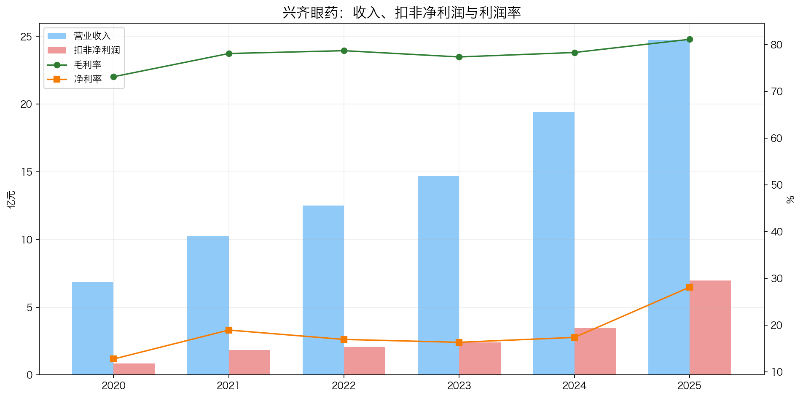
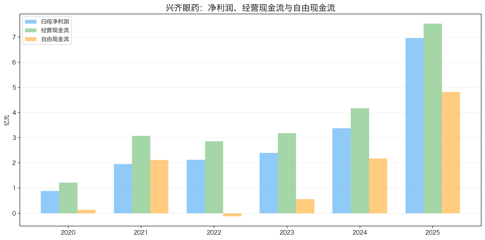
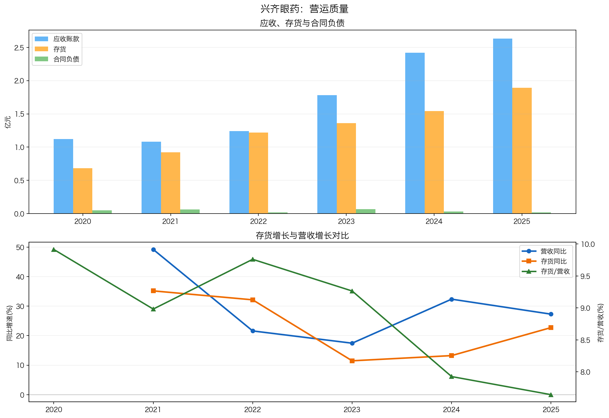
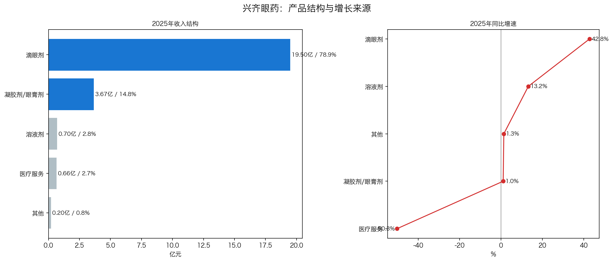
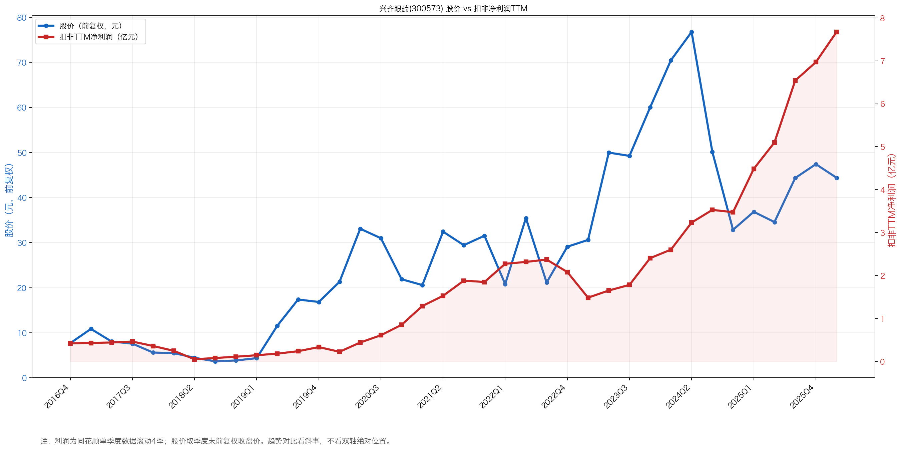
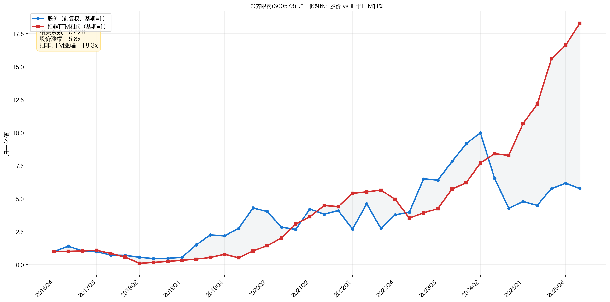
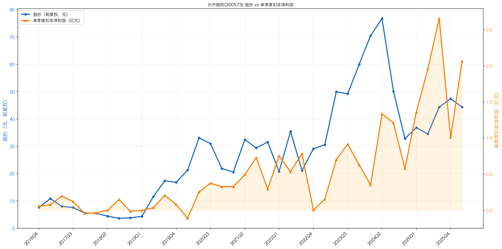

# 兴齐眼药投资分析报告（300573）

日期：2026-06-23  
最新行情口径：2026-06-22 收盘价 37.06 元，总市值 132.42 亿元，PE(TTM) 17.51 倍。  
结论先行：兴齐眼药是眼科处方药里少见的“产品放量 + 利润弹性 + 估值回落”组合，当前估值已进入历史低位；但核心矛盾是阿托品和环孢素高增长能否持续，以及未来竞品、政策降价和产品集中度风险。进一步核查后，“独家窗口期会消失、产品集中度放大波动”是实质风险。若按更严格口径，把滴眼剂高度集中、阿托品竞品即将获批视为护城河快速削弱，则综合评分下调为 70.0/100，评级：关注，但已接近“一般”边缘。

---

## 1. 公司画像：这门生意看得懂吗？

兴齐眼药是一家专注眼科药物研发、生产和销售的公司，核心产品从传统眼用凝胶、抗感染/抗炎眼药，逐步切换到两条高价值主线：

| 主线 | 核心产品 | 投资含义 |
|---|---|---|
| 近视防控 | 美欧品®硫酸阿托品滴眼液 | 0.01% 已于 2024 年获批；0.02%/0.04% 于 2026 年获批，形成梯度浓度产品矩阵，是最大边际变量 |
| 干眼治疗 | 兹润®环孢素滴眼液（Ⅱ） | 国内较早获批的治疗干眼环孢素眼用制剂，已纳入医保，具备处方药学术推广壁垒 |
| 眼科医疗服务 | 沈阳兴齐眼科医院 | 三级专业眼科医院，更多是临床、患者教育、真实世界研究和品牌协同平台，不是全国连锁医疗服务主资产 |

初筛结论：谨慎通过。

- 能力圈：业务逻辑相对清楚，核心是“眼科处方药研发注册 + 学术推广 + 医疗服务协同”。
- 红线：未见重大财务治理红线；但医药行业存在医保控费、集采、处方药合规推广风险。
- 后续重点：阿托品放量可持续性、竞品获批节奏、环孢素价格与份额、现金流能否持续覆盖高研发和分红。

---

## 2. 好行业：眼科处方药是不是好生意？

眼科药物需求具备长期性：近视、干眼、白内障/青光眼、眼底病等需求与老龄化、用眼方式变化、儿童青少年近视率相关。公司年报引用国家疾控局数据：2022 年我国儿童青少年总体近视率 51.9%，其中小学 36.7%、初中 71.4%、高中 81.2%。

| 维度 | 判断 |
|---|---|
| 需求质量 | 眼科疾病需求长期存在，近视防控和干眼均有长期患者基础，弱周期属性较强 |
| 竞争格局 | 药品端有注册和临床先发优势，但近视防控还要面对 OK 镜、离焦镜片、医疗服务机构和潜在药企竞品 |
| 进入壁垒 | 处方药注册、临床证据、医生教育、眼科渠道和生产质量体系构成壁垒 |
| 上下游议价权 | 处方药公司对终端有一定学术推广能力，但医保控费、招采和处方合规会压缩定价自由度 |
| 替代风险 | 阿托品可与 OK 镜/离焦镜片竞争或联用；干眼治疗也面临人工泪液、其他处方药和进口药竞争 |

评分：15.0/20

| 子项 | 得分 |
|---|---:|
| 需求质量/非周期性 | 5.5/6 |
| 竞争格局 | 2.0/4 |
| 进入壁垒 | 3.5/4 |
| 上下游议价权 | 2.0/3 |
| 替代品威胁 | 2.0/3 |
| 小计 | 15.0/20 |

---

## 3. 好公司·定性：有没有长期复利能力？

### 3.1 护城河

兴齐真正可确认的护城河主要是“先发注册 + 临床证据 + 处方渠道”的窗口期优势，而不是长期垄断型护城河。

- 阿托品：0.01% 已获批近视适应症，0.02%/0.04% 也已获批，形成浓度梯度产品矩阵。
- 环孢素：已进入医保，且完成上市后 IV 期研究，医生认知和处方路径更成熟。
- 医院协同：兴齐眼科医院可提供临床场景、患者教育和真实世界研究支持。

严格口径下，护城河要明显降权：一是 2025 年滴眼剂收入 19.50 亿元、占比 78.87%，年报虽未拆出阿托品单品，但增长逻辑高度依赖高毛利滴眼剂；二是若滴眼剂中大部分增量来自阿托品，则公司实际更接近“核心单品放量”而非多产品平台；三是恒瑞等企业阿托品上市申请已推进，兴齐的独家窗口期可能在 2026-2027 年明显收窄；四是近视防控还有 OK 镜、离焦镜片和眼科服务机构替代/分流；五是处方药价格体系受医保、招采和监管影响，不能按消费品定价权给高分。

### 3.2 复购和粘性

眼科慢病属性较强，近视防控、干眼治疗都有持续用药和复诊场景。尤其阿托品面向儿童近视进展延缓，不是一次性消费。但处方药受医生处方、患者依从性、长期安全性认知影响，复购粘性不能简单等同于消费品。

### 3.3 定价权

2025 年毛利率升至 81.16%，滴眼剂毛利率 85.12%，说明核心产品具备较强利润率。但医药产品定价权受到医保、招采、竞品和监管约束，不能按消费品定价权理解。

### 3.4 管理层

刘继东为公司董事长、实际控制人，2025 年末持股约 28.66%。管理层长期聚焦眼科药，主业专注度较高。需要持续观察高分红、研发投入和扩产之间的资本配置平衡。

评分：11.0/20

| 子项 | 得分 |
|---|---:|
| 护城河 | 3.0/7 |
| 复购/粘性/低替代性 | 4.0/5 |
| 定价权 | 1.5/5 |
| 管理层 | 2.5/3 |
| 小计 | 11.0/20 |

---

## 4. 好公司·定量：利润是不是真，增长是否健康？

### 4.1 ROE质量与盈利模式

| 年份 | 营收(亿) | 扣非净利(亿) | 毛利率 | 净利率 | 总资产周转率 | 权益乘数 | 简单ROE |
|---|---:|---:|---:|---:|---:|---:|---:|
| 2020 | 6.89 | 0.85 | 73.15% | 12.77% | 0.71 | 1.42 | 12.90% |
| 2021 | 10.28 | 1.85 | 78.11% | 18.97% | 0.61 | 1.26 | 14.51% |
| 2022 | 12.50 | 2.08 | 78.72% | 16.96% | 0.70 | 1.15 | 13.66% |
| 2023 | 14.68 | 2.40 | 77.38% | 16.35% | 0.73 | 1.20 | 14.20% |
| 2024 | 19.43 | 3.48 | 78.33% | 17.40% | 0.91 | 1.34 | 21.22% |
| 2025 | 24.73 | 6.97 | 81.16% | 28.14% | 0.97 | 1.28 | 35.19% |

结论：2025 年 ROE 大幅抬升主要来自净利率上升和资产周转率改善，不是靠加杠杆。权益乘数 1.28，资产负债率 22.10%，杠杆不高。最关键的是利润率跃升是否可持续：若阿托品放量后费用率摊薄继续兑现，ROE中枢可能上移；若竞品或降价出现，净利率可能回落。

### 4.2 利润增长来源与持续性

| 区间 | 扣非净利润变化 | CAGR | 判断 |
|---|---:|---:|---|
| 2020→2025 | 0.85亿 → 6.97亿 | 52.3% | 高增长，但早期基数较低 |
| 2022→2025 | 2.08亿 → 6.97亿 | 49.6% | 更能体现近三年核心产品放量 |
| 2024→2025 | 3.48亿 → 6.97亿 | 100.3% | 阿托品放量后利润弹性集中释放 |
| 2026Q1 TTM | 扣非TTM 7.67亿 | 同比继续上行 | 2026Q1 单季扣非 2.06亿，同比增长 51.72% |

增长来源主要来自滴眼剂放量。2025 年滴眼剂收入 19.50 亿元，占比 78.87%，同比增长 42.76%；凝胶剂/眼膏剂收入 3.67 亿元，占比 14.82%，同比仅增长 1.02%。这说明公司增长越来越依赖滴眼剂主线，尤其阿托品和环孢素。

### 4.3 现金流质量

| 年份 | 归母净利(亿) | 经营现金流(亿) | 资本开支(亿) | 自由现金流(亿) | 经营现金流/净利 | 自由现金流/净利 |
|---|---:|---:|---:|---:|---:|---:|
| 2020 | 0.88 | 1.22 | 1.08 | 0.14 | 138.67% | 15.91% |
| 2021 | 1.95 | 3.07 | 0.95 | 2.12 | 157.44% | 108.69% |
| 2022 | 2.12 | 2.86 | 2.99 | -0.13 | 134.91% | -6.13% |
| 2023 | 2.40 | 3.18 | 2.62 | 0.56 | 132.50% | 23.33% |
| 2024 | 3.38 | 4.17 | 1.99 | 2.18 | 123.37% | 64.50% |
| 2025 | 6.96 | 7.53 | 2.71 | 4.82 | 108.19% | 69.25% |

经营现金流长期高于净利润，这是加分项。扣分点在于资本开支不低，2022-2025 年持续建设投入，自由现金流/净利润波动较大；同时公司分红力度提升，未来需要验证自由现金流能否同时覆盖研发、扩产和分红。

### 4.4 现金头寸与资产负债表安全性

2025 年报口径：

| 项目 | 金额 |
|---|---:|
| 货币资金 | 3.94亿 |
| 交易性金融资产 | 0 |
| 其他流动资产 | 0.05亿，主要为待抵扣/待认证进项税和预缴所得税，不计入现金头寸 |
| 一年内到期租赁负债 | 0.08亿 |
| 长期借款/应付债券 | 0 |
| 租赁负债 | 约0.04亿；应与一年内到期租赁负债一并扣除 |

现金头寸约 3.82-3.86 亿元，每股约 1.07-1.08 元；扣现金后市值约 128.6 亿元，扣现金后 PE 约 16.8 倍。安全垫存在，但占市值比例较小，不属于“现金远大于负债、扣现金估值显著重估”的类型。

### 4.5 营运质量：应收、存货、合同负债

| 年份 | 营收(亿) | 营收同比 | 应收账款(亿) | 存货(亿) | 存货同比 | 存货/营收 | 合同负债(亿) |
|---|---:|---:|---:|---:|---:|---:|---:|
| 2020 | 6.89 | - | 1.12 | 0.68 | - | 9.9% | 0.05 |
| 2021 | 10.28 | 49.2% | 1.08 | 0.92 | 35.3% | 8.9% | 0.06 |
| 2022 | 12.50 | 21.6% | 1.24 | 1.22 | 32.6% | 9.8% | 0.02 |
| 2023 | 14.68 | 17.4% | 1.78 | 1.36 | 11.5% | 9.3% | 0.07 |
| 2024 | 19.43 | 32.4% | 2.42 | 1.54 | 13.2% | 7.9% | 0.03 |
| 2025 | 24.73 | 27.3% | 2.63 | 1.89 | 22.7% | 7.6% | 0.02 |

应收和存货随收入扩大上升，但整体没有明显失控。2020-2025 年营收 CAGR 约 29.1%，存货 CAGR 约 22.7%，存货增速低于营收；存货/营收也从 2020 年 9.9% 降至 2025 年 7.6%。2022 年存货增速一度高于营收，需要解释为扩产/备货或产品结构变化，但 2023-2025 年没有继续恶化。合同负债很小，对未来收入蓄水池的参考价值有限。2025 年经营现金流表现较强，暂未看到压货冲收入的强证据；后续重点观察竞品上市后，若收入放缓但存货继续快增，才是更明确的风险信号。

### 4.6 产品结构与增长来源

| 产品/业务 | 2025收入 | 占比 | 同比 | 毛利率 |
|---|---:|---:|---:|---:|
| 滴眼剂 | 19.50亿 | 78.87% | 42.76% | 85.12% |
| 凝胶剂/眼膏剂 | 3.67亿 | 14.82% | 1.02% | 84.52% |
| 溶液剂 | 0.70亿 | 2.83% | 13.17% | 未披露 |
| 医疗服务 | 0.66亿 | 2.67% | -50.26% | 未披露 |
| 其他 | 0.20亿 | 0.81% | 1.33% | 未披露 |

结论：公司已经从多品类眼科药企业，变成明显由滴眼剂驱动的高弹性公司。好处是高毛利大单品放量带来利润弹性；风险是产品集中度明显上升。若滴眼剂中大部分是阿托品，则公司对单一产品的依赖要比年报剂型表看起来更高，恒瑞等竞品获批后，价格、份额和医生处方迁移都会直接影响利润中枢。

评分：29.0/40

| 子项 | 得分 |
|---|---:|
| ROE质量与盈利模式 | 7.5/9 |
| 利润增长来源与持续性 | 5.5/7 |
| 现金流质量 | 6.0/7 |
| 现金头寸与资产负债表安全性 | 3.0/6 |
| 营运质量 | 3.5/5 |
| 产品结构与增长来源 | 3.0/6 |
| 小计 | 29.0/40 |

---

## 5. 好时机：现在买贵不贵？

### 5.1 股价 vs 利润线

图表结论：

- 2019-2021：股价先于利润上涨，市场提前交易眼科药和阿托品预期，估值扩张明显。
- 2022-2023：利润仍增长，但股价震荡，市场开始消化高估值和研发/商业化不确定性。
- 2024：股价一度大幅冲高，阿托品获批预期和放量逻辑被充分交易，阶段性透支。
- 2025-2026Q1：扣非TTM从 3.48 亿上升到 7.67 亿，利润继续创新高，但股价从高位明显回落，估值出清较充分。

关键判断：当前不是“利润下行、PE低”的价值陷阱，而是“利润继续上行、股价回落”的预期差阶段。但预期差能否兑现，取决于 2026-2027 年阿托品放量是否持续、价格是否稳定、竞品是否加速获批。

### 5.2 PE及PE百分位

| 指标 | 当前值 |
|---|---:|
| 最新收盘价 | 37.06元 |
| 总市值 | 132.42亿 |
| PE(TTM) | 17.51倍 |
| 可用历史区间 | 2018-01-02 至 2026-06-22 |
| PE历史百分位 | 约0.5% |
| 扣非TTM | 7.67亿 |
| 现金头寸 | 3.86亿 |
| 扣现金后PE | 16.75倍 |

当前 PE 处于上市以来极低区域，价格已经较大程度反映了市场对高增长持续性的怀疑。需要注意：PE低不是单独买入理由，核心还是利润TTM不能在未来几个季度掉头。

### 5.3 PEG

按 2022→2025 扣非净利润 CAGR 约 49.6% 计算，PEG = 17.51 / 49.6 ≈ 0.35。表面非常便宜，但由于 2025 年存在阿托品放量后的利润跃迁，历史 CAGR 不能简单外推。PEG只能作为“估值未明显透支”的辅助证据，不能作为高分买入信号。

### 5.4 股息率

2025 年度分配预案为每 10 股派 10 元，预计分红金额约 2.46 亿元；按当前市值约 132.42 亿元，对应年度预案现金分红收益率约 1.86%。若加上 2025 年中期分红，完整财年现金回报更高，但需注意不同股本和除权口径。公司分红意愿较强，但医药成长股更重要的是研发和商业化再投入效率。

### 5.5 市场信号与预期差

同行估值对比：

| 公司 | 市值(亿) | PE(TTM/动态口径) | PB |
|---|---:|---:|---:|
| 爱尔眼科 | 791.73 | 23.49 | 3.44 |
| 华厦眼科 | 136.92 | 29.60 | 2.52 |
| 普瑞眼科 | 49.52 | -282.08 | 2.34 |
| 何氏眼科 | 25.32 | 92.08 | 1.32 |
| 欧普康视 | 99.20 | 21.31 | 1.96 |
| 爱博医疗 | 74.86 | 28.26 | 2.61 |
| 兴齐眼药 | 132.42 | 17.51 | 6.06 |

兴齐 PE 低于多数眼科医疗/器械可比公司，但 PB 较高，说明市场仍认可其高ROE和高利润率，只是对增长持续性打折。

### 5.6 毛估估

不做乐观档，只看中性和保守：

| 情景 | 假设 | 对应市值 | 相对当前空间 |
|---|---|---:|---:|
| 中性档 | 2028年扣非利润约9.5亿，合理PE 22倍 | 约209亿 | 约+58% |
| 保守档 | 扣非利润回落/停滞在7.0-7.5亿，合理PE 15倍 | 约105-113亿 | 约-15%~-21% |

毛估估结论：当前赔率开始有吸引力，上行取决于利润是否维持增长；下行风险主要来自利润不达预期导致 PE 和利润双杀。

### 5.7 关键风险因子校验：阿托品是否已从“垄断故事”进入“竞争兑现期”？

| 风险点 | 校验结论 | 对投资判断的影响 |
|---|---|---|
| 利好出尽、预期兑现 | 部分属实。股价在 2019-2024 年明显领先利润，2024 年阿托品获批前后市场已充分交易放量逻辑；但“未来3-5年全部兑现”属于市场解释，无法精确证明。 | 解释了估值从高位回落；当前不能按“新故事”给估值，只能按已兑现利润和未来增速验证。 |
| 集采降价至19.8元/盒 | 暂未找到官方文件支撑。核查广东省药品交易中心官网 2025 年 5 月前后公告，未找到“广东等19省联盟将硫酸阿托品滴眼液纳入、最高有效申报价19.8元/盒”的官方文件。历史 298 元/盒价格有媒体和终端线索，但也缺少公司公告直接确认。 | 不能把“93%降价”作为基准情景；但眼科处方药受招采/医保控费影响是真风险。若未来出现官方大幅降价文件，需要立即重估利润率。 |
| 独家垄断地位消失 | 部分属实。兴齐的优势更准确说是“药品注册和商业化先发窗口期”，不是永久垄断。恒瑞硫酸阿托品滴眼液上市申请已获受理；何氏眼科、爱尔眼科更多是院内制剂/医疗机构制剂线索；欧康维视等处于管线/临床或待进一步核验阶段。 | 这是核心风险。2026-2027 年若多个 NMPA 药品获批，兴齐的份额、价格和医生处方优势都会被重新定价。 |
| 140倍PE回归 | 大体属实。2024 年高点按当时市值和上一年利润估算，静态 PE 曾在 140 倍以上量级。 | 说明高估值阶段确实透支预期；当前低 PE 是估值出清后的结果，但不等于无风险。 |
| 90%+利润来自阿托品 | 无法验证。公司年报披露到剂型/业务，不披露阿托品单品收入和利润；2025 年滴眼剂收入19.50亿，占主营收入78.87%，毛利率85.12%，不能直接等同于阿托品。 | 不能写成事实；更严谨表述是“利润增长高度依赖高毛利滴眼剂，阿托品是关键增量品种”。 |

修正后的基准判断：不把“19.8元/盒集采”纳入基准估值，但把“先发窗口期消退 + 潜在竞品获批 + 价格体系受政策约束”作为主要折价因素。若官方集采/联盟采购文件明确低浓度阿托品大幅降价，或新增竞品上市后兴齐毛利率、净利率、收入增速同步下滑，则本报告的“关注”评级需要下调。

评分：15.0/20

| 子项 | 得分 |
|---|---:|
| 股价vs利润线 | 4.0/5 |
| PE及PE百分位 | 4.5/5 |
| PEG | 1.5/2 |
| 股息率 | 2.0/3 |
| 市场信号与预期差 | 1.5/2 |
| 毛估估 | 1.5/3 |
| 小计 | 15.0/20 |

---

## 6. 投资结论：值不值得下注，拿不拿得住？

### 6.1 胜率

胜率中高。原因是行业需求长期存在，公司核心产品具备先发优势，2025-2026Q1 利润和现金流已经开始兑现。但胜率不是极高，因为近视防控和干眼赛道都会吸引竞品，公司未来几年增长高度依赖核心产品持续放量。

### 6.2 赔率

赔率较好。PE 17.5 倍、历史分位约 0.5%，对应扣非TTM 仍在上行，这是当前最有吸引力的地方。保守档下行约 15%-21%，中性档上行约 58%，赔率开始偏划算。

### 6.3 长期持有检查项

| 检查项 | 判断 |
|---|---|
| 长期需求是否存在 | 是，近视防控、干眼、眼科慢病需求长期存在 |
| 护城河是否会增强 | 不确定，取决于竞品获批后兴齐能否守住医生认知、处方渠道和价格体系；若竞品快速放量，护城河可能继续削弱 |
| 是否不需要持续烧钱 | 目前经营现金流良好，但研发和扩产仍需投入 |
| 管理层是否专注 | 是，长期聚焦眼科主业 |
| 即使PE不扩张是否能赚钱 | 若扣非利润能维持中高个位数以上增长，可以；若利润回落，则不行 |

### 6.4 评级与行动

总分 70.0/100，对应评级：关注，但已接近“一般”边缘。

行动建议：

- 可纳入重点观察池，适合继续跟踪而不是简单排除。
- 若未来 2-3 个季度扣非TTM继续上行、阿托品放量稳定、毛利率和现金流不恶化，则可上调到“强烈关注”。
- 若股价反弹导致 PE 回到 25-30 倍以上，而利润增速开始放缓，赔率会明显下降。

---

## 7. 投资逻辑与证伪条件

### 7.1 投资逻辑

1. 好行业：眼科处方药需求长期存在，近视防控和干眼治疗具备弱周期属性。
2. 好公司：兴齐在阿托品和环孢素两个细分方向具备注册、临床和学术推广先发优势。
3. 利润兑现：2025 年扣非净利润 6.97 亿，2026Q1 扣非TTM 7.67 亿，利润弹性已开始体现。
4. 估值出清：当前 PE(TTM) 17.51 倍，历史百分位约 0.5%，股价没有跟上利润线，形成预期差。
5. 现金流验证：2025 年经营现金流 7.53 亿，自由现金流 4.82 亿，利润质量较好。

### 7.2 证伪条件

出现以下情况，需要重新判断：

- 阿托品收入增速明显放缓，或新浓度产品未形成有效放量。
- 低浓度阿托品竞品快速获批并引发价格战或医生处方迁移。
- 环孢素受医保控费、竞品或价格压力影响，毛利率/净利率持续下滑。
- 应收账款和存货连续多个季度快于收入增长，经营现金流/净利润明显低于 80%。
- 研发投入不能形成新产品梯队，增长过度依赖阿托品单品。
- 管理层开始脱离眼科主业进行高价并购或激进扩张。
- PE回升但扣非TTM不再增长，赔率被快速消耗。

---

## 8. 维度打分汇总表

| 模块 | 得分 |
|---|---:|
| 好行业 | 15.0/20 |
| 好公司·定性 | 11.0/20 |
| 好公司·定量 | 29.0/40 |
| 好时机 | 15.0/20 |
| 总分 | 70.0/100 |

评级：关注，但已接近“一般”边缘。

### 8.1 评分复核说明

这次复核的核心结论是：原评分方向没有错，但明显偏乐观，尤其是把“2025年利润跃迁”和“当前PE极低”给了过多确定性。进一步按严格口径处理阿托品竞争、政策价格风险和滴眼剂/阿托品集中度后，总分从 79.5 下调到 70.0，评级仍为“关注”，但已经接近“一般”边缘。

| 调整项 | 原评分 | 复核后 | 原因 |
|---|---:|---:|---|
| 好行业 | 16.0 | 15.0 | 近视防控竞争不只来自药企，还来自OK镜、离焦镜片和眼科服务渠道；医保/招采对议价权有约束 |
| 好公司·定性 | 16.5 | 11.0 | 严格口径下，兴齐更像“阿托品先发窗口期”而非长期垄断型公司；恒瑞等竞品即将获批会削弱护城河，政策/招采约束也显著压低定价权 |
| 好公司·定量 | 32.0 | 29.0 | 2025年ROE和利润跃升质量较好，但持续性仍需验证；现金头寸占市值比例小，滴眼剂占比约79%，若其中大部分为阿托品，则产品结构集中度风险需要进一步扣分 |
| 好时机 | 15.0 | 15.0 | 低PE和利润线背离确实构成预期差，但毛估估仍依赖未来利润不回落，因此维持原评分 |

---

## 9. 总结

兴齐眼药不是传统意义上“低估值稳健白马”，而是“核心新品放量后的高利润弹性公司”。当前最吸引人的地方是：利润TTM仍在上行，但股价已从高位明显回落，PE处于历史极低分位。

但这笔投资不能只看低PE。真正要跟踪的是：阿托品是否持续放量、环孢素是否守住高毛利、竞品和政策是否改变价格体系、现金流是否继续覆盖研发和分红。若这些指标继续验证，当前价格具备较好的赔率；若利润线掉头，低PE会迅速变成陷阱。

一句话结论：公司质量不错，价格开始有吸引力，但仍需用未来几个季度验证阿托品放量的持续性。

---

## 10. 数据校验结果

| 校验项 | 结果 | 说明 |
|---|---|---|
| 营收/利润/扣非 | 正确 | 同花顺导出、同花顺年度表、年报关键数一致：2025营收24.73亿，扣非6.97亿 |
| 季度利润 | 正确 | 2025四个季度扣非合计约6.97亿，与全年一致 |
| 毛利率/净利率 | 正确 | 2025毛利率81.16%，净利率28.14%，由年度表重算 |
| 经营现金流/自由现金流 | 正确 | 2025经营现金流7.53亿，资本开支2.71亿，自由现金流4.82亿 |
| 资产负债率 | 正确 | 2025资产负债率22.10% |
| 现金头寸 | 已校验年报附注 | 其他流动资产为待抵扣进项税/预缴所得税，不计入现金；应收款项融资不计入现金 |
| 股价/市值/PE | 正确 | 东方财富估值历史：2026-06-22 收盘价37.06元，总市值132.42亿，PE(TTM)17.51倍 |
| PE百分位 | 正确 | 可用区间2018-01-02至2026-06-22，当前PE分位约0.5%；上市不足十年，取可用最长区间 |
| 图片链接 | 正确 | 报告内图片均位于 ../charts/ |
| 打分汇总 | 已复核修正 | 15.0 + 11.0 + 29.0 + 15.0 = 70.0 |

主要数据来源：

- 公司2025年年度报告、2024年年度报告、2023年年度报告（巨潮资讯）
- 公司阿托品、环孢素相关公告（巨潮资讯）
- 同花顺导出文件：data/300573_main_simple.xls
- AkShare/东方财富估值历史与财务数据
- yfinance 300573.SZ 前复权股价
