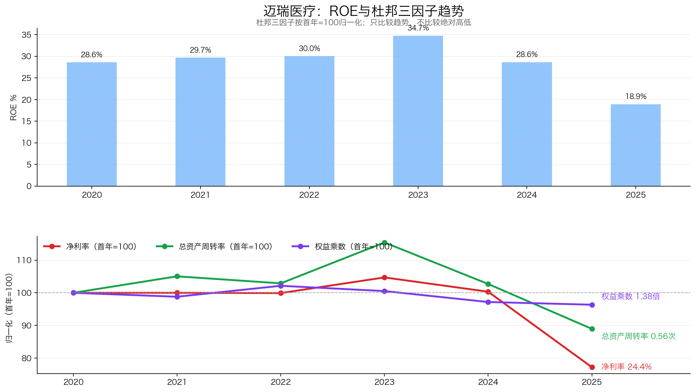
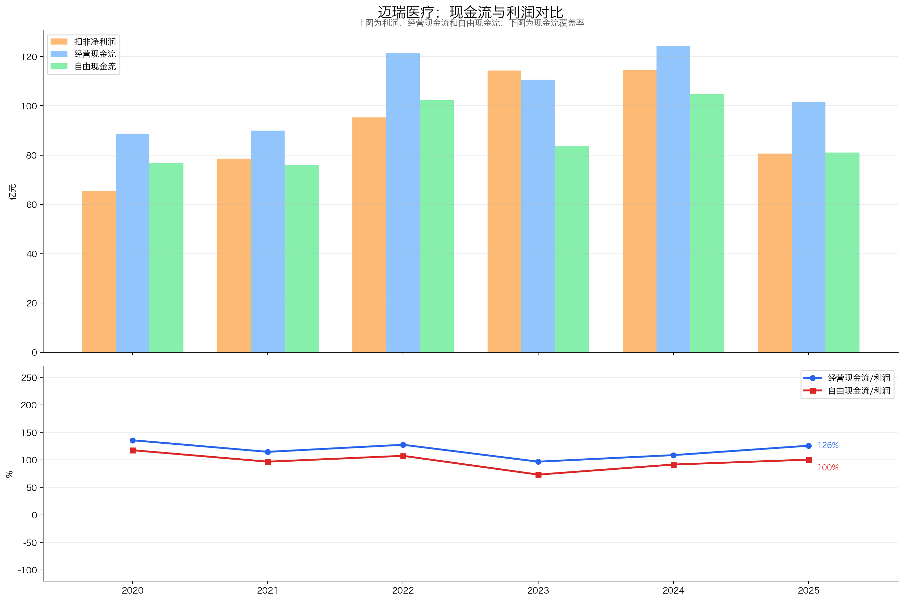
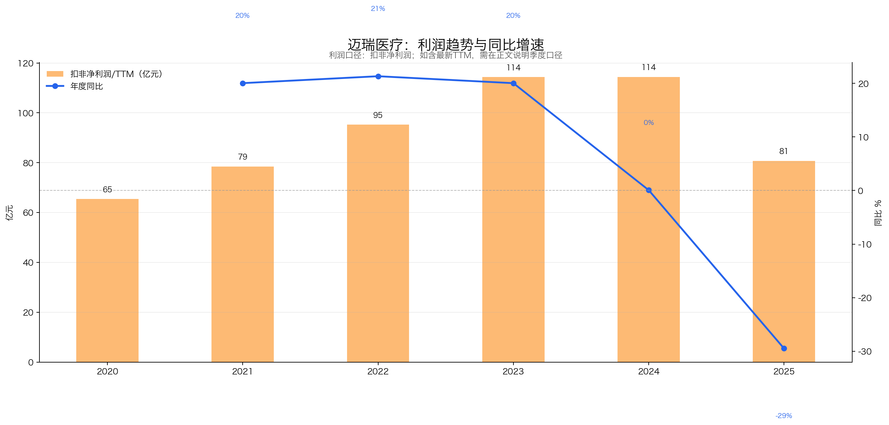
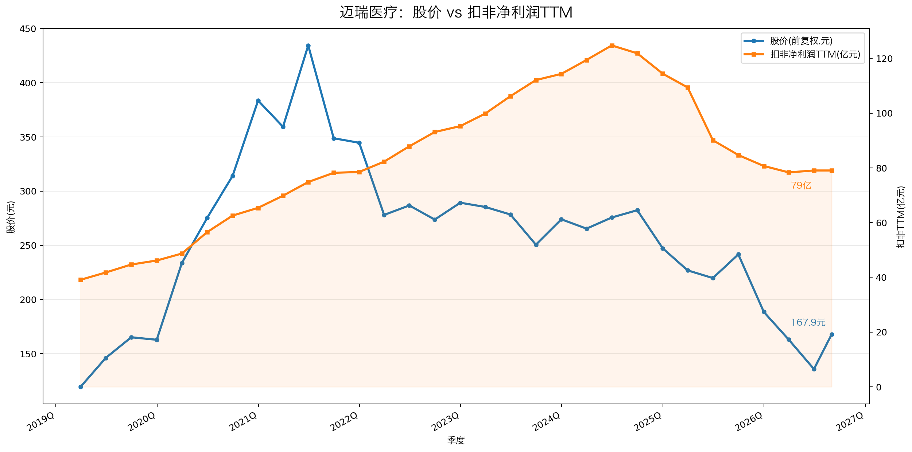

# 迈瑞医疗（300760）3R投资分析简报

> 数据截止：行情截至2026-07-07收盘；财务截至2026Q1；年度数据截至2025年报。  
> 3R总分：**75.5/100**  
> 当前评级：**关注；好公司底色仍在，等待利润拐点**  
> 一句话结论：**迈瑞是研发、注册、产品平台和全球渠道壁垒较深的医疗器械龙头，现金流和资产负债表仍强，但2025年至2026Q1利润继续下行；历史低估值只能提高赔率，不能替代拐点确认。**

## 一、公司概况：这家公司靠什么赚钱？

| 项目 | 内容 |
|---|---|
| 主营业务 | 体外诊断、生命信息与支持、医学影像及新兴业务 |
| 核心产品 | IVD仪器与试剂、监护/麻醉/呼吸设备、超声、DR、微创外科与介入产品 |
| 赚钱方式 | 依靠研发注册、产品矩阵、设备装机、试剂复购、医院渠道、售后服务和全球化平台 |
| 客户与场景 | 医院、检验科、ICU、手术室、影像科、基层医疗与海外医疗机构 |
| 行业位置 | 中国医疗器械平台型龙头，多项产品位居中国第一或全球前列 |
| 实际控制与经营 | 创始团队长期聚焦医疗器械，平台化研发和全球渠道主导竞争力 |
| 报告基准日价格 | 138.17元，总市值约1,675亿元 |

迈瑞不是单一设备公司。成熟设备带来装机和服务网络，IVD兼具仪器与试剂复购，新兴业务提供第二曲线，研发注册和全球渠道将这些产品放到同一平台上。长期价值来自平台复用；短期盈利则高度受国内医院采购、IVD集采和医疗控费影响。

## 二、3R决策摘要

| 维度 | 得分 | 核心判断 |
|---|---:|---|
| Right Business | 45.0/60 | 平台壁垒和现金流较强，定价权与最新盈利趋势明显扣分 |
| Right People | 16.5/20 | 主业聚焦、研发执行力强，并购商誉提高资本配置要求 |
| Right Price | 14.0/20 | 估值处上市以来低位，但利润仍未企稳 |
| **总分** | **75.5/100** | **关注；处于评级下沿，等待经营确认** |

- **当前最大矛盾**：现金流、净现金和平台壁垒仍好，但2025年扣非利润下降29.48%，2026Q1扣非TTM继续降至78.34亿元。
- **关键验证条件**：扣非TTM止跌，三大成熟业务至少两项恢复增长，新兴业务增长不牺牲利润率。
- **门槛判断**：3R均超过最低门槛；总分按独立3R评级为“观察”，不能沿用完整报告的“关注”标签。

## 三、Right Business：长期壁垒深，短期利润和定价权承压

### 3.1 评分概览

| 维度 | 得分 | 满分 | 核心判断 |
|---|---:|---:|---|
| 业务简单可持续、不易被替代 | 11.0 | 14 | 医疗需求长期存在，采购和政策周期造成明显波动 |
| 竞争格局清晰、护城河深厚、有定价权 | 13.5 | 18 | 平台壁垒深，但医保、集采和招标压制定价权 |
| 轻资本投入、高资产回报率、自由现金流好 | 12.5 | 14 | 历史ROE和FCF优秀，2025盈利效率下降且商誉较高 |
| 盈利成长真实、稳定、可持续 | 3.5 | 8 | 2020—2023增长强，2024失速、2025大幅下滑 |
| 有长期增长空间 | 4.5 | 6 | 国产替代、海外和新兴业务有空间，兑现尚不充分 |
| **Right Business** | **45.0** | **60** | **好生意底色仍在，处于经营下行验证期** |

### 3.2 业务持续性：医疗刚需长期存在，采购节奏并不稳定

诊疗、检验、重症和影像需求长期存在，老龄化、医疗质量提升和基层能力建设提供底层需求。设备采购受医院资本开支和财政节奏影响，IVD还受集采、DRG/DIP和检验互认影响，因此不是消费品式稳定复利。产品品类低替代，但品牌和供应商之间仍会竞争。

| 具体指标 | 判断依据 | 得分 |
|---|---|---:|
| 商业模式是否简单、容易理解 | 四大业务清晰，但政策、临床和产品技术较复杂 | 4.0/5 |
| 需求是否长期存在 | 医疗设备、检验和诊疗需求长期存在 | 4.5/5 |
| 周期性是否可控 | 医院采购、财政和政策周期扰动明显 | 1.0/2 |
| 产品或品类替代风险 | 品类不易消失，技术迭代与品牌替换持续 | 1.5/2 |
| **小计** |  | **11.0/14** |

### 3.3 护城河与定价权：平台能力真实，国内价格权明显受限

研发与注册、多产品线、医院渠道、装机基础、售后服务和全球本地化构成综合壁垒。IVD的仪器装机与试剂复购、数智方案嵌入工作流还能提高粘性。迈瑞在国内平台化地位突出，但高端市场仍面对跨国巨头。

护城河不等于强定价权。国内医院招投标、医保控费和集采增强下游议价能力，2025年三大成熟业务分别下降9.41%、19.80%和18.02%，说明公司优势无法完全抵消政策与采购周期。

| 具体指标 | 判断依据 | 得分 |
|---|---|---:|
| 行业竞争格局 | 国内平台龙头突出，各细分赛道仍有国内外强敌 | 3.0/4 |
| 公司行业位置和份额 | 综合规模领先，多项产品居国内第一或全球前列 | 2.5/3 |
| 护城河深度与持续性 | 研发注册、产品矩阵、渠道、装机和服务壁垒深 | 5.5/6 |
| 定价权和成本传导 | 医保、集采和招标显著限制价格权 | 2.5/5 |
| **小计** |  | **13.5/18** |

### 3.4 资本回报与现金流：现金流仍硬，盈利效率明显回落

2020—2023年简单ROE由28.59%升至34.73%，主要依靠30%以上净利率和较好周转，不依赖高杠杆。2025年ROE降至18.92%，净利率由31.77%降至24.44%，资产周转率由0.65降至0.56，说明利润率和资产效率共同恶化。

2025年经营现金流101.45亿元、自由现金流81.07亿元，分别为净利润的124.70%和99.65%，利润回款质量仍好。资产负债率27.43%、现金头寸约179.37亿元、长期借款几乎可忽略；反面是商誉约114亿元，主要并购资产的回报和减值风险需要持续跟踪。

| 具体指标 | 判断依据 | 得分 |
|---|---|---:|
| 资本投入强度与产能利用率 | 制造资本强度适中，研发与并购投入较高 | 3.5/4 |
| ROE/ROIC水平及历史趋势 | 历史高回报，2025降至18.92%且趋势转弱 | 3.0/4 |
| 杠杆依赖与杜邦质量 | 权益乘数约1.38，不靠杠杆维持ROE | 2.0/2 |
| 经营现金流和自由现金流 | 2025年CFO和FCF均覆盖利润 | 4.0/4 |
| **小计** |  | **12.5/14** |

### 3.5 盈利成长：已从高增长切换到利润下台阶

2020—2023年扣非利润由65.40亿元增至114.34亿元，连续三年约20%增长；2024年仅增长0.07%，2025年下降29.48%，2026Q1扣非TTM进一步降至78.34亿元。新兴业务增长38.85%，但体量仅占16.21%，不足以抵消三大成熟业务同步下降。

| 具体指标 | 判断依据 | 得分 |
|---|---|---:|
| 3年、5年利润增长 | 长期曾高增，但2022—2025三年CAGR已为负 | 0.5/2 |
| 增长稳定性 | 2024失速、2025大幅下降 | 0.5/1 |
| 增长来源质量 | 新兴业务真实增长，尚不足抵消成熟业务 | 1.0/2 |
| 最新利润趋势 | 2026Q1扣非TTM继续下行 | 0.5/2 |
| 利润与现金流匹配 | CFO与FCF仍充分覆盖利润 | 1.0/1 |
| **小计** |  | **3.5/8** |

### 3.6 长期空间：跑道仍在，必须由利润而非故事验证

国产替代、海外市场、高端突破、新兴业务和数智医疗均提供空间。问题不在行业有没有想象力，而在成熟业务能否恢复、新兴业务能否贡献利润，以及并购和研发投入是否维持高回报。

| 具体指标 | 判断依据 | 得分 |
|---|---|---:|
| 核心业务和行业空间 | 医疗需求、国产替代和高端化空间长期存在 | 1.5/2 |
| 市场份额提升空间 | 平台和渠道支持提份额，政策价格压力并存 | 1.5/2 |
| 地域扩张与第二曲线 | 海外与新兴业务提供明确跑道 | 1.0/1 |
| 再投资回报及增长质量 | 商誉较高，新兴业务利润未完整披露 | 0.5/1 |
| **小计** |  | **4.5/6** |

## 四、Right People：研发和平台化能力强，并购回报需要验证

| 维度 | 判断 | 决定性证据 | 得分 |
|---|---|---|---:|
| 诚信与治理 | 基本符合 | 未见重大治理红线，持续分红 | 5.0/6 |
| 专注与经营能力 | 较强 | 长期聚焦医疗器械，研发、产品和全球渠道执行力强 | 6.0/7 |
| 资本配置与股东利益 | 基本符合 | 上市后未再融资、分红积极；惠泰等并购带来约114亿元商誉 | 5.5/7 |
| **Right People** |  |  | **16.5/20** |

管理层长期专注主业，并建立平台化研发和全球渠道，这是公司护城河的重要组成。2025年分红53.10亿元、分红率65.27%，体现股东回报；但并购整合和高商誉提高了资本配置难度，不能只看收入扩张而忽略ROIC和减值风险。

## 五、Right Price：估值极低，但价格门槛不能替代利润门槛

| 维度 | 判断 | 决定性证据 | 得分 |
|---|---|---|---:|
| 利润位置与股价利润匹配度 | 一般 | 股价已大幅调整，扣非TTM仍在下行 | 3.0/5 |
| 当前估值与历史位置 | 有吸引力 | 扣非PE约21.4倍、上市以来约1.1%分位、扣现金后约19.1倍 | 5.5/6 |
| 股息及持有回报 | 基本符合 | 股息率约3.17%，FCF覆盖分红 | 2.0/3 |
| 保守/中性情景与赔率 | 一般 | 保守下行约16%，中性需利润恢复才有18%空间 | 3.5/6 |
| **Right Price** |  |  | **14.0/20** |

| 估值指标 | 报告基准日 |
|---|---:|
| 收盘价 / 市值 | 138.17元 / 约1,675亿元 |
| 扣非PE-TTM | 约21.4倍 |
| 扣现金后PE | 约19.1倍 |
| 上市以来PE分位 | 约1.1% |
| 静态股息率 | 约3.17% |

| 独立情景（3年） | 假设 | 期末市值 | 价格回报 / 含静态股息累计回报 |
|---|---|---:|---:|
| 保守 | 扣非利润年降3%、期末16倍PE | 约1,144亿元 | -31.7% / 约-22.2% |
| 中性 | 扣非利润年增5%、期末22倍PE | 约1,995亿元 | +19.1% / 约+28.6% |

上市以来低分位和179亿元现金头寸使赔率开始可讨论，但中性、乐观情景都依赖利润恢复。若利润继续下滑，20倍PE仍可能压缩；因此当前价格是观察理由，不是重仓理由。

## 六、最终行动

### 现在怎么办？
- 放入重点观察池，等待利润拐点；已有合理仓位可观察，不仅因历史低PE加仓。

### 什么情况下提高关注？
- 扣非TTM止跌，三大成熟业务至少两项恢复正增长；
- 新兴业务继续增长且毛利率、现金流不恶化；
- 存货随收入恢复而改善，CFO持续覆盖利润和分红。

### 什么情况下说明判断错了？
- 2026年扣非利润继续双位数下降，净利率跌破2025年水平；
- 新兴业务放缓、成熟业务仍同步下降；
- 存货和应收恶化，或并购资产发生大额商誉减值。

## 七、数据边界

- **引用的完整报告**：`迈瑞医疗_投资分析报告_2026-07-07.md`；仅复用其中财务、业务、治理、估值数据与图表。
- **行情口径**：沿用原报告2026-07-07收盘数据，故称“报告基准日价格”。
- **本地补充**：复用2025年报校验结果、`annual_core.csv`、估值摘要及现有图表。
- **外部补充**：无；未刷新行情或竞争对手数据。
- **未验证事项**：新兴业务内部利润率、2026Q1 TTM在半年报后的复核、惠泰等并购资产ROIC、海外高端产品份额。
- **盲评说明**：评分前已屏蔽原报告所有得分、评级、方向性评价、毛估估情景和行动建议；3名隔离上下文评估器逐项评分，本报告采用逐项中位数，75.5分在查看旧分前锁定。
- **评分差异说明**：锁定后与原报告对照，差异来自3R固定权重与盲评证据充分度，不据此回调分数。

---

*本简报仅供学习研究，不构成投资建议。*
