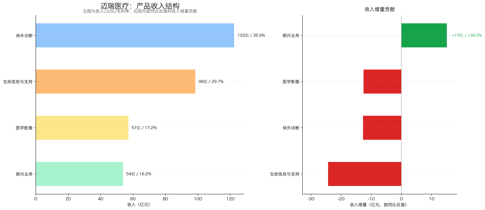
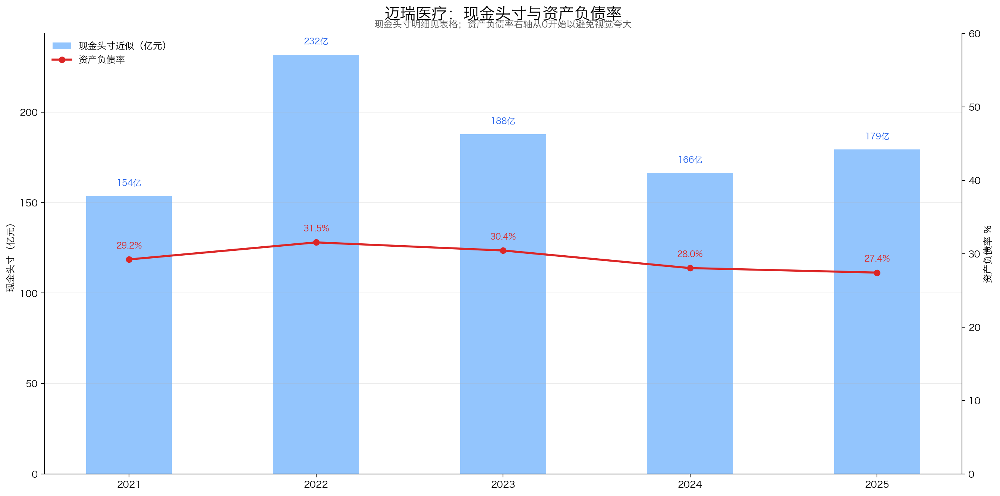
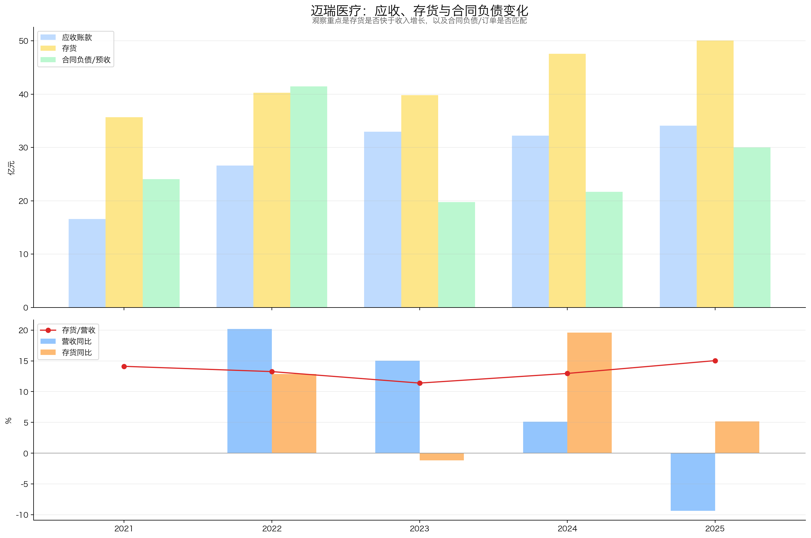

# 迈瑞医疗（300760.SZ）投资分析报告

> 结论先行：迈瑞医疗仍是A股医疗器械里少数“平台型龙头”：产品线覆盖体外诊断、生命信息与支持、医学影像、新兴业务，全球化和研发平台是真壁垒；但2025年不是正常高增长年份，营收、扣非净利润、ROE均明显下行，核心原因是国内医疗设备采购、IVD集采和医疗控费共振。按2026-07-07收盘价138.17元、市值约1,675亿元、扣非TTM约78.34亿元测算，PE(TTM)约21.4倍，上市以来PE分位约1.1%，估值已到历史低位；问题不在“贵”，而在利润何时企稳。当前评级：关注，适合放入观察池，等待扣非TTM和国内业务恢复信号。

数据日期：2026-07-07  
公司代码：300760.SZ  
股价：138.17元  
市值：约1,675亿元  
PE(TTM，扣非口径近似)：约21.4倍  
PB：约4.18倍  
2026Q1扣非TTM：约78.34亿元  
2025年现金头寸：约179.37亿元  
扣现金后PE：约19.1倍  
2025年现金分红：约53.10亿元，按当前市值股息率约3.17%  
评级：关注  
总分：73 / 100

重要口径说明：
- 财务数据主要来自东方财富API；产品结构、现金头寸和分红来自2025年年报PDF复核。
- 2026Q1数据来自东方财富利润表累计值转换为单季度，并滚动计算TTM。
- 现金头寸按彼得林奇简化口径：货币资金 + 交易性金融资产 - 长期借款；其他流动资产经年报附注复核，主要是待抵扣/认证进项税、预缴税金和其他，不计入现金头寸。
- PE百分位因公司2018年上市，取上市以来可用区间（2018-10-16至2026-07-07），不足十年。
- 本报告不使用券商预测。

---

## 一、先判断能不能研究：公司画像 + 能力圈 + 红线

### 1.1 公司画像

迈瑞医疗是中国医疗器械平台型龙头，业务本质是“医疗设备 + 试剂耗材 + 数智化解决方案”的全球化供应商。

| 层级 | 业务 | 2025收入 | 同比 | 本质 |
|---|---:|---:|---:|---|
| 第一层 | 体外诊断 | 122.41亿元 | -9.41% | 仪器装机 + 试剂复购，长期看国产替代与海外突破 |
| 第二层 | 生命信息与支持 | 98.37亿元 | -19.80% | 监护、麻醉、呼吸、手术室等设备，偏资本开支属性 |
| 第三层 | 医学影像 | 57.17亿元 | -18.02% | 超声和DR，高端化和海外高端突破是关键 |
| 第四层 | 新兴业务 | 53.78亿元 | +38.85% | 微创外科、微创介入、动物医疗等第二曲线 |

一句话：迈瑞不是单品公司，而是医疗器械平台公司；长期优势在研发、注册、渠道、装机、服务和全球化组织能力。

### 1.2 能力圈判断

能力圈：谨慎通过。

能看懂的部分：
- 医疗设备与IVD需求长期存在，医院采购和检验量可跟踪；
- 财务质量较好，现金流和分红数据能直接验证；
- 产品结构清晰，三大成熟业务 + 新兴业务的增长来源可观察。

需要谨慎的部分：
- 国内医疗设备采购受反腐、控费、财政周期影响，短期波动不小；
- IVD受DRG/DIP、集采、检验结果互认影响，价格和用量都承压；
- 医疗器械高端市场有国际巨头，海外突破不是线性过程。

### 1.3 红线检查

| 项目 | 判断 |
|---|---|
| 财务治理 | 暂未看到重大红线；上市以来持续分红，2025年分红比例65.27% |
| 现金流 | 2025年经营现金流101.45亿元，仍高于净利润81.36亿元 |
| 资产负债 | 2025年资产负债率27.43%，长期借款仅0.04亿元，安全垫较厚 |
| 商誉/并购 | 2025年商誉约114亿元，主要来自并购，需持续关注减值风险 |
| 行业属性 | 医疗需求长期存在，但设备采购和IVD政策周期导致短期波动 |
| 价值陷阱 | 低估值背后是利润下滑，不能只看PE低就下结论 |

初筛结论：谨慎通过。公司质量仍高，但2025-2026的核心不是“成长溢价”，而是验证利润能否从政策和采购周期底部走出来。

---

## 二、好行业：是不是好生意？

### 2.1 需求质量 / 非周期性

医疗器械长期需求较好，但不是完全非周期。

| 需求来源 | 长期逻辑 | 短期扰动 |
|---|---|---|
| 医院诊疗刚需 | 人口老龄化、医疗质量提升、基层能力建设 | 医院资本开支、财政投入、采购节奏 |
| IVD检测 | 检验科自动化、疾病筛查、慢病管理 | 集采降价、检验结果互认、控费 |
| 影像与重症设备 | 高端超声、ICU、手术室、急诊等场景长期存在 | 大型设备采购周期波动 |
| 全球化 | 海外医疗资源补短板，发展中国家升级 | 注册准入、地缘、汇率、本地化要求 |

判断：长期需求质量好，但短中期受政策和医院资本开支影响，不能按纯消费品稳定复利处理。

### 2.2 竞争格局

迈瑞在国内医疗器械中规模和平台化优势突出，且多项产品已进入全球前三或中国第一。但不同细分行业竞争强度差异大。

| 公司 | 代码 | 最新市值约 | PE(TTM)约 | 备注 |
|---|---:|---:|---:|---|
| 迈瑞医疗 | 300760 | 1,675亿元 | 21.4倍 | 平台型龙头，业务最综合 |
| 联影医疗 | 688271 | 855亿元 | 44.9倍 | 高端影像设备龙头 |
| 新产业 | 300832 | 310亿元 | 19.1倍 | IVD化学发光龙头之一 |
| 鱼跃医疗 | 002223 | 261亿元 | 20.3倍 | 家用医疗器械龙头 |
| 安图生物 | 603658 | 174亿元 | 16.9倍 | IVD企业 |
| 开立医疗 | 300633 | 79亿元 | 45.4倍 | 超声、内镜等 |
| 理邦仪器 | 300206 | 71亿元 | 20.3倍 | 监护、妇幼、IVD等 |

数据源：yfinance，日期2026-07-07附近。

结论：迈瑞的综合平台地位明显，但估值已经从过去的高溢价回落到行业中等偏低水平，市场主要在定价利润下行风险。

### 2.3 进入壁垒

医疗器械不是简单制造业，壁垒主要来自：
- 研发与注册：多产品线、长期临床验证、法规准入；
- 渠道与服务：医院客户覆盖、售后服务、装机基础；
- 品牌与学术：高端医院准入、专家共创、临床场景理解；
- 规模与供应链：研发投入、生产质量、全球本地化平台；
- 生态化：迈瑞正从单设备向“设备+IT+AI”数智医疗生态延伸。

### 2.4 上下游议价权与替代风险

| 维度 | 判断 |
|---|---|
| 对上游 | 核心零部件、试剂原料、海外供应链仍需管理，但规模采购有优势 |
| 对下游 | 医院和医保控费强化，下游议价能力增强，定价权弱于消费品牌 |
| 替代风险 | 医疗器械需求不易被替代，但品牌之间可替代；高端市场仍需和跨国巨头竞争 |

### 好行业评分

| 子项 | 得分 | 理由 |
|---|---:|---|
| 需求质量 / 非周期性 | 5 / 6 | 医疗刚需长期好，但设备采购和IVD政策周期扰动明显 |
| 竞争格局 | 3.5 / 4 | 国内平台龙头地位强，全球高端仍有强敌 |
| 进入壁垒 | 3.5 / 4 | 研发、注册、渠道、服务、装机和全球化壁垒高 |
| 上下游议价权 | 2 / 3 | 对医院和医保定价权有限，集采和控费压制价格 |
| 替代品威胁 | 2.5 / 3 | 医疗需求低替代，但产品品牌间竞争持续 |
| 小计 | 16.5 / 20 | 长期好行业，但短期政策和采购周期不可忽视 |

---

## 三、好公司·定性：有没有长期复利能力？

### 3.1 护城河

| 壁垒 | 表现 | 稳固程度 |
|---|---|---|
| 产品平台 | IVD、生命信息、影像、新兴业务多线布局 | 强 |
| 全球渠道 | 产品远销190多个国家和地区，境外子公司和本地化平台持续扩张 | 强 |
| 研发体系 | 全球员工超过21,000人，研发人员占比超过24% | 强 |
| 装机与服务 | IVD、监护、影像等设备形成装机基础和服务网络 | 较强 |
| 数智生态 | 瑞检、瑞智、瑞影等生态增强客户粘性 | 仍需商业化验证 |

判断：迈瑞的护城河不是“单一爆品”，而是平台型医疗器械公司的综合能力。

### 3.2 复购 / 粘性 / 低替代性

- IVD具备“仪器装机 + 试剂复购”属性，粘性相对最好；
- 生命信息与支持、医学影像偏设备采购，复购周期较长，但售后服务和科室系统集成能增强粘性；
- 数智化解决方案如果真正嵌入医院工作流，客户迁移成本会提高；
- 但医院采购仍会受到预算、招标、价格和政策影响，粘性不等于无周期。

### 3.3 定价权

定价权中等偏弱，尤其在国内：
- IVD试剂受集采、检验互认、医保控费影响，价格承压；
- 医疗设备受招投标和医院资本开支影响，不能像消费品牌一样自由提价；
- 高端产品、海外市场和解决方案能力可以部分抵消价格压力；
- 新兴业务高增长，但目前仍不足以完全抵消三大成熟业务下滑。

### 3.4 管理层与资本配置

- 实控人与经营团队长期聚焦医疗器械主业；
- 上市以来未再融资，持续高比例分红，2025年累计现金分红53.10亿元，分红比例65.27%；
- 并购惠泰医疗等动作体现平台扩张意图，但也带来商誉和整合风险；
- 资本配置整体偏克制，但未来新兴业务投入回报需要跟踪。

### 好公司·定性评分

| 子项 | 得分 | 理由 |
|---|---:|---|
| 护城河 | 6.5 / 7 | 平台、研发、渠道、注册、服务壁垒强 |
| 复购 / 粘性 / 低替代性 | 4 / 5 | IVD和数智生态粘性较好，设备周期性较强 |
| 定价权 | 2.5 / 5 | 医保控费、集采和医院招标压制价格权 |
| 管理层 | 2.5 / 3 | 主业聚焦、分红积极，但并购整合需跟踪 |
| 小计 | 15.5 / 20 | 好公司底色仍在，短板是定价权和政策周期 |

---

## 四、好公司·定量：利润是不是真，增长是否健康？

### 4.1 ROE质量与盈利模式

| 年份 | 营收 | 净利润 | 净利率 | 总资产周转率 | 权益乘数 | 简单ROE |
|---:|---:|---:|---:|---:|---:|---:|
| 2020 | 210.26 | 66.58 | 31.66% | 0.63 | 1.43 | 28.59% |
| 2021 | 252.70 | 80.02 | 31.66% | 0.66 | 1.41 | 29.67% |
| 2022 | 303.66 | 96.07 | 31.64% | 0.65 | 1.46 | 30.02% |
| 2023 | 349.32 | 115.82 | 33.16% | 0.73 | 1.44 | 34.73% |
| 2024 | 367.26 | 116.68 | 31.77% | 0.65 | 1.39 | 28.63% |
| 2025 | 332.82 | 81.36 | 24.44% | 0.56 | 1.38 | 18.92% |

结论：ROE仍高于多数制造业公司，但2025年质量明显恶化。
- 2020-2023年ROE高，主要靠高净利率和不错的周转率，不靠高杠杆；
- 2025年ROE降至18.92%，主要来自净利率从31.77%降到24.44%，总资产周转率也降至0.56；
- 权益乘数继续保持低位，说明ROE下滑不是去杠杆导致，而是盈利能力和资产效率共同走弱。

### 4.2 利润增长来源与持续性

| 年份 | 营收 | 扣非净利润 | 扣非同比 |
|---:|---:|---:|---:|
| 2020 | 210.26 | 65.40 | - |
| 2021 | 252.70 | 78.50 | +20.04% |
| 2022 | 303.66 | 95.25 | +21.33% |
| 2023 | 349.32 | 114.34 | +20.04% |
| 2024 | 367.26 | 114.42 | +0.07% |
| 2025 | 332.82 | 80.69 | -29.48% |
| 2026Q1 TTM | - | 78.34 | - |

结论：利润从2024年开始失速，2025年明显下台阶。
- 2020-2023年扣非净利润复合增长较好，但2024年几乎不增长；
- 2025年扣非净利润同比下降29.48%，不是小波动；
- 2026Q1扣非TTM进一步降至78.34亿元，说明利润底部还需要验证。

### 4.3 产品结构与增长来源

| 业务 | 2025收入 | 占比 | 同比 | 收入增量 |
|---|---:|---:|---:|---:|
| 体外诊断 | 122.41 | 36.90% | -9.41% | -12.71 |
| 生命信息与支持 | 98.37 | 29.65% | -19.80% | -24.29 |
| 医学影像 | 57.17 | 17.23% | -18.02% | -12.57 |
| 新兴业务 | 53.78 | 16.21% | +38.85% | +15.05 |

结论：新兴业务很亮眼，但2025年还不足以抵消成熟业务下滑。
- 体外诊断仍是第一大业务，占比36.9%，但受国内IVD政策影响下降；
- 生命信息与支持、医学影像都是双位数下滑，反映设备采购周期压力；
- 新兴业务增长38.85%，是最重要的增量来源，但体量仍只有16.2%。

### 4.4 现金流质量

| 年份 | 净利润 | 经营现金流 | 自由现金流 | 经营现金流/净利润 | 自由现金流/净利润 |
|---:|---:|---:|---:|---:|---:|
| 2020 | 66.58 | 88.70 | 76.87 | 133.23% | 115.47% |
| 2021 | 80.02 | 89.99 | 75.96 | 112.46% | 94.93% |
| 2022 | 96.07 | 121.41 | 102.26 | 126.38% | 106.44% |
| 2023 | 115.82 | 110.62 | 83.73 | 95.51% | 72.30% |
| 2024 | 116.68 | 124.32 | 104.73 | 106.55% | 89.75% |
| 2025 | 81.36 | 101.45 | 81.07 | 124.70% | 99.65% |

结论：利润下滑，但现金流仍很硬。
- 2025年经营现金流101.45亿元，高于净利润81.36亿元；
- 自由现金流81.07亿元，几乎覆盖净利润；
- 这说明2025年的问题主要是增长和利润率下行，而不是利润虚假或回款崩坏。

### 4.5 现金头寸与资产负债表安全垫

| 项目 | 2025金额 | 说明 |
|---|---:|---|
| 货币资金 | 176.90亿元 | 年报合并资产负债表；其中受限资金0.60亿元 |
| 交易性金融资产 | 2.50亿元 | 年报附注：以公允价值计量且其变动计入当期损益的金融资产 |
| 长期借款 | 0.04亿元 | 年报合并资产负债表 |
| 其他流动资产 | 不计入 | 附注显示主要为待抵扣/认证增值税、预缴税金和其他 |
| 彼得林奇现金头寸 | 179.37亿元 | 货币资金 + 交易性金融资产 - 长期借款 |
| 扣现金后市值 | 约1,496亿元 | 当前市值1,675亿元 - 现金头寸179亿元 |
| 扣现金后PE | 约19.1倍 | 扣现金后市值 / 2026Q1扣非TTM 78.34亿元 |

结论：资产负债表是迈瑞当前最大的安全垫之一。
- 2025年资产负债率27.43%，长期借款几乎可以忽略；
- 即使用更保守口径把租赁负债和一年内到期的非流动负债也扣掉，现金头寸仍约176亿元；
- 现金头寸不能改变利润下行事实，但能显著降低财务风险。

### 4.6 营运质量与风险信号

| 年份 | 应收账款 | 存货 | 合同负债 | 资产负债率 |
|---:|---:|---:|---:|---:|
| 2020 | 14.43 | 35.41 | 32.93 | 30.07% |
| 2021 | 16.59 | 35.65 | 24.08 | 29.22% |
| 2022 | 26.59 | 40.25 | 41.43 | 31.55% |
| 2023 | 32.95 | 39.79 | 19.73 | 30.44% |
| 2024 | 32.19 | 47.57 | 21.66 | 28.04% |
| 2025 | 34.08 | 50.04 | 30.01 | 27.43% |

结论：营运端没有明显失控，但存货和应收仍需观察。
- 2025年营收下降9.38%，但存货仍升至50.04亿元，存货/营收压力抬升；
- 应收账款小幅上升至34.08亿元，尚未形成严重风险；
- 合同负债从2024年的21.66亿元升至2025年的30.01亿元，说明预收货款和递延收入有所恢复，对后续收入确认有一定支撑；
- 若2026年营收继续下滑而存货继续上升，需要下调经营质量判断。

### 好公司·定量评分

| 子项 | 得分 | 理由 |
|---|---:|---|
| ROE质量与盈利模式 | 6.5 / 9 | ROE仍不低，但2025年净利率和周转率显著下行 |
| 利润增长来源与持续性 | 3.5 / 7 | 2025扣非下滑29.48%，2026Q1 TTM仍下滑 |
| 现金流质量 | 6 / 7 | 经营现金流和自由现金流仍能覆盖利润 |
| 现金头寸与资产负债表安全性 | 5.5 / 6 | 净现金厚，长期借款极低，财务风险低 |
| 营运质量 | 3.5 / 5 | 应收可控，存货抬升需要跟踪 |
| 产品结构与增长来源 | 4 / 6 | 新兴业务高增，但成熟业务同步下滑 |
| 小计 | 29 / 40 | 财务质量仍好，但增长和盈利能力处于下行验证期 |

---

## 五、好时机：现在买贵不贵？

### 5.1 股价 vs 利润线

辅助图：

| 时点 | 扣非TTM | 股价表现 | 判断 |
|---|---:|---|---|
| 2020-2021 | 利润快速增长 | 股价高位扩张 | 估值和利润双升，有泡沫化特征 |
| 2022-2023 | 利润继续增长 | 股价回落 | PE压缩主导 |
| 2024 | 利润见顶横盘 | 股价继续承压 | 市场提前反映增长失速 |
| 2025-2026Q1 | 扣非TTM下行至78.34亿元 | 股价降至历史低估值区间 | 估值便宜，但利润尚未企稳 |

结论：股价下跌有基本面原因，但当前估值已明显压缩。
- 2021年高估值阶段不能作为锚；
- 现在更像“利润下行后的低估值观察点”；
- 真正的买点取决于扣非TTM止跌，而不是单纯PE低。

### 5.2 PE及PE百分位

| 指标 | 当前值 |
|---|---:|
| 收盘价 | 138.17元 |
| 市值 | 1,675亿元 |
| PE(TTM，扣非近似) | 21.4倍 |
| PB | 4.18倍 |
| 上市以来PE分位 | 约1.1% |
| 扣现金后PE | 约19.1倍 |

判断：估值处于上市以来极低区间。按框架措辞，可以写“偏低”，甚至“历史低位”，但不能忽略利润仍在下行。

### 5.3 PEG

2022年扣非净利润95.25亿元，2025年扣非净利润80.69亿元，3年CAGR为-5.38%。

因此PEG不适用：
- 增速为负，不能用PE/增长率得出低估结论；
- 当前估值的核心不是成长PEG，而是“利润下行后市场愿意给多少正常化PE”。

### 5.4 股息率

2025年公司累计现金分红53.10亿元，按当前市值约1,675亿元测算，股息率约3.17%。

判断：
- 对成长型医疗器械龙头而言，3%以上股息率已经有吸引力；
- 但2025年分红已经达到净利润65.27%，若利润继续下降，高分红持续性需要看现金流和管理层意愿；
- 当前股息率提供安全边际，但不能单独构成买入理由。

### 5.5 市场信号与预期差

可能的预期差：
- 国内医疗设备采购逐步修复；
- IVD集采和控费影响边际缓和，公司凭借产品和渠道提升份额；
- 海外业务占比提高，尤其高端超声、IVD流水线、生命信息与支持海外突破；
- 新兴业务继续高增长，逐步抵消成熟业务压力；
- 数智医疗生态增强客户粘性，提高解决方案价值。

需要证实的地方：
- 2026Q2-Q4扣非利润是否止跌；
- 国内业务是否恢复正增长；
- 存货和应收是否随收入恢复而改善；
- 新兴业务高增长是否能维持，同时不牺牲毛利率。

### 5.6 毛估估

不用券商预测，只做情景估算：

| 情景 | 假设 | 对应市值 | 对应判断 |
|---|---|---:|---|
| 保守 | 扣非利润维持约78亿元，市场只给18倍PE | 约1,404亿元 | 较当前约-16%，下行仍有空间 |
| 中性 | 扣非利润恢复到90亿元，市场给22倍PE | 约1,980亿元 | 较当前约+18%，需要利润企稳验证 |
| 乐观 | 扣非利润恢复到105亿元，市场给25倍PE | 约2,625亿元 | 较当前约+57%，需要国内恢复+海外/新兴业务兑现 |

判断：赔率开始变得可以讨论，但胜率还依赖利润拐点。

### 好时机评分

| 子项 | 得分 | 理由 |
|---|---:|---|
| 股价 vs 利润线 | 2 / 5 | 股价已大幅调整，但利润TTM仍下行 |
| PE及PE百分位 | 4 / 5 | PE处上市以来低位，估值有吸引力 |
| PEG | 0 / 2 | 3年扣非CAGR为负，PEG不适用 |
| 股息率 | 2.5 / 3 | 约3.17%，有一定安全边际 |
| 市场信号与预期差 | 1.5 / 2 | 修复逻辑存在，但尚未被财务数据确认 |
| 毛估估 | 2 / 3 | 中性赔率尚可，保守情景仍有下行 |
| 小计 | 12 / 20 | 估值便宜，但基本面拐点未确认 |

---

## 六、投资结论：值不值得下注，拿不拿得住？

### 6.1 商业模式好不好（Right Business）

#### 6.1.1 业务简单可持续、不易被替代

医疗设备和诊断需求长期存在，核心产品不会轻易消失；业务比单一消费品复杂，但产品线清晰。医院采购、集采和政策会改变需求节奏，供应商更换还受到临床性能、服务和装机体系约束。

#### 6.1.2 竞争格局清晰、护城河深厚、有定价权

迈瑞基本符合平台型龙头特征，研发、产品矩阵、装机、渠道和全球服务构成较深壁垒；但定价权受医保控费、集采和招标约束，2025年三大成熟业务全部下滑，说明护城河不能抵消政策和采购周期。

#### 6.1.3 轻资本投入、高资产回报率、自由现金流好

公司研发投入较高但制造资本强度适中，历史ROE、现金流和资产负债表质量较好，现金头寸约179亿元；2025年净利率从31.77%降至24.44%，商誉和存货压力上升，新增投入回报仍需观察。

#### 6.1.4 有长期增长空间

国产替代、海外市场、新兴业务和医疗需求提供长期空间；但2025年至2026Q1扣非TTM仍在下降，未来增长必须由成熟业务恢复与新兴业务利润共同验证，不能只看行业空间。

### 6.2 管理层怎么样（Right People）：研发和平台化能力强，并购整合需持续验证

管理层长期聚焦医疗器械，平台化研发、全球渠道和产品扩张执行力较强；但较高商誉和多业务整合提高资本配置要求，应关注新业务能否产生匹配回报，而非仅扩大收入规模。

### 6.3 是不是好价格（Right Price）：估值已低，利润拐点尚未确认

当前约21.4倍扣非PE、上市以来约1.1%分位，扣现金后约19.1倍，价格开始有吸引力；但低估值对应利润下行。更稳妥的加仓信号是扣非TTM止跌、至少两个成熟业务恢复和现金流继续覆盖分红。

### 6.4 胜率与赔率

**胜率**

胜率：中等偏高，但需要等待拐点确认。

支撑胜率的因素：
- 公司是平台型龙头，业务线完整，研发和渠道壁垒强；
- 现金流质量好，资产负债表安全；
- 估值处于上市以来低分位；
- 长期医疗需求、国产替代、海外拓展、新兴业务仍有空间。

压制胜率的因素：
- 2025扣非净利润下滑29.48%，2026Q1 TTM仍下滑；
- 国内医疗设备采购和IVD政策影响尚未完全消化；
- 三大成熟业务2025年全部下滑；
- 商誉较高，若并购业务不及预期，可能有减值风险。

**赔率**

赔率：开始有吸引力，但不是“无脑便宜”。

- 当前PE(TTM)约21.4倍，上市以来PE分位约1.1%；
- 扣现金后PE约19.1倍；
- 2025分红对应股息率约3.17%；
- 若利润恢复到90-105亿元，估值修复空间可观；
- 若利润继续下行，20倍左右PE仍可能继续压缩。

### 6.5 长期持有检查项

适合长期跟踪，不适合不看基本面地长期持有。

长期持有要持续通过三个检查：
1. 扣非利润TTM止跌并恢复增长；
2. IVD、生命信息、医学影像至少有两个业务恢复正增长；
3. 经营现金流持续覆盖净利润和分红。

### 6.6 评级与行动

**最终判断：迈瑞仍是需求长期、平台壁垒深、现金流和资产负债表较好的医疗器械龙头，但当前属于“低估值等待利润修复”，适合关注而非只因PE低重仓。**

行动建议：关注。

更具体地说：
- 已有仓位：可继续持有观察，但不应忽略利润下行；
- 新买入：更适合分批观察，等待2026年中报或三季报确认利润拐点；
- 加仓条件：扣非TTM止跌、国内业务恢复、存货不再继续快于收入上升；
- 回避条件：利润继续双位数下滑且存货/应收恶化。

---

## 七、投资逻辑与证伪条件

### 7.1 投资逻辑

| 逻辑 | 核心判断 | 验证指标 |
|---|---|---|
| 平台型龙头 | 多产品线、全球渠道、研发注册壁垒形成长期优势 | 市占率、海外收入、研发人员/新品 |
| 周期底部修复 | 国内采购、IVD政策冲击后边际改善 | 营收增速、扣非TTM、订单/装机 |
| 新兴业务第二曲线 | 微创外科、微创介入、动物医疗补充增长 | 新兴业务收入和利润率 |
| 现金流安全垫 | 利润虽下滑但现金流仍好 | 经营现金流/净利润、FCF/净利润 |
| 估值低位 | PE处上市以来低分位 | PE分位、扣现金后PE、股息率 |

### 7.2 证伪条件

以下情况出现，需要下调评级：

1. 利润证伪：2026年扣非净利润继续双位数下滑，且没有明确企稳迹象；
2. 产品结构证伪：新兴业务增速明显放缓，三大成熟业务仍同步下滑；
3. 毛利率/净利率证伪：净利率继续低于2025年的24.44%，说明价格或费用压力没有缓和；
4. 现金流证伪：经营现金流/净利润连续低于80%，自由现金流无法覆盖分红；
5. 营运证伪：存货继续快于收入增长，应收账款显著恶化；
6. 并购证伪：商誉或无形资产出现大额减值，惠泰等并购协同不及预期；
7. 管理层证伪：为了维持增长进行激进并购、过度资本开支或牺牲财务安全；
8. 估值证伪：利润没有恢复但股价快速上涨，使PE重新回到历史中高分位。

---

## 八、维度打分汇总表

| 模块 | 得分 | 权重 | 说明 |
|---|---:|---:|---|
| 好行业 | 16.5 | 20 | 医疗器械长期需求好，但国内政策和采购周期扰动强 |
| 好公司·定性 | 15.5 | 20 | 平台壁垒强，定价权受医保、集采和招标约束 |
| 好公司·定量 | 29.0 | 40 | 现金流和资产负债表优秀，利润增长明显承压 |
| 好时机 | 12.0 | 20 | 估值低位，但利润拐点尚未确认 |
| 总分 | 73.0 | 100 | 关注 |

评级：关注。

解释：按总分映射为“关注”。公司质量仍好，估值已低，但2025-2026Q1基本面仍在下行验证期，因此暂不评为“强烈关注”。

---

## 九、数据校验结果

### 正确 ✅
1. 年报PDF：已下载2019-2025年年度报告，来源为巨潮资讯网。
2. 2025产品结构：体外诊断122.41亿元、生命信息与支持98.37亿元、医学影像57.17亿元、新兴业务53.78亿元，已用2025年报正文复核。
3. 现金头寸：货币资金176.90亿元、交易性金融资产2.50亿元、长期借款0.04亿元，已用2025年报资产负债表和附注复核。
4. 其他流动资产：2025年报附注显示为待抵扣/认证增值税、预缴税金和其他，未计入现金头寸。
5. 受限资金：2025年受限货币资金0.60亿元，已在报告中披露。
6. 分红：2025年累计现金分红53.10亿元、分红比例65.27%，已用2025年报复核。
7. 2020-2025营收、净利润、扣非净利润、现金流、资产负债率：来自东方财富API并生成annual_core.csv。
8. PE百分位：来自东方财富估值历史数据，上市以来可用区间为2018-10-16至2026-07-07。
9. 合同负债：东方财富摘要字段`ADVANCE_RECEIVABLES`为预收款项，已改用2020-2025年年报合并资产负债表中的合同负债复核值。
10. 图表路径：报告引用的8张图均位于`300760_迈瑞医疗/charts/`目录。
11. 评分加总：16.5 + 15.5 + 29.0 + 12.0 = 73.0，总分与评级匹配。

### 需修正 / 需持续跟踪 ⚠️
1. 同花顺Excel未提供，本次未做同花顺与东方财富交叉验证；若后续有同花顺导出，应复核扣非净利润和季度拆分。
2. 2026Q1数据使用东方财富累计值转换为单季度，需在2026半年报发布后复核TTM。
3. 竞争对手市值和PE使用yfinance，适合横向参考；若用于正式发布，可再用交易所/东方财富行情页复核。

### 不可验证 / 口径限制 ⚠️
1. PE百分位不足十年，因为公司2018年上市，只能用上市以来数据。
2. 新兴业务内部拆分（微创外科、微创介入、动物医疗）未披露完整利润数据，暂不能判断各子业务盈利质量。
