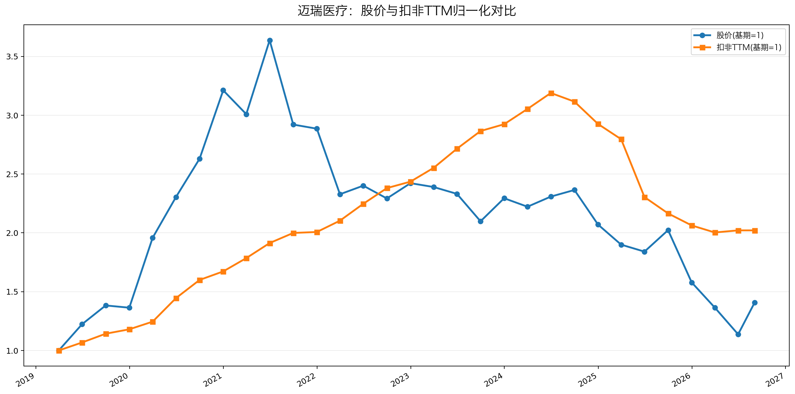

# 迈瑞医疗（300760）2026年中报速览

报告期 2026年1-6月｜8月29日披露

> 数据取自公司《2026年半年度报告》。单季数字由半年报减一季报推算。市值、PE 按 9 月 2 日收盘实测。这篇只回答四个问题：赚没赚钱、钱到没到手、家底厚不厚、明年还行不行。

**归母利润降 5.4%，汇率和少数股东各背一口锅，主业其实在涨**——剔除汇率影响后扣非利润增 11.1%，每 100 块钱利润有 102 元现金到手。

---

## 一、赚没赚钱？——利润表

| 指标 | 2026上半年 | 2025上半年 | 同比 |
|------|-----------|-----------|------|
| 营业收入 | 177.47亿 | 167.43亿 | +6.0% |
| 净利润 | 50.47亿 | 52.33亿 | −3.6% |
| 归母净利润 | 47.97亿 | 50.69亿 | −5.4% |
| 扣非净利润 | 47.85亿 | 49.49亿 | −3.3% |
| 毛利率 | 60.83% | 61.67% | −0.83pct |
| 财务费用 | 净损失3.83亿 | 净收益3.36亿 | 摆动7.2亿 |
| 少数股东损益 | 2.50亿 | 1.64亿 | +53% |
| 减值损失合计 | 0.73亿 | 2.30亿 | 少提1.57亿 |
| 加权ROE | 12.01% | 13.26% | −1.25pct |
| 研发投入 | 17.79亿 | 17.77亿 | +0.1% |

表里三行利润要分清：净利润是整个集团的加总数；归母净利润要再扣掉非全资子公司里其他股东分走的份额，才是真正归上市公司股东的；扣非净利润又剔除补贴、卖资产这类不可持续的损益，是主业口径。ROE 衡量股东投入资本的赚钱效率。

**利润下滑拆开看，两块都跟主业无关。** 一块是汇兑：财务费用从上年同期的净收益 3.36 亿，变成净损失 3.83 亿，一进一出 7.2 亿，相当于把上半年税前利润抹掉 13%，公司注明是汇兑损失增加。

另一块是少数股东分走的变多。迈瑞收购的惠泰这些子公司不是全资的，别的股东按股权分走的利润，就叫"少数股东损益"：上半年 2.50 亿，上年同期 1.64 亿。子公司越赚钱，分给别人的越多，归母口径就被摊薄。这两块解释了归母降幅（−5.4%）为何比净利润（−3.6%）更难看。

**公司另披露了剔除汇率影响的增速，四个口径全给了。** 营收 +8.2%、净利润 +8.7%、扣非 +11.1%、归母 +7.2%。最该看扣非 +11.1%，它最接近主业的真面目。归母 +7.2% 被少数股东摊薄拖低了一截。

**毛利率降 0.83pct，影像和生命信息是主要拖累。** 影像的毛利率掉了 6 个点、收入也降 5.8%；生命信息与支持毛利率降近 2 个点；体外诊断、新兴业务则在涨。

| 业务 | 收入 | 占营收 | 同比 | 毛利率变动 |
|------|------|--------|------|-----------|
| 体外诊断 | 68.65亿 | 39% | +9.6% | +1.32pct |
| 生命信息与支持 | 48.11亿 | 27% | −0.1% | −1.81pct |
| 医学影像 | 28.36亿 | 16% | −5.8% | −6.01pct |
| 新兴业务 | 31.10亿 | 18% | +19.6% | +0.87pct |

**影像在内部换挡。** 国际超声仍高个位数增长，影像的收入里国际已占 68%；下滑主要落在国内，财报没有解释原因。超高端超声上半年卖了近 5 亿、涨超 30%，高端及超高端机型合计已占国内超声收入七成。

**减值少提了 1.57 亿，方向跟"洗大澡"相反。** 洗大澡指某年一次提足、给下一年留利润空间。迈瑞正相反：信用减值加资产减值合计只提 0.73 亿（上年 2.30 亿），少提的 1.57 亿约合当期净利润的 3%，剔除后汇率中性增速会略低。本期也没有靠改折旧年限、坏账计提比例来调节利润的动作。

**单季已经在好转。** 一季度归母还降 11.4%；二季度营收 +10.5%、归母 +1.1%，回到正增长。

---

## 二、钱到手了吗？——现金流量表

| 指标 | 2026上半年 | 2025上半年 | 同比 |
|------|-----------|-----------|------|
| 经营现金流净额 | 48.77亿 | 39.22亿 | +24% |
| 销售商品收到现金 | 193.41亿 | 177.18亿 | +9.2% |
| 收现比 | 109.0% | 105.8% | +3.2pct |
| 购建资产付现（资本开支） | 10.64亿 | 10.17亿 | +4.6% |
| **自由现金流** | **38.13亿** | 29.05亿 | +31% |
| 经营现金流/归母净利 | 1.02 | 0.77 | 改善 |

收现比衡量卖出去的货当年真收回多少现金，109% 意味着每卖出 100 元收回 109 元现金。

**利润是真金白银，改善来自回款，不是压账期。** 经营现金流是归母利润的 1.02 倍。销售收现多收了 16.2 亿，是主要贡献。同期经营性应付项目还少了 4.64 亿，说明没靠拖欠供应商凑现金流。

**自由现金流 = 经营现金流 − 资本开支 = 48.77 − 10.64 = 38.13 亿。** 它是经营现金流再扣掉买设备、建厂房的钱，剩下的才是股东真正能拿走的。38.13 亿占归母净利 0.79，高于 0.7 的健康线。资本开支只增 4.6%，属于维护性投入，不是边扩张边烧钱。

**报表上的"现金净增加额"反而少了一半，钱花在了投资和分红上。** 净增加 10.20 亿、同比 −48.5%，但经营现金流有 48.77 亿。差额去向：投资活动净流出 8.67 亿、分红付现 25.04 亿、汇率折算吃掉 4.85 亿——都跟主业赚钱能力无关。

**前瞻信号偏正面。** 合同负债（经销商提前打来的货款）33.86 亿，比年初多 12.9%，其中预收货款增 24%。年初账上的合同负债有 18.43 亿已在半年内转为收入，说明订单在真流转，不是趴在账上。

---

## 三、家底厚不厚？——资产负债表

| 指标 | 2026.6.30 | 2025.12.31 | 2025.6.30 | 同比 |
|------|-----------|-----------|-----------|------|
| 货币资金 | 186.99亿 | 176.90亿 | 169.67亿 | +10.2% |
| 应收账款 | 37.54亿 | 34.08亿 | 36.50亿 | +2.8% |
| 存货 | 56.50亿 | 50.04亿 | 53.44亿 | +5.7% |
| 在建工程 | 33.43亿 | 31.54亿 | — | 较年初+6.0% |
| 商誉 | 111.12亿 | 114.04亿 | — | 较年初−2.6% |
| 资产负债率 | 25.47% | 27.43% | 25.10% | +0.4pct |

注：商誉、在建工程无上年同期可比数，末列为其与 2025 年末之比；其余各行均为与上年同期之比。

**账上净现金约 187 亿，有息负债近乎为零。** 货币资金 186.99 亿，短期借款 23 万、长期借款 25 万，可忽略不计，也没有应付债券。净现金指账上现金减去要付利息的债。账上躺着一大笔钱又不借钱，"大存大贷"这颗头号地雷不存在。

**应收、存货的增速都慢于收入，没有"货卖不动、钱收不回"的迹象。** 对去年同期，应收只增 2.8%、存货增 5.7%，都慢于收入（+6.0%）。

**商誉 111 亿，占归母净资产 27%，未到 30% 的黄灯线。** 商誉是当年收购多付的溢价，一旦被收购方业绩变差就要减值、直接吃掉利润。经验上商誉超过净资产三成就该警惕，迈瑞还差一点。本期没有计提减值，账面比年初少 2.6% 是欧元贬值折算造成的账面差，不是减值——中国准则下商誉不摊销。

**商誉对应的三块并购，目前都在贡献增长。** 海肽生物供原料的 5 项新试剂上市，DiaSys 欧洲仓储中心投运，惠泰微创介入收入 +26%。风险点是哪天国际 IVD 或惠泰失速，减值压力会回来。

**在建工程 33.43 亿，比年初多 6%，同期 2.73 亿完成转固。** 转固指工程完工、开始计提折旧。正常流转的扩产，不是常年挂账、变相少提折旧的那种。

---

## 四、明年还行不行？——看未来

| 引擎 | 2026上半年收入 | 同比 | 关键证据 |
|------|--------------|------|---------|
| 国际业务 | 94.71亿，占营收53% | +13.7%（美元口径+18.4%） | 欧洲增近25%，英法意均超30%；13国布局本地化生产、10国已投产 |
| 国内业务 | 82.76亿，占营收47% | −1.6% | 集采下以量换价；免疫、生化、凝血市占率近14% |
| 新兴业务 | 31.10亿，占营收约18% | +19.6% | 微创介入+26%；惠泰PFA消融上半年手术7,200余例，超2025全年 |

国际和国内是地域口径，加起来正好等于全部营收；新兴业务是产品线口径，收入已含在前两者里，别把三项相加。

PFA 消融（脉冲电场消融，治疗心律失常的介入新技术）是惠泰今年放量的产品。集采是国家组织的带量压价采购，靠中标换销量。

**公司预计全年国内转正、2027 年起恢复较快增长。** 这话要对得上账才行：上半年国内还是 −1.6%，要转正意味着下半年明显提速。财报里没有能验证这一点的数据，只能等三季报和年报对账。

**排雷四项全过，一项查不到。** 关联交易为零：没有日常经营关联交易，没有关联债权债务往来，也不跟关联财务公司发生存贷款。没有资金占用，没有违规担保。

**股权质押也干净。** 质押是把股票抵押给金融机构借钱，跌多了会触发平仓，是大股东暴雷的先导信号。控股股东之一 Magnifice 只质押了所持股份的 22.8%，离 70% 的警戒线很远，没有补充质押公告；另一股东无质押，高管还增持了。

**研发资本化率正常，客户集中度等年报。** 资本化率 11.8%（上年 9.6%），即研发投入里挂账慢慢摊、不扣当年利润的比例，在医疗器械行业属正常区间。查不到的是前五大客户集中度——半年报不披露这项，要等年报。

**分红是现金最硬的证明。** 2026 年两笔中期分红合计 31.27 亿（3 月派 15.16 亿，8 月又通过 16.12 亿），分红比例 65%，意思是上半年归母利润的 65% 直接分给了股东。上市以来累计分红 408 亿（含回购 20 亿），是 IPO 募资 59 亿的近 7 倍，从未再融资。厚现金、高分红、零负债三件事互相印证，账上的钱假不了。

---

## 红绿灯速判

🔴 红灯：均未触发——无大存大贷｜商誉27%未触线｜现金流为正｜质押22.8%远离警戒线｜主业未变｜无调节利润的会计动作

🟡 黄灯：三项——毛利率−0.83pct（影像、生命信息拖累）｜研发资本化率从9.6%升到11.8%｜国内−1.6%，转正指引待验证

🟢 绿灯：八项——现金流大于利润｜自由现金流/净利0.79｜净现金187亿｜商誉无减值｜在建工程正常转固｜关联交易为零｜分红比例65%｜二季度利润回正

---

## 估值与观察点

图注：扣非TTM（滚动12个月）2.0倍 vs 股价1.4倍，利润在爬、股价没跟上，估值压缩中（2019Q1前复权=1，股价至9月2日）

**26 倍贵不贵，全看一件事：国内业务能不能转正。** 能转正，说明利润已在周期底部企稳——Q2 归母已回正、汇率中性扣非 +11.1%——26 倍买的是底部利润，算便宜；不能转正，利润再下台阶，26 倍并不便宜。10 月三季报见分晓。

**这两条线怎么读，借林奇的办法：把股价线和盈利线画在一起比。** 两条线平时贴着走：股价线冲上去脱离盈利线，是出价跑在业绩前面——贵了；盈利线反超，是业绩跑在出价前面——便宜了。脱离不会永远持续——早晚，盈利决定一笔投资的成败，股价今天的涨跌只是噪音。起点先认清楚：两线同从 2019 年初起算，那是上市半年被炒到 40 多倍 PE 的高位，不是发行价，贵与便宜都相对它说。

**迈瑞现在停在"盈利反超"这边：盈利线 2.0 倍、股价线 1.4 倍。** 这一档迟早要合上——盈利站住，股价追上来补课；盈利再掉，就下来找股价。靠哪一边，就是开头那句"全看国内转正"。股价怎么走到今天，见表：2021 年冲过头（78 倍 PE 泡沫顶）后连跌五年——头三年是杀估值：盈利还在创新高（扣非TTM 爬到 124.7 亿峰值），PE 从 78 倍砍到 28 倍，跌的纯粹是出价；近两年才轮到戴维斯双杀（业绩和估值一起往下杀，股价跌得比业绩还狠）：扣非TTM 从峰值掉 37% 到 79 亿，PE 还从 28 倍压到 21 倍，股价 291→136(近期低点) 再腰斩。对照发行价 48.8 元，约八年股价仍有 3.4 倍、年化约 17%。

| 阶段 | 股价(未复权) | 扣非TTM | PE-TTM | 这一段的驱动 |
|------|-------------|---------|--------|-------------|
| 2019初-2021年中 | 134→480元 | 39→75亿 | 42→78倍 | 利润翻倍+情绪狂热双击，2021年是泡沫顶 |
| 2021年中-2024年中 | 480→291元 | 75→124.7亿峰值 | 78→28倍 | 还泡沫的账：利润一路创新高，估值被腰斩 |
| 2024年中-2026年中 | 291→136元 | 124.7→79亿 | 28→21倍 | 利润从峰值回落37%，国内行业连调三年 |
| 2026年中-9月初 | 136→168元 | 79亿企稳 | 21→26倍 | 中报落地、Q2转正，两个月反弹24% |

**现价 25.9 倍 = 总市值 2036.6 亿 ÷ TTM 归母利润 78.64 亿**（9 月 2 日收盘实测；78.64 = 2025 全年 81.36 − 2025 上半年 50.69 + 2026 上半年 47.97）。PE 用归母口径；图与表里的扣非TTM 79.04 亿是扣非口径，差约 0.4 亿、走势一致。

**分位很低，但低得有水分，方向在好转。** 25.9 倍处上市以来约 16% 分位，比历史上约 84% 的时间便宜（上市不足 10 年，"近 10 年"即上市以来）。这分位不全是股价便宜：PE = 市值 ÷ 利润，TTM 分母 78.64 亿已小于上年全年的 81.36 亿，低位有一部分是利润缩水做出来的。好转的一面：扣非TTM 最近一季度掉头回升（78.34 亿→79.04 亿），与 Q2 归母转正互相印证。

**汇率企稳后，同样的股价对应约 23 倍。** 近三年上半年归母平均占全年的 61%（2023-2025 年：55.6%、64.8%、62.3%；上半年×2 会高估），表观口径外推全年约 79 亿（47.97 ÷ 61%）、对应约 26 倍；汇率中性口径——归母 +7.2%，上半年"应有"54.3 亿（50.69 × 1.072）——外推全年约 89 亿、对应约 23 倍。约 3 倍 PE 的差距，就是汇率企稳后的修复空间。

**PEG 不适用：迈瑞是龙头遇困境，不是低增速成熟公司。** PEG（PE 除以增速，小于 1 惯称便宜）按汇率中性 7%-11% 的增速算是 2.3-3.6，看着贵——但这份低速是国内行业连调三年的低谷值，拿它当分母，等于把暂时困境当成永久低速；转正兑现、增速修复，PEG 自然回落。它只对增速稳定的公司有参考意义。

**关键观察点：**

1. **三季报（10 月）**：国内累计增速能否收窄到转正区间，这是全年指引的前置条件
2. **医学影像**：Q3 毛利率能否止住 −6pct 的失速，盯超高端超声 A20 放量
3. **2026 年报（2027 年 3-4 月）**：汇率中性扣非 +11.1% 能否兑现全年；补上前五大客户集中度
4. **商誉**：年报减值测试的假设有没有放松（折现率下调往往是减值的先兆）
5. **人民币**：汇率中性归母 +7.2% vs 表观 −5.4%，差 12.6pct——汇率企稳则表观利润自然修复
