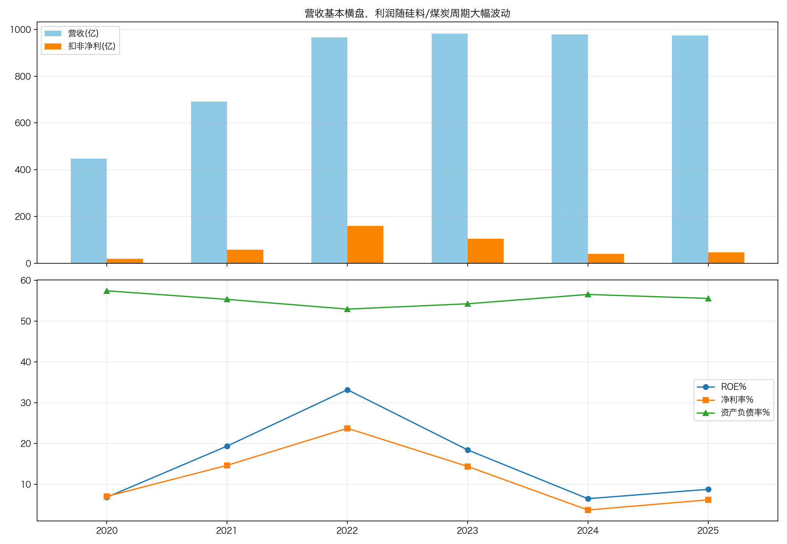
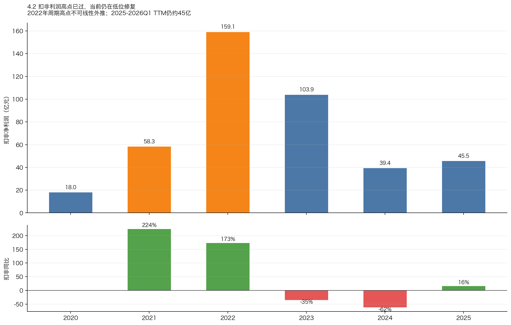
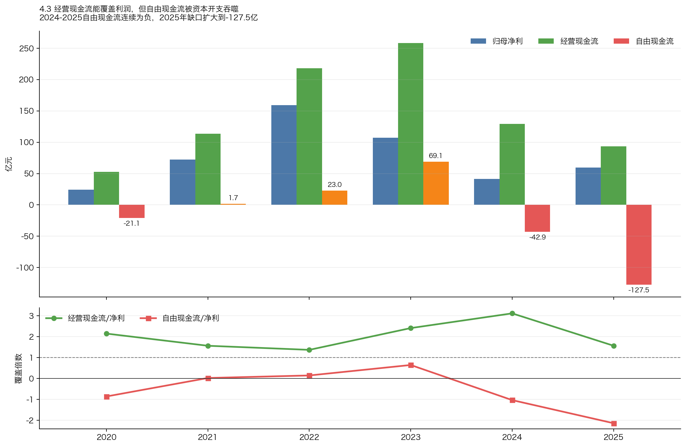
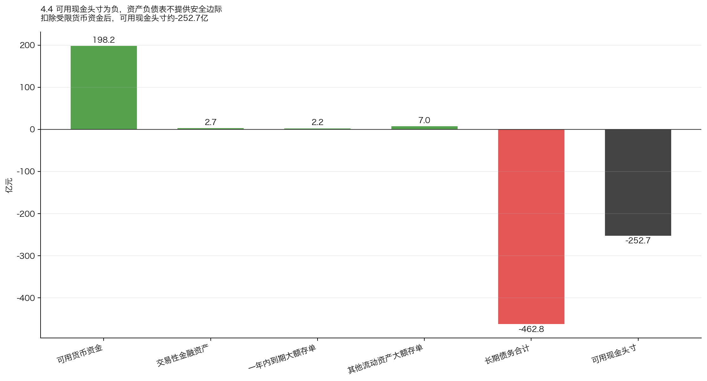
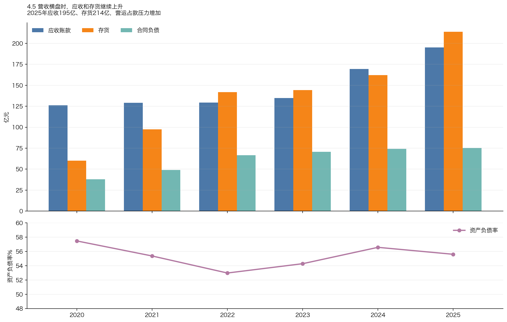
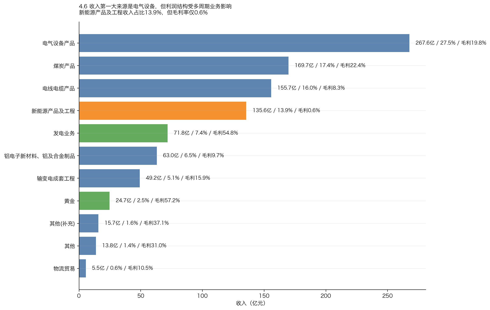
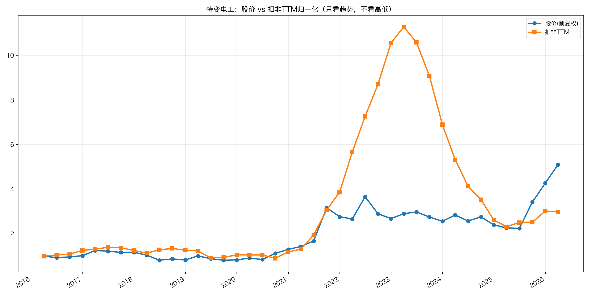
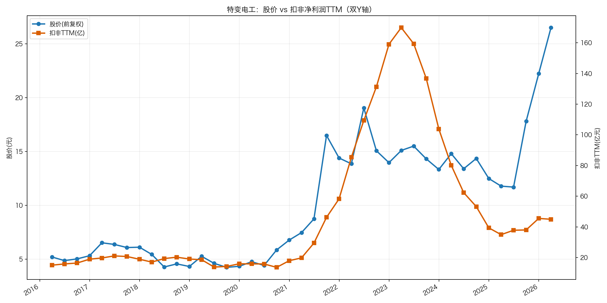
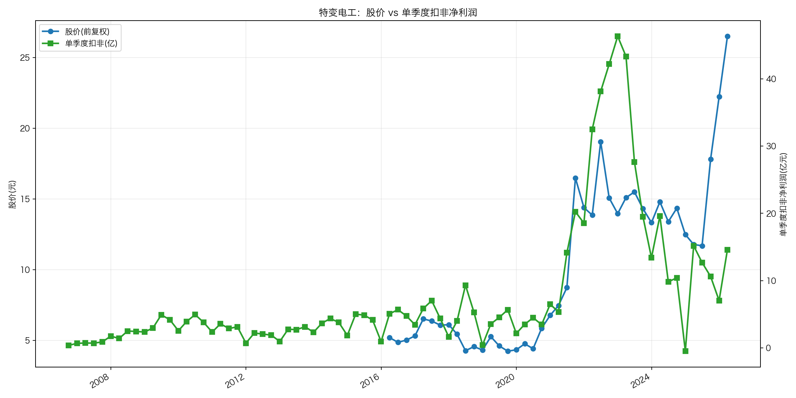

# 特变电工投资分析报告（600089.SH）

生成日期：2026-06-24

数据口径：东方财富财务 API + yfinance 行情；最新股价取 yfinance 2026-06-24 收盘 23.44 元。已从巨潮资讯网下载 2019-2025 年年度报告至 `../年报/`，并用 2025 年报 PDF 附注复核现金头寸、受限资金、大额存单和产品结构。

---

## 0. 一句话结论

特变电工不是典型的“稳定复利股”，而是一家“输变电装备 + 新能源工程/硅料 + 煤炭 + 发电 + 铝电子材料”的多周期资产组合。

它的看点是：输变电主业受益特高压、电网投资和海外电力建设，具备一定工程能力和规模壁垒；但上市公司整体利润强烈受硅料、煤炭、新能源工程毛利和重资本开支影响。2022 年高利润更多来自周期景气，2024-2025 年利润明显下台阶，2026Q1 扣非仍同比下降。

当前 23.44 元、市值约 1184 亿元，对应扣非 TTM PE 约 26.3 倍，放在公司近十年季度 PE 估算分位约 97.6%，不便宜。按非周期复利型框架，结论是：暂不作为长期复利核心标的；更适合放在“周期复苏/电网投资主题观察池”，等待利润趋势和估值重新匹配。

评级：不碰 / 谨慎观察
总分：44.5 / 100

---

## 1. 先判断能不能研究：公司画像 + 能力圈 + 红线

| 项目 | 判断 |
|---|---|
| 公司 | 特变电工股份有限公司，1997 年上市，新疆企业 |
| 主营 | 能源高端装备、新能源、煤炭煤电煤化工、铝电子材料等 |
| 实控/管理 | 董事长张新，总裁种衍民；公司治理需结合复杂多产业布局继续跟踪 |
| 最新价格 | 23.44 元，2026-06-24 收盘 |
| 最新市值 | 约 1184 亿元 |
| 扣非 TTM | 约 44.97 亿元 |
| PE | 约 26.3 倍扣非 TTM |
| 能力圈 | 部分看得懂：输变电设备逻辑较清晰，但硅料、煤炭、发电和工程业务强周期、强资本开支，需要更高行业跟踪能力 |

初筛结论：谨慎通过，但不符合“非周期复利型公司”的默认偏好。

核心红线/降级项：
- 行业属性降级：硅料、煤炭、新能源工程均有明显周期属性。
- 现金流降级：2024、2025 自由现金流连续为负，2025 年约 -127.5 亿元。
- 资产负债表降级：2025 年按年报附注复核后，形式现金头寸约 -194.0 亿元；若扣除受限货币资金，可用现金头寸约 -252.7 亿元，不是净现金公司。
- 估值降级：当前 PE 不是低位，反而接近近十年高分位。

后续重点：
1. 输变电订单增长能否真正抵消硅料和煤炭下行。
2. 资本开支什么时候下降，自由现金流能否转正。
3. 当前估值是否已经提前反映“电网设备 + 周期修复”的乐观预期。

---

## 2. 好行业：是不是好生意？

特变电工所在的不是单一行业，而是多个行业打包。这里要分开看：

| 业务 | 行业属性 | 判断 |
|---|---|---|
| 电气设备产品 / 输变电成套工程 / 电线电缆 | 电网设备、特高压、海外电力建设 | 长期需求较好，受电网投资周期影响，但比硅料、煤炭更稳 |
| 新能源产品及工程 | 光伏、风电、储能、EPC | 空间大，但价格竞争激烈，工程业务毛利低 |
| 煤炭产品 | 资源周期 | 受煤价影响大，不适合给稳定复利估值 |
| 发电业务 | 重资产、公用事业属性 | 毛利高，但资本占用重，收益率看项目质量和电价 |
| 铝电子材料 | 制造业周期 | 有技术壁垒，但仍受价格、产能周期影响 |
| 黄金 | 资源/价格周期 | 毛利高，但占比小，价格波动大 |

2025 年产品结构：

| 产品 | 收入 | 占比 | 毛利率 |
|---|---:|---:|---:|
| 电气设备产品 | 267.6 亿 | 27.5% | 19.8% |
| 煤炭产品 | 169.7 亿 | 17.4% | 22.4% |
| 电线电缆产品 | 155.7 亿 | 16.0% | 8.3% |
| 新能源产品及工程 | 135.6 亿 | 13.9% | 0.6% |
| 发电业务 | 71.8 亿 | 7.4% | 54.8% |
| 铝电子新材料、铝及合金制品 | 63.0 亿 | 6.5% | 9.7% |
| 输变电成套工程 | 49.2 亿 | 5.1% | 15.9% |
| 黄金 | 24.7 亿 | 2.5% | 57.2% |

行业判断：
- 好的一面：电网投资、特高压、海外电力基础设施建设是长期需求；中国电力装备具备全球竞争力。
- 差的一面：利润池并不稳定。2022 年硅料/煤炭景气推高利润，2024 年快速回落，说明利润并非纯靠稳定主业复利。
- 关键问题：公司体量大、业务多，但“多元化”并不等于“更稳”，很多业务同时占用资本、同时受价格周期影响。

评分：12 / 20
- 需求质量/非周期性：4 / 6
- 竞争格局：2 / 4
- 进入壁垒：3 / 4
- 上下游议价权：1.5 / 3
- 替代品威胁：1.5 / 3

---

## 3. 好公司·定性：有没有长期复利能力？

### 3.1 护城河

特变电工在输变电设备、特高压、海外工程和能源装备领域有长期积累，具备工程交付、客户认证、规模制造、全球渠道和综合解决方案能力。这个护城河在电网设备业务上是真实的。

但上市公司整体不是纯电网设备公司。煤炭、硅料、新能源工程和发电业务会稀释“设备制造护城河”的稳定性。投资人买入的是整个资产包，不是只买最好的输变电业务。

### 3.2 复购/粘性

电网、电力工程客户有长期关系和项目延续性，但订单是项目制，不是消费品式高频复购。新能源 EPC 和大宗资源业务粘性更弱，价格和项目周期影响更大。

### 3.3 定价权

公司在部分高端设备和海外工程中有一定议价能力，但整体利润率仍明显受硅料、煤炭、工程毛利影响。2022 年毛利率 38.5%，2024 年降至 18.1%，2025 年 18.8%，说明整体定价权并不稳定。

### 3.4 管理层与资本配置

管理层长期经营能源装备和资源业务，业务版图大、战略执行能力较强。但从投资人角度看，资本开支强度很高，2025 年资本开支约 220.8 亿元，显著超过经营现金流，资本配置是否创造足够回报仍需观察。

评分：11.5 / 20
- 护城河：4.5 / 7
- 复购/粘性/低替代性：2 / 5
- 定价权：2 / 5
- 管理层：3 / 3

---

## 4. 好公司·定量：利润是不是真，增长是否健康？

### 4.1 ROE 质量与盈利模式

| 年份 | 营收 | 扣非净利 | 毛利率 | 净利率 | ROE | 资产周转率 | 权益乘数 | 资产负债率 |
|---|---:|---:|---:|---:|---:|---:|---:|---:|
| 2020 | 446.7 亿 | 18.0 亿 | 20.2% | 7.0% | 6.8% | 0.42 | 2.35 | 57.5% |
| 2021 | 690.3 亿 | 58.3 亿 | 28.5% | 14.6% | 19.4% | 0.56 | 2.24 | 55.4% |
| 2022 | 965.1 亿 | 159.1 亿 | 38.5% | 23.7% | 33.2% | 0.63 | 2.13 | 53.0% |
| 2023 | 982.1 亿 | 103.9 亿 | 27.3% | 14.4% | 18.4% | 0.54 | 2.19 | 54.3% |
| 2024 | 979.1 亿 | 39.4 亿 | 18.1% | 3.7% | 6.5% | 0.49 | 2.30 | 56.6% |
| 2025 | 973.2 亿 | 45.5 亿 | 18.8% | 6.2% | 8.8% | 0.45 | 2.25 | 55.6% |

杜邦判断：
- 2021-2022 年 ROE 暴涨，主要靠毛利率和净利率提升，不是靠杠杆扩张。
- 2024-2025 年 ROE 回落，核心拖累是净利率下降和资产周转率下降。
- 权益乘数长期在 2.1-2.35 左右，杠杆不算失控，但资产负债率维持在 55%-57%，安全垫不厚。

这说明：特变电工不是“稳定高 ROE 生意”，而是“周期利润上行时 ROE 很高、周期回落后 ROE 快速下行”的资产组合。

### 4.2 利润增长来源与持续性

| 年份 | 营收 | 扣非净利 | 备注 |
|---|---:|---:|---|
| 2020 | 446.7 亿 | 18.0 亿 | 周期低位 |
| 2021 | 690.3 亿 | 58.3 亿 | 硅料/煤炭景气上行 |
| 2022 | 965.1 亿 | 159.1 亿 | 周期高点 |
| 2023 | 982.1 亿 | 103.9 亿 | 高位回落 |
| 2024 | 979.1 亿 | 39.4 亿 | 利润大幅下台阶 |
| 2025 | 973.2 亿 | 45.5 亿 | 低位修复，但远低于 2022/2023 |
| 2026Q1 TTM | - | 45.0 亿 | 扣非 TTM 基本横在低位 |

关键计算：
- 2020-2025 扣非净利 CAGR 约 20.4%，但这是从 2020 低基数到周期波动后的结果，参考价值有限。
- 2023-2026Q1 TTM 扣非净利 CAGR 约 -24.3%，更能体现从周期高位回落后的压力。
- 2026Q1：营收同比 +6.75%，归母净利同比 +13.40%，但扣非净利同比 -3.77%。扣非未同步修复，说明经营质量仍需验证。

### 4.3 现金流质量

| 年份 | 归母净利 | 经营现金流 | 资本开支 | 自由现金流 | 经营现金流/净利 | 自由现金流/净利 |
|---|---:|---:|---:|---:|---:|---:|
| 2020 | 24.5 亿 | 52.6 亿 | 73.6 亿 | -21.1 亿 | 2.15 | -0.86 |
| 2021 | 72.5 亿 | 113.6 亿 | 111.9 亿 | 1.7 亿 | 1.57 | 0.02 |
| 2022 | 159.1 亿 | 218.0 亿 | 195.0 亿 | 23.0 亿 | 1.37 | 0.14 |
| 2023 | 107.0 亿 | 258.1 亿 | 189.0 亿 | 69.1 亿 | 2.41 | 0.65 |
| 2024 | 41.4 亿 | 129.1 亿 | 172.0 亿 | -42.9 亿 | 3.12 | -1.03 |
| 2025 | 59.5 亿 | 93.3 亿 | 220.8 亿 | -127.5 亿 | 1.57 | -2.14 |

现金流结论：
- 经营现金流本身不差，2020-2025 基本都覆盖净利润。
- 真正问题是资本开支太重。2024、2025 自由现金流连续转负，且 2025 年自由现金流缺口扩大到 -127.5 亿元。
- 对长期投资者来说，这意味着利润不能稳定转化为可分配现金，估值不能只看 PE，还要看资本开支回落拐点。

### 4.4 现金头寸与资产负债表安全性

现金头寸按彼得林奇口径估算：现金及现金等价物 + 有价证券 - 长期负债。对特变电工这类重资产公司，需要先扣除受限货币资金，再把定期存款、交易性金融资产等可用现金类资产纳入。

| 项目 | 金额 | 年报依据 | 处理 |
|---|---:|---|---|
| 货币资金 | 256.9 亿 | 合并资产负债表、附注七1 | 计入 |
| 其中：受限货币资金 | -58.7 亿 | 附注七1、七31 | 可用现金口径扣除 |
| 交易性金融资产 | 2.7 亿 | 附注七2 | 计入 |
| 一年内到期的大额存单 | 2.2 亿 | 附注七12 | 计入 |
| 其他流动资产中的大额存单 | 7.0 亿 | 附注七13 | 计入 |
| 长期借款 | -372.1 亿 | 合并资产负债表、附注七45 | 扣除 |
| 一年内到期非流动负债 | -72.3 亿 | 合并资产负债表、附注七43 | 扣除 |
| 应付债券 | -14.1 亿 | 合并资产负债表、附注七46 | 扣除 |
| 租赁负债 | -4.3 亿 | 合并资产负债表、附注七47 | 扣除 |
| 形式现金头寸 | -194.0 亿 | 不扣受限货币资金 | 结果 |
| 可用现金头寸 | -252.7 亿 | 扣除受限货币资金 | 更保守结果 |

修正后的判断：
- 年报确认“其他流动资产”中确有 7.0 亿大额存单，“一年内到期的非流动资产”中有 2.2 亿一年内到期大额存单，应计入现金头寸；此前只用 API 摘要，低估了这部分定期存款。
- 但年报同时披露受限货币资金 58.7 亿，主要包括银行承兑汇票保证金、保函保证金、环境恢复治理保障基金、定期及通知存款、司法冻结资金等。若看可自由动用现金，应扣除。
- 长期借款、一年内到期非流动负债、应付债券、租赁负债合计约 462.8 亿，远高于可用现金类资产。
- 因此结论不变且更清楚：特变电工不是净现金公司，现金头寸不能构成安全边际；当前估值要重点考虑高资本开支和长期负债压力。

### 4.5 营运质量：应收、存货、合同负债

| 年份 | 营收 | 应收账款 | 存货 | 合同负债 |
|---|---:|---:|---:|---:|
| 2020 | 446.7 亿 | 126.2 亿 | 60.2 亿 | 38.0 亿 |
| 2021 | 690.3 亿 | 129.0 亿 | 97.5 亿 | 48.9 亿 |
| 2022 | 965.1 亿 | 129.3 亿 | 141.9 亿 | 66.5 亿 |
| 2023 | 982.1 亿 | 134.7 亿 | 144.2 亿 | 70.6 亿 |
| 2024 | 979.1 亿 | 169.3 亿 | 162.2 亿 | 74.3 亿 |
| 2025 | 973.2 亿 | 195.1 亿 | 213.9 亿 | 75.2 亿 |

营运质量结论：
- 2025 年营收基本持平，但应收账款、存货明显上升，说明回款和库存压力在增加。
- 合同负债小幅上升，说明订单/预收并未塌陷，但不足以抵消应收和存货的压力。
- 对工程和设备公司来说，应收与存货上升不一定立即是坏账风险，但会占用现金，叠加高资本开支后，对自由现金流不友好。

### 4.6 产品结构与增长来源

产品结构最重要的结论：特变电工不是单一高毛利设备股。

- 电气设备是第一大收入来源，占 27.5%，毛利率 19.8%，这是相对更值得关注的核心业务。
- 煤炭占 17.4%，毛利率 22.4%，但价格周期属性强。
- 电线电缆占 16.0%，毛利率只有 8.3%，更偏制造加工。
- 新能源产品及工程占 13.9%，毛利率只有 0.6%，规模大但利润贡献弱。
- 发电和黄金毛利率高，但占比不大，且都有资产/价格周期属性。

定量评分：15 / 40
- ROE质量与盈利模式：3.5 / 9
- 利润增长来源与持续性：2 / 7
- 现金流质量：1.5 / 7
- 现金头寸与资产负债表安全性：0.5 / 6
- 营运质量：应收/存货/合同负债：2.5 / 5
- 产品结构与增长来源：5 / 6

---

## 5. 好时机：现在买贵不贵？

### 5.1 股价 vs 利润线

分阶段看：
- 2016-2020：利润低位缓慢改善，股价也长期低位，市场基本按传统制造周期股定价。
- 2021-2022：扣非 TTM 从几十亿跃升到 159 亿，股价大涨主要由硅料/煤炭周期景气推动。
- 2023-2024：利润从高位快速回落，股价也经历估值出清，但利润下台阶幅度很大。
- 2025-2026Q1：扣非 TTM 稳在约 45 亿附近，但股价明显修复，估值已经提前反映电网投资和周期修复预期。

图表结论：利润线尚未明显重新上行，但股价已经先涨，当前不是“利润上行、股价没跟”的低估状态。

### 5.2 PE 及 PE 百分位

| 指标 | 数值 |
|---|---:|
| 最新股价 | 23.44 元 |
| 总股本 | 50.53 亿股 |
| 市值 | 约 1184 亿 |
| 扣非 TTM | 约 44.97 亿 |
| 扣非 TTM PE | 约 26.3 倍，同花顺(19) |
| 近十年季度 PE 估算分位 | 约 97.6%，同花顺(92.7%) |

说明：季度 PE 分位为自算近似值，使用季度末股价和扣非 TTM，不等同于同花顺日频 PE 分位；但方向很清楚——当前估值不低。

### 5.3 PEG

2023-2026Q1 TTM 扣非净利 CAGR 约 -24.3%，PEG 失效。用 2020-2025 的 20.4% CAGR 计算会掩盖周期高低基数，不适合当作买入理由。

### 5.4 股息率

2025 年分红方案为 10 派 3.60 元，即每股 0.36 元。按 23.44 元股价，股息率约 1.54%。

分红率约 31%（每股分红 0.36 / EPS 1.161），并不激进，但股息率不足以提供明显安全边际。

### 5.5 市场信号与预期差

市场可能在交易三件事：
1. 特高压和电网投资景气；
2. 硅料/新能源链价格触底修复；
3. 大型能源装备公司估值重估。

风险在于：这些预期已经明显反映到股价里，而扣非 TTM 尚未同步上行。

### 5.6 毛估估

不做乐观档，只做中性和保守档：

| 情景 | 假设 | 合理市值 | 相对当前市值 |
|---|---|---:|---:|
| 中性档 | 扣非净利修复到 60 亿，给 15 倍 PE | 900 亿 | 约 -24% |
| 保守档 | 扣非净利维持 40-45 亿，给 10-12 倍 PE | 400-540 亿 | 约 -54% 至 -66% |

这不是说股价一定下跌，而是说明：按当前利润和合理中性估值看，赔率并不划算。除非投资者相信未来扣非净利能重新回到 80-100 亿以上，当前 1184 亿市值才有更强支撑；但这需要硅料/煤炭/电网设备多项同时改善，确定性不够。

好时机评分：6 / 20
- 股价vs利润线：1.5 / 5
- PE及PE百分位：0.5 / 5
- PEG：0 / 2
- 股息率：1 / 3
- 市场信号与预期差：1.5 / 2
- 毛估估：1.5 / 3

---

## 6. 投资结论：值不值得下注，拿不拿得住？

### 6.1 商业模式好不好（Right Business）

#### 6.1.1 业务简单可持续、不易被替代

输变电设备需求长期存在，主业有一定持续性；但上市公司同时包含硅料、煤炭、新能源工程等多周期资产，利润来源复杂、波动大，不符合“业务简单、非周期”的优先偏好。

#### 6.1.2 竞争格局清晰、护城河深厚、有定价权

特变电工仅部分符合。输变电业务具有技术、项目和海外交付壁垒，但硅料、煤炭和工程业务更受商品价格、产能和招投标竞争影响，上市公司整体缺少稳定统一的定价权。

#### 6.1.3 轻资本投入、高资产回报率、自由现金流好

公司不符合这一画像。多业务扩产和项目建设需要持续高资本投入，利润、ROE和自由现金流随周期波动；即使输变电主业较好，也不能掩盖硅料、煤炭和新能源工程对资本回报的拖累。

#### 6.1.4 有长期增长空间

电网投资和海外电力建设为输变电业务提供空间，但硅料及煤炭等周期业务会显著影响集团利润。增长是否创造价值，要看订单转化、扣非TTM、资产周转和自由现金流，而不是只看产能和收入规模。

### 6.2 管理层怎么样（Right People）：产业经营能力存在，业务边界和投资纪律需改善

管理层具备大型项目和多产业运营能力，但业务组合过于复杂，高资本开支和周期扩张降低可预测性。资本配置应优先提高核心输变电回报和现金流，而不是继续放大低回报周期资产。

### 6.3 是不是好价格（Right Price）：股价先于利润修复，赔率不足

当前利润低位尚未明显修复，股价已提前反映复苏预期，估值并未提供足够安全边际。更合适的做法是放入周期观察池，等待订单、扣非TTM和自由现金流改善，同时估值回落。

### 6.4 胜率与赔率

**胜率**

中等偏低。

胜率来自：
- 输变电和特高压需求长期存在；
- 公司在能源装备和工程交付上有积累；
- 多业务组合在单一行业下行时有一定缓冲。

胜率被拉低的地方：
- 利润强周期，2022 高点不可线性外推；
- 自由现金流连续为负；
- 应收和存货上升；
- 当前估值已经不低。

**赔率**

较差。

当前市值约 1184 亿，对应扣非 TTM 约 26 倍，已经不是低估区。若按中性 60 亿利润、15 倍估值，合理市值约 900 亿，仍低于当前市值。

### 6.5 长期持有检查项

| 检查项 | 结论 |
|---|---|
| 10 年后需求是否仍在 | 在，电网和能源装备需求长期存在 |
| 护城河是否增强 | 输变电主业有增强可能，但整体被周期业务稀释 |
| 是否持续产生自由现金流 | 暂时不通过，2024-2025 连续为负 |
| 是否有稳定定价权 | 不通过，整体毛利率随周期大幅波动 |
| 当前价格是否有安全边际 | 不通过，PE 分位偏高 |

评级与行动：不碰 / 谨慎观察。

更适合的动作：
- 已持有：如果是趋势/主题仓位，应设置明确退出条件，不宜按“长期复利股”心态无脑持有。
- 未持有：不建议在当前估值位置追买。
- 观察：等待扣非 TTM 重新上行、自由现金流转正、应收和存货改善，或者估值回到更有安全边际的位置。

### 6.6 评级与行动

**最终判断：特变电工拥有有价值的输变电主业，但集团整体是重资本、多周期资产组合，不符合稳定复利型公司画像；当前胜率和赔率都不理想，维持“不碰”。**

## 7. 投资逻辑与证伪条件

### 7.1 如果未来要买，投资逻辑应当是

1. 电网投资、特高压、海外电力建设进入新一轮景气，公司电气设备和成套工程订单持续增长。
2. 硅料和新能源工程业务从亏损/低毛利区间修复，但不再大规模拖累利润。
3. 煤炭、发电业务提供底部利润，但不需要再靠商品价格大涨才能支撑业绩。
4. 资本开支下降，自由现金流转正，利润真正变成可分配现金。
5. 估值回落到和周期利润相匹配的位置。

### 7.2 证伪条件

出现以下情况，应重新评估或排除：
- 扣非 TTM 连续两个季度继续下滑，且不是一次性因素。
- 新能源产品及工程毛利率继续接近 0 或转负。
- 应收账款、存货继续快于收入增长，经营现金流明显恶化。
- 资本开支维持高位，自由现金流长期为负。
- 有息负债继续上升，现金头寸进一步恶化。
- 股价继续上涨但扣非利润不修复，估值进一步透支。

---

## 8. 打分汇总表

| 模块 | 得分 | 权重 |
|---|---:|---:|
| 好行业 | 12.0 | 20 |
| 好公司·定性 | 11.5 | 20 |
| 好公司·定量 | 15.0 | 40 |
| 好时机 | 6.0 | 20 |
| 总分 | 44.5 | 100 |

结论映射：低于 60 分，按框架为“不碰”。

---

## 9. 数据校验结果

已校验：
- 营收、归母净利、扣非净利：东方财富财务 API。
- ROE、毛利率、净利率、资产负债率：东方财富主要财务指标。
- 经营现金流、资本开支、自由现金流：东方财富现金流量表，资本开支取“购建固定资产、无形资产和其他长期资产支付的现金”。
- 产品结构：2025 年报 PDF“主营业务分产品情况”复核，东方财富主营构成一致。
- 现金头寸：2025 年报 PDF 附注七1、七2、七12、七13、七31、七43、七45、七46、七47逐项复核；结果见 `../data/cash_position_2025_pdf_verified.csv`。
- 分红：东方财富分红明细，2025 年 10 派 3.60 元。
- 最新价格：yfinance 600089.SS，2026-06-24 收盘。
- 图表链接：均已生成在公司研究包 charts 目录。
- 年报文件：已从巨潮资讯网下载 2019-2025 年年度报告 PDF 至 `../年报/`，并生成 `../年报/manifest.json`。

待复核：
- PE 历史分位：本报告使用季度末价格与扣非 TTM 自算近似分位，未用同花顺日频 PE 分位。
- 海外订单、在手订单、各业务利润拆分：年报经营回顾已有方向性描述，但若要进一步判断输变电订单质量和未来利润弹性，还需继续拆公告和订单明细。
