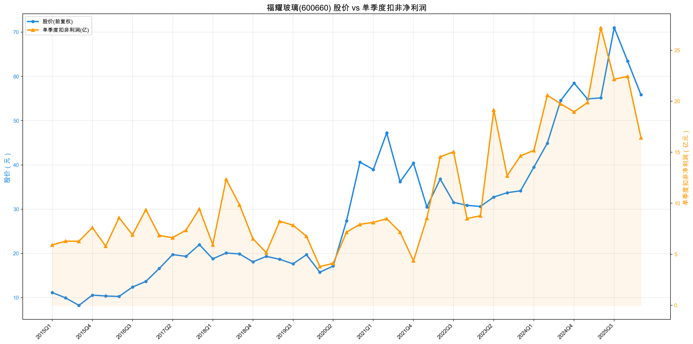

# 福耀玻璃（600660）投资分析报告

## 一、先判断能不能研究：公司画像 + 能力圈 + 红线

初筛结论：谨慎通过

- 公司画像：福耀玻璃是全球汽车玻璃龙头，主营汽车玻璃，同时向浮法玻璃、汽车饰件、精密铝件延伸，本质上是“汽车玻璃平台型制造龙头”。
- 能力圈：能看懂。赚钱逻辑清楚，核心来自规模、认证、工艺、全球配套与产品升级。
- 红线：未触发治理红线；但行业终究与汽车需求、汇率、海外扩产、资本开支相关，不属于最纯粹的无周期复利股。
- 后续重点：1）2026Q1 利润回落是否只是汇兑扰动；2）票据回款增加是否持续压制现金流；3）海外扩产后的产能消化与利润率是否稳定。

公司最核心的判断是：这不是靠题材和财技赚钱的公司，而是一家靠主业硬实力、全球供应链能力和产品升级吃饭的制造龙头。

## 二、好行业：是不是好生意？

一句话：汽车玻璃不是最优的非周期赛道，但在汽车零部件里属于壁垒高、格局好、长期有升级逻辑的优质细分。

### 1. 需求质量 / 非周期性

核心问题：需求是不是长期稳定、弱周期、可持续？

重点看：
- 汽车玻璃是汽车必需件，不是可有可无；
- 需求底层跟汽车产销挂钩，因此不是完全无周期；
- 但汽车智能化、天幕化、HUD、调光、加热、镀膜等趋势抬升单车玻璃价值量；
- 年报明确指出，高附加值产品占比提升是 2025 年增长的重要来源之一。

结论：需求有长期空间，但弱于消费品的稳定性，强于普通低端零部件。

### 2. 竞争格局

核心问题：龙头能不能持续提升份额和盈利能力？

重点看：
- 汽车玻璃行业有较强认证壁垒、客户导入壁垒和全球供货能力壁垒；
- 福耀已形成全球研发、设计、制造、配送和售后服务网络；
- 前五大客户销售额占年度销售总额 21.79%，单一客户最高仅 6.34%，没有严重依赖单一客户。

结论：竞争格局优于大多数汽车零部件子行业，龙头优势明显。

### 3. 进入壁垒

核心问题：新进入者是不是很难复制？

重点看：
- 主机厂认证周期长；汽车玻璃不是做出来就能卖给车厂，必须先进入整车厂的供应链认证体系。通常要经历样品测试、性能验证、法规验证、装车匹配、质量审核、产线审核、小批量试供、定点后批量爬坡等多个环节，周期往往以年计，而不是几个月就能完成；
- 大规模量产良率、工艺、交付稳定性要求高；
- 海外多基地布局、客户协同能力很难复制；
- 公司已形成“浮法玻璃—汽车玻璃—饰件/铝件”的产业链协同。

结论：壁垒很高，尤其是全球配套龙头地位不容易被替代。

### 4. 上下游议价权

核心问题：利润会不会被上下游拿走？

重点看：
- 下游是整车厂，大客户议价能力强，天然压制零部件厂商的话语权；
- 但福耀凭技术、交付和全球配套能力，仍有较强相对议价权；
- 2025 年汽车玻璃毛利率 31.32%，同比提升 1.17pct，说明公司并非只能被动接受价格压力。

结论：不是绝对强议价，但在汽车链里已属上乘。

### 5. 替代品威胁

核心问题：会不会被新技术替代？

重点看：
- 汽车玻璃本身不会消失；
- 真正的变化不是“被替代”，而是“被升级”：从普通玻璃变成智能集成玻璃；
- 这对龙头反而是利好。

结论：替代风险低，升级机会高。

好行业评分：
- 需求质量/非周期性：4/6
- 竞争格局：4/4
- 进入壁垒：4/4
- 上下游议价权：2/3
- 替代品威胁：3/3
- 小计：17/20

## 三、好公司·定性：有没有长期复利能力？

一句话：福耀的核心不是“玻璃”，而是围绕汽车玻璃形成的系统能力，这种系统能力就是护城河。

### 1. 护城河

核心问题：竞争对手为什么难以复制？

重点看：
- 品牌和主机厂长期信任；
- 全球研发与多地制造配套能力；
- 浮法玻璃、工艺设备、模具、饰件协同形成产业生态；
- 汽车新四化下，高附加值玻璃产品持续升级。

结论：这是多重护城河叠加，不是单一品牌故事。

### 2. 复购 / 粘性 / 低替代性

核心问题：客户会不会持续买，换别家是不是很容易？

重点看：
- 一旦进入主机厂配套体系，切换成本很高；
- 公司强调与客户同步设计、制造和服务；
- 海外生产运营前移，提高了客户协同和响应速度。

结论：客户粘性强，替换成本高。

### 3. 定价权

核心问题：公司能不能提价，还不明显伤害销量？

重点看：
- 2025 年汽车玻璃收入同比 +17.30%，成本同比 +15.33%，毛利率提升；
- 浮法玻璃收入同比 +8.71%，成本同比 +2.60%，毛利率提升 3.60pct；
- 高附加值产品占比提升，说明公司不是单靠拼价格增长。

结论：有一定定价权，更准确说是“结构升级定价权”。

### 4. 管理层

核心问题：管理层能不能长期把公司经营好？

重点看：
- 长期专注主业，没有明显跨界失控；
- 战略清晰：围绕“一片玻璃”延伸，而不是盲目多元化；
- 强调数字化、智能化、精益化、全球化协同。

结论：总体稳健、本分，符合制造业长期经营者特征。

好公司·定性评分：
- 护城河：6/7
- 复购/粘性/低替代性：5/5
- 定价权：4/5
- 管理层：3/3
- 小计：18/20

## 四、好公司·定量：利润是不是真，增长是否健康？

一句话：福耀近几年是利润、ROE、现金流、资产效率同步改善，质量很高；但 2026Q1 已开始出现短期波动信号，需要持续跟踪。

### 4.1 ROE质量与盈利模式

核心问题：ROE 是否健康、可持续，而不是靠加杠杆？

近年核心数据：

| 年份 | 营收(亿) | 归母净利润(亿) | 净利率 | 近似总资产周转率 | 近似权益乘数 | 加权ROE |
|---|---:|---:|---:|---:|---:|---:|
| 2020 | 199.07 | 26.01 | 13.06% | 0.52 | 1.78 | - |
| 2021 | 236.03 | 31.46 | 13.33% | 0.57 | 1.74 | - |
| 2022 | 280.99 | 47.56 | 16.92% | 0.59 | 1.73 | - |
| 2023 | 331.61 | 56.29 | 16.98% | 0.62 | 1.78 | 18.97% |
| 2024 | 392.52 | 74.98 | 19.10% | 0.65 | 1.79 | 22.72% |
| 2025 | 457.87 | 93.12 | 20.34% | 0.69 | 1.82 | 25.56% |

解读：
- ROE 提升主要来自净利率提升和资产周转率提升；
- 权益乘数整体变化不大，不是靠明显加杠杆把 ROE 拉上去；
- 这是比较健康的“效率+利润率”驱动型杜邦结构。

结论：盈利模式优质，ROE 质量高。

### 4.2 利润增长来源与持续性

核心问题：扣非利润是否真实增长？增长来自哪里？

年度数据：

| 年份 | 扣非净利润(亿) | 同比 |
|---|---:|---:|
| 2021 | 28.16 | 22.22% |
| 2022 | 46.66 | 65.69% |
| 2023 | 55.27 | 18.47% |
| 2024 | 74.46 | 34.71% |
| 2025 | 91.65 | 23.08% |

到 2026Q1 的扣非 TTM 为 88.21 亿，较 2025 年末 91.65 亿略有回落。

3 年扣非 TTM CAGR（按 2023Q1→2026Q1 的 TTM 口径）约 23.45%。

增长来源：
- 主业规模扩张；
- 高附加值产品占比提升；
- 海外市场和国内市场共同增长，2025 年国外收入同比 +18.81%，快于国内的 +14.58%。

结论：增长是真增长，不是一次性收益堆出来；但 2026 年开始已进入“高基数+波动加大”阶段，不能再线性外推高增速。

### 4.3 现金流质量

核心问题：利润是否真正变成现金？增长和分红是否依赖自身造血能力？

| 年份 | 归母净利润(亿) | 经营现金流(亿) | 资本开支(亿) | 自由现金流(亿) | 经营现金流/净利润 | 自由现金流/净利润 |
|---|---:|---:|---:|---:|---:|---:|
| 2020 | 26.01 | 52.78 | 17.73 | 35.05 | 2.03 | 1.35 |
| 2021 | 31.46 | 56.77 | 23.29 | 33.48 | 1.80 | 1.06 |
| 2022 | 47.56 | 58.93 | 31.30 | 27.63 | 1.24 | 0.58 |
| 2023 | 56.29 | 76.25 | 44.75 | 31.50 | 1.35 | 0.56 |
| 2024 | 74.98 | 85.62 | 54.81 | 30.81 | 1.14 | 0.41 |
| 2025 | 93.12 | 120.55 | 61.64 | 58.91 | 1.29 | 0.63 |

解读：
- 近 6 年经营现金流/净利润始终大于 1，说明利润总体能兑现成现金，这一点质量较好；
- 但自由现金流/净利润自 2022 年后明显下降，主要不是利润失真，而是资本开支持续抬升；
- 2024 年自由现金流/净利润仅 0.41，2025 年虽回升到 0.63，但仍谈不上特别轻资产；
- 2025 年自由现金流 58.91 亿，基本覆盖全年现金分红 54.80 亿，分红安全性尚可，但安全垫并不算特别厚。

但 2026Q1：
- 归母净利润 17.12 亿；
- 经营现金流仅 3.57 亿，同比 -82.22%，经营现金流/净利润仅 0.21；
- 资本开支 11.36 亿；
- 单季自由现金流约 -7.79 亿，自由现金流/净利润约 -0.46。

季报已明确说明：Q1 经营现金流下降主要因客户以汇票结算的金额同比增加，同时到期应付票据支付增加。

结论：长期看，福耀的利润兑现成现金的能力是合格甚至偏好的；但自由现金流对资本开支较敏感，2024-2026Q1 也显示出阶段性覆盖压力。因此这一项给高分但不满分，扣分点主要来自资本开支高、自由现金流/净利润偏弱，以及 Q1 现金流阶段性承压。

### 4.4 现金头寸与资产负债表安全性

核心问题：公司有没有安全垫？扣现金后估值是否更便宜？

按最新财报 2026Q1 计算：
- 货币资金：207.16 亿
- 定期存款：0 亿（Q1 未见可确认定期存款；2025 年报也说明其他流动资产主要是留抵增值税，不是定期存款）
- 有价证券/交易性金融资产：12.12 亿
- 长期负债：一年内到期非流动负债 38.27 亿 + 长期借款 72.93 亿 + 租赁负债 2.97 亿

现金头寸 = 207.16 + 0 + 12.12 - 38.27 - 72.93 - 2.97 = 105.10 亿

再按最新市值口径计算：
- 最新总市值（2026-06-05）：1398.82 亿
- 流通股数：20.03 亿股
- 最新扣非净利润 TTM：88.21 亿

得到：
- 每股净现金 = 现金头寸 / 流通股数 = 105.10 / 20.03 = 5.25 元/股
- 扣现金后市值 = 当前市值 - 现金头寸 = 1398.82 - 105.10 = 1293.72 亿
- 扣现金后 PE = 扣现金后市值 / 扣非净利润TTM = 1293.72 / 88.21 = 14.67 倍

解读：
- 公司安全垫是实打实存在的，最新现金头寸超过 100 亿；
- 但福耀不是那种“账上现金远大于经营负债、几乎无资本压力”的纯净现金牛，经营和扩产仍需要资金周转；
- 从估值角度看，当前 PE(TTM) 15.55 倍，扣现金后 PE 进一步降到 14.67 倍，说明主业实际估值比表面 PE 还便宜一些；
- 每股净现金 5.25 元/股，也说明当前股价里有一部分是现金资产在支撑。

### 4.5 营运质量：应收 / 存货 / 合同负债

2025 年末 vs 2024 年末：
- 应收账款：81.57 亿 → 84.78 亿，增幅 3.93%，明显低于营收增速 16.65%；
- 存货：59.71 亿 → 67.99 亿，增幅 13.88%，与收入增长大体匹配；
- 合同负债：8.07 亿 → 7.18 亿，小幅下降；
- 应收账款周转天数：71 天 → 66 天，改善；
- 存货周转天数：80 天 → 81 天，基本稳定。

2026Q1 vs 2025 年末：
- 应收账款：84.78 亿 → 63.60 亿，明显下降；
- 应收款项融资：29.23 亿 → 50.23 亿，显著上升；
- 存货：67.99 亿 → 67.46 亿，基本持平；
- 合同负债：7.18 亿 → 7.36 亿，小幅上升。

解读：
- Q1 现金流变差，不是典型坏账恶化，更像回款结构转向票据；
- 存货没有异常堆积；
- 合同负债未明显塌陷。

结论：营运质量总体健康。

### 4.6 产品结构与增长来源

2025 年主营业务分产品：

| 分产品 | 收入(亿) | 同比 | 毛利率 | 毛利率变动 |
|---|---:|---:|---:|---:|
| 汽车玻璃 | 418.89 | 17.30% | 31.32% | +1.17pct |
| 浮法玻璃 | 64.80 | 8.71% | 39.64% | +3.60pct |

2025 年主营业务分地区：

| 地区 | 收入(亿) | 同比 | 毛利率 |
|---|---:|---:|---:|
| 国内 | 242.41 | 14.58% | 40.39% |
| 国外 | 208.57 | 18.81% | 32.64% |

解读：
- 核心增长来源依旧是汽车玻璃；
- 国外增速快于国内，全球化布局继续兑现；
- 浮法玻璃更多是产业链协同和成本优势，不是主要投资故事；
- 真正决定未来估值中枢的，还是高附加值汽车玻璃升级。

好公司·定量评分：
- ROE质量与盈利模式：9/9
- 利润增长来源与持续性：6/7
- 现金流质量：6/7
- 现金头寸与资产负债表安全性：5/6
- 营运质量：4/5
- 产品结构与增长来源：5/6
- 小计：35/40

## 五、好时机：现在买贵不贵？

一句话：短期业绩受扰动，股价已回撤，估值重新回到历史偏低区间；现在更像“好公司恢复合理估值后的观察/布局区”，而不是泡沫阶段。

### 5.1 股价 vs 利润线

主图：

辅助图：

季度图：

图表解读：
- 长期看，股价和扣非 TTM 利润相关性较强，相关系数约 0.829；从首个有效 TTM 季度到 2026Q1，股价约涨 5.4 倍，扣非 TTM 约涨 3.4 倍，说明长期回报既来自利润增长，也来自估值变化；
- 当前最关键的观察点不是“利润有没有崩”，而是 2025Q3 之后利润线从快速上升转为高位趋平略回落，而股价先一步明显回撤，说明市场已经开始提前消化增速放缓、汇兑扰动和估值收缩。

分阶段复盘：
- 2015—2019：基本面稳步增长阶段。股价整体跟着利润线走，估值波动不算极端，主逻辑还是利润慢慢增长。
- 2020—2021Q1：蓝筹白马抱团阶段。利润线并没有同步大幅跳升，但股价快速冲高，明显跑在利润前面，本质是市场集中给龙头抬估值，属于典型 PE 扩张。
- 2021Q2—2023：估值消化阶段。公司利润线持续上行，但股价长期震荡偏弱，说明前面抱团给出的高估值被逐步消化，股价弱更多是估值回归，不是基本面恶化。
- 2024—2025Q3：基本面兑现 + 估值修复阶段。利润和股价重新同向上行，但股价斜率仍快于利润线，说明除了利润增长，市场也重新交易了龙头溢价。
- 2025Q4—2026Q1：高位再定价阶段。利润线高位趋平略回落，股价先一步明显回撤，市场开始提前交易增速放缓、汇兑扰动和现金流压力。

结论：最关键的是把 2020—2021Q1 的抱团行情单独拎出来看。那一段是明显的估值泡沫化；2021Q2—2023 则是较长时间的估值消化。站在当前看，福耀已经不在当年那种抱团高估值位置，更像是经历过泡沫、消化、再修复之后，重新回到“利润高位、估值偏低、等待再验证”的区间。

### 5.2 PE及PE百分位

截至 2026-06-05：
- 股价：53.60 元
- 总市值：1398.82 亿元
- PE(TTM)：15.55 倍
- PB(MRQ)：3.57 倍
- PS(TTM)：3.02 倍
- 近十年 PE(TTM) 分位：约 16.2%（按同花顺近十年口径）

解读：
- 按公司自己的历史估值看，当前处于偏低区间；
- 横向看并非行业最便宜，但考虑其龙头地位与质量，这个估值具备吸引力；
- 从历史分位看，当前估值更偏向“合理偏低”，而不是“贵”；
- 我之前算出的约 12.1% 与同花顺 16.24% 有差异，常见原因是统计起止日、是否剔除异常/负值区间、以及最新收盘日口径不同。既然你这里已查询到同花顺近十年百分位，报告统一以 16.24% 为准更稳妥。

### 5.3 PEG

- 3 年扣非 TTM CAGR：约 23.45%
- 当前 PE(TTM)：15.55 倍
- PEG：约 0.66

解读：
- PEG 小于 1，说明当前估值与过去 3 年真实利润增长相比并不贵；
- 但要注意，未来增速未必还能维持过去 3 年水平，所以 PEG 只能做辅助参考。

### 5.4 股息率

2025 年分红口径：
- 中期每股 0.90 元
- 年末每股 1.20 元
- 合计每股 2.10 元

按 2026-06-05 股价 53.60 元计算：
- 完整财年股息率约 3.92%

解读：
- 对一家制造业龙头来说，接近 4% 的股息率具备吸引力；
- 2025 年自由现金流约 58.91 亿，全年现金分红约 54.80 亿，覆盖基本够，说明分红有较强支撑。

### 5.5 市场信号与预期差

市场当前的担忧主要有三类：
- 2026Q1 利润同比下滑；
- 经营现金流大幅下滑；
- 汽车链整体偏周期，市场不愿给高估值。

但预期差也很清楚：
- Q1 利润下滑主要由汇兑损益影响，季报披露若扣除此因素，利润总额同比增长 9.63%；
- 现金流下滑主要因票据结算比例上升，应收账款并未恶化；
- 龙头的结构升级、全球化和高现金头寸，可能被短期情绪掩盖。

### 5.6 毛估估

中性档：
- 假设未来 2-3 年利润中速增长，回到 10%-15% 区间；
- 合理 PE 维持 16-18 倍；
- 当前 15.55 倍 PE 不贵，具备温和上行空间。

保守档：
- 假设利润进入低个位数增长甚至短期横盘；
- 合理 PE 压到 13-14 倍；
- 以福耀的行业地位、分红和资产负债表安全性看，下行空间相对可控，但不会像纯消费股那样稳。

好时机评分：
- 股价vs利润线：4/5
- PE及PE百分位：4/5
- PEG：1/2
- 股息率：3/3
- 市场信号与预期差：1/2
- 毛估估：2/3
- 小计：15/20

## 六、投资结论：值不值得下注，拿不拿得住？

### 1. 胜率

胜率来自：
- 龙头地位稳；
- 护城河真实；
- ROE 高且健康；
- 现金头寸厚；
- 分红能力强。

不足在于：
- 赛道不是完全无周期；
- 汇率与海外扩产会让季度波动放大。

结论：胜率较高。

### 2. 赔率

赔率来自：
- 当前 PE 仅 15.55 倍；
- 近十年历史分位约 16.24%；
- 股息率接近 4%；
- 短期情绪已对 Q1 扰动作出反应。

不足在于：
- 行业属性决定市场很难长期给特别高估值；
- 若利润进入平台期，估值扩张空间有限。

结论：赔率中等偏上。

### 3. 长期持有检查项

检查项 | 判断
---|---
长期需求是否仍存在 | 是
护城河会不会随时间增强 | 大概率是，高附加值和全球化会增强壁垒
增长是否不需要持续烧钱 | 部分是，但资本开支不低
是否具备长期定价权 | 有一定结构升级定价权
管理层是否本分专注主业 | 是
即使 PE 不扩张，靠利润+分红是否有回报 | 是

结论：长期持有逻辑成立，但不是“无脑躺赢型”资产，需要持续跟踪行业和现金流。

### 4. 评级与行动

- 高胜率 + 中等偏上赔率
- 当前结论：强烈关注，可进入重点研究/配置候选
- 行动建议：若你在制造业里寻找高质量核心资产，福耀值得重点跟踪；考虑其并非纯非周期复利股，且Q1已出现现金流和利润波动，后续仍要持续跟踪现金流、汇率和海外扩产节奏。

## 七、投资逻辑与证伪条件

### 7.1 投资逻辑

1. 全球汽车玻璃龙头，行业位置稳固；
2. 高附加值产品提升单车价值量，结构升级仍在继续；
3. 海外布局和本地化配套能力提升全球客户黏性；
4. 高 ROE、强现金头寸、较好分红，使其在制造业中具备稀缺性；
5. 当前估值处于历史偏低区间，短期扰动后具备重新审视价值的意义。

### 7.2 证伪条件

1. 高附加值玻璃渗透率提升停滞；
2. 海外业务利润率趋势性下滑，全球化红利转为负担；
3. 连续 2-3 个季度经营现金流明显弱于利润，且票据/应收结构继续恶化；
4. 核心客户份额流失，毛利率持续下行；
5. 利润进入长期平台甚至下行，但市场仍给予高估值，赔率消失。

## 八、维度打分汇总表

| 模块 | 小计 |
|---|---:|
| 好行业 | 17 |
| 好公司·定性 | 18 |
| 好公司·定量 | 35 |
| 好时机 | 15 |
| 总分 | 85 |

评级：强烈关注

补充说明：这个85分更多反映“制造龙头中的高质量稀缺性”，虽然不代表它和白酒、调味品、连锁消费这类纯非周期复利公司在风险结构上完全等价，但按本框架的评分规则，>80分仍归为“强烈关注”。

## 九、总结

福耀玻璃的核心优势，不在于“这是一家玻璃公司”，而在于它是一家围绕汽车玻璃形成全球协同能力、工艺能力、客户认证能力和产品升级能力的系统型龙头。

2025 年报体现的是一家公司在利润率、ROE、现金流、全球化和结构升级上的同步兑现；2026Q1 则提醒我们，这仍然是一家制造业公司，会受到汇率、结算方式和扩产节奏扰动。

所以，对福耀最合适的标签不是“纯复利消费股”，而是：

“高胜率、现金安全垫较厚、估值历史偏低的制造龙头核心资产。”

## 十、数据校验结果

### 正确
1. 2025 年营业总收入 457.87 亿：年报 PDF、main_year.xls、main_simple.xls 季度加总一致。
2. 2025 年归母净利润 93.12 亿：年报 PDF 与 Excel 基本一致，仅存在百元级四舍五入差异。
3. 2025 年扣非净利润 91.65 亿：年报 PDF 与 Excel 基本一致，仅存在百元级四舍五入差异。
4. 2025 年经营现金流净额 120.55 亿：年报 PDF 与东方财富现金流接口一致。
5. 2025 年资本开支 61.64 亿：年报正文与东方财富现金流接口一致。
6. 2025 年其他流动资产增加主要是留抵增值税，不是定期存款。
7. 2026Q1 利润总额同比下降主要受汇兑损益影响，季报有明确说明；若扣除汇兑影响，利润总额同比增长 9.63%。
8. 2026Q1 经营现金流净额同比下降主要因客户以汇票结算增加、到期应付票据支付增加，季报有明确说明。

### 需说明
1. PE、PEG、近十年 PE 分位属于“市场数据 + 计算结果”，不是年报原文指标，已单独标注口径。
2. 现金头寸采用彼得林奇口径估算，明确不扣短期借款。

### 不可直接从财报验证
1. 近十年 PE 分位需要历史估值序列计算；
2. 股价 vs 利润线相关系数、涨幅倍数来自季度 Excel + yfinance 对齐计算。
