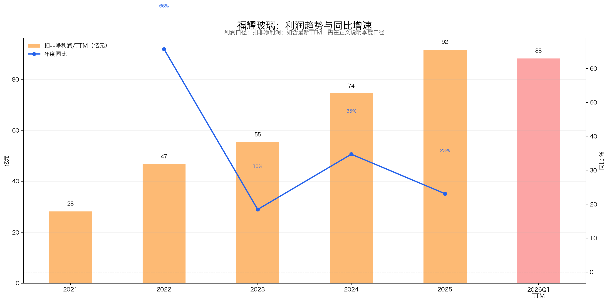
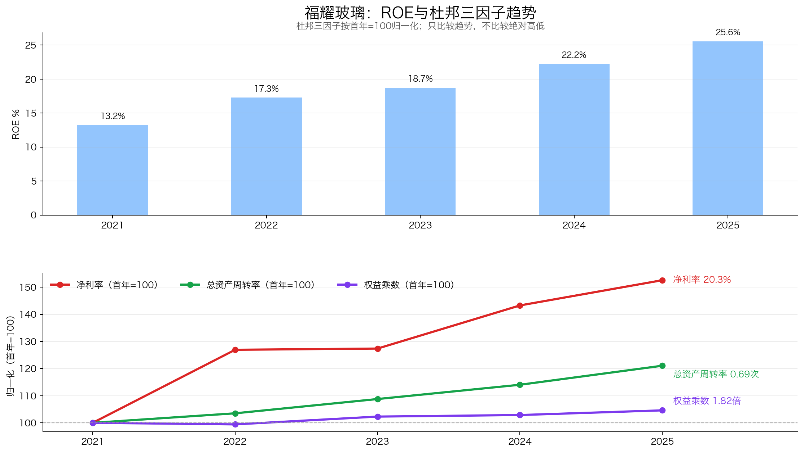
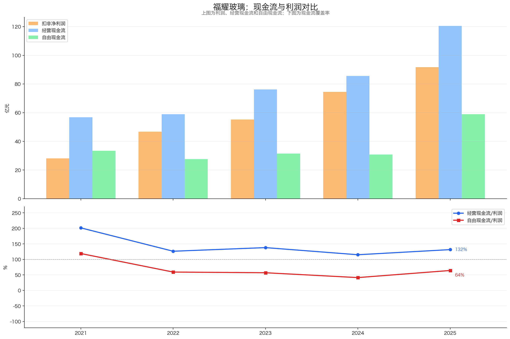
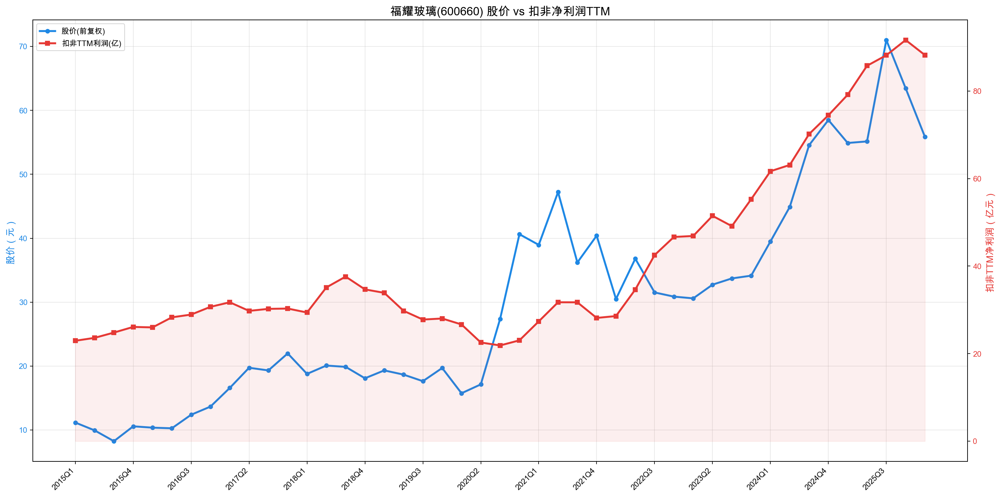

# 福耀玻璃：15倍PE已经不贵，真正要盯的是扩产后的自由现金流

> 数据范围：行情截至2026年6月5日，财务截至2026年一季报，年度数据截至2025年年报。本文仅供学习研究，不构成投资建议。

**我的选股框架**：我先问五个问题。第一，能不能看得懂：业务简单、盈利模式清楚，未来自由现金流才有一定可预测性，而公司的价值本质上是未来自由现金流的折现。第二，能不能活得久：需求、产品和品类不易被替代，长期投资才有复利基础。第三，利润能不能守得住：行业竞争要“月朗星稀”，公司还要有护城河；护城河不等于定价权，强势客户仍可能拿走一部分利润。第四，能不能高效复利：增长需要多少资本、投入能产生多高回报、下行时有没有现金保护。第五，当前价格买得值不值：市场预期已经反映在股价中，只有实际增长超过市场预期增长，投资者才容易获得好回报。前四问判断公司值不值得长期持有，第五问判断当前价格值不值得买。

> **福耀玻璃的一句话判断｜3R综合评级：A（81.0/100，关注）**：福耀的业务容易理解，汽车玻璃是长期存在的安全部件，认证、工艺、成本和全球配套构成系统型护城河，ROE与经营现金流在制造业中少见地优秀；但它不是轻资产公司，下游整车厂也限制了绝对定价权。报告基准日15.55倍PE处于近十年偏低位置，当前价格已经有吸引力，能否提高仓位取决于海外扩产回报和自由现金流能否重新改善。

两个数字最能说明福耀眼下的矛盾。2025年扣非利润达到91.65亿元，经营现金流达到120.55亿元；同年资本开支也升至61.64亿元。公司越来越赚钱，全球扩产却拿走了更多现金。

到了2026年一季度，扣非TTM略降至88.21亿元，单季自由现金流约为-7.79亿元。与此同时，报告基准日PE只有15.55倍，近十年分位约16.24%，静态股息率约3.92%。价格不算贵，但市场显然在等现金流给出答案。

## 一、能不能看得懂：卖的是玻璃，赚的是系统能力的钱

福耀以汽车玻璃为核心，同时经营浮法玻璃、汽车饰件和精密铝件。客户主要是国内外整车厂，产品从前后挡、侧窗延伸到天幕、HUD、调光、加热和镀膜玻璃。

表面看，它赚的是制造汽车玻璃的钱。再往下一层，真正值钱的是一整套配套能力：通过法规和主机厂认证，与新车型同步研发，把复杂产品稳定地大规模生产出来，再从全球工厂按时交付。

这套生意的收入由汽车产销量、客户份额和单车玻璃价值共同驱动，利润还取决于产品结构、良率、原材料、能源、汇率及产能利用率。智能天幕、HUD和调光玻璃提高单车价值，规模与浮法玻璃协同则帮助公司控制成本。

客户一旦换供应商，需要重新承担验证、匹配和量产爬坡风险，因此不会只为一点价差轻易切换。福耀卖的不是一块标准化玻璃，而是能够长期稳定交付的安全部件解决方案。这也是未来现金流可以大致分析的基础。

## 二、能不能活得久：汽车玻璃不会消失，增长靠单车价值和全球份额

汽车玻璃是法规与安全必需部件。动力形式可以从燃油切换到电动，驾驶舱也会越来越智能，但玻璃不会因此消失。技术变化更多表现为玻璃面积变大、功能增加，对有研发和量产能力的龙头反而有利。

它仍然不是非周期生意。新车销量、车型周期和整车厂经营压力都会传导到订单与价格。福耀未来也不能只依靠全球汽车总量高速增长，主要增长来源是高附加值产品提高单车价值、继续提升全球客户份额，以及海外本地化产能承接订单。

过去的增长相当强。2021年至2025年，扣非利润从28.16亿元增至91.65亿元；按2023年一季度至2026年一季度的TTM口径计算，3年复合增速约23.45%。增长来自主业规模、产品升级和海外扩张，并非一次性收益。

但历史高增长不能直接外推。2026年一季度扣非TTM回落至88.21亿元，进入高基数和波动加大的阶段。季报披露，若扣除汇兑损益影响，利润总额仍同比增长9.63%，说明主业没有突然失速；海外新增产能能否维持利用率和利润率，才是中长期增长质量的检验。

## 三、利润能不能守得住：护城河很深，定价权却不是无限的

汽车玻璃行业的格局优于多数汽车零部件细分市场。新进入者不仅要建设产线，还要跨过主机厂认证、同步开发、法规验证、量产良率和全球交付等多道门槛。任何一项不稳定，都可能影响整车质量和生产节奏。

福耀的护城河不是单一品牌，而是认证、工艺、成本、规模和全球网络叠加形成的系统能力。2025年前五大客户合计占收入21.79%，最大单一客户占6.34%，客户结构也没有过度集中。

护城河不等于可以随意涨价。整车厂采购规模大，还有年度降价压力，福耀更现实的定价权来自产品升级和效率：同样给一辆车配玻璃，通过天幕、HUD、隔热或调光功能提高价值，同时用规模和良率消化成本。

2025年汽车玻璃收入增长17.30%，毛利率提高1.17个百分点，说明这种“结构升级定价权”仍在发挥作用。短期需要警惕原材料、汇率、客户年降和海外工厂爬坡，长期则要看高附加值产品能否继续带动毛利率。若核心客户份额流失、汽车玻璃毛利率持续下降，护城河就没有顺利转化为利润。

## 四、能不能高效复利：高回报是真的，重资本也是事实

先看增长需要多少投入。2025年福耀经营现金流120.55亿元、归母利润93.12亿元，资本开支61.64亿元，自由现金流58.91亿元。经营现金流长期高于净利润，利润含金量很好；但资本开支从2020年的17.73亿元一路升高，说明全球扩张需要真金白银。

所以福耀不能被归入轻资产公司。它的优势不是“几乎不用投入”，而是过去投入后的回报高于多数制造企业。

2023年至2025年，加权ROE从18.97%升至25.56%。同期净利率从16.98%升至20.34%，资产周转率从0.62升至0.69，权益乘数只从1.78小幅升至1.82。ROE改善主要靠利润率和效率，而不是加杠杆。

下行保护也不差。按2026年一季报估算，货币资金207.16亿元，加上12.12亿元交易性金融资产，扣除一年内到期非流动负债、长期借款和租赁负债后，现金头寸约105.10亿元。2025年自由现金流58.91亿元，略高于约54.80亿元现金分红，能够覆盖，但安全垫不算厚。

2026年一季度是需要盯紧的信号：经营现金流只有3.57亿元，资本开支11.36亿元，自由现金流约-7.79亿元。季报解释为客户票据结算增加、到期应付票据支付增加，应收账款反而下降，暂时更像结算结构扰动，而不是坏账恶化。如果这种情况连续两三个季度不回转，判断就要改变。

## 五、当前价格买得值不值：低估值提供赔率，现金流决定兑现

增长陷阱比较的不是公司有没有增长，而是实际增长能否超过股价隐含的市场预期。福耀过去经历过明显的估值扩张与消化：2020年至2021年一季度，股价跑在利润前面；2021年二季度至2023年，利润继续上升，股价却用震荡消化高估值；2024年至2025年三季度，利润增长与估值修复共同推高股价；此后利润高位趋平，股价先行回撤。

按2026年6月5日的报告基准日，关键估值如下：

| 指标 | 数据 |
|---|---:|
| 股价 / 市值 | 53.60元 / 1,398.82亿元 |
| 扣非利润TTM | 88.21亿元 |
| PE-TTM | 15.55倍 |
| 扣现金后PE | 14.67倍 |
| 近十年PE分位 | 约16.24% |
| 静态股息率 | 约3.92% |

市场没有把福耀当作高增长消费股定价，而是给了汽车周期、重资本和利润平台期折价。我认为这个预期并不苛刻。公司不需要重回过去20%以上的增长，只要产品升级和全球份额支持中低个位数以上增长，扩产没有破坏自由现金流，当前估值就能提供合理回报。

公司的价值最终来自未来自由现金流。为了直观比较赔率，这里用“未来扣非利润×期末PE”做简化的3年情景估算。起点是扣非利润88.21亿元、当前市值1,398.82亿元和3.92%静态股息率：

| 情景 | 3年后扣非利润 | 期末PE | 3年后市值 | 价格回报 | 3年静态分红 | 累计总回报 |
|---|---:|---:|---:|---:|---:|---:|
| 中性 | 88.21×1.08³＝111.12亿元 | 18倍 | 2,000.15亿元 | +42.99% | +11.76% | +54.75% |
| 保守 | 88.21×1.00³＝88.21亿元 | 13倍 | 1,146.73亿元 | -18.02% | +11.76% | -6.26% |

计算先估未来利润，再乘期末PE得到未来市值，最后加入持有期间的静态分红。分红按当前股息率直接乘以3，未考虑未来分红变化、税费和再投资；利润乘PE后也不再加回全部现金，避免重复计算。情景只是比较赔率，不是精确预测。

这个价格已有吸引力，但还没便宜到可以无视经营变化。中性情景需要利润恢复增长，也需要市场认可福耀的龙头质量；如果利润长期横盘、资本开支维持高位，13倍制造业估值并不离谱，回报主要只能依靠分红。

## 六、五个问题的答案：A级候选，先关注扩产回报

五个问题里，福耀前四关基本通过。生意看得懂，汽车玻璃能活得久，系统型护城河帮助公司守住利润，高ROE也不是杠杆堆出来的。需要打折的是资本强度和周期性：福耀是一家投入产出优秀的重制造企业，不是低投入就能自然复利的消费公司。第五关的答案偏积极，15倍左右PE、近十年偏低分位、接近4%的股息率和超过100亿元现金头寸，已经给出了一定安全边际。

基于3R框架，福耀玻璃得分如下：

| 维度 | 得分 | 权重 | 核心判断 |
|---|---:|---:|---|
| Right Business | 48.5 | 60 | 系统型壁垒深、回报高，资本开支是主要短板 |
| Right People | 16.0 | 20 | 长期专注主业，全球化执行已验证，扩产纪律待跟踪 |
| Right Price | 16.5 | 20 | 历史估值偏低，股息和现金有缓冲，利润平台期限制上限 |
| 合计 | 81.0 | 100 | A级，关注并分批验证 |

现阶段更合适的做法，是把福耀纳入高质量制造业核心候选，而不是因为历史低分位直接重仓。提高关注需要看到三件事：一季度票据结算扰动消退，经营现金流与利润重新匹配；高附加值汽车玻璃继续带动毛利率和扣非利润；海外新增产能利用率提升，同时资本开支下降、自由现金流改善。

如果连续两三个季度经营现金流明显弱于利润，票据或应收结构继续恶化；海外业务利润率趋势性下降，新增产能长期低效；或者核心客户份额流失、汽车玻璃毛利率持续下行，就需要承认投资逻辑正在被证伪。

福耀的估值已经进入值得研究和分批验证的区间。15倍PE给了赔率，扩产后的自由现金流决定它能不能成为真正的长期复利资产。

---

数据与口径说明：本文参考[《福耀玻璃3R投资分析简报（2026-07-22）》](https://github.com/nightsleon/investment/blob/main/600660_%E7%A6%8F%E8%80%80%E7%8E%BB%E7%92%83/reports/%E7%A6%8F%E8%80%80%E7%8E%BB%E7%92%83_3R%E6%8A%95%E8%B5%84%E5%88%86%E6%9E%90%E7%AE%80%E6%8A%A5_2026-07-22.md)及完整投资分析报告。未刷新2026年6月5日之后的行情与公告。现金头寸按彼得·林奇口径估算；2026年一季报未见可确认定期存款，其他流动资产未直接计入现金。最新产能利用率、海外扩产项目分部ROIC，以及一季度票据结算在后续季度的回转程度仍待验证。
