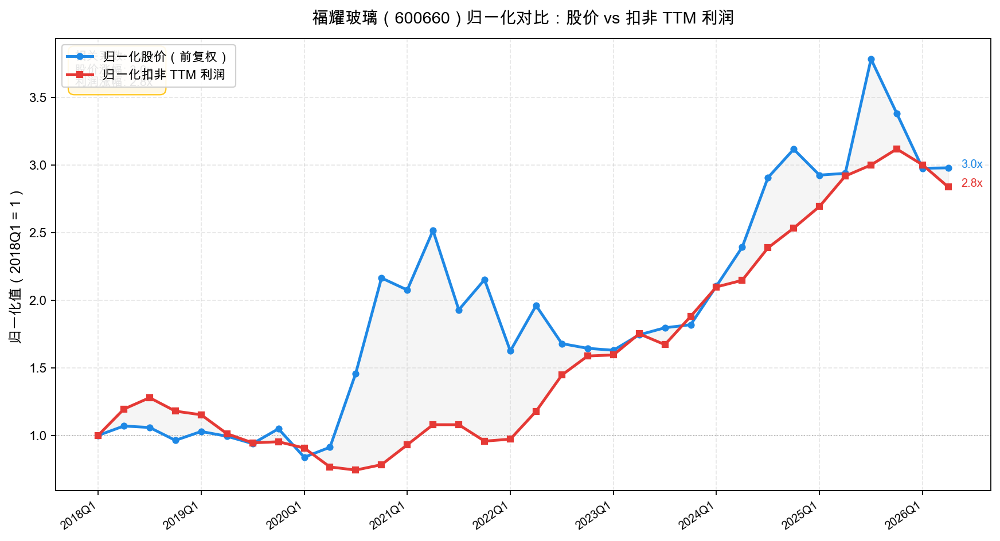

# 福耀玻璃（600660）2026 中报财报速览——汇兑掩主业增势，毛利率创新高

> 报告期：2026 年 1—6 月｜披露日：2026 年 8 月 19 日｜未经审计。数据取自公司《2026 年半年度报告》。单季数字由半年报减一季报推算。市值、PE 按 9 月 2 日收盘实测。

**一句话结论：** 营收微增、利润看似下滑 17%，实则汇兑吃掉了约 14 亿利润总额（税后影响归母约 7 亿）；扣掉汇率扰动，主业利润同比增约 5%，毛利率再升 1.8 个百分点到 38.8%，高端产品占比加速提升。当前估值处于 2018 年以来两成低分位，是被汇率"误伤"的优质资产，但需观察国内车市需求与存货周转。

**主要指标速览**

| 指标 | 2026H1 | 2025H1 | 同比 |
|------|--------|--------|------|
| 营业收入 | 219.71 亿 | 214.47 亿 | +2.44% |
| 归母净利润① | 39.70 亿 | 48.05 亿 | -17.37% |
| 扣非归母① | 38.79 亿 | 47.07 亿 | -17.58% |
| 整体毛利率 | 38.84% | 37.06% | +1.78pct |
| 经营现金流 | 45.51 亿 | 53.54 亿 | -15.01% |
| 净现金（6月末）② | 约 3.7 亿 | — | 现金 221 亿 vs 有息负债 218 亿 |
| 存货周转天数 | 93 天 | 82 天 | +11 天 |
| 中期分红率 | 65.7% | — | 每股 1.0 元 |
| PE(TTM) | 17.6 倍 | — | 2018 年以来约 23% 分位 |

> ①归母/扣非降幅几乎全来自汇兑：本期汇兑损失 8.03 亿，去年同期为汇兑收益 6.02 亿，利润总额层面一正一反差约 14 亿；扣除汇兑后利润总额同比 +4.78%（公司口径），主业实际在增长，解读见利润表节。②净现金 = 货币资金 221.27 亿 − 有息负债 217.57 亿，未含 29.5 亿应收款项融资（银行承兑汇票）。利润表/现金流行对比 2025H1；期末科目行对比基准为 2025 年末。市值、PE 按 9 月 2 日收盘实测。

---

## 一、它赚不赚钱？——利润表

上半年**营收 219.71 亿元**，同比 **+2.44%**，跑赢汽车行业（上半年国内汽车销量同比 -4.1%）。分产品看，汽车玻璃收入 202.70 亿元，同比 +3.75%，毛利率 32.45%、提升 1.55 个百分点；浮法玻璃 31.61 亿元，+2.11%，毛利率 41.58%、提升 2.18 个百分点。

整体**毛利率 38.84%**，比去年同期提升 1.78 个百分点，创近年新高。高附加值产品占比同比提升 8.03 个百分点——智能天幕、可调光玻璃、HUD 抬头显示玻璃、超隔绝玻璃等新品类持续放量，拉高了整体毛利水平。

**利润下滑的主因是汇兑。** 归母净利润 39.70 亿元，同比 -17.37%；**扣非归母 38.79 亿元，同比 -17.58%**。拆开看就不一样了：

- 本报告期汇兑损失 8.03 亿元，上年同期是汇兑收益 6.02 亿元，一正一反在利润总额层面差了约 14 亿；
- 扣掉汇兑因素，利润总额同比 +4.78%（公司口径），主业实际上在增长；
- 财务费用从去年 -8.75 亿（净收益）转为 +5.02 亿，变动 13.8 亿，几乎全部来自汇兑。

**Q2 单季（=H1−Q1）增速进一步放缓。** Q2 营收 115.58 亿元，同比仅 +0.18%，比 Q1 的 +5.08% 明显降速；Q2 归母净利 22.59 亿元，同比 -18.60%。Q1 汇兑损失 4.39 亿、Q2 单季约 3.64 亿，Q2 汇兑拖累其实更小，但利润降幅反而更深——说明 Q2 主业本身走弱了。国内车市上半年整体走弱，公司靠产品结构升级勉强维持正增长，需求端的压力需要警惕。

费用方面，销售费用 6.49 亿（+3.84%）、管理费用 16.49 亿（+7.59%），均与营收增速基本匹配；研发费用 10.33 亿，同比 +17.01%，明显快于收入，持续投在汽车玻璃智能化、功能化方向。

归母净利率 18.07%，同比下降 4.34 个百分点，主要是汇兑拖累；扣汇后净利率实际略有提升。

---

## 二、赚到的钱到手了吗？——现金流量表

经营活动现金流净额 45.51 亿元，同比 -15.01%，但仍高于净利润（45.51 > 39.72），经营现金流/净利润 = 1.15，盈利质量扎实。同比下降的原因是去年末应付票据本期兑付、以及本期减少汇票结算改用现金采购，不是收入端的问题。

收现比 98.5%，与去年基本持平（销售商品收现 216.38 亿元 / 营收 219.71 亿元），收入基本都变成了真金白银。

**自由现金流 22.53 亿元。** 计算：经营现金流 45.51 − 资本开支 22.98 = 22.53 亿。资本开支同比减少约 5.6 亿，新项目投入节奏可控。

期末现金及等价物 221.27 亿元，比年初增加 28.6 亿。筹资活动净流入 14.71 亿（主要是新增借款和发债）；汇率变动导致现金缩水 6.1 亿。

---

## 三、家底厚不厚？——资产负债表

期末总资产 739.51 亿元，**资产负债率 48.38%**。有息负债合计 217.57 亿元（短期借款 96.6 亿 + 一年内到期 36.3 亿 + 长期借款 69.6 亿 + 应付债券 8.0 亿 + 超短融 8.5 亿 + 中票 8.0 亿），而现金及等价物 221.27 亿元，净现金约 3.7 亿，基本打平。加上 29.5 亿应收款项融资（银行承兑汇票，等同于现金），实际可动用资金更充裕。

**排雷检查：**

- **商誉极低。** 1.54 亿元，仅占归母净资产 0.40%，几乎可以忽略。福耀历史上都是内生增长为主，没有大规模并购留下的商誉包袱。经验上商誉超过净资产三成就该警惕，这里远低于线。
- **存货上升需关注。** 存货 70.40 亿元，比年初增 2.4 亿；存货周转天数从 82 天升至 93 天（汽车玻璃 69 天 vs 去年 60 天）。公司没解释原因，可能与原材料备货、新品类（铝饰件等）产能爬坡有关，也可能是需求走弱的信号，需要三季报继续观察。
- **应收账款改善。** 应收 77.30 亿元，比年初降 7.5 亿；应收账款周转天数 67 天，同比少 3 天，回款能力在加强。
- **应收票据增加。** 从 4.34 亿增至 7.05 亿，周转天数从 25 天升至 29 天，客户汇票期限变长。
- **大股东质押：** 未发现控股股东质押情况（三益发展持股 14.97%，河仁慈善基金会 6.50%，均无质押）。
- **关联交易：** 上半年合计约 1.21 亿元，占营收比例不到 0.6%，金额很小。
- **非标意见：** 无，中报未经审计但无保留意见表述。
- **美国工厂火情。** 福耀美国汽车玻璃二期厂房发生火情，营业外支出 1.35 亿元，已投保财产险和利润中断险，理赔手续在办理中。属一次性事件，不影响长期价值。

---

## 四、明年还能赚吗？——看未来

增长引擎有三个：产品升级、海外扩张、饰件新业务。

产品结构升级是当前最强的拉力。高附加值产品占比已连续提升（本次 +8.03pct），天幕玻璃、调光玻璃、HUD 等新品单价远高于传统玻璃，直接推高毛利率。汽车"新四化"（电动化、智能化、网联化、共享化）对玻璃提出了更多功能要求，福耀作为全球龙头技术储备最深，受益也最直接。

海外布局持续深化。境外资产 252.96 亿元，占总资产 34.2%。福耀美国上半年收入 39.75 亿元、净利润 4.67 亿元，运营正常。欧洲、美国本地生产可以规避关税和汇率风险，贴近客户响应更快。公司历年来海外收入约占一半（中报未披露具体比例，以境外资产占比 34.2% 参考）。

铝饰件等新业务在逐步放量。上海铝件、重庆铝件、安徽饰件、安徽模具等新项目在建，公司从"一片玻璃"向"汽车饰件全解决方案"拓展，想打开第二增长曲线。这些项目目前还在投入期，是资本开支的主要去向，明后年有望逐步贡献利润。

**股东回报慷慨。** 中期拟每股派现 1.00 元，合计 26.10 亿元，分红率 65.73%。按现价 57.06 元、中期分红 ×2 粗算全年，股息率约 3.5%。公司连续多年高分红，中期分红也已常态化，回报意愿明确。

**需要跟踪的变量：**
- 国内汽车销量能否企稳回升（上半年行业 -4.1%）；
- 美元、欧元汇率走向（公司历年来海外收入约占一半，汇率对利润表的扰动很大）；
- 存货周转天数能否回落；
- 铝饰件新业务的放量节奏和盈利水平。

---

## 红绿灯速判

🔴 **红灯：均未触发**——无大存大贷、商誉极低（0.4%）、无控股股东质押、无非标意见、无重大关联交易、无违规担保、无占用资金。

🟡 **黄灯：三项**——存货周转天数上升（82→93 天，需观察是备货还是需求走弱）；Q2 主业走弱（汇兑拖累更小但利润降幅反而更深，收入仅 +0.18%）；汇兑损益波动大（利润总额层面影响约 14 亿，掩盖了真实经营趋势）。

🟢 **绿灯：八项**——毛利率创新高（38.8%）、扣汇后主业利润正增长（+4.8%）、经营现金流 > 净利润（1.15 倍）、收现比近 100%（98.5%）、基本净现金（221 亿现金 vs 218 亿有息负债）、研发投入加大（+17%）、高分红（中期分红率 66%）、高附加值产品加速渗透（+8pct）。

---

## 估值与观察点

把股价和利润线放在同一张图上（归一化起点 2018 年初），能看得很清楚：利润从 30 亿级爬升到 90 亿级，再回落到 83 亿 TTM；股价从 2021 年高点回落至今。两条线之间的距离，就是估值收缩的幅度。

截至 2026 年 9 月 2 日，2018 年以来股价涨 2.98 倍、扣非 TTM 利润涨 2.84 倍，长期高度匹配（相关系数 0.83）。短期看两条线有分叉——利润从 2025 年高点回落了约 9%，股价从高点回撤更多，估值有所压缩。

按彼得·林奇的两线图法读：盈利站住了，股价迟早追上来补课；盈利再往下掉，股价就下来找盈利。福耀现在的核心，不是利润够不够多，而是利润下一步往哪走。

**PE-TTM 口径推导：** 17.56 倍 = 总市值 1489.12 亿 ÷ TTM 归母 84.78 亿（93.12 − 48.05 + 39.70）。

**2026E 外推：** 按近三年（2023—2025）H1 归母占全年比例平均 49.5% 外推，2026 年全年归母约 80 亿，对应 PE 约 18.6 倍。注意这是表观利润，含了上半年 8 亿汇兑损失——如果汇率回到中性，实际盈利对应的 PE 大约在 17 倍左右。

**历史分位：** PE(TTM) 17.56 倍处于 2018 年以来约 23% 分位（2105 个交易日，东财可获得数据自 2018 年 1 月起），偏低。区间内最低 12.2 倍、最高 70.3 倍（疫情后 2021 年新能源行情高点），中位数 20.0 倍。

分位很低，但低得有原因。分母端：归母净利润从 2025 年全年 93 亿峰值，回落到当前 TTM 85 亿（汇兑 + 行业景气度）；分子端：市值也从高点腰斩过。所以不是单纯的"便宜"，是利润先下来、估值也在低位，属于困境龙头形态——不是低增速成熟龙头那种便宜。PEG 对这种状态的公司没意义：拿暂时低谷的利润增速当分母，等于把困境当永久，PEG 永远好看不了。

**估值锚：17～19 倍贵不贵，全看两件事：国内车市能不能企稳、汇兑是不是一次性的。** 车市企稳 + 汇率回归中性，利润回到 90 亿以上，那现在买的就是周期底部、算便宜；车市继续冷、汇率再贬一两年，利润再下台阶，那就并不便宜。三季报和年底汇率走势是关键验证窗口。

**观察点：**
- **三季报（10 月底）：** 看 Q3 收入增速能否回升、存货周转天数能否下来，这是判断需求端的核心；
- **汇率走势：** 美元兑人民币和欧元兑人民币的走向，决定了表观利润和真实利润之间差几个亿；
- **铝饰件业务：** 年报时看新项目的产能释放和盈利情况，关系到第二增长曲线能否兑现；
- **商誉减值：** 年报例行测试，1.54 亿商誉体量很小，即便减值也不构成实质冲击。

---

如果您觉得这篇文章有启发，欢迎点赞、转发、关注！

风险提示：本文仅供参考，不构成投资建议。市场有风险，入市需谨慎。
