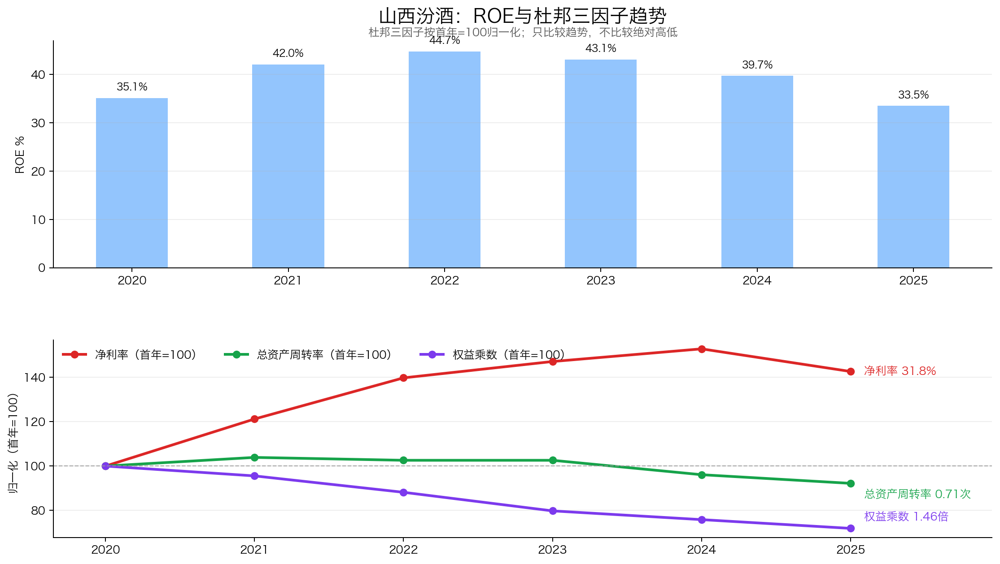
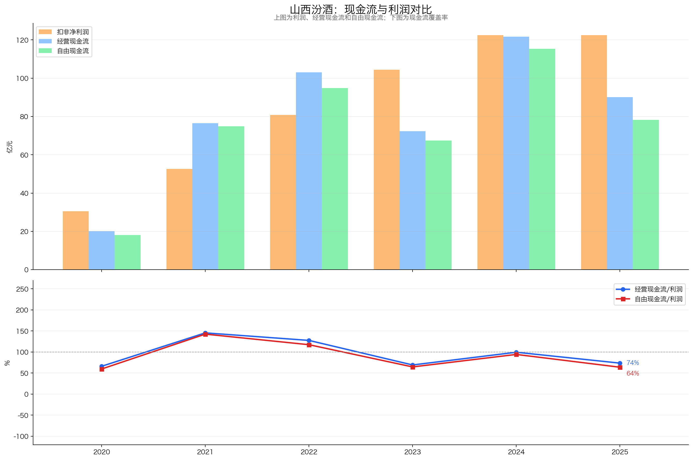
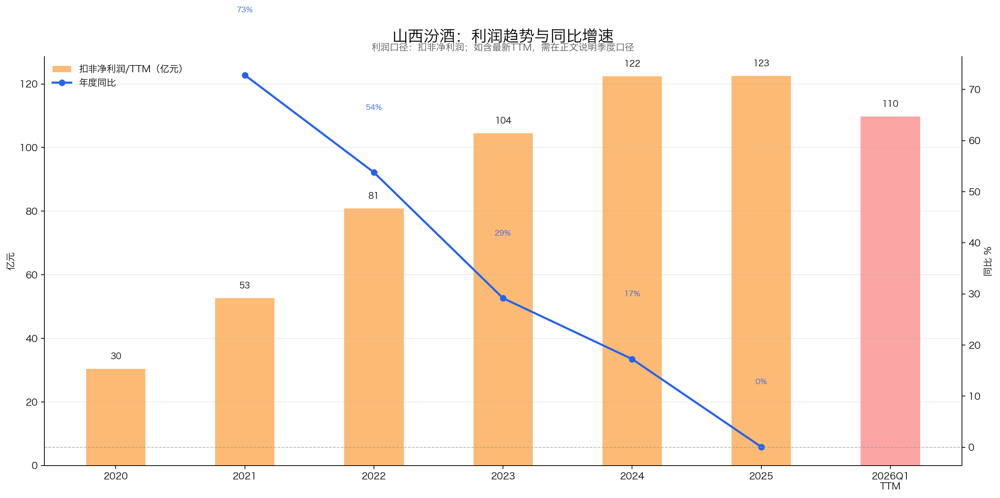

# 山西汾酒（600809）3R投资分析简报

> 数据截止：行情截至2026-06-05；财务截至2026Q1；年度数据截至2025年报。  
> 3R总分：**76.5/100**  
> 当前评级：**关注；低估值下等待行业与利润企稳**  
> 一句话结论：**山西汾酒是品牌、清香品类、全国化、轻资本和现金头寸兼备的好生意，报告基准日估值与股息有吸引力；最大风险是销量增长快于收入、2026Q1利润明显下降，短期定价权和渠道质量尚未见底。**

## 一、公司概况：这家公司靠什么赚钱？

| 项目 | 内容 |
|---|---|
| 主营业务 | 汾酒、竹叶青酒、杏花村酒的生产和销售 |
| 核心产品 | 青花汾酒、老白汾、玻汾等，覆盖次高端至大众价格带 |
| 赚钱方式 | 依靠品牌与清香品类心智、先款后货渠道、产品结构和全国化销售获取高毛利 |
| 客户与场景 | 经销商、电商及宴席、礼赠、商务与家庭消费 |
| 行业位置 | 清香型白酒龙头，2025年省外收入占主营收入65.30% |
| 控股股东 | 汾酒集团，山西省国资体系绝对控股 |
| 重要股东 | 华创鑫睿（香港）为华润系投资平台，持股约10.5%，保留1名董事，不参与日常经营 |
| 报告基准日价格 | 122.04元，总市值约1,488.84亿元 |

汾酒的商业模式是用长期品牌和香型心智形成溢价，通过经销网络先收款后发货，再把基酒储备和产品结构转化为毛利与现金流。全国化是过去增长的主线；当前研究重点已经从“能否高速扩张”切换为“行业去库存中能否守住批价、渠道利润和品牌价值”。

## 二、3R决策摘要

| 维度 | 得分 | 核心判断 |
|---|---:|---|
| Right Business | 46.0/60 | 轻资本、高回报和品牌壁垒突出，最新增长和定价权转弱 |
| Right People | 15.0/20 | 全国化执行已验证，国资治理、扩产与渠道纪律需跟踪 |
| Right Price | 15.5/20 | PE极低、现金与股息安全垫厚，利润下修仍可能吞噬低估 |
| **总分** | **76.5/100** | **关注；分批验证，不宜无视基本面重仓** |

- **当前最大矛盾**：约13.6倍PE、扣现金后约10.2倍和5.4%股息率很有吸引力，但2025年利润停滞、2026Q1扣非利润下降19.18%。
- **关键验证条件**：批价与渠道库存企稳，扣非TTM止跌，合同负债和省外收入恢复健康增长。
- **门槛判断**：3R均超过最低门槛；总分属于“关注”，但行动必须服从利润验证而非只看低估值。

## 三、Right Business：好生意仍成立，已从高增长切换到渠道和利润验证期

### 3.1 评分概览

| 维度 | 得分 | 满分 | 核心判断 |
|---|---:|---:|---|
| 业务简单可持续、不易被替代 | 11.5 | 14 | 商业模式清晰、品类心智强，长期需求稳定但行业总量承压 |
| 竞争格局清晰、护城河深厚、有定价权 | 14.5 | 18 | 清香龙头壁垒深，长期品牌定价权仍在，短期量价承压 |
| 轻资本投入、高资产回报率、自由现金流好 | 12.5 | 14 | ROE和现金头寸优秀，2025现金转化下降 |
| 盈利成长真实、稳定、可持续 | 3.5 | 8 | 历史增长强，2025停滞、2026Q1明显下滑 |
| 有长期增长空间 | 4.0 | 6 | 全国化与清香份额有空间，行业总量和扩产回报需验证 |
| **Right Business** | **46.0** | **60** | **高质量白酒生意，短期经营趋势明显降档** |

### 3.2 业务持续性：品牌消费长期存在，白酒总量与场景承压

白酒商业模式容易理解，社交、宴席、礼赠和家庭消费长期存在，清香型和汾酒品牌不会轻易被普通酒替代。但白酒不是刚需，年轻人饮酒习惯、健康意识、商务宴请和人口结构可能压低行业总量；渠道库存还会放大短期周期。

| 具体指标 | 判断依据 | 得分 |
|---|---|---:|
| 商业模式是否简单、容易理解 | 品牌、渠道、产品结构和先款后货逻辑清晰 | 5.0/5 |
| 需求是否长期存在 | 社交、宴席、礼赠和家庭消费长期存在，但总量增长下降 | 4.0/5 |
| 周期性是否可控 | 消费和渠道去库存周期正在放大波动 | 1.0/2 |
| 产品或品类替代风险 | 名优白酒文化和品类心智降低替代风险，长期饮酒习惯变化仍需观察 | 1.5/2 |
| **小计** |  | **11.5/14** |

### 3.3 护城河与定价权：品牌和香型壁垒深，短期价格权承压

白酒龙头分层清晰，汾酒是清香型代表。品牌历史、香型心智、基酒与工艺、产品矩阵和全国渠道构成护城河；2025年省外收入252.02亿元、占主营收入65.30%，说明全国网络已经形成。

定价权必须看量价而非高毛利标签。2025年酒类销量增长21.99%，收入只增长7.52%，毛利率下降1.35个百分点，利润基本停滞，表明产品结构、渠道价格或费用阶段性承压。长期品牌定价权仍在，短期不能给满分。

| 具体指标 | 判断依据 | 得分 |
|---|---|---:|
| 行业竞争格局 | 名优白酒分层清晰，存量竞争加剧 | 3.5/4 |
| 公司行业位置和份额 | 清香型龙头，省外全国化已成规模 | 2.5/3 |
| 护城河深度与持续性 | 品牌、香型、工艺、基酒和渠道壁垒深 | 5.5/6 |
| 定价权和成本传导 | 长期品牌和产品结构具备定价权，但2025年销量快于收入、毛利率与批价承压 | 3.0/5 |
| **小计** |  | **14.5/18** |

### 3.4 资本回报与现金流：轻资本与现金头寸优秀，现金转化存在年度波动

2020—2025年加权ROE始终高于33%，2025年为33.48%。ROE主要由高净利率和周转驱动，权益乘数由2.03降至1.46；2025年净利率降至31.76%、周转率降至0.71，说明经营效率已从高位回落。

2020—2025年自由现金流持续为正，但2025年CFO/净利润降至73.6%，FCF/净利润降至63.8%。2025年报确认其他流动资产中有194亿元短期定期存款及利息，年末现金头寸289.70亿元；2026Q1按未披露明细的其他流动资产估算现金头寸371.36亿元，必须保留“估算”标签。

| 具体指标 | 判断依据 | 得分 |
|---|---|---:|
| 资本投入强度与产能利用率 | 白酒主业资本强度低，技改扩产回报需观察 | 4.0/4 |
| ROE/ROIC水平及历史趋势 | ROE仍超33%，但净利率与周转率同步回落 | 3.5/4 |
| 杠杆依赖与杜邦质量 | 权益乘数持续下降，不靠杠杆维持高ROE | 2.0/2 |
| 经营现金流和自由现金流 | 长期FCF为正，2025现金转化率明显下降 | 3.0/4 |
| **小计** |  | **12.5/14** |

### 3.5 盈利成长：历史兑现很强，最新利润趋势已经反转

2020—2025年扣非利润5年CAGR为32.12%，但包含低基数与高速全国化阶段；2022—2025年3年CAGR为14.85%，更接近成熟阶段。2025年扣非利润仅增0.06%，2026Q1下降19.18%，扣非TTM降至109.76亿元，不能再外推过去高增速。

| 具体指标 | 判断依据 | 得分 |
|---|---|---:|
| 3年、5年利润增长 | 3年CAGR 14.85%，5年CAGR受高增阶段影响 | 1.5/2 |
| 增长稳定性 | 2025停滞、2026Q1明显下降 | 0.5/1 |
| 增长来源质量 | 省外与销量增长真实，但量快于价、结构承压 | 1.0/2 |
| 最新利润趋势 | 2026Q1扣非利润下降19.18% | 0.0/2 |
| 利润与现金流匹配 | 2026Q1现金流强，2025全年转化率偏低 | 0.5/1 |
| **小计** |  | **3.5/8** |

### 3.6 长期空间：全国化仍有跑道，但未来靠份额而非行业总量

2025年省外收入增长12.64%，省内下降0.81%，全国化仍是主要增量。青花、玻汾等覆盖不同价格带，清香型份额也可能提升；但行业已进入存量竞争，增长必须通过批价、产品结构、渠道利润和新增产能回报验证。

| 具体指标 | 判断依据 | 得分 |
|---|---|---:|
| 核心业务和行业空间 | 白酒总量承压，名优酒结构性空间仍在 | 1.5/2 |
| 市场份额提升空间 | 清香品类和全国化仍有提份额机会 | 1.5/2 |
| 地域扩张与第二曲线 | 省外已占65.30%，继续下沉但边际放缓 | 0.5/1 |
| 再投资回报及增长质量 | 扩产消化、产品结构和渠道回报待验证 | 0.5/1 |
| **小计** |  | **4.0/6** |

## 四、Right People：全国化能力已验证，治理与渠道纪律需要持续观察

| 维度 | 判断 | 决定性证据 | 得分 |
|---|---|---|---:|
| 诚信与治理 | 基本符合 | 国资绝对控股、未见重大红线；华润系财务投资不参与日常经营 | 4.5/6 |
| 专注与经营能力 | 较强 | 长期聚焦白酒，全国化和产品升级执行已验证 | 5.5/7 |
| 资本配置与股东利益 | 基本符合 | 高分红、现金管理稳健；扩产与行业调整期发货纪律需观察 | 5.0/7 |
| **Right People** |  |  | **15.0/20** |

汾酒集团绝对控股，华创鑫睿（香港）是华润系投资平台而非华润集团直接持股，约10.5%持股并不意味着参与日常经营；目前仅保留1名董事。管理层过去的全国化执行较强，当前更重要的能力是克制发货、维护渠道利润和批价，并使扩产节奏匹配真实需求。

## 五、Right Price：价格有吸引力，利润未见底是唯一核心约束

| 维度 | 判断 | 决定性证据 | 得分 |
|---|---|---|---:|
| 利润位置与股价利润匹配度 | 基本符合 | 股价已长期压缩估值，近期开始反映利润下修 | 3.5/5 |
| 当前估值与历史位置 | 有吸引力 | PE约13.56倍、近十年极低分位、扣Q1估算现金后约10.18倍 | 5.5/6 |
| 股息及持有回报 | 较好 | 每股拟派6.56元，税前股息率约5.37%，FCF基本覆盖 | 3.0/3 |
| 保守/中性情景与赔率 | 一般偏好 | 中性上行37%，保守下行26%，现金与股息缓冲回撤 | 3.5/6 |
| **Right Price** |  |  | **15.5/20** |

| 估值指标 | 报告基准日 |
|---|---:|
| 收盘价 / 市值 | 122.04元 / 1,488.84亿元 |
| 扣非利润TTM | 109.76亿元 |
| PE-TTM | 13.56倍 |
| 近十年PE分位 | 约0%（原报告估算口径） |
| 扣Q1估算现金后PE | 10.18倍 |
| 静态税前股息率 | 5.37% |

| 独立情景（3年） | 假设 | 期末市值 | 价格回报 / 含静态股息累计回报 |
|---|---|---:|---:|
| 保守 | 扣非利润年降8%、期末11倍PE | 约940亿元 | -36.9% / 约-20.7% |
| 中性 | 扣非利润年增3%、期末15倍PE | 约1,799亿元 | +20.8% / 约+36.9% |

低估值、现金头寸和高股息共同提高赔率，但Q1现金头寸来自其他流动资产整体估算，严谨判断应优先采用年报已确认的289.70亿元。更重要的是，如果利润继续降至90亿—100亿元，13倍PE并非绝对便宜。

## 六、最终行动

### 现在怎么办？
- 纳入重点关注池，适合分批验证，不宜只因低PE和高股息一次性重仓。

### 什么情况下提高关注？
- 扣非TTM止跌，青花与玻汾批价、渠道库存和动销企稳；
- 合同负债恢复，省外收入增长不依赖压货和降价；
- 估值维持低位，同时自由现金流继续覆盖分红。

### 什么情况下说明判断错了？
- 2026全年收入和扣非利润继续双位数下滑，2027仍不修复；
- 核心产品批价持续下降、渠道利润长期为负；
- 合同负债连续下降，票据上升，扩产无法转化为收入和利润。

## 七、数据边界

- **引用的完整报告**：`山西汾酒_投资分析报告_2026-06-05.md`；仅复用其中财务、业务、治理、估值数据与图表。
- **行情口径**：沿用原报告2026-06-05行情，故称“报告基准日价格”。
- **本地补充**：治理口径采用后续已核实信息——华创鑫睿（香港）为华润系投资平台、持股约10.5%、仅保留1名董事、不参与日常经营。
- **外部补充**：无；未刷新实时行情、批价或渠道库存。
- **未验证事项**：2026Q1其他流动资产中的定期存款明细、青花/玻汾分产品收入和批价、渠道库存、扩产项目回报。
- **盲评说明**：评分前已屏蔽原报告所有得分、评级、方向性评价、毛估估情景和行动建议；3名隔离上下文评估器逐项评分，初始逐项中位数为75.0分。
- **人工复核调整**：复核发现，长期需求风险在“需求持续性”和“品类替代”中偏重叠加，同时定价权评分对2025年量价压力赋权过高。依据名优白酒长期消费场景、清香品类心智、74.85%毛利率、极低应收及历史产品升级事实，将需求持续性、品类替代和定价权分别上调0.5分，最终为76.5分；仍保留行业总量、渠道周期和短期量价压力扣分。
- **评分差异说明**：与原报告的差异来自3R固定权重、盲评证据充分度及上述重复扣分纠正，不以接近原报告为目标。

---

*本简报仅供学习研究，不构成投资建议。*
