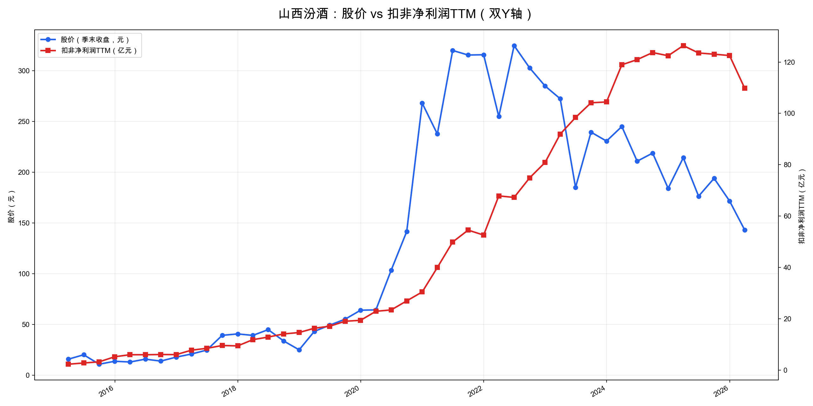
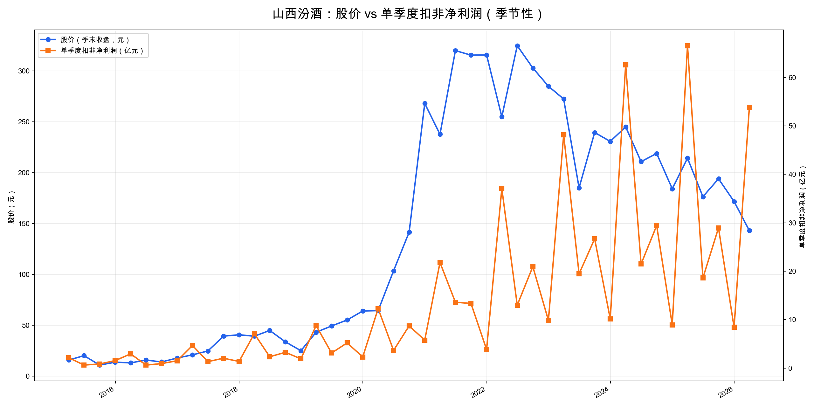

# 山西汾酒（600809）投资分析报告

分析日期：2026-06-05
数据来源：山西汾酒2025年年报、2026年一季报、同花顺导出Excel、Yahoo Finance、东方财富/公开行情数据。
说明：本文为研究分析，不构成投资建议。

---

## 0. 核心结论

山西汾酒是白酒行业里少数同时具备“品牌 + 清香品类心智 + 全国化空间 + 高现金流 + 高分红”的公司。它不是周期股意义上的低估反弹，而更像是“好公司进入行业深度调整期后的估值重定价”。

当前最关键的判断：

| 维度 | 判断 |
|---|---|
| 公司质量 | 仍是高质量白酒公司，毛利率约75%，ROE仍高，现金流和资产负债表很强 |
| 行业状态 | 白酒行业处于深度调整期，需求弱、渠道库存和价格体系是核心风险 |
| 增长状态 | 2025年利润基本停滞，2026Q1收入-9.68%、扣非利润-19.18%，增长明显降速 |
| 估值状态 | 约13.6倍PE，近十年极低分位；扣Q1现金后约10.2倍PE |
| 分红回报 | 2025年拟每10股派65.60元，对122元股价约5.4%税前股息率 |
| 结论 | 高胜率、中高赔率；适合纳入重点观察/分批研究，但不能忽视白酒调整周期中的业绩下修风险 |

一句话：

山西汾酒当前“公司质量还在，估值已经很低”，但“行业景气和短期利润趋势正在变差”。如果相信未来3-5年清香品类和全国化仍能恢复增长，现在是值得重点研究的位置；如果担心白酒需求长期收缩，则应等待批价、动销和利润增速重新企稳。

---

## 1. 先判断能不能研究：公司画像 + 能力圈 + 红线

### 1.1 公司画像

山西汾酒主营汾酒、竹叶青酒、杏花村酒的生产和销售，是清香型白酒代表企业。2025年主营业务中：

| 项目 | 2025年数据 | 判断 |
|---|---:|---|
| 营业收入 | 387.18亿元 | 同比+7.52%，增速明显放缓 |
| 归母净利润 | 122.46亿元 | 同比+0.03%，基本停滞 |
| 扣非净利润 | 122.53亿元 | 同比+0.06%，基本停滞 |
| 毛利率 | 74.85% | 仍是高毛利模式，但同比小幅下降 |
| 加权ROE | 33.48% | 仍高，但从2022-2024高位回落 |
| 经营现金流 | 90.14亿元 | 同比-25.95%，但仍为高现金流生意 |
| 资产负债率 | 28.74% | 资产负债表很稳健 |

能力圈判断：白酒商业模式相对容易理解，关键变量也清晰：品牌心智、产品结构、渠道库存、批价、动销、费用投放、全国化进展。

### 1.2 红线检查

| 红线项 | 结论 |
|---|---|
| 审计/治理 | 未见非标审计、资金占用、违规担保等重大红线 |
| 财务质量 | 利润质量总体较好，应收极低，资产负债表稳健 |
| 行业属性 | 白酒不是强周期商品，但当前处于消费调整和渠道去库存周期 |
| 经营质量 | 2026Q1收入和利润下滑，是必须重点跟踪的降级项 |
| 价值陷阱 | 低PE + 高股息有吸引力，但若未来利润持续下滑，低估值可能变成价值陷阱 |

初筛结论：谨慎通过。

后续重点验证三个问题：
1. 2026Q1下滑是春节节奏/渠道节奏造成的短期波动，还是需求和价格体系变弱的开始；
2. 省外全国化是否还能继续贡献增量；
3. 高股息和低PE是否足以覆盖未来2-3年利润下修风险。

---

## 2. 好行业：白酒是不是好生意？

### 2.1 需求质量 / 非周期性

白酒长期需求仍然存在，具备社交、宴席、礼赠和商务属性，且高端/次高端白酒天然具备品牌溢价。但行业已经从“总量扩张”进入“结构分化 + 存量竞争”阶段。

2025年年报披露，全国规模以上白酒企业累计白酒产量354.9万千升。山西汾酒自身2025年酒类销量26.91万千升，同比+21.99%，说明公司销量端仍有增长，但收入只增长7.52%，隐含吨价/结构承压。

判断：长期仍是好生意，但短中期行业景气明显下降。

### 2.2 竞争格局

白酒行业格局清晰：茅台最强，五粮液、泸州老窖、汾酒、洋河、古井等分层竞争。汾酒在清香型白酒里具备强心智，是“清香品类龙头”。

主要白酒公司最新市值/PE对比（Yahoo Finance，2026-06-05附近）：

| 公司 | 股价 | 市值约 | PE(TTM) | 股息率口径 |
|---|---:|---:|---:|---:|
| 贵州茅台 | 1274.05元 | 15927亿元 | 19.3倍 | 约4.1% |
| 五粮液 | 81.52元 | 3164亿元 | 25.2倍 | 约7.1% |
| 山西汾酒 | 122.04元 | 1489亿元 | 13.6倍 | 约5.0% |
| 泸州老窖 | 87.11元 | 1282亿元 | 12.9倍 | 约6.9% |
| 洋河股份 | 43.58元 | 657亿元 | 64.1倍 | 约10.8% |
| 古井贡酒 | 89.18元 | 471亿元 | 16.7倍 | 约6.8% |
| 今世缘 | 26.24元 | 327亿元 | 14.0倍 | 约4.5% |

汾酒估值已进入白酒龙头中较低区间，市值仍居行业前列。竞争格局不是问题，问题是行业整体估值中枢下移。

### 2.3 进入壁垒

白酒壁垒主要来自品牌历史、香型心智、渠道网络、产能/基酒储备、消费者认知。汾酒具备：

- 清香型白酒代表；
- “汾”“竹叶青”“杏花村”品牌矩阵；
- 原粮基地、酿造工艺、质量检测体系；
- 经销商网络和全国化渠道。

新进入者很难复制。

### 2.4 上下游议价权

公司对消费者和渠道有一定议价权，报表体现为高毛利、极低应收、先款后货模式。2025年应收账款仅9.68万元，几乎可以忽略。

但原料/包装成本上升、渠道利润压缩、费用投放增加会影响利润率。2025年毛利率下降1.35个百分点，说明议价权并非完全无风险。

### 2.5 替代品威胁

白酒短期替代风险不高，但长期要面对年轻人饮酒习惯变化、商务宴请减少、健康意识提升等压力。清香型相对口味更轻，可能受益于低度化/年轻化趋势，但这需要继续验证。

好行业评分：17/20

| 子项 | 得分 |
|---|---:|
| 需求质量/非周期性 | 4.5/6 |
| 竞争格局 | 3.5/4 |
| 进入壁垒 | 4/4 |
| 上下游议价权 | 2.5/3 |
| 替代品威胁 | 2.5/3 |
| 小计 | 17/20 |

---

## 3. 好公司·定性：有没有长期复利能力？

### 3.1 护城河

汾酒护城河来自三层：

1. 品牌护城河：清香型白酒代表，历史文化心智强；
2. 品类护城河：清香香型与浓香、酱香形成差异化；
3. 渠道护城河：全国化网络已经形成，2025年省外收入252.02亿元，占主营收入65.30%。

省外收入同比+12.64%，强于省内的-0.81%，说明全国化仍在推进。

### 3.2 复购/粘性/低替代性

白酒具备复购属性，但次高端白酒的消费场景受宏观和商务活动影响更明显。汾酒的产品矩阵覆盖青花汾酒、老白汾、玻汾等，有高端与大众价格带，但不同价格带受行业调整影响不同。

### 3.3 定价权

长期看，名优白酒具备提价权。汾酒过去几年依靠产品结构升级和全国化扩张实现高增长。但2025年销量+21.99%、收入+7.52%、利润基本不增，说明当前提价/结构升级能力阶段性变弱，或者渠道/产品结构承压。

这一点是本轮分析的核心降权项。

### 3.4 管理层

实际控制人为山西省国资体系，汾酒集团绝对控股。第二大股东华创鑫睿（香港）有限公司持股约9.17%（2026Q1），为华润系投资平台。公司治理未见重大红线。

国资控股的优点是稳定、资源强；缺点是市场化激励和资本配置效率需要长期观察。

好公司·定性评分：17/20

| 子项 | 得分 |
|---|---:|
| 护城河 | 6.5/7 |
| 复购/粘性/低替代性 | 4/5 |
| 定价权 | 4/5 |
| 管理层 | 2.5/3 |
| 小计 | 17/20 |

---

## 4. 好公司·定量：利润是不是真，增长是否健康？

### 4.1 ROE质量与盈利模式

山西汾酒ROE长期处于高位，但2022年后开始回落。按杜邦拆解看：

| 年份 | 销售净利率 | 总资产周转率 | 权益乘数 | 加权ROE |
|---|---:|---:|---:|---:|
| 2020 | 22.27% | 0.77 | 2.03 | 35.09% |
| 2021 | 26.99% | 0.80 | 1.94 | 42.04% |
| 2022 | 31.12% | 0.79 | 1.79 | 44.74% |
| 2023 | 32.76% | 0.79 | 1.62 | 43.06% |
| 2024 | 34.03% | 0.74 | 1.54 | 39.68% |
| 2025 | 31.76% | 0.71 | 1.46 | 33.48% |

核心判断：

- ROE质量仍高：2020-2025年加权ROE始终高于33%，说明白酒高毛利、轻资产、先款后货的盈利模式仍然优秀。
- ROE主要靠净利率，不靠加杠杆：净利率从2020年的22.27%提升到2024年的34.03%，是ROE上行主因；权益乘数反而从2.03降到1.46，资产负债率同步下降。
- 2025年回落来自两端压力：净利率降至31.76%，总资产周转率降至0.71，说明利润率和资产效率都开始变弱。
- 周转率下降需要结合动销验证：若只是现金和存货增加导致周转变慢，问题不大；若来自渠道动销变弱、库存消化变慢，则会压制后续ROE。

结论：汾酒不是靠杠杆堆出来的高ROE，盈利模式仍优质；但2025年ROE回落已经说明高增长阶段结束，后续要重点看净利率和周转率能否企稳。

### 4.2 利润增长来源与持续性

扣非净利润变化：

| 年份/期间 | 扣非净利润 | 增速 |
|---|---:|---:|
| 2020 | 30.43亿元 | +59.41% |
| 2021 | 52.59亿元 | +72.81% |
| 2022 | 80.87亿元 | +53.77% |
| 2023 | 104.45亿元 | +29.15% |
| 2024 | 122.46亿元 | +17.24% |
| 2025 | 122.53亿元 | +0.06% |
| 2026Q1 | 53.79亿元 | -19.18% |

CAGR：

| 区间 | CAGR |
|---|---:|
| 2020→2025（5年） | 32.12% |
| 2022→2025（3年） | 14.85% |

过去5年增长很强，但2025年已经明显停滞，2026Q1出现负增长。更适合用3年CAGR看当前阶段，不能再用2020低基数后的高CAGR外推。

### 4.3 现金流质量

现金流质量要看多年趋势，不能只看2025单年：

| 年份 | 经营现金流 | 资本开支 | 自由现金流 | 经营现金流/净利润 | 自由现金流/净利润 |
|---|---:|---:|---:|---:|---:|
| 2020 | 20.10亿元 | 1.96亿元 | 18.14亿元 | 65.3% | 58.9% |
| 2021 | 76.45亿元 | 1.56亿元 | 74.89亿元 | 143.9% | 140.9% |
| 2022 | 103.10亿元 | 8.26亿元 | 94.85亿元 | 127.4% | 117.2% |
| 2023 | 72.25亿元 | 4.85亿元 | 67.40亿元 | 69.2% | 64.6% |
| 2024 | 121.72亿元 | 6.38亿元 | 115.35亿元 | 99.4% | 94.2% |
| 2025 | 90.14亿元 | 11.94亿元 | 78.19亿元 | 73.6% | 63.8% |

核心判断：

- 自由现金流长期为正，2020-2025年都能产生自由现金流，说明利润大体能转化为现金。
- 现金流波动明显，2021、2022、2024年经营现金流覆盖净利润很好；2023、2025年降到约70%左右，体现白酒经销商打款节奏和行业调整影响。
- 2025年是需要降权的一年：净利润基本不增，经营现金流同比下降，资本开支上升，自由现金流/净利润降至63.8%。
- 2026Q1经营现金流82.54亿元，同比+17.46%，明显好于利润表现；按2025全年 + 2026Q1 - 2025Q1粗算，TTM经营现金流约102.41亿元，TTM自由现金流约91.33亿元。

结论：现金流底色仍强，所以给6/7；但2025年现金流转弱、资本开支抬升，说明不能只看“白酒现金流好”，还要继续跟踪自由现金流能否稳定覆盖分红。

### 4.4 现金头寸与资产负债表安全性

现金头寸按彼得林奇口径：货币资金 + 定期存款 + 有价证券 - 长期负债。不计入应收款项融资，不扣短期借款。

2025年年报已确认：其他流动资产中“短期定期存款及利息”为194.00亿元，主要系定期存款方式日常资金管理；其中37.30亿元用于应付票据质押。

| 口径 | 金额 |
|---|---:|
| 2025年末货币资金 | 97.67亿元 |
| 2025年末短期定期存款及利息 | 194.00亿元 |
| 减：一年内到期非流动负债+租赁负债 | 1.97亿元 |
| 2025年末确认现金头寸 | 289.70亿元 |
| 2026Q1货币资金 | 125.14亿元 |
| 2026Q1其他流动资产 | 246.46亿元 |
| 2026Q1估算现金头寸 | 371.36亿元 |

按2026Q1估算，每股现金头寸约30.44元。以122.04元股价计算，约25%的市值由现金头寸支撑。

估值调整：

| 项目 | 数值 |
|---|---:|
| 最新市值 | 1488.84亿元 |
| 扣非净利润TTM | 109.76亿元 |
| PE(TTM) | 13.56倍 |
| 扣Q1估算现金后市值 | 1117.49亿元 |
| 扣现金后PE | 10.18倍 |

这张资产负债表非常强，是当前赔率的重要来源。

### 4.5 营运质量：应收/存货/合同负债

| 项目 | 2024年末 | 2025年末 | 2026Q1 | 判断 |
|---|---:|---:|---:|---|
| 应收账款 | 7.53万元 | 9.68万元 | 9.37万元 | 极低，先款后货模式强 |
| 应收款项融资 | 17.62亿元 | 20.60亿元 | 26.52亿元 | 银行承兑汇票，不计入现金头寸 |
| 存货 | 132.70亿元 | 143.92亿元 | 136.50亿元 | 存货高但白酒基酒属性特殊 |
| 合同负债 | 86.72亿元 | 70.07亿元 | 79.04亿元 | 2025年末下降，Q1回升 |

风险点：2025年合同负债下降，收入增速放缓，说明渠道预收款蓄水池弱于过去。2026Q1合同负债回升到79.04亿元，是一个修复信号，但还需要观察后续动销和批价。

### 4.6 产品结构与增长来源

2025年产品与区域结构：

| 维度 | 收入 | 同比 | 毛利率 | 判断 |
|---|---:|---:|---:|---|
| 汾酒 | 374.41亿元 | +7.72% | 75.67% | 绝对核心，占比约97% |
| 其他酒类 | 11.51亿元 | +3.09% | 51.62% | 体量小，利润贡献有限 |
| 省内 | 133.91亿元 | -0.81% | 75.99% | 本土市场承压 |
| 省外 | 252.02亿元 | +12.64% | 74.40% | 全国化仍是主增长来源 |
| 电商 | 24.25亿元 | +15.21% | 未披露 | 增速快，但占比仍有限 |

销量增长明显快于收入增长：2025年酒类销量+21.99%，收入+7.52%。这可能意味着低价格带/渠道出货贡献较多，或价格/产品结构承压。年报披露青花20、玻汾百亿级产品地位进一步夯实，但未给出青花、玻汾、老白汾的细分收入，产品价格带结构仍需后续用渠道数据验证。

好公司·定量评分：32.5/40

| 子项 | 得分 |
|---|---:|
| ROE质量与盈利模式 | 8/9 |
| 利润增长来源与持续性 | 4.5/7 |
| 现金流质量 | 6/7 |
| 现金头寸与资产负债表安全性 | 5.5/6 |
| 营运质量 | 4/5 |
| 产品结构与增长来源 | 4/6 |
| 小计 | 32/40 |

---

## 5. 好时机：现在买贵不贵？

### 5.1 股价 vs 利润线

#### 5.1.1 股价走势和利润走势是否匹配

从双Y轴图看，山西汾酒大致经历了四个阶段：

- 2019Q1-2020Q1：股价温和上涨，扣非TTM稳步增长，股价与利润基本匹配。
- 2020Q2-2022Q2：股价快速冲高，利润也增长但斜率慢于股价；2021Q2是典型透支期，相对2019Q1，股价约7.41倍、扣非TTM约3.06倍，估值扩张明显。
- 2022Q3-2024Q4：股价持续回落，扣非TTM仍从约80.87亿元升至122.46亿元，进入“利润还在上、估值先压缩”的反向背离阶段。
- 2025Q1-2026Q1：股价继续下行，扣非TTM从126.41亿元降至109.76亿元，市场开始从“杀估值”切换到“反映利润下修”。从2019Q1到2026Q1，股价约3.31倍、扣非TTM约6.73倍，长期看价格已不贵，但短期关键是利润线能否企稳。

结论：股价和利润长期趋势已经从“股价透支利润”切换为“估值压缩 + 利润下修担忧”。当前位置的核心不是贵，而是要验证利润线是否企稳。如果2026中报后扣非TTM继续下行，低PE仍可能被利润下修抵消；如果利润线企稳，当前价格具备明显修复弹性。

#### 5.1.2 单季度利润规律

单季度图更适合看季节性和拐点，不适合直接判断估值。山西汾酒季度利润规律很明显：

| 区间 | Q1均值 | Q2均值 | Q3均值 | Q4均值 | 规律 |
|---|---:|---:|---:|---:|---|
| 2015-2025 | 24.92亿元 | 8.90亿元 | 12.76亿元 | 5.06亿元 | Q1最高，Q4最低 |
| 2019-2025 | 36.75亿元 | 13.27亿元 | 19.04亿元 | 7.04亿元 | 季节性更稳定 |
| 2021-2025 | 47.23亿元 | 17.23亿元 | 23.87亿元 | 8.25亿元 | Q1贡献全年大头 |

季度规律可简化为：

- Q1是春节脉冲：通常是全年利润高点，2021-2025年Q1均值47.23亿元，显著高于其他季度。
- Q2回落、Q3修复：春节旺季后利润自然降档，随后中秋/国庆备货带来阶段性修复。
- Q4偏弱：虽然覆盖国庆后消费和年底结算，但利润贡献通常最低，更多体现费用投放、渠道节奏和库存消化压力。
- 因此不能用单季利润直接年化，估值判断应以扣非TTM为主；但2026Q1作为最重要旺季季度，扣非利润同比下降19.18%，已不能简单归因于季节性。

结论：山西汾酒季度利润有强季节性，分析估值应以扣非TTM为主；但2026Q1作为全年最重要季度出现明显下滑，需要重点跟踪2026Q2/Q3能否修复。如果Q2/Q3继续弱，说明利润线下行不是短期节奏问题，而是行业和公司增长中枢下移。

### 5.2 PE及PE百分位

| 项目 | 数值 |
|---|---:|
| 股价 | 122.04元 |
| 市值 | 1488.84亿元 |
| 扣非净利润TTM | 109.76亿元 |
| PE(TTM) | 13.56倍 |
| 近十年PE中位数（估算） | 35.70倍 |
| 近十年PE最高（估算） | 130.56倍 |
| 近十年PE百分位 | 约0% |
| 扣Q1估算现金后PE | 10.18倍 |

估值已经很低，但还不能因为处于极低分位就直接给满分。问题不在“贵不贵”，而在“利润是否会继续下修”；如果TTM利润继续下滑，当前PE未必就是绝对低估。

### 5.3 PEG

按3年扣非净利润CAGR 14.85%、当前PE 13.56倍计算：

PEG ≈ 13.56 / 14.85 = 0.91

PEG看起来合理偏低。但2026Q1已经负增长，历史3年CAGR的参考价值明显下降。若未来2-3年利润只有0-5%增长，PEG会迅速变差，因此这一项只能小幅加分，不能高估。

### 5.4 股息率

2025年拟每10股派65.60元，折合每股6.56元。以122.04元股价计算，税前股息率约5.37%。

分红金额约80.03亿元，占2025年净利润约65.35%，自由现金流78.19亿元，基本可以覆盖分红。现金头寸充足，分红可持续性较强。

### 5.5 市场信号与预期差

市场当前主要在交易：白酒需求走弱、库存压力、批价下行、行业估值中枢下移。潜在预期差在于：

- 市场可能低估汾酒现金头寸和高股息；
- 市场可能把短期行业调整外推为长期衰退；
- 但市场也可能提前反映了未来利润进一步下修。

### 5.6 毛估估

不做乐观档，只做中性和保守档。

| 情景 | 假设 | 对应利润 | 合理PE | 合理市值 | 相对当前市值 |
|---|---|---:|---:|---:|---:|
| 中性档 | 2026-2028利润恢复到年化115-125亿，估值回到16-18倍 | 120亿元 | 17倍 | 2040亿元 | +37% |
| 保守档 | 利润下滑到95-100亿，估值维持11-12倍 | 100亿元 | 11倍 | 1100亿元 | -26% |
| 扣现金保护 | 若按Q1现金头寸371亿元，主业隐含估值约1117亿元 | 109.76亿元TTM | 10.18倍 | - | 提供安全垫 |

赔率判断：上行空间不夸张，但下行有现金和股息缓冲。真正的风险是利润若连续多年下滑，市场会继续压低白酒估值中枢。

好时机评分：17/20

| 子项 | 得分 |
|---|---:|
| 股价vs利润线 | 4/5 |
| PE及PE百分位 | 4/5 |
| PEG | 1/2 |
| 股息率 | 3/3 |
| 市场信号与预期差 | 1.5/2 |
| 毛估估 | 2/3 |
| 小计 | 15.5/20 |

---

## 6. 投资结论：值不值得下注，拿不拿得住？

### 6.1 胜率

胜率偏高，原因：

- 白酒仍是A股最好的商业模式之一；
- 汾酒是清香龙头，品牌和品类壁垒强；
- ROE、毛利率、现金流、资产负债表都很优秀；
- 分红和现金头寸提供安全垫。

但胜率不是无脑高，原因：

- 2025年利润停滞；
- 2026Q1利润下滑接近20%；
- 行业需求、渠道库存、批价仍未确认见底。

### 6.2 赔率

赔率中高：

- 当前约13.6倍PE，近十年极低分位；
- 扣现金后约10.2倍PE；
- 税前股息率约5.4%；
- 若利润企稳，估值修复空间明显。

但赔率不是“巨大便宜”：若利润从109.8亿TTM继续下滑到90-100亿，13倍PE并不一定便宜。

### 6.3 长期持有检查项

| 检查项 | 结论 |
|---|---|
| 10年后需求是否仍在 | 大概率仍在，但总量增长下降 |
| 护城河是否会变强 | 品牌和品类壁垒仍强，全国化仍可能强化 |
| 是否需要持续烧钱 | 不需要，现金流很好 |
| 是否有定价权 | 长期有，短期受行业调整压制 |
| 管理层是否乱扩张 | 未见明显乱扩张，技改扩产需跟踪投产后消化 |
| 即使PE不扩张是否有回报 | 有，主要来自股息+利润恢复增长 |

### 6.4 评级与行动

总分：81/100

评级：强烈关注，但更准确说是“低估值下的重点跟踪标的”，不等于无脑买入。

行动建议：

| 投资者类型 | 建议 |
|---|---|
| 长期价值投资者 | 可进入重点研究池，适合分批跟踪，不宜一次性重仓 |
| 已持有者 | 若仓位合理，不应因短期下跌恐慌；重点观察利润和批价是否继续恶化 |
| 新买入者 | 更适合分批，等待2026中报验证Q1下滑是否延续 |
| 保守投资者 | 等待动销、批价、合同负债和利润增速确认企稳后再行动 |

---

## 7. 投资逻辑与证伪条件

### 7.1 投资逻辑

1. 好生意：白酒高毛利、轻资产、现金流好，汾酒是清香龙头；
2. 好公司：品牌、渠道、全国化、现金头寸和分红能力都强；
3. 好价格：当前PE约13.6倍，近十年极低分位，扣现金后约10.2倍；
4. 安全垫：约371亿元Q1估算现金头寸 + 5%以上税前股息率；
5. 预期差：市场可能把短期行业调整过度外推为长期衰退。

### 7.2 证伪条件

出现以下情况，需要重新判断甚至退出：

1. 2026全年收入和扣非利润继续双位数下滑，且2027仍无恢复迹象；
2. 青花汾、玻汾等核心产品批价持续下行，渠道利润长期为负；
3. 合同负债连续下降，应收/票据上升，说明渠道打款意愿变差；
4. 毛利率跌破70%且无法解释，说明产品结构或价格体系明显恶化；
5. 自由现金流连续两年显著低于净利润，分红开始依赖存量现金；
6. 资本开支大幅增加但无法转化为收入和利润，扩产消化失败；
7. 行业估值中枢永久下移，市场只愿给白酒10倍以内PE。

---

## 8. 维度打分汇总表

| 模块 | 得分 | 权重 |
|---|---:|---:|
| 好行业 | 17 | 20 |
| 好公司·定性 | 17 | 20 |
| 好公司·定量 | 32 | 40 |
| 好时机 | 15.5 | 20 |
| 总分 | 81 | 100 |

结论：强烈关注。

但由于2025利润停滞、2026Q1利润明显下滑，应把“买入逻辑”建立在利润企稳和估值安全边际上，而不是简单外推过去5年高增长。

---

## 9. 数据校验结果

| 校验项 | 结果 |
|---|---|
| 营收/净利润/扣非净利润 | 正确：与2025年报、同花顺Excel一致 |
| 2026Q1收入/利润 | 正确：与2026Q1报告一致 |
| CAGR年数 | 正确：2020→2025为5年，2022→2025为3年 |
| 毛利率/净利率/ROE | 正确：来自同花顺Excel和年报主要指标 |
| 经营现金流 | 正确：2025年90.14亿元，2026Q1 82.54亿元 |
| 自由现金流 | 正确：2025年90.14-11.94=78.19亿元 |
| 现金头寸 | 正确：2025年报附注确认其他流动资产中194.00亿元为短期定期存款及利息；Q1其他流动资产未披露明细，按估算标注 |
| 应收款项融资 | 正确：不计入现金头寸 |
| PE/市值 | 已用2026-06-05附近行情刷新，Yahoo Finance口径 |
| 分红 | 正确：2025年拟每10股派65.60元，约80.03亿元 |
| 产品结构 | 正确：2025年报披露汾酒/其他酒类、省内/省外、渠道数据 |
| 打分加总 | 正确：17 + 17 + 32 + 15.5 = 81 |

---

## 10. 最后总结

山西汾酒当前最像“优质资产被行业周期压到低估值区间”。

买它的理由不是短期业绩好，而是：

- 公司仍是好公司；
- 资产负债表和现金流很强；
- 估值已经很低；
- 分红回报足够高；
- 若行业企稳，估值和利润都有修复空间。

不买或谨慎的理由是：

- 2025年利润已经不增长；
- 2026Q1利润下滑接近20%；
- 白酒行业可能不是短期调整，而是中长期需求中枢下移；
- 低估值只有在利润不继续大幅下滑时才是真安全边际。

更稳妥的跟踪框架：

1. 看2026中报：收入/扣非利润是否继续双位数下滑；
2. 看合同负债：是否维持或回升；
3. 看毛利率：是否继续下滑；
4. 看批价和渠道库存：青花/玻汾价格体系是否稳定；
5. 看分红：现金流是否持续覆盖分红。

如果这些指标企稳，当前价格是很有吸引力的位置；如果继续恶化，13倍PE可能还不是底。
