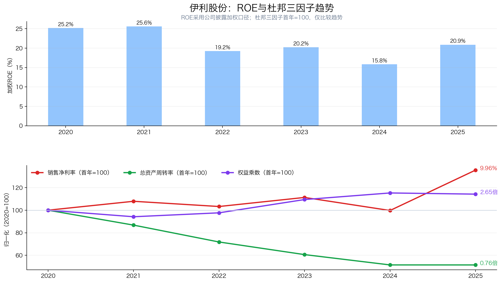
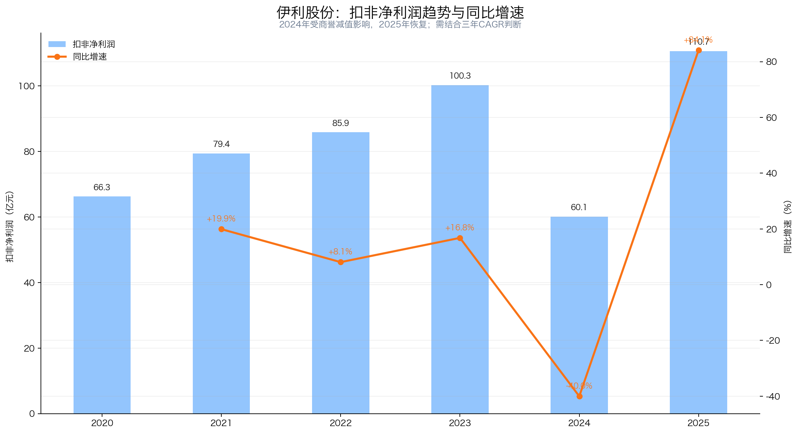
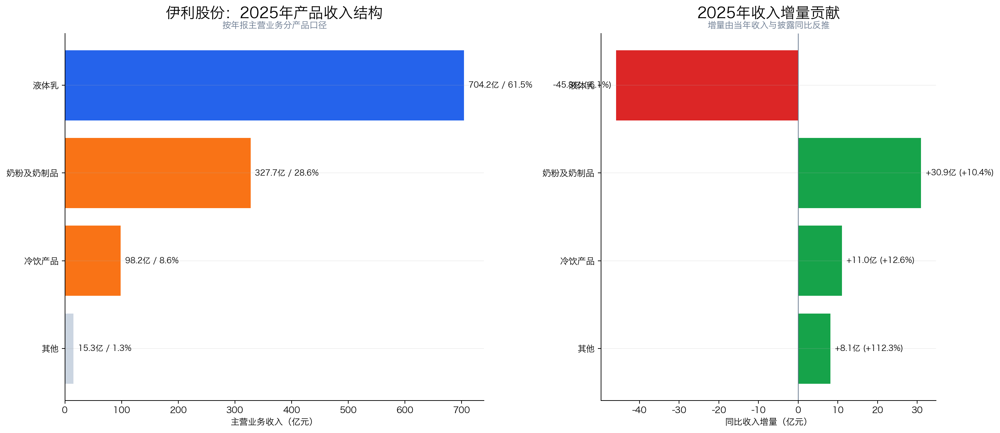
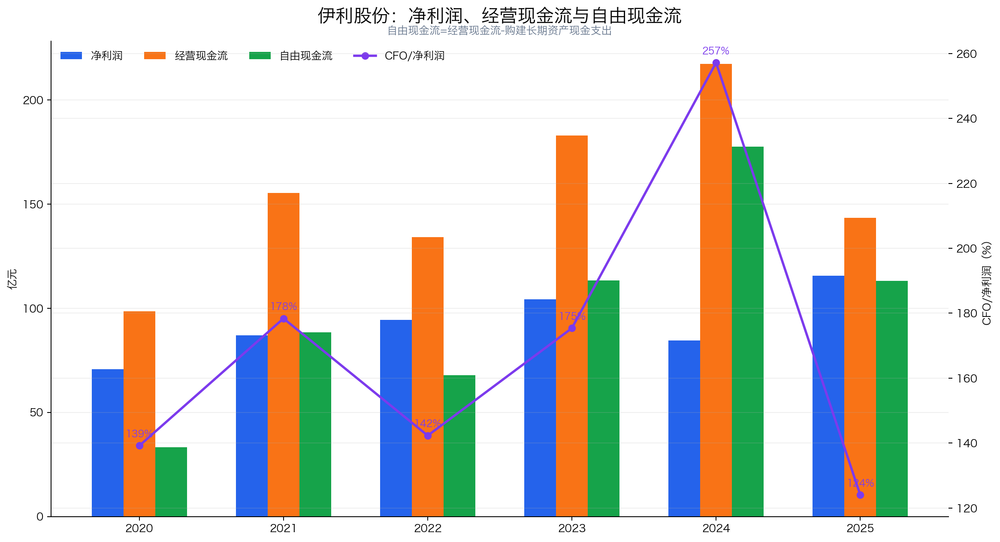
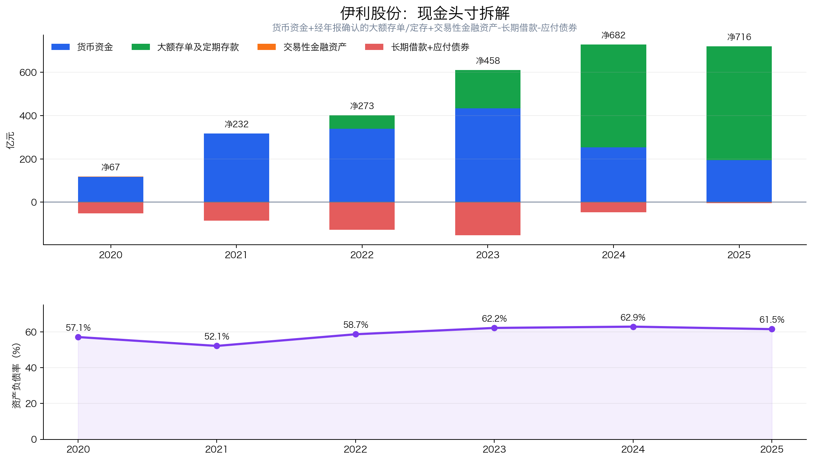
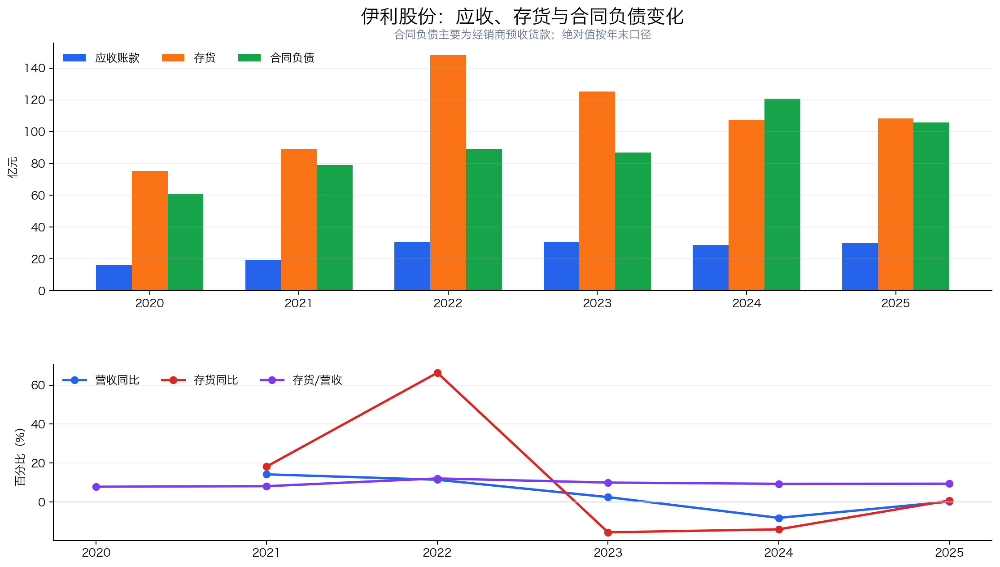
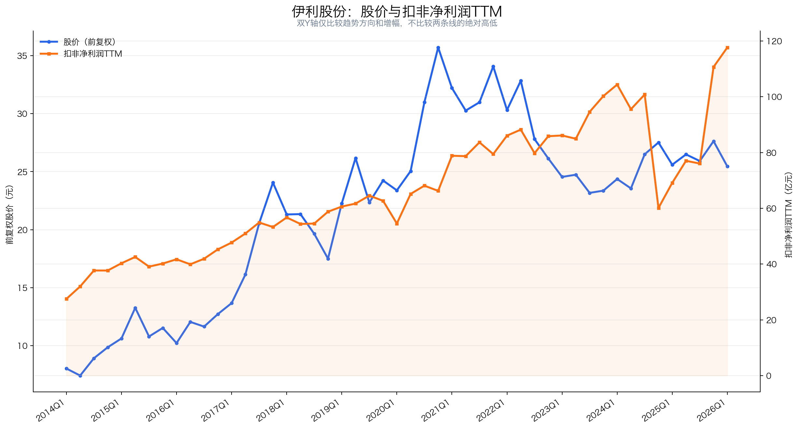
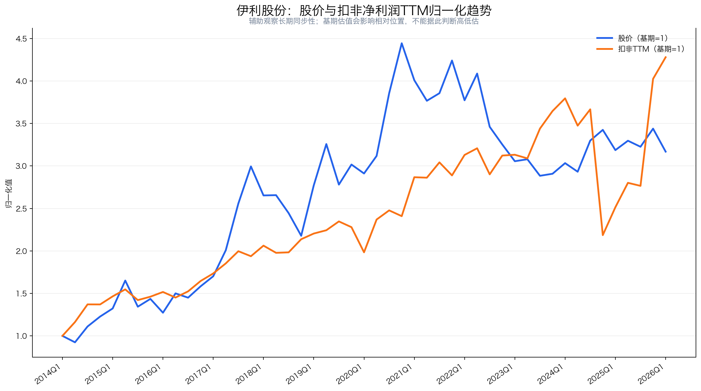
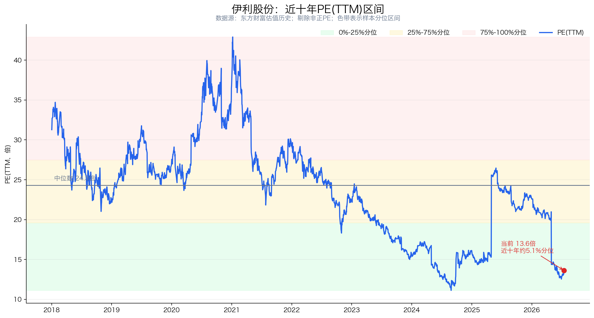

# 伊利股份（600887）投资分析报告

> 数据截止：行情截至 2026-07-16 收盘；财务截至 2026Q1；年度数据截至 2025 年报；重大公告截至 2026-07-15。  
> 结论：**强烈关注（81.5/100）**。伊利是中国乳业综合龙头，品牌、渠道、规模和产品矩阵构成了较宽护城河；当前 PE 处于近十年低位、股息率约 5.3%，现金类资产充足。真正需要担心的不是“会不会突然失去龙头地位”，而是液体乳基本盘能否恢复、奶粉增长能否抵消人口压力、经营现金流能否止跌，以及巨额短期借款背后的资产负债匹配是否长期稳健。

## 先说结论：这是一门什么生意？

伊利的生意可以简单理解为：

1. 用规模化采购、生产和物流，把原奶加工成常温奶、酸奶、奶粉、冷饮、奶酪等产品；
2. 用品牌和渠道把“容易同质化的食品”卖出稳定溢价；
3. 用液体乳基本盘产生现金，再培育奶粉、冷饮、奶酪、专业餐饮和海外业务；
4. 行业低迷时，龙头依靠成本、渠道和资金优势继续抢份额。

它不是高速成长股，更接近“成熟消费龙头 + 结构升级 + 高分红”。当前投资价值主要来自三点：低估值、高股息、利润结构改善；主要风险也有三点：液体乳收入下滑、短债规模较大、2024 年澳优商誉减值说明并购并非没有代价。

| 核心指标 | 当前值 | 怎么理解 |
|---|---:|---|
| 股价 | 26.03 元 | 2026-07-16 收盘 |
| 总市值 | 1,646.49 亿元 | 东方财富总市值口径 |
| PE(TTM) | 13.62 倍 | 按归母净利润TTM |
| 扣非 PE(TTM) | 13.99 倍 | 扣非TTM 117.68亿元 |
| 近十年 PE 分位 | 约 5.1% | 处于历史偏低区间，但低估值对应低增长预期 |
| 2025 财年每股分红 | 1.38 元 | 中期0.48元 + 年度0.90元 |
| 静态股息率 | 约 5.30% | 以26.03元计算 |
| 2025 加权 ROE | 20.87% | 从2024年低点恢复 |
| 2025 林奇现金头寸 | 715.61 亿元 | 含经年报确认的大额存单及定期存款 |

## 一、公司画像、能力圈与红线

**初筛结论：通过，但带着三项观察条件。**

- 公司画像：覆盖液体乳、奶粉及奶制品、冷饮、奶酪、乳脂和水饮等品类的综合乳业龙头。2025 年主营业务中，液体乳仍占约 61.5%，奶粉及奶制品占约 28.6%，冷饮占约 8.6%。
- 能力圈：商业模式容易理解；难点在于原奶周期、经销商库存、促销费用和澳优等并购资产的真实盈利质量。
- 控制与管理：公司无控股股东、无实际控制人；潘刚任董事长兼总裁。截至2026Q1末，呼和浩特投资持股8.51%，潘刚持股3.55%。
- 审计：2025 年报为标准无保留意见，未触发财务审计一票否决红线。
- 治理风险：潘刚于2026年1月29日至3月16日减持6,199.03万股，套现金额16.43亿元，持股比例由4.53%降至3.55%；公告说明资金全部用于偿还认购激励股份及二级市场购股形成的到期股票质押融资。截至2026年7月14日，呼和浩特投资累计质押1.903亿股，占其持股35.33%。公司没有实际控制人，董事长兼总裁权力较集中，需要持续看董事会制衡、管理层持股稳定性、股权质押及接班安排。
- 资产风险：2024年澳优乳业商誉减值对合并报表影响约30.37亿元，说明此前并购预期过高。2025年泰国冷饮子公司新增商誉减值约1.41亿元；2025年末商誉净额降至21.82亿元，约占总资产1.43%，风险已明显收敛但尚未消失。
- 负债风险：2025 年末短期借款 456.31 亿元，2026Q1 升至 590.51 亿元。林奇公式不扣短债，但投资者不能因此忽略流动性与利率风险。

后续必须验证：

1. 液体乳收入能否从 2025 年的 -6.11%恢复，且恢复不是靠低价促销；
2. 奶粉、冷饮、奶酪和专业餐饮能否继续贡献增量；
3. 经营现金流下降和合同负债回落是否只是节奏变化，而不是渠道信心转弱。

## 二、好行业：刚需属性仍在，但总量增长已慢下来

### 2.1 需求质量

乳品是日常消费品，周期性弱于可选消费，但并非完全无周期。居民收入、出生人口、促销强度、原奶价格和渠道库存都会影响短期需求。

2025 年行业呈现“总量偏弱、结构分化”：基础白奶承压，功能奶、低温白奶、婴幼儿和成人营养品、冷饮及餐饮乳制品更有韧性。伊利年报披露，2025 年生鲜乳产量微增、价格同比微跌，供需矛盾有所缓解；这有利于乳企成本，却会继续挤压上游牧场盈利。

长期空间来自中国人均奶类消费仍低于全球和亚洲平均水平，但“低人均消费”不等于需求必然高速增长。人口结构、乳糖不耐、植物蛋白和消费习惯都会限制渗透速度。

### 2.2 竞争格局

伊利和蒙牛构成全国性双龙头，光明更偏区域和低温业务，飞鹤聚焦奶粉，优然处于上游原奶。伊利的优势在于各主要品类布局更完整，2025 年液态类乳品、婴幼儿奶粉、成人奶粉和冷饮均位居行业第一。

| 公司 | 市场 | 2026-07-16 市值 | PE(TTM) | 说明 |
|---|---|---:|---:|---|
| 伊利股份 | A股 | 1,646.49亿元人民币 | 13.62 | 综合乳业龙头 |
| 蒙牛乳业 | 港股 | 695.32亿元港币 | 40.64 | 当前利润偏低使PE偏高 |
| 中国飞鹤 | 港股 | 277.44亿元港币 | 12.92 | 聚焦婴配粉 |
| 光明乳业 | A股 | 94.98亿元人民币 | 亏损 | 低温和区域渠道见长 |
| 优然牧业 | 港股 | 153.60亿元港币 | 亏损 | 上游原奶，周期性更强 |

注：币种不同，市值只用于看规模层级，不直接横向相加；港股数据来自腾讯行情，A股来自东方财富。

### 2.3 壁垒与议价权

伊利的壁垒不是“牛奶配方秘密”，而是系统能力：

- 品牌：金典、安慕希、舒化、金领冠、巧乐兹等覆盖多个价格带和场景；
- 渠道：传统商超、下沉网点、电商、会员店、零食店、即时零售和餐饮客户并行；
- 供应链：全球 77 个生产基地、年综合产能 1,600 余万吨；
- 规模：原料采购、广告投放、物流履约和终端铺货成本可被更大收入摊薄；
- 研发：母乳数据库、益生菌、乳铁蛋白、乳品深加工等技术能支持差异化，但很难形成永久专利垄断。

定价权属于“相对定价权”：品牌和产品结构允许伊利卖得比小品牌贵，但蒙牛、飞鹤和区域乳企仍会通过促销争夺消费者。2025 年液体乳销量下降 1.92%，产品结构和销售价格变动合计减少收入约 41 亿元，说明液体乳并不能无损提价。

### 2.4 替代风险

乳品整体不会被轻易替代，但单个品牌的转换成本并不高。消费者可以在伊利、蒙牛、光明之间切换，也可选择豆奶、燕麦奶、即饮咖啡、功能饮料等。真正低替代的是“营养需求”，不是“伊利这个品牌本身”。

**好行业评分：15.5/20**

| 子项 | 得分 | 满分 |
|---|---:|---:|
| 需求质量/非周期性 | 4.5 | 6 |
| 竞争格局 | 3.5 | 4 |
| 进入壁垒 | 3.5 | 4 |
| 上下游议价权 | 2.0 | 3 |
| 替代品威胁 | 2.0 | 3 |
| 小计 | **15.5** | **20** |

## 三、好公司·定性：护城河宽，但定价权没有想象中强

### 3.1 护城河

伊利的护城河是“品牌 + 渠道 + 奶源 + 供应链 + 多品类”的组合。竞争者可能复制一款牛奶，却很难同时复制全国渠道、冷链网络、经销商关系、广告资源和规模采购能力。

更重要的是，伊利可以在多个品类之间分摊渠道和营销成本。2025 年液体乳下滑，但奶粉及奶制品、冷饮增长，使集团收入仍基本持平。这种组合韧性比单一品类乳企更强。

### 3.2 复购与粘性

牛奶和奶粉具有高复购，但消费者品牌转换成本不高。粘性主要来自品质信任、口味习惯、母婴会员体系和终端可得性，而不是合同锁定。

婴配粉的信任壁垒相对更高。2025 年伊利婴幼儿奶粉零售额份额达到 18.3%，成人奶粉份额 25.0%；一旦进入家庭长期购买清单，复购通常好于普通常温奶。

### 3.3 定价权

2025 年综合毛利率从 33.88%升至 34.58%，销售净利率从 7.33%升至 9.96%，显示原奶成本、产品结构和费用控制共同改善。但液体乳收入下降、销售价格变动拖累收入，说明公司更依赖“结构升级 + 成本下降”，而不是直接全面提价。

### 3.4 管理层与资本配置

优点：

- 管理层长期稳定，潘刚及核心高管持股较多，与股东利益有一定绑定；
- 2025 财年现金分红 87.29 亿元，占归母净利润 75.48%；
- 2024—2025 年回购股份用于注销，是真正减少股本，而非仅用于员工激励；
- 2025 年财务费用为 -6.91 亿元，现金资产形成了明显利息收益。

需要扣分：

- 董事长兼任总裁，且公司无实际控制人，治理对个人稳定性依赖较高；
- 潘刚2026年初一次性减持原持股约21.6%用于偿还质押融资；第一大股东仍有35.33%的持股处于质押状态；
- 澳优并购后的大额商誉减值表明资本配置并非始终高效。

资本配置还要看两项新动作：2025—2027年股东回报规划要求每年现金分红不低于归母净利润75%，且每股分红原则上不低于2024年度的1.22元；与此同时，公司2026年主业及配套项目计划投资64.04亿元。高分红、扩产与短债融资并行，提高了对经营现金流的要求。

2026年6月，伊利通过境外子公司以11.73亿港元认购优然牧业2.9925亿股，交易后合计持股36.07%。这有利于稳定上游奶源和乳品深加工协同，但也增加了上游原奶周期和对外投资回报的不确定性。

**好公司·定性评分：15.5/20**

| 子项 | 得分 | 满分 |
|---|---:|---:|
| 护城河 | 6.0 | 7 |
| 复购/粘性/低替代性 | 4.0 | 5 |
| 定价权 | 3.0 | 5 |
| 管理层 | 2.5 | 3 |
| 小计 | **15.5** | **20** |

## 四、好公司·定量：ROE恢复、现金很多，但增长质量仍需验证

### 4.1 ROE质量与盈利模式



| 年份 | 加权ROE | 销售净利率 | 总资产周转率 | 权益乘数 |
|---:|---:|---:|---:|---:|
| 2020 | 25.18% | 7.35% | 1.47 | 2.32 |
| 2021 | 25.59% | 7.93% | 1.28 | 2.18 |
| 2022 | 19.23% | 7.59% | 1.06 | 2.26 |
| 2023 | 20.20% | 8.18% | 0.89 | 2.54 |
| 2024 | 15.81% | 7.33% | 0.76 | 2.67 |
| 2025 | 20.87% | 9.96% | 0.76 | 2.65 |

注：ROE为同花顺年度表的加权口径；杜邦三因子按平均资产、平均权益和营业总收入近似拆解，主要看趋势。

结论：2025 年 ROE 恢复主要靠净利率上升，而不是进一步加杠杆，这是好信号。但总资产周转率从 2020 年的 1.47 降到约 0.76，说明并购扩表、存单增加和收入停滞使资产使用效率明显下降。未来 ROE 能否维持 20%，取决于利润率改善是否可持续，以及低效率资产能否被更好利用。

### 4.2 利润增长与持续性



| 年份 | 营业总收入（亿元） | 归母净利润（亿元） | 扣非净利润（亿元） | 扣非同比 |
|---:|---:|---:|---:|---:|
| 2020 | 968.86 | 70.78 | 66.25 | 5.69% |
| 2021 | 1,105.95 | 87.05 | 79.44 | 19.90% |
| 2022 | 1,231.71 | 94.31 | 85.86 | 8.08% |
| 2023 | 1,261.79 | 104.29 | 100.26 | 16.78% |
| 2024 | 1,157.80 | 84.53 | 60.11 | -40.04% |
| 2025 | 1,159.31 | 115.65 | 110.68 | 84.13% |
| 2026Q1 | 348.25 | 53.95 | 53.29 | 15.11% |

- 2020→2025 营收 5 年 CAGR 仅 3.65%，说明公司已经从规模扩张转向利润率和结构驱动。
- 2020→2025 扣非利润 5 年 CAGR 为 10.81%；2022→2025 的 3 年 CAGR 为 8.84%。
- 2024 年扣非利润低点主要受澳优商誉减值影响，2025 年 84.13%的同比不能外推为常态增长。
- 2026Q1 扣非利润增长 15.11%，高于收入的 5.47%，利润率继续改善，但一季度通常是利润高峰，不能简单年化。
- 2026Q1经营现金流37.35亿元，同比增长293.92%，较上年同期低基数明显修复；单季改善尚不足以推翻2025全年现金流下降的观察结论。

### 4.3 产品结构与增长来源



| 2025年主营产品 | 收入（亿元） | 主营占比 | 同比 | 毛利率 |
|---|---:|---:|---:|---:|
| 液体乳 | 704.22 | 61.48% | -6.11% | 31.43% |
| 奶粉及奶制品 | 327.69 | 28.61% | 10.42% | 41.58% |
| 冷饮产品 | 98.22 | 8.57% | 12.63% | 37.89% |
| 其他 | 15.32 | 1.34% | 112.26% | 1.78% |

注：占比以年报主营业务分产品合计 1,145.45 亿元为分母，与营业总收入存在其他业务口径差异。

产品结构正在变好，但基本盘仍在承压：

- 液体乳减少约 45.81 亿元，是最大拖累；销量下降、产品结构和价格变化共同影响收入。
- 奶粉及奶制品增加约 30.93 亿元，毛利率 41.58%，是最重要的结构升级来源。
- 冷饮增加约 11.01 亿元，恢复较快且毛利率高于液体乳。
- 婴配粉份额 18.3%、成人奶粉 25.0%、奶酪线下份额 19.1%；专业餐饮奶酪和乳脂业务增长 30%以上，但年报未单独披露收入金额。
- 新品收入占比 16.4%，说明创新不是纯概念，但仍需看新品三年后的留存率和盈利率。

### 4.4 现金流质量



| 年份 | 归母净利润 | 经营现金流 | 资本开支 | 自由现金流 | CFO/净利润 |
|---:|---:|---:|---:|---:|---:|
| 2020 | 70.78 | 98.52 | 65.22 | 33.29 | 1.39 |
| 2021 | 87.05 | 155.28 | 66.83 | 88.45 | 1.78 |
| 2022 | 94.31 | 134.20 | 66.46 | 67.74 | 1.42 |
| 2023 | 104.29 | 182.90 | 69.56 | 113.35 | 1.75 |
| 2024 | 84.53 | 217.40 | 39.78 | 177.61 | 2.57 |
| 2025 | 115.65 | 143.44 | 30.37 | 113.07 | 1.24 |

自由现金流采用“经营现金流 - 购建长期资产现金支出”的简化口径。

2025 年利润现金含量仍好：CFO/归母净利润 1.24，自由现金流/归母净利润约 0.98。但经营现金流同比下降 34.0%，主要因预收经销商货款下降、薪酬和税费等支出增加。高分红可持续的前提不是账面现金多，而是经营现金流不继续显著下滑。

### 4.5 现金头寸与资产负债表安全性



| 年份 | 货币资金 | 已确认大额存单/定存 | 交易性金融资产 | 长期借款+应付债券 | 林奇现金头寸 | 资产负债率 |
|---:|---:|---:|---:|---:|---:|---:|
| 2020 | 116.95 | 0.00 | 1.23 | 51.37 | 66.81 | 57.09% |
| 2021 | 317.42 | 0.00 | 0.37 | 85.68 | 232.12 | 52.15% |
| 2022 | 338.53 | 62.36 | 0.30 | 127.81 | 273.39 | 58.66% |
| 2023 | 433.72 | 176.30 | 0.11 | 152.47 | 457.66 | 62.19% |
| 2024 | 254.04 | 474.50 | 0.06 | 46.87 | 681.74 | 62.91% |
| 2025 | 194.95 | 525.35 | 0.03 | 4.72 | 715.61 | 61.51% |

2025 年现金头寸公式：

```text
货币资金194.95
+ 一年内到期大额存单108.73
+ 其他流动资产中的大额存单及定存135.54
+ 其他非流动资产中的大额存单及定存281.09
+ 交易性金融资产0.03
- 长期借款4.72
- 应付债券0
= 林奇现金头寸715.61亿元
```

每股林奇现金头寸约 11.31 元，扣现金后扣非 PE 约 7.91 倍，表面上很便宜。

其中，存放中央银行法定存款准备金 17.61 亿元、担保保证金 0.40 亿元不能视为可自由支配现金。扣除这 18.01 亿元后，可用现金头寸约 697.60 亿元、每股约 11.03 元。

还必须做第二层压力测试：2025 年末短期借款 456.31 亿元、租赁负债 2.89 亿元。虽然它们不属于彼得林奇简化公式的扣减项，若再从可用现金头寸中扣除，保守净金融现金约 238.41 亿元，扣现金后扣非 PE 约 11.97 倍。2026Q1 短期借款进一步升至 590.51 亿元，说明“715.61亿元现金头寸”不能直接理解为全部可自由分给股东的闲置现金。

### 4.6 营运质量



| 年份 | 应收账款 | 存货 | 合同负债 | 存货/营收 |
|---:|---:|---:|---:|---:|
| 2020 | 16.16 | 75.45 | 60.56 | 7.79% |
| 2021 | 19.59 | 89.17 | 78.91 | 8.06% |
| 2022 | 30.88 | 148.36 | 89.13 | 12.05% |
| 2023 | 30.85 | 125.12 | 86.96 | 9.92% |
| 2024 | 28.78 | 107.45 | 120.73 | 9.28% |
| 2025 | 29.87 | 108.23 | 105.64 | 9.34% |
| 2026Q1 | 35.63 | 103.31 | 53.99 | — |

- 应收账款仅约营收 2.6%，赊销风险整体不高。
- 存货从 2022 年高点持续下降，2025 年基本稳定；液体乳库存量同比下降 25.44%，渠道去库取得进展。
- 2025 年合同负债同比下降 12.50%，2026Q1 又降至 53.99 亿元。季度间有春节和发货节奏影响，但若后续仍显著低于历史同期，可能说明经销商预付款和信心不足。
- 2026Q1 应收账款升至 35.63 亿元，仍不高，但需要与收入增速一起跟踪。

**好公司·定量评分：33/40**

| 子项 | 得分 | 满分 | 核心判断 |
|---|---:|---:|---|
| ROE质量与盈利模式 | 8.0 | 9 | ROE恢复靠净利率，但周转率下降 |
| 利润增长与持续性 | 5.0 | 7 | 真实增长放缓，2025有低基数效应 |
| 现金流质量 | 6.0 | 7 | 现金含量好，2025 CFO显著下降 |
| 现金头寸与资产负债表安全性 | 5.0 | 6 | 存单厚，但短借高、流动比率偏低 |
| 营运质量 | 4.0 | 5 | 库存改善，合同负债回落需观察 |
| 产品结构与增长来源 | 5.0 | 6 | 奶粉冷饮接力，液体乳仍是拖累 |
| 小计 | **33.0** | **40** |  |

## 五、好时机：价格便宜，但不是“无条件低估”

### 5.1 股价与利润线



图中重点看趋势和增幅，不看两条线谁在上、谁在下：

- 2018—2021 年股价上涨明显快于扣非利润，估值扩张贡献很大；
- 2021 年后股价持续回落，而扣非利润长期趋势仍上升，估值泡沫被消化；
- 2024 年扣非利润因商誉减值骤降，2025—2026Q1 已恢复到 117.68 亿元TTM，但股价仍在 26 元附近；
- 当前矛盾不是“利润已经崩掉”，而是市场不相信液体乳和总收入能重新增长。

归一化辅助图：



归一化图只用于观察长期同步性，不能根据两条线的上下位置判断估值。

### 5.2 PE与历史分位



| 指标 | 数值 |
|---|---:|
| 当前PE(TTM) | 13.62倍 |
| 当前扣非PE(TTM) | 13.99倍 |
| 近十年PE中位数 | 24.30倍 |
| 近十年25%分位 | 19.61倍 |
| 近十年10%分位 | 15.01倍 |
| 当前分位 | 约5.1% |

估值确实处于历史偏低区间，但不应机械回到 24 倍历史中位数。过去十年包含消费白马估值扩张期，而今天伊利营收增速明显下降，人口和乳品需求预期也更弱。合理估值中枢应低于过去高增长阶段。

### 5.3 PEG

2022→2025 扣非净利润 3 年 CAGR 为 8.84%，按当前 PE(TTM) 计算，PEG 约 1.54。

这不是极端便宜，但考虑约 5.3%的股息率后，长期总回报仍有吸引力。由于 2024 年商誉减值造成基数异常，PEG只能作为辅助，不应单独决定买入。

### 5.4 股息率与股东回报

2025 财年每股分红 1.38 元，按 26.03 元计算静态股息率约 5.30%，分红率 75.48%。2025 年自由现金流 113.07 亿元，可覆盖 87.29 亿元现金分红约 1.30 倍。

高股息的关键不是今年能否支付，而是未来液体乳利润和经营现金流能否稳定。若公司用新增短债维持分红，股息质量就会下降；目前尚不能这样下结论，但短债和现金流必须联动跟踪。

### 5.5 预期差

可能被低估：

- 市场可能过度线性外推液体乳下滑，而奶粉、冷饮、奶酪和专业餐饮正在改善结构；
- 2024 年商誉减值是非现金项目，2025 年利润恢复后，估值仍接近历史低位；
- 经年报确认的大额存单规模被常规“货币资金”指标低估。

可能被高估：

- 2025 年利润高增含低基数，不能视为新增长周期；
- 原奶成本下降带来的毛利率红利未必永久持续；
- 奶粉增长面对出生人口压力，份额提升需要持续营销投入；
- 现金头寸与巨额短期借款并存，不能把存单全部视为多余现金。

### 5.6 毛估估

以下不是券商预测，而是基于历史盈利和估值的三年情景压力测试，不含期间现金分红：

| 情景 | 三年后归母利润假设 | 估值 | 对应股价 | 相对26.03元 |
|---|---:|---:|---:|---:|
| 保守 | 105亿元 | 12倍 | 19.92元 | -23.5% |
| 中性 | 130亿元 | 15倍 | 30.83元 | +18.4% |
| 乐观 | 150亿元 | 18倍 | 42.69元 | +64.0% |

中性情景本身的价格空间不算惊人，吸引力主要来自约 5%的年度股息；乐观情景需要液体乳企稳、结构升级持续和市场重新提高估值。保守情景提醒我们：便宜不等于没有 20%以上回撤空间。

**好时机评分：17.5/20**

| 子项 | 得分 | 满分 |
|---|---:|---:|
| 股价 vs 利润线 | 4.5 | 5 |
| PE及PE百分位 | 5.0 | 5 |
| PEG | 1.5 | 2 |
| 股息率 | 3.0 | 3 |
| 市场信号与预期差 | 1.5 | 2 |
| 毛估估 | 2.0 | 3 |
| 小计 | **17.5** | **20** |

## 六、投资结论：值不值得下注，拿不拿得住？

### 6.1 商业模式好不好（Right Business）

#### 6.1.1 业务简单可持续、不易被替代

乳制品属于长期刚需，业务简单、复购频繁，品类整体不易被替代；但人口结构、消费疲弱和液体乳基本盘收缩会压低行业增长，不同品牌之间仍可替换。

#### 6.1.2 竞争格局清晰、护城河深厚、有定价权

伊利基本符合。国内乳业双龙头格局稳定，品牌、渠道、奶源、规模和全品类矩阵构成系统性护城河；但促销竞争和渠道压力限制了短期定价权，液体乳收入下降说明龙头地位不能替代需求验证。

#### 6.1.3 轻资本投入、高资产回报率、自由现金流好

伊利并非纯轻资产公司，但规模效率、ROE和现金创造能力较强。2025年简化自由现金流约113亿元，能覆盖大部分股东回报；需要警惕的是经营现金流、合同负债走弱以及短期借款上升，林奇现金头寸不能替代短债匹配分析。

#### 6.1.4 有长期增长空间

液体乳已进入成熟期，增长主要依靠奶粉、冷饮、产品升级和国际业务，而不是行业总量高速扩张。长期仍有结构性空间，但更接近稳增长和高股东回报逻辑，不宜沿用高成长估值。

### 6.2 管理层怎么样（Right People）：长期执行能力强，治理与资本配置仍需跟踪

管理层在渠道、产品矩阵和规模经营上能力较强，也维持较高分红；但管理层减持、优然牧业投资、股东质押和短债增加要求投资者继续检查资本配置是否真正提高长期每股价值。

### 6.3 是不是好价格（Right Price）：低估值和高股息有吸引力，仍需经营企稳

当前约13.6倍PE、近十年约5.1%分位，静态股息率约5.3%，价格具备吸引力。问题是低价能否充分补偿液体乳收缩、渠道压力和资产负债匹配风险；适合分批验证，不宜忽略经营信号一次性重仓。

### 6.4 胜率与赔率

伊利的胜率中高，品牌、渠道、规模和产品矩阵提供经营下限；低估值和约5.3%股息率提供回报基础，但资本利得仍取决于液体乳企稳、第二曲线增长和经营现金流改善。综合得分81.5分，评级为“强烈关注”。

### 6.5 长期持有检查项

长期持有需要重点验证：

- 液体乳降幅收窄、合同负债和经营现金流企稳，且PE仍在12—15倍时，可提高仓位；
- 基本盘继续收缩、短债上升且现金流恶化时，即使估值更低也不机械补仓。

### 6.6 评级与行动

**最终判断：伊利是需求长期、格局清晰、现金流较好的成熟乳业龙头，增长速度已经下降；当前属于好公司偏低价格，值得强烈关注，但买入逻辑应建立在基本盘和现金流企稳之上。**

当前行动：

- 作为成熟消费和高股息候选分批布局，不因“PE低、股息高”一次性重仓；

## 七、投资逻辑与证伪条件

### 7.1 投资逻辑

1. **龙头能力稳定基本盘**：品牌、渠道、奶源和规模优势支撑份额、利润及现金流。
2. **产品结构提供增长弹性**：奶粉、冷饮、奶酪和专业餐饮有望逐步对冲液体乳承压。
3. **估值与股东回报提供安全边际**：低PE、高股息和大额现金类资产改善下行保护，但短债限制了现金价值。

### 7.2 证伪条件

以下任一情况持续两个报告期，应重新评估：

1. **基本盘与结构升级同时失速**：液体乳持续下滑，奶粉、冷饮等增量无法对冲，且市场份额走弱。
2. **盈利与渠道质量恶化**：利润率和自由现金流持续下降，合同负债走弱，应收或存货明显快于收入增长。
3. **资产负债表或资本配置恶化**：短债继续上升而现金类资产下降，或并购、优然投资未产生协同并再次出现重大减值；管理层减持、质押引发治理风险。
4. **股东回报失去安全边际**：自由现金流无法覆盖分红，或低增长阶段PE重新升至20倍以上。

---

## 八、维度打分汇总

| 模块 | 得分 | 权重 | 核心判断 |
|---|---:|---:|---|
| 好行业 | 15.5 | 20 | 刚需但低增长，双龙头格局稳定 |
| 好公司·定性 | 15.5 | 20 | 系统性护城河强，治理和并购需扣分 |
| 好公司·定量 | 33.0 | 40 | ROE和现金流好，周转率、短债与基本盘承压 |
| 好时机 | 17.5 | 20 | 历史低估值和高股息，赔率仍依赖经营企稳 |
| **总分** | **81.5** | **100** | **强烈关注** |

评分加总校验：15.5 + 15.5 + 33.0 + 17.5 = 81.5。

---

## 九、数据校验结果

### 正确

1. 2020—2025 年营收、归母净利润、扣非净利润：同花顺年度表与年报主要财务数据交叉验证，趋势和年度值一致。
2. 2026Q1 营业收入 348.25 亿元、归母净利润 53.95 亿元、扣非净利润 53.29 亿元：与公司一季报一致。
3. 2022→2025 扣非净利润 CAGR：跨度为3年，计算值 8.84%；2020→2025 为5年，计算值 10.81%。
4. 2025 经营现金流 143.44 亿元、资本开支 30.37 亿元、简化自由现金流 113.07 亿元：与现金流量表一致。
5. 2025 产品结构：液体乳 704.22 亿元、奶粉及奶制品 327.69 亿元、冷饮 98.22 亿元，均与年报主营业务分产品表一致。
6. 2025 现金头寸：大额存单及定期存款逐项来自年报“一年内到期的非流动资产、其他流动资产、其他非流动资产”附注；未把其他流动资产整体计入；另行扣除了法定存款准备金和担保保证金，给出可用口径。
7. 分红：2025 财年中期与年度合计每股 1.38 元、总额 87.29 亿元、分红率 75.48%，与年报利润分配说明一致。
8. 最新行情：2026-07-16 收盘价 26.03 元、总市值 1,646.49 亿元、PE(TTM) 13.62 倍，来自东方财富估值历史。
9. PE分位：使用近十年正PE日频样本计算，当前约5.1%分位。
10. 评分：四模块小计与总分加总一致；评级符合大于80分的“强烈关注”规则。
11. 图表：第四章6张图、股价与扣非TTM主图、归一化辅助图和近十年PE图均已生成，链接已核对。

### 需要特别说明

1. 林奇现金头寸主口径不扣短期借款；报告已额外给出扣除短借和租赁负债的保守敏感性口径，避免高估可分配现金。
2. ROE采用公司披露加权口径，杜邦三因子为平均资产/平均权益近似拆解，两者绝对值不强行相乘校准，仅看趋势。
3. 港股同行市值单位为港币，A股为人民币，不直接进行绝对规模相加。
4. 2025年扣非利润高增受2024年商誉减值低基数影响；估值判断使用三年CAGR和情景分析，没有外推单年84%增速。

### 不可完全验证

1. 尼尔森(全球消费品零售监测与市场研究公司)、星图(国内电商市场数据服务商)的完整市场份额原始数据库未公开，本报告引用伊利2025年报披露的第三方零研结果。
2. 2026Q1未披露大额存单及定期存款的完整附注明细，因此最新完整现金头寸仍采用2025年末经审计口径，Q1只用于观察货币资金、短债和营运项目变化。
3. 毛估估是历史数据基础上的情景假设，不是对未来股价和利润的承诺。

---

## 主要资料

- [伊利股份2025年年度报告（巨潮资讯）](https://static.cninfo.com.cn/finalpage/2026-04-30/1225259562.PDF)
- [伊利股份2026年第一季度报告（巨潮资讯）](https://static.cninfo.com.cn/finalpage/2026-04-30/1225259609.PDF)
- [潘刚减持股份实施结果公告（巨潮资讯）](https://static.cninfo.com.cn/finalpage/2026-03-18/1225013713.PDF)
- [认购优然牧业新股完成公告（巨潮资讯）](https://static.cninfo.com.cn/finalpage/2026-06-30/1225397626.PDF)
- [呼和浩特投资股份质押公告（巨潮资讯）](https://static.cninfo.com.cn/finalpage/2026-07-15/1225422777.PDF)
- 本地数据台账：`../data/sources.csv`
- 本地年报清单：`../年报/manifest.json`

---

*本报告仅供学习研究，不构成投资建议。*
