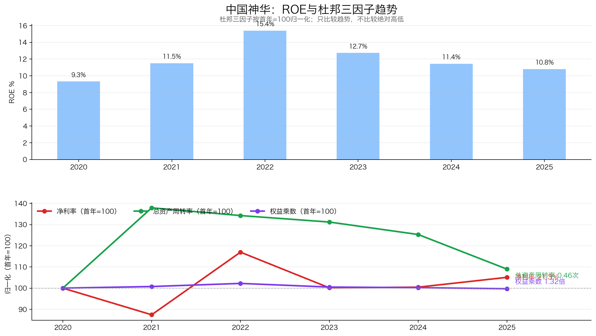
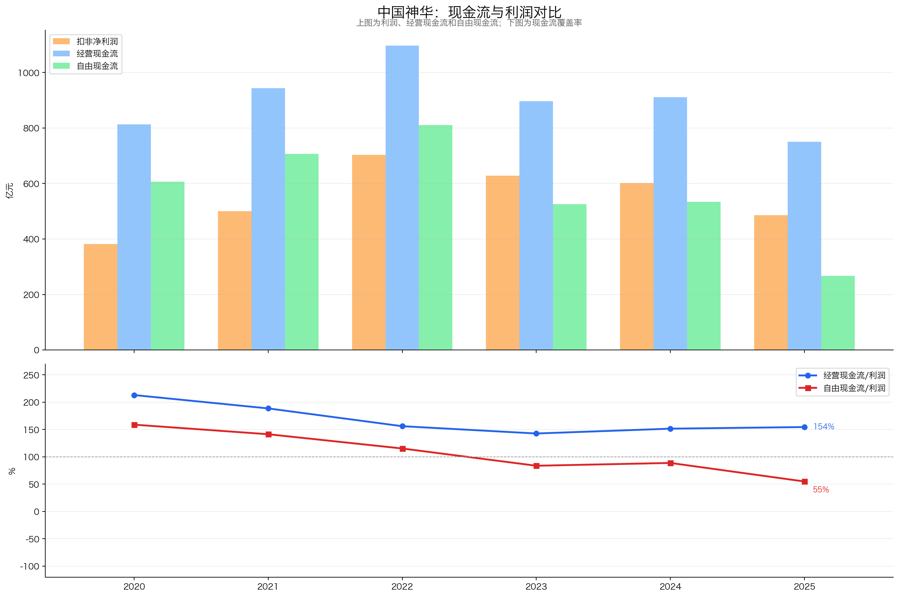
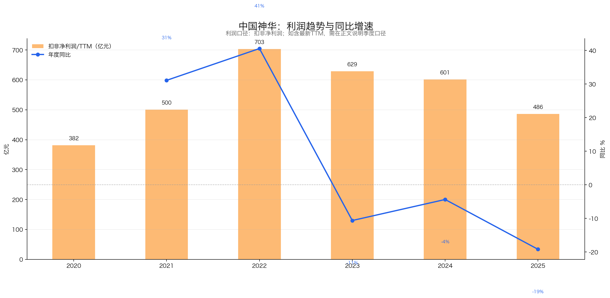
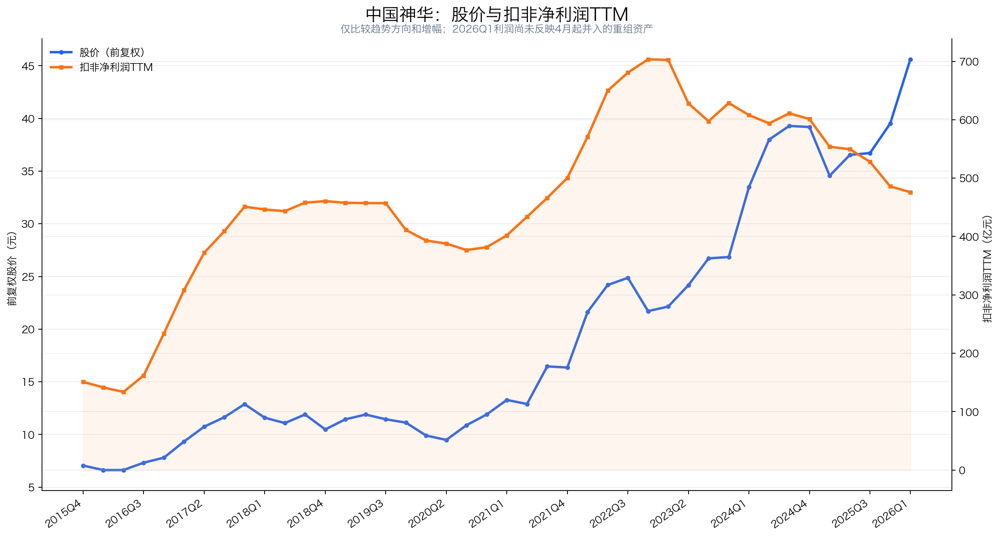

# 中国神华（601088.SH / 01088.HK）3R投资分析简报

> 数据截止：行情截至2026-07-20收盘；财务截至2026Q1；年度数据截至2025年报；运营数据截至2026年6月；重大公告截至2026-07-21。  
> 3R总分：**58.0/100**  
> 当前评级：**不碰；Right Price未过门槛，等待并表验证与更大安全边际**  
> 一句话结论：**中国神华拥有难复制的一体化网络和强长期现金创造，但仍是强周期、重资本、弱自主定价的生意；重组后杠杆与资本配置风险上升，独立保守/中性情景均低于报告基准日股权价值，当前应等待。**

## 一、公司概况：这家公司靠什么赚钱？

| 项目 | 内容 |
|---|---|
| 主营业务 | 煤炭开采与销售、发电、铁路、港口、航运和煤化工 |
| 赚钱方式 | 低成本煤矿赚资源价差，自有铁路港口赚运输效率，电厂消纳自产煤并对冲部分煤价周期 |
| 客户与场景 | 电力公司、工业与煤化工客户；长协煤占销售主体 |
| 行业位置 | 中国规模最大的煤炭上市公司之一，拥有难复制的“矿—路—港—航—电”网络 |
| 控股股东 | 国家能源集团；实际控制人为国务院国资委 |
| 经营管理 | 总经理张长岩负责经营；报告截止日董事长职位仍空缺 |
| 报告基准日价格 | A股46.14元；H股43.60港元；A+H严格股权价值约9,721亿元 |

中国神华并非简单挖煤卖煤。它把矿山、铁路、港口和电厂连成一套能源基础设施系统：煤价下跌时，电厂燃料成本改善，铁路和港口仍能收费，因此盈利比纯煤企稳定。但煤炭仍贡献六成以上分部利润，一体化只能缓冲周期，不能消灭周期。

## 二、3R决策摘要

| 维度 | 得分 | 核心判断 |
|---|---:|---|
| Right Business | 39.0/60 | 系统壁垒深、现金流强，但强周期、重资本、弱定价权 |
| Right People | 13.0/20 | 一体化运营成熟，巨额关联重组和治理整合待验证 |
| Right Price | 6.0/20 | 历史估值位置极高，独立保守/中性情景均低于当前股权价值 |
| **总分** | **58.0/100** | **不碰；等待并表与估值重置** |

- **最大矛盾**：不可复制的一体化资产与强现金流，对应的是利润持续下行、资本开支抬升和重组后杠杆显著增加，而当前价格未给足周期折价。
- **关键验证条件**：新资产完整并表后，扣非利润、自由现金流、净债务和每股分红是否改善。
- **门槛判断**：Right Business 39.0≥36、Right People 13.0≥12；Right Price 6.0<10，触发“等待价格”约束。无重大红线，但总分58.0低于65，机械评级与门槛后最终评级均为“不碰”。

## 三、Right Business：优秀周期龙头，不是非周期复利生意

### 3.1 评分概览

| 维度 | 得分 | 满分 | 核心判断 |
|---|---:|---:|---|
| 业务简单可持续、不易被替代 | 10.0 | 14 | 能源需求长期存在，但煤价强周期且长期受新能源替代 |
| 竞争格局清晰、护城河深厚、有定价权 | 13.0 | 18 | 一体化壁垒深，份额证据折扣，定价权受市场和政策约束 |
| 轻资本投入、高资产回报率、自由现金流好 | 8.0 | 14 | 长期现金流强，但重资本且重组后杠杆明显上升 |
| 盈利成长真实、稳定、可持续 | 4.5 | 8 | 现金匹配好，但利润连续下降、内生增量不足 |
| 有长期增长空间 | 3.5 | 6 | 资源扩张有空间，但不是轻资本内生复利 |
| **Right Business** | **39.0** | **60** | **好资产组合，不是非周期轻资本复利模式** |

### 3.2 业务持续性：需求下限稳，价格和长期增量承压

煤炭仍承担能源安全、工业用热、电力调峰和煤化工需求，但2025年全国商品煤消费下降0.7%，非化石能源贡献几乎全部新增发电量。煤炭不会快速消失，却更接近总量平台和价格反复波动的行业。

| 具体指标 | 判断依据 | 得分 |
|---|---|---:|
| 商业模式是否简单、容易理解 | 煤炭、运输与发电利润链条清楚 | 4.5/5 |
| 需求是否长期存在 | 能源安全、工业用热与调峰提供下限，非化石能源挤压增量 | 4.0/5 |
| 周期性是否可控 | 煤价和电价周期显著，一体化仅能缓冲 | 0.5/2 |
| 产品或品类替代风险 | 新能源、电网和储能长期替代部分煤电增量 | 1.0/2 |
| **小计** |  | **10.0/14** |

### 3.3 护城河与定价权：资源物流壁垒极深，商品属性限制价格权

公司拥有低成本矿区、自有铁路、西煤东运通道、港口、船队和电厂。2025年末中国标准煤炭可采储量173.1亿吨，重组披露口径预计增至345亿吨；完整网络远比单一煤矿难复制。

但煤炭是大宗商品。2025年煤炭销售均价下降12.1%，年度长协均价下降7.3%，月度长协下降19.3%。公司拥有成本优势、物流控制与价格平滑能力，而非消费品牌式自主提价权。

| 具体指标 | 判断依据 | 得分 |
|---|---|---:|
| 行业竞争格局 | 资源、运输和政策决定成本曲线，龙头优势清晰 | 3.0/4 |
| 公司行业位置和份额 | 商品煤产销、铁路和港口能力证明龙头位置；无可复算份额分母 | 2.5/3 |
| 护城河深度与持续性 | 矿、路、港、航、电系统难以复制 | 5.5/6 |
| 定价权和成本传导 | 长协平滑价格，但不能脱离煤价与电价 | 2.0/5 |
| **小计** |  | **13.0/18** |

### 3.4 资本回报与现金流：造血强，但自由现金流边际转弱

2025年加权ROE为12.76%，较2022年的18.07%明显下降。权益乘数稳定在1.3附近，ROE回落来自利润周期和资产周转下降，不是去杠杆；重组后备考资产负债率由25.65%升至43.60%，历史杜邦结构已不能直接外推。

2020—2025累计CFO为累计归母利润的1.65倍，累计FCF为利润的1.05倍，历史现金质量优秀。但2025年资本开支483.98亿元，FCF降至266.61亿元，只覆盖当年两次分红的约64%；2026年资本开支计划559.87亿元，重组又增加债务与现金支出。

| 具体指标 | 判断依据 | 得分 |
|---|---|---:|
| 资本投入强度与产能利用率 | 2025资本开支483.98亿元、2026计划559.87亿元，典型重资本 | 0.5/4 |
| ROE/ROIC水平及历史趋势 | ROE中等且连续回落，重组后稳定回报待验证 | 2.5/4 |
| 杠杆依赖与杜邦质量 | 历史ROE不靠杠杆，但2026Q1短借867亿元、备考负债率43.60% | 1.5/2 |
| 经营现金流和自由现金流 | 六年累计CFO/利润1.65倍、FCF/利润1.05倍；2025边际转弱 | 3.5/4 |
| **小计** |  | **8.0/14** |

### 3.5 盈利成长：利润已过周期高点，资产注入不是内生复利

2020—2025扣非利润5年CAGR为4.95%，但包含2021—2022煤价上行；2022—2025三年CAGR为-11.60%。2025年扣非利润下降19.19%，2026Q1又下降8.48%，扣非TTM降至475.96亿元。

重组报告书的2024备考扣非利润668.51亿元较交易前增加13.38%，说明资产注入可以增厚利润，但不是无成本翻倍；新增股本、债务、利息和资本开支必须同时考虑。

| 具体指标 | 判断依据 | 得分 |
|---|---|---:|
| 3年、5年利润增长 | 五年扣非CAGR 4.95%，三年CAGR -11.60% | 1.0/2 |
| 增长稳定性 | 2022见顶后连续三年下降，受煤价驱动 | 0.5/1 |
| 增长来源质量 | 电力与运输对冲真实，重组备考增厚约一成，但内生增量不足 | 1.5/2 |
| 最新利润趋势 | 2025及2026Q1继续下降 | 0.5/2 |
| 利润与现金流匹配 | 长期CFO与FCF覆盖利润 | 1.0/1 |
| **小计** |  | **4.5/8** |

### 3.6 长期空间：资源基数扩大，增长质量取决于回报而非规模

重组后资源量、煤炭产能、电力与物流规模扩大，有助于巩固一体化壁垒。但煤炭需求中枢、产量约束与高资本投入限制内生增长，煤化工当前低毛利，也不是成熟第二曲线。

| 具体指标 | 判断依据 | 得分 |
|---|---|---:|
| 核心业务和行业空间 | 能源下限稳，但煤炭总量增长空间有限 | 1.0/2 |
| 市场份额提升空间 | 资源、物流与集团资产注入支持整合提升，但缺连续份额数据 | 1.5/2 |
| 地域扩张与第二曲线 | 电力与运输已能缓冲周期，但扩张主要是整合而非高增长曲线 | 0.5/1 |
| 再投资回报及增长质量 | 巨额重组与资本开支回报尚未验证 | 0.5/1 |
| **小计** |  | **3.5/6** |

## 四、Right People：运营成熟，关联重组考验资本配置

| 维度 | 判断 | 决定性证据 | 得分 |
|---|---|---|---:|
| 诚信与治理 | 基本合规、事项待验 | 标准无保留审计、无内控重大缺陷；董事长空缺、关联交易规模巨大 | 4.5/6 |
| 专注与经营能力 | 基本符合 | 一体化运营、成本控制和保供能力长期稳定 | 5.0/7 |
| 资本配置与股东利益 | 偏弱 | 高分红历史良好，但1,335.98亿元关联收购显著提高负债与复杂度 | 3.5/7 |
| **Right People** |  |  | **13.0/20** |

管理层运营大型能源系统的能力已验证，历史低杠杆和高分红也对股东友好。但本轮收购评估增值59.52%，现金对价935.19亿元，短期借款升至867亿元；必须用并表后的每股FCF和债务下降证明交易对中小股东有利。

## 五、Right Price：历史位置高，独立情景赔率不合格

| 维度 | 判断 | 决定性证据 | 得分 |
|---|---|---|---:|
| 利润位置与股价利润匹配度 | 较差 | 原口径利润持续下降，股价自2023年明显上行 | 1.5/5 |
| 当前估值与历史位置 | 显著偏贵 | 报表PE 19.41倍、近十年约99.2%分位；2024备考扣非PE约14.54倍也不低 | 1.0/6 |
| 股息及持有回报 | 尚可 | 历史静态股息率4.36%，未来分红受股本、债务和资本开支影响 | 2.0/3 |
| 保守/中性情景与赔率 | 较差 | 独立保守情景约-44.5%，中性情景约-7.4%，两档均缺乏上行 | 1.5/6 |
| **Right Price** |  |  | **6.0/20** |

股价在2022年利润高点后仍明显上行，而扣非利润连续回落、2026Q1尚未企稳；即使考虑重组并表时点错配，当前价格也没有为利润下行提供充分安全边际。

| 估值口径 | 报告基准日 |
|---|---:|
| 东方财富PE-TTM | 19.41倍 |
| 报告扣非PE-TTM | 21.03倍 |
| 2024备考扣非PE | 14.54倍 |
| 旧口径近十年PE分位 | 约99.2% |
| 历史静态股息率 | 约4.36% |

| 独立情景 | 归一化扣非利润 | PE | 对应股权价值 | 相对严格股权价值9,721.2亿元 |
|---|---:|---:|---:|---:|
| 保守 | 450亿元 | 12倍 | 5,400亿元 | -44.5% |
| 中性 | 600亿元 | 15倍 | 9,000亿元 | -7.4% |

以上为V4盲评依据事实包独立建立的情景，不沿用完整报告旧情景，且不加回现金，以避免现金及其利息贡献重复计算。报表PE虽受“先增股、后完整并表”影响，但备考估值也不便宜；保守和中性价值均低于当前严格股权价值，价格门槛明确不通过。

## 六、最终行动

### 现在怎么办？
- 不买入并等待价格；不因央企、高股息、资产注入或报表口径错配而追高。

### 什么情况下提高关注？
- 2026中报或年报显示备考利润兑现、短债下降、FCF覆盖分红；
- 并表后ROE和每股FCF改善，估值未继续抬升；
- 价格回落到中性利润假设也有明显安全边际。

### 什么情况下说明判断错了？
- 新资产产量、利润和现金流低于承诺或可比口径；
- 煤炭、电力、铁路和港口利润同步恶化；
- 资本开支与债务继续上升，分红依赖存量现金或借款。

## 七、数据边界

- **引用的完整报告**：`中国神华_投资分析报告_2026-07-21.md`；仅复用其中已校验事实数据与四张固定图，不沿用其评分、评级、投资结论或估值情景。
- **行情口径**：沿用2026-07-20收盘价，本文称“报告基准日价格”。
- **盲评与证据隔离**：本轮最终裁决使用3名隔离上下文评估器；评估器只读取脱敏事实包与3R方法文件，屏蔽原完整报告/旧3R/README中的分数、评级、方向性总结、原估值情景与行动建议，也未联网补缺。
- **初始锁分**：对固定28项逐项取三名评估器中位数，再逐级加总五个Business维度、Business/People/Price与总分；初始锁分为40.0/13.0/6.0，总分59.0，且在查看任何旧评分前完成。
- **系统性复核调整**：在查看旧分前复核重复加扣分、长期与短期错位、行业风险叠加、商业模式优势重复奖励及“证据不足”误写为质量不足。B6由3.0调至2.5：龙头规模可证，但缺可复算市场份额分母，仅作证据完整性折扣；B11由2.0调至1.5：历史低杠杆不足以覆盖867亿元短借与43.60%备考负债率，且只评价融资结构，不重复评价P3的资本配置决策。
- **最终锁分与无锚定回调**：调整后Business为39.0，总分58.0；最终28项、模块、总分与“不碰”评级均在查看任何旧评分前锁定。其后未为接近原完整报告或旧3R分数而回调任何子项、模块、总分、评级或情景。
- **未验证事项**：完整并表扣非利润、净债务、ROE、FCF、分红政策及新增资产承诺兑现。
- **评分差异说明**：完整报告66.5/100；最终3R为58.0/100，差异来自独立28项框架、B6/B11系统性复核调整及独立V4情景，不是为贴近旧结论作换算。

---

*本简报仅供学习研究，不构成投资建议。*
