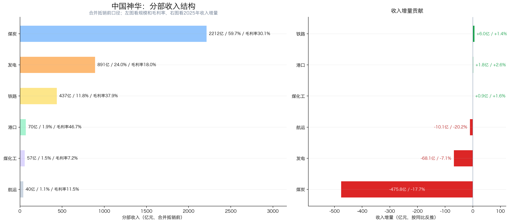
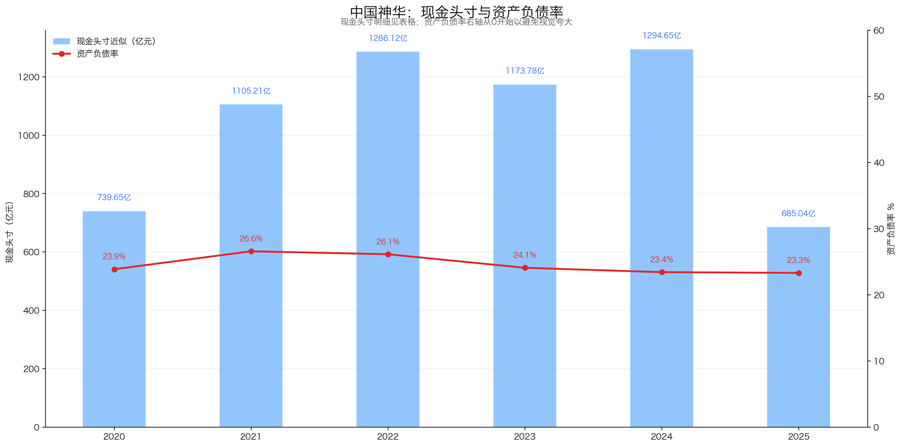
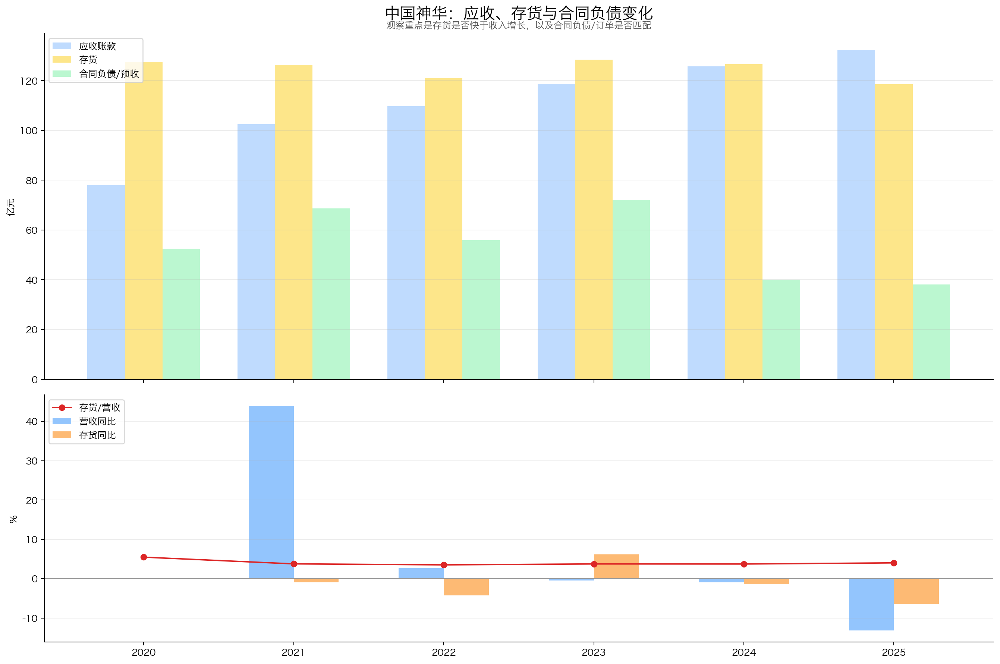
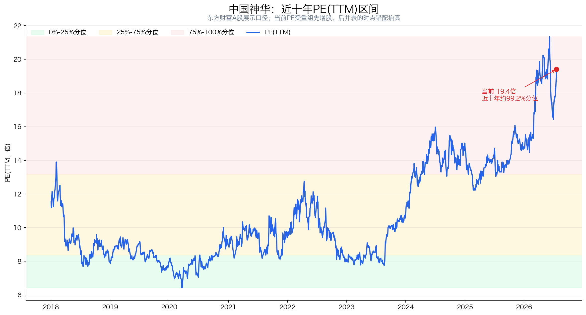

# 中国神华（601088.SH / 01088.HK）投资分析报告

> 数据截止：行情截至2026-07-20收盘；财务截至2026Q1；年度数据截至2025年报；运营数据截至2026年6月；重大公告截至2026-07-21。  
> 结论：**一般（66.5/100）**。中国神华不是一只简单的“煤价股”，而是一套把煤矿、铁路、港口、航运、电厂和煤化工连起来的能源基础设施系统。一体化经营、低成本资源、强现金流和高分红提高了盈利下限；但煤炭强周期、能源替代、重资本投入和2026年巨额关联资产注入，使它不符合典型非周期复利公司的画像。当前A股46.14元对应报表口径PE约19.4倍、近十年约99.2%分位；考虑重组备考利润后约14.5倍，不能机械判为极贵，但也谈不上明显便宜。现价更像已经计入大部分资产注入改善预期，适合等待并表利润、债务和分红能力得到验证，而不是只看“央企高股息”追高。

## 先说人话：中国神华到底靠什么赚钱？

如果把一家普通煤企理解成“挖煤卖煤”，中国神华更像一条自带矿山、铁路、港口和电厂的能源高速公路：

1. 在神东、准格尔、新街等矿区开采动力煤；
2. 用自己的铁路把西部煤炭运到港口或下游；
3. 用自己的港口和船队转运；
4. 一部分煤卖给外部电厂，一部分供给自己的电厂和煤化工项目；
5. 煤价高时煤炭分部赚钱，煤价下行时电厂燃料成本下降，铁路和港口仍能收“通行费”。

这就是“一体化”的本质：**不是消灭周期，而是用电力和运输给煤炭周期加缓冲器。**

2025年就是一个典型例子：煤炭销售均价下降12.1%，煤炭分部利润总额下降9.6%；但发电分部利润增长13.7%、铁路增长2.7%、港口增长24.0%，使归母净利润只下降5.3%。缓冲器有效，但没有完全抵消煤价下行。

| 核心指标 | 当前/最新值 | 怎么理解 |
|---|---:|---|
| A股股价 | 46.14元 | 2026-07-20收盘 |
| H股股价 | 43.60港元 | 2026-07-20收盘 |
| A股展示口径总市值 | 10,007.5亿元 | 东方财富以A股价格映射全部股本的常见展示口径 |
| A+H严格股权价值 | 约9,721.2亿元 | A、H股份分别按对应市场价格计值，再折算人民币 |
| PE(TTM) | 19.41倍 | 东方财富归母口径；受重组“先增股、后完整并表”时点错配抬高 |
| 报告口径扣非PE(TTM) | 约21.03倍 | 扣非TTM 475.96亿元，尚未反映新资产完整利润 |
| 2024备考扣非PE | 约14.54倍 | 用重组报告书2024备考扣非利润668.51亿元测算，不是当前TTM |
| PB(MRQ) | 2.08倍 | 东方财富口径 |
| 近十年PE分位 | 约99.2% | 仅为报表历史口径，重组导致当前值失真，不能单独下结论 |
| 2025财年两次分红 | 2.01元/旧股 | 中期0.98元+年度1.03元；两次均已实施 |
| 历史静态股息率 | 约4.36% | 按2.01元/46.14元，仅是历史回报，不代表当前股东未来必得 |
| 2025加权ROE | 12.76% | 较2022年18.07%明显回落 |
| 2026Q1林奇现金头寸 | 889.12亿元 | 货币资金1,185.85亿元－长期借款296.73亿元 |
| 2026Q1短期借款 | 867.00亿元 | 并购贷款大增；林奇简化公式不扣短债，但分析安全性时必须单列 |

## 一、公司画像、能力圈与红线

**初筛结论：谨慎通过；强周期框架适配度较低。**

- 公司画像：2025年商品煤产量3.321亿吨、煤炭销量4.309亿吨、售电量2,070亿千瓦时，自有铁路营业里程2,408公里，黄骅港等港口总装船能力约2.7亿吨/年。
- 能力圈：商业模式容易理解；难点是煤价、电价政策、长协执行、矿业权价值、巨额资本开支和重组后并表口径。
- 控制与管理：国家能源集团为控股股东，国务院国资委为实际控制人。总经理张长岩负责经营；前董事长吕志韧于2025年3月退休辞任，截至本报告截止日未见新任董事长公告，由张长岩临时召集董事会。
- 审计：2025年财务报表获标准无保留意见；公司披露不存在财务报告及非财务报告内部控制重大缺陷。
- 周期红线：2022—2025年扣非利润3年CAGR为-11.60%，低PE或高股息都不能自动覆盖煤价下行风险。
- 资本配置红线：2026年完成1,335.98亿元关联资产收购，其中现金对价935.19亿元；发行股份和配套融资使总股本增加9.16%，备考资产负债率由25.65%升至43.60%。
- 估值红线：股价自2023年以来显著上涨，而原口径扣非TTM利润已从2022年703.37亿元降至2026Q1的475.96亿元。当前估值需要靠新资产利润兑现来消化。

后续必须验证：

1. 新并入资产能否把备考利润真正转化为上市公司现金流，而不是只增加规模和负债；
2. 煤价下行时，电力、铁路、港口的对冲能否覆盖煤炭利润下降；
3. 2026年559.87亿元资本开支计划、并购债务与现金分红能否同时被自由现金流覆盖。

## 二、好行业：能源安全地位高，但本质仍是强周期行业

### 2.1 需求质量：有长期需求，不代表没有周期

2025年我国商品煤消费量49.9亿吨，同比下降0.7%；其中发电行业商品煤消费下降2.1%，化工行业增长10.2%。煤炭短期仍是能源安全和电力系统调峰的重要支柱，但新增发电量已经主要来自非化石能源：2025年风、光、生物质新增发电量占全社会新增用电量的97.1%。

因此应把煤炭需求拆成两层：

- **下限较稳**：能源安全、工业用热、电力调峰和煤化工仍需要煤；
- **增量承压**：风光装机、电网消纳、储能和电气化不断挤压煤电在新增电量中的占比。

这不是一个需求自然高增长的行业，更接近“长期总量平台、价格反复波动、龙头集中度提升”。

### 2.2 竞争格局：资源和运输决定成本曲线

| 公司 | 2026-07-20市值 | PE(TTM) | PB(MRQ) | 主要特点 |
|---|---:|---:|---:|---|
| 中国神华 | 10,007.5亿元 | 19.41 | 2.08 | 煤电运化一体化；估值受重组时点错配影响 |
| 陕西煤业 | 2,423.8亿元 | 14.99 | 2.37 | 陕西优质动力煤，煤炭纯度更高 |
| 兖矿能源 | 2,086.7亿元 | 21.84 | 2.73 | 煤炭与煤化工，海外资产占比较高 |
| 中煤能源 | 1,828.4亿元 | 10.30 | 1.11 | 煤炭全产业链，估值较低 |

注：均为东方财富A股展示口径。中国神华的市值远高于同行，市场已给予一体化、现金流和股东回报明显溢价；同业PE不能脱离资源质量、负债和分红比较。

### 2.3 壁垒：矿权只是第一层，物流网络才是放大器

中国神华的壁垒由四层组成：

1. 大规模、低成本的优质煤炭资源；
2. 环绕核心矿区的自有铁路和西煤东运通道；
3. 黄骅港、天津煤码头和自有船队；
4. 大容量燃煤机组和煤化工消纳端。

截至2025年末，公司中国标准煤炭保有资源量414.1亿吨、可采储量173.1亿吨，JORC可售储量111.3亿吨。重组后披露口径下，煤炭保有资源量预计提升到684.9亿吨、可采储量345亿吨。单一煤矿可以复制，完整的“矿—路—港—航—电”网络很难复制。

### 2.4 议价权和替代风险

2025年通过销售集团销售的煤炭中，年度长协占53.2%、月度长协占39.4%、现货仅3.8%。长协提高销量和价格稳定性，但不能隔绝市场：2025年年度长协均价仍下降7.3%，月度长协均价下降19.3%。

公司对国家能源集团煤炭销量占总销量34.2%，关联协同很强，也意味着关联交易和内部定价需要持续透明。新能源替代是长期确定性风险，煤炭价格则是短期最大变量。

**好行业评分：12.5/20**

| 子项 | 得分 | 满分 |
|---|---:|---:|
| 需求质量/非周期性 | 2.5 | 6 |
| 竞争格局 | 3.0 | 4 |
| 进入壁垒 | 4.0 | 4 |
| 上下游议价权 | 2.0 | 3 |
| 替代品威胁 | 1.0 | 3 |
| 小计 | **12.5** | **20** |

## 三、好公司·定性：真正护城河是一体化，不是“煤永远涨价”

### 3.1 护城河

中国神华最强的地方不是预测煤价，而是同样一吨煤能在多个环节赚钱：矿山赚资源和成本差，铁路和港口赚运输效率，电厂利用自有煤稳定燃料供应。2025年煤炭、发电、运输、煤化工分部利润总额占比分别为62%、17%、21%和0%，利润已不只来自煤矿。

这种结构使公司在煤价下降期通常比纯煤企更稳，但仍有两个边界：

- 煤炭利润池仍占六成以上，周期无法消失；
- 一体化是资本密集型护城河，需要持续建设、维护和安全投入。

### 3.2 客户粘性

电煤长协、自有运输网络和集团内部电厂形成较高业务粘性，客户不像消费品那样随意更换供应商。2025年前五大煤炭客户销量占46.1%，主要为电力公司。

但这类粘性更多来自稳定供货和基础设施绑定，不是品牌溢价。客户集中、关联销售和政策保供有利于稳定销量，也可能限制完全市场化定价。

### 3.3 定价权

公司规模大、物流强、长协比例高，具备优于普通煤企的议价能力；但煤炭最终仍是标准化大宗商品。2025年煤炭销售均价下降12.1%、售电均价下降4.0%，已经说明公司不能脱离市场独立提价。

准确说，中国神华拥有的是**成本优势、渠道控制和价格平滑能力**，而不是消费龙头式定价权。

### 3.4 管理层与资本配置

正面因素：

- 长期维持低资产负债率和大额现金储备；
- 2020—2025年累计自由现金流3,450.20亿元，覆盖同期累计归母利润的105.43%；
- 2025财年中期与年度现金分红合计418.11亿元，占归母净利润79.11%；
- 重组将大量集团煤炭、电力、煤化工和物流资产注入上市公司，缓解同业竞争并扩大一体化网络。

需要扣分：

- 1,335.98亿元关联收购规模巨大，资产评估增值率59.52%，中小股东需要持续验证交易价格和承诺利润；
- 现金对价935.19亿元，配套融资净额仅199.67亿元，差额显著依赖现金和借款；
- 重组后备考资产负债率约43.60%，与历史约23%—27%的低杠杆画像不同；
- 董事长职位长期空缺不影响日常经营，但对重大重组后的治理整合并非理想状态。

**好公司·定性评分：15.5/20**

| 子项 | 得分 | 满分 |
|---|---:|---:|
| 护城河 | 6.5 | 7 |
| 复购/粘性/低替代性 | 4.0 | 5 |
| 定价权 | 3.0 | 5 |
| 管理层 | 2.0 | 3 |
| 小计 | **15.5** | **20** |

## 四、好公司·定量：现金流很强，但利润与ROE已过周期高点

### 4.1 ROE质量与盈利模式

| 年份 | 加权ROE | 销售净利率 | 总资产周转率 | 权益乘数 |
|---:|---:|---:|---:|---:|
| 2020 | 11.00% | 20.26% | 0.42 | 1.33 |
| 2021 | 13.64% | 17.71% | 0.58 | 1.34 |
| 2022 | 18.07% | 23.70% | 0.56 | 1.36 |
| 2023 | 14.88% | 20.29% | 0.55 | 1.34 |
| 2024 | 14.04% | 20.35% | 0.52 | 1.33 |
| 2025 | 12.76% | 21.29% | 0.46 | 1.32 |

注：ROE为同花顺加权口径；杜邦三因子按平均总资产、平均总权益近似拆解，主要看趋势。

2022年ROE高点主要来自煤价上行带来的净利率扩张，而不是加杠杆。2023—2025年权益乘数继续稳定，ROE下降主要来自资产周转率和利润规模回落，说明问题在周期与资产效率，不在财务杠杆。

重组后资产和负债同时大增，历史杜邦结构将发生明显变化。2026年不能直接把旧ROE外推到新公司。

### 4.2 利润增长与持续性

| 年份/期间 | 营收 | 归母净利润 | 扣非净利润 | 扣非同比 |
|---|---:|---:|---:|---:|
| 2020 | 2,332.63亿元 | 391.70亿元 | 381.65亿元 | -7.18% |
| 2021 | 3,356.40亿元 | 500.84亿元 | 500.36亿元 | 31.10% |
| 2022 | 3,445.33亿元 | 696.48亿元 | 703.37亿元 | 40.57% |
| 2023 | 3,430.74亿元 | 596.94亿元 | 628.68亿元 | -10.62% |
| 2024 | 3,397.88亿元 | 558.05亿元 | 601.25亿元 | -4.36% |
| 2025 | 2,949.16亿元 | 528.49亿元 | 485.89亿元 | -19.19% |
| 2026Q1 | 703.97亿元 | 106.67亿元 | 107.12亿元 | -8.48% |

- 2020→2025营收5年CAGR为4.80%，扣非利润5年CAGR为4.95%；这个结果包含2021—2022煤价上行周期。
- 2022→2025扣非利润3年CAGR为-11.60%，更能说明当前处于周期回落阶段。
- 2026Q1扣非TTM为475.96亿元，同比继续下降；新收购资产自2026年4月起才纳入运营统计，因此Q1利润不能代表重组后的完整盈利能力。
- 重组报告书披露，2024年备考扣非利润为668.51亿元，比交易前589.62亿元增加13.38%；2025年1—7月备考扣非利润326.37亿元，比交易前增加11.56%。资产注入增厚EPS，但不是把利润翻倍。

结论：历史利润增长不是稳定复利，而是“煤价周期+资产扩张”。重组增加资源量和利润基数，但不能改变煤价主导的方向。

### 4.3 分部结构与增长来源

| 2025年分部（抵销前） | 收入 | 同比 | 毛利率 | 利润总额 | 核心判断 |
|---|---:|---:|---:|---:|---|
| 煤炭 | 2,212.32亿元 | -17.7% | 30.1% | 465.97亿元 | 最大利润池，煤价下降拖累明显 |
| 发电 | 891.39亿元 | -7.1% | 18.0% | 126.27亿元 | 燃煤成本下降，利润增长13.7% |
| 铁路 | 437.10亿元 | 1.4% | 37.9% | 129.01亿元 | 类“通行费”资产，盈利稳定 |
| 港口 | 70.20亿元 | 2.6% | 46.7% | 26.31亿元 | 毛利率最高，利润增长24.0% |
| 航运 | 39.89亿元 | -20.2% | 11.5% | 2.69亿元 | 体量小、运价周期明显 |
| 煤化工 | 57.22亿元 | 1.6% | 7.2% | 0.58亿元 | 低毛利，尚非重要利润来源 |

注：分部收入为合并抵销前口径，合计高于集团营业收入，不能与集团营收直接相加比较。

2025年煤炭分部收入减少约475.8亿元，发电减少约68.1亿元；铁路、港口和煤化工合计增量很小。利润能够稳住，主要依靠发电燃料成本下降和运输分部提效，而不是第二增长曲线放量。

### 4.4 现金流质量

| 年份 | 归母净利润 | 经营现金流 | 资本开支 | 自由现金流 | CFO/净利润 | FCF/净利润 |
|---:|---:|---:|---:|---:|---:|---:|
| 2020 | 391.70 | 812.89 | 206.73 | 606.16 | 2.08 | 1.55 |
| 2021 | 500.84 | 943.50 | 236.38 | 707.12 | 1.88 | 1.41 |
| 2022 | 696.48 | 1,097.34 | 286.84 | 810.50 | 1.58 | 1.16 |
| 2023 | 596.94 | 896.87 | 370.84 | 526.03 | 1.50 | 0.88 |
| 2024 | 558.05 | 910.86 | 377.08 | 533.78 | 1.63 | 0.96 |
| 2025 | 528.49 | 750.59 | 483.98 | 266.61 | 1.42 | 0.50 |

单位：亿元。自由现金流采用“经营现金流－购建长期资产现金支出”的简化口径。

2020—2025年累计经营现金流5,412.05亿元，是累计归母利润的1.65倍；累计自由现金流3,450.20亿元，是累计利润的1.05倍。利润兑现为现金的能力非常强，这是高分红的根基。

风险在边际变化：2025年资本开支升到483.98亿元，自由现金流降到266.61亿元，只能覆盖当年财年两次分红418.11亿元的64%左右。2026年调整后资本开支计划559.87亿元，重组又占用大量现金，未来分红不能只看过去现金余额。

### 4.5 现金头寸与资产负债表安全性

| 年份 | 货币资金 | 交易性金融资产 | 长期借款 | 长期应付债券 | 林奇现金头寸 | 资产负债率 |
|---:|---:|---:|---:|---:|---:|---:|
| 2020 | 1,274.57 | 0.00 | 502.51 | 32.41 | 739.65 | 23.87% |
| 2021 | 1,628.86 | 0.00 | 491.93 | 31.72 | 1,105.21 | 26.58% |
| 2022 | 1,705.03 | 0.00 | 384.38 | 34.53 | 1,286.12 | 26.13% |
| 2023 | 1,499.86 | 0.00 | 296.36 | 29.72 | 1,173.78 | 24.08% |
| 2024 | 1,438.45 | 173.02 | 316.82 | 0.00 | 1,294.65 | 23.42% |
| 2025 | 967.72 | 0.00 | 282.68 | 0.00 | 685.04 | 23.31% |
| 2026Q1 | 1,185.85 | 0.00 | 296.73 | 0.00 | 889.12 | 29.03% |

单位：亿元。定期存款已在银行存款/货币资金中体现，不重复加计；2025年末受限银行存款176.37亿元需单独关注。林奇主口径不扣短期借款。

单看林奇现金头寸，资产负债表仍有安全垫；但2026Q1短期借款从4.09亿元激增至867.00亿元，主要是并购贷款，购买资产支付款则进入其他非流动资产。重组备考口径资产负债率约43.60%，显著高于图中的历史值。

因此，**889亿元现金头寸不能等同于889亿元可自由分红现金**。并购后的真实安全垫要等新资产完整并表后，结合短债、受限资金、矿业权付款和资本开支重新计算。

### 4.6 营运质量

| 年份 | 应收账款 | 存货 | 合同负债 | 应收/营收 | 存货/营收 |
|---:|---:|---:|---:|---:|---:|
| 2020 | 77.98 | 127.50 | 52.56 | 3.34% | 5.47% |
| 2021 | 102.58 | 126.33 | 68.64 | 3.06% | 3.76% |
| 2022 | 109.68 | 120.96 | 55.97 | 3.18% | 3.51% |
| 2023 | 118.75 | 128.46 | 72.08 | 3.46% | 3.74% |
| 2024 | 125.69 | 126.66 | 40.01 | 3.70% | 3.73% |
| 2025 | 132.25 | 118.50 | 38.10 | 4.48% | 4.02% |

单位：亿元。

存货绝对额和存货率都较低，不存在典型制造业式库存积压；应收账款占营收升到4.48%，主要与售电应收增加有关，绝对风险仍可控。合同负债下降说明预收售煤和运输款减少，需要结合销量和客户结算方式观察，但目前不是主要红线。

2026Q1应收账款133.08亿元、存货107.92亿元、合同负债47.15亿元；库存继续下降，合同负债回升，营运质量没有明显恶化。

**好公司·定量评分：30.0/40**

| 子项 | 得分 | 满分 | 扣分理由 |
|---|---:|---:|---|
| ROE质量与盈利模式 | 6.0 | 9 | 不靠杠杆，但ROE从周期高点持续回落，重组后口径将改变 |
| 利润增长来源与持续性 | 3.5 | 7 | 2022—2025扣非利润负增长，资产注入增厚但不消除周期 |
| 现金流质量 | 6.5 | 7 | 累计FCF覆盖利润，2025分红覆盖和资本开支压力上升 |
| 现金头寸与资产负债表安全性 | 4.0 | 6 | 历史安全垫厚；并购贷款和备考负债率显著上升 |
| 营运质量 | 4.5 | 5 | 存货低、回款尚稳，应收占比小幅上升 |
| 产品结构与增长来源 | 5.5 | 6 | 一体化多利润池有效，但煤炭仍贡献六成以上利润 |
| 小计 | **30.0** | **40** |  |

## 五、好时机：报表PE很贵，备考PE不贵，但赔率仍不突出

### 5.1 股价与利润线

图中看的是趋势方向和增幅，不比较两条线绝对高低。2016—2022年股价大体跟随利润上行；2023年后出现明显背离：扣非TTM从约700亿元下降到475.96亿元，股价却从约20多元升到2026Q1的46.75元附近。

背离并不完全等于泡沫，市场在提前计价高分红、央企重估和资产注入。但它意味着当前回报不能再依赖“利润没变、估值也没变”，而要依赖新资产利润兑现或估值继续维持高位。

### 5.2 PE及近十年分位

| 估值口径 | 数值 | 解释 |
|---|---:|---|
| 东方财富PE(TTM) | 19.41倍 | 近十年约99.2%分位 |
| 报告口径扣非PE(TTM) | 21.03倍 | 使用尚未完整并入新资产利润的475.96亿元 |
| 2024备考扣非PE | 14.54倍 | 严格A+H股权价值/2024备考扣非利润668.51亿元 |
| 近十年PE中位数 | 9.50倍 | 旧公司历史，不应直接套到重组后的新资产范围 |
| 近十年75%分位 | 13.19倍 | 当前备考口径仍高于旧历史75%分位 |

当前历史分位极高，但“先增发股份、后完整并表”抬高了PE；用2024备考利润校正后约14.5倍，已经接近成熟高股息龙头的合理区间，而不是19—21倍那么夸张。

问题是：2024备考利润不是2026年已实现TTM利润。煤价下行、新资产整合、利息支出和资本开支都可能使实际结果偏离。最稳妥做法是等待2026中报或年报给出完整并表数据。

### 5.3 PEG

2022→2025扣非利润3年CAGR为-11.60%，传统PEG失去解释力；用负增长计算PEG会产生没有经济意义的负值。本项不给“低PEG”加分，也不使用券商预测增速修饰结果。

### 5.4 股息率

2025财年中期每股0.98元、年度每股1.03元均已实施。对同时持有至两次登记日的原有股份，合计每股2.01元，对应46.14元股价的历史静态股息率4.36%。

需注意：

- 中期分红按重组前198.69亿股派发，年度分红按重组后216.89亿股派发；
- 当前新买入者不能追溯获得中期0.98元；
- 2026年并购、资本开支和利息支出增加，未来每股分红不能机械沿用2.01元。

### 5.5 市场信号与预期差

正向预期差：

- 重组后煤炭保有资源量、可采储量和产量能力大幅提升；
- 2026上半年按重述口径煤炭销量增长1.8%，铁路周转量增长6.8%，售电量增长5.5%；
- 新资产自4月起纳入运营统计，Q1报表尚未展示完整增量。

负向预期差：

- 市场已把股价和PE推到旧口径历史高位；
- 新资产2024年仅使备考扣非EPS增厚6.10%，并非无成本的大幅增厚；
- 交易使杠杆、资本开支和关联交易复杂度明显上升。

### 5.6 毛估估：当前更接近中性偏上，而不是安全边际区

以下不是盈利预测，而是用公开历史利润和不同周期倍数做压力测试；按A+H严格股权价值约9,721亿元比较，不额外加现金，避免现金利息与现金本金重复估值。

| 情景 | 归一化扣非利润假设 | PE | 对应股权价值 | 相对当前 |
|---|---:|---:|---:|---:|
| 压力档 | 500亿元 | 10倍 | 5,000亿元 | -48.6% |
| 中性档 | 650亿元 | 14倍 | 9,100亿元 | -6.4% |
| 乐观档 | 750亿元 | 16倍 | 12,000亿元 | +23.4% |

- 500亿元接近原口径当前利润，代表煤价偏弱、并表增厚有限；
- 650亿元接近2024备考扣非利润668.51亿元；
- 750亿元要求新资产整合、产量和电力对冲均较顺利，并获得更高估值。

当前价格已接近中性档以上，乐观档上行约23%，压力档下行显著，赔率不够宽。高股息可以缓冲持有回报，但无法填平周期和估值同时回落的损失。

**好时机评分：8.5/20**

| 子项 | 得分 | 满分 |
|---|---:|---:|
| 股价 vs 利润线 | 1.5 | 5 |
| PE及PE百分位 | 2.0 | 5 |
| PEG | 0.0 | 2 |
| 股息率 | 2.5 | 3 |
| 市场信号与预期差 | 1.5 | 2 |
| 毛估估 | 1.0 | 3 |
| 小计 | **8.5** | **20** |

## 六、投资结论

中国神华的胜率来自不可复制的一体化资产、资源储备、强经营现金流和高分红能力；最大不确定性来自煤价、电价、巨额关联重组后的负债与资本开支。当前报表PE被并表时点错配高估，但2024备考约14.5倍也只算合理偏高，压力测试的中性上行空间不足。综合**66.5分，评级“一般”**：公司质量在煤企中领先，但价格与重组兑现仍需要更大安全边际。

当前行动：

1. 暂不因“历史高股息”追高，优先等待2026中报/年报完整并表利润、净债务和自由现金流；
2. 若备考利润兑现、短债明显下降且分红仍可由自由现金流覆盖，可重新评估；
3. 若煤价继续下行、资本开支超预算或并购资产回报低于承诺，不因股价下跌机械补仓。

## 七、投资逻辑与证伪条件

### 投资逻辑

1. **核心资产增值**：优质煤矿与自有铁路、港口、电厂组成难以复制的一体化网络，重组进一步扩大资源和产能。
2. **多利润池缓冲周期**：煤炭弱时，电力燃料成本改善，铁路和港口提供相对稳定利润，降低纯煤企波动。
3. **现金流与分红提供回报**：历史累计自由现金流覆盖利润，低成本资源和高派息构成长期持有的主要安全垫。

### 证伪条件

以下任一情况持续两个报告期，应重新评估：

1. **资源和产量兑现失败**：新并入矿井产量、煤炭销量和运输周转持续低于可比口径，整合协同没有出现；
2. **主要利润池同步恶化**：煤炭利润下降的同时，发电、铁路和港口也无法对冲，扣非利润和经营现金流持续双降；
3. **并购与资产负债表恶化**：短期借款、资本开支或关联资金占用持续增加，备考负债率继续上升，资产减值或承诺利润不达标；
4. **分红和估值失去安全边际**：自由现金流持续不能覆盖分红，或在利润下行阶段仍维持明显高于历史和同业的估值。

## 八、维度打分汇总

| 模块 | 得分 | 满分 |
|---|---:|---:|
| 好行业 | 12.5 | 20 |
| 好公司·定性 | 15.5 | 20 |
| 好公司·定量 | 30.0 | 40 |
| 好时机 | 8.5 | 20 |
| **总分** | **66.5** | **100** |

好公司（定性+定量）合计：**45.5/60**。

评级映射：60—70分为“一般”。本报告没有因公司在煤企中的龙头地位而豁免周期、重组负债和估值风险。

## 九、总结

中国神华最容易被误解的地方有两个：

- 它不是纯煤企。一体化物流和电力确实让利润比普通煤企稳；
- 它也不是公用事业。煤炭仍贡献六成以上分部利润，周期和能源替代不能忽略。

2026年重组让公司资源更多、规模更大、利润基数更高，也让股本、负债、资本开支和治理复杂度同步上升。对投资者而言，关键不是猜下一周煤价，而是等待三个事实：完整并表利润有多少、并购债务多久下降、分红能否继续由自由现金流覆盖。

当前公司值得长期跟踪，但现价的安全边际不足以覆盖压力情景。更好的买点应来自“利润兑现而价格未继续透支”，或“估值回落到即使中性利润也有明显回报空间”。

## 十、数据校验结果

### 正确 ✅

1. 2020—2025年营收、归母净利润、扣非净利润与同花顺年度表一致；2025年数据与年报一致。
2. 2025年四季度营收、归母净利润、扣非净利润和经营现金流加总分别等于全年2,949.16亿元、528.49亿元、485.89亿元和750.59亿元。
3. 2020→2025按5年计算；2022→2025按3年计算，CAGR年数正确。
4. 2025年经营现金流750.59亿元、资本开支483.98亿元、简化自由现金流266.61亿元与年报/API勾稽。
5. 现金头寸逐年使用货币资金、交易性金融资产、长期借款及长期应付债券；未把应收款项融资计入现金，未扣短期借款。
6. 2025年中期0.98元和年度1.03元分红均以实施公告为准，合计金额按各自实施股本计算。
7. 重组总对价1,335.98亿元、股份及现金支付比例、发行股数、配套融资和备考利润均来自正式重组文件。
8. A+H股权价值按A股、H股股数和对应市场价格分别计算，没有用A股价格乘全部股本冒充严格总市值。
9. 10张图均已生成，正文嵌入8张，图片链接存在；六张定量图数据年份完整，无静默缺柱。
10. 定量细项合计30.0分，四模块合计66.5分，评级与分数映射一致。

### 需修正 ❌

无。

### 不可验证/待后续验证 ⚠️

1. 2026Q1尚未完整反映新收购资产利润；当前报表PE和现金头寸都不是重组后稳定口径。
2. 2026年完整并表后的扣非利润、自由现金流、净债务和ROE需等待中报及年报验证。
3. 估值情景是压力测试，不是盈利预测；没有引用券商一致预期。

## 十一、主要资料来源

1. [中国神华2025年度报告（2026-03-31）](https://static.cninfo.com.cn/finalpage/2026-03-31/1225064293.PDF)
2. [中国神华2026年第一季度报告（2026-04-25）](https://static.cninfo.com.cn/finalpage/2026-04-25/1225185746.PDF)
3. [发行股份及支付现金购买资产并募集配套资金暨关联交易报告书（2026-02-13）](https://static.cninfo.com.cn/finalpage/2026-02-13/1224979750.PDF)
4. [重组实施情况暨新增股份上市公告书（2026-03-18）](https://static.cninfo.com.cn/finalpage/2026-03-18/1225014657.PDF)
5. [募集配套资金发行情况报告书（2026-03-31）](https://static.cninfo.com.cn/finalpage/2026-03-31/1225064294.PDF)
6. [2025年半年度权益分派实施公告（2025-11-04）](https://static.cninfo.com.cn/finalpage/2025-11-04/1224784190.PDF)
7. [2025年度权益分派实施公告（2026-07-06）](https://static.cninfo.com.cn/finalpage/2026-07-06/1225410284.PDF)
8. [2026年6月份主要运营数据公告（2026-07-20）](https://static.cninfo.com.cn/finalpage/2026-07-20/1225431441.PDF)
9. 东方财富估值与财务数据API：行情、PE/PB历史、同业快照；同花顺年度/季度Excel：财务交叉验证。
10. Yahoo Finance：601088.SS、1088.HK历史收盘价及港币/人民币汇率快照。

---

*本报告仅用于学习研究，不构成投资建议。煤炭、煤电及重大资产重组均具有较高不确定性，请以公司后续正式公告和财务报告为准。*
