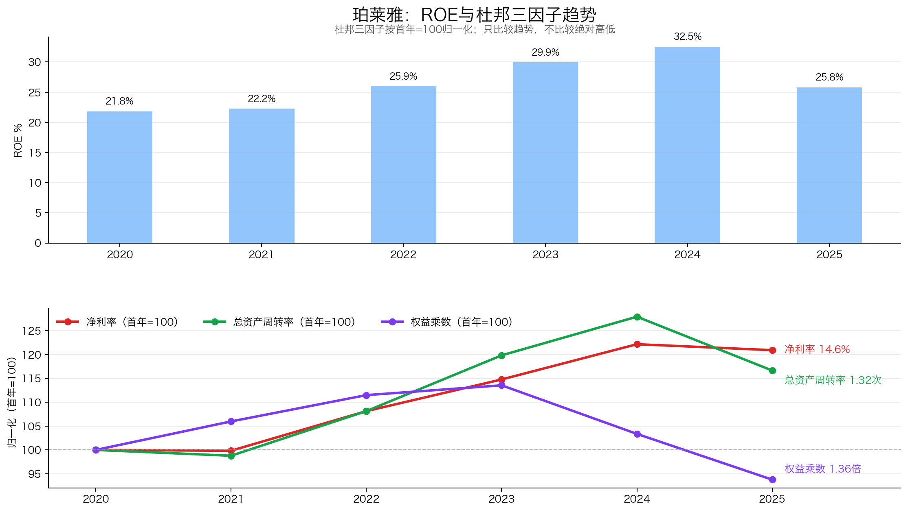
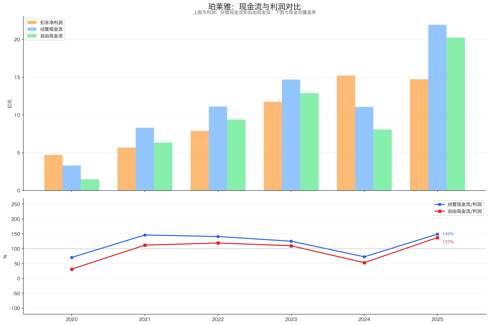
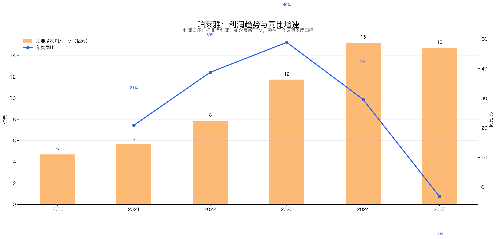
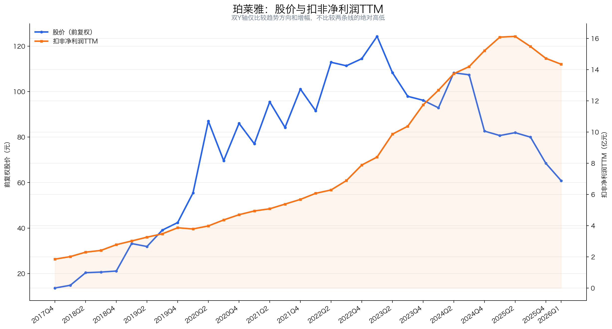

# 珀莱雅（603605）3R投资分析简报

> 数据截止：行情截至2026-07-17收盘；财务截至2026Q1；年度数据截至2025年报；重大公告截至2026-07-17。  
> 3R总分：**76.0/100**  
> 当前评级：**关注；估值与资产负债表已有吸引力，但主品牌和利润尚未企稳**  
> 一句话结论：**珀莱雅已验证可复制的品牌运营、轻资本、高ROE和长期现金创造能力，当前估值处历史低位且现金缓冲较厚；但主品牌与扣非利润仍下行，花知晓高溢价收购和潜在摊薄要求以“关注而非重仓”处理。**

## 一、公司概况：这家公司靠什么赚钱？

| 项目 | 内容 |
|---|---|
| 主营业务 | 功效护肤、彩妆、洗护等多品牌美妆业务 |
| 核心品牌 | 珀莱雅、彩棠、Off&Relax、悦芙媞等；拟控股花知晓 |
| 赚钱方式 | 消费洞察、研发与功效评价、爆品迭代、线上内容投放和多品牌运营 |
| 客户与场景 | 护肤、抗老、美白、修护、底妆和头皮护理消费者；线上渠道占95.58% |
| 行业位置 | 国货美妆上市公司中规模与盈利领先，主品牌占主营收入72.64% |
| 实际控制人 | 侯军呈、方爱琴夫妇 |
| 核心管理层 | 侯军呈任董事长，侯亚孟任总经理 |
| 报告基准日价格 | 56.73元，总市值224.64亿元 |

珀莱雅本质是一台美妆品牌运营机器：把需求变成产品，再通过线上内容、投放和渠道转化为销量。高毛利、轻资本与复购是优点；消费者切换品牌容易、平台流量昂贵、爆品生命周期有限，则要求公司不断重建护城河。

## 二、3R决策摘要

| 维度 | 得分 | 核心判断 |
|---|---:|---|
| Right Business | 48.5/60 | 品牌运营、轻资本、高回报和长期FCF较强，最新利润拐点限制上限 |
| Right People | 13.0/20 | 经营能力已验证，家族制衡、高溢价并购与潜在摊薄需折扣 |
| Right Price | 14.5/20 | 绝对与历史估值低、现金缓冲较厚，但保守与中性赔率不对称 |
| **总分** | **76.0/100** | **关注；三项门槛均通过且无重大红线** |

- **最大矛盾**：15倍左右PE、厚现金与高ROE对应的是主品牌收入下降10.39%、2026Q1扣非利润下降9.97%。
- **关键验证条件**：主品牌恢复，Off&Relax、彩棠等增量覆盖下降，销售费用率不再抬升，经营现金流恢复。
- **门槛判断**：Business 48.5≥36、People 13.0≥12、Price 14.5≥10，三项均通过且无重大红线；总分76.0对应“关注”，但利润未企稳，不等于仅凭低PE重仓。

## 三、Right Business：品牌运营能力已验证，增长引擎正处换挡期

### 3.1 评分概览

| 维度 | 得分 | 满分 | 核心判断 |
|---|---:|---:|---|
| 业务简单可持续、不易被替代 | 12.0 | 14 | 美妆品类需求长期存在；单品牌替代归入护城河，避免重复扣分 |
| 竞争格局清晰、护城河深厚、有定价权 | 13.0 | 18 | 组合能力较强，净定价权受平台和营销成本侵蚀 |
| 轻资本投入、高资产回报率、自由现金流好 | 13.0 | 14 | 轻资本、高ROE、低杠杆和长期强现金，Q1现金流需跟踪 |
| 盈利成长真实、稳定、可持续 | 5.5 | 8 | 历史增长强且现金匹配，2025与2026Q1转为下降 |
| 有长期增长空间 | 5.0 | 6 | 多品牌第二曲线已有收入验证，内生再投资质量较好 |
| **Right Business** | **48.5** | **60** | **好生意底色较强，最新增长拐点仍需修复** |

### 3.2 业务持续性：功效需求长期存在，品牌忠诚并非锁定

护肤、洁面和洗护具有较高复购，抗老、美白与修护需求长期存在；彩妆和高客单护肤受消费信心影响更明显。消费者切换品牌只需一次点击，成分趋势、达人推荐和平台促销都会改变选择。

| 具体指标 | 判断依据 | 得分 |
|---|---|---:|
| 商业模式是否简单、容易理解 | 研发、品牌、投放与线上销售链条清楚；投放效率细节待验证 | 4.5/5 |
| 需求是否长期存在 | 功效护肤与洗护需求长期存在 | 4.5/5 |
| 周期性是否可控 | 基础护肤弱周期，彩妆和高客单受消费信心影响 | 1.5/2 |
| 产品或品类替代风险 | 护肤、洁面、洗护等品类长期存在；品牌替代另计B7 | 1.5/2 |
| **小计** |  | **12.0/14** |

### 3.3 护城河与定价权：组织能力比单一配方重要

公司多次完成主品牌升级，并孵化彩棠与Off&Relax，说明消费者洞察、研发、快速开品和全域营销具有可复制性。2025年研发投入2.17亿元且全部费用化，品牌矩阵和净现金也支持试错。

但2025年主品牌收入下降10.39%，说明护城河需要持续投入维护。毛利率从2020年的63.55%升至73.26%，同时销售费用率升至49.63%、宣传推广费率44.03%；公司有毛利端品牌溢价，但扣除平台流量和营销成本后的净定价权弱于表象。

| 具体指标 | 判断依据 | 得分 |
|---|---|---:|
| 行业竞争格局 | 国际、成熟国货与新锐品牌竞争激烈 | 2.5/4 |
| 公司行业位置和市场份额 | 国货美妆上市龙头，细分份额未完整披露 | 2.5/3 |
| 护城河深度与持续性（含具体公司替代风险） | 洞察、研发、爆品和多品牌能力多次验证，但主品牌下滑说明需持续重建 | 4.5/6 |
| 定价权和成本传导能力 | 毛利端溢价较强，但营销与流量费用侵蚀净定价权 | 3.5/5 |
| **小计** |  | **13.0/18** |

### 3.4 资本回报与现金流：轻资本优势真实，并购将改变资产结构

2020—2024年加权ROE由21.82%升至32.53%，主要来自净利率和周转改善，不依赖持续加杠杆。2025年ROE降至25.80%，资产周转率由1.45降至1.32，增长效率已经下降。

2021—2025累计CFO为67.10亿元，高于累计归母利润56.36亿元；2025年FCF达20.24亿元。2025年林奇现金头寸42.57亿元，保守扣除受限资金后约31.30亿元。反面是2026Q1 CFO下降84.16%，拟控股花知晓预计新增约11亿元商誉，轻资产、低商誉画像可能改变。

| 具体指标 | 判断依据 | 得分 |
|---|---|---:|
| 资本投入强度与产能利用率 | 2025资本开支1.69亿元，远低于利润，核心品牌运营模式轻资本 | 4.0/4 |
| ROE/ROIC水平及历史趋势 | ROE仍高，2025周转与ROE回落 | 3.5/4 |
| 杠杆依赖与杜邦质量 | 权益乘数下降，不依赖高杠杆 | 2.0/2 |
| 经营现金流和自由现金流 | 2021—2025累计CFO高于利润且资本开支低；2026Q1骤降需跟踪 | 3.5/4 |
| **小计** |  | **13.0/14** |

### 3.5 盈利成长：历史复利强，当前利润线尚未止跌

2020—2025扣非利润5年CAGR为25.66%，2022—2025三年CAGR23.14%，历史兑现优秀；但2025年扣非利润下降3.23%，2026Q1再下降9.97%，扣非TTM降至14.35亿元，历史CAGR已经滞后。

2025年主品牌收入下降10.39%，彩棠仅增长5.37%；Off&Relax增长102.19%，但体量只有主品牌约十分之一。第二曲线尚未完全覆盖基本盘下滑，花知晓未来并表也必须与内生增长分开。

| 具体指标 | 判断依据 | 得分 |
|---|---|---:|
| 3年、5年利润增长 | 三年/五年扣非CAGR分别23.14%/25.66%，历史复利强 | 2.0/2 |
| 增长稳定性 | 2020—2024连续增长，2025转为下降，长期稳定性被打破 | 0.5/1 |
| 增长来源质量 | 洗护和新品牌增长真实，但尚未完全覆盖主品牌下滑 | 1.5/2 |
| 最新利润趋势 | 2026Q1扣非下降9.97%，TTM降至14.35亿元 | 0.5/2 |
| 利润与现金流匹配 | 长期匹配，Q1出现显著波动 | 1.0/1 |
| **小计** |  | **5.5/8** |

### 3.6 长期空间：多品牌路径存在，增长质量比并表规模重要

彩棠、Off&Relax、花知晓和海外布局覆盖彩妆、洗护与出海，能够降低单一护肤主品牌依赖。长期空间取决于第二品牌利润率、营销效率与并购ROIC，而不是并表后收入规模本身。

| 具体指标 | 判断依据 | 得分 |
|---|---|---:|
| 核心业务和行业空间 | 国内美妆仍增长，功效化长期存在 | 1.5/2 |
| 市场份额提升空间 | 组织和多品牌能力支持份额扩张，但当前兑现偏弱且份额数据缺失 | 1.5/2 |
| 地域扩张与第二曲线 | 洗护、彩妆、花知晓与海外提供多跑道 | 1.0/1 |
| 再投资回报及增长质量 | 历史内生模式轻资本、高ROE、强现金，第二品牌已有收入验证；收购风险归P3 | 1.0/1 |
| **小计** |  | **5.0/6** |

## 四、Right People：经营能力强，资本配置复杂度上升

| 维度 | 判断 | 决定性证据 | 得分 |
|---|---|---|---:|
| 诚信与治理 | 部分符合 | 审计标准；家族治理、二股东股份冻结需跟踪 | 4.0/6 |
| 专注与经营能力 | 较强 | 多次完成产品升级与品牌孵化，主品牌拐点检验接班团队 | 5.5/7 |
| 资本配置与股东利益 | 一般 | 分红合理；花知晓高溢价收购无对赌，H股存在摊薄 | 3.5/7 |
| **Right People** |  |  | **13.0/20** |

侯军呈团队的品牌运营与组织能力已经验证，2025财年分红率约52.4%，员工持股受让价高于报告基准日股价。主要扣分来自预计11亿元新增商誉、无业绩对赌的高溢价收购，以及H股发行的不确定摊薄。

## 五、Right Price：低估值提供下限，经营下滑限制上行

| 维度 | 判断 | 决定性证据 | 得分 |
|---|---|---|---:|
| 利润位置与股价利润匹配度 | 一般 | 估值已显著压缩，但扣非TTM与主品牌仍未止跌 | 3.5/5 |
| 当前估值与历史位置 | 有吸引力 | PE 15.24倍、上市以来约1%分位、扣现金后估值更低 | 5.5/6 |
| 股息及持有回报 | 尚可 | 静态股息率3.53%，分红率约52.4% | 2.0/3 |
| 保守/中性情景与赔率 | 一般 | 独立保守情景约-25.3%，独立中性情景约+3.3% | 3.5/6 |
| **Right Price** |  |  | **14.5/20** |

2025年及2026Q1扣非利润连续下降，扣非TTM降至14.35亿元；与此同时估值压缩至15倍附近，价格已反映较悲观预期，但利润尚未企稳，股价与利润只能评价为部分匹配。

| 估值指标 | 报告基准日 |
|---|---:|
| 收盘价 / 市值 | 56.73元 / 224.64亿元 |
| 扣非PE-TTM | 15.66倍 |
| 上市以来PE分位 | 约1.0% |
| 2025林奇现金头寸 | 42.57亿元 |
| 保守扣现金后扣非PE | 约13.48倍 |
| 静态股息率 | 约3.53% |

| 独立情景 | 扣非利润假设 | PE | 对应股价 | 相对56.73元 |
|---|---:|---:|---:|---:|
| 保守 | 12.915亿元 | 13倍 | 42.39元 | -25.3% |
| 中性 | 14.50亿元 | 16倍 | 58.58元 | +3.3% |

以上为最终V4裁决采用的独立保守/中性情景，不沿用完整报告旧情景。18倍中性PE虽可产生约20%上行，但在主品牌及利润尚未企稳时偏积极，故未采用；当前赔率由现金和股息缓冲，但仍呈保守下行大于中性上行。

## 六、最终行动

### 现在怎么办？
- 提升至关注清单并分批、小仓跟踪；76.0分达到“关注”，但利润未企稳，不因历史低PE分位直接重仓。

### 什么情况下提高关注？
- 主品牌恢复正增长，扣非利润和CFO连续两个报告期改善；
- Off&Relax、彩棠等增量覆盖主品牌下降，销售费用率不再抬升；
- 花知晓交割后ROIC和内生增长透明，H股摊薄可控。

### 什么情况下说明判断错了？
- 主品牌持续双位数下降且新品无法修复护肤基本盘；
- 第二品牌增量不足、销售费用率继续上升；
- 花知晓形成大额减值或净现金持续被低回报并购消耗。

## 七、数据边界

- **事实与图表范围**：公司事实来自盲评事实包；本简报仅在最终锁分后回看并复用完整报告`珀莱雅_投资分析报告_2026-07-17.md`中的财务、治理、估值基础数据与原有四张图，未复用其评分、评级、结论、行动建议或Right Price旧情景。
- **盲评与隔离**：评分阶段严格屏蔽原报告模块分、子项分、总分、评级、方向性总结、胜率赔率、毛估估/旧估值情景、投资结论、行动建议及旧3R/README分数；由**3名隔离评估器**仅基于脱敏事实包独立评固定28项。
- **初始锁分**：B1—B21、P1—P3、V1—V4逐项取三名评估器中位数，再逐级加总，形成查看任何旧评分前的初始锁分：Business 47.5、People 13.0、Price 15.0、总分75.5、评级关注。
- **系统性复核调整**：在查看旧分前复核重复计分、长短期错位、行业风险叠加、优势重复奖励及证据折扣。B4由1.0调至1.5，因品牌替代已在B7评价；B21由0.5调至1.0，因拟收购风险集中留在P3，B21评价历史内生再投资；V4由4.0调至3.5，因保守约-25.3%、16倍中性仅约+3.3%，上下行不对称。净总分上调0.5。
- **最终锁分**：系统性复核后最终锁定Business 48.5、People 13.0、Price 14.5、总分76.0、评级关注；最终锁分完成后才允许查看旧评分，**未为接近原报告或旧3R分数回调**。
- **行情口径**：沿用2026-07-17收盘数据，本文称“报告基准日价格”。
- **本地补充**：无；完整报告和公告底稿已覆盖主要证据。
- **外部补充**：无；未刷新行情、交割或H股进展。
- **未验证事项**：2026Q1分品牌数据、全品牌复购率、花知晓最终商誉与整合回报、H股发行规模和摊薄。
- **锁分后差异说明**：完整报告74.5/100、旧3R为73.0/100；最终盲评为76.0/100。差异来自固定3R权重、系统性复核调整及独立V4情景，不是向旧分靠拢。

---

*本简报仅供学习研究，不构成投资建议。*
