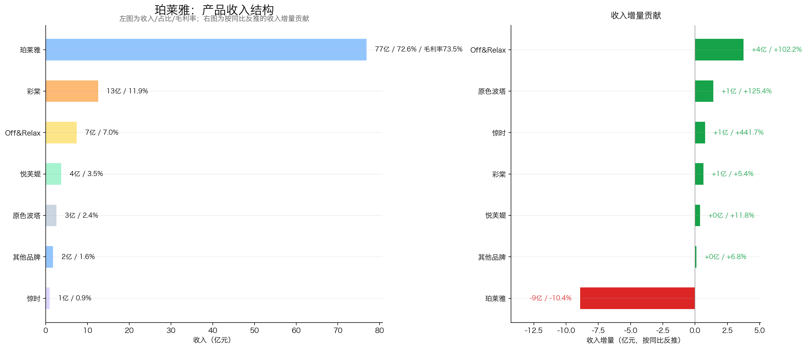
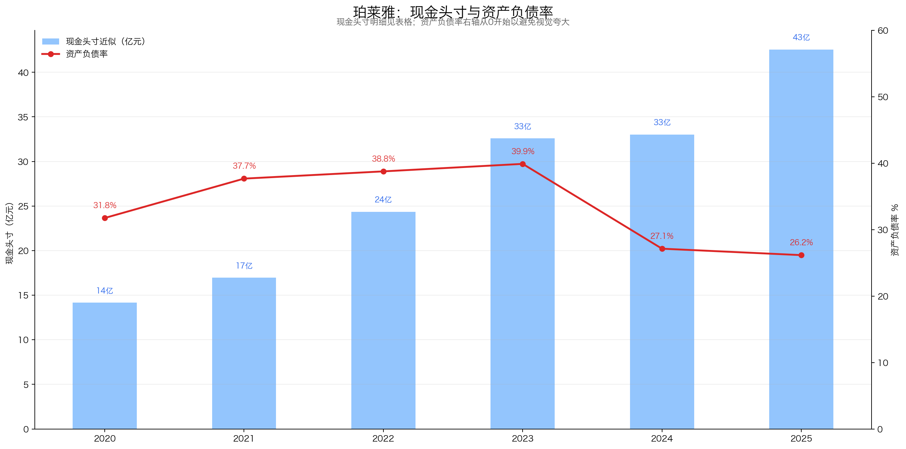
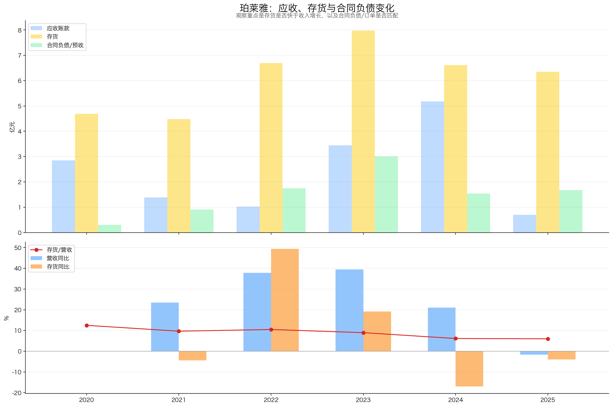
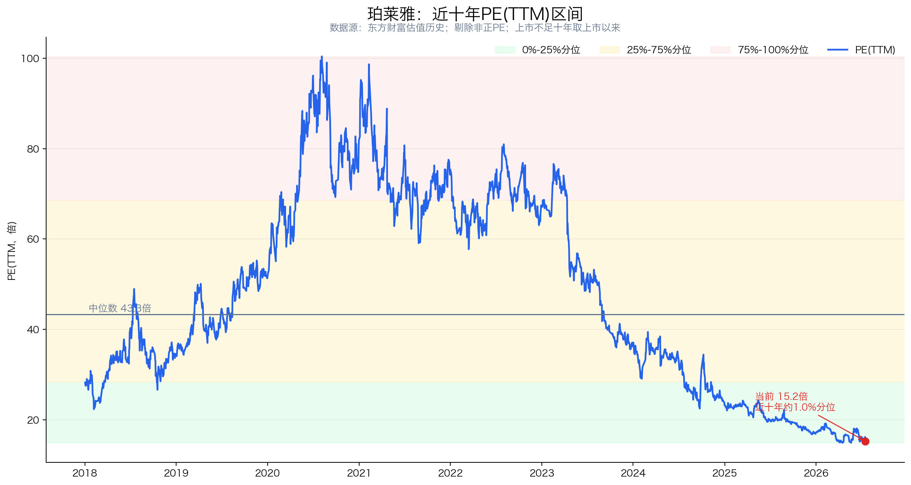

# 珀莱雅（603605）投资分析报告

> 数据截止：行情截至 2026-07-17 收盘；财务截至 2026Q1；年度数据截至 2025 年报；重大公告截至 2026-07-17。  
> 结论：**关注（74.5/100）**。珀莱雅已经证明自己能把消费者洞察、功效产品开发和线上营销转化为品牌资产与现金流，但 2025 年主品牌收入下降、2026Q1 收入和利润继续下滑，说明过去的高速增长阶段已经结束。当前 15 倍左右 PE、厚现金和回购提供了下限，真正决定上限的是主品牌能否恢复，以及 Off&Relax、彩棠、花知晓等能否在不继续抬高营销费用率的前提下接棒；拟控股花知晓预计新增约11亿元商誉，是不能被低PE掩盖的重大风险。

## 先说结论：这是一门什么生意？

珀莱雅不是一家单纯“生产面霜”的工厂，更像一台国产美妆品牌运营机器：

1. 找到抗老、美白、修护、底妆、头皮护理等需求；
2. 用研发、配方、功效评价和快速开品把需求变成产品；
3. 用天猫、抖音、京东、小红书等平台完成种草、投放和销售；
4. 用珀莱雅主品牌产生利润，再孵化彩棠、Off&Relax、悦芙媞等第二曲线；
5. 通过高毛利和轻资本模式，把利润转成现金。

这门生意的优点是高毛利、高复购、资本开支不重；缺点是消费者换品牌很容易、流量平台议价权强、爆品生命周期有限，营销投入稍有失效就会同时影响收入和利润。

| 核心指标 | 当前值 | 怎么理解 |
|---|---:|---|
| 股价 | 56.73 元 | 2026-07-17 收盘，尚未实施2025年度末期分红除息 |
| 总市值 | 224.64 亿元 | 东方财富总市值口径 |
| PE(TTM) | 15.24 倍 | 东方财富归母口径 |
| 扣非 PE(TTM) | 15.66 倍 | 2026Q1扣非TTM 14.35亿元 |
| 近十年 PE 分位 | 约 1.0% | 上市不足十年，取上市以来可用区间；极低分位对应增长降档 |
| 2025财年每股分红 | 2.00 元 | 半年度0.80元已实施；年度1.20元将于2026-07-22发放 |
| 2025财年静态股息率 | 约 3.53% | 以56.73元计算；不是未来承诺收益率 |
| 2025 加权 ROE | 25.80% | 从2024年的32.53%回落，仍处较高水平 |
| 2025 林奇现金头寸 | 42.57 亿元 | 货币资金50.61亿元减可转债8.04亿元 |

## 一、公司画像、能力圈与红线

**初筛结论：谨慎通过。**

- 公司画像：国产功效护肤和美妆集团，2025年主营收入105.85亿元；珀莱雅主品牌占72.64%，线上渠道占95.58%。
- 能力圈：商业模式容易理解；难点在于广告投放效率、平台流量规则、爆品生命周期和品牌资产能否跨周期沉淀。
- 控制与管理：侯军呈、方爱琴夫妇为控股股东及实际控制人；侯军呈任董事长，侯亚孟任总经理。2025年末侯军呈持股34.53%。
- 审计：2025年报为标准无保留意见，无商誉存量，未触发财务审计一票否决红线。
- 治理观察：第二大股东方玉友持股15.06%，其中1,704.13万股处于冻结状态，约占其持股28.58%；控制权不依赖该部分股份，但应继续观察司法冻结变化。
- 经营红线：2025年营收、归母利润、扣非利润分别下降1.68%、3.50%、3.23%；2026Q1又分别下降2.29%、6.05%、9.97%，增长降档已经连续两个报告期出现。
- 资本配置红线：公司拟取得花知晓51%控制权，监管工作函回复披露预计新增约11亿元商誉，约为2025年末总资产的13%；同时推进H股上市，可能带来股本摊薄。两项动作都可能改变当前“资产负债表很轻”的结论。

后续必须验证：

1. 珀莱雅主品牌能否恢复正增长，而不是只靠降价和加大投放；
2. 第二品牌的增长能否真正覆盖主品牌下降，并维持合理利润率；
3. 2026Q1经营现金流大幅下降是投放、备货和应收节奏，还是现金转化能力开始恶化。

## 二、好行业：需求长期存在，但不是天然躺赢的赛道

### 2.1 需求质量

化妆品兼具消费品和可选消费属性。护肤、洁面和洗护有较高复购，抗老、美白、修护等功效需求长期存在；但彩妆、礼赠和高客单护肤会受居民收入和消费信心影响。

国家统计局数据显示，2025年限额以上单位化妆品类零售额4,653亿元，同比增长5.1%，高于社会消费品零售总额3.7%的增速。行业仍在增长，但珀莱雅当年收入下降1.68%，说明公司面临的已不是“行业自然抬轿”，而是品牌份额和产品周期问题。

### 2.2 竞争格局

中国美妆市场品牌众多，国际集团、成熟国货、新锐品牌和白牌共同竞争。珀莱雅在国货美妆上市公司中规模和盈利领先，但同行估值分化很大。

| 公司 | 2026-07-17市值 | PE(TTM) | 定位 |
|---|---:|---:|---|
| 珀莱雅 | 224.64亿元 | 15.24 | 功效护肤、多品牌美妆 |
| 华熙生物 | 174.32亿元 | 68.41 | 生物活性物、护肤 |
| 贝泰妮 | 133.73亿元 | 24.61 | 敏感肌护肤 |
| 上海家化 | 118.38亿元 | 43.43 | 综合日化 |
| 丸美生物 | 116.65亿元 | 54.71 | 眼部护理、彩妆 |

注：均为东方财富同日A股行情口径。同行PE较高不代表珀莱雅必然低估，部分公司的当期利润处于低位，PE可比性有限。

竞争的关键不是工厂产能，而是五件事：消费者洞察、功效研发、爆品迭代、内容营销和全渠道转化。领先者可以靠规模摊薄研发和品牌建设成本，但也必须持续投入，护城河需要不断重建。

### 2.3 壁垒与议价权

珀莱雅的壁垒来自组合能力：

- 产品：双抗、红宝石、能量、源力等系列建立了功效认知和复购基础；
- 品牌：主品牌覆盖多个高需求功效赛道，彩棠、Off&Relax扩展彩妆和洗护；
- 研发：2025年研发投入2.17亿元、研发人员334人，且全部费用化；
- 组织：从洞察、研发、开品到全域营销形成较快闭环；
- 现金：净现金充足，可以承受新品试错和流量波动。

但其议价权并不完整。2025年线上渠道占95.58%，其中线上直营占77.39%；平台流量成本、达人佣金和广告竞价会侵蚀利润。公司毛利率高达73.26%，销售费用率也达到49.63%，其中形象宣传推广费率44.03%。这说明消费者愿意为品牌付费，同时也说明品牌仍需用高额投放维持注意力。

### 2.4 替代风险

消费者对护肤功效有持续需求，但对单一品牌的转换成本很低。新品、成分趋势、达人推荐和平台大促都可能改变购买选择。珀莱雅真正要守住的不是某个配方，而是持续推出有效产品并沉淀品牌信任的能力。

**好行业评分：14.0/20**

| 子项 | 得分 | 满分 |
|---|---:|---:|
| 需求质量/非周期性 | 4.5 | 6 |
| 竞争格局 | 2.5 | 4 |
| 进入壁垒 | 3.0 | 4 |
| 上下游议价权 | 2.0 | 3 |
| 替代品威胁 | 2.0 | 3 |
| 小计 | **14.0** | **20** |

## 三、好公司·定性：强在组织和品牌运营，不是不可复制的产品专利

### 3.1 护城河

珀莱雅最重要的资产是“可重复的品牌运营方法”，而不是某一个爆品。公司曾用双抗和红宝石系列完成主品牌升级，又把彩棠做成彩妆品牌，把Off&Relax做成头皮护理品牌。多次成功比单次爆品更能证明组织能力。

不过，2025年珀莱雅主品牌收入下降10.39%，说明这套方法并非永远有效。大单品进入成熟期后，只有新品和新品类接得上，品牌资产才会继续增值。

### 3.2 复购与粘性

护肤和洗护天然具有复购属性，功效体验、肤感和品牌信任会提高留存率。主品牌在天猫面霜、面膜品类保持领先，也表明其并非纯流量白牌。

但消费者没有合同锁定，品牌切换只需一次点击。复购是珀莱雅的重要优势，却不是强网络效应。报告中未披露全品牌复购率、会员留存率等统一指标，因此不能把“品类高复购”直接等同于“珀莱雅客户高粘性”。

### 3.3 定价权

2020—2025年毛利率从63.55%升至73.26%，说明产品升级、供应链降本和品牌溢价有效。主品牌部分功效产品具备一定定价权。

但2025年销售费用率升至49.63%，净利率仍停留在14.56%左右。更准确的说法是：公司具有“毛利端定价权”，但要扣除流量和营销成本后看净定价权。若提价必须配合更多投放，股东最终获得的定价权会弱于毛利率表象。

### 3.4 管理层与资本配置

正面因素：

- 实控人侯军呈长期任董事长，经营管理层稳定；2024年9月由侯亚孟出任总经理，完成了经营职责交接；
- 2025财年半年度和年度现金分红合计约7.85亿元，占归母净利润约52.4%；
- 2026年回购股份用于员工持股计划，回购价格明显高于当前股价，客观上提供了一定市场信号；
- 2026年员工持股计划覆盖不超过124人、股票不超过114.90万股，受让价60.90元/股，高于2026-07-17收盘价；董事及高管考核要求2026年收入或归母利润增长不低于5%。

需要扣分：

- 董事长侯军呈与总经理侯亚孟为父子，控制权和经营权家族色彩较强，接班效果、关键岗位制衡及关联交易需要长期验证；
- 员工持股计划对非董高参与人原则上可不适用公司业绩考核，激励约束并不完全一致；
- 花知晓全部股权评估值28.27亿元，较账面净资产增值595.76%，约为其2025年净利润的10.1倍；交易无业绩对赌，预计新增约11亿元商誉，约相当于珀莱雅2025年末总资产13%、股东权益17.6%；
- H股发行仍需监管批准，具体发行规模和摊薄影响尚未确定；
- 第二大股东方玉友部分股份冻结是需要持续披露跟踪的治理事项。

**好公司·定性评分：15.0/20**

| 子项 | 得分 | 满分 |
|---|---:|---:|
| 护城河 | 5.5 | 7 |
| 复购/粘性/低替代性 | 4.0 | 5 |
| 定价权 | 3.5 | 5 |
| 管理层 | 2.0 | 3 |
| 小计 | **15.0** | **20** |

## 四、好公司·定量：高ROE、高现金流，但增长拐点已经出现

### 4.1 ROE质量与盈利模式


| 年份 | 加权ROE | 销售净利率 | 总资产周转率 | 权益乘数 |
|---:|---:|---:|---:|---:|
| 2020 | 21.82% | 12.04% | 1.13 | 1.45 |
| 2021 | 22.25% | 12.02% | 1.12 | 1.54 |
| 2022 | 25.95% | 13.02% | 1.23 | 1.62 |
| 2023 | 29.94% | 13.82% | 1.36 | 1.65 |
| 2024 | 32.53% | 14.71% | 1.45 | 1.50 |
| 2025 | 25.80% | 14.56% | 1.32 | 1.36 |

注：ROE为同花顺加权口径；杜邦三因子按平均资产、平均权益和营业收入近似拆解，主要看趋势。

2020—2024年ROE上升主要来自净利率和资产周转率改善，权益乘数没有持续上升，这是健康的增长模式。2025年ROE回落，则是收入下降、资产扩张导致周转率回落，同时公司继续去杠杆。坏消息是增长效率下降，好消息是并非靠加杠杆维持ROE。

### 4.2 利润增长与持续性


| 年份/期间 | 营收（亿元） | 归母净利润（亿元） | 扣非净利润（亿元） | 扣非同比 |
|---|---:|---:|---:|---:|
| 2020 | 37.52 | 4.76 | 4.70 | 21.69% |
| 2021 | 46.33 | 5.76 | 5.68 | 20.89% |
| 2022 | 63.85 | 8.17 | 7.89 | 38.80% |
| 2023 | 89.05 | 11.94 | 11.74 | 48.91% |
| 2024 | 107.78 | 15.52 | 15.22 | 29.60% |
| 2025 | 105.97 | 14.98 | 14.73 | -3.23% |
| 2026Q1 | 23.05 | 3.67 | 3.41 | -9.97% |

- 2020→2025营收5年CAGR为23.08%，扣非利润5年CAGR为25.66%，历史复利很强。
- 2022→2025扣非利润3年CAGR为23.14%，但该指标仍被2023—2024年的高速增长抬高。
- 2026Q1扣非TTM降至14.35亿元，同比和环比趋势均转弱，历史CAGR不能直接外推。
- 2025年毛利率提升1.87个百分点，仍未阻止利润下降，原因之一是销售费用率继续上升。

结论：公司已经从“高速增长验证期”进入“主品牌再加速与第二曲线接棒验证期”。当前利润不差，但增长持续性需要重新证明。

### 4.3 产品结构与增长来源



| 2025年品牌 | 收入（亿元） | 主营占比 | 同比 | 主要判断 |
|---|---:|---:|---:|---|
| 珀莱雅 | 76.89 | 72.64% | -10.39% | 最大基本盘，也是最大拖累 |
| 彩棠 | 12.55 | 11.86% | 5.37% | 彩妆第二品牌，增速放缓 |
| Off&Relax | 7.44 | 7.03% | 102.19% | 最重要的新增长曲线 |
| 悦芙媞 | 3.71 | 3.50% | 11.80% | 规模仍小 |
| 原色波塔 | 2.56 | 2.42% | 125.38% | 高增但基数低 |
| 惊时 | 0.96 | 0.91% | 441.66% | 极低基数，不宜外推 |
| 其他品牌 | 1.74 | 1.64% | 6.77% | 尾部业务 |

按品类看，护肤类收入81.82亿元、同比下降9.28%；彩妆15.63亿元、增长14.86%；洗护8.40亿元、增长117.85%。增长来源已经很清楚：主品牌和护肤基本盘下降，洗护及新品牌接棒。

2026年拟控股的花知晓2025年收入17.26亿元、净利润2.80亿元，体量已经超过彩棠。若交易完成，它会显著提高彩妆和海外业务占比，但并表增长不等于内生增长，报告期之间要单独拆分；预计新增约11亿元商誉也意味着，第二曲线一旦不及预期，会直接损伤资产质量和利润。

### 4.4 现金流质量


| 年份 | 归母净利润 | 经营现金流 | 资本开支 | 自由现金流 | CFO/归母净利润 |
|---:|---:|---:|---:|---:|---:|
| 2020 | 4.76 | 3.32 | 1.84 | 1.47 | 0.70 |
| 2021 | 5.76 | 8.30 | 1.94 | 6.36 | 1.44 |
| 2022 | 8.17 | 11.11 | 1.71 | 9.40 | 1.36 |
| 2023 | 11.94 | 14.69 | 1.80 | 12.89 | 1.23 |
| 2024 | 15.52 | 11.07 | 3.00 | 8.07 | 0.71 |
| 2025 | 14.98 | 21.93 | 1.69 | 20.24 | 1.46 |

自由现金流采用“经营现金流－购建长期资产现金支出”的简化口径。

2021—2025累计经营现金流67.10亿元，明显高于累计归母净利润56.36亿元，利润总体能变成现金。2025年现金流异常强，部分来自应收回落和营运资金释放；不能把单年1.46倍现金转化率机械外推。

2026Q1经营现金流仅1.07亿元，同比下降84.16%，同时应收账款从年末0.70亿元升至3.15亿元。美妆业务存在大促、投放和平台结算节奏，单季不足以定性，但已构成必须跟踪的风险信号。

### 4.5 现金头寸与资产负债表安全性



| 年份 | 货币资金 | 交易性金融资产 | 长期借款 | 应付债券 | 林奇现金头寸 | 资产负债率 |
|---:|---:|---:|---:|---:|---:|---:|
| 2020 | 14.17 | 0.00 | 0.00 | 0.00 | 14.17 | 31.76% |
| 2021 | 23.91 | 0.00 | 0.00 | 6.96 | 16.95 | 37.69% |
| 2022 | 31.61 | 0.00 | 0.00 | 7.24 | 24.37 | 38.78% |
| 2023 | 40.11 | 0.00 | 0.00 | 7.53 | 32.58 | 39.91% |
| 2024 | 40.82 | 0.00 | 0.00 | 7.80 | 33.02 | 27.14% |
| 2025 | 50.61 | 0.00 | 0.00 | 8.04 | 42.57 | 26.17% |

2025年林奇现金头寸公式：

```text
货币资金50.61亿元
+ 交易性金融资产0
- 长期借款0
- 应付债券8.04亿元
= 林奇现金头寸42.57亿元
```

每股现金头寸约10.75元，扣现金后扣非PE约12.69倍。但这不是“可立即分给股东的现金”：2025年末货币资金中有11.19亿元大额存单不能随时支取，另有保证金和司法冻结等，受限货币资金合计11.27亿元。扣除受限资金后，保守可用现金头寸约31.30亿元、每股约7.90元，扣现金后扣非PE约13.48倍。

2026Q1货币资金47.51亿元、交易性金融资产3.24亿元、应付债券8.13亿元，林奇现金头寸约42.61亿元，安全垫基本稳定。花知晓收购不仅消耗3.51亿元新增股权对价，还预计形成约11亿元商誉；H股发行、回购和分红也会改变后续现金结构，不能只看2025年末静态值。

### 4.6 营运质量



| 年份 | 应收账款 | 存货 | 合同负债 | 存货/营收 |
|---:|---:|---:|---:|---:|
| 2020 | 2.85 | 4.69 | 0.31 | 12.49% |
| 2021 | 1.39 | 4.48 | 0.91 | 9.67% |
| 2022 | 1.02 | 6.69 | 1.75 | 10.48% |
| 2023 | 3.45 | 7.97 | 3.01 | 8.95% |
| 2024 | 5.18 | 6.61 | 1.54 | 6.14% |
| 2025 | 0.70 | 6.35 | 1.67 | 5.99% |

存货/营收连续下降、存货周转天数从2022年的103.91天下降到2025年的82.34天，说明库存管理改善，没有明显压货迹象。2025年应收大幅下降主要因应收京东款项减少；2026Q1应收重新升至3.15亿元，应结合618前备货和平台结算继续观察。

合同负债规模较小，且2024年明显回落，不能像白酒预收款那样作为强订单指标。公司以线上直营为主，营运判断应更关注平台应收、存货周转和投放回款效率。

**好公司·定量评分：31.5/40**

| 子项 | 得分 | 满分 | 核心扣分原因 |
|---|---:|---:|---|
| ROE质量与盈利模式 | 7.5 | 9 | ROE仍高，但2025年周转率和ROE回落 |
| 利润增长来源与持续性 | 5.0 | 7 | 2025及2026Q1连续下降 |
| 现金流质量 | 6.5 | 7 | 长期优秀，2026Q1波动需观察 |
| 现金头寸与资产负债表安全性 | 5.0 | 6 | 净现金厚，但资金受限且并购预计新增约11亿元商誉 |
| 营运质量 | 4.5 | 5 | 库存改善，Q1应收和现金流需观察 |
| 产品结构与增长来源 | 3.0 | 6 | 主品牌占比高且下滑，第二曲线尚未完全接棒 |
| 小计 | **31.5** | **40** |  |

## 五、好时机：估值很低，但低估值正对应增长降档

### 5.1 股价与利润线


这张图只比较趋势和增幅，不比较两条线的绝对位置。

2018—2024年，股价和扣非TTM利润长期同向上升；2021年前后股价先于利润透支，随后经历长期估值消化。2025年以来，扣非TTM从约16.1亿元降至14.35亿元，股价跌幅更大，说明当前低估值既包含估值泡沫出清，也包含市场对主品牌失速的担忧。

结论不是“股价跌得多就一定便宜”，而是：估值已经给出较大折价，但利润线尚未止跌，右侧确认不足。

### 5.2 PE及近十年分位



| 指标 | 当前/历史值 |
|---|---:|
| 当前PE(TTM) | 15.24倍 |
| 扣非PE(TTM) | 15.66倍 |
| 近十年/上市以来分位 | 约1.0% |
| 样本中位数 | 43.30倍 |
| 25%分位 | 28.34倍 |
| 10%分位 | 19.64倍 |

当前PE处于上市以来极低区间，估值安全垫明显增强。但历史中位数对应的是收入和利润20%—40%增长阶段，不能直接把43倍当作“合理价值”。当增长降至零附近甚至负增长时，15倍PE并非不可理解。

### 5.3 PEG

用当前扣非PE 15.66倍除以2022→2025扣非利润3年CAGR 23.14%，历史PEG约0.68。表面上较低，但过去三年增长集中在2023—2024年，2025及2026Q1已转负，因此该PEG存在明显滞后，只能作为历史参考，不能支持“当前低估”的独立结论。

### 5.4 股息、回购与预期差

2025财年每股合计分红2.00元，对应静态股息率约3.53%，分红率约52.4%。其中0.80元半年度分红已于2025年实施，1.20元年度分红将在2026-07-22发放。

回购和员工持股计划形成一定正面信号：员工受让价60.90元高于当前56.73元。但回购股份用于激励而非注销，不能等同于直接提高每股价值；H股发行还可能带来反向摊薄。

市场主要预期差有两种：

- 正向：主品牌在低基数下恢复，Off&Relax继续高增，花知晓并表后彩妆和海外业务扩张；
- 负向：主品牌继续下降，第二品牌增长依赖更高投放，花知晓并表掩盖内生停滞并形成商誉风险。

### 5.5 毛估估：便宜，但赔率取决于增长恢复

以下不是盈利预测，只是用当前扣非TTM 14.35亿元做一年的压力测试；净利润已经包含现金利息，因此不再额外加回现金，避免重复计算。

| 情景 | 利润变化 | PE | 对应股价 | 相对56.73元 |
|---|---:|---:|---:|---:|
| 压力档 | -5% | 12倍 | 41.31元 | -27.2% |
| 中性档 | 0% | 15倍 | 54.35元 | -4.2% |
| 改善档 | +5% | 18倍 | 68.48元 | +20.7% |
| 较强修复档 | +10% | 20倍 | 79.71元 | +40.5% |

当前价格已经接近“利润不增长、15倍PE”的中性估值。要获得明显上行，不仅需要低PE修复，还需要利润重新增长；若利润继续下降，低估值本身不能阻止股价下行。

**好时机评分：14.0/20**

| 子项 | 得分 | 满分 |
|---|---:|---:|
| 股价 vs 利润线 | 3.5 | 5 |
| PE及PE百分位 | 4.5 | 5 |
| PEG | 0.5 | 2 |
| 股息率 | 2.0 | 3 |
| 市场信号与预期差 | 1.5 | 2 |
| 毛估估 | 2.0 | 3 |
| 小计 | **14.0** | **20** |

## 六、投资结论：值不值得下注，拿不拿得住？

### 6.1 商业模式好不好（Right Business）

#### 6.1.1 业务简单可持续、不易被替代

美妆需求长期存在、业务容易理解，但消费者尝新意愿强，单一品牌和产品并不难被替代。珀莱雅通过持续研发、功效产品和多品牌运营降低单品风险，商业模式可持续，但需要长期维持新品和营销效率。

#### 6.1.2 竞争格局清晰、护城河深厚、有定价权

珀莱雅部分符合。行业竞争激烈且国际、国内品牌众多，公司已形成消费者洞察、线上运营、产品开发和品牌矩阵能力；但2025年主品牌首次明显下降，说明护城河并非不可动摇，定价权也必须由销量、复购和利润共同验证。

#### 6.1.3 轻资本投入、高资产回报率、自由现金流好

公司生产端相对轻资本，ROE和经营现金流质量较高，现金安全垫较厚；但品牌增长依赖持续营销投入，拟控股花知晓预计新增约11亿元商誉，未来资本回报将更多取决于并购整合和品牌投放效率。

#### 6.1.4 有长期增长空间

彩棠、Off&Relax、花知晓及海外布局提供第二曲线，但2026Q1收入和利润继续下降。长期空间存在，能否兑现取决于主品牌恢复、第二梯队接棒，以及销售费用率不再持续抬升。

### 6.2 管理层怎么样（Right People）：品牌运营能力已验证，并购纪律待观察

管理层过去多年在产品、营销和多品牌孵化上执行力突出，分红、回购和员工持股也体现股东与团队绑定；但花知晓收购、H股发行及新增商誉提高了资本配置复杂度，不能仅以历史成功推定新并购必然成功。

### 6.3 是不是好价格（Right Price）：不贵，但增长拐点尚未出现

当前约15.2倍PE，处于上市以来低位，现金头寸和回购提供一定下限；但低估值对应主品牌、扣非利润和现金流仍在承压。真正有利的买点是经营指标重新同向改善，而不是PE单独再降一点。

### 6.4 胜率与赔率

珀莱雅的胜率来自已经验证的品牌运营能力、高ROE、强现金流和净现金；当前赔率来自15倍左右PE和上市以来约1%估值分位。最大不确定性是主品牌与利润何时止跌、第二曲线能否在不过度增加营销费用的情况下接棒，以及花知晓约11亿元商誉是否会变成未来减值压力。综合得分**74.5/100，评级“关注”**：公司质量值得跟踪，但现阶段更像“低估值等待增长验证”，而不是确定性高增长买点。

### 6.5 长期持有检查项

长期持有需要重点验证：

- 主品牌恢复正增长、扣非利润和经营现金流连续两个报告期改善后，才具备提高仓位的依据；
- 若并表后内生收入仍下降、销售费用率继续上升或商誉风险扩大，不应因股价下跌机械补仓。

### 6.6 评级与行动

**最终判断：珀莱雅仍是品牌运营能力较强、资本回报和现金流较好的公司，但品牌替代风险与增长降速已上升；当前价格有吸引力，评级为“关注”，仍应等待主品牌和利润止跌验证。**

当前行动：

- 当前适合纳入观察池或小仓位跟踪，不宜仅因历史PE分位低就重仓；

## 七、投资逻辑与证伪条件

### 投资逻辑

1. **品牌运营能力持续变现**：珀莱雅已经多次完成大单品升级和品牌孵化，若主品牌恢复、洗护和彩妆接棒，品牌资产仍可复利。
2. **多品牌结构降低单一产品周期风险**：Off&Relax、彩棠及拟控股的花知晓有望把公司从单一护肤主品牌升级为多品类集团。
3. **现金流和低估值提供下限**：净现金厚、自由现金流长期好、分红和回购持续，15倍左右PE降低了对高增长的依赖。

### 证伪条件

以下任一情况持续两个报告期，应重新评估：

1. **主品牌与核心产品继续失速**：珀莱雅主品牌持续双位数下降，且新品无法改善护肤基本盘；
2. **第二曲线无法接棒**：Off&Relax、彩棠、花知晓等增长放缓，合计增量仍无法覆盖主品牌下降；
3. **经营质量恶化**：销售费用率继续上升，同时扣非利润、经营现金流和存货周转同步变差；
4. **资本配置失去安全边际**：花知晓形成大额商誉减值、H股发行明显摊薄，或净现金被低回报并购持续消耗。

---

## 八、维度打分汇总

| 模块 | 得分 | 满分 |
|---|---:|---:|
| 好行业 | 14.0 | 20 |
| 好公司·定性 | 15.0 | 20 |
| 好公司·定量 | 31.5 | 40 |
| 好时机 | 14.0 | 20 |
| **总分** | **74.5** | **100** |

好公司（定性+定量）合计：**46.5/60**。

评级映射：70—80分为“关注”。本报告未因低PE额外抬高评级，也未使用券商盈利预测。

---

## 九、数据校验结果

### 正确 ✅

1. 2020—2025营收、归母净利润、扣非净利润：同花顺年度表与东方财富API一致，并以连续年报复核；
2. 2026Q1营收23.05亿元、归母净利润3.67亿元、扣非净利润3.41亿元、经营现金流1.07亿元：与官方季报一致；
3. CAGR年数：2020→2025按5年，2022→2025按3年计算；
4. 毛利率、销售净利率、加权ROE：采用同花顺年度指标，趋势与年报披露一致；
5. 经营现金流、资本开支和自由现金流：2020—2025连续年度数据完整；
6. 现金头寸：逐年核对年报合并资产负债表；交易性金融资产空白按0处理，应付债券按年末账面余额扣除；
7. 2025受限资金：11.19亿元大额存单及其他保证金/冻结资金合计11.27亿元，已确认包含在货币资金中，未重复加计；
8. 产品结构：2025品牌、品类和渠道收入均取自年报，品牌收入合计与主营收入105.85亿元一致；
9. 季度拆分：同花顺单季度数据2025四季度加总等于全年扣非净利润14.73亿元；
10. 行情与估值：股价56.73元、市值224.64亿元、PE15.24倍为2026-07-17收盘数据；
11. 图表：第四章6张图、股价利润主图及PE区间图均已生成，链接真实存在；
12. 评分：14.0+15.0+31.5+14.0=74.5，定量子项合计31.5，评级与分数档位一致。

### 需持续更新 ⚠️

1. 花知晓收购仍需经营者集中审查并完成交割；公司预估新增约11亿元商誉，最终金额需以购买日可辨认净资产评估和后续财报为准；
2. H股发行规模、发行价和摊薄比例尚未确定；
3. 2026年员工持股计划已于2026-06-18获股东会批准，最终过户规模、认购人数和实施结果仍需看后续公告；
4. 2026Q1未披露完整品牌收入表，最新品牌结构仍采用2025年报，未推造季度品牌增速；
5. 同行PE受各公司利润周期影响，只用于同日估值背景，不作为目标PE的直接依据。

### 主要官方资料

- [珀莱雅2025年年度报告](https://static.cninfo.com.cn/finalpage/2026-04-22/1225138279.PDF)
- [珀莱雅2026年第一季度报告](https://static.cninfo.com.cn/finalpage/2026-04-22/1225138299.PDF)
- [2026年员工持股计划（草案）](https://static.cninfo.com.cn/finalpage/2026-04-22/1225138337.PDF)
- [发行H股并上市进展公告](https://static.cninfo.com.cn/finalpage/2026-05-06/1225277824.PDF)
- [收购花知晓部分股权公告](https://static.cninfo.com.cn/finalpage/2026-05-22/1225322125.PDF)
- [花知晓收购事项工作函回复](https://static.cninfo.com.cn/finalpage/2026-06-13/1225368798.PDF)
- [2025年年度权益分派实施公告](https://static.cninfo.com.cn/finalpage/2026-07-16/1225426435.PDF)
- 完整来源台账：`../data/sources.csv`

---

*本报告仅供学习研究，不构成投资建议。*
