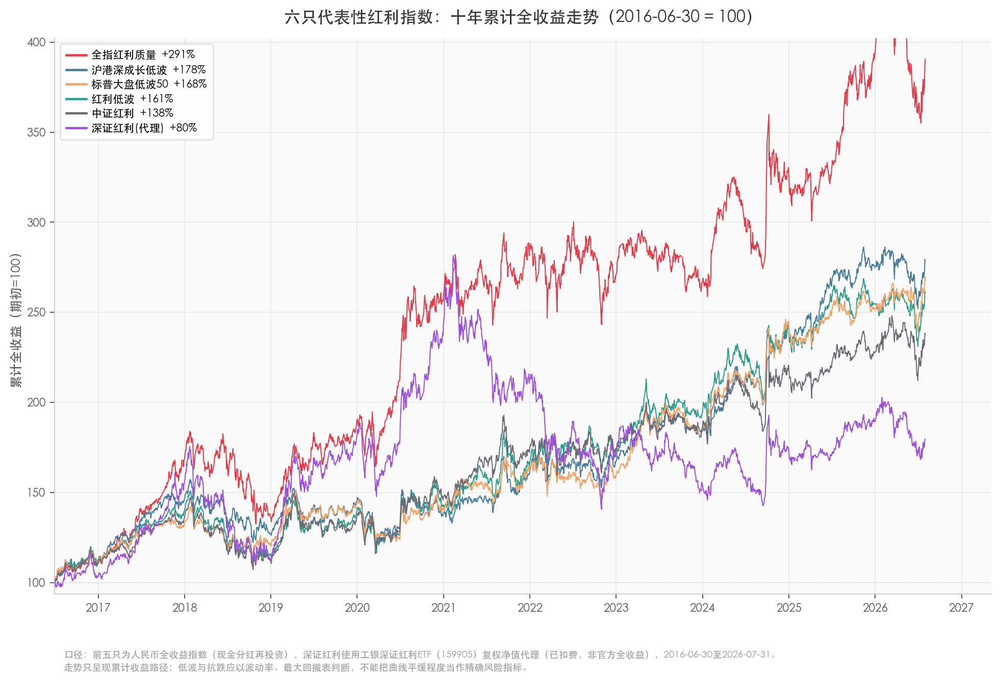
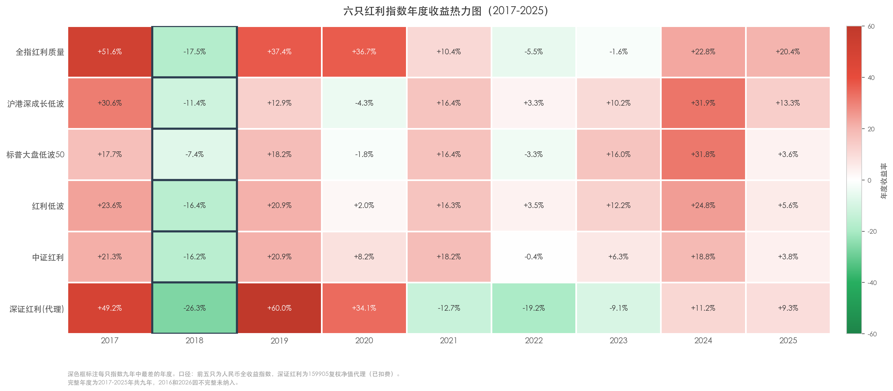

# 红利指数没有万能冠军，但有四种清晰人选

把闲钱放进红利类资产，是很多普通投资者的起点：不求暴富，选一只好指数，靠分红再投资慢慢变富。这个思路没有问题，但"红利指数"四个字背后，藏着远比想象中更大的差异。

都叫红利指数，十年下来收益能差出一倍，最大回撤能差30个百分点。有的100只股票却集中在单一行业，有的名字叫红利实则满仓制造消费龙头。差异不在运气，而在规则——每只指数用什么方式筛选高股息、要不要检查公司质量、要不要控制波动，最终买成的完全是不同的东西。

本文对比十只主流A股红利类指数，从收益、风险、持仓结构、编制规则和证据可信度五个维度做系统评价。结论先行：没有万能冠军，但有四种清晰人选，对应四种不同需求。

> 对比区间：2016-06-30至2026-07-31。前九只使用人民币全收益指数，即现金分红再投资；深证红利因缺少可核实的官方全收益序列，使用工银深证红利ETF（159905）复权单位净值代理。本文只评价指数规则和历史表现，不讨论当前估值、买入时机与具体ETF，不构成投资建议。

## 一、红利指数其实有四类

为了减轻阅读负担，下面不逐条抄写完整公式，只保留每只指数在筛什么、赢在哪里、付出什么代价。完整编制方案见文末附录C。

### 1. 红利质量：先检查公司，再谈股息

| 指数 | 它怎么选 | 最明显的优势 | 主要代价 |
|---|---|---|---|
| 中证全指红利质量 | 三年连续分红和合理支付率打底，再看ROE、ROE改善及现金流偿债能力 | 红利属性与盈利质量兼顾，行业上限30% | 2024年才发布，长期证据主要来自回溯 |
| 中证红利质量 | 检查盈利、未分配利润、现金流、毛利率、ROE，还要求四年分红大于再融资 | "一边融资一边分红"的排雷最有辨识度 | 没有行业上限，发布后收益低于完整回溯 |
| 标普红利机会 | 要求盈利为正、三年利润增长、支付率低于100%、过去两年有分红，再选近12个月高股息 | 基本面条件直接，单股上限只有3% | 只要求两年分红，仍可能追到周期高点 |

质量组检查的是"公司有没有能力继续分钱"。它们不负责让股价变平稳，所以历史波动并不低。

### 2. 红利低波：先找高息，再挑走路稳的

| 指数 | 它怎么选 | 最明显的优势 | 主要代价 |
|---|---|---|---|
| 中证红利低波 | 连续分红、支付率、股息增长、三年平均股息率，再筛低波 | 红利与低波结合完整，真实运行历史较长 | 没有行业上限，当前金融过半 |
| 中证红利低波动100 | 连续分红、三年平均股息率选300只，再选低波100只，按股息率÷波动率加权，行业上限20% | 行业护栏最强，结构较均衡 | 缺少盈利、现金流和支付率排雷 |
| 标普大盘低波50 | 大盘高息股中选波动最低的50只，每行业最多入选20只，按波动率倒数加权 | 历史最大回撤最浅 | 基本面约束少，不要求连续分红和利润增长，无明确行业与单股权重上限 |

低波组解决的是"持有过程能不能舒服一点"。但中证红利低波的金融集中说明，股价低波和行业分散不是同一件事。

### 3. 红利成长低波：想多做一道题

中证沪港深红利成长低波动同时检查连续分红、盈利成长、ROE增长稳定性和价格低波，并覆盖内地与香港市场。它的月频波动最低、收益/波动最高，说明规则确实实现了低波目标。

它的问题也来自"什么都想要"：预期股息率公式较复杂，盈利过滤并不严格，规则没有行业或市场上限。100只股票很分散，金融行业却占44.08%。

### 4. 经典红利：配方简单，味道直接

| 指数 | 它怎么选 | 最明显的优势 | 主要代价 |
|---|---|---|---|
| 中证红利 | 连续三年分红、支付率合理，再选三年平均高股息 | 规则简单，2008年发布，真实历史充分 | 没有盈利增长、低波和行业上限 |
| 上证红利 | 在上证180中按类似规则选50只高股息股票 | 换手控制较好，最大回撤相对较浅 | 只覆盖沪市，能源与金融合计63.44% |
| 深证红利 | 分红、支付率、规模、流动性加预期ROE，再按调整后自由流通市值加权 | 深市制造与消费龙头特色鲜明 | 预测误差和个股集中风险较高，市值加权易导致头部权重过大 |

经典红利的优点是容易理解，缺点也同样直白：它们主要负责提供高股息暴露，不会自动解决盈利增长、行业集中和价格波动。

## 二、十年成绩单：三个冠军不在同一只指数上

十只指数放在一起，最有意思的不是谁拿第一，而是三个冠军分别属于不同选手：

1. **收益冠军是中证全指红利质量。**过去约十年累计上涨290.52%，年化收益14.47%。
2. **最抗跌的是标普中国A股大盘红利低波50。**最大回撤为-19.92%，比多数对手浅约6-10个百分点。
3. **风险收益效率最高的是中证沪港深红利成长低波动。**月频年化波动最低，为13.66%；收益/波动最高，为0.78。

这已经说明，红利指数不是一场只看终点的百米赛跑。有的选手跑得快，有的摔得轻，有的路线设计更可靠。把这些目标揉成一个总分，容易制造一个并不存在的"万能冠军"。

收益、波动和回撤回答的是三道不同问题：赚了多少、路上颠不颠、最惨时会亏多少。

| 指数 | 年化收益 | 月频年化波动 | 收益/波动 | 最大回撤 |
|---|---:|---:|---:|---:|
| 中证全指红利质量 | **14.47%** | 18.88% | 0.77 | -27.97% |
| 中证红利质量 | 12.30% | 20.39% | 0.60 | -30.35% |
| 中证沪港深红利成长低波动 | 10.68% | **13.66%** | **0.78** | -26.16% |
| 标普大盘红利低波50 | 10.25% | 13.99% | 0.73 | **-19.92%** |
| 中证红利低波动 | 9.97% | 15.79% | 0.63 | -27.53% |
| 标普红利机会 | 9.08% | 16.49% | 0.55 | -30.38% |
| 中证红利 | 8.98% | 15.30% | 0.59 | -27.08% |
| 中证红利低波动100 | 8.64% | 14.40% | 0.60 | -26.17% |
| 上证红利 | 8.58% | 15.50% | 0.55 | -23.39% |
| 深证红利 | 5.98% | 21.03% | 0.28 | -50.07% |

"收益/波动"只是年化收益除以年化波动，不是夏普比率。

从十只指数中选出六只代表性选手，把它们的累计全收益画在一张图上，三个冠军不在同一只指数上就一目了然：收益冠军中证全指红利质量一路领先，低波冠军中证沪港深红利成长低波动和回撤冠军标普大盘红利低波50走得更稳，经典基准中证红利落在中游，深证红利受制造消费龙头拖累掉到最末。

图中前五条线为人民币全收益指数（现金分红再投资），深证红利使用工银深证红利ETF（159905）复权净值代理，已扣除基金费用，非官方全收益口径。期初均归一化为100。走势只呈现累计收益路径；低波与抗跌应以波动率、最大回撤表判断，不能把曲线平缓程度当作精确风险指标。

走势图回答"十年终局"，但十年累计收益可能只由少数年份驱动。下面这张热力图把2017-2025每个完整年度的收益拆开，每只指数九年中最差的年度用深色框标出，可以直接比较"过程是否均匀"：

从热力图能看出几件事：

**2018年全线下跌。**贸易摩擦升级叠加去杠杆信用收紧，A股普跌，六只指数无一幸免。但跌幅差异大：标普大盘低波50只跌7.4%，深证红利跌26.3%——低波筛选在熊市中的防守价值在此体现。

**2019-2020年深证红利和全指红利质量暴涨。**2019年消费白马和核心资产估值修复，深证红利涨60.0%，全指红利质量涨37.4%；2020年疫情后宽松流动性进一步推高白马股，两者继续大涨。这两年的高收益是它们十年累计领先的主要原因。

**2021-2023年深证红利连续三年负收益。**核心资产泡沫破裂，宁德时代、美的等权重股回调，深证红利三年分别跌12.7%、19.2%和9.1%。同期红利低波和沪港深成长低波靠银行、能源等防御性行业维持正收益，2022年均实现上涨。

**2024年红利策略集体爆发。**央企市值管理政策推动银行、煤炭等高股息板块重估，标普大盘低波50和沪港深成长低波均涨约32%，红利低波涨24.8%。全指红利质量同期涨22.8%，但2022-2023连续两年微亏，说明其回溯期的高收益集中在2017-2020年。

### 收益冠军靠什么赢

中证全指红利质量不是靠低波取胜。它的波动率达到18.88%，但年化收益14.47%，足以把收益/波动推到0.77，几乎追平沪港深成长低波。

这类体验有点像一辆动力更强的车：路上更颠，但十年后跑得更远。问题是，这段长期成绩大部分来自指数发布前的回溯试算。

### 最抗跌的为什么不是综合领先者

标普大盘红利低波50最大回撤只有-19.92%，历史防守非常突出。它先按股息率选大盘高息股，每行业最多20只，再选过去一年波动最低的50只，按波动率倒数加权，低波目标贯彻得很彻底。

代价是基本面排雷较弱：没有明确要求连续分红、利润增长或支付率合理。它很会控制车速，却没有仔细检查发动机。

排雷检查最少，历史却最抗跌、收益还不差，这个反差有四层解释。第一，低波是它的主力而非配角：先选高息股、再选波动最低的50只、按波动率倒数加权，是十只指数中对低波目标贯彻最彻底的设计，波动小和回撤浅是设计出来的。第二，入口池自带隐性筛选："大盘+高股息"的交集天然是成熟央企、银行和公用事业，假高息陷阱在这类股票里相对少见，样本池替规则挡住了一半的雷。第三，按股息率和波动率定期调仓，机械地卖出涨多的、买入跌多的，等于纪律化的低买高卖。第四，低波加高息筛出来重仓银行、煤炭，恰好是2021-2024年央企重估行情的最大受益者，好成绩里有行业beta的成分。

它和"规则得分最低"并不矛盾：历史分评的是过去十年简单规则够不够用，答案是完全够用；规则分评的是未来遇到陷阱时有几道防线，答案是防线最少。这个样本期没有惩罚它，不代表下个十年不会。另外它2019年才发布，全区间年化10.25%里有回溯成分，发布后年化8.89%，优势收窄但没有消失，说明低波机制是实的，不是纯回测美化。

### 深证红利为什么掉队

深证红利代理过去约十年年化收益5.98%，波动21.03%，最大回撤约-50%。费用和跟踪误差会拖累ETF净值，但很难解释如此大的整体差距。

不过，这组数据只能支持"它大概率处于最后一档"，不能支持精确的百分点比较。后文总分用区间表达。

## 三、差在哪：100只股票也可能只押一个行业

先别急着研究公式。普通投资者更容易理解的问题是：这些规则最后到底买成了什么？

成分股数量只是"篮子里有几颗鸡蛋"，行业权重才决定这些鸡蛋是不是都来自同一个农场。

| 指数（简称） | 样本数 | 发布日期 | 当前最值得注意的结构 |
|---|---:|---|---|
| 沪港深成长低波 | 100 | 2019-04-25 | 前十大仅19.41%，但金融占44.08% |
| 全指红利质量 | 50 | 2024-07-08 | 前十大57.92%，最大行业原材料24.83%，行业上限30% |
| 中证红利质量 | 50 | 2020-05-21 | 前十大38.04%，最大行业医药卫生20.12% |
| 中证红利低波 | 50 | 2013-12-19 | 金融占53.6%，行业集中最突出 |
| 标普红利机会 | 100 | 2008-09-11 | 单股上限3%、行业上限33%；行业与十大数据见官方单张 |
| 红利低波100 | 100 | 2017-05-26 | 行业上限20%，规则上限最严格 |
| 中证红利 | 100 | 2008-05-26 | 金融与能源合计约47.7% |
| 上证红利 | 50 | 2005-01-04 | 能源与金融合计63.44% |
| 标普大盘低波50 | 50 | 2019-04-01 | 选样限制行业入选数量，但最终没有行业和单股权重上限 |
| 深证红利 | 40 | 2006-01-24 | 宁德时代与美的集团合计30.05%，前五大46.71% |

这里有三种不同的集中风险。

### 1. 沪港深成长低波：分散了市场，没有分散行业

它覆盖沪、深、港三个市场，前十大只有19.41%，个股确实很分散。但金融权重达到44.08%。跨市场解决了"股票都来自哪里"的问题，没有解决"公司都在做什么生意"的问题。

### 2. 中证红利低波：主导行业会换，但总有人坐得太满

跟踪ETF 512890的前十大持仓显示，核心仓位2019年偏基建，2020-2023年在基建与周期之间切换，2024年后才明显转向金融。

所以它不是永远押银行。真正的问题是没有行业上限：某个行业一旦最符合"高股息+低波"条件，就可能拿走过多权重。今天是金融，未来也可能换成别的行业。

### 3. 深证红利：名字很传统，持仓并不传统

深证红利不是银行、煤炭主导的经典红利组合。宁德时代和美的集团两只合计30.05%，组合更像集中持有深市制造与消费龙头。这也解释了为什么它的波动和回撤明显高于传统红利指数。

## 四、五维打分：从规则到表现

把十个目标放在同一套尺子上量，会暴露一件事：**没有一个指数能在所有维度同时占优，也很难说谁"应该"是第一。** 评分只是把定性判断量化，方便看出各指数长板短板分别在哪。

| 组别 | 指数 | 一句话定位 |
|---|---|---|
| 综合领先组 | 中证红利低波动 | 规则、稳定性和真实历史扎实，当前金融权重过半 |
| 综合领先组 | 标普红利机会 | 基本面排雷直接，真实历史充分，但波动和回撤偏大 |
| 综合领先组 | 中证红利 | 规则简单透明、真实运行最久，行业偏金融和能源 |
| 均衡竞争组 | 沪港深成长低波、上证红利、红利低波100 | 分别偏跨市场均衡、沪市高息和行业护栏 |
| 质量成长组 | 中证红利质量、全指红利质量 | 盈利质量强、历史收益高，但发布后历史较短 |
| 防守特色组 | 标普大盘红利低波50 | 最大回撤最浅，但基本面约束偏弱 |
| 单列观察 | 深证红利 | 更像深市制造、消费龙头组合，且绩效使用ETF代理 |

### 评分框架

评分框架围绕一个目标设计：让"客观"和"独立"站得住。它做了三个取舍：

1. **五维各由哪几道关卡构成，同一件事不重复计分。**规则稳健性拆成三道：分红持续性问"公司有没有能力继续分钱"（盈利、现金流、支付率、每股股息增长），陷阱防御问"高股息是不是真的"（多年平均股息率、异常支付率、周期顶部与股价暴跌防范），策略一致性问"名字和实际做的是不是一回事"。证据可信度由两件事构成：数据可比性（口径是否一致）+ 发布后历史（真实运行了多久）。几乎人人同分的检查项不计分，避免比不出高下的项目稀释总分。

2. **分红持续性与陷阱防御分开、但不重复奖励。**两者都看支付率、盈利、周期，边界容易重叠，本文把它们作为两个独立子项分别计分，避免同一个优点被计两次。规则稳健性因此分为三项：分红持续性/14、高股息陷阱防御/9、策略一致性/7。

3. **权重是主观选择，不做"敏感性测试"假装客观。** 五维权重（规则30/历史25/稳定15/结构10/证据20）是基于"规则比结构更重要、证据比短期波动更重要"的判断，本质是主观的。改变权重会改变排名，这是常识，不需要专门测试来证明。读者如果不认同权重分配，可以根据附录的明细分自行重算——等权或更看重结构时，第一名会换人。

评分为五个维度：规则稳健性30%、历史风险收益25%、表现稳定性15%、结构分散10%、证据可信度20%。

| 维度 | 权重 | 回答的问题 |
|---|---:|---|
| 规则稳健性 | 30% | 分红能否持续，能否防范高股息陷阱，规则是否服务自身目标 |
| 历史风险收益 | 25% | 长期赚了多少，最大回撤多深，风险收益效率如何 |
| 表现稳定性 | 15% | 收益是否依赖少数年份，滚动表现是否稳定 |
| 结构分散 | 10% | 个股和行业是否集中，规则有没有硬护栏 |
| 证据可信度 | 20% | 数据是否可比，发布后真实运行了多久 |

| 组别 | 指数 | 规则30 | 风险收益25 | 稳定15 | 结构10 | 证据20 | 总分 |
|---|---|---:|---:|---:|---:|---:|---:|
| 综合领先组 | 中证红利低波动 | 25 | 19 | 14 | 4 | 19 | **81** |
| 综合领先组 | 标普红利机会 | 24 | 16 | 11 | 8 | 19 | **78** |
| 综合领先组 | 中证红利 | 22 | 17 | 13 | 6 | 20 | **78** |
| 均衡竞争组 | 中证沪港深成长低波动 | 22 | 21 | 13 | 5 | 16 | **77** |
| 均衡竞争组 | 上证红利 | 22 | 19 | 12 | 4 | 20 | **77** |
| 均衡竞争组 | 中证红利低波动100 | 19 | 18 | 13 | 9 | 17 | **76** |
| 质量成长组 | 中证红利质量 | 27 | 18 | 10 | 6 | 14 | **75** |
| 质量成长组 | 中证全指红利质量 | 25 | 22 | 12 | 7 | 9 | **75** |
| 防守特色组 | 标普大盘红利低波50 | 17 | 22 | 14 | 5 | 16 | **74** |
| 单列观察 | 深证红利 | 21 | 7 | 6 | 5 | 12 | **约48-54，中位51** |

### 规则稳健性：真正需要防的不是股息低，而是假高息

红利指数的全收益来自：

> 股价变化 + 现金分红再投资

公司分红后股价会除息，分红不是凭空多出来的钱。高股息也不一定是好消息，它可能来自三种情况：

- 公司利润和现金流稳定，确实有能力持续分红；
- 股价大跌，把静态股息率被动推高；
- 公司正处于周期利润高点，或者发了一次性大额分红。

因此，评价红利规则主要看三道关卡：

1. **钱从哪里来：**利润、现金流和合理支付率能否支撑分红。
2. **是不是只看眼前：**多年平均股息率通常比最近12个月股息率更稳健。
3. **会不会押得太重：**个股和行业上限能否避免一次判断失误拖累整个组合。

还有两个概念不要混淆：质量筛选负责检查公司，低波筛选负责控制价格波动。好公司可以很颠，低波股票也未必是好公司。

规则稳健性围绕这三道关卡展开，拆成分红持续性/14、陷阱防御/9、策略一致性/7三个子项。详细打分明细见附录B。

### 证据可信度：漂亮回测和真实跑过一轮不是一回事

指数发布前的数据通常是按现有规则回算的。它有参考价值，但设计者已经知道历史答案，天然比发布后数据更容易显得漂亮。

| 指数 | 正式发布日期 | 完整区间年化 | 发布后年化 | 应怎样理解 |
|---|---|---:|---:|---|
| 中证全指红利质量 | 2024-07-08 | 14.47% | 14.63% | 发布后约两年仍强，但没有经历完整周期 |
| 中证红利质量 | 2020-05-21 | 12.30% | 7.63% | 发布后明显弱于完整回溯 |
| 沪港深成长低波 | 2019-04-25 | 10.68% | 9.31% | 优势有所收窄，但没有消失 |
| 标普大盘低波50 | 2019-04-01 | 10.25% | 8.89% | 发布后仍有正收益，斜率低于完整区间 |
| 上证红利 | 2005-01-04 | 8.58% | 比较期均属发布后 | 证据时间充分 |
| 深证红利 | 2006-01-24 | 5.98%（ETF代理） | 比较期均属发布后 | 历史较长，但不是官方全收益口径 |

稳定性数据也要克制阅读。中证全指红利质量在样本内所有滚动三年、五年窗口均为正，但大部分窗口属于发布前回溯；相邻两个滚动五年窗口又有59个月重合，并不是几十次独立考试。

这不等于回测没用。正确理解是：回测负责提出假设，发布后历史负责继续验证。

证据可信度由数据可比性和发布后历史两部分构成。详细打分明细见附录B。

> 其余三个维度（历史风险收益、表现稳定性、结构分散）的数据已在第二章成绩单和第三章持仓结构中展示，详细子项打分明细见附录B。

## 五、怎么选：你最在意什么？

先问自己哪一项最不能妥协，再看相应代价能否接受。既然头部没有稳健的唯一冠军，你的取舍就比排名更重要。

- **规则、稳定性和真实历史都较扎实，且不太在乎结构集中：**优先研究中证红利低波动。它把分红增长与低波结合得较完整，发布后证据充分；代价是金融权重过半，结构集中度是最大短板。
- **看重盈利质量、历史高收益，也接受结构与历史更均衡：**优先研究中证全指红利质量。它兼顾ROE、现金流和股息，十年回溯收益最高；代价是发布后历史只有约两年，大部分成绩来自回溯。
- **最在意财务排雷的强度：**优先研究中证红利质量。它"一边融资一边分红"的排雷最有辨识度；代价是发布后表现偏弱、回撤较深。
- **想兼顾成长、低波和跨市场：**优先研究中证沪港深红利成长低波动。它的风险收益效率最高，个股也较分散；代价是金融占44.08%，部分历史来自回溯。
- **偏好简单、透明、运行时间长：**优先研究中证红利。它规则直观，真实运行历史充分，综合分也在头部；代价是缺少质量与低波筛选，行业偏金融和能源。上证红利可作为沪市版本的替代，特点更鲜明、结构更集中。
- **最在意行业均衡：**优先研究中证红利低波动100。它设置20%的行业上限，规则上限最严格，实测行业也最分散；代价是质量筛选和历史收益一般。
- **最在意历史回撤控制：**优先研究标普大盘红利低波50。它的最大回撤最浅，波动率倒数加权天然防御性强；代价是基本面约束最少（不要求连续分红、不查支付率）、规则上没有明确的行业与单股权重上限，综合分低于头部。
- **想配置深市制造与消费龙头：**可以研究深证红利。它的市场定位独特，不是传统金融红利组合；代价是个股集中，波动和回撤较大。

这份目标导航用于找到值得进一步研究的指数，不等于直接买入建议。指数质量之外，还需要另外判断当前估值，以及具体ETF的费率、规模、流动性和跟踪质量。

最后可以把十只指数压缩成一句话：

> **质量决定公司有没有钱继续分，低波决定持有过程颠不颠，结构约束决定会不会押得太重，发布后历史决定我们该信几分。**

没有一只指数把四件事同时做到最好，也没有一只在所有合理权重下都配当第一。总分的作用不是替读者按下购买键，而是把每种策略的收益来源、隐藏代价，以及"第一"这个位置本身的不确定性一起摊开。

## 附录A：数据口径与证据边界

1. 区间实际约10.084年，年化收益按实际日历天数计算。
2. 波动率使用月末收益率标准差乘以 `√12`；最大回撤使用日度序列。
3. "收益/波动"不是夏普比率。
4. 最新结构快照不能代表过去十年的持仓。
5. 深证红利使用159905复权净值代理，已扣除基金费用并受跟踪误差影响，因此只判断大致档位，给总分区间。
6. 结构证据不完整时，只依据规则上限和已取得的快照评分，不做精确历史收益归因。

## 附录B：评分打分明细

以下为五个维度的子项打分，满分见列头斜杠后数字。规则稳健性分三项：分红持续性、高股息陷阱防御、策略一致性；证据可信度的"发布后历史"按真实运行长度细分档位。

**规则稳健性（30分）**

| 指数 | 分红持续性/14 | 陷阱防御/9 | 策略一致性/7 | 小计/30 |
|---|---:|---:|---:|---:|
| 中证红利质量 | 13 | 8 | 6 | 27 |
| 中证全指红利质量 | 12 | 7 | 6 | 25 |
| 中证红利低波动 | 11 | 7 | 7 | 25 |
| 标普红利机会 | 11 | 7 | 6 | 24 |
| 中证沪港深红利成长低波动 | 10 | 6 | 6 | 22 |
| 上证红利 | 10 | 6 | 6 | 22 |
| 中证红利 | 10 | 6 | 6 | 22 |
| 深证红利 | 10 | 6 | 5 | 21 |
| 中证红利低波动100 | 8 | 5 | 6 | 19 |
| 标普大盘红利低波50 | 7 | 4 | 6 | 17 |

**这项怎么打、为什么这么打：** 规则稳健性是五维里权重最高的一维（30%），因为指数未来持有什么由规则决定。拆成三道看，每道卡得严不严很不一样：

**分红持续性（分红能不能持续）：**
- 强（12-13分）：中证红利质量、全指红利质量——查盈利、现金流、ROE、股息增长，红利质量还要求四年分红大于再融资，排掉"一边融资一边分红"。
- 中（10-11分）：红利低波、标普红利机会、上证红利、中证红利、沪港深、深证红利——有连续分红要求+支付率约束，但不全面查质量。
- 弱（7-8分）：红利低波100、标普大盘低波50——不要求连续分红或只做基本筛选，基本面约束最少。

**陷阱防御（会不会被骗成假高息）：**
- 强（7-8分）：中证红利质量、全指红利质量、红利低波、标普红利机会——用三年平均股息率、查支付率合理性、或排掉周期高点一次性分红。
- 中（5-6分）：沪港深、上证红利、中证红利、深证红利、红利低波100——有一定支付率约束，但排雷不够深。
- 弱（4分）：标普大盘低波50——按近12个月股息率选股，不查支付率和利润增长，最易被假高息骗到。

**策略一致性（名字和实际做的是不是一回事）：**
- 强（7分）：红利低波——红利+低波两个目标都落实到位。
- 中（6分）：其余多数指数——名字和做法基本对得上。
- 弱（5分）：深证红利——名字叫红利，实则按市值加权、押预期ROE，更像深市龙头组合。

两个原则：质量与低波各做各的，不把低波设成所有指数的必答题；"连续分红"只证明过去发过钱，不证明未来可持续，只要求两年分红的指数此项通常不给满。约1分属判断误差，不据此区分同档。

**历史风险收益（25分）**

| 指数 | 年化收益/10 | 最大回撤/8 | 收益波动比/7 | 小计/25 |
|---|---:|---:|---:|---:|
| 中证全指红利质量 | 10 | 5 | 7 | 22 |
| 标普大盘红利低波50 | 8 | 8 | 6 | 22 |
| 中证沪港深红利成长低波动 | 8 | 6 | 7 | 21 |
| 上证红利 | 7 | 7 | 5 | 19 |
| 中证红利低波动 | 8 | 5 | 6 | 19 |
| 中证红利质量 | 9 | 4 | 5 | 18 |
| 中证红利低波动100 | 7 | 6 | 5 | 18 |
| 中证红利 | 7 | 5 | 5 | 17 |
| 标普红利机会 | 7 | 4 | 5 | 16 |
| 深证红利 | 4 | 1 | 2 | 7 |

**这项怎么打、为什么这么打：** 历史风险收益是唯一完全由数据驱动的维度，评的是"过去十年到底跑得怎么样"，不需要主观判断，只把复算出的真实指标映射成分数档位。拆成三道看：

**年化收益（赚了多少）：**
- 高（9-10分）：全指红利质量（14.47%）、红利质量（12.30%）——回溯期受益于质量风格，收益最高。
- 中（8分）：沪港深、标普大盘低波50、红利低波——10%上下，稳健增长。
- 低（4-7分）：其余五只+深证红利——8%-9%或更低，深证红利仅5.98%垫底。

**最大回撤（最惨时亏多深）：**
- 浅（7-8分）：标普大盘低波50（-19.92%）、上证红利（-23.39%）——低波+高股息防守属性强。
- 中（5-6分）：沪港深、低波100、红利低波、中证红利——-26%至-27%，中等深度。
- 深（1-4分）：红利质量、全指红利质量、标普红利机会、深证红利——-30%以上，深证红利-50%最深。

**收益波动比（划不划算）：**
- 高（7分）：沪港深（0.78）、全指红利质量（0.77）——效率最高。
- 中（6分）：标普大盘低波50、红利低波——中等效率。
- 低（2-5分）：其余五只+深证红利——收益/波动比偏低。

特别说明：这里只评价"序列跑出来的成绩"，不回扣回溯问题——收益主要来自发布前回溯的全指红利质量照样按成绩给高分，回溯的账留到"证据可信度"里去扣，避免同一件事被罚两次。深证红利用ETF代理，其低分只能说明它大概率在末档，精确差距不可信。

**表现稳定性（15分）**

| 指数 | 年度稳定性/7 | 滚动3年/5 | 滚动5年/3 | 小计/15 |
|---|---:|---:|---:|---:|
| 中证红利低波动 | 6 | 5 | 3 | 14 |
| 标普大盘红利低波50 | 6 | 5 | 3 | 14 |
| 中证沪港深红利成长低波动 | 6 | 4 | 3 | 13 |
| 中证红利低波动100 | 6 | 4 | 3 | 13 |
| 中证红利 | 5 | 5 | 3 | 13 |
| 上证红利 | 5 | 4 | 3 | 12 |
| 中证全指红利质量 | 4 | 5 | 3 | 12 |
| 标普红利机会 | 4 | 4 | 3 | 11 |
| 中证红利质量 | 4 | 3 | 3 | 10 |
| 深证红利 | 3 | 2 | 1 | 6 |

下面的数据表是这15分打分的原始依据，方便把分数和背后数字一一对上。完整年度统计2017-2025共9年；滚动收益按月末点位计算。

| 指数 | 正收益年份 | 最差年度 | 滚动3年正收益占比 | 滚动3年年化中位数 | 滚动5年正收益占比 | 滚动5年年化中位数 |
|---|---:|---:|---:|---:|---:|---:|
| 中证全指红利质量 | 6/9 | -17.48% | **100%** | **14.55%** | **100%** | **11.96%** |
| 中证红利低波动 | **8/9** | -16.39% | 96.5% | 10.46% | **100%** | 10.20% |
| 中证红利 | 7/9 | -16.15% | **98.8%** | 8.33% | **100%** | 9.01% |
| 标普大盘红利低波50 | 6/9 | **-7.41%** | 97.7% | 9.09% | **100%** | 9.02% |
| 中证沪港深红利成长低波动 | 7/9 | -11.42% | 90.7% | 9.16% | **100%** | 7.51% |
| 标普红利机会 | 7/9 | -21.46% | 88.4% | 10.03% | **100%** | 9.63% |
| 中证红利低波动100 | **8/9** | -14.12% | 89.5% | 9.09% | **100%** | 8.91% |
| 中证红利质量 | 6/9 | -16.40% | 82.6% | 12.42% | **100%** | 10.18% |
| 上证红利 | 7/9 | -13.59% | 90.7% | 7.94% | **100%** | 7.83% |
| 深证红利 | 5/9 | -26.28% | 65.1% | 3.06% | 67.7% | 2.14% |

表现稳定性评的是"十年成绩是不是少数几年撑起来的"，同样以复算数据为准、无主观判断。拆成三层看，年度稳定性权重最高、滚动窗口权重依次降低：

**年度稳定性（年度表现稳不稳）：**
- 稳（6分）：红利低波、低波100、标普大盘低波50、沪港深——前两者九年八年正收益，后两者正收益年数不多但下跌年份跌得浅（标普大盘低波50最差仅-7.41%）。
- 中等（5分）：中证红利、上证红利——七年正收益，最差年度在-13%到-16%之间。
- 一般（4分）：全指红利质量、标普红利机会、红利质量——正收益年数或最差跌幅有一项偏弱，综合中等。
- 不稳（3分）：深证红利——仅五年正收益，最差年度跌26.3%。

**滚动3年（中期拿得住拿不住）：**
- 稳（5分）：全指红利质量（100%）、红利低波（96.5%）、中证红利（98.8%）、标普大盘低波50（97.7%）——滚动3年基本都正收益。
- 中等（4分）：沪港深、低波100、标普红利机会、上证红利——90%上下。
- 不稳（2-3分）：红利质量（82.6%）、深证红利（65.1%）——中期也容易亏。

**滚动5年（长期拿得住拿不住）：**
- 稳（3分）：除深证红利外全部100%正收益——样本期内拿够五年基本不亏。
- 不稳（1分）：深证红利（67.7%）——五年都可能亏。

一个关键口径：滚动窗口高度重叠（相邻5年窗口共享59个月），不是几十次独立考试，"全窗口为正"不能外推成"永远不会亏"；也因此滚动5年只给3分、权重最低，年度稳定性占主导。

**结构分散（10分）**

| 指数 | 个股集中/3 | 行业集中/4 | 规则上限/3 | 小计/10 | 证据等级 |
|---|---:|---:|---:|---:|:---:|
| 中证红利低波动100 | 3 | 3 | 3 | 9 | A |
| 标普红利机会 | 3 | 2 | 3 | 8 | B |
| 中证全指红利质量 | 1 | 3 | 3 | 7 | A |
| 标普大盘红利低波50 | 2 | 2 | 1 | 5 | C |
| 中证红利质量 | 2 | 3 | 1 | 6 | A |
| 中证红利 | 3 | 2 | 1 | 6 | A |
| 深证红利 | 1 | 3 | 1 | 5 | B |
| 中证沪港深红利成长低波动 | 3 | 1 | 1 | 5 | A |
| 上证红利 | 2 | 1 | 1 | 4 | A |
| 中证红利低波动 | 2 | 1 | 1 | 4 | A |

证据等级说明：A=完整同日个股权重与行业分布（官方指数单张含精确百分比），B=有行业分布或部分个股权重、但缺另一面完整明细，C=主要依赖规则上限与已知汇总数据，实测细节不足。

**这项怎么打、为什么这么打：** 结构分散拆成三道看，每道对应一个问题，高集中和高分散的指数类型很不一样：

**个股集中（前十大重不重）：**
- 集中（1-2分）：全指红利质量（茅台单股近10%）、深证红利（宁德+美的就30%）——质量龙头指数、市值加权，天然前几大权重高。
- 分散（3分）：红利低波100、沪港深、中证红利、标普红利机会——100只+股息率/预期股息率加权，天然摊薄。

**行业集中（某行业占比高不高）：**
- 集中（1分）：红利低波、沪港深、上证红利——高股息+低波双重筛选，最后都漏向银行/能源/公用，金融天然占比高。
- 分散（3分）：全指红利质量、红利质量、深证红利——质量筛选跨行业分散，或本身就是深市多元龙头。

**规则上限（有没有硬约束）：**
- 强（3分）：红利低波100（20%行业上限）、标普红利机会（行业+选股数量约束）、全指红利质量（30%行业+10%单股）——基本都是"聪明指数"，规则设计上就加了护栏。
- 中（2分）：红利质量、深证红利——有单股上限或前N大约束，但没有行业上限。
- 弱（1分）：经典红利系（红利低波、中证红利、上证红利、沪港深）+ 标普大盘低波50——规则简单直接，没加行业上限，也没有明确的单股权重上限。

它在五维里权重最低（10%），因为最新持仓只是时点快照，不能代表十年。证据等级按官方单张披露完整度分A/B/C三档，C级置信度最低，不能凭分数断言它"实测最均衡"。

**证据可信度（20分）**

| 指数 | 数据可比性/6 | 发布后历史/14 | 小计/20 |
|---|---:|---:|---:|
| 上证红利 | 6 | 14 | 20 |
| 中证红利 | 6 | 14 | 20 |
| 中证红利低波动 | 6 | 13 | 19 |
| 标普红利机会 | 6 | 13 | 19 |
| 中证红利低波动100 | 6 | 11 | 17 |
| 中证沪港深红利成长低波动 | 6 | 10 | 16 |
| 标普大盘红利低波50 | 6 | 10 | 16 |
| 中证红利质量 | 6 | 8 | 14 |
| 深证红利 | 2 | 10 | 12 |
| 中证全指红利质量 | 6 | 3 | 9 |

**这项怎么打、为什么这么打：** 证据可信度评的是"我们凭什么信这些结论"，在五维里权重第二高（20%），专门承接历史成绩里"不扣回溯账"的那部分。拆成两道看：

**数据可比性（口径是不是一致）：**
- 可比（6分）：除深证红利外全部九只——都是官方人民币全收益指数，同口径可比。
- 不可比（2分）：深证红利——用ETF复权净值代理，已扣费且受跟踪误差影响，非官方全收益口径。

**发布后历史（真实跑了多久 + 发布后实盘跟回溯是否大致一致）：**
- 充分（13-14分）：上证红利（2005，21年）、中证红利（2008，18年）、标普红利机会（2008，18年）——发布超过15年，全区间基本都是实盘，不存在"回溯灌水"问题。
- 较充足（11分）：红利低波（2013，约12.5年）——发布超过10年，过半数为实盘。
- 中等（10分）：低波100（2017，约9年）、沪港深（2019，约7年）、标普大盘低波50（2019，约7年）、深证红利——发布5-10年，有一定实盘验证。
- 较短（8分）：红利质量（2020，约6年）——发布时间偏短，实盘验证还不够充分。
- 不足（3分）：全指红利质量（2024-07，约2年）——发布仅两年，绝大部分历史来自回溯，可信度最低。

**发布后实盘 vs 回溯期表现（定性观察，不单独打分）：**
对发布时间较晚、有完整发布后数据的四只指数，粗略比较发布后收益与全区间收益是否大体同档：
- **沪港深、标普大盘低波50、红利质量**：发布后年化收益与全区间差异不大（在1-2个百分点以内），回撤深度也接近，说明回溯期成绩没有明显"注水"。
- **全指红利质量**：发布仅两年，样本太短，无法验证策略的长期有效性。它的回溯期高收益主要集中在2017-2020年核心资产行情，后续可持续性存疑。

两个设计意图：一是发布前回溯只在"发布后历史"这里折价一次——收益几乎全来自回溯的全指红利质量，历史风险收益分照拿高分、证据分却被压到9，同一缺陷不重复扣；二是深证红利可比性差、只能判断大致档位，这正是它总分给区间的原因。

## 附录C：十只指数编制规则一览

以下用箭头链条简述每只指数的选样流程，并标注核心优势与代价。完整编制方案见文末官方资料。

**1. 中证全指红利质量（932315，2024-07-08发布）**

全指样本 -> 连续3年现金分红 -> 三年平均支付率10%-100% -> 按三年平均股息率剔除后50% -> 按ROE稳定性选前80% -> 综合评估ROE、ROE改善及现金流偿债能力 -> 选前50只 -> 综合得分倾斜加权，单股≤10%，前五大≤40%，行业上限30%

- 优势：红利属性与盈利质量兼顾，设有行业上限
- 代价：发布时间短，长期证据主要来自回溯

**2. 中证红利质量（931468，2020-05-21发布）**

全指样本 -> 剔除市值或成交额后20% -> 过去一年现金分红小于净利润 -> 过去四年现金分红大于再融资总额 -> 连续3年现金分红 -> 最近两年及最近一年支付率均大于20% -> 用六项财务指标综合打分 -> 选前50只 -> 综合得分加权，单股≤10%，前五大≤40%

- 优势："一边融资一边分红"的排雷最有辨识度
- 代价：没有行业上限，发布后收益低于完整回溯

**3. 中证红利低波动（H30269，2013-12-19发布）**

全指样本 -> 连续3年分红 -> 剔除支付率异常及每股股息未增长的公司 -> 按3年平均股息率选前75只 -> 选其中近1年波动率最低的50只 -> 股息率加权

- 优势：红利与低波结合完整，真实运行历史较长
- 代价：没有行业上限，当前金融过半

**4. 中证红利低波动100（930955，2017-05-26发布）**

全指样本 -> 连续3年分红 -> 三年平均股息率选前300只 -> 选近1年波动率最低的100只 -> 按股息率÷波动率加权，行业上限20%

- 优势：行业护栏最强，结构较均衡
- 代价：缺少盈利、现金流和支付率排雷

**5. 中证红利（000922，2008-05-26发布）**

全指样本 -> 连续3年分红 -> 过去3年支付率合理且为正 -> 三年平均股息率排序 -> 选前100只 -> 股息率加权

- 优势：规则简单，真实历史充分
- 代价：没有盈利增长、低波和行业上限

**6. 上证红利（000015，2005-01-04发布）**

上证180样本 -> 连续3年分红 -> 过去3年支付率合理且为正 -> 三年平均股息率排序 -> 选前50只 -> 股息率加权

- 优势：换手控制较好，最大回撤相对较浅
- 代价：只覆盖沪市，能源与金融合计63.44%

**7. 中证沪港深红利成长低波动（931157，2019-04-25发布）**

沪深港三地样本 -> 连续3年现金分红 -> 剔除三年净利润变化为负且PE为负的证券 -> 按预期股息率保留前60% -> 按ROE增速稳定性和ROE增速保留前60% -> 选近1年波动率最低的100只 -> 预期股息率加权，单股≤10%

- 优势：低波、成长与跨市场结合较均衡
- 代价：预期股息率公式复杂，盈利过滤仅为负面剔除，没有行业上限，金融占44.08%

**8. 标普中国A股大盘红利低波50（2019-04-01发布）**

大盘高息股样本 -> 按近12个月股息率选前100只（每GICS行业最多20只） -> 选近1年波动率最低的50只 -> 按波动率倒数加权

- 优势：低波目标贯彻彻底，历史最大回撤最浅
- 代价：不要求连续分红、利润增长或支付率合理，基本面排雷弱；无明确行业与单股权重上限

**9. 标普中国A股红利机会（2008-09-11发布）**

中国A股样本 -> 过去12个月盈利为正 -> 三年利润正增长 -> 股息三年稳定或增长 -> 股息覆盖倍数大于100% -> 支付率低于100% -> 过去两年有分红 -> 近12个月股息率排序 -> 选前100只 -> 股息率加权，单股上限3%，行业上限33%

- 优势：基本面条件直接，单股与行业双上限
- 代价：只要求2年分红，仍可能追到周期高点

**10. 深证红利（399324，2006-01-24发布）**

深市样本 -> 三年至少两年分红且股息率至少两年居深市前20% -> 三年支付率0-100%且居深市前50% -> 自由流通市值和成交额筛选 -> 剔除预期ROE后50%且ROE变化后20% -> 按三年累计分红金额和成交额综合排名选前40只 -> 调整后自由流通市值加权，单股≤15%，前五大≤60%

- 优势：深市制造与消费龙头特色鲜明
- 代价：按市值加权易导致个股集中，预期ROE存在预测误差

## 参考资料

### 中证指数有限公司

1. [中证全指红利质量指数（932315）](https://www.csindex.com.cn/#/indices/family/detail?indexCode=932315)
2. [中证红利质量指数（931468）](https://www.csindex.com.cn/#/indices/family/detail?indexCode=931468)
3. [中证红利低波动指数（H30269）](https://www.csindex.com.cn/#/indices/family/detail?indexCode=H30269)
4. [中证红利指数（000922）](https://www.csindex.com.cn/#/indices/family/detail?indexCode=000922)
5. [中证红利低波动100指数（930955）](https://www.csindex.com.cn/#/indices/family/detail?indexCode=930955)
6. [上证红利指数（000015）](https://www.csindex.com.cn/#/indices/family/detail?indexCode=000015)
7. [中证沪港深红利成长低波动指数（931157）](https://www.csindex.com.cn/#/indices/family/detail?indexCode=931157)
8. [十只指数日度数据与复算指标](../sources/performance-data/)
9. [十指数评分明细](../sources/performance-data/综合评分_十指数_V4.csv)

### 国证指数与深证红利ETF

10. [深证红利指数（399324）](https://www.cnindex.com.cn/module/index-detail.html?act_menu=1&indexCode=399324)
11. [深证红利指数简介与发布日期接口](https://www.cnindex.com.cn/index-intro?indexcode=399324)
12. [红利ETF工银（159905）](https://fund.eastmoney.com/159905.html)

### 标普道琼斯指数

13. [标普中国A股大盘红利低波50指数](https://www.spglobal.com/spdji/zh/indices/dividends-factors/sp-china-a-share-largecap-low-volatility-high-dividend-50-index/?currency=CNY&returntype=T-#overview)
14. [标普低波动高股息指数系列编制方案](https://www.spglobal.com/spdji/en/documents/methodologies/methodology-sp-low-volatility-high-dividend-indices.pdf)
15. [标普中国A股红利机会指数](https://www.spglobal.com/spdji/zh/indices/dividends-factors/sp-china-a-share-dividend-opportunities-index/?currency=CNY&returntype=T-#overview)
16. [标普红利机会指数系列编制方案](https://www.spglobal.com/spdji/en/documents/methodologies/methodology-sp-dividend-opportunities.pdf)
