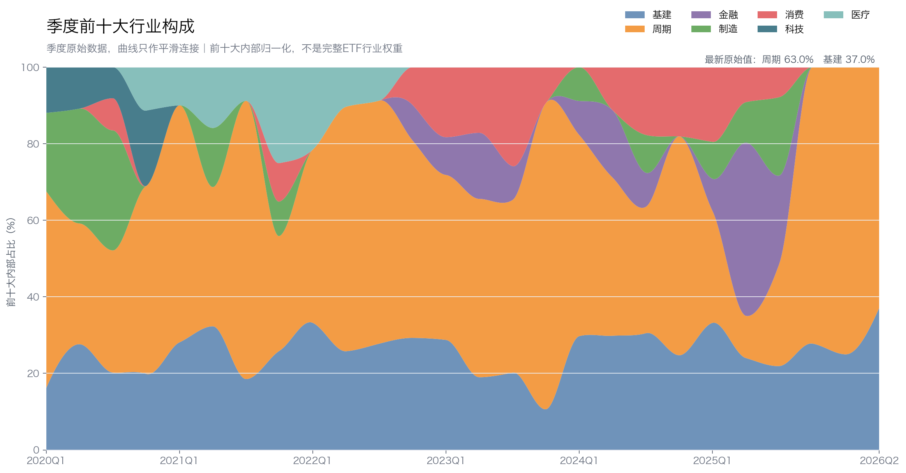
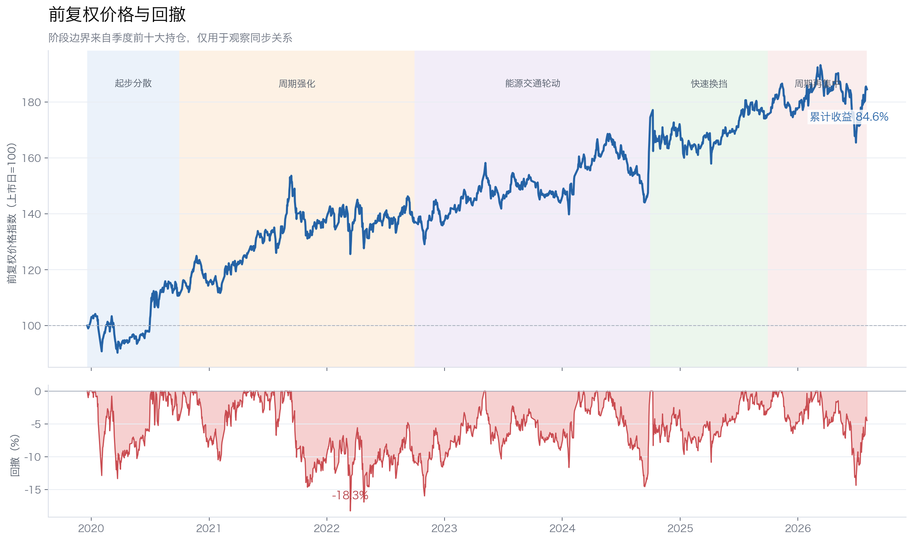
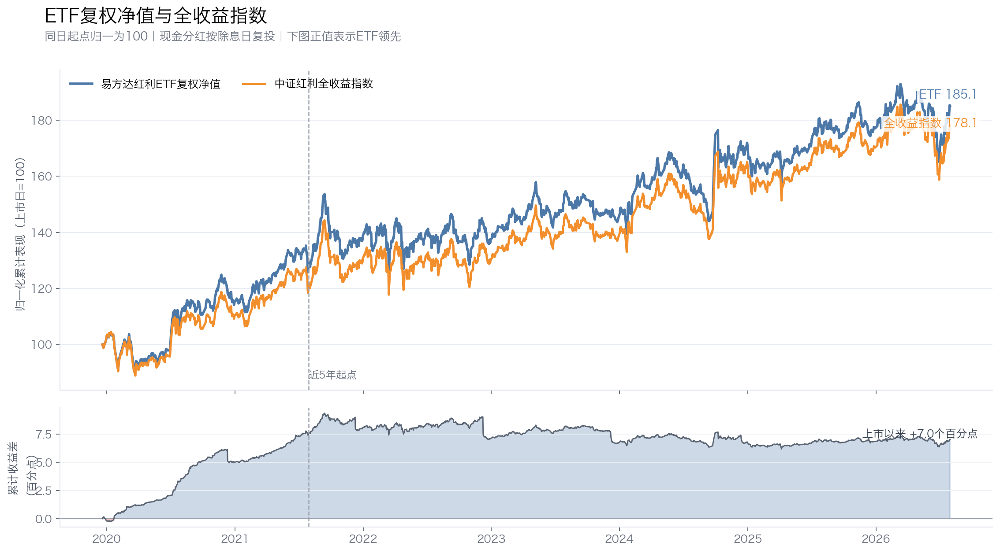
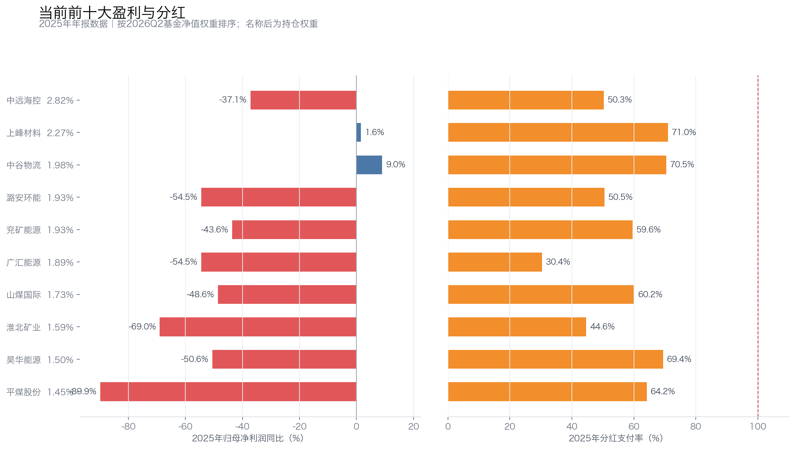

# 易方达红利ETF六年换仓：从钢铁、煤炭到航运，高股息为何总在周期行业打转？

易方达中证红利交易型开放式指数证券投资基金（515180，简称“易方达红利ETF”）跟踪的是最经典的中证红利指数。很多人把“红利”理解成稳定收息，但这只ETF近年的核心仓位更像一组周期资产。

2020年一季度，钢铁、化工、制造和建材还共同出现在前十；2023年末，周期股占前十大内部80.01%；到2026年二季度，前十已经变成7只煤炭能源股、2只航运股和1只水泥股。

前十大一直在换，周期行业却反复成为主角。上市以来84.55%的前复权价格收益，究竟对应怎样的行业暴露？当前前十大公司的2025年利润同比加权均值为-40.61%，过去的高股息还能不能延续？

本文使用2020年一季度至2026年二季度的季度前十大持仓，以及2019年12月20日至2026年8月3日的前复权价格。各期前十大合计占基金净值15.36%—25.41%，最新一期为19.09%。下文观察的是核心仓位，不是完整100只成分股的精确还原。

## 一、前十大换来换去，周期行业仍反复成为主角

### 1. 起步阶段：钢铁、制造和建材还算分散

2020年一季度，周期股占前十大内部51.47%，代表持仓有方大特钢、三钢闽光、龙佰集团、梅花生物和柳钢股份；依顿电子、康力电梯、九阳股份、旗滨集团和塔牌集团补充了制造、科技和建材。

到三季度，周期、制造和基建分别约占32%、30%和28%，结构仍较分散。四季度前十只保留上一季度的1只股票，第一次出现明显换挡。

### 2. 2021—2024年：煤炭逐渐成为主线

2021年一季度，周期占比升至61.94%；三季度达到72.69%。当季前十有兖矿能源、淮北矿业、华阳股份和多只钢铁股，兖矿能源一只股票占基金净值4.74%。

周期集中并非直线上升。2021年末，医疗、地产和消费曾短暂回归；2022年煤炭重新占优。到2023年末，周期占比升至历史最高的80.01%，前十里有陕西煤业、中国神华、山煤国际、恒源煤电、潞安环能、中国石化和南钢股份。

2024年三季度，周期占比降至33.02%，唐山港、大秦铁路、山东高速等交通资产，以及银行和消费股分走了部分权重。但这仍是传统高股息行业之间的轮换，并没有转向成长股。

### 3. 金融短暂成为前十大主导，随后又回到煤炭与航运

2025年二季度，中信银行、成都银行、兴业银行、建设银行和江苏银行让金融占比升至45.27%。一个季度后，金融降到23.09%；到年末，前十再次大换血，只保留上一季度的3只股票。

2025年末，周期占比回到72.23%；2026年一季度进一步升至75.04%。金融只在2025年二季度短暂主导前十大，煤炭和航运随后重新成为核心权重股。

最新前十包括中远海控、上峰材料、中谷物流，以及潞安环能、兖矿能源、广汇能源、山煤国际、淮北矿业、昊华能源和平煤股份。7只煤炭能源股占基金净值12.02%，两只航运股占4.80%，水泥股占2.27%。

### 4. 高频底仓进一步显示了核心权重的周期属性

26个季度里，进入前十大次数最多的是以下6家公司：

| 公司 | 出现期数 | 最长连续期数 | 平均/最高净值权重 |
|---|---:|---:|---:|
| 中国神华 | 14 | 13 | 1.86%/2.27% |
| 兖矿能源 | 12 | 10 | 2.67%/4.74% |
| 唐山港 | 10 | 10 | 1.76%/2.08% |
| 南钢股份 | 10 | 6 | 1.62%/1.90% |
| 大东方 | 8 | 8 | 2.28%/3.59% |
| 陕西煤业 | 8 | 4 | 1.77%/2.03% |

中国神华和兖矿能源是长期周期锚点，唐山港和南钢股份分别代表港口与钢铁。大东方虽然属于消费，但没有改变高频榜以煤炭、钢铁和交通资产为主的结构。

相邻季度平均只有5.88只股票留在前十，相当于每次约有4个名额变化。名单更换并不慢，但换来换去，大多仍在成熟、高股息的传统行业内部。

*行业比例按前十大持仓内部归一化；曲线只改变季度点之间的连接方式，没有对季度数据做移动平均，也不代表完整ETF行业权重。同花顺原始分类把中远海控、中谷物流和上峰材料归入宽口径“基建”，正文再按业务拆为航运和水泥。*

## 二、为什么红利规则会让核心权重反复偏向周期行业

中证红利先做市值和成交额筛选，再要求公司**连续三年现金分红**，三年平均支付率和最近一年**支付率都在0—100%之间**；之后按**三年平均股息率选出100只**，最后按股息率加权。

三年分红和支付率约束，比只看最近一年股息率稳健，能排除一部分异常公司。但规则没有要求利润增长、自由现金流覆盖、低波动或行业分散，也没有行业权重上限。

这正好解释了核心权重为什么会反复向周期行业倾斜。煤炭、航运和水泥在景气上行时，利润、现金流和分红会一起增加，三年平均股息率随之提高。等这些公司进入指数，行业利润可能已经处于较高位置。

这套规则的优势是简单、透明，能够持续寻找市场上股息率较高的公司；缺口也很清楚：它确认的是过去三年的分红记录，不能判断当前利润处在周期底部、中部还是顶部。

所以，易方达红利ETF最需要防范的不是“没有分红”，而是把周期高点的分红当成永久股息。

## 三、前十大周期集中与较高收益、较深回撤同步出现

阶段边界根据季度前十大持仓变化划分。价格使用前复权收盘价，表中只能观察持仓风格与ETF表现的同步关系，不能做精确个股归因。

| 持仓阶段 | 区间 | 累计收益 | 年化收益 | 最大回撤 |
|---|---|---:|---:|---:|
| 起步分散 | 2019-12-20至2020-09-30 | 10.80% | 14.04% | -13.33% |
| 周期强化 | 2020-09-30至2022-09-30 | 23.89% | 11.31% | -18.25% |
| 能源与交通轮动 | 2022-09-30至2024-09-30 | 27.17% | 12.76% | -14.56% |
| 快速换挡 | 2024-09-30至2025-09-30 | 0.52% | 0.52% | -10.84% |
| 周期再集中 | 2025-09-30至2026-08-03 | 5.18% | 6.19% | -14.35% |
| 上市以来 | 2019-12-20至2026-08-03 | 84.55% | 9.70% | -18.25% |

*阶段色带来自季度前十大持仓，只表示风格变化与价格表现的时间关系，不作因果归因。*

表现最好的是能源与交通轮动期。2022年三季度至2024年三季度累计上涨27.17%，年化收益12.76%。这一阶段前十大中的煤炭、石化和交通资产较多，与ETF上涨在时间上重合；但前十大只占基金净值一小部分，不能据此判断这些股票贡献了多少收益。

上市以来最大回撤为-18.25%，发生在2021年9月13日至2022年3月15日。回撤起点附近，周期占前十大内部72.69%，兖矿能源权重也达到历史高位。高周期暴露与回撤在时间上明显重合，但同期还有A股整体调整，不能简单写成“煤炭导致回撤”。

2024年三季度以后，核心仓位先转银行、再转多行业、最后重新集中于煤炭和航运，快速换挡阶段的前复权价格一年只涨0.52%。当前周期再集中阶段累计上涨5.18%，最大回撤却有14.35%。

易方达红利ETF没有低波筛选。高股息能提供现金回报和估值缓冲，不能充当净值下跌保险。

## 四、日常走势贴近指数，但近五年仍少赚了3.20个百分点

前复权价格适合观察二级市场持有体验。衡量基金交付，则要比较现金分红复投后的基金净值与中证红利全收益指数。两者使用相同交易日起止，并把起点归一为100：

| 区间 | ETF累计收益 | 全收益指数累计收益 | ETF年化收益 | 指数年化收益 | 年化跟踪差 | 年化跟踪误差 |
|---|---:|---:|---:|---:|---:|---:|
| 上市以来 | 85.13% | 78.09% | 9.76% | 9.12% | +0.64个百分点 | 0.81% |
| 近5年 | 43.71% | 46.91% | 7.52% | 7.99% | -0.47个百分点 | 0.71% |

*上市以来区间为2019年12月20日至2026年7月31日；近5年区间为2021年7月30日至2026年7月31日。基金现金分红按除息日复投；年化跟踪差与年化跟踪误差不是同一指标。*

上市以来，基金复权净值领先全收益指数7.04个百分点，正差主要在2021年末以前形成。这是实际历史结果，不能直接外推成长期超额收益。早期差异可能来自实际持仓与指数成分偏离、调仓执行和上市起点选择。

近5年更接近当前运行状态。基金累计落后全收益指数3.20个百分点，年化跟踪差为-0.47个百分点。年化跟踪误差为0.71%，说明日常走势较贴近指数，但费用、交易、现金留存和复制偏差经过多年仍会积累成收益差。

## 五、当前分红正在经受周期下行检验

以下把每家公司的2025年净利润同比、ROE和估算支付率，按其2026年二季度ETF净值权重在前十大内部归一化后求加权均值。这是公司层面的风险观察值，不是ETF组合真实利润增速或整体支付率：

| 当前前十大 | 公司净利润同比加权均值 | ROE加权均值 | 支付率加权均值 |
|---|---:|---:|---:|
| 全部前十大 | -40.61% | 7.85% | 56.83% |
| 7只煤炭能源股 | -57.58% | 4.96% | 53.43% |
| 航运和水泥3只 | -11.76% | 12.77% | 62.60% |

*左图看利润是否增长，右图看分红占利润的比例；支付率需要结合中周期利润、自由现金流和资本开支判断。*

当前7只煤炭能源股的公司利润同比加权均值为-57.58%。平煤股份、淮北矿业、潞安环能和广汇能源的单年利润降幅都超过50%。它们还能分红，不等于历史分红水平一定能维持。

按2025年低位EPS估算，煤炭能源股支付率加权均值约53%，暂时不算极端。但单年支付率不能代表中周期分红能力；判断煤炭股仍要用3—5年中位利润或中周期煤价复核，并扣除维持矿井生产所需的资本开支。若改用历史高位EPS外推，反而会把安全垫看得过厚。

航运同样如此。中远海控2025年利润下降37.13%，过去四年利润年化下降23.33%。运价受全球贸易、船舶供给和地缘事件影响，特别分红不能自动外推。中谷物流利润有所增长，但分红支付率约70.5%，仍需检查船队投资后的自由现金流。

上峰材料的利润暂时企稳，支付率约71%，但水泥需求与地产、基建投资密切相关。需求收缩时，高股息未必能抵消盈利下滑。

中证红利规则能确认公司过去三年持续分红，却无法确认未来利润已经见底。当前核心权重股的分红能否维持，主要取决于煤价、运价和水泥需求，也取决于下一次调样能否及时换出分红恶化的公司。

## 六、适合谁持有，以及要盯住哪四个变化

易方达红利ETF适合能够接受核心权重阶段性偏向周期行业、约18%的历史最大回撤，并愿意用中周期利润判断分红的投资者。如果期待的是行业均衡、低波动或接近固定收益的持有体验，它并不合适。

长期持有时，我会盯四件事。

第一，用中周期利润而不是最新一年利润计算煤炭股支付率。煤价下行时，静态股息率和上一年度EPS都可能高估分红能力。

第二，区分普通分红与特别分红。煤炭和航运公司的高额分红如果来自景气高点，不能直接当作永久现金流。

第三，检查经营现金流扣除资本开支后是否仍能覆盖股息。会计利润和支付率只是第一层，矿井、船队和水泥产线都需要持续投入。

第四，观察周期行业在完整指数中的权重，以及基金能否继续贴近全收益指数。前十大只能显示核心风格，不能代替完整行业暴露。

截至2026年8月3日，行情口径市值约192亿元，当日成交额约3.62亿元。真正的取舍不在单日交易规模，而在底层暴露：它是一只历史较长、规则简单的高股息ETF，核心权重也会阶段性偏向煤炭、航运等周期行业。

六年持仓说明，易方达红利ETF买的不是一批稳定不变的“收息股”，而是股息率排名靠前的公司。当前煤炭与航运集中后，下一轮检验不是还有没有股息，而是利润下行时，股息能保留多少。

## 数据与口径

- 持仓数据：[515180季度前十大持仓代理](../sources/etf-position-proxy/515180/)，覆盖2020Q1—2026Q2。行业比例为前十大内部占比，不是完整ETF行业权重。
- 指数规则采用[中证红利指数编制方案V1.2（2022年10月）](../sources/index-methodologies/000922_中证红利_编制方案_V1.2_2022-10.pdf)。
- 价格数据：[515180前复权行情与阶段复算](../sources/etf-history-price/)，覆盖2019-12-20至2026-08-03。前复权价格考虑现金分红除权，但仍是ETF二级市场价格。
- 跟踪差数据：[基金复权净值与中证红利全收益指数同日起点复算](../sources/etf-history-price/515180_vs_中证红利全收益指数_跟踪差汇总.csv)，截止2026-07-31。基金现金分红按除息日复投。
- 盈利与分红数据：东方财富2025年年报及分红方案接口；支付率按每股税前分红除以基本EPS估算。
- 持仓只覆盖前十大，无法进行完整个股收益贡献、每日调仓和全行业权重归因。文中阶段分析是方向性判断，不构成投资建议。