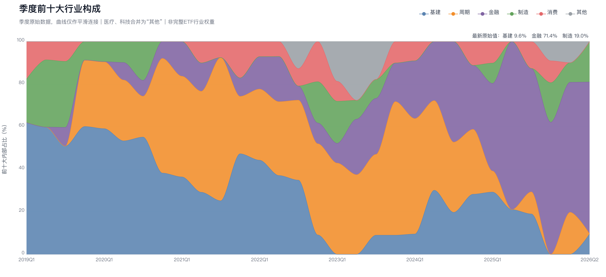
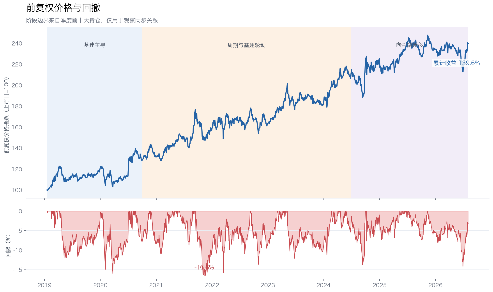
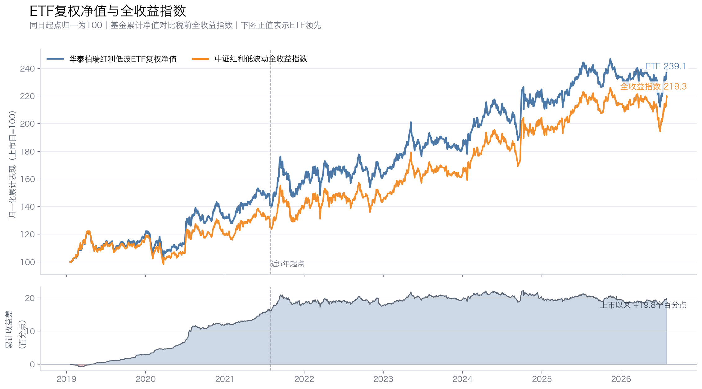
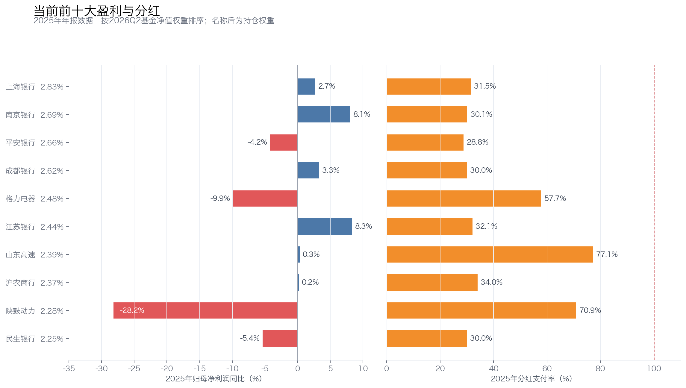

# 红利低波ETF七年三次换芯：基建、煤炭之后，银行会是下一棒吗

华泰柏瑞中证红利低波动交易型开放式指数证券投资基金（512890，简称“华泰柏瑞红利低波ETF”）给人的第一印象很稳：高股息、低波动，适合长期拿着收息。

但把2019年以来的持仓摊开看，它并不是一篮子多年不动的“现金奶牛”。2019年末，前十大内部的基建占60.06%；2021年三季度，周期股占67.29%，兖矿能源一只股票就占基金净值10%；到2026年二季度，银行又占到了71.41%。

ETF的名字一直没变，里面的生意却从地产、建材换到煤炭、能源，再换到银行。过去139.64%的累计收益，究竟来自一套能够持续寻找高股息资产的规则，还是恰好踩中了几轮行业行情？当前高度集中的银行持仓，又能不能接住下一棒？

本文使用2019年一季度至2026年二季度的ETF季度前十大持仓，以及2019年1月18日至2026年8月3日的前复权价格。由于每期前十大合计占基金净值24.61%—38.31%，下文观察的是核心仓位迁移，不是完整50只成分股的精确还原。

## 一、七年三次换芯：高股息来源从基建迁移到煤炭，再迁移到银行

### 1. 第一轮：低估值地产与基建最符合“高息低波”

2019年末，前十大内部的基建占60.06%，周期占31.23%。旗滨集团、塔牌集团、粤高速、大秦铁路、首开股份和金科股份都在前十。

这里的“基建”采用同花顺的宽口径分类，既有高速公路、铁路，也有地产和建材。这些公司的共同点不是业务完全相同，而是估值不高、股息率较高，股价波动相对有限。它们在当时很符合红利低波的筛选偏好。

### 2. 第二轮：煤炭盈利上升，把周期股推成红利主力

2020年末，周期股在前十大内部的占比升至53.88%。2021年三季度进一步达到67.29%，兖矿能源一只股票就占基金净值10%。到2023年末，周期占比仍有62.77%，前十里有中国神华、兖矿能源、中国石化、鄂尔多斯、开滦股份和兰花科创。

这轮变化背后是煤炭和能源公司的利润上升、现金流改善、分红增加。股息率和低波特征同时占优后，周期股自然获得了更多权重。

这段持仓也打破了一个常见印象：红利资产不只来自消费白马和公用事业。只要利润高位带来大额分红，煤炭、钢铁和能源同样可以成为红利策略的主力。

### 3. 第三轮：商品周期退潮，银行接过七成核心仓位

2024年末，前十大中的金融占比已经升至30.07%，与周期和基建接近。2025年末，金融占比跳到62.06%；2026年二季度进一步升至71.41%。

最新前十有7家银行：上海银行、南京银行、平安银行、成都银行、江苏银行、沪农商行和民生银行，合计占基金净值17.86%。其余三只是格力电器、山东高速和陕鼓动力。

这不是原有长期底仓自然延续，而是一次新的风格迁移。当前7家银行，没有一家进入过去30个季度的前十大高频持仓榜。

### 4. 高频出现的不一定是复利公司，也可能只是成熟高股息资产

30个季度里，进入前十大次数最多的是以下6家公司：

| 公司 | 出现期数 | 最长连续期数 | 平均/最高净值权重 | 2025年利润同比 | 2025年支付率 |
|---|---:|---:|---:|---:|---:|
| 中国神华 | 16 | 16 | 3.18%/4.39% | -5.30% | 75.6% |
| 交通银行 | 14 | 12 | 2.47%/2.77% | 2.18% | 30.1% |
| 兖矿能源 | 12 | 8 | 5.16%/10.00% | -43.61% | 59.6% |
| 山东高速 | 12 | 5 | 2.45%/2.64% | 0.30% | 77.1% |
| 中国石化 | 10 | 6 | 3.42%/5.55% | -36.78% | 76.3% |
| 大秦铁路 | 9 | 4 | 2.42%/2.85% | -34.73% | 73.9% |

出现期数、连续期数和权重来自历史季度前十大。表中的2025年财务数据是对这些公司的当前复查，不代表它们进入ETF时的经营质量，也不能用于倒推退出原因。

其中，更接近“优质底仓”的是拥有稀缺资产和稳定现金流的中国神华、交通银行和山东高速。中国神华具备煤炭、电力、铁路和港口一体化优势；交通银行增长不快，但利润和支付率相对稳定；山东高速依靠收费公路获得较可预测的现金流。

大秦铁路也有稀缺运输网络，但高度依赖煤炭货运量。兖矿能源和中国石化更接近周期高股息资产，利润仍受煤价、油价、炼化周期和资本开支影响。

所以，进入前十大时间长，不等于它就是能够永续增长的优质公司。这6家公司真正稳定的共同点，是资产规模大、现金流成熟、历史分红较多、估值与波动较低。到了2026年二季度，其中只有山东高速还在前十。

名单本身也换得不慢。相邻季度平均保留6.1只；2020年四季度和2024年四季度变化最大，都只保留上一季度前十中的1只。这里的“新进”和“退出”只代表前十大名次变化，不能写成基金买入或清仓。

单股权重也曾比现在激进。兖矿能源在2021年三季度达到10%，明显高于最新前十约2%—3%的单股权重，单只周期股对组合波动的影响更大。

*行业比例按前十大持仓内部归一化；曲线只改变季度点之间的连接方式，没有对季度数据做移动平均，也不代表完整ETF行业权重。*

## 二、为什么同一只ETF会不断更换主导行业

三次迁移看起来剧烈，却不是基金经理主动判断地产、煤炭或银行的行情。华泰柏瑞红利低波ETF跟踪的是中证红利低波动指数，主导行业变化来自同一套筛选规则。

公司首先需要**连续三年分红，支付率不能异常，每股股息要保持增长**；指数再按**三年平均股息率筛出75只，从中选择波动较低的50只**，**最后按股息率加权**。

这套规则有一道很实用的防线。连续分红、支付率约束和每股股息增长，可以排除一部分仅仅因为股价暴跌而“看起来很高息”的公司；低波筛选也会减少股价剧烈波动的股票。

但它没有直接要求利润持续增长，也没有设置行业权重上限。某个行业只要同时出现一批分红高、价格稳的公司，就可能成批进入指数。2019年的地产与基建、2021年前后的煤炭和能源、当前的银行，都是这套机制在不同市场环境下的结果。

这既是规则的适应能力，也是它的先天盲区。它可以在旧的高股息来源衰退后换入新的公司，却可能追随处于利润高位的周期行业，也可能把组合集中到共享相同风险的一批银行。

长期持有这只ETF，持有的不是固定公司，而是一台不断更换零件的红利筛选器。接下来要看的，是这台筛选器过去几次换芯究竟交付了什么回报。

## 三、三轮持仓中，周期与基建贡献了最强收益

以下使用ETF前复权收盘价，现金分红造成的除权缺口已经接回。阶段边界按前十大主导行业变化划分，只用于观察持仓风格与收益是否同步，不能证明调仓直接导致后面的涨跌。

| 持仓阶段 | 区间 | 累计收益 | 年化收益 | 最大回撤 |
|---|---|---:|---:|---:|
| 基建主导 | 2019-01-18至2020-09-30 | 28.29% | 15.78% | -16.07% |
| 周期与基建轮动 | 2020-09-30至2024-06-28 | 64.44% | 14.21% | -16.57% |
| 向金融迁移 | 2024-06-28至2026-08-03 | 13.60% | 6.27% | -14.16% |
| 上市以来 | 2019-01-18至2026-08-03 | 139.64% | 12.29% | -16.57% |

*阶段色带来自季度前十大持仓，只表示风格变化与价格表现的时间关系，不作因果归因。*

七年里真正拉开收益差距的，是2020年末到2024年上半年的周期与基建轮动期。该阶段累计收益64.44%，年化收益14.21%。煤炭、能源和基建股的盈利与分红改善，是这一阶段最清楚的收益线索。

风险也来自同一处。ETF上市以来最大回撤为-16.57%，发生在2021年9月13日至11月10日。当时前十大内部的周期股占67.29%，兖矿能源权重达到10%。周期股在高位回落，与ETF最大回撤在时间上高度重合。由于没有每日完整持仓，无法把这次回撤精确拆到某只股票，但行业暴露已经说明了主要方向。

向银行迁移后，结果暂时没那么亮眼：阶段年化收益降至6.27%，最大回撤仍有14.16%。金融集中减少了一部分商品周期暴露，却没有把回撤降到个位数。

低波只是相对低波，不是不会跌。高股息也不保证每次行业切换都能马上带来更高回报。

## 四、基金走势贴近指数，但近五年仍存在收益损耗

阶段收益回答了不同持仓风格下的二级市场体验。判断基金有没有把指数收益交付出来，还要比较基金累计净值与中证红利低波动全收益指数。两者使用相同交易日起止，并把起点归一为100：

| 区间 | ETF累计收益 | 全收益指数累计收益 | ETF年化收益 | 指数年化收益 | 年化跟踪差 | 年化跟踪误差 |
|---|---:|---:|---:|---:|---:|---:|
| 上市以来 | 139.12% | 119.33% | 12.27% | 10.99% | +1.28个百分点 | 0.94% |
| 近5年 | 68.96% | 75.19% | 11.05% | 11.86% | -0.81个百分点 | 0.69% |

*上市以来区间为2019年1月18日至2026年7月31日；近5年区间为2021年7月30日至2026年7月31日。年化跟踪差是两者年化收益之差，年化跟踪误差是日收益差的年化波动，两者不是同一指标。*

上市以来，基金累计净值领先全收益指数19.79个百分点，正差主要在2022年以前形成。这是实际历史交付结果，但不能简单理解为可持续超额收益。全收益指数已经假设分红再投资，早期差异还可能来自实际持仓与指数成分偏离、调仓执行和起点选择。

近5年更接近当前运行状态。基金累计落后全收益指数6.23个百分点，年化跟踪差为-0.81个百分点，略高于0.60%的管理费和托管费之和。除了固定费率，调仓交易、现金留存和复制偏差也会形成损耗。

两组数据放在一起看并不矛盾：0.69%的年化跟踪误差说明日常走势贴合度较高，6.23个百分点的累计差距则说明小幅损耗经过多年也会积累。基金过去交付过正差，但近五年不能只看走势图接近，就忽略实际收益差。

## 五、银行分红暂时有余量，集中风险才是关键

历史交付解决的是过去赚了什么钱，当前持仓决定的是下一轮分红能不能延续。指数规则要求连续分红和每股股息增长，这是第一道保险，但它检查的是历史记录，没有直接要求未来利润增长。分红最终仍要由利润、现金流和资本约束支撑。

按2026年二季度前十大权重，对2025年财务数据做简单加权。这里评估的是当前持仓公司的盈利和分红基础，不代表基金历史组合的利润增长：

| 当前前十大 | 2025年净利润同比 | 2025年ROE | 2025年分红支付率 |
|---|---:|---:|---:|
| 全部前十大 | -2.10% | 11.18% | 41.61% |
| 其中7家银行 | 1.99% | 10.68% | 30.89% |
| 其余3家公司 | -12.32% | 12.44% | 68.39% |

*左图看利润是否增长，右图看分红占利润的比例；支付率较低不等于现金流和资本约束没有风险。*

银行不是当前分红最脆弱的部分。七家银行2025年加权利润增长约2%，加权ROE为10.68%，支付率约31%。从公司自身的长期盈利看，南京银行、成都银行和江苏银行都有盈利增长支撑分红。

问题在于，这7家银行是一个高度集中的整体组合，而且尚未经历完整周期检验。净息差继续收窄、资产质量恶化或资本充足率承压，都可能同时影响多家银行的分红能力。民生银行过去四年利润CAGR约-2.9%，平安银行2025年利润同比下降4.2%，也说明并非所有银行都在稳定增长。

非银行部分更需要小心。格力电器、山东高速和陕鼓动力的加权支付率约68%，但2025年利润按ETF权重加权同比下降约12%。其中山东高速支付率约77%，陕鼓动力约71%，格力电器约58%。高支付率本身不是问题，前提是利润和现金流稳定；一旦盈利继续下滑，股息增长就会变得吃力。

因此，当前分红不能简单归为“安全”或“不安全”。银行的支付率留有余量，风险来自行业过于集中；非银行公司的支付率较高，利润增长又偏弱。两部分的风险不同，却都在考验同一件事：指数下一次调样能否及时替换盈利和股息质量恶化的公司。

这套机制可以靠不断换入新的高股息公司维持组合股息率，并不需要同一批公司年年多分红。但如果股价下跌把股息率“跌高”，利润和现金流又没有支撑，筛选规则仍可能踩进价值陷阱。

## 六、适合谁持有，以及要盯住哪四个变化

华泰柏瑞红利低波ETF更适合能够接受行业轮动、集中风险和约15%左右阶段回撤的投资者。如果期待的是行业均衡、持仓长期稳定，或者把“低波”理解为接近固定收益，它并不合适。

长期持有时，我会盯四件事。

第一，金融在完整指数中的权重是否继续上升。前十大已经高度银行化，指数官方资料显示金融权重也超过一半。由于规则没有行业上限，集中度还可能继续提高。

第二，银行利润和支付率是否同时恶化。利润低增长尚可接受，但如果净利润下滑、资产质量转差、支付率又被迫抬高，分红的安全垫会变薄。

第三，每次年度调样后，新进入前十的公司是否有真实盈利支撑。如果只是股价下跌把股息率“跌高”，红利筛选可能踩进价值陷阱。

第四，基金能否继续贴近全收益指数。管理费和托管费合计0.60%，费率、调仓成本、现金留存和复制偏差都会在长期持有中消耗一部分分红回报。

过去七年，华泰柏瑞红利低波ETF已经完成了从基建、煤炭到银行的三次换芯。变化的是主导行业，不变的是对低估值、成熟现金流和历史高分红的偏好。过去的回报也不是来自同一批公司持续复利，而是几类高股息资产先后接力，其中周期与基建轮动贡献了最强的一段收益。

长期回报取决于两件事：旧的高股息来源衰退前，规则能否及时完成替换；新进入的高股息公司，是否有真实利润和现金流支撑。当前71.41%的银行集中，就是这套规则的下一轮检验。

## 数据与口径

- 持仓数据：[季度前十大持仓代理数据](../sources/etf-position-proxy/512890/)，覆盖2019Q1—2026Q2。行业比例为前十大内部占比，不是完整ETF行业权重。
- 价格数据：[前复权日线与阶段复算](../sources/etf-history-price/)，覆盖2019-01-18至2026-08-03。前复权价格考虑现金分红除权，但仍是ETF二级市场价格，不是基金官方复权净值。
- 跟踪差数据：[基金累计净值与全收益指数同日起点复算](../sources/etf-history-price/512890_vs_中证红利低波动全收益_跟踪差汇总.csv)，基金净值来自东方财富历史净值接口，全收益指数来自中证指数官方行情，截止2026-07-31。
- 盈利与分红数据：东方财富财务主数据与分红方案接口，采用2025年年报，支付率按每股税前分红除以基本EPS估算。
- ETF费率与产品资料参考[《红利低波基金深入分析报告》](../红利低波优选/reports/红利低波基金深入分析报告.md)。
- 持仓只覆盖前十大，无法进行完整的个股收益贡献、每日调仓和全行业权重归因。文中阶段分析是方向性判断，不构成投资建议。