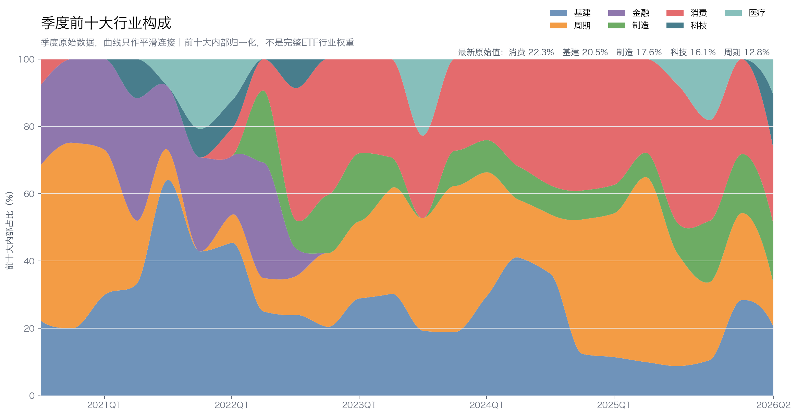
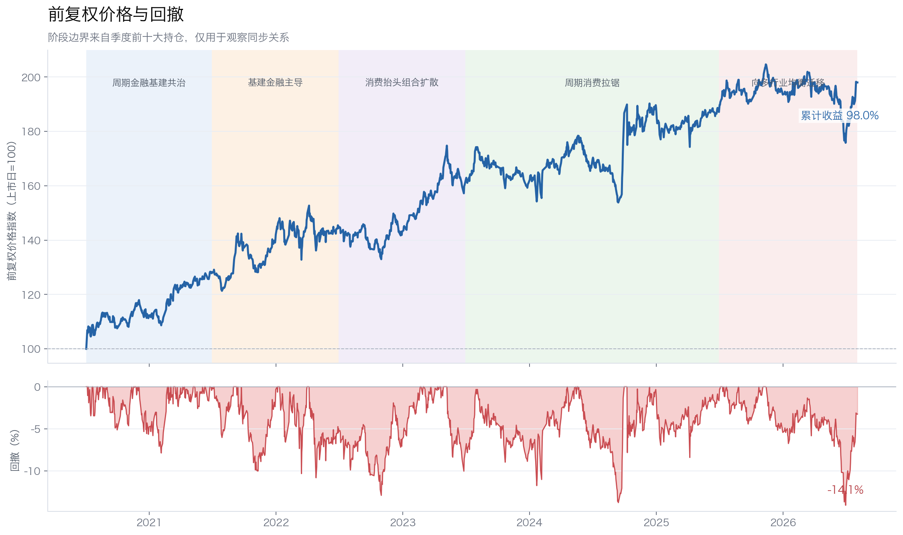
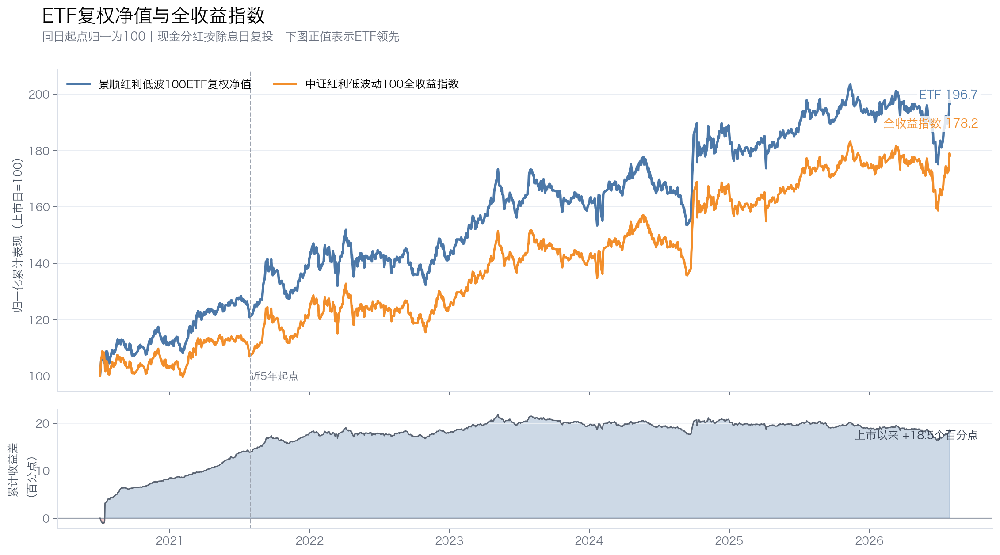
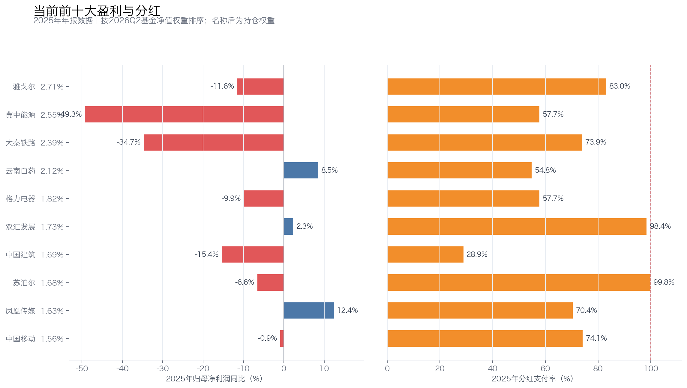

# 景顺红利低波100ETF六年持仓：行业封顶，为何挡不住弱盈利？

景顺长城中证红利低波动100交易型开放式指数证券投资基金（515100，简称“景顺红利低波100ETF”）与常见的50只红利低波ETF有一个重要区别：它持有100只股票，并给单个行业设置20%的权重上限。

这让它少了一点“单押一个行业”的味道。早期由石化、钢铁、银行和铁路共同主导，后来基建、消费、周期接连上升；到2026年二季度，前十大已经分散到消费、基建、制造、科技、医疗和周期六个大类，最大个股权重只有2.71%。

到最近阶段末，前十大已经扩展到六个行业；但这段迁移期的最大回撤仍达到14.10%。当前前十大公司的2025年利润同比加权均值为-12.80%，估算支付率加权均值接近70%。行业上限解决了集中风险，却没有自动解决市场下跌和盈利质量问题。

本文使用2020年三季度至2026年二季度的季度前十大持仓，以及2020年7月3日至2026年8月3日的前复权价格。前十大合计只占基金净值17.59%—22.91%，下文观察的是核心仓位，不是完整100只成分股的精确还原。

## 一、六年从传统价值走向多行业均衡

### 1. 起步阶段：周期、金融和基建共同主导

2020年末，周期股占前十大内部55.10%，中国石化、宝钢股份、三钢闽光、柳钢股份和兖矿能源集中出现；交通银行、中国银行、农业银行和大秦铁路构成金融、基建部分。

这时的景顺红利低波100ETF是一组估值较低、现金分红较多的传统行业。中国石化在2020年三季度占基金净值4.05%，是早期最有代表性的重仓股。

### 2. 2021年下半年：基建取代周期

2021年三季度，基建占前十大内部64.10%，上海建工、招商蛇口、塔牌集团、建发股份和浙能电力同时进入；周期降到8.84%。

这一阶段的“基建”仍是同花顺宽口径，包含铁路、高速、地产、建材和建筑。2022年二季度金融曾短暂回到第一，2022年三季度前十仍有江苏金租；从2022年四季度开始，金融股再未进入季度前十大。

### 3. 2022年下半年至2025年上半年：消费、周期和基建反复切换

2022年三季度，消费占比升至39.16%，年末达到40.50%。海澜之家、森马服饰、雅戈尔和养元饮品成为主要权重，格力电器、威孚高科等制造公司也进入前十。组合不再围绕银行和煤钢石化展开，核心仓位开始扩散。

2023年末，周期占前十大内部43.41%，中国神华、开滦股份、鄂尔多斯、南钢股份和太钢不锈都在前十；2024年中，基建又短暂升至41.04%；2025年二季度，周期再次达到54.94%。

这不是单向转向煤炭，而是煤钢化工、消费和基建反复切换。雅戈尔、双汇发展和大秦铁路构成相对稳定的底仓。

### 4. 2026年：六个行业共同进入前十

2026年二季度，前十大内部结构为：消费22.33%、基建20.52%、制造17.61%、科技16.05%、周期12.83%、医疗10.66%。

最新前十是雅戈尔、冀中能源、大秦铁路、云南白药、格力电器、双汇发展、中国建筑、苏泊尔、凤凰传媒和中国移动。最大个股雅戈尔只占基金净值2.71%，前十大合计19.88%，没有银行股。

这比2025年二季度周期占比54.94%的状态均衡得多。需要注意，20%的行业上限针对完整指数及官方行业分类，不能用前十大内部比例直接检查是否越界。

24个季度里，进入前十大次数最多的是以下6家公司：

| 公司 | 出现期数 | 最长连续期数 | 平均/最高净值权重 |
|---|---:|---:|---:|
| 大秦铁路 | 24 | 24 | 2.49%/3.52% |
| 雅戈尔 | 18 | 18 | 2.10%/2.86% |
| 中国石化 | 14 | 5 | 2.37%/4.05% |
| 双汇发展 | 13 | 13 | 1.86%/2.26% |
| 中国银行 | 8 | 8 | 1.93%/2.25% |
| 冀中能源 | 8 | 8 | 2.94%/3.49% |

大秦铁路是唯一24期全部在场的公司，雅戈尔连续出现18期，双汇发展连续出现13期。这只ETF以少数长期高股息底仓为骨架，再不断更换外围持仓。

相邻季度平均保留6.61只前十大股票。名单稳定性处于四只ETF中间位置，但行业构成比单一煤炭或银行组合更分散。

*行业比例按前十大持仓内部归一化；曲线只改变季度点之间的连接方式，没有对季度数据做移动平均。20%的行业上限需以完整指数和官方行业口径判断。*

## 二、100只股票和行业上限解决了集中风险，没有解决盈利质量

中证红利低波动100的选股链条是：**连续三年现金分红，按三年平均股息率选出300只，再挑过去一年波动较低的100只**，按“股息率÷波动率”加权，并把**单个行业权重限制在20%以内**。

100只成分和行业封顶，降低了单一银行、煤炭或地产行业控制组合的可能性。季度调样也能较快响应市场变化。

代价是规则没有直接检查利润增长、支付率、自由现金流覆盖和每股股息增长。行业上限能分散风险，却不能把盈利质量较弱的高股息公司变好。季度调样还可能增加换手。

这套规则最清楚的优势，是把“同一种行业风险押得太重”改成多个行业共同承担；最清楚的缺口，是多家公司仍可能同时面临利润下降、支付率偏高或资本开支压力。

所以，100只股票和行业封顶不等于每家公司都安全，也不等于净值不会出现两位数回撤。

## 三、持仓迁移与收益同步变化，但分散不能替代市场风险

阶段收益使用前复权收盘价。持仓只有季度前十，表格反映时间上的同步关系，不证明调仓直接导致涨跌。

| 持仓阶段 | 区间 | 累计收益 | 年化收益 | 最大回撤 |
|---|---|---:|---:|---:|
| 周期、金融、基建共治 | 2020-07-03至2021-06-30 | 27.89% | 28.17% | -7.88% |
| 基建与金融主导 | 2021-06-30至2022-06-30 | 13.44% | 13.45% | -10.83% |
| 消费抬头、组合扩散 | 2022-06-30至2023-06-30 | 11.20% | 11.21% | -10.04% |
| 周期与消费拉锯 | 2023-06-30至2025-06-30 | 15.98% | 7.69% | -13.78% |
| 向多行业均衡迁移 | 2025-06-30至2026-08-03 | 5.81% | 5.30% | -14.10% |
| 上市以来 | 2020-07-03至2026-08-03 | 97.97% | 11.88% | -14.10% |

*阶段色带来自季度前十大持仓，只表示风格变化与价格表现的时间关系，不作因果归因。*

上市早期的传统周期、金融和基建组合，反而取得了最高阶段收益：不到一年上涨27.89%，最大回撤只有7.88%。这与低估值传统行业修复在时间上重合，但无法凭季度前十精确拆分贡献。

此后几个阶段的年化收益分别为13.45%、11.21%和7.69%，但阶段长度、持仓结构和市场环境都不同，不能把收益变化归因于行业扩散。分散能够限制单一行业冲击，却不能消除市场整体下跌、估值回落和多行业同时调整。

最近一段是向多行业均衡迁移，而不是全程已经均衡：2025年二季度周期仍占前十大内部54.94%，到2026年二季度才扩展为六个行业。这段迁移期最大回撤为14.10%，发生在2025年11月12日至2026年6月30日。它不能说明“分散导致回撤”，只能说明行业数量增加不会自动换来更小的净值波动。

低波筛选看的是过去一年价格表现。遇到系统性下跌，或者此前稳定的股票一起重估，历史低波同样会失效。

## 四、上市以来领先很多，但近五年仍落后3.88个百分点

前复权价格用于观察二级市场体验。衡量基金交付，则要比较现金分红复投后的基金净值与中证红利低波动100全收益指数：

| 区间 | ETF累计收益 | 全收益指数累计收益 | ETF年化收益 | 指数年化收益 | 年化跟踪差 | 年化跟踪误差 |
|---|---:|---:|---:|---:|---:|---:|
| 上市以来 | 96.73% | 78.18% | 11.78% | 9.97% | +1.81个百分点 | 1.64% |
| 近5年 | 62.43% | 66.31% | 10.18% | 10.70% | -0.52个百分点 | 0.50% |

*上市以来区间为2020年7月3日至2026年7月31日；近5年区间为2021年7月30日至2026年7月31日。基金现金分红按除息日复投；年化跟踪差与年化跟踪误差不是同一指标。*

上市以来，基金复权净值领先全收益指数18.55个百分点，年化领先1.81个百分点。这个正差绝大部分在2021年末以前形成，不能理解为基金每年都能稳定创造超额收益。上市初期实际持仓与指数成分偏离、调仓执行和起点选择，都可能放大短期差异。

近5年更接近当前运行状态。基金累计落后全收益指数3.88个百分点，年化跟踪差为-0.52个百分点，年化跟踪误差约0.50%。基金日常走势已经较贴近指数，但长期仍会受到费用、交易、现金留存和复制偏差影响。

上市以来的高正差与近五年的负跟踪差并不矛盾。前者主要记录了上市早期的特殊阶段，后者更接近当前复制能力。

## 五、核心分红风险来自多个行业，质量却并不整齐

以下把每家公司的2025年净利润同比、ROE和估算支付率，按其2026年二季度ETF净值权重在前十大内部归一化后求加权均值。这是公司层面的风险观察值，不是ETF组合真实利润增速或整体支付率：

| 当前前十大 | 公司净利润同比加权均值 | ROE加权均值 | 支付率加权均值 |
|---|---:|---:|---:|
| 全部前十大 | -12.80% | 12.14% | 69.77% |
| 消费2只 | -6.16% | 12.90% | 89.00% |
| 制造2只 | -8.30% | 27.39% | 77.91% |
| 基建2只 | -26.73% | 5.51% | 55.26% |
| 科技2只 | 5.87% | 9.50% | 72.21% |

*左图看利润是否增长，右图看分红占利润的比例；行业分散不等于每家公司都有相同的盈利质量。*

当前前十大公司的利润同比加权均值为-12.80%，估算支付率加权均值为69.77%。这些风险来自多个行业，不会全部受煤价或净息差控制，却仍存在“利润弱、支付率高”的共同问题。

消费部分支付率约89%。雅戈尔需要拆分服装、地产和投资收益，双汇发展支付率约98%，必须依靠稳定经营现金流才能维持。制造部分ROE很高，但格力电器和苏泊尔利润都在下降，支付率分别约58%和100%。成熟业务增长放缓后，继续提高股息的空间有限。

基建部分由大秦铁路和中国建筑组成，公司利润同比加权均值为-26.73%。大秦铁路要看货运量、运价和维护资本开支；中国建筑则要看应收账款、合同资产、地产敞口和经营现金流，不能只看账面利润。

分散也带来了一些较好的来源。云南白药2025年利润增长8.51%，过去四年利润CAGR约16.42%，支付率约55%；中国移动盈利相对稳定，但通信网络仍需要持续资本开支。凤凰传媒现金流较稳，长期则要关注教材业务和出版需求。

冀中能源是最新前十大唯一煤炭股，2025年利润下降49.30%，过去四年年化下降31.23%。行业上限把煤炭集中风险控制在较小范围内，却不能保证这只股票自身的分红不下降。

当前前十大所代表的分红风险来源较分散，但不等于每家公司都高质量。规则可以在调样时替换恶化公司；由于没有利润和支付率门槛，也可能继续选中股价下跌后显得高息的公司。

## 六、适合谁持有，以及要盯住哪四个变化

景顺红利低波100ETF适合希望降低单一行业押注，同时保留A股高股息、低波暴露的投资者。但持有人仍要接受约14%的历史最大回撤，以及当前利润下降、支付率偏高的分红质量。

长期持有时，我会盯四件事。

第一，看完整指数的20%行业上限是否持续有效。前十大内部占比不能代替官方完整指数权重。

第二，看雅戈尔、双汇、格力和苏泊尔等高支付率公司的自由现金流。成熟企业可以高分红，但不能长期靠提高支付率维持股息增长。

第三，看冀中能源、大秦铁路和中国建筑的正常化利润及资本开支。行业权重较低只能限制组合损失，不能修复单只公司的盈利下滑。

第四，看季度调样是否真正改善盈利质量，以及基金能否继续贴近全收益指数。换手增加只有在换入公司质量更好时才有意义。

截至2026年8月3日，行情口径市值约60亿元，当日成交额约1.52亿元，作为ETF已有一定交易规模。但投资者不能把“100只股票、行业封顶”理解成不会回撤或分红必然增长。

这只ETF最清楚的价值，是限制单一行业押注；最清楚的局限，是分散只解决“不要押得太重”，没有回答“买到的公司是否足够好”。最近14.10%的回撤和接近70%的支付率加权均值，正是这一区别的现实提醒。

## 数据与口径

- 持仓数据：[515100季度前十大持仓代理](sources/etf-position-proxy/515100/)，覆盖2020Q3—2026Q2。行业比例为前十大内部占比，不是完整ETF行业权重。
- 指数规则采用[中证红利低波动100指数编制方案V1.2（2023年12月）](sources/index-methodologies/930955_中证红利低波动100_编制方案_V1.2_2023-12.pdf)。
- 价格数据：[515100前复权行情与阶段复算](sources/etf-hisotry-price/)，覆盖2020-07-03至2026-08-03。前复权价格考虑现金分红除权，但仍是ETF二级市场价格。
- 跟踪差数据：[基金复权净值与中证红利低波动100全收益指数同日起点复算](sources/etf-hisotry-price/515100_vs_中证红利低波动100全收益指数_跟踪差汇总.csv)，截止2026-07-31。基金现金分红按除息日复投。
- 盈利与分红数据：东方财富2025年年报及分红方案接口；支付率按每股税前分红除以基本EPS估算。
- 持仓只覆盖前十大，无法进行完整个股收益贡献、每日调仓和全行业权重归因。行业上限需以完整指数及官方行业分类判断。本文不构成投资建议。