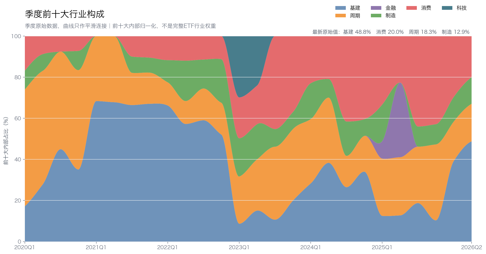
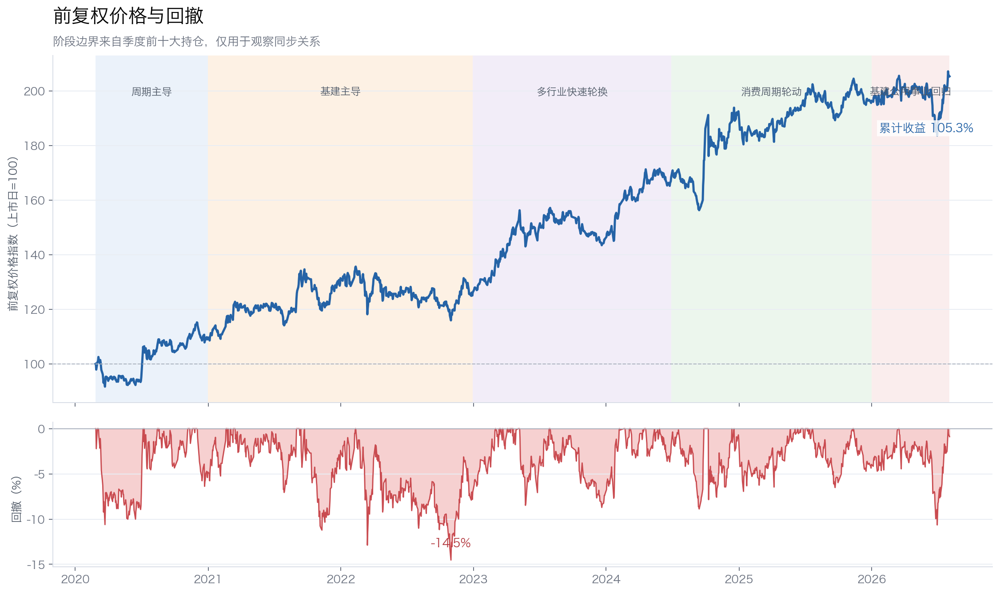
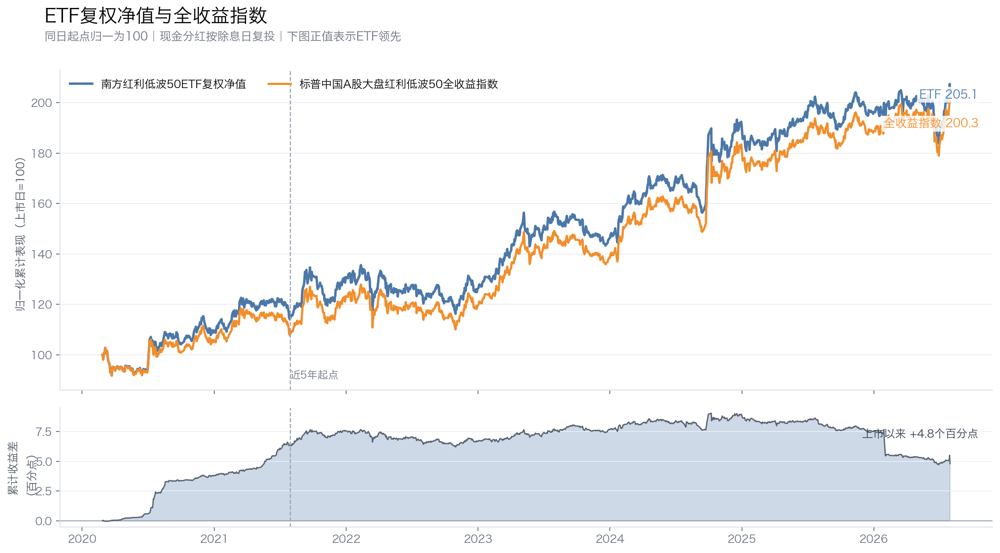
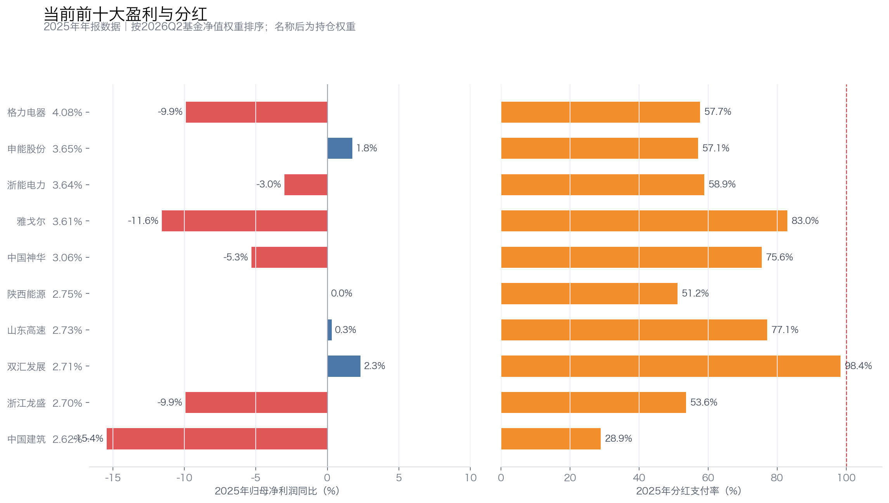

# 南方红利低波50ETF六年换芯：行业接力，是适应力还是高息陷阱？

南方标普中国A股大盘红利低波50交易型开放式指数证券投资基金（515450，简称“南方红利低波50ETF”）名字里有“大盘、红利、低波”，很容易让人想到一篮子长期不动的稳健蓝筹。

实际持仓更有变化。2020年一季度，周期股占前十大内部56.78%；2021—2022年，铁路、电力、地产和建筑成为主线；2023年通信科技短暂出现，此后消费、银行、周期和公用事业又轮流进入前十。

六年里，主导行业换了几轮，前复权价格累计上涨105.28%，最大回撤为14.52%。最强收益阶段恰逢科技、消费、周期和基建先后进入前十。问题是：这种轮换体现了规则的适应力，还是把高息陷阱延后暴露？

本文使用2020年一季度至2026年二季度的季度前十大持仓，以及2020年2月26日至2026年8月3日的前复权价格。前十大合计占基金净值28.19%—37.65%，下文观察的是核心仓位，不是完整50只成分股的精确还原。

## 一、六年换了几轮主线：钢铁石化之后，基建、消费和公用事业接力

### 1. 2020年：从钢铁石化起步

2020年一季度，周期股占前十大内部56.78%，宝钢股份、上海石化、中国石化、鞍钢股份和中国神华都在前十。年末周期仍占48.33%，但大秦铁路、浙能电力、华能水电和绿地控股已经加入，基建占比升到35.09%。

ETF从钢铁、石化和煤炭起步，随后把铁路、电力和地产链纳入核心仓位。

### 2. 2021—2022年：铁路、电力和地产链成为主线

2021年一季度，基建在前十大内部的占比升到68.35%；此后一直到2022年末，基建占比保持在52.05%—67.80%。

代表持仓包括大秦铁路、宁沪高速、浙能电力、华能水电、招商蛇口、保利发展、海螺水泥和中国建筑。同花顺的“基建”是宽口径，既包括铁路、高速、电力和建筑，也包括地产、建材，不能把它们视为完全相同的生意。

### 3. 2023—2025年：行业轮换明显加快

2023年一季度，通信科技突然进入前十：中国电信、工业富联和京东方A让科技占比升至29.86%。两个季度后，科技已经退出前十，雅戈尔、双汇发展、养元饮品和格力电器等消费制造公司接棒。

2024年三季度又出现一次大换血，前十大只保留3只，7只发生更替，消费占比升至41.60%。2025年二季度，民生银行、上海银行、南京银行和平安银行让金融短暂升到36.32%；一个季度后，四家银行全部离开前十。

银行没有成为长期主线。更准确地说，这两年是消费、周期、基建和金融快速轮换。

### 4. 2026年：公用事业和基建回归，但不是单一行业押注

2026年二季度，基建占前十大内部48.78%，对应基金净值15.39%。最新前十是格力电器、申能股份、浙能电力、雅戈尔、中国神华、陕西能源、山东高速、双汇发展、浙江龙盛和中国建筑。

这些公司横跨家电、火电、煤炭、高速、食品、化工和建筑，业务来源比单一银行或煤炭组合更分散。不过，火电、能源、交通和建筑都是资本较重的行业，风险从商品价格扩展到了电价、资本开支和负债。

26个季度里，进入前十大次数最多的是以下6家公司：

| 公司 | 出现期数 | 最长连续期数 | 平均/最高净值权重 |
|---|---:|---:|---:|
| 雅戈尔 | 22 | 20 | 3.53%/4.44% |
| 大秦铁路 | 21 | 17 | 3.61%/4.54% |
| 格力电器 | 17 | 12 | 3.38%/4.98% |
| 中国石化 | 17 | 10 | 3.95%/5.95% |
| 中国神华 | 15 | 8 | 3.79%/5.70% |
| 养元饮品 | 12 | 12 | 3.65%/4.28% |

高频榜同时包含消费、铁路、石化和煤炭，正好说明这只ETF的底仓不是单一行业。雅戈尔和大秦铁路最稳定，中国石化、中国神华和格力电器则在不同阶段提供周期与制造暴露。

相邻季度平均保留6.84只前十大股票，相当于每次更换约3.16个名额。它比易方达红利ETF的前十名单更稳定，但外围持仓一直在变。

*行业比例按前十大持仓内部归一化；曲线只改变季度点之间的连接方式，没有对季度数据做移动平均，也不代表完整ETF行业权重。*

## 二、大盘和低波筛选降低了波动，却没有锁死行业

底层指数是标普中国A股大盘红利低波50。规则可以翻译成一句话：先在A股大盘股里找高股息，再从中挑价格较稳的50只。

指数先做市值、流动性和ST排除，按最近**12个月股息率选出100只**，**每个行业最多入选20只**；再选择**过去一年波动率最低的50只**，按波动率倒数分配权重。

大盘和低波筛选降低了小盘股、流动性和短期价格剧烈波动风险。每个行业最多入选20只，也避免候选池被单一行业完全占据。

但规则没有明确要求连续多年分红、利润增长或支付率合理，而且只看最近12个月股息率。最终权重也没有严格的行业上限。某个行业当期分红高、价格又稳，仍可能集体进入核心仓位。

所以，这只ETF的“稳”主要来自大盘和历史低波筛选，以及不同高股息行业之间的替换，不是来自成分股多年不动。优势是行业有机会接力，缺口是新进入的高息公司未必有持续利润和自由现金流支撑。

## 三、最强收益阶段恰逢多行业接力，但不能据此归因

以下使用前复权收盘价。阶段边界来自前十大持仓变化，只能观察时间上的同步关系，不能证明换仓直接带来随后收益。

| 持仓阶段 | 区间 | 累计收益 | 年化收益 | 最大回撤 |
|---|---|---:|---:|---:|
| 周期主导 | 2020-02-26至2020-12-31 | 9.67% | 11.53% | -10.60% |
| 基建主导 | 2020-12-31至2022-12-30 | 15.00% | 7.25% | -14.52% |
| 多行业快速轮换 | 2022-12-30至2024-06-28 | 33.52% | 21.33% | -8.71% |
| 消费与周期轮动 | 2024-06-28至2025-12-31 | 16.62% | 10.73% | -8.75% |
| 基建、公用事业回归 | 2025-12-31至2026-08-03 | 4.54% | 7.83% | -10.64% |
| 上市以来 | 2020-02-26至2026-08-03 | 105.28% | 11.83% | -14.52% |

*阶段色带来自季度前十大持仓，只表示风格变化与价格表现的时间关系，不作因果归因。*

最强的一段是2022年末至2024年上半年，累计上涨33.52%，年化收益21.33%，最大回撤只有8.71%。这一时期通信、石化、家电、食品、煤炭和公路先后进入前十，多类高股息资产接力与上涨阶段在时间上重合，但不能证明轮换直接创造了这些收益。

最大回撤发生在2022年2月11日至10月31日，幅度为-14.52%。当时前十大仍高度偏向地产、铁路、港口、建筑和建材，回撤与地产链承压及A股整体调整在时间上重合。由于只有季度前十，不能把回撤精确归因给地产或某只股票。

2026年公用事业和基建重新上升后，ETF阶段上涨4.54%，但3月17日至6月30日仍回撤10.64%。大盘和低波筛选能降低波动，不会消除权益资产的两位数回撤。

## 四、走势贴近指数，近五年累计损耗仍达到6.05个百分点

前复权价格用于观察二级市场体验。衡量基金交付，则要比较现金分红复投后的基金净值与标普中国A股大盘红利低波50全收益指数：

| 区间 | ETF累计收益 | 全收益指数累计收益 | ETF年化收益 | 指数年化收益 | 年化跟踪差 | 年化跟踪误差 |
|---|---:|---:|---:|---:|---:|---:|
| 上市以来 | 105.08% | 100.28% | 11.83% | 11.41% | +0.41个百分点 | 0.57% |
| 近5年 | 79.19% | 85.24% | 12.37% | 13.12% | -0.75个百分点 | 0.47% |

*上市以来区间为2020年2月26日至2026年7月31日；近5年区间为2021年7月30日至2026年7月31日。基金现金分红按除息日复投；年化跟踪差与年化跟踪误差不是同一指标。*

上市以来，基金复权净值领先全收益指数4.81个百分点，年化领先0.41个百分点。这是历史交付结果，不应直接理解为可以持续复制的超额收益。实际持仓与指数成分偏离、调仓执行和上市起点选择，都可能影响早期差异。

近5年则是相反结果：基金累计落后全收益指数6.05个百分点，年化跟踪差为-0.75个百分点。年化跟踪误差只有0.47%，日常走势贴合度较高，但费用、交易、现金留存和复制偏差仍会逐年积累。

低跟踪误差和长期收益损耗可以同时存在。前者回答每天跟得像不像，后者回答多年以后少交付了多少。

## 五、核心分红来源较分散，但利润和支付率仍有压力

以下把每家公司的2025年净利润同比、ROE和估算支付率，按其2026年二季度ETF净值权重在前十大内部归一化后求加权均值。这是公司层面的风险观察值，不是ETF组合真实利润增速或整体支付率：

| 当前前十大 | 公司净利润同比加权均值 | ROE加权均值 | 支付率加权均值 |
|---|---:|---:|---:|
| 全部前十大 | -5.16% | 11.87% | 64.27% |
| 基建及公用事业5只 | -2.86% | 9.90% | 55.22% |
| 消费2只 | -5.61% | 13.62% | 89.60% |
| 周期2只 | -7.46% | 9.26% | 65.29% |
| 格力电器 | -9.89% | 20.30% | 57.70% |

*左图看利润是否增长，右图看分红占利润的比例；会计利润覆盖股息，不等于自由现金流也能覆盖。*

当前前十大公司的利润同比加权均值为-5.16%，估算支付率加权均值为64.27%。消费部分尤其明显：雅戈尔和双汇发展的加权支付率接近90%。成熟企业可以长期维持较高支付率，但前提是主业现金流稳定，不能依赖投资收益、资产处置或继续提高支付率。

公用事业和基建的支付率约55%，看起来更从容，但火电和能源公司还要投入大量资本开支。申能股份、浙能电力和陕西能源需要同时看电价、煤价、利用小时和扩张支出；山东高速要看车流量、债务及扩建；中国建筑则要看经营现金流、应收账款和地产敞口。

周期部分同样不能只看当前股息。中国神华需要区分普通分红和特别分红，并用中周期煤价检验支付能力；浙江龙盛2025年利润下降9.91%，过去四年利润也明显收缩。短期股息率高，可能同时来自盈利高点或股价下跌。

当前前十大所代表的核心分红来源比单一行业组合更分散，但规则本身缺少利润和支付率约束。这些核心持仓的股息能否延续，一部分取决于公司自由现金流，另一部分取决于指数能否及时替换分红恶化的公司。

## 六、适合谁持有，以及要盯住哪四个变化

南方红利低波50ETF更适合愿意接受行业轮换、重资本行业暴露和约15%历史最大回撤，同时看重多行业接力能力的投资者。如果希望持仓多年不变，或者把“大盘低波”理解成不会出现两位数回撤，它并不合适。

长期持有时，我会盯四件事。

第一，看公用事业和基建的自由现金流是否覆盖分红与资本开支。火电、能源、交通和建筑都有较重的再投资负担。

第二，看雅戈尔、双汇等高支付率公司有没有真实利润支撑。支付率接近90%后，利润下降会很快压缩分红余量。

第三，看年度调样是否把“股价跌出来的高息股”带进组合。规则只看最近12个月股息率，没有利润增长和支付率门槛。

第四，看多行业轮换能否继续，以及基金能否继续贴近全收益指数。过去最强收益阶段与多个行业轮换同步，不代表未来每次换挡都能成功。

截至2026年8月3日，行情口径市值约199亿元，当日成交额约1.40亿元，二级市场交易规模不小。但它仍是一只会换行业、会出现两位数回撤的权益ETF，不能当作固定收益替代品。

六年持仓说明，这只ETF最有价值的特征不是“永远持有同一批稳健蓝筹”，而是大盘、红利和低波规则不断寻找新的成熟现金流资产。过去最强收益阶段与行业接力同步；当前公用事业和基建回归，则在检验这种接力能否避开高资本开支和利润下降的拖累。

## 数据与口径

- 持仓数据：[515450季度前十大持仓代理](sources/etf-position-proxy/515450/)，覆盖2020Q1—2026Q2。行业比例为前十大内部占比，不是完整ETF行业权重。
- 指数规则采用[标普低波动高股息指数系列编制方案（2025年6月17日存档）](sources/index-methodologies/SPDJI_标普低波动高股息指数系列_编制方案_2025-06-17存档.pdf)。
- 价格数据：[515450前复权行情与阶段复算](sources/etf-hisotry-price/)，覆盖2020-02-26至2026-08-03。前复权价格考虑现金分红除权，但仍是ETF二级市场价格。
- 跟踪差数据：[基金复权净值与标普中国A股大盘红利低波50全收益指数同日起点复算](sources/etf-hisotry-price/515450_vs_标普中国A股大盘红利低波50全收益指数_跟踪差汇总.csv)，截止2026-07-31。基金现金分红按除息日复投。
- 盈利与分红数据：东方财富2025年年报及分红方案接口；支付率按每股税前分红除以基本EPS估算。
- 持仓只覆盖前十大，无法进行完整个股收益贡献、每日调仓和全行业权重归因。“新进、退出”不代表买入、卖出或清仓。本文不构成投资建议。