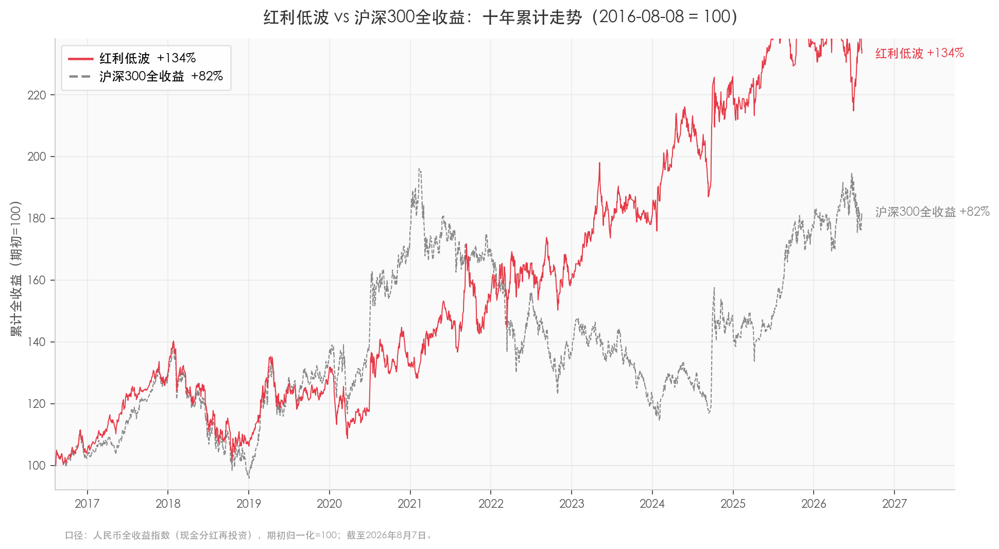
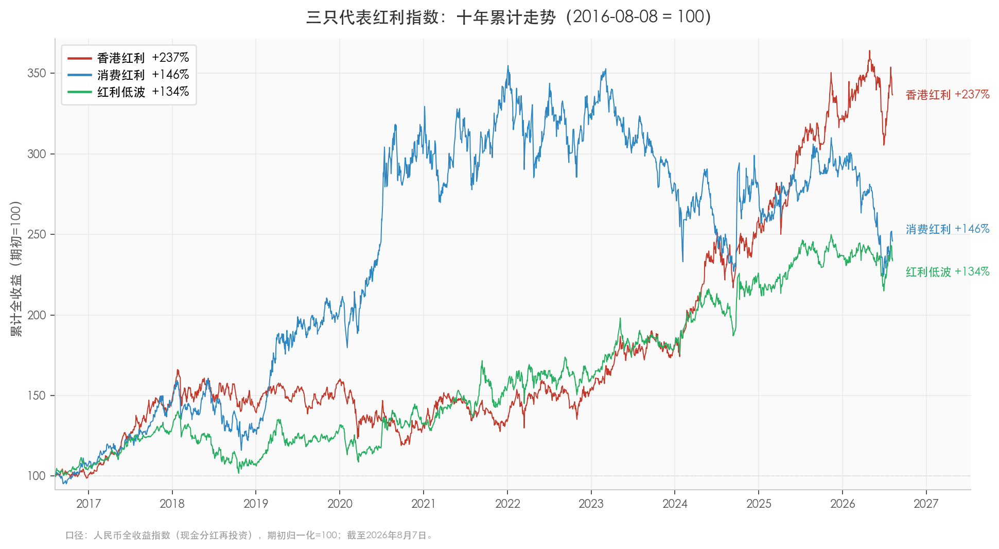

# 30只红利指数，十年能差一倍：普通投资者怎么选

同样拿十年，同样买的是名字带"红利"的指数基金，1万块成本——最高的东证红利低波变成3.1万，最差的300红利低波只有2万出头。而市场名气最大的中证红利，179亿规模的ETF，十年成绩在30只红利指数里只排第21名。

"红利指数"四个字背后，藏着远比名字大得多的差异。有的帮你挑股息高的，有的还帮你检查公司质量，有的干脆押注单一行业。买之前不看规则，只认名字和规模，是红利投资最容易踩的坑。

本文对比**30只中证官网有基金追踪的红利类指数**，回答一个问题：普通人想靠分红慢慢变富，该选哪只、避开哪只。数据采用全收益口径（分红算作再投资，而不是拿走现金），截止2026年8月7日。文中"近10年"指2016年8月8日至2026年8月7日，"近3年"指2023年8月8日至今，年化收益按精确天数复算——窗口差几天、截止日差几天，数字会有一点点出入，这不影响结论。

## 一、先分享个观点：为什么慢公司反而赢

沃顿商学院教授西格尔在《投资者的未来》里做过一个著名研究：追踪1957到2003年标普500的原始成分股，46年间回报最高的不是IBM，而是一家石油公司——新泽西标准石油，后来的埃克森美孚。一家被认为"没有增长"的公司，靠便宜的股价和持续的股息，跑赢了整个计算机革命。

西格尔把这叫"增长率陷阱"：市场为高增长预期付出过高价格，一旦增长不及预期，估值和盈利双杀；而慢速增长行业里的龙头，预期低、估值便宜、股息稳定，熊市里股息还能买到更多份额，长期复利反而赢了。

红利指数赚的正是这个钱：股息复利加估值回归，不是暴涨。它的长期回报可以拆成一句话——股息率加股息增长率，再加减估值变动，对大多数公司来说，股息贡献了大头。

这个规律在A股同样成立。把代表"慢公司"的红利低波指数和代表大盘的沪深300放在一起（都是全收益口径，分红算作再投资，期初归一为100）：

十年下来，慢指数不仅赢了，而且赢得稳。红利低波年化8.86%、累计涨134%，沪深300全收益年化6.18%、累计涨82%——同样投1万块，一个变成2.3万，一个变成1.8万。稳在哪：9个完整年度里，红利低波只有1年亏损（2018年，-17.5%），沪深300有4年亏损，其中2021到2023年连亏三年；最大回撤一个-27.5%、一个-41.6%。2018年大盘跌近25%，它只跌17%；2022年大盘跌近20%，它反而涨了1.8%。而且这两条线没有一天是回测：红利低波2013年就发布了，十年全是实盘。当然它也输过——2019、2020年核心资产牛市和2025年，大盘都跑赢了它。慢公司赢的是复利，不是每个年头。

但高股息不等于好策略，有个必须补的限定：股息率高也可能是坏消息。股价在暴跌会推高股息率，公司盈利在衰退会减少分红，正处周期利润高点的公司可能发一次性大红包。所以红利指数里才衍生出低波、质量、成长这些叠加因子——光看股息率不够，还要确认这些分红真的能持续。

## 二、红利指数有六张脸

30只指数按编制规则分六类，先搞清楚你要哪一类，再谈选哪只：

| 分类 | 只数 | 一句话逻辑 | 代表指数 |
|---|---:|---|---|
| 经典红利 | 17 | 只挑股息率高的，最基础形态 | 中证红利、上证红利、香港红利 |
| 红利低波 | 6 | 高股息里再挑"走路稳的" | 红利低波、东证红利低波 |
| 红利质量 | 3 | 高股息里再查"公司好不好" | 红利质量、中证红利质量 |
| 红利成长 | 2 | 还要"公司还在增长" | SHS红利成长LV |
| 红利价值 | 1 | 叠加便宜估值 | 红利价值 |
| 行业主题 | 1 | 只买一个行业 | 消费红利 |

一句话记住：低波管"持有过程颠不颠"，质量管"分红能不能持续"，行业主题管"会不会押注单一行业"。先想清楚你要哪一类，再谈选哪只。

## 三、十年成绩单：A股和港股，分开看

为什么要分开？A股和港股的年度节奏几乎错位：2019到2020年核心资产牛市，A股红利涨、港股红利跑输；2024年反过来，港股红利大涨四成。混在一起比"每年稳不稳"，比的其实是市场，不是指数。

下图是香港红利、红利低波、消费红利三条线的十年路径，节奏错位一目了然：

先交代清楚为什么下面只列这几只。30只里先排除两类：2022年后发布的新指数（十年业绩大部分是回测，见第四节）和跟踪产品太小的（ETF不足2亿、场外基金不足5亿，买起来流动性差）。筛完剩A股12只、港股4只。港股4只全列在下面；A股12只里表格只挑最有代表性的7只——前四名、最老牌的上证红利、名气最大的中证红利、垫底的消费红利。想看完整12只排名的，见文末指路的主榜文档。

**A股榜（12只中的7只代表）**

| 指数 | 一句话 | 10年年化 | 近3年年化 | 月频波动 | 最大回撤 | 亏损年/十年 |
|---|---:|---:|---:|---:|---:|---:|
| 东证红利低波 | 红利+低波+极度分散 | 11.91% | 9.02% | 14.4% | -22.8% | 1 |
| SHS红利成长LV | 红利+成长+低波，三地选股 | 9.67% | 11.25% | 13.6% | -26.2% | 2 |
| 上国红利 | 国企红利，国企板块代表 | 9.85% | 10.44% | 15.9% | -23.3% | 3 |
| 红利低波 | 最经典的低波，流动性最好 | 8.86% | 7.65% | 15.8% | -27.5% | 1 |
| 上证红利 | 2005年发布，20年实盘 | 7.81% | 8.73% | 15.4% | -23.4% | 2 |
| 中证红利 | 最出名，十年排21 | 8.28% | 6.93% | 15.3% | -27.1% | 2 |
| 消费红利 | 近三年还在亏 | 9.42% | -8.31% | 22.3% | -36.9% | 4 |

两个提示：表格前两名的东证红利低波和SHS红利成长LV，目前都只有场外指数基金、没有场内ETF。场外基金比ETF贵在两点：一是费率更高（管理费加托管费普遍高零点几个百分点），二是必须保留约5%现金应对日常申赎、这部分钱不参与投资。实测差距不小：东证红利低波的跟踪基金（012708）成立近5年，指数年化10.65%、基金只有8.87%；SHS的（007751）更明显，指数年化11.28%、基金只有8.75%（还叠加了跨境因素）。而场内ETF的跟踪差基本在1个百分点以内（红利低波512890近5年年化只落后指数0.8个百分点）。年复一年，这一两点的差距会滚成不小的差额——在意费率、想尽量满仓吃到指数收益的话，场内ETF是更划算的载体。

A股榜有三个反直觉的地方：

第一，东证红利低波断层第一，十年里只有1个亏损年，综合分领先第二名15分——但大多数散户没听过它。它是2020年才发布的定制指数，跟踪产品是场外基金而不是ETF，规模65亿，存在感远不如那些大牌ETF。

第二，中证红利最出名，十年、三年排名却都在20名开外。它跟上证红利十年成绩其实差不多，只是名气太大容易被高估——编制规则老（只按股息率选股），"最知名"和"最好"是两回事。

第三，消费红利十年总收益不差，但几乎全靠2019到2020那一轮消费牛（当年涨了137%），之后一路回吐，近三年年化-8.31%，是所有红利指数里唯一还在亏钱的。行业100%押在消费上，波动率22%，是最不该当"红利"买的红利指数。

**港股榜（4只）**

| 指数 | 一句话 | 10年年化 | 近3年年化 | 月频波动 | 最大回撤 | 亏损年/十年 |
|---|---:|---:|---:|---:|---:|---:|
| 香港红利 | 港股高息代表 | 12.91% | 23.46% | 16.8% | -28.4% | 2 |
| 港股通高股息 | 港股通里挑高股息 | 13.35% | 17.75% | 20.5% | -30.2% | 3 |
| 港股通央企红利 | 港股央企 | 9.02% | 18.35% | 18.4% | -30.3% | 2 |
| 港股通高息精选 | 港股高息精选 | 8.46% | 11.08% | 19.2% | -36.6% | 2 |

港股榜要重点说香港红利：近三年年化23.46%，全市场最高，1万变1.88万。但它的代价必须讲清楚——2019年涨10.6%、2020年跌16.6%、2021年只涨1.2%，连续三年跑输绝大多数同类。如果你2021年初买入，要忍到2024年才真正赚钱。港股红利近五年的超额收益，很大一部分来自2021年低点之后的估值修复，这种修复不会每年发生。

## 四、新指数先别急：回测好看不等于能买

2024到2025年，红利指数扎堆发布：A500红利低波、智选高股息、中证红利质量……它们展示的十年业绩，大部分是回测——用今天的规则倒算历史，相当于考试前就看过答案。

差距有多大？拿A500红利低波举例：全窗口年化13.69%，把回测段剥掉、只看实盘，只有7.61%——差了6个百分点，直接从优等生掉到中等生。

前车之鉴是红利质量：2020年5月发布，回测年化比实盘高11.89个百分点，是30只里落差最大的之一；实盘后连续4年跑输同期主流的红利低波指数（上面表格里那只），3年排名跌到30只倒数第二。

所以看到任何新指数的"十年业绩"，先查发布日期。发布越晚，回测占比越高，越要打一个大折扣。等它们实盘跑满三五年、经历过一轮完整牛熊，再评估不迟。

## 五、怎么选：先问自己怕什么

- **想要最稳、能定投的**：东证红利低波（十年只有1个亏损年，路径最平稳，场外基金65亿适合定投）、红利低波（512890，324亿规模，场内流动性最好，适合大资金随时进出）
- **想要港股弹性、能忍三年跑输的**：香港红利（收益最高但路径颠，2019-2021连续三年跑输）、港股通高股息（513530，42.7亿，港股红利里可投资性最好）
- **想要成长+红利平衡的**：SHS红利成长LV（007751，场外基金、无场内ETF，十年、三年都没明显短板，覆盖A股和港股）
- **只认老牌、不想研究新策略的**：上证红利（510880，2005年发布，20年实盘）——它和中证红利十年成绩几乎一样；想覆盖两市、更分散就选中证红利（515180），两者都不踩坑
- **要避开的**：消费红利（近三年还在亏）、所有回测占大头的新指数

## 六、四个反直觉的发现

1. 最出名的成绩没进前十。中证红利ETF 179亿，是市场最知名的红利产品，十年、三年排名却都在20名开外。
2. "质量因子"还没在A股证明自己。三只红利质量指数没有一只能进A股榜前列，红利质量实盘后连续4年跑输——逻辑听着高级，效果要打问号。
3. 规模最大的ETF，不跟踪业绩最好的指数。红利低波ETF 324亿，指数只排第4；东证红利低波排第1，只有65亿场外基金。基金公司倾向跟踪发布早、名气大的指数，不是业绩最好的。
4. 同名"红利低波"，差距悬殊。东证红利低波断层第一，300红利低波扣17分沉到倒数——差在选股范围和加权方式，名字只说明因子，不说明好坏。

## 七、最后提醒

红利指数赚的是股息复利和估值回归，不是暴涨，它不会让你一年翻倍。历史业绩也不预测未来：过去十年A股恰好是价值风格占优的一段，如果风格切回成长，红利策略可能持续跑输。

港股红利的超额有估值修复成分，修复不会年年发生。任何单只指数都有风格集中的风险——东证红利低波金融占一半，港股类金融加能源也占一半。选2到3只不同风格的指数分散持有，比押注单只更稳妥。

数据来源为中证指数官网（全收益指数、历史行情、持仓接口），评分方法和30只全量排名见下方附录。

---

## 附录：评分方法与30只全量排名

### 评分方法

- 回报类型：人民币全收益指数，现金分红算作再投资
- 窗口：10年（2016年8月8日起）、3年（2023年8月8日起）
- 打分：相对排名百分位制——每只指数按单项指标在30只里的名次转成0-100分，再乘权重相加

| 维度 | 权重 | 核心指标 |
|---|---:|---|
| 收益能力 | 40% | 年化收益（CAGR） |
| 风险控制 | 30% | 最大回撤50% + 月频波动50% |
| 收益波动比 | 15% | 年化收益 ÷ 月频波动 |
| 稳定性 | 15% | 年度胜率60% + 滚动3年中位数40% |

主榜的筛选与扣分：

1. 先过滤：回溯占比≤50%且实盘≥5年（否则进观察池）；跟踪产品ETF≥2亿或场外基金≥5亿（否则剔除）
2. 再分池：A股12只、港股4只，分开排名（A股港股年度节奏错位，混比会惩罚市场本身）
3. 加权分 = 10年总分×70% + 3年总分×30%
4. 逐年扣分：负收益年超过1年的，每超1年扣3分；连续池内垫底（A股后1/3、港股末位）2年扣4分、3年及以上扣8分

观察池：7只2022年后发布的新指数，十年数据中回溯占比61%-87%，回测成绩不作数、不参与排名，等实盘验证后再评估。

### 30只全量排名（10年回溯完整表）

| 排名 | 指数 | 总分 | 总收益 | CAGR | 月频波动 | 最大回撤 | 收益波动比 | 年度胜率 | 滚动3年中位数 |
|---:|---|---:|---:|---:|---:|---:|---:|---:|---:|
| 1 | 东证红利低波/931446 | 91.0 | 207.92% | 11.91% | 14.36% | -22.79% | 0.83 | 8/9 | 12.54% |
| 2 | A500红利低波/932422 | 80.1 | 162.43% | 10.13% | 14.25% | -18.55% | 0.71 | 7/9 | 10.17% |
| 3 | 智选高股息/932305 | 77.7 | 184.77% | 11.04% | 15.48% | -26.99% | 0.71 | 8/9 | 10.60% |
| 4 | 上红低波/H50040 | 73.9 | 161.01% | 10.07% | 15.02% | -26.91% | 0.67 | 8/9 | 11.88% |
| 5 | 香港红利/H11140 | 72.9 | 236.60% | 12.91% | 16.83% | -28.42% | 0.77 | 7/9 | 10.68% |
| 6 | SHS红利成长LV/931157 | 71.8 | 151.71% | 9.67% | 13.63% | -26.16% | 0.71 | 7/9 | 9.08% |
| 7 | 中证红利质量/932315 | 71.3 | 270.00% | 13.98% | 18.87% | -27.97% | 0.74 | 6/9 | 14.09% |
| 8 | 上国红利/000151 | 65.3 | 155.69% | 9.85% | 15.87% | -23.29% | 0.62 | 6/9 | 9.49% |
| 9 | 央企红利50/931231 | 61.0 | 138.65% | 9.48% | 16.53% | -24.00% | 0.57 | 7/9 | 10.39% |
| 10 | 港股通高股息/930914 | 59.6 | 250.06% | 13.35% | 20.53% | -30.17% | 0.65 | 6/9 | 7.12% |
| 11 | 红利质量/931468 | 59.4 | 220.06% | 12.34% | 20.46% | -30.35% | 0.60 | 6/9 | 12.02% |
| 12 | 国企红利/000824 | 58.1 | 143.62% | 9.32% | 16.06% | -26.79% | 0.58 | 8/9 | 9.07% |
| 13 | 高息策略/H30366 | 56.3 | 126.06% | 8.50% | 14.57% | -24.71% | 0.58 | 8/9 | 7.12% |
| 14 | 红利低波/H30269 | 51.7 | 133.57% | 8.86% | 15.79% | -27.53% | 0.56 | 8/9 | 10.54% |
| 15 | SHS高股息/930917 | 51.4 | 162.93% | 10.15% | 17.32% | -31.61% | 0.59 | 6/9 | 5.84% |
| 16 | 300红利/000821 | 49.7 | 131.63% | 8.77% | 15.77% | -24.86% | 0.56 | 7/9 | 7.46% |
| 17 | 诚通央企红利/931132 | 49.7 | 132.79% | 9.20% | 16.84% | -27.34% | 0.55 | 7/9 | 10.78% |
| 18 | 央企股东回报/932039 | 46.5 | 118.61% | 8.49% | 15.86% | -24.13% | 0.53 | 7/9 | 9.05% |
| 19 | 红利低波100/930955 | 44.1 | 108.01% | 7.60% | 14.40% | -26.17% | 0.53 | 8/9 | 9.14% |
| 20 | 红利潜力/H30089 | 43.4 | 168.23% | 10.37% | 20.35% | -33.10% | 0.51 | 5/9 | 7.63% |
| 21 | 中证红利/000922 | 42.7 | 121.45% | 8.28% | 15.28% | -27.08% | 0.54 | 7/9 | 8.32% |
| 22 | 上证红利/000015 | 39.5 | 112.11% | 7.81% | 15.43% | -23.39% | 0.51 | 7/9 | 8.00% |
| 23 | 国新港股通央企红利/931722 | 38.9 | 132.41% | 9.18% | 17.95% | -38.79% | 0.51 | 7/9 | 14.84% |
| 24 | 央企红利/000825 | 35.7 | 117.39% | 8.08% | 15.42% | -26.47% | 0.52 | 6/9 | 6.80% |
| 25 | 红利价值/H30270 | 34.1 | 120.70% | 8.24% | 16.29% | -28.70% | 0.51 | 8/9 | 10.09% |
| 26 | 消费红利/H30094 | 33.1 | 145.90% | 9.42% | 22.31% | -36.91% | 0.42 | 5/9 | 15.80% |
| 27 | 港股通央企红利/931233 | 32.9 | 137.01% | 9.02% | 18.43% | -30.31% | 0.49 | 7/9 | 6.47% |
| 28 | 300红利低波/930740 | 31.4 | 103.92% | 7.39% | 14.17% | -27.39% | 0.52 | 5/9 | 7.54% |
| 29 | 港股通高息精选/930839 | 23.5 | 125.23% | 8.46% | 19.24% | -36.56% | 0.44 | 7/9 | 7.33% |
| 30 | 中华预期高股息/CESFHY | 3.3 | 25.61% | 3.24% | 26.17% | -50.01% | 0.12 | 3/6 | -3.22% |

> 数据与评分方法同源于完整版报告，见 [红利指数10年对比_分市场主榜与观察池.md](https://github.com/nightsleon/investment/blob/main/上证官网红利指数大比拼/01_主报告/红利指数10年对比_分市场主榜与观察池.md)。
