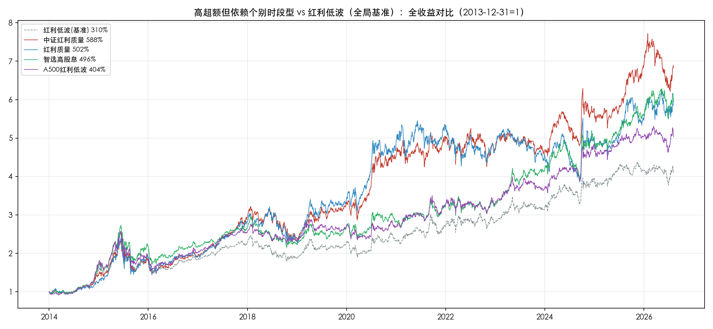
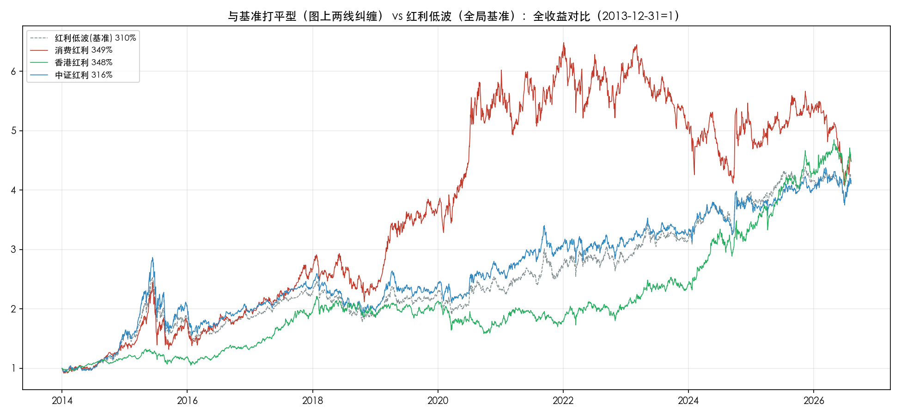
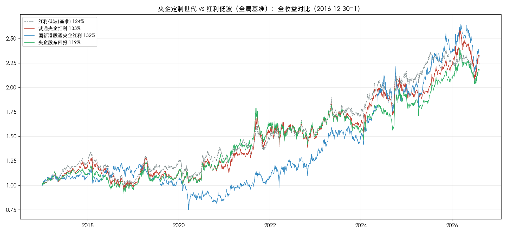

# 红利指数世代回溯：统一起点下的收益与风险画像

> 本报告为独立视角分析：按**指数基日**将22只可投资红利类指数（已剔除跟踪产品规模偏小的8只：300红利、上红低波、中华预期高股息、国企红利、央企红利50、红利潜力、高息策略、SHS高股息--最后一只仅有0.65亿LOF，复核后补剔）分为三个世代，**组内统一到该组最晚基日**起算至2026-08-07的全收益表现（人民币计价，现金分红再投资）。
>
> 本报告只做回溯描述，不做评价排名（表内按总收益倒序排列仅为展示顺序），不做未来预判。

## 怎么看懂这张表：指标通俗说明

- **总收益**：起点到终点一共涨了多少。投入1万元，期末变多少钱的直接答案（如348.3%即1万变4.48万）
- **全程CAGR**：组内统一起点到终点的年化复利收益。因为各组时长不同（12.6年/11.7年/9.6年），跨时长比较主要看这列而不是总收益
- **近3年CAGR**：只看2023-08-08至今这3年的年化收益。和全程CAGR放在一起，能看出"长期收益与近期收益是否同向"--有的指数长期强近期弱（动量衰减），有的反过来（风格轮动到位）
- **全程年化波动**：统计区间内日收益率的标准差×√242年化，数字越大越颠簸。可以粗略理解为：典型年份的实际回报大概率落在"年化收益±波动"的范围内。与中证官网指数快照同口径，可验证
- **近3年波动**：只统计2023-08-08以来（近3年）的年化波动。和全程波动放在一起看，能发现"现在比过去更颠还是更稳"
- **最大回撤**：历史上从最高点跌到最低点的最大跌幅。买在山顶最多亏多少的答案，是"拿得住"的第一道心理关口
- **收益波动比**：CAGR÷全程波动。每承受1份颠簸换来多少年化收益，越高越划算（思路同夏普比率）
- **年度胜率**：完整年度中上涨年份的占比。如10/12即12个完整年度里10年上涨
- **滚3中位**：把历史切成所有可能的"买入后持有3年"窗口（月频滑动），算每个窗口的年化收益后取中位数。含义是"随机挑一个月买入、拿3年，典型能拿到多少年化"。中位数不受极端窗口（如恰好买在顶点）拉偏

## 数据与口径说明

- 样本：30只红利指数池中过滤跟踪产品规模偏小者后剩22只（复核确认：ETF≥2亿或场外≥5亿达标，LOF不计入）
- 数据：中证指数官网 `index-perf` 接口，全收益（TR）指数日收盘
- **组内统一起点**：2013前组从2013-12-31、港股通组从2014-11-14、央企定制组从2016-12-30起算（即该组最晚基日），终点统一2026-08-07。组内窗口完全一致，总收益可直接比较
- 年化波动均为日频口径（√242），与中证官网快照一致；"全程"为组内统一起点至今，"近3年"为2023-08-08至今
- 年度胜率：起算年次年至2025年的完整年度正收益占比（2026年不完整不计入）
- 回溯占比：分析窗口内指数尚未发布（回测）的部分占比，起点=该组统一起点。例如2013前组8只指数发布日早于2013-12-31，整段窗口均为实盘，回溯0%；港股通组与央企定制组起点即基日，但**起点即基日≠发布即起点**--这两组指数普遍先定基日回算历史、后正式发布（发布日晚于基日1-4年），故仍有回测段（港股通组13%-38%、央企定制组61%-70%）
- 分组依据为基日：基日≤2013-12-31为"2013前世代"；基日=2014-11-14为"港股通世代"；基日=2016-12-30为"央企定制世代"

## 世代划分的由来

三个基日不是随机分布，各有时代背景：

- **2013前世代（15只）**：基日散布于2004-2013年，多为2004-12-31与2005-12-30（中证体系早期统一基期）及2008-2013年个别时点。本组统一从最晚基日2013-12-31起算，窗口约12.6年
- **港股通世代（4只，基日2014-11-14）**：沪港通2014-11-17开通，港股通标的名单自此时才存在。本组原5只，其中SHS高股息因跟踪产品仅0.65亿LOF（不达标）被剔除，剩4只（SHS红利成长LV、港股通高股息、港股通高息精选、港股通央企红利）基日统一锚定开通前最后一个交易日（周五），基点3000点（港股通央企红利为1000点）。窗口约11.7年
- **央企定制世代（3只，基日2016-12-30）**：中证与国资委旗下资本运营公司（诚通、国新）合作的央企定制系列，统一以2016年末为基期。窗口约9.6年

## 一、2013前世代（15只，统一起点2013-12-31）

| 指数/代码 | 总收益 | 全程CAGR | 近3年CAGR | 全程波动 | 近3年波动 | 最大回撤 | 收益波动比 | 年度胜率 | 滚3中位 | 基日 | 回溯 |
|---|---:|---:|---:|---:|---:|---:|---:|---:|---:|---:|---:|
| 中证红利质量/932315 | 588.3% | 16.54% | 11.10% | 21.21% | 17.58% | -37.64% | 0.78 | 9/12 | 15.49% | 2013-12-31 | 83% |
| 东证红利低波/931446 | 535.9% | 15.81% | 9.02% | 18.47% | 14.16% | -37.72% | 0.86 | 10/12 | 13.13% | 2009-12-31 | 50% |
| 红利质量/931468 | 502.3% | 15.32% | 6.88% | 22.87% | 20.76% | -39.02% | 0.67 | 9/12 | 15.84% | 2004-12-31 | 51% |
| 智选高股息/932305 | 495.6% | 15.21% | 13.41% | 18.99% | 16.16% | -37.28% | 0.80 | 10/12 | 10.80% | 2005-12-30 | 85% |
| A500红利低波/932422 | 403.6% | 13.69% | 8.74% | 18.28% | 13.29% | -39.28% | 0.75 | 10/12 | 11.07% | 2013-12-31 | 89% |
| 消费红利/H30094 | 349.5% | 12.67% | -8.31% | 23.87% | 20.15% | -46.17% | 0.53 | 8/12 | 18.58% | 2005-12-30 | 0% |
| 红利低波100/930955 | 348.5% | 12.65% | 4.60% | 18.86% | 14.53% | -38.74% | 0.67 | 11/12 | 9.49% | 2005-12-30 | 27% |
| 香港红利/H11140 | 348.3% | 12.65% | 23.46% | 16.63% | 17.88% | -28.42% | 0.76 | 10/12 | 14.34% | 2004-12-31 | 0% |
| 300红利低波/930740 | 322.5% | 12.12% | 6.38% | 18.11% | 12.73% | -34.54% | 0.67 | 8/12 | 8.65% | 2004-12-31 | 39% |
| 中证红利/000922 | 315.6% | 11.97% | 6.93% | 20.09% | 15.18% | -45.66% | 0.60 | 9/12 | 8.41% | 2004-12-31 | 0% |
| 红利低波/H30269 | 310.2% | 11.85% | 7.65% | 19.35% | 14.73% | -42.49% | 0.61 | 11/12 | 10.84% | 2005-12-30 | 0% |
| 上国红利/000151 | 302.1% | 11.68% | 10.44% | 19.92% | 16.83% | -42.70% | 0.59 | 8/12 | 10.24% | 2009-06-30 | 0% |
| 红利价值/H30270 | 297.3% | 11.57% | 8.72% | 20.30% | 15.42% | -40.99% | 0.57 | 10/12 | 10.09% | 2005-12-30 | 0% |
| 上证红利/000015 | 248.2% | 10.41% | 8.73% | 19.89% | 15.68% | -46.54% | 0.52 | 9/12 | 8.41% | 2004-12-31 | 0% |
| 央企红利/000825 | 244.6% | 10.32% | 9.08% | 19.78% | 15.39% | -45.66% | 0.52 | 7/12 | 7.38% | 2008-12-31 | 0% |

**组内图景：**

- 统一起点后组内可比性大幅提高：12.6年同窗口下，总收益从588.3%（中证红利质量）到244.6%（央企红利）相差2.4倍，CAGR从16.54%到10.32%相差6.2个百分点
- 头部有明显共性：前五名中四只回溯占比51%-89%（中证红利质量83%、智选高股息85%、A500红利低波89%、红利质量51%），高收益中含较多回测成分；组内8只指数整段窗口均为实盘（回溯0%），其中发布最早、实盘验证最久的上证红利恰好垫底区间--回测段的乐观倾向在组内对比中清晰可见
- **东证红利低波是组内"收益风险比"最优解**：CAGR 15.81%第二、波动18.47%低位、收益波动比0.86全组第一，且发布日至今约6.3年实盘（回溯50%）。**但可投资性是明显短板**：跟踪产品仅1只（东方红中证红利低波动012708，场外指数基金、非ETF，规模65.11亿，2021-12-30成立），年化跟踪误差1.78%虽在合格线内，但成立至今累计跟踪差达-10.65%（费用与现金拖累，年化约-1.8pp）——指数画像与可买到手的实际收益之间存在系统性落差
- 近3年波动普遍低于全程波动（红利风格近三年整体趋稳）：典型如300红利低波全程18.11%->近3年12.73%、A500红利低波18.28%->13.29%。仅香港红利一只反向（16.63%->17.88%）；中证红利质量降幅最小（21.21%->17.58%）但绝对值仍组内最高
- 香港红利是组内风控异类：最大回撤-28.42%全组最浅，波动16.63%全组最低，但近3年波动反升至17.88%（2021-2022港股深调+2024年暴力反弹的颠簸仍在近3年窗口内）

### 2013前世代 vs 全局基准（红利低波）

以红利低波（H30269）为基准（12.6年总收益310.2%），统一起点2013-12-31归一化对比。按"超额收益+年度胜负+回撤差"读图，14只分四类（单指对比图已归档 `01_主报告/世代对比图/`）：

**稳定跑赢型（超额多且逐年常胜）**

- **东证红利低波**：总收益535.9%（超额+225.7pp），CAGR差+4.0pp，12个完整年度胜基准9年--组内唯一"超额多+过半年份赢"的指数，赢的分散（不是靠个别年份）。回撤-37.7%还比基准浅5pp，图中红线几乎全程压着灰线走
- **红利低波100**：348.5%（+38.3pp），胜基准7/12，回撤-38.7%略浅。同为"红利低波"策略但样本更广（100只 vs 基准50只），小幅稳定占优

**原因简析**：两只都是"红利+低波"双因子。低波因子在2018年（贸易战+去杠杆）单边熊市和2021-2023年震荡市中天然抗跌——低波动股票跌市里跌得少；红利因子在2021年下半年起的高股息行情（煤炭、银行领涨）中持续受益。东证红利低波还叠加质量偏好（编制方偏好盈利稳定的公司），2017年"漂亮50"白马牛、2021年后的红利低波风格期都有超额，所以赢的年份分散、不靠单一事件。

**高超额但依赖个别时段型**

- **中证红利质量**：588.3%（+278.1pp）超额第一，但胜基准仅约6/12（完整年度）--大额超额集中在2017（+28.0pp）、2020（+34.7pp）、2019（+16.5pp）、2025（+14.8pp）几个质量因子大年，且2021-2024连续四年跑输基准，其余年份互有胜负
- **红利质量**：502.3%（+192pp），胜基准6/12，大额超额集中在2015（+36.7pp）、2020（+41.3pp）、2019（+24.7pp）、2017（+23.0pp）四年，2021-2024连续四年跑输--超额全部来自2015-2020质量因子行情段，2021年后曲线斜率明显放缓（近3年CAGR 6.9% vs 基准7.7%）
- **智选高股息**：495.6%（+185pp），胜基准6/12，但回溯占比85%，超额几乎全部来自发布前的回测段，实盘验证期太短，读图时按"纸面超额"对待
- **A500红利低波**：403.6%（+93.4pp），胜基准6/12，超额主要来自2019-2021核心资产行情段（同样含89%回溯成分）

**原因简析**：质量/智选类的超额几乎全部来自"质量因子顺风期"——2017年白马蓝筹行情、2019-2020年核心资产抱团（白酒、医药、家电等高ROE公司被资金集中买入，抱团于2021年2月见顶瓦解）。抱团瓦解后质量因子持续逆风（消费医药深度调整），三只指数2021-2024连续四年跑输基准，直到2025年质量因子回归才重新跑赢。简单说：**这些指数的超额与"核心资产行情"高度绑定，抱团行情终结即超额终结**。智选高股息与A500红利低波的特殊性在于超额主要在发布前的回测段（编制方用历史数据回算），实盘期从未完整经历一轮抱团周期。

**与基准打平型（图上两线纠缠）**

图中仅画3只代表（消费红利、中证红利、香港红利）+基准，其余3只（300红利低波、上国红利、红利价值）表现与之相近，文字带过：

- **香港红利**：348.3%（+38.1pp）看似小胜，但路径截然不同：前段大幅落后（2015-2021灰线在上），2022年后红线陡峭反超。胜基准7/12。回撤-28.4%全组最浅（浅基准14pp），是"输过程赢结果+风控最好"的异类
- **消费红利**：349.5%（+39.3pp），胜基准6/12，是"高开低走"的极端样本--2019年一度超额150pp+（图上最陡的一段），近3年深跌回吐（近3年-8.3%）
- **中证红利**：315.6%（+5.4pp），胜基准仅4/12，图上与基准反复交叉、幅度最小--最经典的老牌红利，恰恰是"打平"的标准长相
- **其余三只（未画出）**：300红利低波322.5%（+12.3pp）、上国红利302.1%（-8.1pp）、红利价值297.3%（-12.9pp），胜基准4-6/12，同样在±40pp内与基准纠缠

**原因简析**：三只代表恰好是三种不同的"平庸"来源。**中证红利**（传统高股息宽基：银行、煤炭、交运）2014-2015杠杆牛里弹性不足，2018年熊市抗跌，2021-2023红利顺风期又只吃到一部分——三类行情各有得失，长期与基准互有胜负。**消费红利**是"成也抱团败也抱团"的极端版：100%消费行业持仓，2019-2020年消费抱团暴涨（图上最陡的一段），2021年2月瓦解后消费需求疲软（疫情后复苏乏力、居民消费降级），近3年深跌回吐。**香港红利**则完全不同：2015-2021年港股通红利处于"折价期"（港股整体跑输A股、南向资金尚未大规模配置红利），2022年10月港股见底后，南向资金持续流入+高股息资产稀缺+央企估值重塑，2022年后陡峭反超。未画出的三只分别是"低波过滤掉进攻弹性""国企盈利周期波动""单纯价值暴露"，各有小幅偏差但不构成系统性优势。

**稳定跑输型**

- **上证红利**：248.2%（-62.0pp），胜基准3/12，12年里只有3年赢基准，回撤-46.5%反而更深--跑输还不省心
- **央企红利**：244.6%（-65.6pp），胜基准4/12，回撤-45.7%。两者同为老牌宽样本红利，输在选样范围（沪市/央企池子收益弹性弱于跨市场低波选样）

**原因简析**：两只都是"单一市场+传统高股息"选样——上证红利只看沪市、央企红利只看央企（各50只），持仓集中在银行、煤炭、石化、交运等低估值传统行业。这类持仓在2014-2015年成长牛（创业板、互联网+）和2019-2020年核心资产抱团行情里都缺乏进攻性，超额为负；2021-2023年红利风格顺风期的涨幅又不足以弥补此前落后。对比基准红利低波：基准有低波因子在跌市防御、选样池跨两市弹性更大，上证红利/央企红利则是既无防御加成、又无进攻弹性，两头不占，长期系统性跑输。

**读图小结**：基准红利低波在世代内处在中游偏上位置（总收益排第9/15但回撤浅于多数）--14只中9只跑赢它、5只跑输，但跑赢者多靠集中时段的因子行情，逐年稳定占优的只有东证红利低波一只。

## 二、港股通世代（4只，统一起点2014-11-14）

基日即起点，窗口约11.7年，全组同基点起算（3000点/1000点）。

| 指数/代码 | 总收益 | 全程CAGR | 近3年CAGR | 全程波动 | 近3年波动 | 最大回撤 | 收益波动比 | 年度胜率 | 滚3中位 | 回溯 |
|---|---:|---:|---:|---:|---:|---:|---:|---:|---:|---:|
| 港股通高股息/930914 | 311.2% | 12.81% | 17.75% | 21.15% | 19.35% | -33.78% | 0.61 | 8/11 | 11.64% | 17% |
| SHS红利成长LV/931157 | 282.6% | 12.12% | 11.25% | 16.67% | 13.30% | -33.20% | 0.73 | 9/11 | 10.02% | 38% |
| 港股通央企红利/931233 | 142.7% | 7.85% | 18.35% | 20.63% | 21.79% | -40.46% | 0.38 | 8/11 | 7.03% | 22% |
| 港股通高息精选/930839 | 126.5% | 7.22% | 11.08% | 19.20% | 18.99% | -36.56% | 0.38 | 8/11 | 7.86% | 13% |

**组内图景：**

- 同基日、同基点、同窗口，差异纯粹来自选样策略：4只总收益从311.2%到126.5%相差2.5倍，CAGR从12.81%到7.22%相差5.6个百分点--同为港股通红利，策略差在11.7年里拉开近一倍的总收益
- 组内明显分两档：前二（CAGR 12.1%-12.8%）与后二（7.2%-7.9%），断层清晰
- **SHS红利成长LV是组内风控标杆**：全程波动16.67%与近3年波动13.30%双最低，收益波动比0.73组内第一，最大回撤-33.20%最浅。它的"沪港深+成长+低波"复合选样在风险端贡献显著
- 近3年波动方向分化：前三名近3年都比全程更稳（港股通高股息21.15%→19.35%、SHS红利成长LV 16.67%→13.30%），而**港股通央企红利反而更颠（20.63%→21.79%）**--近3年港股央企行情的暴涨暴跌仍在其近3年窗口内
- 回溯占比13%-38%，是三组中最"实盘"的一代

### 港股通世代 vs 全局基准（红利低波）

4只与全局基准红利低波同起点（2014-11-14）对比（图中灰虚线为基准，图例按累计收益降序、基准置顶）：

- **基准红利低波**：同期总收益233.2%、CAGR 10.81%，在含基准的5条线中排第三--这个全局基准跑赢了组内4只中的后2只（央企红利、高息精选），但落后于前2只
- **港股通高股息**：311.2%（超额+77.9pp，CAGR 12.81%）组内第一，11个完整年度7年胜基准，回撤-33.8%还浅于基准（基准回撤-42.5%），是组内唯一"超额多+年度常胜+回撤更浅"三项全占的指数
- **SHS红利成长LV**：282.6%（+49.4pp），7/11年胜基准，超额主要来自2019年后的港股低波成长段；回撤-33.2%组内最浅
- **港股通央企红利/港股通高息精选**：142.7%/126.5%，大幅跑输基准（-90.5pp/-106.7pp），年度胜基准仅6/11和5/11。图中两线自2019年起持续在基准线下方走，是"同代不同命"的对照组--同为港股通红利，选样逻辑（央企/高息精选 vs 高股息）在11.7年里拉开2.5倍总收益

**小结**：加入全局基准后，港股通世代的图景更立体了--"港股通红利整体强势"的印象只对高股息与沪港深低波两只是对的，另两只连全局基准都跑不赢；基准本身（A股红利低波）同期表现并不弱，说明这代指数的分化更多来自策略内部，而非市场环境。

## 三、央企定制世代（3只，统一起点2016-12-30）

基日即起点，窗口约9.6年，基点1000。

| 指数/代码 | 总收益 | 全程CAGR | 近3年CAGR | 全程波动 | 近3年波动 | 最大回撤 | 收益波动比 | 年度胜率 | 滚3中位 | 回溯 |
|---|---:|---:|---:|---:|---:|---:|---:|---:|---:|---:|
| 诚通央企红利/931132 | 132.8% | 9.20% | 9.98% | 18.60% | 17.39% | -27.34% | 0.49 | 7/9 | 10.78% | 66% |
| 国新港股通央企红利/931722 | 132.4% | 9.18% | 14.72% | 18.79% | 19.15% | -38.79% | 0.49 | 8/9 | 14.84% | 70% |
| 央企股东回报/932039 | 118.6% | 8.49% | 7.57% | 18.24% | 17.03% | -24.13% | 0.47 | 7/9 | 9.05% | 61% |

**组内图景：**

- 3只总收益高度接近（118.6%-132.8%，CAGR 8.5%-9.2%）：定制方同为国资委系资本运营公司、样本同为央企，策略趋同度高
- 差异主要在风险路径：**央企股东回报回撤最浅（-24.13%）但收益垫底；国新港股通央企红利回撤最深（-38.79%，含港股2021-2022深调）但滚3中位14.84%显著领先**（近三年港股央企估值重塑行情），收益与路径的取舍在这3只内部体现得最直白
- 波动率18.2%-18.8%，与港股通世代的沪港深系相当
- 回溯占比61%-70%：基日2016年末而发布在2022-2023年，前6年多为回测试算，实盘验证约3-4年，是三组中回测成分最高的一代

### 央企定制世代 vs 全局基准（红利低波）

3只与全局基准红利低波同起点（2016-12-30）对比（图中灰虚线为基准，图例按累计收益降序、基准置顶）：

- **基准红利低波**：同期总收益123.8%、CAGR 8.75%，在含基准的4条线中排第三--跑赢3只中的1只（央企股东回报），落后于诚通与国新
- **诚通央企红利**：132.8%（超额+9.0pp），9个完整年度4年胜基准，回撤-27.3%是3只中最浅之一（浅基准6pp）--但注意其66%回溯占比，超额多来自2022年发布前的回测段
- **国新港股通央企红利**：132.4%（+8.6pp），**6/9年胜基准，是3只中唯一年度胜率过半的**，且2023-2025连续三年跑赢--近三年港股央企估值重塑行情的直接受益者；代价是回撤-38.8%显著深于基准（-27.5%）与其他2只
- **央企股东回报**：118.6%（-5.2pp），4/9年胜基准，是3只中唯一跑输全局基准的，回撤-24.1%全组最浅

**小结**：加上全局基准后，央企定制世代的图景更清晰--3只整体小幅跑赢基准（仅1只落后），但跑赢幅度都不大（<10pp），且分化出两条路径：国新靠2023年后港股央企行情拉高收益（也承担最深回撤），诚通与股东回报靠低波动和浅回撤守住下限（但年度胜率仅4/9）。三只的共同短板是回溯占比61%-70%，实盘验证才3-4年，上述对比含较多回测成分。

## 四、跨世代图景（只描述，不判断）

| 世代 | 只数 | 统一起点 | 窗口 | 全程CAGR中位 | 全程波动中位 | 近3年波动中位 | 回撤中位 | 回溯中位 |
|---|---:|---|---|---:|---:|---:|---:|---:|
| 2013前 | 15 | 2013-12-31 | 12.6年 | 12.65% | 19.78% | 15.42% | -39.28% | ~0% |
| 港股通 | 4 | 2014-11-14 | 11.7年 | 9.99% | 19.92% | 19.17% | -35.17% | ~20% |
| 央企定制 | 3 | 2016-12-30 | 9.6年 | 9.18% | 18.60% | 17.39% | -27.34% | ~66% |

- **收益随世代递减、回撤随世代收窄**：CAGR中位从12.65%降至9.18%，回撤中位从-40.99%收窄到-27.34%。三组窗口不同（12.6/11.7/9.6年）、跨越的市场阶段不同，这组数字只反映窗口差异与市场环境差异，不构成策略优劣结论
- 统一起点后，2013前组的"2008年深回撤"被剥离（窗口从2013-12-31起），组内回撤全部收敛到-28%~-47%区间，与港股通世代（-33%~-40%）处于同一量级--此前"基日至今口径"下-60%~-74%的深回撤全部来自2008年，不在本窗口内
- **近3年波动普遍低于全程波动**：22只中19只近3年比全程更稳，红利风格近三年整体处于低波状态；例外集中在近3年经历港股大波动窗口的指数（香港红利、港股通央企红利、国新港股通央企红利等）
- 组内同基日的港股通世代（4只）提供了最干净的策略对比样本：同样的11.7年，纯策略差异拉开5.6个百分点的年化差距
- 回溯占比最高的两只（智选高股息85%、A500红利低波89%）恰好CAGR也居2013前世代前列（15.21%、13.69%），回测段的乐观偏差无法排除，读数时需留意

## 五、深挖：回测光环有多大

基日早于发布日的部分是回测试算。回测段是否系统性偏乐观？两个角度量化：

- **相关验证**：2013前组15只，"回溯占比"与"全程CAGR"的相关系数达 **0.81**--回测成分越高的指数，展示收益越高。注意该组回溯占比中位数为0%（8只整段窗口实盘），相关性主要由7只含回测段的指数拉动
- **分段对比**：把每只指数的"组内统一窗口CAGR"与"仅发布日之后的实盘CAGR"相减（实盘起点=组起点与发布日的较晚者；发布日早于组起点的指数无回测段，差值为0），差值就是回测段（及早年窗口）夸大了多少：

| 指数 | 全程CAGR | 实盘CAGR | 差值 |
|---|---:|---:|---:|
| 红利质量 | 15.32% | 7.99% | +7.3pp |
| 红利低波100 | 12.65% | 6.38% | +6.3pp |
| A500红利低波 | 13.69% | 7.61% | +6.1pp |
| 智选高股息 | 15.21% | 10.15% | +5.1pp |
| 300红利低波 | 12.12% | 7.74% | +4.4pp |
| （14只含回测段，差值中位+1.75pp，其余略） | | | |

差值最大的5只中回溯占比悬殊：智选高股息85%、A500红利低波89%属高回测，但红利低波100仅27%、300红利低波39%--说明**差值并非纯回测偏差，很大一部分是"发布日恰好落在市场高位、此后收益走低"的时代效应**（这批指数多在2008-2013年发布，随后经历2015年股灾与2018年熊市）。反过来，国新港股通央企红利实盘段反而比全窗口高5.9pp（发布于2022年底部区域）。结论：回测光环存在但幅度被时代效应放大，读全程CAGR时两者都要打折。

## 六、深挖：长短期收益的四象限

用各组内"全程CAGR中位"和"近3年CAGR中位"做分界，22只分四类：

- **长强短也强（动量延续）**：智选高股息（15.2%/13.4%）、东证红利低波（15.8%/9.0%高于组中位）、上国红利（11.7%/10.4%--全程CAGR略低于组中位但接近，近3年明显强于组中位，属贴线案例，按近3年强弱归入此类）
- **长强短弱（动量衰减）**：红利质量（15.3%->6.9%）、消费红利（12.7%->**-8.3%**，全样本唯一近3年负收益）、红利低波100（12.7%->4.6%）--集中在质量/成长类红利，消费板块深度回撤是主因
- **长弱短强（估值修复）**：香港红利（12.7%->23.5%）、港股通央企红利（7.9%->18.4%）、国新港股通央企红利（9.2%->14.7%）--清一色港股暴露，近三年港股红利估值修复行情
- **长弱短也弱**：港股通高息精选（7.2%/11.1%低于组中位）、央企股东回报（8.5%/7.6%）

四象限揭示了世代框架之外的另一条轴：**长短期背离的方向主要由市场暴露决定**（A股质量红利在衰减、港股红利在修复），而非世代本身。

## 七、深挖：波动率的时间结构与港股效应

- **红利在变稳**：22只中19只近3年波动低于全程，波动比（近3年÷全程）中位 **0.84**。最稳的前五全是纯A股红利低波系：300红利低波0.70、A500红利低波0.73、中证红利0.76、红利价值0.76、红利低波0.76
- **变颠的只有3只，全部含港股**：港股通央企红利1.06、香港红利1.08、国新港股通央企红利1.02--近三年港股红利暴涨暴跌的行情仍在窗口内
- **按市场暴露分组**（22只中6只含港股）：

| 分组 | CAGR中位 | 全程波动中位 | 近3年波动中位 | 波动比中位 |
|---|---:|---:|---:|---:|
| 纯A股（16只） | 12.04% | 19.56% | 15.55% | 0.78 |
| 含港股（6只） | 10.65% | 19.00% | 19.07% | 1.00 |

长期收益出现差距（12.04% vs 10.65%），且当下状态完全不同：纯A股已进入低波状态（波动比0.78），含港股仍在颠簸（1.00，不降反微升）。"红利低波化"是A股现象，不含港股。

## 八、深挖：总收益排序与收益波动比的错位

按总收益排与按收益波动比（CAGR÷全程波动，以下简称收益波动比）排，名次并不重合。错位最大的是：

- **被总收益低估的风控优等生**：香港红利（收益第8、RV第4）、红利低波（第11、RV第9）、智选高股息（第4、RV第2）、东证红利低波（第2、RV第1）
- **被总收益高估的高波动选手**：消费红利（收益第6、RV倒数第3）、红利质量（第3、RV第7）--靠高波动换来高收益，"拿得住"的代价没有体现在收益榜里

央企定制组3只两种排序完全一致（策略趋同的又一证据）。这里只列错位事实，不构成选择建议。

## 九、阅读滚3中位的注意事项

滚3中位依赖滚动窗口数量，且滚3计算严格从各组统一起点起（表内数值与正文其他指标同口径，组内可比）：2013前组约117个月度窗口（统一起点2013-12-31+3年起算），港股通组约106个，央企定制组只有约80个（统一起点2016-12-30+3年起）。**国新港股通央企红利14.84%的滚3中位几乎完全由2023年后的行情决定**，其统计稳健性明显弱于老指数的同名指标。跨组比较滚3列时，把世代差异记在心里。

## 十、附录：数据来源与归档

- 历史数据：中证指数官网 `index-perf` 接口按基日采集，原始CSV归档 `sources/performance-data-30index/generation-full-history/`（每指数一文件，含manifest）
- 指标计算：`scripts/generation/calc_generation_metrics.py`（组内统一最晚基日+近3年波动），输出 `sources/performance-data-30index/generation-full-history/世代回溯统一基日指标.json`
- 基准对比图：`scripts/generation/generate_2013_category_charts.py`（2013前组分4类各1张，正文嵌入）、`generate_hk_generation_vs_bench.py`（港股通组合集）、`generate_soe_generation_vs_bench.py`（央企定制组合集）、`generate_generation_vs_bench_charts.py`（2013前组单指14张，已归档不嵌入正文），图归档 `01_主报告/世代对比图/`
- 基础信息（基日/发布日）：`sources/excel-30index/basic_info.json`（中证官网 `index-basic-info` 接口）
- 波动率口径：日收益率标准差×√242（242为中证官网年化交易日数），与官网指数快照的年化波动率一致；"全程"为组内统一起点至2026-08-07，"近3年"为2023-08-08至2026-08-07
- 规模过滤依据：主报告F表ETF可投资性（ETF≥2亿、场外≥5亿，偏小者剔除）
