# 红利类基金实盘对比（二期）

> 基于基金实际净值，而非指数回溯数据。以华泰柏瑞红利低波ETF（512890）为基准。30只红利类指数各选1只代表基金，共30只。

## 筛选与排名说明

**样本：** 一期报告30只红利类指数，每只选取规模最大的跟踪基金作为代表（ETF优先，其次场外指数基金，LOF/指数增强为兜底）。

**分组规则（按基金成立时间）：**
- 5年组：成立满5年（截至2026-08-07，即2021-08-07前成立），11只，四维度评分（收益40%、风险30%、效率15%、稳定性15%）
- 3年组：成立3-5年（2021-08-08至2023-08-07），6只，三维度评分（收益50%、风险30%、效率20%，稳定性因数据不足暂不参评）。基准512890截取相同区间参与评分
- 观察池：成立不足3年，13只，仅供参考，不参与排名

**比较基准：** 华泰柏瑞红利低波ETF（512890），当前规模最大的红利类ETF（324亿）。

**打分方法：** 总分100分，各维度均为**组内相对排名百分位**（该指标在组内从差到优的百分位×100），不是绝对收益分，因此分数只在同组内可比、不能跨组比较。具体指标：

- **收益（5年组40% / 3年组50%）：** 共同区间年化收益（CAGR）的组内百分位，越高越好。
- **风险（均30%）：** 最大回撤的组内百分位，回撤越小得分越高。
- **效率（5年组15% / 3年组20%）：** 收益/波动（CAGR ÷ 月波动率年化）的组内百分位，即单位波动换来的收益。
- **稳定性（仅5年组15%）：** 由"完整年度胜率"和"滚动3年年化收益中位数"各占一半组成，两者分别取组内百分位后等权；衡量是否年年正收益、任意时点持有3年的体验是否稳定。3年组因数据不足一个完整3年滚动周期，本项不参评，权重并入收益和效率。

总分 = 收益分×权重 + 风险分×权重 + 效率分×权重 + 稳定性分×权重。基准512890在5年组用全区间参评，在3年组截取相同区间参评。

**分档规则：**
- 第一梯队：总分 ≥ 基准 + 3分（综合显著更优）
- 第二梯队：基准 - 3分 ≤ 总分 < 基准 + 3分（综合接近，各有千秋）
- 第三梯队：总分 < 基准 - 3分（全面落后）

**净值口径：** 基金净值采用手工复算的分红再投净值（单位净值+现金分红+分拆事件），与全收益指数口径一致。香港红利ETF（3070 HK）数据来自Yahoo Finance前复权价格。

## 5年组（5年以上实盘）

共同区间：2020-03-26 至 2026-08-10，约1486个交易日（受008928成立时间限制）。
基准得分：86.5分。

| 排名 | 基金 | 代码 | 总分 | 总收益 | CAGR | 最大回撤 | 收益/波动 | 年化跟踪误差 | 规模（亿） | 梯队 |
|---:|---|---|---:|---:|---:|---:|---:|---:|---:|---|
| 1 | 景顺长城红利成长低波A | 007751 | 86.7 | 95.05% | 11.05% | -12.91% | 0.86 | 1.98% | 34.51 | 第二梯队（接近基准） |
| 2 | 华泰柏瑞红利低波ETF ★基准 | 512890 | 86.5 | 116.17% | 12.86% | -16.52% | 0.76 | 1.15% | 324.14 | 基准 |
| 3 | 平安香港高息股ETF | 3070 HK | 81.2 | 144.21% | 15.04% | -23.26% | 0.85 | 9.77% | 10.87 | 第三梯队（落后较多） |
| 4 | 易方达中证红利ETF | 515180 | 70.9 | 98.36% | 11.34% | -18.53% | 0.70 | 1.34% | 179.08 | 第三梯队（落后较多） |
| 5 | 嘉实300红利低波ETF | 515300 | 68.2 | 78.28% | 9.50% | -14.56% | 0.65 | 1.04% | 45.20 | 第三梯队（落后较多） |
| 6 | 华泰柏瑞上证红利ETF | 510880 | 61.2 | 80.24% | 9.68% | -20.01% | 0.59 | 1.03% | 213.18 | 第三梯队（落后较多） |
| 7 | 建信300红利ETF | 512530 | 54.3 | 75.31% | 9.21% | -17.00% | 0.57 | 1.74% | 1.60 | 第三梯队（落后较多） |
| 8 | 建信红利潜力指数 | 007671 | 33.3 | 57.09% | 7.34% | -31.26% | 0.37 | 2.26% | 0.42 | 第三梯队（落后较多） |
| 9 | 银河沪港深高股息LOF | 501307 | 24.0 | 46.70% | 6.20% | -32.28% | 0.37 | 4.08% | 0.65 | 第三梯队（落后较多） |
| 10 | 浙商预期高股息增强 | 007178 | 21.5 | 46.82% | 6.21% | -41.26% | 0.25 | 9.81% | 0.62 | 第三梯队（落后较多） |
| 11 | 宏利消费红利A | 008928 | 12.2 | 39.33% | 5.34% | -35.61% | 0.24 | 2.47% | 7.99 | 第三梯队（落后较多） |

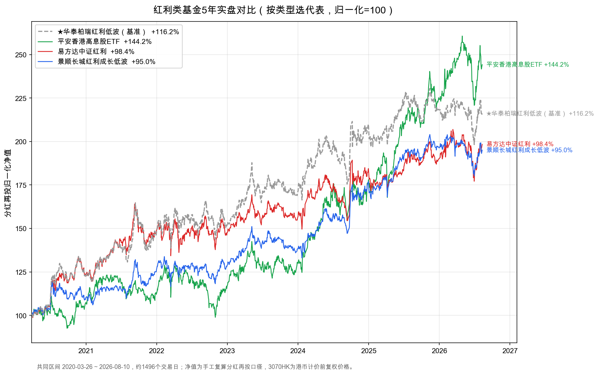

> 区间说明：2020-03至2026-08覆盖了新冠疫情（COVID）暴跌→核心资产牛市→2022回调→2024红利行情，市场环境较完整。下图按红利大类型各选一只代表（经典红利、红利成长、跨市场港股），与基准红利低波对比；红利质量类因无基金成立满5年未纳入。
>
> **分基金走势小结：**
>
> - **华泰柏瑞红利低波（512890，基准）——全程匀速、最稳的锚。** 四个阶段收益分别为+22%、+21%、+19%、+23%，几乎每个阶段都在20%上下，没有特别突出的单段，也没有塌陷段；最大回撤-16.5%。它靠的是持续、低波动地爬升，而非某一轮行情爆发，工具属性最强。
> - **景顺长城红利成长低波（007751）——慢牛型，回撤控制第一。** 前三年（2020-2023）明显落后，疫情修复期仅+8%，2024年以前一直在基准下方震荡；但全程最大回撤只有-12.9%，是四只里最低的。2024年以来加速上涨+43%，逐步追上。它的总分能略高于基准，靠的是最低回撤带来的风险调整收益，而非总收益更高（区间+95% vs 基准+116%）。
> - **易方达中证红利（515180）——前强后弱，经典红利的代表。** 2020-2021年核心资产牛市阶段+24%，与基准齐头并进；但2021-2022年回调期只涨+10%、回撤-18.5%，开始掉队；2024年以来+26%有所修复，整体呈"早期领先、中期掉队、后期回补"的形态。它更偏传统周期与价值权重，在成长占优的阶段承压。
> - **平安香港高息股ETF（3070HK）——前弱后强，弹性最大。** 2020-2023年长期横盘偏弱，2022年还创出-21.8%的区间回撤；2024年以来港股高息资产大幅反弹，单段暴涨+82%，一举冲到第一，全程+144%居首，但最大回撤也最大（-23.3%）。其涨幅含大量分红再投贡献（同期价格仅涨约72%），且为港币计价、跟踪误差偏高，高收益伴随高波动和汇率/口径风险。
>
> 整体看，5年维度上没有哪只在每个阶段都赢：基准胜在稳定可持续，景顺胜在低回撤，易方达受风格周期影响明显，平安香港则是典型的"熬三年、涨两年"的高弹性品种。短期谁领先，很大程度取决于截取区间落在哪个风格阶段。

## 3年组（3-5年实盘）

共同区间：2023-05-26 至 2026-08-10，约777个交易日。
基准得分：48.6分（截取相同区间）。

> 注：3年组数据周期较短，且不含稳定性维度，结论可信度低于5年组。共同区间恰逢**央企估值重塑**和**红利风格**占优，各基金表现可能偏乐观。

| 排名 | 基金 | 代码 | 总分 | 总收益 | CAGR | 最大回撤 | 收益/波动 | 年化跟踪误差 | 规模（亿） | 梯队 |
|---:|---|---|---:|---:|---:|---:|---:|---:|---:|---|
| 1 | 华泰柏瑞港股通高股息ETF | 513530 | 91.4 | 56.76% | 15.04% | -16.53% | 0.85 | 4.73% | 42.71 | 第一梯队（显著更优） |
| 2 | 华泰柏瑞央企红利ETF | 561580 | 77.1 | 37.79% | 10.51% | -17.13% | 0.67 | 1.57% | 26.98 | 第一梯队（显著更优） |
| 3 | 东方红红利低波A | 012708 | 65.7 | 29.96% | 8.51% | -12.25% | 0.63 | 1.92% | 65.11 | 第一梯队（显著更优） |
| 4 | 广发央企股东回报ETF | 560700 | 60.0 | 31.81% | 8.99% | -17.74% | 0.61 | 1.25% | 5.38 | 第一梯队（显著更优） |
| 5 | 华泰柏瑞红利低波ETF ★基准 | 512890 | 48.6 | 26.35% | 7.56% | -13.98% | 0.52 | 1.15% | 324.14 | 基准 |
| 6 | 工银港股通高息精选ETF | 159691 | 42.9 | 31.51% | 8.91% | -22.22% | 0.50 | 3.56% | 44.55 | 第三梯队（落后较多） |
| 7 | 华夏红利质量ETF | 159758 | 14.3 | 25.64% | 7.37% | -24.31% | 0.32 | 1.02% | 15.06 | 第三梯队（落后较多） |

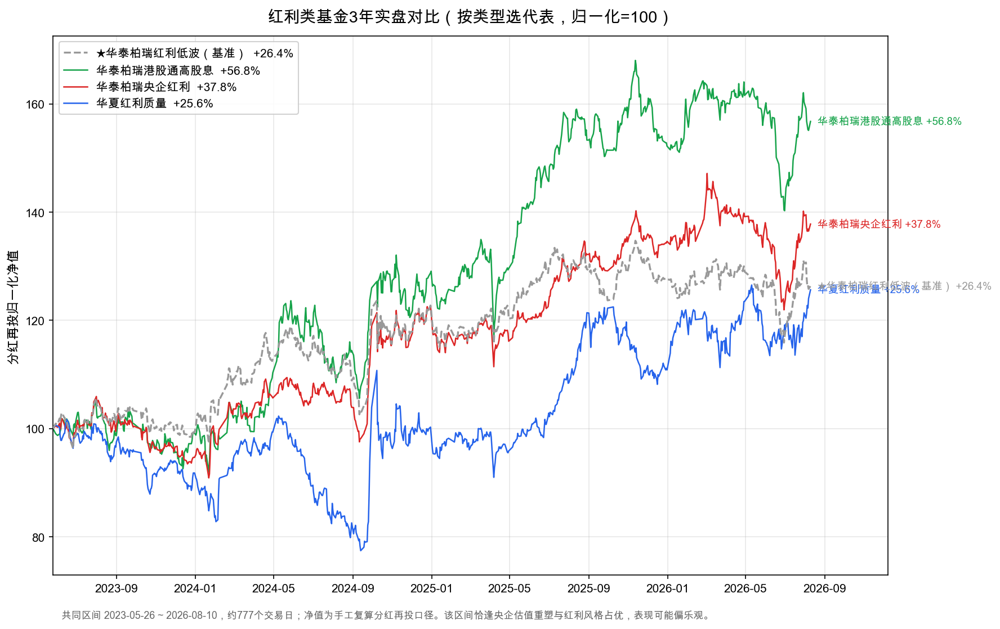

> **为什么图上多数基金跑赢了基准？先厘清一个关键区别：它们跑赢的是基准基金512890，而不是各自的跟踪指数。** 对照后文跟踪误差表，3年组6只基金相对自己跟踪指数的累计超额收益大多为负（513530 -17.38%、012708 -15.79%、159691 -21.05%、560700 -1.82%、159758 -1.82%，仅561580 +5.32%）。也就是说，基金本身并没有普遍跑赢指数，图上的"跑赢"主要来自不同指数之间的风格差异，而非基金管理能力。
>
> **分基金走势小结：**
>
> - **华泰柏瑞港股通高股息（513530）——区间冠军，弹性最大。** 区间+56.8%大幅领先，主要靠2024年以来港股高息资产的强势反弹；但它相对跟踪指数跑输约17%，年化跟踪误差4.73%（QDII、汇率和交易时差所致），且最大回撤-16.5%，高收益伴随高波动，不代表基金选股能力强。
> - **华泰柏瑞央企红利（561580）——踩中主线，唯一小幅跑赢指数。** +37.8%，2023年以后央企估值重塑、中特估行情是主要推动力；它也是3年组里唯一相对跟踪指数取得正超额（+5.32%）的基金，跟踪误差1.57%尚可。
> - **华泰柏瑞红利低波（512890，基准）——稳健但风格不占优。** +26.4%、回撤-14.0%，依然是最稳的锚，但在港股和央企领涨的这个区间，纯A股红利低波风格弹性不足，所以排名靠后。
> - **华夏红利质量（159758）——质量风格阶段性逆风。** +25.6%与基准接近，但最大回撤-24.3%是四只里最大的，收益/波动仅0.32。2024年以来高股息占优、质量成长风格偏弱，使其在这个区间明显承压，且成立时间短，结论可信度有限。
>
> **三点原因总结：** 第一，区间短且恰逢央企估值重塑和港股高息行情，风格暴露比基金管理更重要；第二，3年组不评稳定性维度，短期涨得快的基金在收益50%权重下更容易拿高分；第三，512890作为最稳的工具型基准，本就不是阶段性收益最锋利的品种。因此这些"跑赢"应理解为风格阶段占优，不能外推为长期更优。

## 观察池（不足3年实盘）

成立时间不足3年，实盘验证不充分，暂不参与排名。按成立时间排列。

> **★ 重点观察：招商中证全指红利质量ETF（159209）。** 当前红利类基金覆盖了经典红利、红利低波、红利成长、央企/港股主题，但缺少红利质量类的成熟标的。159209跟踪的中证全指红利质量指数（932315）在10年回溯中CAGR 13.98%、收益/波动0.74、滚动3年正收益占比100%，且发布前后收益差仅-1.15pp（无明显过拟合），优于3年组中华夏红利质量（159758）跟踪的老指数931468（发布前后差+11.89pp，存在回测好看实盘衰减的问题）。159209规模25亿、在同类10只跟踪基金中流动性遥遥领先。不足是基金仅340个交易日、指数2024年7月才发布，尚未经历完整牛熊周期，-28%级别最大回撤为回测值。建议列入自选持续跟踪，等满3年实盘后再做正式评分。

| 基金 | 代码 | 交易日 | CAGR | 最大回撤 | 年化跟踪误差 | 规模（亿） |
|---|---|---:|---:|---:|---:|---:|
| 华安国企红利ETF | 561060 | 702 | +6.18% | -14.12% | 1.20% | 0.63 |
| 博时红利低波100ETF | 159307 | 560 | +5.72% | -13.46% | 1.75% | 71.99 |
| 银华高股息策略ETF | 563180 | 550 | +6.73% | -15.29% | 0.85% | 1.26 |
| 国泰上证国企红利ETF | 510720 | 548 | +6.53% | -14.42% | 1.51% | 21.76 |
| 平安上证红利低波 | 020456 | 546 | +5.45% | -11.49% | 2.43% | 0.84 |
| 天弘央企红利50 | 021561 | 508 | +11.36% | -14.70% | 1.55% | 3.50 |
| 景顺国新港股通央企红利ETF | 520990 | 511 | +1.87% | -18.70% | 3.57% | 34.01 |
| 华夏港股通央企红利ETF | 513910 | 597 | +19.06% | -18.34% | 4.33% | 32.47 |
| 融通诚通央企红利ETF | 159336 | 370 | +15.05% | -18.76% | 1.39% | 4.24 |
| **★ 招商中证全指红利质量ETF** | **159209** | **340** | **+15.31%** | **-19.76%** | **1.94%** | **25.07** |
| 广发智选高股息ETF | 159207 | 329 | +15.84% | -12.58% | 1.59% | 22.87 |
| 易方达红利价值ETF | 563700 | 318 | +7.08% | -10.54% | 0.88% | 4.16 |
| 国联安A500红利低波ETF | 560570 | 217 | +1.61% | -12.67% | 0.68% | 12.30 |

## 跟踪误差分析

跟踪误差反映基金净值相对跟踪指数全收益的偏离程度。纯被动ETF年化跟踪误差通常应小于1%，1-2%为可接受，大于2%说明跟踪质量较差。

> 注：跟踪误差为基金日收益相对指数日收益的年化标准差；累计超额收益=基金区间收益-指数区间收益。港股通/QDII基金因汇率和交易时差，跟踪误差天然偏大。3070 HK为港币计价，与人民币全收益指数存在汇率偏差，跟踪误差参考意义有限。

**5年组：**

| 基金 | 代码 | 年化跟踪误差 | 累计超额收益 | 评估 |
|---|---|---:|---:|---|
| 华泰柏瑞红利低波ETF | 512890 | 1.15% | +15.63% | ✓ 跟踪良好 |
| 华泰柏瑞上证红利ETF | 510880 | 1.03% | -16.90% | ✓ 跟踪良好 |
| 嘉实300红利低波ETF | 515300 | 1.04% | +2.51% | ✓ 跟踪良好 |
| 易方达中证红利ETF | 515180 | 1.34% | +1.86% | ✓ 跟踪良好 |
| 建信300红利ETF | 512530 | 1.74% | -6.51% | △ 跟踪一般 |
| 景顺长城红利成长低波A | 007751 | 1.98% | -19.21% | △ 跟踪一般 |
| 宏利消费红利A | 008928 | 2.47% | +14.60% | △ 跟踪一般 |
| 建信红利潜力指数 | 007671 | 2.26% | +2.33% | △ 跟踪一般 |
| 银河沪港深高股息LOF | 501307 | 4.08% | -46.43% | ✗ 跟踪偏差大 |
| 平安香港高息股ETF | 3070 HK | 9.77% | -75.25% | ✗ 汇率/口径差异 |
| 浙商预期高股息增强 | 007178 | 9.81% | -2.24% | ✗ 增强型+指数波动大 |

**3年组：**

| 基金 | 代码 | 年化跟踪误差 | 累计超额收益 | 评估 |
|---|---|---:|---:|---|
| 华夏红利质量ETF | 159758 | 1.02% | -1.82% | ✓ 跟踪良好 |
| 广发央企股东回报ETF | 560700 | 1.25% | -1.83% | ✓ 跟踪良好 |
| 华泰柏瑞央企红利ETF | 561580 | 1.57% | +5.32% | ✓ 跟踪良好 |
| 东方红红利低波A | 012708 | 1.92% | -15.79% | △ 跟踪一般 |
| 华泰柏瑞港股通高股息ETF | 513530 | 4.73% | -17.38% | ✗ QDII跟踪偏差大 |
| 工银港股通高息精选ETF | 159691 | 3.56% | -21.05% | ✗ 跟踪偏差大 |

## 各基金对比基准图

每只基金的对比图采用上下两栏：上图为基金分红再投净值、基准512890、跟踪指数全收益三者同日归一（起点=100）的走势对比；下图为基金相对跟踪指数的累计收益差（百分点），正值表示基金跑赢指数、负值表示跑输。

> 注：含跟踪指数的图统一截止到指数全收益数据最新日 **2026-08-07**（8月8-9日为周末，8月10日指数行情尚未更新），因此图中基金期末收益比上方排名表（基金净值截止2026-08-10）低最后一个交易日，属正常数据截止差异，不影响跟踪误差结论。

> 下图累计收益差从本组比较起点（5年组2020-03-26、3年组2023-05-26）起算，与后文"跟踪误差分析"表中按基金全历史计算的累计超额口径不同，数值可能不一致；年化跟踪误差不受影响。3070HK因港币计价与人民币全收益指数存在汇率偏差，收益差参考意义有限。

### 景顺长城红利成长低波A（007751）

- CAGR：+11.05% | 最大回撤：-12.91% | 总分：86.7 | 梯队：第二梯队（接近基准）

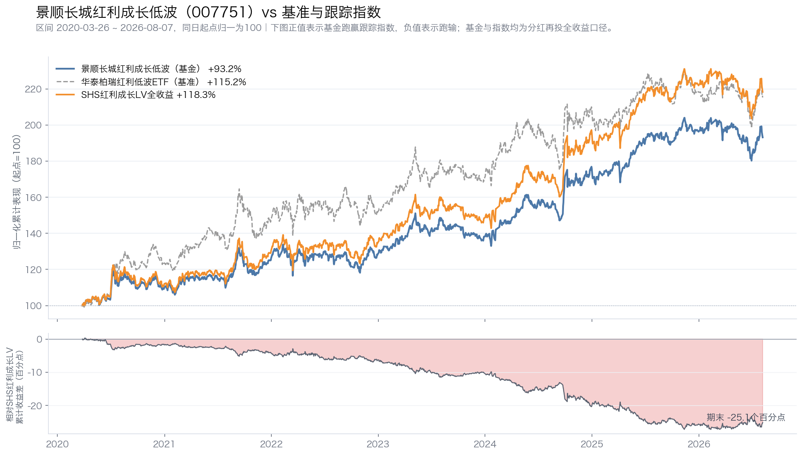

### 平安香港高息股ETF（3070 HK）

- CAGR：+15.04% | 最大回撤：-23.26% | 总分：81.2 | 梯队：第三梯队（落后较多）

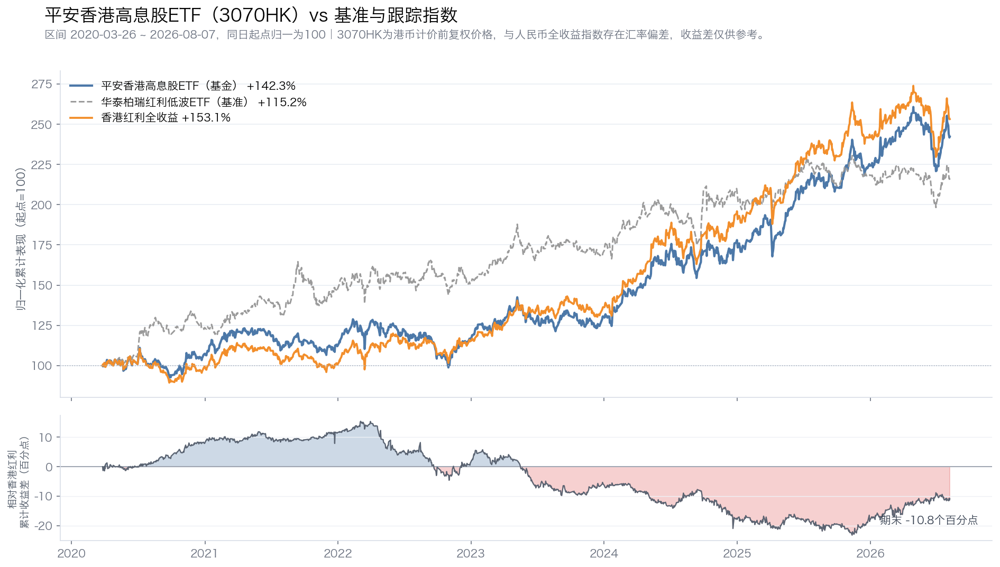

### 易方达中证红利ETF（515180）

- CAGR：+11.34% | 最大回撤：-18.53% | 总分：70.9 | 梯队：第三梯队（落后较多）

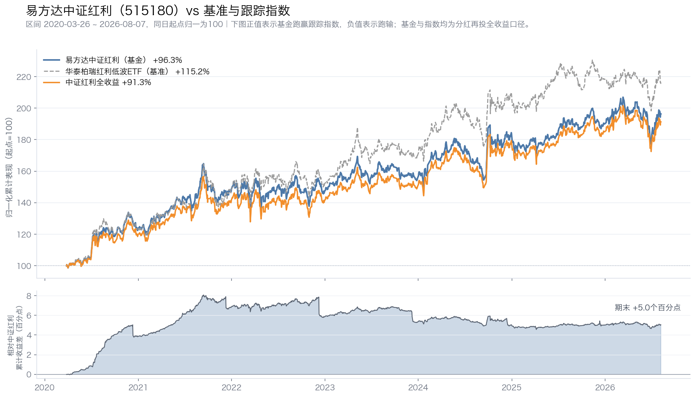

### 嘉实300红利低波ETF（515300）

- CAGR：+9.50% | 最大回撤：-14.56% | 总分：68.2 | 梯队：第三梯队（落后较多）

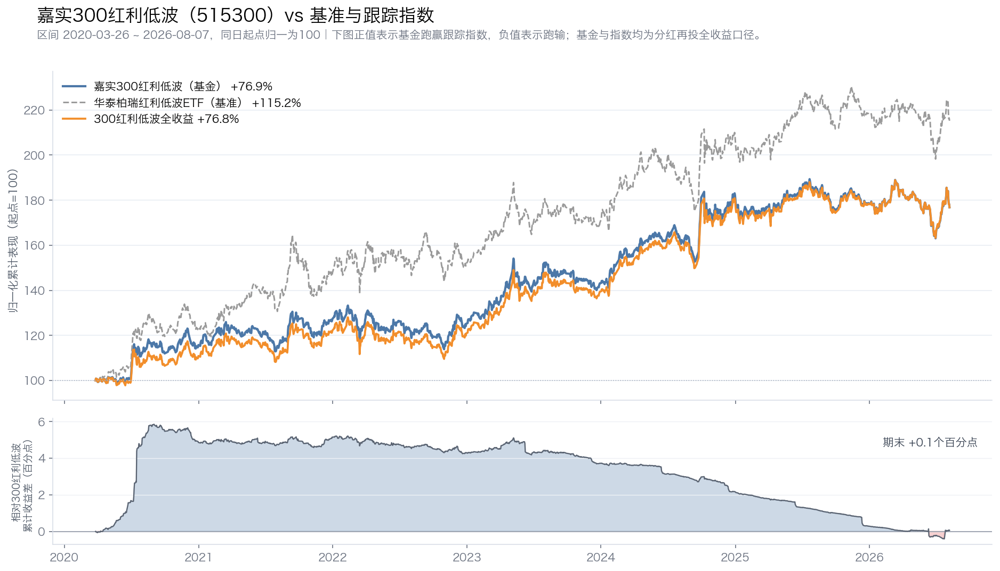

### 华泰柏瑞上证红利ETF（510880）

- CAGR：+9.68% | 最大回撤：-20.01% | 总分：61.2 | 梯队：第三梯队（落后较多）

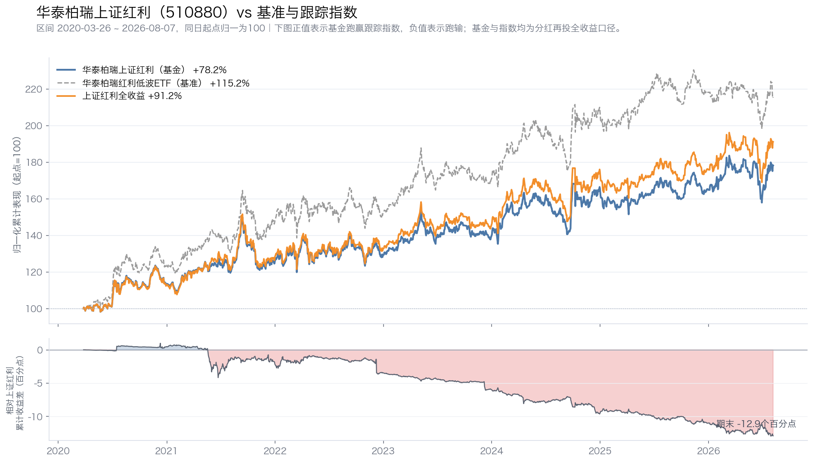

### 建信300红利ETF（512530）

- CAGR：+9.21% | 最大回撤：-17.00% | 总分：54.3 | 梯队：第三梯队（落后较多）

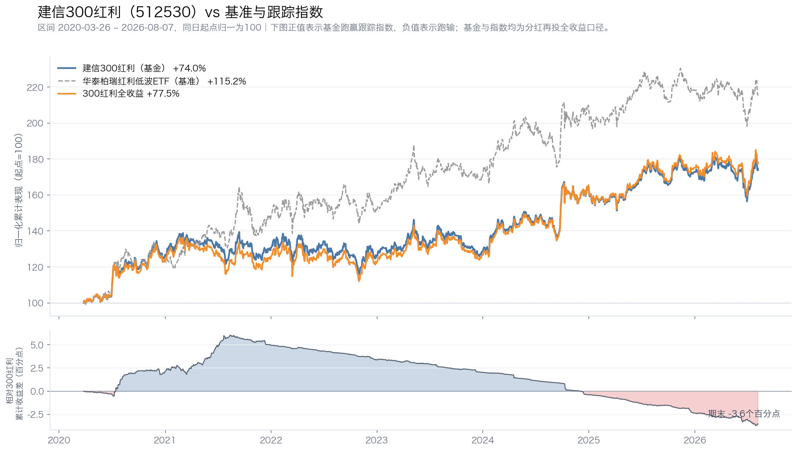

### 建信红利潜力指数（007671）

- CAGR：+7.34% | 最大回撤：-31.26% | 总分：33.3 | 梯队：第三梯队（落后较多）

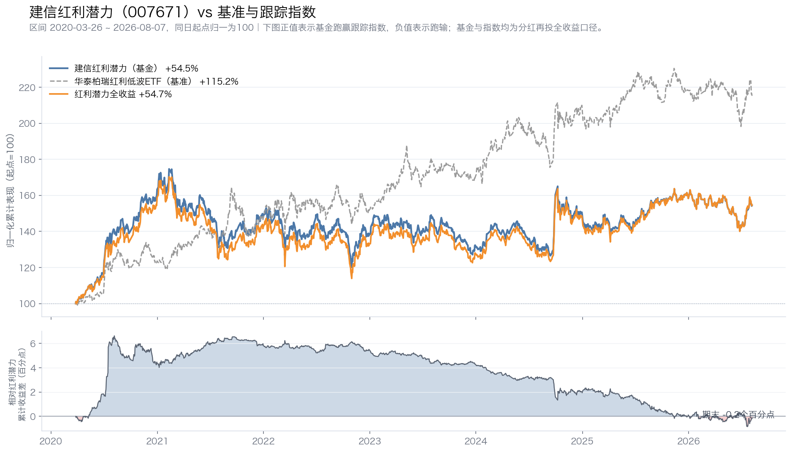

### 银河沪港深高股息LOF（501307）

- CAGR：+6.20% | 最大回撤：-32.28% | 总分：24.0 | 梯队：第三梯队（落后较多）

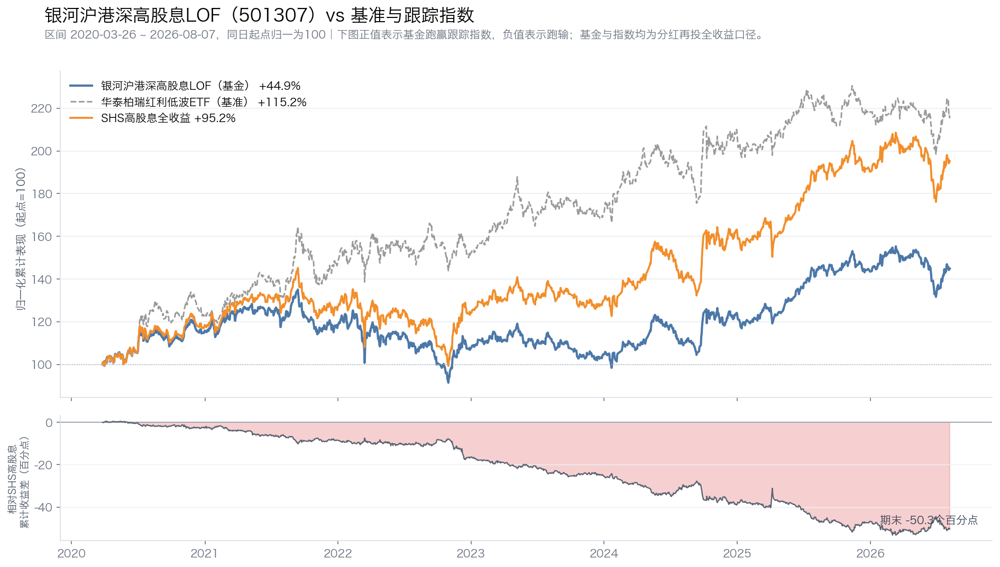

### 浙商预期高股息增强（007178）

- CAGR：+6.21% | 最大回撤：-41.26% | 总分：21.5 | 梯队：第三梯队（落后较多）

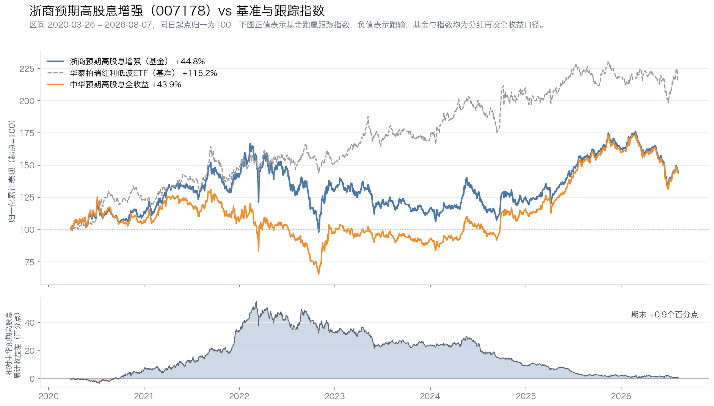

### 宏利消费红利A（008928）

- CAGR：+5.34% | 最大回撤：-35.61% | 总分：12.2 | 梯队：第三梯队（落后较多）

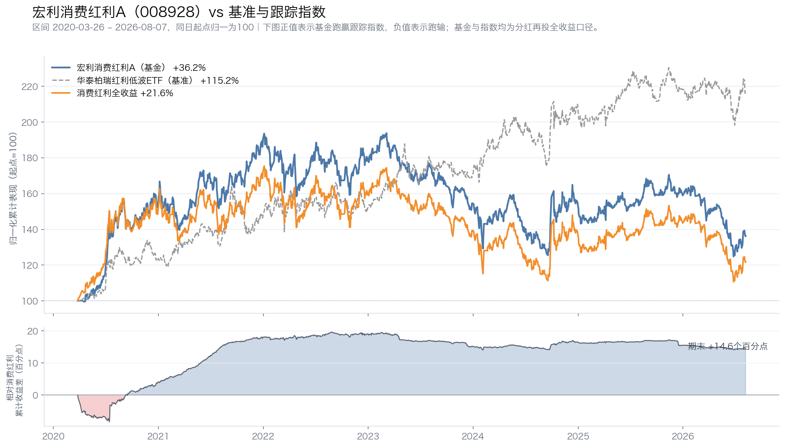

### 华泰柏瑞港股通高股息ETF（513530）

- CAGR：+15.04% | 最大回撤：-16.53% | 总分：91.4 | 梯队：第一梯队（显著更优）

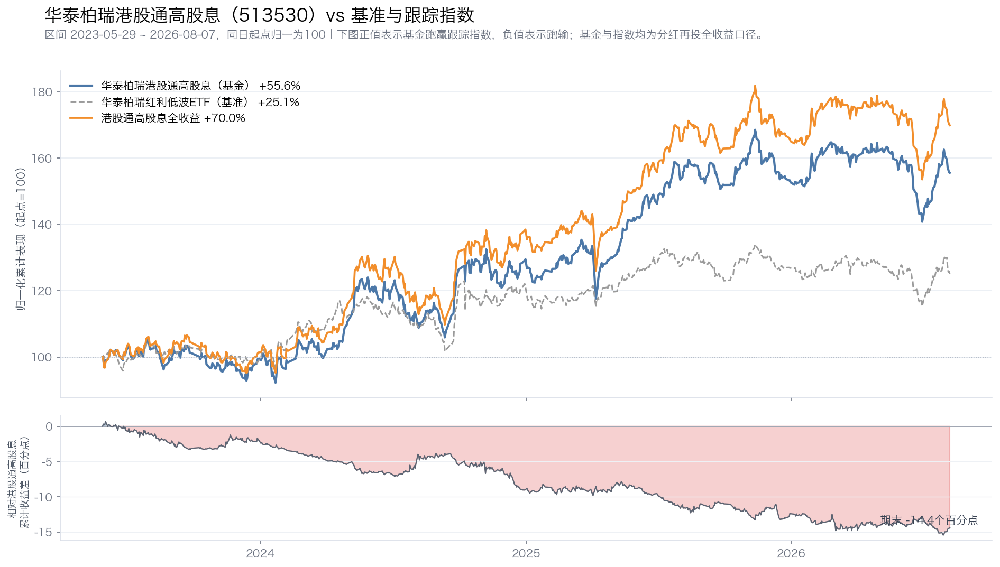

### 华泰柏瑞央企红利ETF（561580）

- CAGR：+10.51% | 最大回撤：-17.13% | 总分：77.1 | 梯队：第一梯队（显著更优）

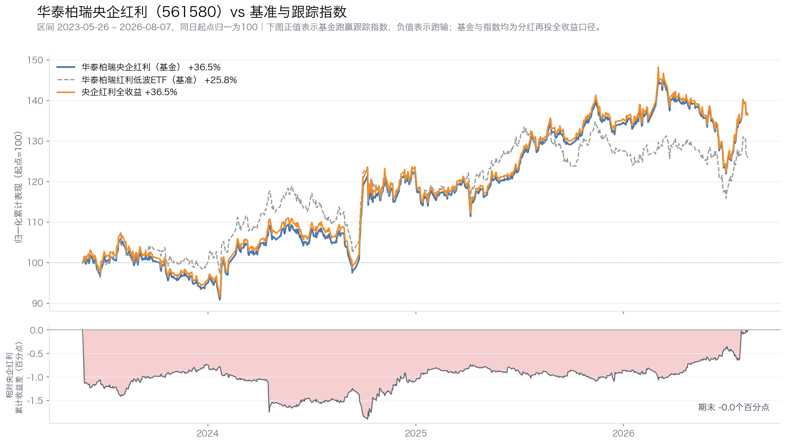

### 东方红红利低波A（012708）

- CAGR：+8.51% | 最大回撤：-12.25% | 总分：65.7 | 梯队：第一梯队（显著更优）

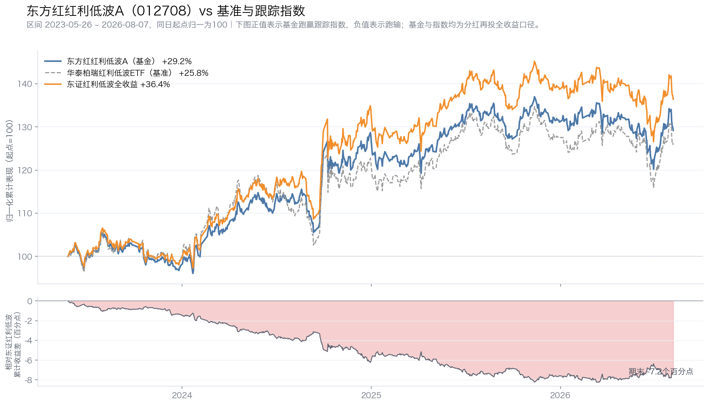

### 广发央企股东回报ETF（560700）

- CAGR：+8.99% | 最大回撤：-17.74% | 总分：60.0 | 梯队：第一梯队（显著更优）

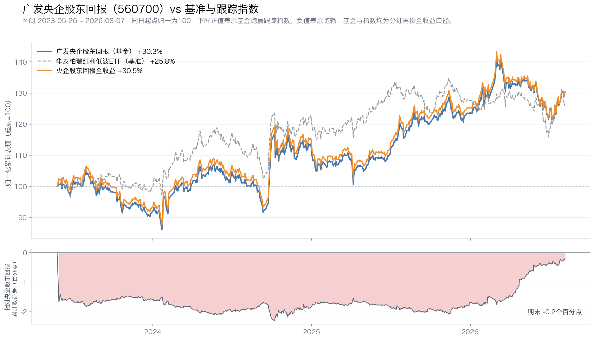

### 工银港股通高息精选ETF（159691）

- CAGR：+8.91% | 最大回撤：-22.22% | 总分：42.9 | 梯队：第三梯队（落后较多）

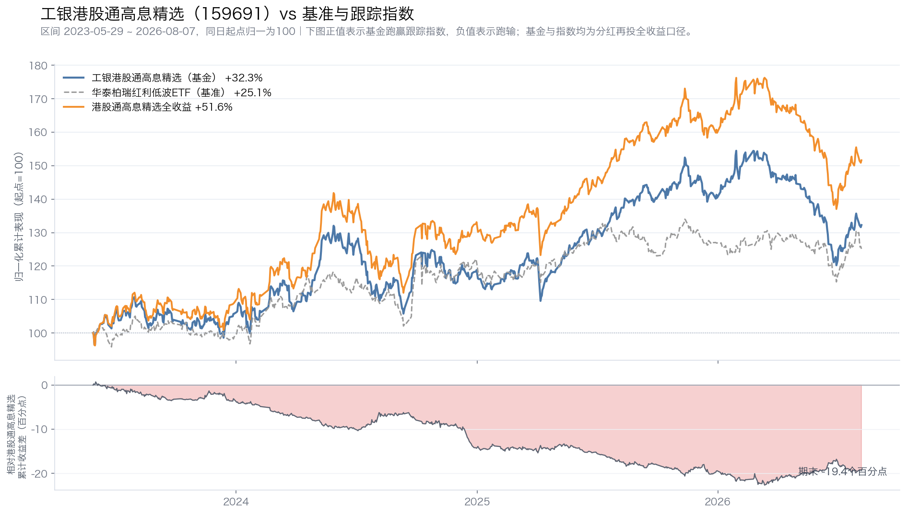

### 华夏红利质量ETF（159758）

- CAGR：+7.37% | 最大回撤：-24.31% | 总分：14.3 | 梯队：第三梯队（落后较多）

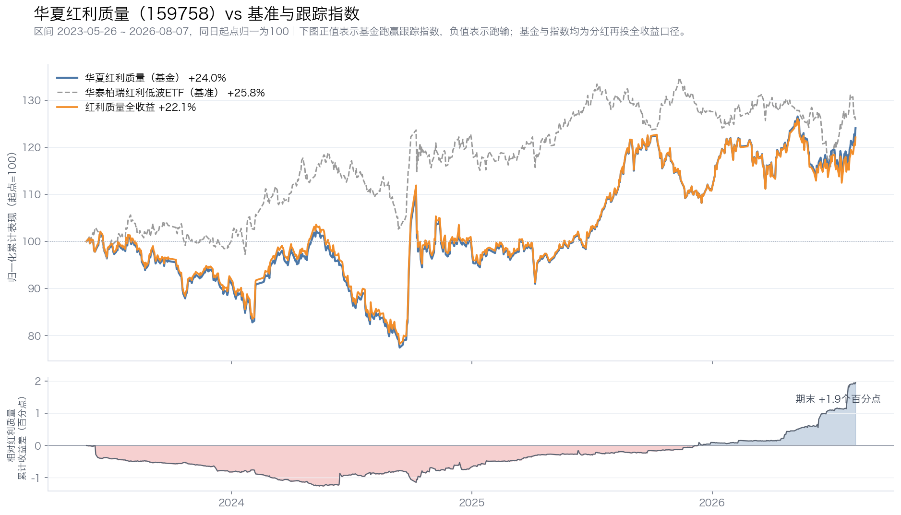

### 招商中证全指红利质量ETF（159209）★ 观察池重点观察

- CAGR：+15.31% | 最大回撤：-19.76% | 规模：25.07亿 | 跟踪指数：中证全指红利质量（932315）

> 观察池基金，成立不足3年（340个交易日），不参与排名。该基金跟踪的932315指数在10年回溯中CAGR 13.98%、收益/波动0.74、滚动3年正收益占比100%，且发布前后收益差仅-1.15pp（无明显过拟合），作为红利质量类的补充观察标的。

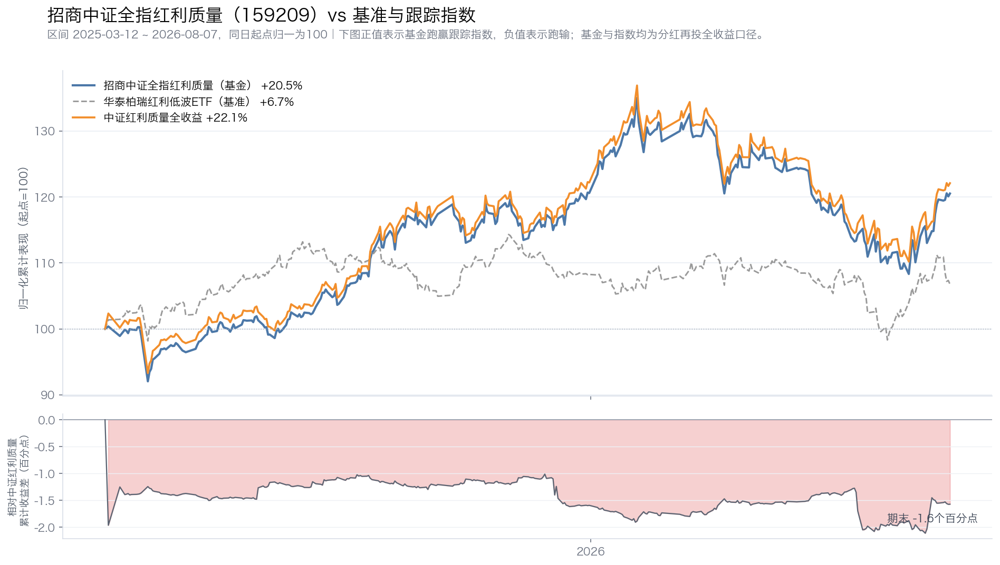

## 要点总结

**5年组（2020.3-2026.8，覆盖完整牛熊周期）：**
- 没有基金显著跑赢基准512890。景顺长城红利成长低波（007751）以低12.91%的回撤追平基准收益，风险调整后表现最优，但跟踪误差偏大（1.98%）且累计跑输指数19%，说明该指数基金有较明显的跟踪损耗
- 平安香港高息股ETF（3070 HK）绝对收益最高（CAGR 15.04%），但回撤大、与基准不在同一市场，跟踪误差参考意义有限
- 多数传统宽基红利ETF（510880、515180、515300）在6年区间内跑输基准5-20个百分点，主要因为基准的红利低波策略在回撤控制上优势明显
- LOF和指数增强产品（501307、007178）跟踪误差大、收益差，不适合作为指数工具

**3年组（2023.5-2026.8，红利风格占优期）：**
- 华泰柏瑞港股通高股息（513530）以CAGR 15.04%大幅领先，但4.73%的跟踪误差反映QDII产品在汇率和交易时差上的天然劣势
- 央企红利主题（561580、560700）受益于估值重塑，表现优于基准
- 东方红红利低波（012708）以最低回撤（-12.25%）进入第一梯队，作为场外指数基金适合定投
- 工银港股通高息精选（159691）和华夏红利质量（159758）因回撤较大落入第三梯队

**观察池值得关注的：**
- **招商中证全指红利质量ETF（159209）★重点观察**：作为红利质量类的补充标的，跟踪的932315指数10年回溯CAGR 13.98%、收益/波动0.74、发布前后无明显衰减，规模25亿流动性领先。不足是仅340个交易日实盘，等满3年再正式评分
- 华夏港股通央企红利（513910）和广发智选高股息（159207）短期CAGR超15%，但成立不足2年，需等待完整周期验证

## 数据来源

- 基金净值：东方财富历史净值接口（api.fund.eastmoney.com/f10/lsjz），手工复算分红再投净值（口径与全收益指数一致）
- 香港红利ETF：Yahoo Finance前复权收盘价（3070.HK）
- 指数数据：中证指数官网全收益指数
- 基金规模与跟踪产品：中证指数官网queryByIndexCode接口
- 原始净值数据：`sources/fund-nav-correct/`
- 跟踪产品校验数据：`sources/tracking-products-verify/all.json`
- 计算结果：`基金对比_指标及排名_v2.json`
