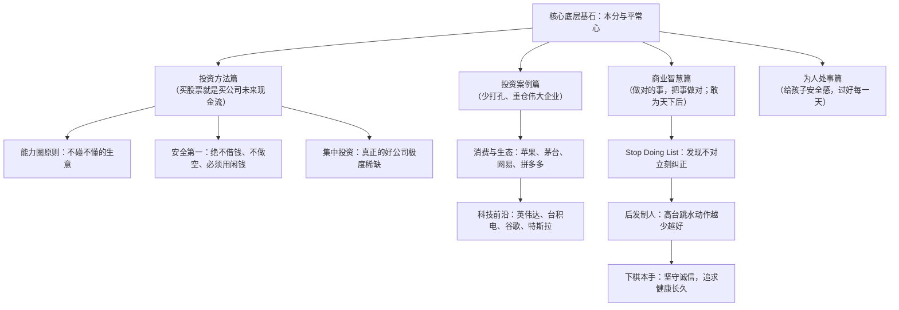

# 【段永平全部视频精华大汇总】30年认知精华深度总结

> **视频来源**：YouTube - Money&Love 投资频道（时长 66 分钟，视频链接：[foJnLqbHJLw](https://www.youtube.com/watch?v=foJnLqbHJLw)）  
> **内容提要**：汇集段永平近30年核心公开访谈（雪球访谈、浙大对话、第一财经《波士堂》与《财富人生》、北大总裁班、网易财经、步步高内部讲话、王石《共同说》等），分为**投资方法**、**投资案例**、**商业智慧**、**为人处事**四大篇章，涵盖百余个核心问答。
> **对话实录备查**：[段永平_2025_30年投资与商业认知精华_视频总结_对话实录.md](./段永平_2025_30年投资与商业认知精华_视频总结_对话实录.md)（逐字还原一问一答、案例细节与现场交锋）

---

## 核心认知导图与底层心法

---

## 一、投资方法篇（核心逻辑：买股票就是买公司未来现金流）

### 1. 投资的底层本质与常识
* **买股票就是买公司**：投资的最基础认知是“买股票就是买这家公司的一部分所有权”。这一理念来自巴菲特，改变了段永平的一生。
* **“所有股票都只有一个真正的买家”**：那就是**公司本身**。公司最终依靠赚取充沛的自由现金流，通过分红和回购将自己“买回来”。二级市场上的筹码交易只是短期换手，最终决定股票价值的是企业自身的造血能力。
* **投资简单但不容易**：
  * **简单**在于逻辑清晰：只需要看懂生意、看懂未来现金流折现。
  * **不容易**在于绝大多数公司普通人根本看不懂，克制不住诱惑，难以坚守能力圈。
* **投资中最重要的事情是“不亏钱”**：市场上的机会永远都有，而人把握机会的能力极其有限。守住本金、少犯错误，远比追求抓住每一个暴利机会重要得多。
* **投资与投机的本质区别**：
  * 投资是动用大钱去分享企业成长收益，股价下跌时如逻辑未变反而高兴（因为可以买得更便宜）；
  * 投机是用小钱去博弈短期波动（博傻），追涨杀跌，股价下跌时惊慌失措。

### 2. 能力圈、选股与估值方法
* **好公司的显著特点**：
  * **好公司通常一句话就能说清楚**（例如苹果做极致电子产品、茅台做极致白酒、谷歌做搜索）；
  * 烂公司往往写好几页纸、商业计划书天花乱坠也说不明白在干什么。
* **财报的作用与局限**：看懂财报是投资的**必要条件而非充分条件**。财报是企业过去的经营结果，不能单凭静态财务指标做投资决策；必须穿透财报看懂其商业模式、企业文化和人。
* **投资对象与排除法（新股避坑）**：
  * 只投与日常生活密切相关、有深度切身体验的生意；
  * **坚决不投刚上市或历史少于10年的新公司**，因为它们尚未经历完整经济周期的考验。
* **市盈率（PE）与长期投资的误区**：
  * PE只是某一特定时刻的静态快照，经常因单笔偶发收益或行业低谷而失真；
  * **长期投资不是为了长期而长期**。只要价格低于价值就持有；一旦价格充分反映价值或发现更好的投资标的（计算机会成本），就会选择卖出。通常市场体现真实价值的时间跨度在3年以内。
* **投资怎么看企业文化与人**：通过长期观察管理层说了什么、做了什么、前后是否言行一致，重点考察其是否具备诚信与本分品质。

### 3. 仓位管理与投资心态
* **闲钱投资与拒绝杠杆**：
  * 投资必须用闲钱，**坚决不借钱、不融资、不做空**；
  * 投资是基于价值的信仰，加杠杆会导致你在市场剧烈非理性波动中被迫被价格“投票”平仓。
* **手中有钱 vs 手中无钱时的应对**：
  * 手中有钱而无好标的时：买短期国债或拿现金，耐心等待；
  * 手中无钱却发现好标的时：绝不借钱，只能卖掉手头相对次优的资产换入最优资产（机会成本原则）。
* **集中投资 vs 分散投资**：
  * 坚决集中投资。真正能看懂的好公司极少，一辈子抓住几个大机会就足够了；把资金分散到十几个不懂的篮子里属于盲目理财而非投资。
  * 段永平是**满仓主义者**，认为长期持有现金会被通胀持续侵蚀，手持现金超过必要限度会让人难受。
* **抄作业与市场建议**：
  * 抄作业不可持续，因为你无法知晓对方的买卖依据、仓位配比与心理承受底线；
  * 普通人最简单有效的赚钱路径是**定投大盘指数（如标普500 SPY、纳斯达克 QQQ）**。
* **投资与做实业的对比**：
  * 投资像做实业，实业像做投资。做实业通常更难、更繁琐，需应对大量细节与人员管理；做投资则是不确定性更高，容易受市场虚妄干扰。
  * 投资如同打高尔夫：看的是整场比赛的最终总成绩，而不是单某一杆有多漂亮。少犯错、不爆洞才是赢球的关键。
* **A股与中国价值投资环境**：价值投资在任何地方都适用，只要企业能持续创造真实利润和分红。A股过往缺乏成熟做空机制，投机炒作盛行，但给真正能坚守优质资产的投资者创造了长线低价买入良机。

---

## 二、投资案例篇（实践检验：重仓大胜的商业逻辑）

### 1. 打孔原则与经典战役
巴菲特曾提出“一生打20个孔”的集中投资理念。段永平真正大仓位重仓的标的屈指可数：**网易、苹果、茅台、腾讯、拼多多**等。

### 2. 核心持仓与知名企业深度点评

| 公司/标的 | 核心观点与商业逻辑 | 段永平核心评语/启示 |
| :--- | :--- | :--- |
| **苹果 (Apple)** | **商业模式甚至比可口可乐更好**。拥有全球最高黏性的软硬件生态闭环与极高的转换成本；自由现金流极其充沛，每年通过巨额回购注销提升股东价值；企业文化极度聚焦于打造极致产品。 | “即便犯错，苹果也有强大的北斗星原则指引，很快会走回正道；犯错比别人少，长期差别就极大。” |
| **贵州茅台 (Moutai)** | **“白酒只有两种，茅台和其他”**。无可替代的品牌心智与独特的工艺壁垒；不需要做大幅度产品改动（“改口味就是脑袋坏了”），几乎不需要巨额资本开支即可源源不断产生净现金。针对“年轻人不喝茅台”，段永平指出：年长有消费力的人还会喝很多年，且茅台具备顶级社交与情绪价值。 | “国企属性反而是茅台的护城河，至少没人敢乱动品质规矩；只要坚持品质与本分，茅台能走很远。” |
| **拼多多 (PDD)** | 深度洞察大众消费需求，聚焦极致性价比与周转效率；Temu的全球化拓展执行力极强。黄峥团队是一支极其本分、真正懂生意的管理团队，绝非投机取巧圈钱之辈。 | “早期当作风投买入，但其模式与团队极其厉害；大概率5-10年之后依然会发展得很好。” |
| **网易 (NetEase)** | 2001-2002年互联网泡沫崩溃时的教科书级投资：当时股价跌至0.8美元，而账面上扣除债务后的现金就有2-3美元，市值完全被市场恐慌错杀；且其新推出的网络游戏《大话西游2》现金流正在呈爆发式增长。 | “即使面临摘牌退市风险也无所谓，因为投资买的是企业实际赚取的真金白银现金流，不是为了炒代码。” |
| **英伟达 (NVIDIA)** | AI是一场不可逆的工业革命（生产力飞跃千百倍）。英伟达在软硬件结合（CUDA生态）上构建了极深的护城河，是全行业军备竞赛中无可替代的“卖铲人”；黄仁勋战略眼光独到，数十年如一日坚持长远方向。 | “英伟达在行业里处于极其绝对的垄断地位，虽然半导体技术变化快，但其生态优势让其极具壁垒。” |
| **台积电 (TSMC)** | 先进制程上的绝对霸主。不论AI与芯片行业如何风云变幻，全球所有顶级巨头最终都必须依赖台积电代工。 | “半导体和AI起飞，谁都绕不过TSMC，它凭借纯代工模式把所有对手都甩在了身后。” |
| **特斯拉 (Tesla)** | 认可马斯克的远见、才华与工程创造力（高度赞赏SpaceX和Starlink），但对汽车行业本身的低毛利、重资产特征保持谨慎；同时对马斯克的个人行事风格心存顾虑。 | “投资就像跟企业做朋友。马斯克极其厉害，但我不一定想跟他做朋友；做企业不可预测性太大。” |
| **微软与谷歌** | 巴菲特不买微软是因为避嫌（与盖茨的深厚私交）和不熟；段永平长期看好谷歌的产品与技术实力，但对AI生成式搜索是否会侵蚀传统搜索的高毛利现金流保持观察。 | “谷歌整体依然是一家极佳的企业，但前沿AI的技术演进对传统商业模式的冲击值得审慎跟踪。” |
| **万科 (Vanke)** | 历史经典案例：2块多低谷买入，10几块卖出，虽然后续涨至20余元，但少赚的部分属于“超出自身认知范围的钱”，心态坦然、绝不后悔。 | “投资只赚自己看得懂的钱，不属于自己的收益不必遗憾。” |
| **医药行业** | 新药研发面临极长周期、巨额资金沉没与专利悬崖等高不确定性。段永平直言“看不懂就不投”，绝不拿确定性的资金去赌高风险。 | “不能用自己需要的钱，去赌一个自己不需要的高回报。” |
| **伯克希尔 (BRK)** | 巴菲特退休后，企业文化和资产配置体系已经制度化传承。作为资产配置底仓，其确定性依然远高于绝大多数共同基金，长期大概率仍能匹配或跑赢标普500。 | “伯克希尔的机会成本就是标普500，买伯克希尔本质上是买入了一套最顶级的价值投资文化。” |

---

## 三、商业智慧篇（企业经营：本分、平常心、做对的事把事做对）

### 1. 核心企业文化：本分与平常心
* **做对的事，把事做对**：
  * “做对的事”是战略方向与价值观基石，关注长远本质；“把事做对”是执行战术与效率。
  * **方向如果错了，越勤奋、执行力越强，死得越快**。做对的事永远排在第一位。
* **什么是“做对的事”？**
  * 最简单的判断标准就是**Stop Doing List（不为清单）**——发现不对的事情立即停止，不做违背常识与本分的事就是做对的事。
  * **发现错了马上改，不管付出多大代价，都是最小的代价**。
* **本分**：
  * 守住底线，不占任何人的便宜（包括用户、员工、供应商、合作伙伴）；
  * 专注于做好自己的产品与服务，不眼红别人赚快钱，不搞尔虞我诈。
* **平常心**：
  * 遇到任何突发状况，始终回到**事物的本质（常识）**去思考，不被情绪、舆论、虚荣和短期利益所裹挟。
* **诚信是最大的漏斗**：
  * 诚信绝非公关手段，而是发自内心的根本原则。
  * 搞投机欺诈的人看似短期能占便宜，但随着时间推移全被大浪淘沙淘汰；讲诚信能极大降低企业对内对外的交易成本，吸引最优秀的伙伴。

### 2. 战略打法与经营哲学
* **敢为天下后，后中争先**：
  * 不盲目争当“开拓者/先烈”。前期的市场教育成本极其高昂且失败率极高；
  * 等市场需求真正确立、技术路径明朗之后，再依托深刻的消费者洞察、极致的产品品质和强大的渠道营销能力后发制人（如步步高复读机、VCD/DVD、OPPO/vivo手机）。
* **极简主义：高台跳水动作越少越好**：
  * 企业经营如同高台跳水，多余的动作越多，犯错扣分的概率越高。
  * 坚决反对盲目跨界多元化，牢牢守住**焦点法则（Focus）**，集中优势兵力在局部形成压倒性优势。
* **快就是慢（fast is slow）**：
  * 不盲目追求膨胀式的高速增长。开车开到200码，前面遇到一堵墙必死无疑；
  * 企业最重要的目标是**安全生存、健康长久**，保持“足够的最小发展速度”即可，不走弯路就是最快的路。
* **围棋哲学：下“本手”，慎用“胜负手”**：
  * 企业日常经营必须一步一个脚印地下“本手”（守本分、抓品质、做产品）；
  * 许多企业喜欢下所谓的“胜负手”（孤注一掷博大奖），往往是因为前期已经犯了严重错误、急于乱中取胜，这种赌博往往死得更惨。
* **产品与营销的“1与0”关系**：
  * **好产品是前面的“1”，营销推广是后面的“0”**；
  * 如果没有真正打动消费者的产品，广告投入越大，消费者体验越差，品牌崩塌死得越快。
* **人才机制与共同愿景**：
  * 拥有共同价值观的人是**挑选出来的，而不是培养出来的**；
  * 留住核心人才依靠双轮驱动：**保健因子**（薪酬利益要给足、不亏待人）+ **激励因子**（成就感、自主权、长远成长空间）；
  * 企业的终极愿景是追求“更健康、更长久”，而非虚名浮利的“做大做强500强”。

---

## 四、为人处事篇（人生哲学：安全感、做喜欢的事、达则兼济）

### 1. 人生选择与成长心法
* **成功没有捷径**：脚踏实地付出该付出的努力，享受过程本身，坦然接纳不尽如人意的外部结果。
* **面临重大决策时的态度**：
  * 当两条路看起来都有道理且难以抉择时，往往意味着两条路都是对的；
  * 尽最大可能收集数据分析，但必须清楚永远不可能获得100%的信息；选定一条路闭着眼睛坚定走下去，即便选错了也坦然承担后果，没有任何一个单一决策会彻底毁掉一生。
* **运气的真相**：
  * 运气对每个人都是公平的。许多人之所以觉得自己倒霉，是因为缺乏长期的坚持，在运气来临前就早早放弃了。
  * 只要坚持走在对的道路上，好运终究会降临。

### 2. 家庭、育儿与财富观
* **父母能给孩子最宝贵的东西：安全感**：
  * 缺乏安全感的人，成年后极难保持理性与自信；
  * 家长对孩子的一言一行都是在示范做人：**打骂、暴力和情绪失控绝不会培养抗压能力，只会彻底摧毁孩子的安全感**。教育需有边界、有原则，更要有充足的爱与陪伴。
* **财富与自我驱动**：
  * 早在小霸王时期段永平便已实现财富自由，后续继续做事是因为享受创造的过程；
  * “钱赚进来是乐趣，但多余的财富也是一个大麻烦，把多余的钱花在真正需要帮助的人身上，才是一件好事。”

### 3. 公益慈善与终极人生目标
* **慈善的“伸手可及”原则**：
  * 公益必须讲究透明与实际落地效果，绝不搞空泛的跨界捐赠；
  * 重点捐赠自己深入了解的领域（如母校浙江大学、中国人民大学的教育基金），聚焦于培育下一代；
  * 早在三四十岁壮年时期便捐出大部分股票资产，坚决不在垂暮之年才被动处置财富。
* **终极人生目标**：
  * **“胸无大志，过好每一天”**；
  * 不刻意追求轰轰烈烈的大事，做自己真心喜欢且擅长的事，保持身体健康、家庭和睦、生活有品质，就是最好的人生状态。

---

## 五、金句与核心原则提炼表

| 维度 | 核心金句 / 底层认知 |
| :--- | :--- |
| **投资核心** | 买股票就是买公司，买公司的未来现金流折现。 |
| **卖家逻辑** | 市场上所有的股票都只有一个真正的买家——公司本身。 |
| **能力边界** | 好公司一句话就能说明白；说几页纸都讲不清的，坚决不碰。 |
| **避坑法则** | 不借钱、不做空、不碰不懂的生意；发现做错了马上改，不管多大代价都是最小代价。 |
| **企业经营** | 做对的事，把事做对；敢为天下后，后中争先；高台跳水，动作越少越好。 |
| **心法根本** | 本分、平常心；诚信是做企业最大的漏斗；fast is slow（快就是慢）。 |
| **家庭教育** | 父母给孩子最重要的东西是安全感，打骂不会增加抗压能力，只会摧毁安全感。 |
| **人生哲学** | 成功没有捷径；胸无大志，过好每一天，做自己喜欢的事情。 |
