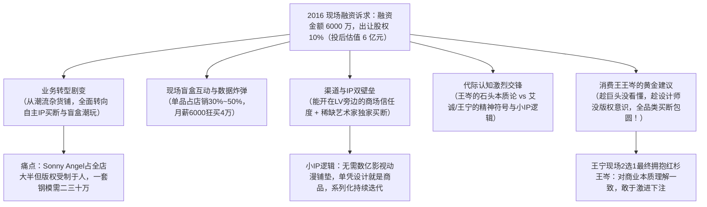

# 【创客中国2016】泡泡玛特王宁：从杂货铺到潮玩帝国的生死路演实录

> **节目来源**：内蒙古卫视《创客中国》（2016年播出，时长 18.7 分钟，视频链接：[RENEOYkDAck](https://www.youtube.com/watch?v=RENEOYkDAck)）  
> **路演创客**：王宁（泡泡玛特创始人兼CEO，时年约 29 岁）  
> **现场投资导师**：王岑（时任红杉资本中国基金合伙人、“消费王”）、高洪庆（戈壁创投合伙人）、刘纲（深创投华北区总经理）、艾诚（艾问创始人）  
> **历史坐标**：2016年，泡泡玛特创立第6年，全国仅约 30 家直营店。正值从“买手制杂货店”向“盲盒+自主IP”痛苦蜕变的最关键转折点（刚签约香港艺术家 Kenny Wong 与 Molly，正全力筹备自主开模与量产）。  
> **对话实录备查**：[泡泡玛特王宁_2016_创客中国_从杂货铺到潮玩帝国的生死路演_对话实录.md](./泡泡玛特王宁_2016_创客中国_从杂货铺到潮玩帝国的生死路演_对话实录.md)（逐字还原一问一答、案例细节与现场交锋）

---

## 2016 历史路演全景导图

---

## 一、2016 年核心路演数据与资本诉求

* **融资诉求**：现场计划**融资 6,000 万元人民币，出让 10% 股权**（投前估值 5.4 亿元，对应投后估值 6 亿元）。
* **资金用途**：主要用于**两件事——“加速核心商圈开店”与“重金签约并买断头部 IP”**。
* **规模底盘**：耗时 5 年多，在全国 12 个一二线城市开设近 30 家直营店。
* **股权结构**：王宁个人持股 50% 以上；公司建立了全员激励机制，12 位总监级别骨干中有 10 人持有股份期权，高管团队合计持股约 5%。

---

## 二、转折点原点：从代理 Sonny Angel 到签约 Molly

### 1. 现场盲盒（Sonny Angel）心理学实验
* 王宁在现场分发了 12 款日本代理小人偶盲盒，邀请四位投资人亲自拆盒体验：
  * **机制**：12 款常规 + 1 款隐藏（1/12 极低中签率）；
  * **心理反应**：拆中喜欢的莫名亢奋，拆中不喜欢的莫名失落但心有不甘，明天还要继续买（“入坑”即出不来）；
* **恐怖的终端动销数据（2016年）**：
  * 单个盲盒售价仅 40~50 元；
  * 泡泡玛特当时仅靠 20 多家门店，**单款单月狂卖近 80,000 只**！
  * **单品销量占全店总收入的 30%~50%**，甚至有月薪 6,000 元的公司内部小姑娘一年花费 40,000 元狂买收集。

### 2. 商业模式转型的阵痛与逼仄
* **原模式瓶颈**：原本是“买手制潮流小百货”，全世界搜罗创意商品，但毛利低、库存杂、命脉全在供应商手中；
* **爆款逼出自主版权**：Sonny Angel 虽火，但只是代理，随时面临被收回授权的危机；
* **为什么独立艺术家做不成？**
  * 一套高精度注塑钢模成本高达 **20~30 万元**，香港、日本很多顶尖艺术家工作室堆满了手稿与孤品，个人根本无力承担工业化量产成本；
  * 泡泡玛特顺势切入：**“寻找像周杰伦一样顶级但被埋没的艺术家（如 Kenny Wong），签下独家开发、独家生产、独家销售权，帮其完成 3D 工业化与商业化闭环”**。

---

## 三、两代投资人现场激烈交锋：玩具还是精神符号？

在路演现场，围绕年轻人买潮玩是“盲目狂热”还是“精神符号”，王岑、刘纲与艾诚、高洪庆以及王宁展开了一场关于“收藏本质与代际差异”的激烈交锋：

### 1. 质疑与本质主义视角（红杉资本 王岑 & 深创投 刘纲）：
* **王岑**：*“老是放大90后特点，我们也年轻过！我小时候穷，我收集石头，我跟我朋友显示这石头，难道不是我的符号吗？本质上来说，这个小塑料玩具跟石头你说有什么差别？”*
* **刘纲**随声附和：*“程度不同而已，本质是一样的嘛！”*

### 2. 反驳与代际洞察视角（艾诚 & 戈壁创投 高洪庆）：
* **艾诚**：*“这和你们那个年代完全不一回事！90后把潮玩放在办公桌上、发朋友圈秀，这是他的身份标签和精神符号生活。”*
* **高洪庆**：*“强调本质一样，就是老一代人的特点！年轻一代人就是要强调‘我和你们就是不一样的’。”*

### 3. 王宁的核心回应（小 IP 逻辑与门槛真相）：
* **渠道门槛极高**：
  * 能进驻北京三里屯太古里、成都远洋太古里、恒隆广场等顶级地标商场，不是有钱就行；
  * 泡泡玛特开在 LV、Gucci 等奢侈品旁边，**需要通过商场和顶级奢侈品租户的双重审核**，确认你的门店服务、品牌调性和客群配得上与其为邻，这是泡泡玛特 5 年打磨的零售 SOP 护城河。
* **重塑 IP 逻辑：大 IP vs 小 IP**：
  * **大 IP 逻辑**：先砸几千万拍电视剧、长篇动画，再来开发玩具（成本高、周期长、风险极大）；
  * **泡泡玛特的小 IP 逻辑**：**“IP + 游戏化机制（盲盒）”**。无需漫长影视故事，单凭高水准设计本身作为商品用户就愿意买单；通过系列化持续迭代（一年出几季），具备长期的连贯性与稀缺性。

---

## 四、资本终极二选一与“消费王”王岑的致命策略

现场四位投资人全部亮灯给出投资意向，王宁必须进行“4选2”再到“2选1”的决断：

### 1. 淘汰艾诚与刘纲，留下王岑与高洪庆
* 王宁坦言：*“因为我和王总、高总对商业本质的理解是一样的，比较激进，尊重商业规律。”*

### 2. 王宁的灵魂提问：
* *“我想问一下那个王总，这一亿给我们的话，你觉得我们应该怎么花？”*（现场四位投资人全部亮灯，给出意向投资达 1 亿元）

### 3. 红杉资本 王岑的黄金战略建议（价值连城的一击）：
> **“趁你现在的渠道还没有那么大、其他商业巨头还没看懂，赶紧把日本、香港这些顶级设计师的所有品类全部买断！全品类买断！不光是潮玩衍生品，包括影视、肖像、全衍生品全部买断！这是你最核心的战略资源，趁着他们还没有大 IP 意识，赶快去抄底包圆！”**

### 4. 终极决策：
* 王宁最终选择**红杉资本王岑**！
* 事实证明，这一建议深刻影响了泡泡玛特后来的核心战略——全面买断头部 IP 全品类版权（深度绑定 Kenny Wong、龙家升 Kasing Lung 等），为日后成长为千亿市值的全球潮玩霸主奠定了最坚实的地基。

---

## 五、2016 历史实录与今日复盘对照表

| 维度 | 2016 年《创客中国》路演现场 | 今日泡泡玛特（2025-2026年） |
| :--- | :--- | :--- |
| **公司估值** | **6 亿元人民币**（融 6000 万出让 10%） | **港股千亿市值（突破千亿港元）**，升值百倍以上 |
| **门店体量** | 12 个城市，近 30 家直营店 | **全球 30+ 国家与地区，数百家高坪效旗舰店与数千台机器人商店** |
| **主力产品** | 代理日本的 Sonny Angel 占半壁江山 | **全自研自主版权矩阵**：Molly、Labubu、Crybaby、Skullpanda 等超级 IP |
| **商业模式** | 潮流买手百货向盲盒转型期 | **集“IP 孵化、工业制造、全球零售、城市乐园、游戏影视”于一体的综合文化巨头** |
| **战略重心** | 刚开始赴港买断 Molly，为一套模具 20 万发愁 | **全球年销突破 4 亿只潮玩，以中国制造与中国市场反向赋能全球顶级艺术家** |
| **资本决策** | 现场接纳红杉王岑“全品类买断核心 IP”的建议 | **全面落实全版权运营，构建了任何竞争对手无法绕开的独家艺术家护城河** |
