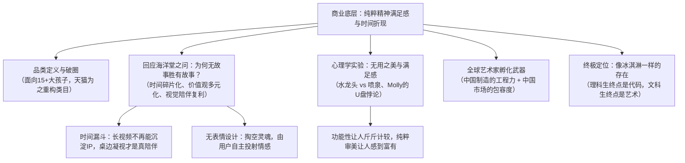

# 【央美·界面沙龙】泡泡玛特王宁：潮流玩具风靡背后的心理学和设计创新

> **演讲来源**：界面新闻·面谈 联合中央美术学院设计学院、央美美术馆举办的“一个创新品牌的设计修养”主题沙龙（视频链接：[界面视频实录](https://m.jiemian.com/video/AGQCNwhjB2YBMVVj.html)）  
> **演讲时间**：2019年4月20日（泡泡玛特上市前的奠基期重磅演讲，时长 27.0 分钟）  
> **演讲嘉宾**：王宁（泡泡玛特创始人兼CEO）  
> **演讲主题**：潮流玩具风靡背后的心理学和设计创新（全面拆解潮玩本质、无表情设计哲学、洗手池水龙头实验、U盘悖论与全球艺术家孵化）  
> **现场实录备查**：[泡泡玛特王宁_2019_央美界面沙龙_潮流玩具背后的心理学与设计创新_对话实录.md](./泡泡玛特王宁_2019_央美界面沙龙_潮流玩具背后的心理学与设计创新_对话实录.md)（逐字还原王宁演讲全文、现场师生问答与互动细节）

---

## 核心认知框架与心理学图谱

---

## 一、品类定义与早期突破：天猫因泡泡玛特重塑类目

1. **“潮流玩具”（Art Toy）的品类诞生**：
   * 泡泡玛特产品本质是面向 15 岁以上大人的玩具，无法叫“儿童玩具”，又不能称作“成人玩具”，于是正式确立了“潮流玩具”这一行业术语（对应海外的艺术家玩具 Art Toy）；
   * 百度百科的“潮流玩具”词条由泡泡玛特团队参与制定。
2. **天猫类目颠覆**：
   * 早期入驻天猫时，平台没有合适分类，只能将其塞在“模型玩具”类目下；
   * 泡泡玛特用两年时间超越万代（Bandai）、LINE FRIENDS 和迪士尼登顶该类目第一，**天猫最终专门为此将整个一级类目从“模型玩具”直接更名为“潮流玩具”**。
3. **早年核心用户画像（2019数据）**：
   * **平均年龄 26 岁**，其中 **75% 为年轻女性**，且高度集中于一二线城市具有自主消费能力的高收入白领。

---

## 二、解答日本海洋堂社长之问：为什么“无故事”能击败“有故事”？

日本手办鼻祖海洋堂（Kaiyodo）60 多岁的社长曾当面问王宁一个困惑数十年的问题：*“为什么海洋堂做了几十年手办，海贼王、火影忍者等经典动漫手办销量越来越乏力，而没有任何影视故事支撑的 Molly 却能引发年轻人疯狂排队抢购？”*

王宁给出了极具穿透力的三个底层维度剖析：

### 维度一：时间碎片化——传统影视 IP 孵化机制的彻底瓦解
* **传统 IP 靠整块时间沉淀**：
  * 老一代人心中的超级 IP（孙悟空、周星驰、周杰伦、《还珠格格》）之所以根深蒂固，是因为当年大家在漫长的暑假和夜晚，一遍遍重复看电影、听全专磁带，是用**大量完整的“时间”换来的情感依恋**。
* **时代时间漏斗的塌陷**：
  * 过去《来自星星的你》大火，100 个人里有 80 个人完整追剧；后来《延禧攻略》大火，追完的人不足 50%；到今天即便剧集制作再精良，80 集的长剧几乎没人有耐心看完整，甚至普遍依靠 1.5 倍速、2 倍速或短视频解说；
  * **人们被碎片化内容过度包裹，时代根本不再给影视长内容留下“沉淀新超级 IP”的时间窗口**。
* **潮玩是时间成本最低的“超级 IP”**：
  * 潮玩不需要你花 40 个小时去看剧了解人设；
  * 工业化量产后购买成本仅 59 元，买回家摆在办公电脑和书桌旁，**用户每天在物理空间注视它的时间长达 8~10 小时，其累积的视觉陪伴时间远超任何影视剧！**

### 维度二：价值观共识瓦解——“无表情”留白带来的百倍受众容纳力
* **多元时代拒绝说教**：
  * 过去影视角色拥有明确的英雄价值观，受众必须接受这套价值观才会买单；现代年轻人价值观高度离散，每个人对角色的解读完全不同；
  * **100 个人买钢铁侠手办，理由通常只有 1 个；但 100 个人买 Molly，理由有 100 个！**
* **Molly 的“无表情”设计哲学**：
  * 设计师 Kenny Wong 坚决拒绝给 Molly 画上微笑嘴角或倔强嘴角，保持彻底放空的中性面容；
  * **“把灵魂掏空，让消费者把自己的灵魂与心境装进去”**：你开心时看它，觉得它在与你微笑；你难过时看它，觉得它在安静陪你疗伤。
  * **经典案例**：一位 60 岁的大叔一年花费 70 万元买 Molly，只因他与女儿关系破裂断绝往来，而 Molly 4~5 岁孩童般的面容，封存了他与女儿最相亲相爱的那段黄金岁月。

---

## 三、消费心理学洞察：满足感、负罪感与“无用之美”

### 1. 洗手池水龙头 vs 豪宅大喷泉（心理学思想实验）
* **实验情境**：
  * 想象你成为福布斯富豪，住进超级豪宅。早晨急着出门，把红酒杯扔进洗手池，水龙头开到最大哗哗流淌没关。你出门上班时，内心会不会焦虑烦躁？（即便一天水费只有 30 元，绝大多数人依然会难受抓狂）；
  * 但与此同时，你开着豪车出门，豪宅花园的大喷泉一天喷掉 300~600 元水费，今天没有任何宾客，你却觉得理所当然、心旷神怡。
* **背后的心理学法则**：
  * 物理状态都是水，化学成分完全一样；
  * **功能性/实用性消费（洗手水）会唤醒人的理性算计与损失厌恶，哪怕 30 块钱也觉得浪费**；
  * **而审美/仪式感消费（喷泉）则提供纯粹的精神满足感与地位认同，花费数百元却让人感受到充盈与富有**。

### 2. Molly 的“U 盘悖论”：增加功能反而毁掉销量
* 王宁提出过一个震撼的商业假设：
  * 如果 Molly 盲盒样式不变、做工不变、售价不变，甚至“免费升级福利”——把 Molly 脑袋拔开里面附赠一个高速 U 盘；
  * **结果会怎样？单款年销 400万~800 万只的 Molly，可能连 100 万只都卖不出去！**
* **商业逻辑拆解**：
  * 一旦加上了 U 盘，消费者的心理账户立刻从“精神犒劳”滑落至“电子工具”；
  * 用户买第二个时就会产生强烈的**负罪感与心理负担**：“我家里已经有很多 U 盘了，我买这么多 U 盘干嘛？”
  * **“商品本身没有任何物理实用功能，它本身就是纯粹的艺术，反而具备了无限购买的无罪化心理空间。”**

---

## 四、两项中国核武器：中国制造 + 中国市场 孵化全球艺术家

* **全球青年艺术家的共同困境**：
  * 韩国、北欧及欧洲小国的美学教育非常扎实，拥有海量才华横溢的设计师与插画家；
  * 但其本土产业链脆弱（缺乏高精度注塑与模具配套），且本土人口狭小，根本无法消化一个商业化量产的“最小起订量（MOQ）”。
* **泡泡玛特的超级双核赋能**：
  1. **中国制造**：极速的工程拆件、3D 建模与高标准量产能力，任何奇思妙想几天内就能出模打样；
  2. **中国市场**：庞大的消费纵深足以轻松承接任何小众 IP 的首期试产规模。
* **文化反向输出**：
  * 先用中国制造和中国市场把海外小众艺术家成功孵化起飞；
  * 再利用艺术潮玩的“无国界设计语言”，把产品毫无文化隔阂地反向卖回欧美与全球市场。

---

## 五、潮玩的终极形态：像冰淇淋一样存在

* **文化阶段跃迁**：
  * 早期：极客男性为主的“小众亚文化”；
  * 中期：年轻女性大规模涌入，转变为日常“消费行为”；
  * 如今：全面渗透大众生活的“主流文化”。
* **“冰淇淋”隐喻**：
  * 潮玩就像冰淇淋：它不是午餐也不是晚餐，吃了也不管饱，但只要花上小几十块钱，就能换来 5~10 分钟极其确定、无负担的甜蜜与多巴胺快乐。
* **结语金句**：
  > **“理科生的终点是代码，文科生的终点是艺术。”** 泡泡玛特正是站在科技制造与纯粹艺术的十字路口，让艺术平权融入大众生活。

---

## 六、关键认知总结对比

| 议题 | 传统玩具/传统影视衍生品 | 泡泡玛特潮玩模式（王宁 2019 演讲） |
| :--- | :--- | :--- |
| **品类受众** | 儿童、低幼向 | **15 岁以上成人（核心为 26 岁都市高收入女性）** |
| **IP 孵化逻辑** | 先投入数亿拍几十集动画长片，再卖周边 | **剥离影视长内容，直接以精良设计实体切入，以日常桌面陪伴沉淀情感** |
| **形象设计** | 鲜明正义感、夸张表情（哭/笑/怒） | **“无表情中性脸”，将情绪投射与解释权完全留给消费者** |
| **产品属性** | 实用性工具、带有物理功能（文具、钥匙扣） | **纯粹的“无用之美”，拒绝增加功能（避免引发理性算计与负罪感）** |
| **消费心理** | 斤斤计较的“水龙头心态”（害怕买贵浪费） | **无罪化犒劳的“喷泉心态”（花小钱购买确定性精神快乐）** |
| **供应链闭环** | 单向引进海外日美成熟版权代工 | **以中国制造+中国市场为核武器，逆向挖掘并全球化孵化全球艺术家** |
