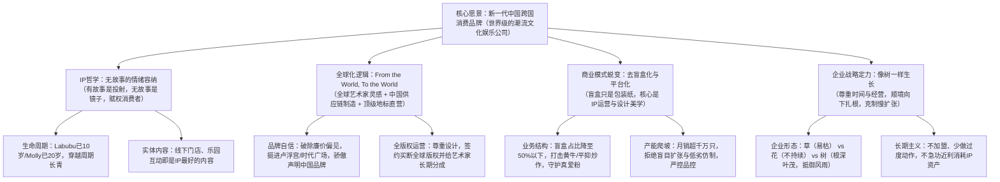

# 【央视专访】泡泡玛特王宁：探寻新一代中国消费品牌的崛起历程深度总结

> **节目来源**：央视新闻专访（2025年播出，时长 34.4 分钟，B站：[BV1iUbCz6E6h](https://www.bilibili.com/video/BV1iUbCz6E6h/)）  
> **对话人物**：王宁（泡泡玛特创始人、董事长兼 CEO）、央视主持人  
> **核心坐标**：泡泡玛特创立第 15 年，港股市值超 3000 亿，Labubu 掀起全球出海风暴，海外收入占比即将超国内。正值从“中国盲盒潮玩”向“全球超级 IP 平台”蜕变的关键阶段。  
> **对话实录备查**：[泡泡玛特王宁_2025_央视专访_探寻新一代中国消费品牌的崛起历程_对话实录.md](./泡泡玛特王宁_2025_央视专访_探寻新一代中国消费品牌的崛起历程_对话实录.md)（逐字还原一问一答、案例细节与现场交锋）

---

## 核心商业认知与业务全景导图

---

## 一、核心经营指标与全球出海拐点

* **全球出海与收入拐点**：2018 年启动全球化，2024-2025 年海外业务呈现爆发式增长，**海外单月/季度整体收入有望历史性超过国内**。
* **超级单品终端动销**：爆款超级 IP Labubu 全球月销量已**突破 1000 万只**，生产线每月产能翻倍提升（“缝纫机踩冒烟”）。
* **渠道网络极其克制**：全集团注册会员突破 **5000 万+**；国内线下直营门店极其克制，仅约 **400 家**（西双版纳等大量知名旅游城市尚无门店），坚持单店坪效与极致服务体验优先。
* **去盲盒化成效显著**：传统硬核“盲盒”类销售收入占比已**降至 50% 以下**，衍生出大体量搪胶公仔、毛绒挂件、家居艺术品等多元品类。
* **跨越资本周期**：港股市值突破 **3000 亿港元**，从早期的资本质疑与百亿震荡中完全走出第二增长曲线。

---

## 二、IP 本质之争：无故事的“情绪容纳”如何抗衡百年迪士尼

* **打破影视叙事的思维定式**：
  * 传统迪士尼模式通过长篇电影给角色赋予背景和性格，属于“单向情感投射”；
  * 潮玩 IP（Molly、Labubu）没有既定台词与剧情，是一种“情感留白”，**像镜子一样能容纳不同人当下的喜怒哀乐**（开心时看它在笑，难过时看它在陪伴）。
* **碎片化时代的内容新生**：
  * 现代人生活节奏极快、时间高度碎片化，很难静心追完几十集动画；艺术画稿、实体雕塑、线下城市乐园（POP LAND）的拥抱与互动，本身就是极高密度的“实体内容”。
* **跨越代际的金矿效应**：
  * 全球从儿童到老人都能一眼辨识 Labubu 的形象，这种“认知度”就是最厚重的资产。即使某一时期舆论讨论热度自然回落，金矿依然在，其生命周期可长达数十年。

---

## 三、全球化 2.0：From the World, To the World 的直营出海真逻辑

* **全球艺术 + 中国制造 + 世界地标**：
  * 整合香港、欧美、东南亚等全球独立艺术家的创作灵感，依托东莞/广州成熟精密的工业化供应链，以直营旗舰店形式高举高打进入巴黎卢浮宫、纽约时代广场、伦敦考文特花园等全球顶级商业地标。
* **高举高打重塑中国品牌认知**：
  * 在欧洲开店时面对海外顾客两大质疑：
    1. *“为什么卖这么贵？”* —— 答：**“因为这是艺术品（Art Toys），凝聚了艺术家的心血与精美设计。”**
    2. *“是不是日本品牌？”* —— 答：**“不，我们是骄傲的中国品牌。”**
* **笨办法沉淀长期资产**：
  * 坚持全直营模式布局全球，不走捷径做轻资产加盟，在当地组建本土团队、深度融入社区文化。

---

## 四、商业模式蜕变：去“盲盒”标签化与 IP 平台化

* **盲盒只是“包装纸”**：
  * 盲盒是早年发现的一种趣味销售机制，而非商业模式本身。没有人会为了买包装纸买单，核心永远是里面的设计与 IP。
* **主动挤出二级市场泡沫，保护真爱粉**：
  * 坚决抑制二手黄牛炒作，通过产能月度翻倍、合理预售机制平抑二级市场畸形溢价；
  * 坚持全版权买断与长期分润机制，平台负责 3D 工程、开模、供应链与全球销售，让纯艺术创作者获得持久的商业回报与社会尊重。

---

## 五、“树型”企业哲学：顺境向下扎根，克制慢扩张

* **草、花与树的三种企业形态**：
  * **草型企业**：长得极快，风口一过迅速枯萎；
  * **花型企业**：开花时极美，获得阶段性光环，但花期短暂无法持续；
  * **树型企业**：前期花大量时间在看不见的地下“向下扎根”（供应链、直营体系、信息系统、组织建设）。一旦根基深厚，向上生长的速度与抵御风雨的能力将远超预期。
* **战略定力与经营克制**：
  * 坚守企业文化“尊重时间，尊重经营”；坚持不加盟、不搞无底线联名贴牌、不过度透支超级 IP（不随便做快餐式周边），追求 IP 资产的健康长青。

---

## 六、焦点争议深度攻防实录（质疑 vs 回应）

| 核心质疑点 | 质疑方逻辑（市场/主持人视角） | 王宁底层逻辑（泡泡玛特回应） |
| :--- | :--- | :--- |
| **爆红泡沫论** | Labubu 突然爆火，是不是资本与营销炒作的昙花一现？ | **“爆红实为十年沉淀”**：Labubu 诞生已 10 年，Molly 已近 20 年。外界看到的“一夜爆红”背后是 10 年以上的慢经营与体系化孵化。 |
| **饥饿营销论** | 长期断货、二手溢价数十倍，是否官方故意饥饿营销？ | **“供不应求源于爆发级全球共振”**：月销量已破 1000 万只，生产线全速扩产；严打黄牛、推进预售正是为了让真正喜欢的用户买到。 |
| **去故事短命论** | 没有迪士尼的百年月漫电影，潮玩凭什么长寿？ | **“无故事具有更强的情绪包容力”**：艺术品本身就是内容；线下乐园实体互动也是内容。且全球认知度一旦建立，商业挖掘才刚刚开始。 |
| **盲盒标签化** | 盲盒热度消退，公司是否失去增长支柱？ | **“盲盒收入占比已降至50%以下”**：泡泡玛特早已进化为全品类 IP 文化娱乐平台，盲盒只是其中一种趣味零售形式。 |
| **资本股价波动** | 股价曾暴跌百亿，预售一出市值回落，如何看待资本态度？ | **“市值是短期投票机，业务是长期称重机”**：市值体量增大后日常波动百亿属正常，管理层专注于向下扎根和全球化直营落地。 |

---

## 七、十年演进与跨期复盘对照表（2016 vs 2020 vs 2025）

| 核心维度 | 2016 创客中国路演期 | 2020 港股上市初期 | 2025-2026 央视专访当下 |
| :--- | :--- | :--- | :--- |
| **企业定位** | 潮流百货集合杂货铺 | “盲盒第一股”、国内潮玩龙头 | **新一代中国跨国消费品牌、世界级潮玩文化娱乐平台** |
| **核心规模** | 30 家直营店，估值 6 亿 | 100+ 城市，千亿港股市值 | **全球数十国直营旗舰店，市值超 3000 亿港元** |
| **主力 IP 矩阵** | 刚签约买断 Molly，为 20 万模具发愁 | 依赖 Molly（占比较高），培育新 IP | **Labubu、Molly、Skullpanda、Crybaby 等超级多核 IP 矩阵** |
| **业务结构** | Sonny Angel 代理占比大半 | 盲盒营收占比超 80% | **硬核盲盒降至 50% 以下，毛绒/搪胶/大体/乐园/衍生品百花齐放** |
| **全球化程度** | 纯内地一二线商圈开店 | 试水出海，以海外分销为主 | **From the World, To the World：欧美东南亚爆发，海外收入超越国内** |
| **企业精神内核** | 渴望活下去、渴望获得主流投资人理解 | 面对“盲盒智商税”争议处于防御阶段 | **“树的哲学”：尊重时间与经营，极具战略定力与文化自信** |
