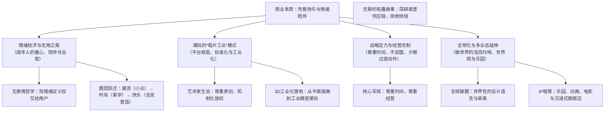

# 【央视《对话》】泡泡玛特王宁：一场关于快乐的商业革命深度总结

> **节目来源**：央视财经《对话》（CCTV-2）2026年3月28日播出（视频链接：[E6uK5kpaUN8](https://www.youtube.com/watch?v=E6uK5kpaUN8)）  
> **对话人物**：王宁（泡泡玛特创始人、董事长兼CEO）、陈伟鸿（央视主持人）  
> **对话实录备查**：[泡泡玛特王宁_2026_央视对话_一场关于快乐的商业革命_对话实录.md](./泡泡玛特王宁_2026_央视对话_一场关于快乐的商业革命_对话实录.md)（逐字还原一问一答、案例细节与现场交锋）
> **特邀嘉宾**：Kenny Wong（Molly创作者/潮玩艺术家王信明）、双双（泡泡玛特资深店长）  
> **核心议题**：情绪经济底层逻辑、潮玩“唱片工业”模式、IP生命周期管理、商业克制与全球化布局。

---

## 核心商业认知与业务全景导图

---

## 一、核心数据与关键里程碑

* **年销量规模**：全集团潮流玩具全球年度销量已**突破 4 亿只**，爆款 IP（如 Labubu、Molly 等）在全球多地引发排队抢购。
* **旗舰店坪效与客流**：上海南京东路城市旗舰店等核心地标门店，**平日周一至周四客流达 1.8万 ~ 2万人次/天，节假日峰值达 4万 ~ 5万人次/天**。
* **十年合作长跑**：旗舰 IP Molly 诞生至今已 20 年；2016 年 4 月 1 日王宁与 Kenny Wong 在香港正式签约合作，携手开创并见证了中国潮玩从极度小众走向百亿大众市场的黄金十年。

---

## 二、深度访谈核心要点提炼

### 1. 情绪经济与“无用之美”的商业本质
* **成年人为何为“无用之物”买单？**
  * “小朋友渴望快点长大，而成年人则渴望回到童年。”
  * 现代社会在满足基础生存和物质需求后，人们在职场与生活中普遍面临压力与孤独。潮玩不提供任何物理功能，却能提供**无条件的陪伴、温暖、治愈与情绪投射**，满足的是当代人极度稀缺的心理慰藉。
* **IP 的“无表情”设计哲学（以 Molly 为例）**：
  * Molly 紧闭嘴巴、略带傲娇的放空神态，其精髓在于**“不设限，把情绪的定义权百分之百留给消费者”**。
  * 用户开心时看着它，觉得它在与自己分享喜悦；伤心难过时看着它，觉得它在默默陪伴与安慰。没有强制植入的单向故事，反而赋予了 IP 最包容、最长久的情感共鸣。
* **用户情绪光谱的精细化裂变**：
  * 从单一形象发展出多元情绪矩阵：如 **Crybaby** 传递“每个人都有痛快哭泣的权利”；**Angry Molly** 释放个性与微愤怒；**小野（Hirono）** 表达内心深处的孤独与自我救赎。不同 IP 对应着用户不同维度的心灵出口。
* **圈层的三次跨越**：
  * **第一层（潮流圈）**：极度小众硬核，满足“我懂你特别”的圈子优越感；
  * **第二层（时尚圈）**：走向更广阔的审美与设计追求，吸引注重生活美学的人群；
  * **第三层（快乐圈）**：打破年龄、职业、国界的界限，回归“快乐”这一人类最底层、最普适的终极刚需。

---

### 2. 潮玩的“唱片工业”模式：艺术家的放大器
* **经典的“唱片工业”隐喻**：
  * 在留声机和黑胶唱片发明前，顶级音乐家只能在少数剧院为权贵演奏；唱片的出现实现了音乐的标准化、工业化复制与广泛传播，才造就了现代流行音乐产业。
  * 泡泡玛特之于当代视觉艺术家、插画师，扮演的正是**“唱片公司”**的角色：发掘头部艺术家，帮助其突破平面手稿局限，完成 3D 建模、工程拆件、模具注塑、防伪涂装、供应链品控，并通过全球门店网络推向大众。
* **平台化机制与创作放权**：
  * 王宁表示自己早已多年不参与具体产品开发；
  * 泡泡玛特建立了一套工业化、标准化的评估与监修机制，**将艺术决策权最大限度还给艺术家本身**，平台负责工程转化与商业化赋能，避免企业因为某一高管的个人偏好而扼杀艺术家的灵性。

---

### 3. 商业智慧与战略定力：“无聊的有趣故事”
* **核心经营法则：尊重时间，尊重经营**：
  * 任何小品类只要深挖到底，都可以诞生伟大的公司。创业初期泡泡玛特是一家杂货潮流集合店，最终选择砍掉全部非核心品类，聚焦潮玩这一极小切口，把一件事做到极致。
* **克制与反常识决策**：
  * **坚决不做加盟**：全部坚持自营，死守门店服务体验、温度传递与品牌调性；
  * **拒绝过度授权与无序扩张**：不赚短平快的授权快钱，严控 IP 曝光质量，防止 IP 资产被过度透支；
  * **资源充沛时的减法哲学**：企业在缺钱时往往能把事情做实，而在资源极度充足时最容易“画蛇添足”、动作过度变形。
* **巡店哲学与细节打磨**：
  * 运营一家卓越的 IP 企业，背后是一连串极其枯燥琐碎的供应链、模具精度、门店陈列、员工培训等基础工作。“把枯燥无聊的功课扎扎实实做好，才能讲出有趣美好的商业故事”。

---

### 4. 从“中国迪士尼”到“世界泡泡玛特”
* **全球化不需要生硬的说教**：
  * 走向世界的文化品牌，不必生搬硬套传统历史符号；Labubu 等 IP 之所以风靡全球（在泰国、东南亚及欧美掀起热潮），靠的是**世界性的设计语言、无国界的美学共鸣与纯粹的快乐传递**。
* **构建复合商业框架（IP 增厚计划）**：
  * 传统的迪士尼依靠百年影视世界观驱动，而新时代的潮玩企业正以自己的节奏构筑护城河：
    1. **城市乐园（Pop Land）**：在线下创造具备沉浸感、可互动的童话物理空间；
    2. **动画与短片**：深化 Labubu、Molly 等角色的世界观与背景故事，让 IP 更有文化厚度；
    3. **多元衍生场景**：覆盖积木、游戏、音乐、艺术策展，形成立体的商业生态圈。
* **当年的梦想 vs 今天的格局**：
  * “创业初期我们曾说要做‘中国的迪士尼’，而今天我们的目标与愿景是做**‘世界的泡泡玛特’**。”

---

### 5. 应对 AI 时代的终极思考
* **技术冲击下的存在价值**：
  * 面对 AI 技术对创作与设计产业的冲击，王宁给出了极具哲学深度的回答：
    > **“科技和技术让我们得以生存，但文化和艺术让我们找到生命的意义。”**
* **不可替代的情感链接**：
  * 无论虚拟数字技术与算力多么发达，人类对真实物质实体的触感、拆开盲盒时的惊喜感、摆在案头的陪伴感，以及真实社交中的情绪流动，永远无法被算法冷冰冰地替代。

---

## 三、投资与商业启示总结对照表

| 核心维度 | 传统商业模式认知 | 泡泡玛特的解题思路 |
| :--- | :--- | :--- |
| **产品属性** | 实用性工具、满足物理功能 | **纯粹的情绪载体、精神抚慰与陪伴**（无用之美） |
| **IP 叙事机制** | 强故事驱动（先有长篇动画/电影再卖玩具） | **强形象与情绪符号驱动**（无表情设计，由消费者主观投射故事） |
| **供应链与平台** | 散漫的作坊式手办制作 | **标准化的“唱片工业”模式**（高精度工业化制造与全球直营渠道） |
| **扩张策略** | 加盟裂变、赚快钱、全品类疯狂授权 | **全直营、强控盘、聚焦单点、高度克制**（尊重时间，尊重经营） |
| **文化出海** | 符号化输出、单向文化灌输 | **全球共通的审美设计与无国界的情绪共振** |
| **终极护城河** | 制造规模、低价内卷 | **跨周期的头部艺术家生态 + 全球高黏性品牌心智** |
