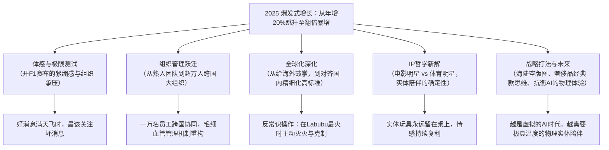

# 【李翔对话王宁】2026，再访泡泡玛特 CEO 王宁：复盘高速增长、组织进化与未来战略

> **访谈来源**：YouTube - 时代回音（时长 45.7 分钟，视频链接：[NojClJvDTHA](https://www.youtube.com/watch?v=NojClJvDTHA)）  
> **对话人物**：王宁（泡泡玛特创始人、董事长兼CEO）、李翔（著名商业作家，《详谈》《因为独特》作者）  
> **对话实录备查**：[泡泡玛特王宁_2026_李翔再访_复盘高速增长与组织战略_对话实录.md](./泡泡玛特王宁_2026_李翔再访_复盘高速增长与组织战略_对话实录.md)（逐字还原一问一答、案例细节与现场交锋）
> **访谈时间节点**：2026年最新深度对谈（距2024年9月前次访谈一年半后，深度复盘2025年全球爆发式增长）  
> **核心议题**：“开F1”极限压力测试、超万人跨国组织进化、海外高标准拉齐、Labubu爆红后的主动“灭火”与克制、IP的“体育明星”定位、海陆空业务版图与AI时代物理陪伴价值。

---

## 核心认知与战略进化全景导图

---

## 一、2025 爆发式增长复盘：“开 F1 赛车”的极限压力测试

* **“只有别人觉得你爽，其实压力极大”**：
  * 外界普遍看到泡泡玛特 2025 年股价暴涨、Labubu 全球破圈、业绩井喷；
  * 但王宁直言，**2025 年是创业以来整个团队最痛苦、压力最大、睡眠最差、身体状态最差的一年**。
* **“开 F1”的极限隐喻**：
  * 过去公司如普通司机，开着车听着音乐看风景，每年保持 20%~30% 的双位数稳健增长；
  * 到了第 15 年，公司被突然推上一辆时速超高的 F1 赛车，以 200% 的增速狂飙。“任何一个零部件的细小失误都会引发严重事故，必须全神贯注、紧绷到极点”。
* **高光下的警醒法则**：
  * **“好消息满天飞的时候，最应该关注坏消息”**。财务报表上的惊人数字往往会掩盖大量管理、交付、供应链和跨国运营的真实隐患。

---

## 二、组织机制跃迁：从“熟人团队”到“超万人跨国大组织”

* **“团队”与“组织”的本质差异**：
  * 过去公司是一群朋友、梁山好汉组成的“团队”，核心高管坐下来开个会就能拍板解决绝大多数问题；
  * 如今公司**员工总数已突破 10,000 人**，业务横跨全球数十个国家与地区，组织像庞大的毛细血管，个人的意志和简单会议沟通已无法覆盖。
* **跨文化跨国界的协同挑战**：
  * 面临不同国家员工的文化背景、法律法规与工作习惯差异；
  * 部门之间、业务线之间、海内外机构之间不可避免会出现“管理之墙”。现代组织比拼的不再是个体能力，而是**“一群人与另一群人”在体系机制保障下的分工协同力**。
* **2026 核心关键词**：
  * **“保持专注，保持初心”（Keep Focus, Keep Real）**。停止盲目做加法，集中优势资源聚焦核心 IP 与基本盘业务。

---

## 三、全球化战略演进：从“给掌声”到“拉齐国内高标准”

* **海外运营的两阶段心态演变**：
  * **0 到 1 阶段（包容与鼓掌）**：只要能在欧洲街角开出一间门店、海外消费者能买到产品，管理层就给予海外团队鲜花与掌声，重在实现突破；
  * **1 到 10 阶段（严苛考核与拉齐标准）**：2025 年全球品牌认知建立后，王宁巡店发现，海外许多门店的装修工程细节、商品陈列管理和服务水平，其实仅相当于国内两三年前的初期水准。
* **穿透漂亮报表抓交付质量**：
  * 哪怕海外单店收入翻倍，如果不解决交付链路中的断点、缺货与服务脱节，全球化就无法沉淀出真正的品牌壁垒。公司开始全力推动海内外运营标准的统一与高精度拉齐。

---

## 四、爆款治理的反常识操作：在 Labubu 最火时主动“灭火”

* **为什么要在 Labubu 现象级爆红时主动克制？**
  * 2025 年泰国王室、知名明星及欧美圈层疯狂抢购 Labubu，市场面临假货冲击、投机炒作和舆论非议；
  * 泡泡玛特高层采取了极度反常识的**主动“灭火”行动**：
    1. **暂缓新品节奏**：将原本规划在 2025 年上市的多款 Labubu 新品直接推迟到 2026 年，避免产品泛滥；
    2. **压缩线下营销**：叫停了多场线下曝光活动，防止过度曝光引发审美疲劳；
    3. **砍掉大量外部授权合作**：严防第三方粗制滥造透支 IP 声誉。
* **克制的底层商业逻辑**：
  * 潮玩属于“非必需品”和精神消费品，并非大众日用快消品；
  * 泡泡玛特当前深度服务的核心拥趸在千万量级，突然涌入数十亿看热闹的泛大众，盲目透支产能去迎合投机需求会毁掉 IP 根基；企业必须优先保证忠实核心粉丝的获得感。

---

## 五、IP 哲学新解：电影明星 vs 体育明星，实体陪伴的不可替代性

* **回应长期质疑：IP 必须先有长篇影视故事吗？**
  * 市场常拿泡泡玛特与迪士尼对比，质疑盲盒 IP 缺乏故事情节；
  * 王宁提出了全新的解题视角：
    * **迪士尼的 IP 像“电影明星”**（如小李子，依靠角色剧情塑造）；
    * **泡泡玛特的 IP 更像“体育明星”**（如梅西，没有预设剧本，依靠真实竞技、纯粹魅力与粉丝情感链接）。
    * 体育明星的商业号召力与精神影响力丝毫不逊色于电影明星，不必强求体育明星去拍一部两小时的电影来证明价值。
* **实体 IP 的复利优势（对抗虚拟幻觉）**：
  * 相比于《黑神话：悟空》或现象级院线电影等虚拟/数字内容，实体潮玩卖出后是一只**实实在在摆在办公桌、床头、背包上的物理存在**；
  * 它每天与用户同处一个物理空间，不间断地加深认知、持续提供无声陪伴与情绪抚慰，这种物理资产的情感复利远超随时会下线的虚拟内容。

---

## 六、未来战略与 AI 时代定力

### 1. 业务版图的“海陆空”协同构想
* **陆军（坚实基本盘）**：潮玩盲盒、核心手办零售与门店网络（目前战斗力最强）；
* **海军（新消费延伸）**：甜品、积木、家居等全新生活方式品类尝试（探索星辰大海）；
* **空军（远程辐射力）**：自研游戏与电影世界观建设。
  * 王宁坦言 2025 年内部在游戏与电影的初次试水并不算成功，但他强调**“相比于把 IP 授权给外部成熟大厂，泡泡玛特更渴望组织自身真正沉淀出做乐园、做电影的底层能力”**，交学费是必经的组织成长之路。

### 2. 借鉴奢侈品“看家本领（经典款）”思维
* 学习耐克经典球鞋、爱马仕/LV 经典手袋的运营之道：
  * 一个健康长青的品牌，必须有 **60% 属于几乎不需要颠覆创新的“看家经典款”**，不断打磨至臻品质并持续产生稳定现金流；在此基础上，用剩余 40% 的资源进行前沿创新与破圈探索。

### 3. AI 时代的人性锚点：极致虚拟呼唤“极致物理”
* 面对未来十年 AI 技术让虚拟体验走向《头号玩家》式的沉浸仿真，王宁给出了泡泡玛特最坚定的护城河认知：
  > **“越是在线上体验被 AI 推向极致的时代，人类在放下手机回归现实时，越需要更舒适的沙发、更温暖的毛绒玩具、更极致的线下乐园体验。”**
* 物理世界的真实触感与情感寄托，是冰冷算法永远无法剥夺的生命体验。

---

## 七、核心对比总结表

| 分析维度 | 外界传统看法 / 2024 年旧认知 | 王宁 2026 深度反思与最新实践 |
| :--- | :--- | :--- |
| **爆发式增长体感** | “年赚百亿、开 F1 赛车极其风光” | **“极限压力测试，全员神经高度紧绷，痛苦与失眠最深的一年”** |
| **管理重心** | 依赖几个高管朋友的小团队快速拍砖 | **重构超万人跨国组织的协作制度与毛细血管机制** |
| **爆款应对（Labubu）** | 趁热打铁、开足马力授权变现、疯狂铺货 | **反常识“灭火”：延后新品、压制营销、拒绝乱授权，保护核心粉丝** |
| **IP 价值逻辑** | 缺乏电影剧本，生命力或昙花一现 | **“体育明星”模式：无剧本但有真实人格魅力；物理实体常年陪伴产生情感复利** |
| **出海运营水准** | “海外业务大获全胜、遍地开花” | **穿透亮眼报表抓交付质量，全力将海外粗放运营拉齐至国内精细标准** |
| **新业务能力追求** | 把 IP 授权给大厂做代工乐园与游戏赚快钱 | **坚持自研并交足学费，追求组织内部真正沉淀出“做乐园与影视的能力”** |
| **AI 时代的定位** | 恐慌潮玩设计是否被 AI 生成图替代 | **加码线下乐园与实体触感：用极具温度的“物理陪伴”对抗虚拟算法** |
