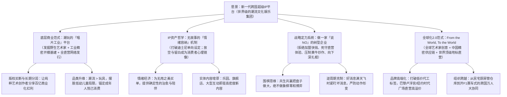

# 【投资内参】泡泡玛特王宁商业思想与十年进化全景图（2016-2026）

> **研究标的**：泡泡玛特（POP MART / 09992.HK）  
> **核心人物**：王宁（创始人、董事长兼 CEO）  
> **研究底稿**：基于 2016—2026 年王宁 7 场关键节点访谈、电视路演、学术沙龙与媒体专访（共计 220+ 分钟原始对话实录系统复盘）  
> **底层索引**：[2016创客中国路演](./泡泡玛特王宁/泡泡玛特王宁_2016_创客中国_从杂货铺到潮玩帝国的生死路演.md) ｜ [2019央美沙龙](./泡泡玛特王宁/泡泡玛特王宁_2019_央美界面沙龙_潮流玩具背后的心理学与设计创新.md) ｜ [2019界面专访](./泡泡玛特王宁/泡泡玛特王宁_2019_界面专访_潮玩帝国与炒盲盒风波回应.md) ｜ [2024新华社扬声](./泡泡玛特王宁/泡泡玛特王宁_2024_新华社扬声_中国潮玩为何风靡全球.md) ｜ [2025央视专访](./泡泡玛特王宁/泡泡玛特王宁_2025_央视专访_探寻新一代中国消费品牌的崛起历程.md) ｜ [2026央视对话](./泡泡玛特王宁/泡泡玛特王宁_2026_央视对话_一场关于快乐的商业革命.md) ｜ [2026李翔再访](./泡泡玛特王宁/泡泡玛特王宁_2026_李翔再访_复盘高速增长与组织战略.md)

---

## 核心商业认知架构图

---

## 一、十年历史镜像：从 6 亿生死路演到 3000 亿跨国霸主

通过王宁 10 年间的公开表达，可以清晰绘制出泡泡玛特完成商业范式跨越的关键坐标：

| 核心维度 | 2016 创业生死转折点（《创客中国》） | 2019-2020 IPO 上市临界点（央美/界面专访） | 2024-2026 全球化爆发期（央视/新华社/李翔再访） |
| :--- | :--- | :--- | :--- |
| **企业定位** | 渠道买手制潮流百货店（POP MART） | 国内潮玩龙头、“盲盒第一股” | **新一代跨国消费品牌、世界级 IP 综合娱乐平台** |
| **资本体量** | 估值 6 亿元（台上苦求融资 6000 万） | 市值千亿港元（上市破千亿后剧烈回调） | **市值突破 3000 亿港元，海外收入超过国内大盘** |
| **门店与渠道** | 12 个城市，仅约 30 家直营小百货店 | 数百家商圈店 + 千台自动售卖机 | **全球数十个国家直营地标店，国内仅克制维持 400 家优质店** |
| **IP 供给模式** | 代理日本 Sonny Angel 占全店销售 50% | 签约买断 Molly，开启工业化盲盒体系 | **Labubu、Molly、Skullpanda、Crybaby 等超头部多核矩阵** |
| **核心危机/考题** | Sonny Angel 代理随时被断，一套钢模 20 万无力承担 | 炒盲盒狂潮、二手高溢价被指“割韭菜/泡沫” | **开 F1 赛车般的跨国组织大考、全供应链月产千万只极限供货** |
| **经营心智** | 渴望活下去，寻找能理解商业本质的激进伯乐 | 防御盲盒标签，向市场证明 IP 平台的独立价值 | **“树的哲学”：尊重时间与经营，极度克制，只做围棋生意** |

---

## 二、商业模式进化：潮玩的“唱片工业”平台

### 1. 为什么砍掉杂货百货，孤注一掷做潮玩？
* **原模式瓶颈**：泡泡玛特早年是典型的潮流买手超市，卖文具、数码周边、杂货，SKU 极多、供应链复杂、毛利率低，生死命脉全系于外部品牌商手中。
* **数据逼出战略聚焦**：2015-2016 年，日本代理玩偶 Sonny Angel 在全国仅 20 多家门店的情况下，单月狂销 8 万只，单品占全店总收入 30%~50%。王宁团队迅速意识到：**消费者买的不是百货杂货，而是一个能带来即时快乐与收集快感的情感载体**。
* **战略做减法**：果断砍掉全部非核心品类，将公司完全转型为潮流玩具平台。

### 2. 独创的“唱片工业”平台化模型
王宁在央美及央视对话中反复阐述了潮玩的“唱片工业”底层逻辑：
* **艺术家的困境**：在留声机与唱片发明前，顶级音乐家只能在贵族剧院演奏；全球独立潮流艺术家（如龙家升、Kenny Wong）的工作室堆满了绝美的画稿与孤品雕塑，但一套高精度注塑模具高达二三十万元，个人根本无力承担工业化量产成本，艺术价值被禁锢在极小圈层。
* **泡泡玛特扮演“唱片公司”角色**：
  1. **星探与签约**：发掘具有世界级美学天赋但被埋没的野生艺术家，以“全版权买断 + 终身销售分成”的形式深度绑定；
  2. **3D 工业化工程化转译**：建立高壁垒的工程部，负责把平面画稿拆解为数十个精密注塑零件、调配搪胶材质、解决工业色差、开模量产；
  3. **全球发行与渠道灌溉**：通过全直营门店、机器人商店、官方线上商城，将小众艺术品瞬间铺向大众消费终端；
  4. **放权与赋能**：管理层坚决不插手具体产品的美学监修，把创作权百分之百留给艺术家，平台只做商业化引擎。

---

## 三、IP 资产哲学：无故事的“情绪容纳”机制

### 1. 颠覆迪士尼：单向投射 vs 情绪容纳
在过去近百年里，商业社会对文化 IP 的认知被迪士尼完全垄断——“必须先砸几千万拍长篇动画/电影，讲一个宏大故事，角色有了性格，再做衍生品变现”。王宁提出了极具穿透力的反叛观点：
* **传统 IP 的“单向投射”**：电影把角色的性格、好坏、命运定死了。你必须认同白雪公主的善良或艾莎的坚韧，才能被动接受这个形象；
* **潮玩 IP 的“情绪容纳”**：Molly 闭着嘴巴、微嘟脸颊的傲娇放空表情，Labubu 露出 9 颗牙齿的古灵精怪，**没有任何既定台词与剧情背景，这是最高境界的“情感留白”**；
* **镜子效应**：它像一面无条件包容的镜子。你升职开心时看它，觉得它在陪你笑；你失恋难过时看它，觉得它在默默抚慰你。在注意力高度碎片化的现代社会，长篇大论的故事门槛太高，而这种“无门槛的情绪容纳”反而能产生极深的心灵陪伴。

### 2. 实体内容即“新故事”
* 外界屡次质疑“没有电影的 IP 会短命”，王宁给出的破局实践是：**线下沉浸式体验就是高密度的新内容**。
* 巴黎卢浮宫店的雕塑展陈、上海旗舰店的排队互动、北京 Pop Land 城市乐园里 Labubu 人偶的一个拥抱……这些直击灵魂的实体交互，比看一部流水线好莱坞电影更能沉淀长效记忆。
* **金矿理论**：从儿童到老人只要能在街头一眼认出 Labubu 或 Molly，认知护城河便已牢不可破。舆论热度会有起伏，但金矿资产永不贬值。

---

## 四、战略定力系统：做一家“说 NO”的树型企业

### 1. 企业的草、花、树三种形态
王宁将企业分为三种成长范式：
* **草型企业**：随风口而起，野蛮疯长，但周期一过瞬间枯黄；
* **花型企业**：在特定时点绽放得极其艳丽，赚足市场眼球，但花期极其短暂，无法穿越季节；
* **树型企业**：在极漫长的时间里默默“向下扎根”。地上的枝叶看似长得慢，但地下的根系（供应链工艺、直营零售网络、数字化系统、版权法务）早已深扎十米。一旦环境出现风雨，它最能抵御严寒；一旦向上生长，其势不可挡。

### 2. 反直觉决策清单（做一家说 NO 的公司）
在面临无数短期暴利诱惑时，泡泡玛特展现了罕见的战略克制：
* **坚决拒绝加盟，死守 100% 全直营**：
  * 加盟能瞬间扩张数千家店、回收巨额加盟费与货款，但加盟商只关心存货周转，无法传递潮玩的美学温度与极致服务；
  * 泡泡玛特国内门店长期克制在 400 余家，宁可很多著名旅游城市（如西双版纳）暂不开店，也绝不盲目稀释单店效益。
* **主动挤出二级市场泡沫，大战黄牛**：
  * 潮玩在二手市场被炒到几十倍溢价，短期看有利于品牌造势，但长期看严重伤害核心粉丝；
  * 泡泡玛特宁愿承受“开启预售后市值短期波动”的代价，也要将每月产能翻倍（“缝纫机踩冒烟”）、完善抽盒预售机制，把利润空间留在正规体系内，坚决保护“真爱粉”。
* **围棋思维 vs 象棋思维**：
  * 传统互联网思维是“象棋思维”，你死我活，吃掉对方的帅才算赢；
  * 潮流文化消费是“围棋思维”，没有敌人，只有共生。做大自己的盘子、孵化更多艺术家、让同行共同繁荣，才能构建出经久不衰的文化生态。

---

## 五、全球化 2.0：新一代中国跨国品牌范式

### 1. “From the World, To the World”全球化公式
区别于传统中国品牌靠“低价内卷、白牌代工、平替出口”的出海老路，泡泡玛特开辟了独一无二的高维出海模型：
$$\text{全球独立艺术家灵感} + \text{中国东莞精密工业基建} + \text{西方顶级商业地标全直营} = \text{高品牌溢价文化出口}$$
* **地标直营打响认知**：出海第一天就避开唐人街或廉价小商城，高举高打进驻法国巴黎卢浮宫、英国伦敦考文特花园、美国纽约时代广场；
* **破除傲慢与偏见**：面对欧美消费者“为什么卖这么贵”的质疑，店员骄傲回答：“因为这是艺术家玩具（Art Toys），它承载了纯粹的美学表达”；面对“这是不是日本品牌”的追问，大声声明：“我们是骄傲的中国品牌”。

### 2. 跨国组织大考：开 F1 赛车的管理体感
* **业务增速超越组织进化**：当海外业务迎来爆发式翻倍增长、海外收入即将超越国内时，企业面临着跨语言、跨文化、跨时区的跨国万人协同大考；
* **在高速中换引擎**：王宁将其形容为“原本在开一辆普通的家用车，突然被换上了 F1 赛车的引擎并推上了国际赛道”，在享受极限推背感的同时，必须极其冷静地紧盯每一个潜在弯道隐患，在好消息满天飞时，管理层必须花 80% 的精力紧盯坏消息。

---

## 六、投资视角：核心认知差与估值重估推演

### 1. 市场的四大核心认知误区 vs 商业本质

| 维度 | 市场常见偏见（Bear 视角） | 底层商业真相（Bull 视角） |
| :--- | :--- | :--- |
| **模式属性** | 以为这是一家“盲盒赌博机制”零售商 | **盲盒只是包装纸，本质是超级 IP 运营平台**。盲盒收入占比已显著降至 50% 以下，搪胶、毛绒挂件、大体雕塑已成多核引擎。 |
| **生命周期** | 以为潮玩是年轻人三分钟热度的速朽玩具 | **IP 具有跨周期的超长半衰期**。Labubu 诞生已 10 年，Molly 已近 20 年，随着初代粉丝成长为社会中坚，客群终身价值（LTV）持续扩容。 |
| **增长天花板** | 以为国内年轻人渗透饱和即见顶 | **全球化与全场景打开十倍空间**。东南亚、欧美出海刚刚进入单店模型复制期；城市乐园、游戏、动画增厚 IP 壁垒，具备“东方迪士尼”级延展性。 |
| **护城河壁垒** | 以为小塑料人偶没有门槛，巨头随时跨界抄袭 | **“审美敏锐度 + 艺术家经纪垄断 + 工业精密开模 + 地标商场进驻背书”构成的复合护城河**。金钱砸得出模具，砸不出下一个王信明与龙家升。 |

### 2. 终局推演与价值锚点
泡泡玛特的终局并非简单的零售企业，而是**以全球超级 IP 为核心资产的文化娱乐帝国**。其商业价值由三层复利引擎驱动：
1. **现金流底盘**：极高毛利（60%+）与稳健单店模型支撑的健康造血能力；
2. **第二增长曲线**：欧美与东南亚自营旗舰店网络的全球化裂变；
3. **生态增厚曲线**：Pop Land 城市乐园的沉浸式实景落地，向全球家庭与跨代际客群渗透。
