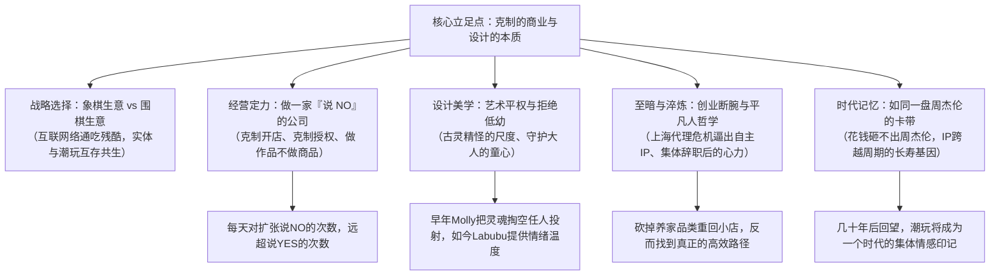

# 【新华社《扬声》第2季】张扬对话王宁：中国潮玩为何能风靡全球深度记录

> **节目来源**：腾讯视频纪录片《扬声 第2季》第3集（时长 51.7 分钟，视频链接：[G9xZVxKKDGI](https://www.youtube.com/watch?v=G9xZVxKKDGI)）  
> **访谈人物**：王宁（泡泡玛特创始人、董事长兼CEO）、张扬（新华社记者、《扬声》主持人）  
> **纪录场景**：泡泡玛特总部全员周一晨会、设计部挂件与包装评审会、北京朝阳公园 Pop Land 城市乐园（首个 Labubu 森林展）、王宁私人办公室与旧物收藏空间  
> **核心议题**：克制商业（说 NO 的公司）、象棋生意 vs 围棋生意、艺术平权与防低幼哲学、创业绝境断腕、招募平凡人做不平凡事、卡带时代记忆与 IP 跨周期生命力。

---

## 核心认知框架导图

---

## 一、战略与经营哲学：“做一家说 NO 的公司”

### 1. “说 NO”的克制才是真正护城河
* **同行追赶 vs 泡泡玛特的日常选择**：
  * 市场上多数竞争对手想要追赶泡泡玛特，每天都在寻找**“说 YES”**的机会：开更多门店、签约更多 IP、疯狂联名授权、多铺货走量；
  * **泡泡玛特却是一家“每天都在说 NO”的公司**：拒绝不符合调性的门店位置、拒绝过度商业化合作、拒绝粗制滥造的外部授权、克制新品上市节奏。“我们每天说 NO 的次数，远远多于说 YES 的次数。克制才是最难的商业能力”。
* **设计公司的本质坚守**：
  * 王宁在全员晨会与评审会上反复强调：**“泡泡玛特本质上是一家设计公司，不是纯粹卖商品的渠道”**；
  * 每个产品必须被当作艺术“作品”而非流水线“商品”，团队绝不能为了应付 KPI “交作业”，哪怕一个细小的手办吊环与包装袋，都必须经历多轮推翻重构。

### 2. 商业棋局观：象棋生意 vs 围棋生意
* **象棋生意（互联网络模式）**：
  * 目标是将死对方、赢者通吃、非生即死，赛道极其惨烈，年轻创作者和中小资本极难存活。
* **围棋生意（实体与潮玩模式）**：
  * “你是麦当劳一年赚 100 亿，我是楼下饺子馆一年赚 100 万，我也不会死掉；到最后只是你的黑子比我的白子多一点点而已。”
  * 潮玩不具备零和博弈属性，彼此百花齐放。早期在资本匮乏时选择做“围棋生意”，才能让企业有足够的耐力稳健活下来、活得久。

---

## 二、产品美学与情绪洞察：成人童心与艺术平权

### 1. 潮流玩具与普通玩具的边界：拒绝“低幼”
* **精妙的审美尺度把控**：
  * 成人潮玩极度考验设计功力，“稍不注意就会从潮流滑向幼稚”；
  * **Labubu 的成功内核**：不是低幼可怜，而是**“古灵精怪、带着一点点搞怪和野性”，可爱而不失个性**，恰好击中了成年人既渴望童趣又拒绝被当成小孩的复杂心理。
* **从“放空”到“热烈”的时代情绪演化**：
  * **早期 Molly（无表情哲学）**：将形象灵魂掏空，不带倾向性，用户开心它便笑、难过它便陪着伤感；
  * **当前阶段（Labubu / 猩猩人 / 小野）**：社会高压下，大众更迫切渴求**“高浓度、热烈、充满陪伴感与治愈感的情绪出口”**，IP 随时代心理变化呈现出更鲜明的情绪张力。

### 2. 艺术平权：让创作回归纯粹表达
* 过去很长时期，青年纯艺术家只能将作品印在盘子、丝巾等日用品上作为配饰，艺术被工具化；
* 潮玩的诞生实现了**“艺术平权”**：剥离所有物理实用功能，让雕塑与插画以立体手办形式直接对话大众，普通人用几十元就能拥有顶级艺术家的原作衍生品。

### 3. “成人儿童化”背后的社会隔阂消融
* 过去社会给成人划定了一道刻板界限：18 岁成年后不能玩滑梯、不能买玩具、不能显露幼稚；
* 泡泡玛特打破了这道心理高墙：**“童心本质上就是好奇心与对美好事物的坚持，这永远不该受年龄限制。”**

---

## 三、创业生死局与至暗时刻：平凡人做不平凡事

访谈中张扬与王宁回顾了泡泡玛特发展史上两段鲜为人知的生死转折：

### 1. 上海首店被断供危机（倒逼诞生自有 IP）
* **危机原点**：泡泡玛特初入上海进驻标杆商场港汇恒隆广场，开业前夕当时的核心日本玩具代理商突然单方面撕毁协议、拒绝供货，该品类占当时全店收入的 **30%**，失去它意味着高昂租金的上海首店将瞬间巨亏。
* **决绝断腕**：王宁没有妥协，宁肯放弃代理、自断臂膀，逼迫团队下定决心**“从做代理转向签约原创艺术家做自主 IP”**，由此飞赴香港签下 Kenny Wong 与 Molly，彻底完成了公司商业模式的底层质变。
* **减法哲学**：不是砍掉不赚钱的业务，而是敢于砍掉当时“最能养家糊口但没有长远未来的业务”，从 500 平大杂货店缩减回 50 平精选小店，反而跑出了超高单店坪效。

### 2. 除夕前夜店员集体辞职（创业心力淬炼）
* 早期北京门店人手紧缺，临近年关店员以给父母买年货为由请求提前发放年终薪酬，公司照付后当晚却收到集体离职短信：“钥匙放在柜台上，明天你自己去开门”；
* 创始团队几人未回家过年，从大年初一亲自轮流站柜台收银、理货。**“做企业不仅拼脑力，更是一场对身体、心理和意志力的漫长重体力活。”**

### 3. 用人与团队文化
* 团队极少招募张扬浮躁、自我膨胀的明星员工，更看重**情绪稳定、朴素本分、能把一件件小事做扎实的人**；
* “没有神仙团队，我们都是平凡的人，靠一件件小事打磨，最终把一群平凡的人历练成了不平凡的人。”

---

## 四、卡带隐喻与跨周期生命力

### 1. “花钱砸不出周杰伦，也砸不出 Labubu”
* 王宁在办公室展示了自己精心收藏的周杰伦早期经典磁带（《八度空间》《范特西》《叶惠美》）与复古随身听；
* 他指出潮玩本质是高度感性的文化创意产业：**商业资本可以复制渠道与工厂，但永远无法纯靠砸钱催生一个周杰伦，也无法纯靠砸钱造出一个受全球狂热追捧的顶级 IP 艺术家**。

### 2. IP 企业的跨周期长青基因
* 多数消费品企业容易被技术颠覆或产品迭代淘汰，但放眼全球，**优秀的顶级 IP 企业（如迪士尼）都极其长寿**；
* IP 或许会经历市场情绪的周期性起伏与高低潮，但一旦融入了一代人的青春记忆，便具备了跨越代际的生命力。
* “几十年后人们回望 2025 年代，大家排队抢购 Labubu、拆盲盒、互换手办的场景，将成为这个时代全球青年最真实美好的共同回忆。”

---

## 五、访谈金句提炼表

| 维度 | 王宁核心原话 / 商业金句 |
| :--- | :--- |
| **经营法则** | “我们是一家说 NO 的公司，每天说 NO 的次数远大于说 YES 的次数。” |
| **赛道格局** | “互联网是象棋生意，必须将死对方；潮玩是围棋生意，你占 100 亿我占 100 万，大家共生共赢。” |
| **产品本质** | “泡泡玛特本质上是一家设计公司，每个手办都必须是独立的作品，绝不是应付差事的商品。” |
| **设计尺度** | “成人潮玩极难把握，稍微不注意就会从潮流滑向幼稚。Labubu 靠的是古灵精怪与一点点搞怪。” |
| **组织理念** | “我们都是平凡人。一群平凡的人把一件件小事做到极致，才能干成不平凡的事。” |
| **IP 价值** | “花钱砸不出周杰伦，也砸不出好艺术家。好的 IP 会穿越周期，成为一个时代的集体记忆。” |
