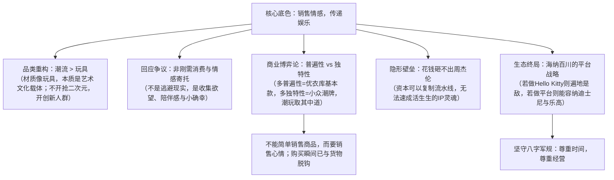

# 【界面新闻专访】泡泡玛特创始人王宁和他的“潮玩帝国”：回应炒盲盒与商业本质

> **访谈来源**：界面新闻专题深度视频专访（时长 15.5 分钟，视频链接：[l9pNJFySAWA](https://www.youtube.com/watch?v=l9pNJFySAWA)）  
> **访谈背景**：2019年下半年（泡泡玛特新三板摘牌备战港股上市、全国掀起“炒盲盒”二手高溢价狂潮、BTS北京潮玩展彻夜排队排爆全网之际）  
> **对话人物**：王宁（泡泡玛特创始人兼CEO）、界面新闻记者  
> **核心议题**：回应“炒盲盒与玩物丧志”质疑、潮流玩具前两字重于后两字、独特性与普遍性的商业博弈、花钱砸不出周杰伦、海纳百川平台战略与乐园/影视早期构想。

---

## 核心商业认知导图

---

## 一、品类本质：“潮流”二字远重于“玩具”二字

1. **品类重新定名背后的逻辑**：
   * 潮玩虽然叫“玩具”，但**前两个字（潮流）远比后两个字（玩具）更重**；
   * 之所以称其为玩具，只是因为它的物理材质（PVC/ABS 注塑）与玩具形态相似；其内核是青年艺术家和设计师的审美表达、文化输出与精神符号。
2. **并未掠夺传统手办与二次元的蛋糕**：
   * 市场常误以为泡泡玛特抢了传统手办的客群；
   * 王宁指出，**买潮玩的大部分受众过去根本不买二次元手办**。泡泡玛特并非在存量二次元市场内卷，而是面向大众都市年轻人开辟了一个**全新的增量品类与用户群体**。

---

## 二、回应“炒盲盒”风波与“玩物丧志”质疑

1. **面对“华而不实”、“玩物丧志”与“逃避现实”的审视**：
   * 2019 年二手交易平台上隐藏款盲盒被爆炒至数十倍、动辄数千元，引发全网大讨论；
   * 王宁坦言：**“潮玩是一件很美好的事情。”** 人们购买潮玩的心态与购买日用品完全不同，它满足的是成年人内心的**收集欲、陪伴感、治愈感与自我犒劳**。
2. **时代转折：非刚需消费的必然崛起**：
   * 在基础生存物质充分满足后，当代年轻人的消费支出天然会向非刚需倾斜——社交、打游戏、买潮玩皆是如此；
   * 盲盒是体验的载体，“未知与好奇心”是人类探索世界的天性。**“在盒子被拆开的一瞬间，用户获得的惊喜心情，其实已经超越了那个物理塑料商品本身。”**

---

## 三、商业本质博弈论：普遍性 vs 独特性

王宁首次提出了关于品牌与品类的**“独特性与普遍性博弈模型”**：

| 商业取向 | 代表形态 | 特征与局限 |
| :--- | :--- | :--- |
| **极致追求普遍性**（牺牲独特性） | **优衣库 / 基本款** | 受众极广、体量极大，但缺乏强烈的情感波澜与个性符号 |
| **极致追求独特性**（牺牲普遍性） | **独立潮牌 / 艺术孤品** | 调性极高、极度小众，但难以规模化做大，受众天花板极低 |
| **泡泡玛特的解法** | **大众化潮流玩具（Art Toy）** | **兼具艺术家的独特个性表达，又通过标准化工业量产与平价盲盒赋予普适性** |

* **销售情感，传递娱乐**：
  * **“未来商业一定不能仅仅去销售商品，而应该去销售情感；不能仅仅去传递货物，而应该去传递娱乐。”** 盲盒正是这种理念的具象化落地。

---

## 四、巨头防线：为什么资本“花钱砸不出周杰伦”？

面对“传统资本与消费巨头是否能轻易复制泡泡玛特”的追问，王宁阐释了潮玩的核心隐形壁垒：

* **理性计算的失效**：
  * 传统工业品只要花钱建厂、砸钱营销、铺开渠道，就能快速复制成功模型；
  * 但潮玩行业背后是一群拥有独立灵魂的艺术家、活生生的 IP 形象，以及长年累月沉淀在受众心中的情感认同。
* **周杰伦比喻**：
  > **“就像你花钱，不可能再造一个周杰伦一样。这个事情跟花钱多少没有绝对关系。”** 艺术家的灵气、人设的魅力与受众的情感投射，绝非资本能够在实验室里理性算计出来的。
* **经营定力八字诀**：
  * 王宁重申创业核心守则：**“尊重时间，尊重经营”**。创业失败的企业，要么妄图违背时间规律拔苗助长，要么忽视了最琐碎的日常精细化经营。

---

## 五、生态终局：海纳百川的平台型战略

1. **去竞争化的平台思维**：
   * 如果把自己做成单一 IP 企业（如 Hello Kitty），那么迪士尼、LINE FRIENDS、三丽鸥等所有 IP 巨头立刻变成死敌；
   * 泡泡玛特的战略定位是**“海纳百川的基础设施平台”**：
     * 门店不仅卖自研 IP（Molly、Labubu），还引入乐高（LEGO）、万代（Bandai）、迪士尼等经典品牌合作；
     * **不做任何文化巨头的敌人，做所有 IP 和品牌的放大器**，帮助各个行业与品牌增加独特性。
2. **大电影与主题乐园的早期构想（2019 原点）**：
   * 访谈中记者问及是否会效仿迪士尼反向进军大电影或主题乐园；
   * 王宁当时便明确表示：**“不排除制作大电影与线下乐园的可能性。”** 但他强调好动画需要 3~5 年的极度耐心，绝不为了蹭热度仓促上马，只有平台拥有足够的包容度与时间耐心，才能最终汇聚成一片商业大海。

---

## 六、核心语录提炼

| 议题 | 王宁核心原话 / 商业金句 |
| :--- | :--- |
| **品类本质** | “潮流玩具前两个字比后两个字重，材质像玩具，本质是推广设计与文化。” |
| **用户群拓荒** | “买潮玩的人很多以前根本不买二次元手办，我们开辟的是全新的大众增量人群。” |
| **消费逻辑** | “不能简单销售商品，而要销售情感；不能简单传递货物，而要传递娱乐。” |
| **核心壁垒** | “花钱砸不出周杰伦，也砸不出活生生的 IP 形象，这道隐形壁垒跟钱没关系。” |
| **竞争定位** | “做 Hello Kitty 则处处是敌人；做海纳百川的平台，则所有人都是合作伙伴。” |
| **创业原则** | “所有创业失败的企业，要么不尊重时间，要么不尊重经营。” |
