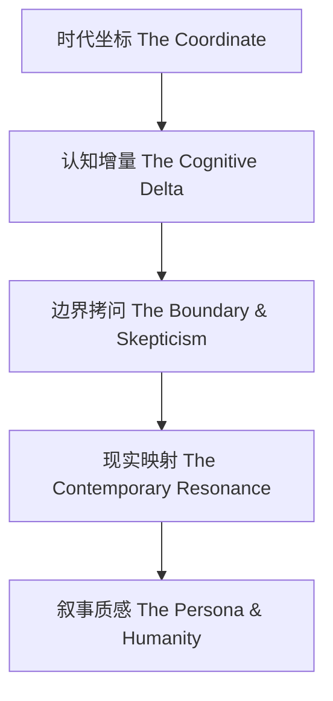

# 商业与投资书评写作框架

## 一、 框架定位与写作理念

本框架用于指导撰写高质量、高穿透力的商业与投资类书籍深度书评。

普通的读书笔记只回答**“这本书讲了什么”**，而专业的财经书评必须回答：
1. **“为什么是他在那个时代提出这个观点？”**（时代与角色）
2. **“它打破了什么认知偏见，底层模型是什么？”**（认知增量）
3. **“它在什么前提下会失效？有哪些幸存者偏差？”**（边界拷问）
4. **“今天读它，对当下的投资决策有何指导意义？”**（现实映射）

### 目标与原则
- **有深度**：拒绝浮于表面的金句拼凑与目录摘要，直击商业本质与资本市场底层规律；
- **有批判**：不盲目给大师造神，客观剥离“时代红利（Beta）”与“个人能力（Alpha）”；
- **有网感（新媒体适配）**：篇幅严格控制在 **2500字以内**（5~8分钟阅读时长），段落简练，逻辑层层递进；
- **能落地**：必须沉淀为可执行的认知工具、排雷清单或决策模型（回答“So What?”）。

---

## 二、 核心方法论：五维穿透模型

撰写任何一篇财经书评，均需按照以下五个维度进行审视与拆解：

### 1. 时代坐标（The Coordinate）：还原历史切片与动机
- **宏观周期**：作者写书时，经济处于繁荣期、大萧条底部、技术革命初期，还是流动性危机中？
- **时代论战**：作者试图打破当时华尔街/商业界的何种主流共识？
- **知行角色（Skin in the Game）**：作者是象牙塔学者、贩卖焦虑的畅销书作家，还是真金白银在战壕搏杀过的操盘手？

### 2. 认知增量（The Cognitive Delta）：底层模型与“非共识”
- **颠覆常识**：指出大众以为的“A”为什么实际上是“B”（例如：热门高科技赛道容易亏钱，无人问津的垃圾传统行业反而出超级牛股）；
- **核心模型**：提炼出作者最经典的方法论或公式（如 PEG 估值模型、沙漠之花、护城河法则、两分钟电梯测验）。

### 3. 边界拷问（The Boundary & Skepticism）：证伪性与局限性
- **Beta vs Alpha**：作者的传奇战绩，有多少是时代和国运的赐予？
- **不可复制性**：方法论是否建立在常人无法达到的极端条件上（如肉身苦修调研、全天候高压跟踪）？
- **制度依赖**：成熟市场的成功经验，直接搬到新兴市场会发生怎样的水土不服？
- **宏观与微观盲区**：是否存在对宏观风险的过度轻视，或对历史经验的路径依赖？

### 4. 现实映射（The Contemporary Resonance）：当代投射与工具化（“So What?”）
- **照妖镜功能**：用书中的逻辑去照射当下的市场热点、热门泡沫与行业困局；
- **实操转化**：为读者提炼出 2~3 条立即可用的实操法则、避坑清单（Checklist）或选股排雷指标。

### 5. 叙事质感与人性观照（The Persona & Humanity）
- **真诚度**：作者是给自己涂脂抹粉立庙，还是坦白了自己最狼狈的失败与体制妥协？
- **底色留白**：揭示商业决策背后的贪婪、恐惧、知止与人生取舍。

---

## 三、 公众号/新媒体风格调优标准

为了适配微信公众号等新媒体平台的读者阅读习惯，行文需遵循以下规则：

| 维度 | 传统书评 / 学术书评 | 公众号优质财经书评 |
| :--- | :--- | :--- |
| **开头（Hook）** | 交代书名、作者、出版社及出版年月 | **直接抛出认知冲突或戏剧性现场**（如：股灾那天地板价割肉的残酷真相） |
| **段落与节奏** | 5~8 行长段落，论证繁复 | **每个自然段 2~3 句话**，多用短句，重点结论独立成行加粗 |
| **语言风格** | 抽象专业术语居多 | **大白话讲透硬核逻辑**，多用生动比喻（“沙漠之花”、“增量踩踏”、“打折拾荒”） |
| **小标题** | 第一章/第二章，或按内容概述 | **观点型小标题**（标题本身就是一个反直觉的洞见） |
| **结尾（Outro）** | 概括全书主旨，推荐购买 | **上升至商业认知与人性取舍**，引发读者心智共鸣与转发欲 |

---

## 四、 标准行文模板与字数分配（总字数控制：1800~2300字）

1. **破题痛点（约 200~300 字）**：
   - 制造反差：抛出大众常识与作者真实操作的戏剧性矛盾，撕掉鸡汤外衣。
2. **第一部分：时代切片与真金白银的战壕（约 400 字）**：
   - 时代宏观背景 + 操盘手身份约束（解释为什么不能神化大师）。
3. **第二部分：穿透常识的核心商业模型（约 600 字）**：
   - 聚焦 1~2 个最震撼人心的底层武器，讲透“为什么这样能赚大钱”。
4. **第三部分：冷静卸妆——不可复制的盲区与代价（约 400 字）**：
   - 批判性思考：时代红利、个人透支代价与水土不服。
5. **第四部分：回到今天——当下存量市场的生存指南（约 400 字）**：
   - 给读者提炼 2~3 条可直接落地的实操法则。
6. **结尾金句（约 150 字）**：
   - 回归人性与纪律，形成强有力的定性结语。

---

## 五、 写作前自查清单（Checklist）

- [ ] 是否在开头 30 秒内给出了让读者想读下去的悬念或认知冲突？
- [ ] 是否指出了作者成功背后的“时代红利（Beta）”？
- [ ] 是否提炼出至少 1 个反直觉的商业/投资模型，并用通俗语言讲透？
- [ ] 是否指出了该理论在当下可能失效的前提和边界？
- [ ] 是否回答了“在今天的市场中，普通投资者到底该怎么用”？
- [ ] 全文字数是否严格控制在 2500 字以内？
